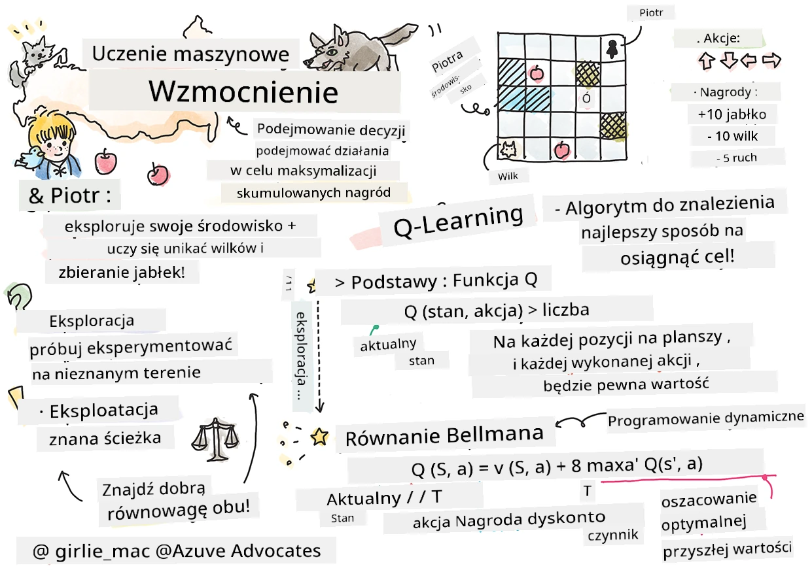
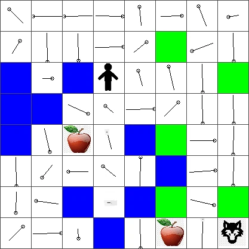

# Wprowadzenie do uczenia ze wzmocnieniem i Q-Learningu


> Sketchnote autorstwa [Tomomi Imura](https://www.twitter.com/girlie_mac)

Uczenie ze wzmocnieniem obejmuje trzy ważne pojęcia: agenta, pewne stany oraz zestaw akcji dla każdego stanu. Poprzez wykonanie akcji w określonym stanie agent otrzymuje nagrodę. Ponownie wyobraź sobie grę komputerową Super Mario. Jesteś Mario, znajdujesz się na poziomie gry, stojąc tuż przy krawędzi przepaści. Nad tobą jest moneta. Ty, jako Mario, na poziomie gry, w określonej pozycji ... to jest twój stan. Przesunięcie się o krok w prawo (akcja) spowoduje, że spadniesz z krawędzi, co da ci niski wynik liczbowy. Naciśnięcie przycisku skoku pozwoli ci zdobyć punkt i pozostać przy życiu. To jest pozytywny rezultat, za który powinna być przyznana dodatnia wartość liczbową.

Korzystając z uczenia ze wzmocnieniem i symulatora (gry), możesz nauczyć się grać maksymalizując nagrodę, którą jest pozostanie przy życiu i zdobycie jak największej liczby punktów.

[](https://www.youtube.com/watch?v=lDq_en8RNOo)

> 🎥 Kliknij obraz powyżej, aby posłuchać Dmitry'ego omawiającego uczenie ze wzmocnieniem

## [Quiz przed wykładem](https://ff-quizzes.netlify.app/en/ml/)

## Wymagania wstępne i konfiguracja

W tej lekcji będziemy eksperymentować z kodem w Pythonie. Powinieneś być w stanie uruchomić kod z notatnika Jupyter z tej lekcji, zarówno na swoim komputerze, jak i w chmurze.

Możesz otworzyć [notatnik lekcji](https://github.com/microsoft/ML-For-Beginners/blob/main/8-Reinforcement/1-QLearning/notebook.ipynb) i przejść przez tę lekcję, aby zbudować projekt.

> **Uwaga:** Jeśli otwierasz ten kod z chmury, musisz również pobrać plik [`rlboard.py`](https://github.com/microsoft/ML-For-Beginners/blob/main/8-Reinforcement/1-QLearning/rlboard.py), który jest używany w kodzie notatnika. Dodaj go do tego samego katalogu co notatnik.

## Wprowadzenie

W tej lekcji poznamy świat **[Piotrusia i Wilka](https://pl.wikipedia.org/wiki/Piotruś_i_wilk)**, zainspirowany muzyczną baśnią rosyjskiego kompozytora, [Siergieja Prokofjewa](https://pl.wikipedia.org/wiki/Siergiej_Prokofjew). Użyjemy **uczenia ze wzmocnieniem**, aby pozwolić Piotrusiowi eksplorować środowisko, zbierać smaczne jabłka i unikać wilka.

**Uczenie ze wzmocnieniem** (RL) to technika uczenia, która pozwala nauczyć optymalne zachowanie **agenta** w pewnym **środowisku** poprzez przeprowadzenie wielu eksperymentów. Agent w tym środowisku powinien mieć jakiś **cel**, określony przez **funkcję nagrody**.

## Środowisko

Dla uproszczenia rozważmy świat Piotrusia jako kwadratową planszę o rozmiarze `width` x `height`, taką jak ta:


Każde pole na tej planszy może być:

* **ziemią**, po której Piotruś i inne stworzenia mogą chodzić.
* **wodą**, po której oczywiście nie można chodzić.
* **drzewem** lub **trawą**, miejscem, gdzie można odpocząć.
* **jabłkiem**, które oznacza coś, co Piotruś chętnie znajdzie, żeby się nakarmić.
* **wilkiem**, który jest niebezpieczny i powinien być omijany.

Istnieje osobny moduł Pythona, [`rlboard.py`](https://github.com/microsoft/ML-For-Beginners/blob/main/8-Reinforcement/1-QLearning/rlboard.py), który zawiera kod do pracy z tym środowiskiem. Ponieważ ten kod nie jest istotny do zrozumienia naszych koncepcji, zaimportujemy moduł i użyjemy go do stworzenia przykładowej planszy (blok kodu 1):

```python
from rlboard import *

width, height = 8,8
m = Board(width,height)
m.randomize(seed=13)
m.plot()
```

Ten kod powinien wyświetlić obraz środowiska podobny do powyższego.

## Akcje i polityka

W naszym przykładzie celem Piotrusia będzie znalezienie jabłka, unikając wilka i innych przeszkód. W tym celu może on po prostu chodzić aż znajdzie jabłko.

Dlatego w każdej pozycji może wybrać jedną z następujących akcji: w górę, w dół, w lewo i w prawo.

Zdefiniujemy te akcje jako słownik, mapując je do par odpowiadających zmian współrzędnych. Na przykład ruch w prawo (`R`) będzie odpowiadać parze `(1,0)`. (blok kodu 2):

```python
actions = { "U" : (0,-1), "D" : (0,1), "L" : (-1,0), "R" : (1,0) }
action_idx = { a : i for i,a in enumerate(actions.keys()) }
```

Podsumowując, strategia i cel tego scenariusza wyglądają następująco:

- **Strategia**, naszego agenta (Piotrusia), jest określona przez tzw. **politykę**. Polityka to funkcja, która zwraca akcję dla dowolnego stanu. W naszym przypadku stan problemu jest reprezentowany przez planszę, włączając w to aktualną pozycję gracza.

- **Cel** uczenia ze wzmocnieniem to w końcu nauczyć się dobrej polityki, która pozwoli rozwiązać problem efektywnie. Jako punkt wyjścia rozważmy najprostszą politykę zwaną **losowym spacerem**.

## Losowy spacer

Najpierw rozwiążmy nasz problem implementując strategię losowego spaceru. Przy losowym spacerze losowo wybierzemy następną akcję spośród dozwolonych, aż dotrzemy do jabłka (blok kodu 3).

1. Zaimplementuj losowy spacer za pomocą poniższego kodu:

    ```python
    def random_policy(m):
        return random.choice(list(actions))
    
    def walk(m,policy,start_position=None):
        n = 0 # liczba kroków
        # ustaw początkową pozycję
        if start_position:
            m.human = start_position 
        else:
            m.random_start()
        while True:
            if m.at() == Board.Cell.apple:
                return n # sukces!
            if m.at() in [Board.Cell.wolf, Board.Cell.water]:
                return -1 # zjedzony przez wilka lub utonął
            while True:
                a = actions[policy(m)]
                new_pos = m.move_pos(m.human,a)
                if m.is_valid(new_pos) and m.at(new_pos)!=Board.Cell.water:
                    m.move(a) # wykonaj właściwy ruch
                    break
            n+=1
    
    walk(m,random_policy)
    ```

    Wywołanie `walk` powinno zwrócić długość odpowiadającej ścieżki, która może się różnić w zależności od próby. 

1. Uruchom eksperyment spaceru wielokrotnie (np. 100 razy) i wypisz uzyskane statystyki (blok kodu 4):

    ```python
    def print_statistics(policy):
        s,w,n = 0,0,0
        for _ in range(100):
            z = walk(m,policy)
            if z<0:
                w+=1
            else:
                s += z
                n += 1
        print(f"Average path length = {s/n}, eaten by wolf: {w} times")
    
    print_statistics(random_policy)
    ```

    Zauważ, że średnia długość ścieżki to około 30-40 kroków, co jest całkiem sporo, biorąc pod uwagę, że średnia odległość do najbliższego jabłka wynosi około 5-6 kroków.

    Możesz też zobaczyć, jak wygląda ruch Piotrusia podczas losowego spaceru:

    

## Funkcja nagrody

Aby nasza polityka była bardziej inteligentna, musimy rozpoznać, które ruchy są „lepsze” od innych. W tym celu musimy zdefiniować nasz cel.

Cel może być zdefiniowany za pomocą **funkcji nagrody**, która zwraca pewną wartość punktową dla każdego stanu. Im wyższa liczba, tym lepsza nagroda. (blok kodu 5)

```python
move_reward = -0.1
goal_reward = 10
end_reward = -10

def reward(m,pos=None):
    pos = pos or m.human
    if not m.is_valid(pos):
        return end_reward
    x = m.at(pos)
    if x==Board.Cell.water or x == Board.Cell.wolf:
        return end_reward
    if x==Board.Cell.apple:
        return goal_reward
    return move_reward
```

Ciekawą rzeczą dotyczącą funkcji nagrody jest to, że w większości przypadków *otrzymujemy znaczącą nagrodę dopiero na końcu gry*. Oznacza to, że nasz algorytm powinien w jakiś sposób zapamiętać „dobre” kroki prowadzące do pozytywnej nagrody na końcu i zwiększyć ich wagę. Podobnie, wszystkie ruchy prowadzące do złych rezultatów powinny zostać zniechęcone.

## Q-Learning

Algorytm, który tutaj omówimy, nazywa się **Q-Learning**. W tym algorytmie polityka jest definiowana przez funkcję (lub strukturę danych) zwaną **Q-Table**. Rejestruje ona „jakość” każdej akcji w danym stanie.

Nazywa się ją Q-Table, ponieważ wygodnie jest ją reprezentować jako tabelę lub wielowymiarową tablicę. Ponieważ nasza plansza ma wymiary `width` x `height`, możemy reprezentować Q-Table używając tablicy numpy o kształcie `width` x `height` x `len(actions)`: (blok kodu 6)

```python
Q = np.ones((width,height,len(actions)),dtype=np.float)*1.0/len(actions)
```

Zwróć uwagę, że inicjalizujemy wszystkie wartości Q-Table równą wartością, w naszym przypadku - 0.25. Odpowiada to polityce „losowego spaceru”, ponieważ wszystkie ruchy w każdym stanie są równie dobre. Możemy przekazać Q-Table do funkcji `plot`, aby zwizualizować tabelę na planszy: `m.plot(Q)`.


W centrum każdej komórki znajduje się „strzałka” wskazująca preferowany kierunek ruchu. Ponieważ wszystkie kierunki są równe, wyświetlany jest punkt.

Teraz musimy uruchomić symulację, eksplorować środowisko i nauczyć się lepszego rozkładu wartości w Q-Table, co pozwoli nam szybciej znaleźć drogę do jabłka.

## Istota Q-Learningu: Równanie Bellmana

Po rozpoczęciu ruchu każda akcja będzie miała odpowiadającą nagrodę, tzn. teoretycznie możemy wybrać następną akcję na podstawie najwyższej bezpośredniej nagrody. Jednak w większości stanów ruch nie doprowadzi do osiągnięcia celu, jakim jest dotarcie do jabłka, więc nie możemy od razu zdecydować, który kierunek jest lepszy.

> Pamiętaj, że liczy się nie natychmiastowy wynik, lecz wynik końcowy, który uzyskamy na końcu symulacji.

Aby uwzględnić tę opóźnioną nagrodę, musimy użyć zasad **[programowania dynamicznego](https://pl.wikipedia.org/wiki/Programowanie_dynamiczne)**, które pozwala rozważać problem rekurencyjnie.

Załóżmy, że jesteśmy teraz w stanie *s* i chcemy przejść do następnego stanu *s'*. W ten sposób otrzymamy natychmiastową nagrodę *r(s,a)*, zdefiniowaną przez funkcję nagrody, plus pewną przyszłą nagrodę. Jeśli założymy, że nasza Q-Table poprawnie odzwierciedla „atrakcyjność” każdej akcji, to w stanie *s'* wybierzemy akcję *a*, która odpowiada maksymalnej wartości *Q(s',a')*. Zatem najlepsza możliwa przyszła nagroda w stanie *s* będzie zdefiniowana jako `max`<sub>a'</sub>*Q(s',a')* (maksimum tutaj jest liczone po wszystkich możliwych akcjach *a'* w stanie *s'*).

To daje **wzór Bellmana** do obliczenia wartości Q-Table w stanie *s*, wykonując akcję *a*:


Tutaj γ to tzw. **współczynnik dyskontujący**, który określa, w jakim stopniu powinieneś woleć nagrodę obecną nad przyszłą i odwrotnie.

## Algorytm uczenia

Mając powyższe równanie, możemy teraz napisać pseudokod dla naszego algorytmu uczenia:

* Zainicjalizuj Q-Table Q równymi wartościami dla wszystkich stanów i akcji
* Ustaw współczynnik uczenia α ← 1
* Powtarzaj symulację wiele razy
   1. Zacznij od losowej pozycji
   1. Powtarzaj
        1. Wybierz akcję *a* w stanie *s*
        2. Wykonaj akcję, przechodząc do nowego stanu *s'*
        3. Jeśli nastąpi warunek zakończenia gry lub suma nagród jest zbyt mała - zakończ symulację  
        4. Oblicz nagrodę *r* w nowym stanie
        5. Zaktualizuj funkcję Q według wzoru Bellmana: *Q(s,a)* ← *(1-α)Q(s,a)+α(r+γ max<sub>a'</sub>Q(s',a'))*
        6. *s* ← *s'*
        7. Zaktualizuj sumę nagród i zmniejsz α.

## Eksploatacja vs. eksploracja

W powyższym algorytmie nie określiliśmy dokładnie, jak wybrać akcję w kroku 2.1. Jeśli wybieramy akcję losowo, będziemy losowo **eksplorować** środowisko, i jest duże prawdopodobieństwo, że często zginiesz oraz będziesz eksplorować obszary, gdzie normalnie byś nie poszedł. Alternatywne podejście to **eksploatacja** wartości w Q-Table, które już znamy i wybieranie najlepszej akcji (z wyższą wartością Q) w stanie *s*. To jednak uniemożliwia eksplorację innych stanów i istnieje duże prawdopodobieństwo, że nie znajdziemy optymalnego rozwiązania.

Dlatego najlepiej jest zachować równowagę między eksploracją i eksploatacją. Można to osiągnąć, wybierając akcję w stanie *s* z prawdopodobieństwami proporcjonalnymi do wartości w Q-Table. Na początku, gdy wartości Q-Table są wszystkie takie same, będzie to odpowiadać losowemu wyborowi, ale w miarę poznawania środowiska bardziej prawdopodobne będzie podążanie optymalną ścieżką, umożliwiając agentowi od czasu do czasu wybrać nieznaną ścieżkę.

## Implementacja w Pythonie

Jesteśmy gotowi, aby zaimplementować algorytm uczenia. Zanim to zrobimy, potrzebujemy funkcji, która przekształci dowolne liczby w Q-Table na wektor prawdopodobieństw odpowiadających akcjom.

1. Stwórz funkcję `probs()`:

    ```python
    def probs(v,eps=1e-4):
        v = v-v.min()+eps
        v = v/v.sum()
        return v
    ```

    Dodajemy kilka `eps` do oryginalnego wektora, aby uniknąć dzielenia przez 0 w początkowym przypadku, gdy wszystkie składowe wektora są identyczne.

Uruchom algorytm uczenia przez 5000 eksperymentów, zwanych też **epokami**: (blok kodu 8)
```python
    for epoch in range(5000):
    
        # Wybierz punkt początkowy
        m.random_start()
        
        # Rozpocznij podróż
        n=0
        cum_reward = 0
        while True:
            x,y = m.human
            v = probs(Q[x,y])
            a = random.choices(list(actions),weights=v)[0]
            dpos = actions[a]
            m.move(dpos,check_correctness=False) # pozwalamy graczowi poruszać się poza planszą, co kończy epizod
            r = reward(m)
            cum_reward += r
            if r==end_reward or cum_reward < -1000:
                lpath.append(n)
                break
            alpha = np.exp(-n / 10e5)
            gamma = 0.5
            ai = action_idx[a]
            Q[x,y,ai] = (1 - alpha) * Q[x,y,ai] + alpha * (r + gamma * Q[x+dpos[0], y+dpos[1]].max())
            n+=1
```

Po wykonaniu tego algorytmu Q-Table powinna zostać zaktualizowana o wartości określające atrakcyjność różnych akcji na każdym kroku. Możemy spróbować zwizualizować Q-Table, rysując wektor w każdej komórce, który wskaże pożądany kierunek ruchu. Dla uproszczenia rysujemy małe kółko zamiast grotu strzałki.



## Sprawdzanie polityki

Ponieważ Q-Table wskazuje „atrakcyjność” każdej akcji w każdym stanie, łatwo jest użyć jej do określenia efektywnej nawigacji w naszym świecie. W najprostszym przypadku możemy wybrać akcję odpowiadającą najwyższej wartości w Q-Table: (blok kodu 9)

```python
def qpolicy_strict(m):
        x,y = m.human
        v = probs(Q[x,y])
        a = list(actions)[np.argmax(v)]
        return a

walk(m,qpolicy_strict)
```


> Jeśli spróbujesz powyższego kodu kilka razy, możesz zauważyć, że czasami "zawiesza się" i musisz nacisnąć przycisk STOP w notatniku, aby go przerwać. Dzieje się tak, ponieważ mogą istnieć sytuacje, gdy dwa stany "wskazują" na siebie nawzajem pod względem optymalnej wartości Q, w takim przypadku agent kończy poruszając się między tymi stanami w nieskończoność.

## 🚀Wyzwanie

> **Zadanie 1:** Zmodyfikuj funkcję `walk`, aby ograniczyć maksymalną długość ścieżki do określonej liczby kroków (na przykład 100) i obserwuj, jak powyższy kod od czasu do czasu zwraca tę wartość.

> **Zadanie 2:** Zmodyfikuj funkcję `walk`, tak aby nie wracała do miejsc, w których już wcześniej była. Zapobiegnie to zapętleniu się funkcji `walk`, jednak agent nadal może zostać "uwięziony" w miejscu, z którego nie będzie mógł uciec.

## Nawigacja

Lepsza polityka nawigacyjna to taka, którą stosowaliśmy podczas treningu – łączy ona eksploatację i eksplorację. W tej polityce wybieramy każdą akcję z pewnym prawdopodobieństwem, proporcjonalnym do wartości w Q-Table. Taka strategia może nadal powodować, że agent wróci do już zwiedzonej pozycji, ale jak widać z poniższego kodu, skutkuje bardzo krótką średnią ścieżką do pożądanego miejsca (pamiętaj, że `print_statistics` uruchamia symulację 100 razy): (blok kodu 10)

```python
def qpolicy(m):
        x,y = m.human
        v = probs(Q[x,y])
        a = random.choices(list(actions),weights=v)[0]
        return a

print_statistics(qpolicy)
```

Po uruchomieniu tego kodu powinieneś otrzymać znacznie krótszą średnią długość ścieżki niż wcześniej, w zakresie 3-6.

## Analiza procesu uczenia się

Jak wspomnieliśmy, proces uczenia się jest równowagą między eksploracją a eksploatacją zdobytej wiedzy o strukturze przestrzeni problemu. Widzieliśmy, że wyniki uczenia (umiejętność pomocy agentowi w znalezieniu krótkiej ścieżki do celu) poprawiły się, ale warto również obserwować, jak średnia długość ścieżki zachowuje się podczas procesu uczenia:


Można podsumować naukę następująco:

- **Średnia długość ścieżki wzrasta**. Możemy zauważyć, że na początku średnia długość ścieżki rośnie. Wynika to prawdopodobnie z faktu, że gdy nic nie wiemy o środowisku, prawdopodobnie utknęliśmy w złych stanach, wodzie lub wilku. W miarę jak uczymy się więcej i zaczynamy wykorzystywać tę wiedzę, możemy eksplorować środowisko dłużej, ale nadal nie znamy zbyt dobrze lokalizacji jabłek.

- **Długość ścieżki maleje wraz z nauką**. Gdy nauczymy się wystarczająco dużo, agentowi łatwiej jest osiągnąć cel, a długość ścieżki zaczyna się skracać. Nadal jednak pozostajemy otwarci na eksplorację, więc często odbiegamy od najlepszej ścieżki, próbując różnych opcji, co wydłuża ścieżkę ponad optymalną długość.

- **Długość gwałtownie rośnie**. Co również obserwujemy na tym wykresie, to nagły wzrost długości ścieżki w pewnym momencie. Wskazuje to na stochastyczny charakter procesu, a także na to, że możemy w pewnym momencie "zepsuć" współczynniki w Q-Table, nadpisując je nowymi wartościami. Idealnie powinno się to minimalizować poprzez zmniejszenie współczynnika uczenia (na przykład pod koniec treningu, aktualizujemy wartości w Q-Table tylko o małą wartość).

Ogólnie rzecz biorąc, ważne jest, aby pamiętać, że sukces i jakość procesu uczenia się w dużej mierze zależy od parametrów, takich jak współczynnik uczenia, spadek współczynnika uczenia i współczynnik dyskonta. Często nazywane są to **hiperparametrami**, aby odróżnić je od **parametrów**, które optymalizujemy podczas treningu (na przykład współczynniki Q-Table). Proces znajdowania najlepszych wartości hiperparametrów nazywa się **optymalizacją hiperparametrów** i zasługuje na osobny temat.

## [Quiz po wykładzie](https://ff-quizzes.netlify.app/en/ml/)

## Zadanie  
[Bardziej realistyczny świat](assignment.md)

---

<!-- CO-OP TRANSLATOR DISCLAIMER START -->
**Zastrzeżenie**:
Niniejszy dokument został przetłumaczony za pomocą usługi tłumaczenia AI [Co-op Translator](https://github.com/Azure/co-op-translator). Choć dążymy do dokładności, prosimy pamiętać, że automatyczne tłumaczenia mogą zawierać błędy lub niedokładności. Oryginalny dokument w jego języku źródłowym należy uznawać za autorytatywne źródło. W przypadku informacji krytycznych zalecane jest skorzystanie z profesjonalnego tłumaczenia wykonanego przez człowieka. Nie ponosimy odpowiedzialności za jakiekolwiek nieporozumienia lub błędne interpretacje wynikające z użycia tego tłumaczenia.
<!-- CO-OP TRANSLATOR DISCLAIMER END -->