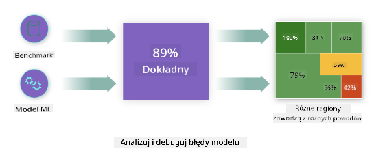
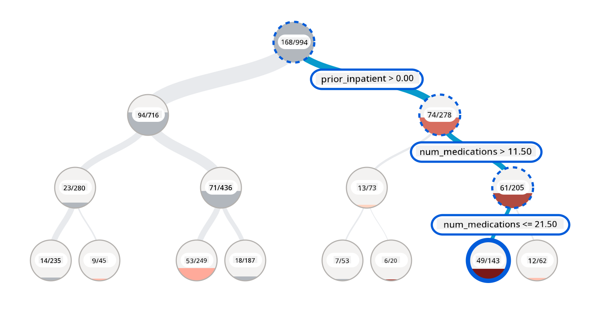
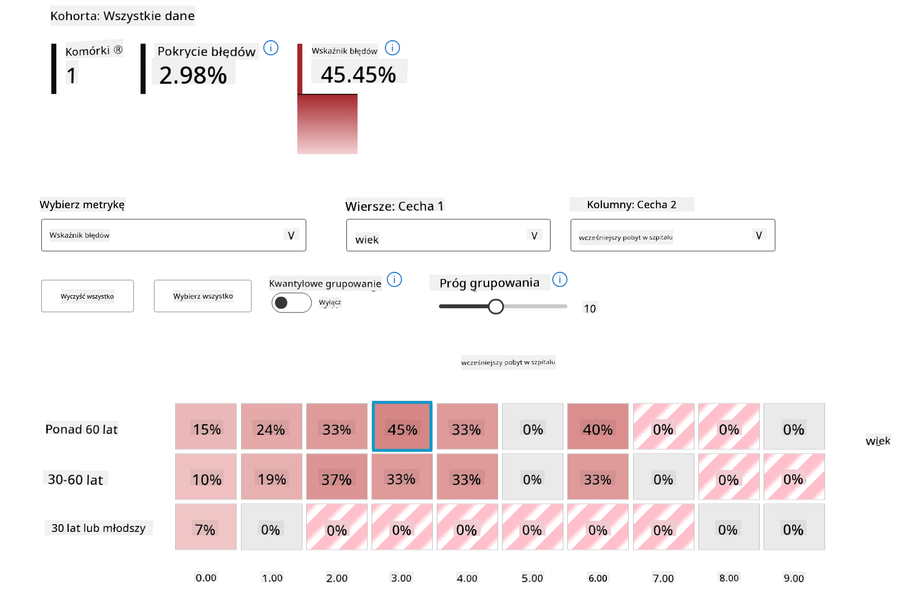
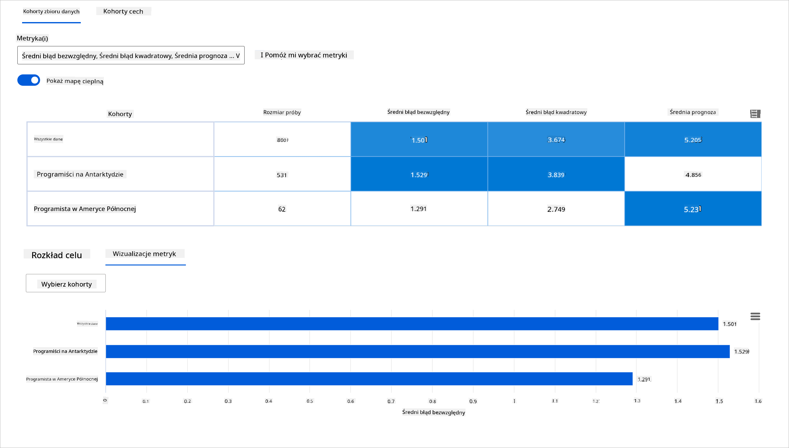
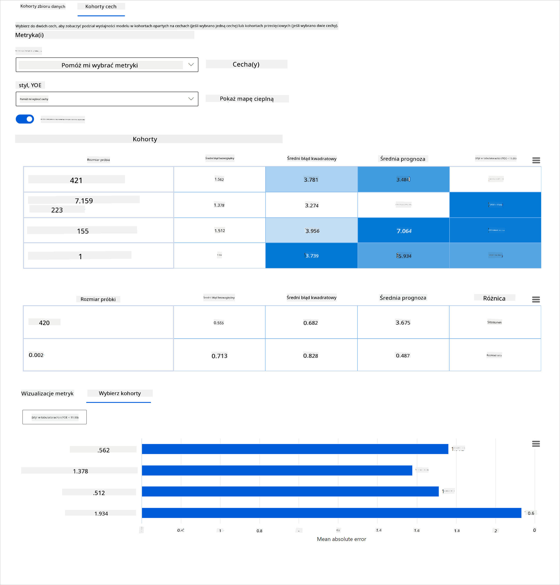
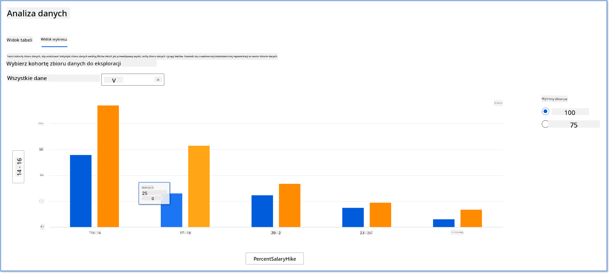
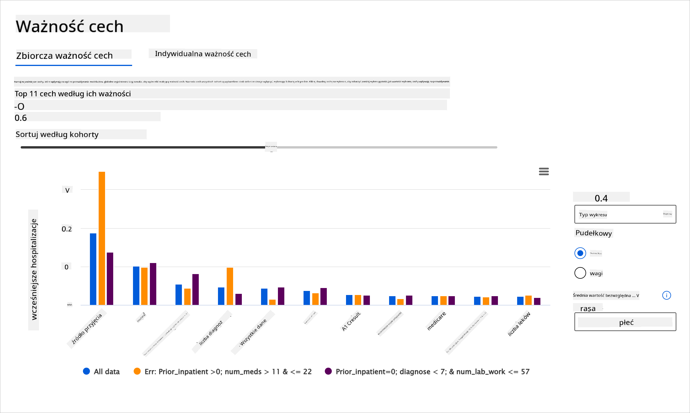

<!--
CO_OP_TRANSLATOR_METADATA:
{
  "original_hash": "ba0f6e1019351351c8ee4c92867b6a0b",
  "translation_date": "2025-09-03T17:28:33+00:00",
  "source_file": "9-Real-World/2-Debugging-ML-Models/README.md",
  "language_code": "pl"
}
-->
# Postscript: Debugowanie modeli uczenia maszynowego za pomocą komponentów dashboardu Responsible AI

## [Quiz przed wykładem](https://gray-sand-07a10f403.1.azurestaticapps.net/quiz/5/)

## Wprowadzenie

Uczenie maszynowe wpływa na nasze codzienne życie. Sztuczna inteligencja znajduje zastosowanie w najważniejszych systemach, które oddziałują na nas jako jednostki oraz na nasze społeczeństwo, takich jak opieka zdrowotna, finanse, edukacja czy zatrudnienie. Na przykład systemy i modele są zaangażowane w codzienne procesy decyzyjne, takie jak diagnozy medyczne czy wykrywanie oszustw. Wraz z postępem w dziedzinie AI oraz jej przyspieszoną adopcją rosną oczekiwania społeczne i regulacje. Wciąż widzimy obszary, w których systemy AI zawodzą, ujawniają nowe wyzwania, a rządy zaczynają regulować rozwiązania AI. Dlatego ważne jest, aby te modele były analizowane pod kątem zapewnienia sprawiedliwych, wiarygodnych, inkluzywnych, przejrzystych i odpowiedzialnych wyników dla wszystkich.

W tym kursie przyjrzymy się praktycznym narzędziom, które można wykorzystać do oceny, czy model ma problemy związane z odpowiedzialną AI. Tradycyjne techniki debugowania uczenia maszynowego opierają się głównie na obliczeniach ilościowych, takich jak zsumowana dokładność czy średnia strata błędu. Wyobraź sobie, co może się stać, gdy dane, których używasz do budowy tych modeli, nie uwzględniają pewnych demografii, takich jak rasa, płeć, poglądy polityczne, religia, lub są nadmiernie reprezentowane w tych demografiach. Co w sytuacji, gdy wyniki modelu są interpretowane jako faworyzujące pewną grupę demograficzną? Może to prowadzić do nadmiernej lub niedostatecznej reprezentacji tych wrażliwych grup cech, co skutkuje problemami ze sprawiedliwością, inkluzywnością lub wiarygodnością modelu. Dodatkowo, modele uczenia maszynowego są często traktowane jako "czarne skrzynki", co utrudnia zrozumienie i wyjaśnienie, co napędza ich prognozy. Wszystkie te wyzwania stoją przed naukowcami zajmującymi się danymi i twórcami AI, którzy nie dysponują odpowiednimi narzędziami do debugowania i oceny sprawiedliwości czy wiarygodności modelu.

W tej lekcji nauczysz się debugowania swoich modeli za pomocą:

- **Analizy błędów**: identyfikacja obszarów w rozkładzie danych, gdzie model ma wysokie wskaźniki błędów.
- **Przeglądu modelu**: przeprowadzenie analizy porównawczej między różnymi grupami danych w celu odkrycia rozbieżności w metrykach wydajności modelu.
- **Analizy danych**: badanie, gdzie może występować nadmierna lub niedostateczna reprezentacja danych, która może wpływać na faworyzowanie jednej grupy demograficznej względem innej.
- **Ważności cech**: zrozumienie, które cechy napędzają prognozy modelu na poziomie globalnym lub lokalnym.

## Wymagania wstępne

Przed rozpoczęciem zapoznaj się z materiałem [Narzędzia odpowiedzialnej AI dla programistów](https://www.microsoft.com/ai/ai-lab-responsible-ai-dashboard)

> 

## Analiza błędów

Tradycyjne metryki wydajności modelu używane do mierzenia dokładności to głównie obliczenia oparte na poprawnych i niepoprawnych prognozach. Na przykład stwierdzenie, że model jest dokładny w 89% przypadków przy stracie błędu wynoszącej 0,001, może być uznane za dobrą wydajność. Błędy nie są jednak równomiernie rozłożone w podstawowym zbiorze danych. Możesz uzyskać wynik dokładności modelu na poziomie 89%, ale odkryć, że w różnych obszarach danych model zawodzi w 42% przypadków. Konsekwencje takich wzorców błędów w określonych grupach danych mogą prowadzić do problemów ze sprawiedliwością lub wiarygodnością. Ważne jest, aby zrozumieć obszary, w których model działa dobrze lub źle. Obszary danych, w których występuje wysoka liczba nieścisłości w modelu, mogą okazać się istotnymi grupami danych.

Komponent Analizy Błędów na dashboardzie RAI ilustruje, jak porażki modelu są rozłożone w różnych grupach danych za pomocą wizualizacji drzewa. Jest to przydatne w identyfikacji cech lub obszarów, w których występuje wysoki wskaźnik błędów w zbiorze danych. Widząc, skąd pochodzi większość nieścisłości modelu, możesz zacząć badać ich przyczynę. Możesz również tworzyć grupy danych do analizy. Te grupy danych pomagają w procesie debugowania, aby określić, dlaczego wydajność modelu jest dobra w jednej grupie, a błędna w innej.

Wskaźniki wizualne na mapie drzewa pomagają szybciej zlokalizować problematyczne obszary. Na przykład im ciemniejszy odcień czerwieni na węźle drzewa, tym wyższy wskaźnik błędów.

Mapa cieplna to kolejna funkcjonalność wizualizacji, którą użytkownicy mogą wykorzystać do badania wskaźnika błędów za pomocą jednej lub dwóch cech, aby znaleźć przyczynę błędów modelu w całym zbiorze danych lub grupach.

Użyj analizy błędów, gdy potrzebujesz:

* Dogłębnego zrozumienia, jak porażki modelu są rozłożone w zbiorze danych i w różnych wymiarach wejściowych oraz cech.
* Rozbicia zsumowanych metryk wydajności w celu automatycznego odkrycia błędnych grup danych, które mogą informować o krokach naprawczych.

## Przegląd modelu

Ocena wydajności modelu uczenia maszynowego wymaga holistycznego zrozumienia jego zachowania. Można to osiągnąć poprzez przegląd więcej niż jednej metryki, takiej jak wskaźnik błędów, dokładność, recall, precyzja czy MAE (średni błąd absolutny), aby znaleźć rozbieżności między metrykami wydajności. Jedna metryka wydajności może wyglądać świetnie, ale niedokładności mogą ujawnić się w innej metryce. Dodatkowo, porównanie metryk pod kątem rozbieżności w całym zbiorze danych lub grupach pomaga rzucić światło na to, gdzie model działa dobrze, a gdzie nie. Jest to szczególnie ważne w ocenie wydajności modelu wśród cech wrażliwych i niewrażliwych (np. rasa pacjenta, płeć czy wiek), aby odkryć potencjalną niesprawiedliwość modelu. Na przykład odkrycie, że model jest bardziej błędny w grupie danych zawierającej cechy wrażliwe, może ujawnić potencjalną niesprawiedliwość modelu.

Komponent Przeglądu Modelu na dashboardzie RAI pomaga nie tylko w analizie metryk wydajności reprezentacji danych w grupie, ale daje użytkownikom możliwość porównania zachowania modelu w różnych grupach.

Funkcjonalność analizy oparta na cechach pozwala użytkownikom zawęzić podgrupy danych w ramach konkretnej cechy, aby zidentyfikować anomalie na poziomie szczegółowym. Na przykład dashboard ma wbudowaną inteligencję, która automatycznie generuje grupy dla wybranej przez użytkownika cechy (np. *"time_in_hospital < 3"* lub *"time_in_hospital >= 7"*). Umożliwia to użytkownikowi izolowanie konkretnej cechy z większej grupy danych, aby sprawdzić, czy jest ona kluczowym czynnikiem wpływającym na błędne wyniki modelu.

Komponent Przeglądu Modelu obsługuje dwa rodzaje metryk rozbieżności:

**Rozbieżność w wydajności modelu**: Te zestawy metryk obliczają rozbieżność (różnicę) w wartościach wybranej metryki wydajności w podgrupach danych. Oto kilka przykładów:

* Rozbieżność w wskaźniku dokładności
* Rozbieżność w wskaźniku błędów
* Rozbieżność w precyzji
* Rozbieżność w recall
* Rozbieżność w średnim błędzie absolutnym (MAE)

**Rozbieżność w wskaźniku selekcji**: Ta metryka zawiera różnicę w wskaźniku selekcji (korzystna prognoza) w podgrupach. Przykładem może być rozbieżność w wskaźnikach zatwierdzania kredytów. Wskaźnik selekcji oznacza odsetek punktów danych w każdej klasie sklasyfikowanych jako 1 (w klasyfikacji binarnej) lub rozkład wartości prognoz (w regresji).

## Analiza danych

> "Jeśli wystarczająco długo torturujesz dane, wyznają wszystko" - Ronald Coase

To stwierdzenie brzmi ekstremalnie, ale prawdą jest, że dane mogą być manipulowane, aby wspierać dowolny wniosek. Taka manipulacja może czasami zdarzyć się nieumyślnie. Jako ludzie wszyscy mamy uprzedzenia i często trudno jest świadomie wiedzieć, kiedy wprowadzamy uprzedzenia do danych. Zapewnienie sprawiedliwości w AI i uczeniu maszynowym pozostaje złożonym wyzwaniem.

Dane są ogromnym punktem ślepym dla tradycyjnych metryk wydajności modelu. Możesz mieć wysokie wskaźniki dokładności, ale nie zawsze odzwierciedlają one ukryte uprzedzenia w danych, które mogą znajdować się w twoim zbiorze danych. Na przykład, jeśli zbiór danych pracowników zawiera 27% kobiet na stanowiskach kierowniczych w firmie i 73% mężczyzn na tym samym poziomie, model AI do reklamowania ofert pracy, który został wytrenowany na tych danych, może kierować się głównie do męskiej grupy odbiorców na stanowiska wyższego szczebla. Taka nierównowaga w danych wpłynęła na prognozy modelu, faworyzując jedną płeć. To ujawnia problem ze sprawiedliwością, gdzie występuje uprzedzenie płciowe w modelu AI.

Komponent Analizy Danych na dashboardzie RAI pomaga zidentyfikować obszary, w których występuje nadmierna lub niedostateczna reprezentacja w zbiorze danych. Pomaga użytkownikom diagnozować przyczyny błędów i problemy ze sprawiedliwością wynikające z nierównowagi danych lub braku reprezentacji określonej grupy danych. Daje użytkownikom możliwość wizualizacji zbiorów danych na podstawie przewidywanych i rzeczywistych wyników, grup błędów oraz konkretnych cech. Czasami odkrycie niedoreprezentowanej grupy danych może również ujawnić, że model nie uczy się dobrze, co prowadzi do wysokich niedokładności. Model, który ma uprzedzenia w danych, nie tylko ma problem ze sprawiedliwością, ale także pokazuje, że nie jest inkluzywny ani wiarygodny.

Użyj analizy danych, gdy potrzebujesz:

* Eksplorować statystyki swojego zbioru danych, wybierając różne filtry, aby podzielić dane na różne wymiary (znane również jako grupy).
* Zrozumieć rozkład swojego zbioru danych w różnych grupach i grupach cech.
* Określić, czy twoje odkrycia związane ze sprawiedliwością, analizą błędów i przyczynowością (pochodzące z innych komponentów dashboardu) są wynikiem rozkładu twojego zbioru danych.
* Zdecydować, w których obszarach należy zebrać więcej danych, aby zminimalizować błędy wynikające z problemów z reprezentacją, szumem etykiet, szumem cech, uprzedzeniami etykiet i podobnymi czynnikami.

## Interpretacja modelu

Modele uczenia maszynowego często są traktowane jako "czarne skrzynki". Zrozumienie, które kluczowe cechy danych napędzają prognozy modelu, może być trudne. Ważne jest, aby zapewnić przejrzystość, dlaczego model dokonuje określonej prognozy. Na przykład, jeśli system AI przewiduje, że pacjent z cukrzycą jest zagrożony ponownym przyjęciem do szpitala w ciągu mniej niż 30 dni, powinien być w stanie dostarczyć dane wspierające, które doprowadziły do tej prognozy. Posiadanie wskaźników wspierających przynosi przejrzystość, pomagając klinikom lub szpitalom podejmować dobrze poinformowane decyzje. Dodatkowo, możliwość wyjaśnienia, dlaczego model dokonał prognozy dla konkretnego pacjenta, umożliwia odpowiedzialność wobec regulacji zdrowotnych. Kiedy używasz modeli uczenia maszynowego w sposób wpływający na życie ludzi, kluczowe jest zrozumienie i wyjaśnienie, co wpływa na zachowanie modelu. Wyjaśnialność i interpretowalność modelu pomagają odpowiedzieć na pytania w scenariuszach takich jak:

* Debugowanie modelu: Dlaczego mój model popełnił ten błąd? Jak mogę go poprawić?
* Współpraca człowiek-AI: Jak mogę zrozumieć i zaufać decyzjom modelu?
* Zgodność z regulacjami: Czy mój model spełnia wymagania prawne?

Komponent Ważności Cech na dashboardzie RAI pomaga debugować i uzyskać kompleksowe zrozumienie, jak model dokonuje prognoz. Jest to również przydatne narzędzie dla profesjonalistów zajmujących się uczeniem maszynowym oraz decydentów, aby wyjaśnić i pokazać dowody cech wpływających na zachowanie modelu w celu zgodności z regulacjami. Następnie użytkownicy mogą eksplorować zarówno globalne, jak i lokalne wyjaśnienia, aby zweryfikować, które cechy napędzają prognozy modelu. Globalne wyjaśnienia przedstawiają najważniejsze cechy, które wpłynęły na ogólną prognozę modelu. Lokalne wyjaśnienia pokazują, które cechy doprowadziły do prognozy modelu dla konkretnego przypadku. Możliwość oceny lokalnych wyjaśnień jest również pomocna w debugowaniu lub audytowaniu konkretnego przypadku, aby lepiej zrozumieć i zinterpretować, dlaczego model dokonał poprawnej lub błędnej prognozy.

* Globalne wyjaśnienia: Na przykład, jakie cechy wpływają na ogólne zachowanie modelu przewidującego ponowne przyjęcie do szpitala pacjentów z cukrzycą?
* Lokalne wyjaśnienia: Na przykład, dlaczego pacjent z cukrzycą powyżej 60 roku życia z wcześniejszymi hospitalizacjami został przewidziany jako ponownie przyjęty lub nieprzyjęty do szpitala w ciągu 30 dni?

W procesie debugowania wydajności modelu w różnych grupach, Ważność Cech pokazuje, jaki poziom wpływu ma cecha w różnych grupach. Pomaga ujawnić anomalie podczas porównywania poziomu wpływu cechy na błędne prognozy modelu. Komponent Ważności Cech może pokazać, które wartości w cechach pozytywnie lub negatywnie wpłynęły na wynik modelu. Na przykład, jeśli model dokonał błędnej prognozy, komponent daje możliwość zagłębienia się i wskazania, które cechy lub wartości cech wpłynęły na prognozę. Ten poziom szczegółowości pomaga nie tylko w debugowaniu, ale także zapewnia przejrzystość i odpowiedzialność w sytuacjach audytowych. Wreszcie, komponent może pomóc w identyfikacji problemów ze sprawiedliwością. Na przykład, jeśli wrażliwa cecha, taka jak pochodzenie etniczne lub płeć, ma duży wpływ na prognozę modelu, może to być oznaka uprzedzeń ras
- **Nad- lub niedoreprezentowanie**. Chodzi o sytuację, w której pewna grupa nie jest widoczna w określonym zawodzie, a każda usługa lub funkcja, która to utrwala, przyczynia się do szkody.

### Azure RAI dashboard

[Azure RAI dashboard](https://learn.microsoft.com/en-us/azure/machine-learning/concept-responsible-ai-dashboard?WT.mc_id=aiml-90525-ruyakubu) opiera się na narzędziach open-source opracowanych przez wiodące instytucje akademickie i organizacje, w tym Microsoft. Są one kluczowe dla data scientistów i twórców AI, aby lepiej zrozumieć zachowanie modeli, odkrywać i łagodzić niepożądane problemy w modelach AI.

- Dowiedz się, jak korzystać z różnych komponentów, przeglądając [dokumentację RAI dashboard.](https://learn.microsoft.com/en-us/azure/machine-learning/how-to-responsible-ai-dashboard?WT.mc_id=aiml-90525-ruyakubu)

- Sprawdź przykładowe [notatniki RAI dashboard](https://github.com/Azure/RAI-vNext-Preview/tree/main/examples/notebooks) do debugowania bardziej odpowiedzialnych scenariuszy AI w Azure Machine Learning.

---
## 🚀 Wyzwanie

Aby zapobiec wprowadzaniu uprzedzeń statystycznych lub danych już na samym początku, powinniśmy:

- zapewnić różnorodność środowisk i perspektyw wśród osób pracujących nad systemami  
- inwestować w zestawy danych odzwierciedlające różnorodność naszego społeczeństwa  
- rozwijać lepsze metody wykrywania i korygowania uprzedzeń, gdy się pojawią  

Pomyśl o rzeczywistych scenariuszach, w których niesprawiedliwość jest widoczna podczas budowy i użytkowania modeli. Co jeszcze powinniśmy wziąć pod uwagę?

## [Quiz po wykładzie](https://gray-sand-07a10f403.1.azurestaticapps.net/quiz/6/)
## Przegląd i samodzielna nauka

W tej lekcji poznałeś praktyczne narzędzia do włączania odpowiedzialnej AI w uczeniu maszynowym.

Obejrzyj ten warsztat, aby zgłębić temat:

- Responsible AI Dashboard: Jedno miejsce do wdrażania odpowiedzialnej AI w praktyce, prowadzone przez Besmirę Nushi i Mehrnoosh Sameki

> 🎥 Kliknij obrazek powyżej, aby obejrzeć wideo: Responsible AI Dashboard: Jedno miejsce do wdrażania odpowiedzialnej AI w praktyce, prowadzone przez Besmirę Nushi i Mehrnoosh Sameki

Zapoznaj się z poniższymi materiałami, aby dowiedzieć się więcej o odpowiedzialnej AI i jak budować bardziej godne zaufania modele:

- Narzędzia Microsoft RAI dashboard do debugowania modeli ML: [Zasoby narzędzi Responsible AI](https://aka.ms/rai-dashboard)

- Odkryj zestaw narzędzi Responsible AI: [Github](https://github.com/microsoft/responsible-ai-toolbox)

- Centrum zasobów Microsoft RAI: [Responsible AI Resources – Microsoft AI](https://www.microsoft.com/ai/responsible-ai-resources?activetab=pivot1%3aprimaryr4)

- Grupa badawcza Microsoft FATE: [FATE: Fairness, Accountability, Transparency, and Ethics in AI - Microsoft Research](https://www.microsoft.com/research/theme/fate/)

## Zadanie

[Zapoznaj się z RAI dashboard](assignment.md)

---

**Zastrzeżenie**:  
Ten dokument został przetłumaczony za pomocą usługi tłumaczenia AI [Co-op Translator](https://github.com/Azure/co-op-translator). Chociaż dokładamy wszelkich starań, aby zapewnić poprawność tłumaczenia, prosimy pamiętać, że automatyczne tłumaczenia mogą zawierać błędy lub nieścisłości. Oryginalny dokument w jego rodzimym języku powinien być uznawany za wiarygodne źródło. W przypadku informacji o kluczowym znaczeniu zaleca się skorzystanie z profesjonalnego tłumaczenia przez człowieka. Nie ponosimy odpowiedzialności za jakiekolwiek nieporozumienia lub błędne interpretacje wynikające z użycia tego tłumaczenia.