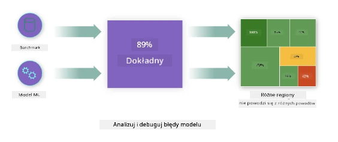
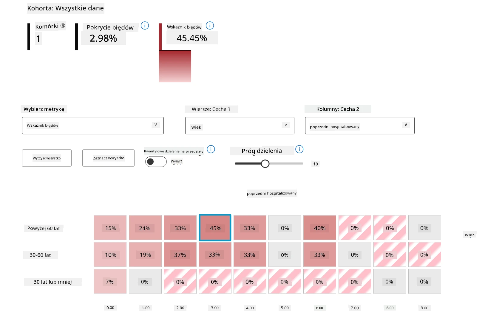
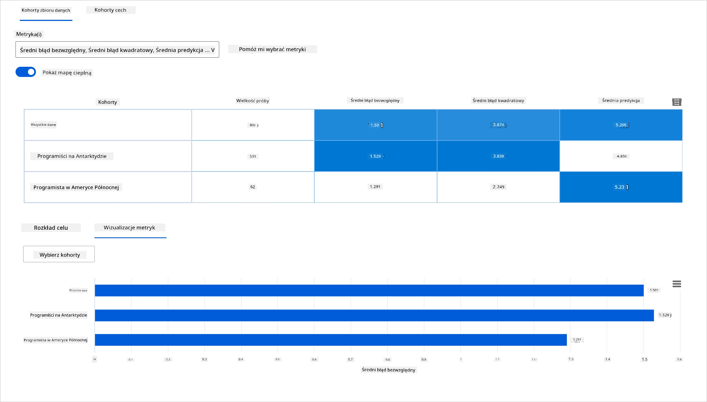
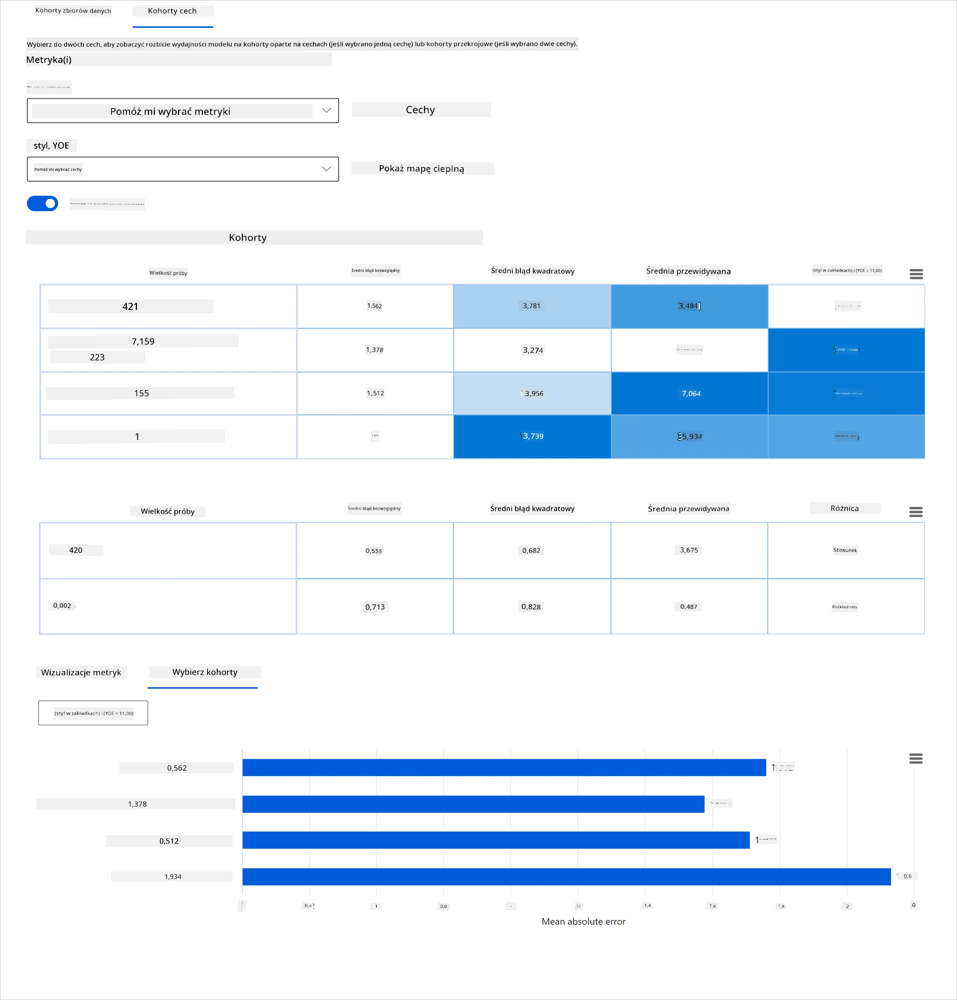
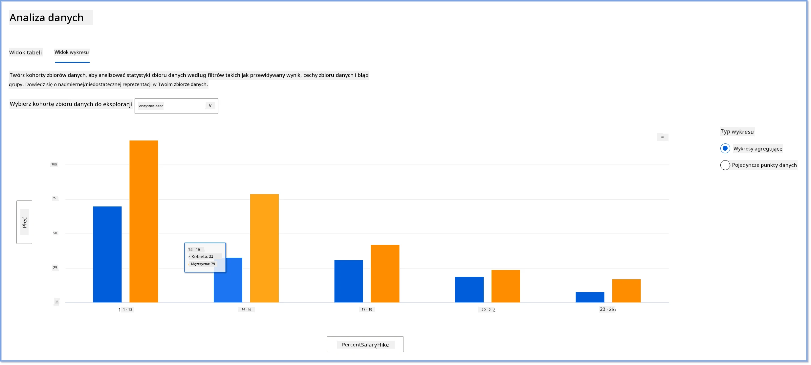
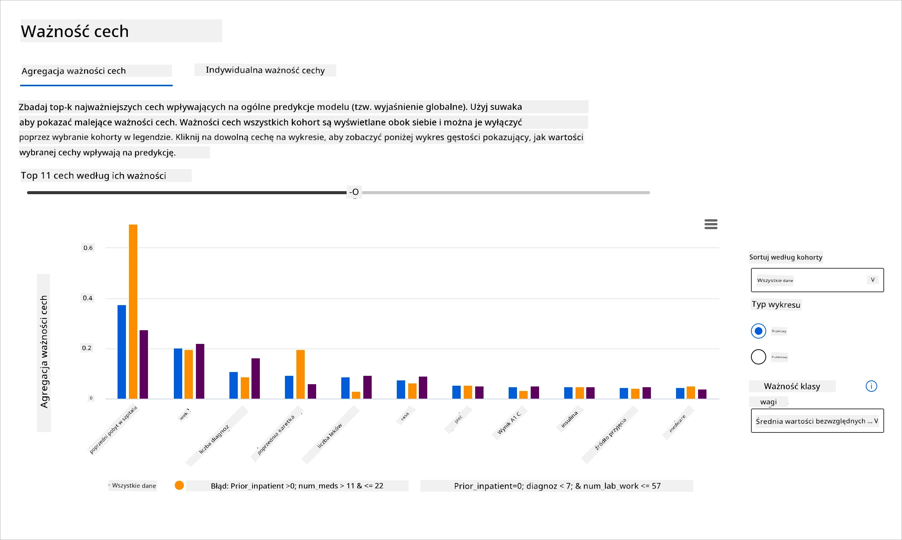
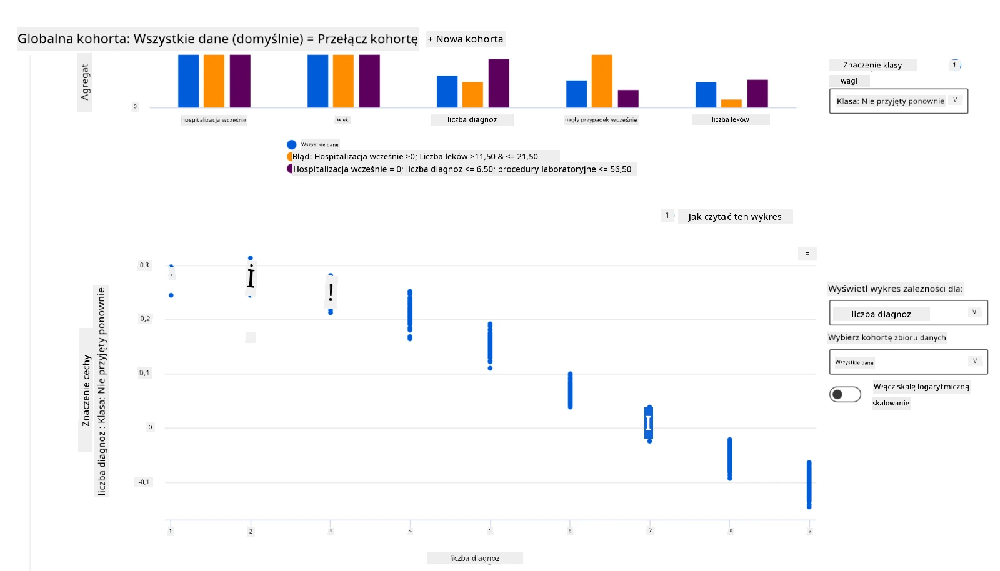

# Postscript: Debugowanie modelu w uczeniu maszynowym za pomocą komponentów pulpitu odpowiedzialnej AI
 

## [Quiz przed wykładem](https://ff-quizzes.netlify.app/en/ml/)
 
## Wprowadzenie

Uczenie maszynowe wpływa na nasze codzienne życie. AI znajduje zastosowanie w niektórych z najważniejszych systemów, które mają wpływ na nas jako jednostki, jak i na społeczeństwo, od opieki zdrowotnej, finansów, edukacji po zatrudnienie. Na przykład, systemy i modele uczestniczą w codziennych zadaniach decyzyjnych, takich jak diagnozy zdrowotne czy wykrywanie oszustw. W konsekwencji, postęp w AI wraz z przyspieszonym wdrożeniem są spotykane z ewoluującymi oczekiwaniami społecznymi i rosnącymi regulacjami. Ciągle widzimy obszary, w których systemy AI nadal nie spełniają oczekiwań; ujawniają nowe wyzwania; a rządy zaczynają regulować rozwiązania AI. Dlatego ważne jest, aby te modele były analizowane, aby dostarczać sprawiedliwe, wiarygodne, inkluzywne, przejrzyste i odpowiedzialne wyniki dla wszystkich.

W tym programie zajęć przyjrzymy się praktycznym narzędziom, które można wykorzystać do oceny, czy model ma problemy z odpowiedzialną AI. Tradycyjne techniki debugowania uczenia maszynowego opierają się na obliczeniach ilościowych, takich jak zagregowana dokładność czy średnia strata błędu. Wyobraź sobie, co może się stać, gdy dane, których używasz do budowy tych modeli, nie uwzględniają pewnych demografii, takich jak rasa, płeć, poglądy polityczne, religia, albo dysproporcjonalnie reprezentują takie demografie. A co, gdy wynik modelu jest interpretowany na korzyść jednej grupy demograficznej? Może to wprowadzić nad- lub niedoreprezentację tych wrażliwych grup cech, powodując problemy ze sprawiedliwością, inkluzywnością lub wiarygodnością modelu. Kolejnym czynnikiem jest to, że modele uczenia maszynowego są uważane za czarne skrzynki, co utrudnia zrozumienie i wyjaśnienie czynników wpływających na predykcję modelu. Wszystkie te wyzwania stoją przed naukowcami danych i deweloperami AI, gdy nie dysponują odpowiednimi narzędziami do debugowania oraz oceny sprawiedliwości i wiarygodności modelu.

W tej lekcji nauczysz się debugowania swoich modeli za pomocą:

-	**Analizy błędów**: identyfikacji miejsc w rozkładzie danych, w których model ma wysokie wskaźniki błędów.
-	**Przeglądu modelu**: przeprowadzenia analizy porównawczej różnych kohort danych w celu wykrycia rozbieżności w metrykach wydajności modelu.
-	**Analizy danych**: zbadania, gdzie może występować nad- lub niedoreprezentacja danych, która może powodować faworyzowanie przez model jednej grupy demograficznej nad inną.
-	**Ważności cech**: zrozumienia, które cechy wpływają na predykcje modelu na poziomie globalnym lub lokalnym.

## Wymagania wstępne

Jako wymóg wstępny, proszę zapoznaj się z przeglądem [Narzędzi odpowiedzialnej AI dla deweloperów](https://www.microsoft.com/ai/ai-lab-responsible-ai-dashboard)

> 

## Analiza błędów

Tradycyjne metryki wydajności modelu używane do mierzenia dokładności to głównie obliczenia bazujące na prawidłowych vs nieprawidłowych predykcjach. Na przykład, stwierdzenie, że model jest dokładny w 89% przypadków ze stratą błędu 0,001 może być uznane za dobrą wydajność. Błędy często nie są równomiernie rozłożone w twoim zbiorze danych. Możesz uzyskać 89% dokładności modelu, ale odkryć, że są różne obszary danych, dla których model zawodzi w 42% przypadków. Konsekwencją takich wzorców błędów w określonych grupach danych mogą być problemy ze sprawiedliwością lub wiarygodnością. Kluczowe jest zrozumienie obszarów, w których model działa dobrze lub słabo. Regiony danych, gdzie model popełnia wiele błędów, mogą okazać się ważną grupą demograficzną.

Komponent Analizy błędów na pulpicie RAI ilustruje, jak rozkładają się błędy modelu w różnych kohortach za pomocą wizualizacji drzewa. Jest to przydatne do identyfikacji cech lub obszarów, gdzie występuje wysoki wskaźnik błędów w twoim zbiorze danych. Widząc, skąd pochodzą największe nieścisłości modelu, możesz rozpocząć dochodzenie przyczyn źródłowych. Możesz też tworzyć kohorty danych w celu przeprowadzenia analizy. Te kohorty pomagają podczas procesu debugowania, aby określić, dlaczego model działa dobrze w jednej kohorcie, a błędnie w innej.

Wizualne wskaźniki na mapie drzewa pomagają szybszej lokalizacji problematycznych obszarów. Na przykład, im ciemniejszy odcień czerwonego ma węzeł drzewa, tym wyższy wskaźnik błędów.

Mapa cieplna to kolejna funkcja wizualizacyjna, którą użytkownicy mogą wykorzystać w badaniu wskaźnika błędów, używając jednej lub dwóch cech, aby znaleźć przyczynę błędów modelu w całym zbiorze danych lub kohortach.

Wykorzystaj analizę błędów, gdy potrzebujesz:

* Dogłębnie zrozumieć, jak rozkładają się błędy modelu w zbiorze danych i w różnych wymiarach wejścia oraz cech.
* Rozłożyć zagregowane metryki wydajności, aby automatycznie odkrywać błędne kohorty i informować o ukierunkowanych działaniach naprawczych.

## Przegląd modelu

Ocena wydajności modelu uczenia maszynowego wymaga uzyskania całościowego zrozumienia jego zachowania. Można to osiągnąć, analizując więcej niż jedną metrykę, taką jak wskaźnik błędów, dokładność, recall, precyzję czy MAE (średni bezwzględny błąd) w celu znalezienia rozbieżności pomiędzy metrykami wydajności. Jedna metryka może wyglądać dobrze, ale niedokładności mogą się ujawnić w innej mierze. Dodatkowo porównanie metryk pod kątem rozbieżności w całym zbiorze danych lub w kohortach pomaga zobaczyć, gdzie model działa dobrze, a gdzie nie. Jest to szczególnie ważne przy ocenianiu wydajności modelu między cechami wrażliwymi a niewrażliwymi (np. rasa pacjenta, płeć czy wiek), aby odkryć potencjalną niesprawiedliwość modelu. Na przykład, odkrycie, że model jest bardziej błędny w kohorcie zawierającej wrażliwe cechy, może ujawnić potencjalną niesprawiedliwość modelu.

Komponent Przeglądu modelu na pulpicie RAI pomaga nie tylko w analizie metryk wydajności danych reprezentowanych w kohorcie, ale daje użytkownikom możliwość porównania zachowania modelu w różnych kohortach.

Funkcjonalność analizy cech w tym komponencie pozwala użytkownikom zawęzić podgrupy danych w ramach konkretnej cechy, aby zidentyfikować anomalie na szczegółowym poziomie. Na przykład, pulpit posiada wbudowaną inteligencję do automatycznego generowania kohort dla wybranej cechy (np. *"time_in_hospital < 3"* lub *"time_in_hospital >= 7"*). Pozwala to użytkownikowi odseparować jedną cechę z większej grupy danych, aby sprawdzić, czy jest ona kluczowym czynnikiem wpływającym na błędne wyniki modelu.

Komponent Przeglądu modelu obsługuje dwa rodzaje metryk rozbieżności:

**Rozbieżność w wydajności modelu**: Zestawy tych metryk obliczają różnicę (rozbieżność) w wartościach wybranej metryki wydajności w różnych podgrupach danych. Oto kilka przykładów:

* Rozbieżność w wskaźniku dokładności
* Rozbieżność w wskaźniku błędów
* Rozbieżność w precyzji
* Rozbieżność w recallu
* Rozbieżność w średnim bezwzględnym błędzie (MAE)

**Rozbieżność w wskaźniku selekcji**: Ta metryka zawiera różnicę we wskaźniku selekcji (korzystnej predykcji) między podgrupami. Przykładem może być rozbieżność w stopach zatwierdzania pożyczek. Wskaźnik selekcji oznacza ułamek punktów danych w każdej klasie sklasyfikowanych jako 1 (w klasyfikacji binarnej) lub rozkład wartości predykcji (w regresji).

## Analiza danych

> "Jeśli będziesz długo torturować dane, przyznają się do wszystkiego" - Ronald Coase

To stwierdzenie brzmi ekstremalnie, ale prawdą jest, że dane można manipulować, aby wspierać każde wnioski. Taka manipulacja czasem dzieje się nieświadomie. Jako ludzie wszyscy mamy uprzedzenia, i często trudno świadomie zauważyć, kiedy wprowadzamy je do danych. Zapewnienie sprawiedliwości w AI i uczeniu maszynowym pozostaje złożonym wyzwaniem.

Dane to ogromny ślepy punkt dla tradycyjnych metryk wydajności modelu. Możesz mieć wysokie wskaźniki dokładności, ale to nie zawsze odzwierciedla ukryte uprzedzenia danych, które mogą znajdować się w zbiorze. Na przykład, jeśli zbiór pracowników ma 27% kobiet na stanowiskach kierowniczych i 73% mężczyzn na tym samym poziomie, model AI do reklamowania pracy trenowany na takich danych może kierować swoje reklamy głównie do mężczyzn na stanowiska wyższego szczebla. Taka nierównowaga w danych wypaczyła predykcję modelu na korzyść jednej płci. To ujawnia problem sprawiedliwości, gdzie model AI ma uprzedzenia płciowe.

Komponent Analizy danych na pulpicie RAI pomaga zidentyfikować obszary nad- i niedoreprezentacji w zbiorze danych. Umożliwia użytkownikom diagnozowanie przyczyn błędów i problemów ze sprawiedliwością wynikających z nierówności danych lub braku reprezentacji określonej grupy danych. Daje możliwość wizualizacji zbiorów danych na podstawie przewidywanych i rzeczywistych wyników, grup błędów oraz konkretnych cech. Czasem odkrycie niedoreprezentowanej grupy danych może również ujawnić, że model źle uczy się danych, co powoduje wysoką liczbę błędów. Posiadanie modelu z uprzedzeniami danych nie jest tylko problemem sprawiedliwości, ale również pokazuje, że model nie jest inkluzywny ani wiarygodny.

Wykorzystaj analizę danych, gdy potrzebujesz:

* Eksplorować statystyki swojego zbioru danych, wybierając różne filtry, aby podzielić dane na różne wymiary (znane również jako kohorty).
* Zrozumieć rozkład swojego zbioru danych w różnych kohortach i grupach cech.
* Określić, czy Twoje spostrzeżenia dotyczące sprawiedliwości, analizy błędów i przyczynowości (pochodzące z innych komponentów pulpitu) są wynikiem rozkładu Twojego zbioru danych.
* Zdecydować, w jakich obszarach trzeba zebrać więcej danych, aby złagodzić błędy wynikające z problemów z reprezentacją, szumu etykiet, szumu cech, uprzedzeń etykiet i podobnych czynników.

## Interpretowalność modelu

Modele uczenia maszynowego mają zwykle charakter czarnej skrzynki. Zrozumienie, które kluczowe cechy danych wpływają na predykcję modelu, może być trudne. Ważne jest, aby zapewnić przejrzystość, dlaczego model dokonuje określonej predykcji. Na przykład, jeśli system AI przewiduje, że pacjent diabetyk jest zagrożony szybkim ponownym przyjęciem do szpitala w mniej niż 30 dni, powinien być w stanie dostarczyć dane wspierające tę predykcję. Posiadanie wskaźników wspierających zapewnia przejrzystość, co pomaga klinicystom lub szpitalom podejmować dobrze poinformowane decyzje. Ponadto, możliwość wyjaśnienia, dlaczego model dokonał predykcji dla konkretnego pacjenta, umożliwia rozliczalność w zgodzie z przepisami zdrowotnymi. Gdy wykorzystujesz modele uczenia maszynowego w sposób wpływający na życie ludzi, kluczowe jest rozumienie i wyjaśnianie, co wpływa na zachowanie modelu. Wyjaśnialność i interpretowalność modelu pomaga odpowiedzieć na pytania w takich scenariuszach jak:

* Debugowanie modelu: Dlaczego mój model popełnił ten błąd? Jak mogę go poprawić?
* Współpraca człowiek-AI: Jak mogę zrozumieć i zaufać decyzjom modelu?
* Zgodność regulacyjna: Czy mój model spełnia wymagania prawne?

Komponent Ważności cech na pulpicie RAI pomaga debugować i uzyskać wszechstronne zrozumienie, jak model dokonuje predykcji. To także przydatne narzędzie dla specjalistów uczenia maszynowego i decydentów do wyjaśniania i pokazywania dowodów na wpływ cech na zachowanie modelu dla zgodności regulacyjnej. Następnie użytkownicy mogą eksplorować zarówno wyjaśnienia globalne, jak i lokalne, by potwierdzić, które cechy kierowały predykcją modelu. Wyjaśnienia globalne wymieniają główne cechy wpływające na ogólną predykcję modelu. Wyjaśnienia lokalne pokazują, które cechy doprowadziły do predykcji modelu dla konkretnego przypadku. Możliwość oceny wyjaśnień lokalnych jest również pomocna w debugowaniu lub audycie konkretnego przypadku, aby lepiej zrozumieć i interpretować, dlaczego model dokonał dokładnej lub niedokładnej predykcji.

* Wyjaśnienia globalne: Na przykład, które cechy wpływają na całkowite zachowanie modelu przewidującego ponowne przyjęcie do szpitala pacjentów z cukrzycą?
* Wyjaśnienia lokalne: Na przykład, dlaczego pacjent diabetyk powyżej 60 lat z wcześniejszymi hospitalizacjami został przewidziany jako ponownie przyjęty lub nieprzyjęty do szpitala w ciągu 30 dni?

W procesie debugowania, podczas badania wydajności modelu w różnych kohortach, Ważność cech pokazuje, jaki wpływ ma dana cecha w ramach kohort. Pomaga ujawnić anomalie przy porównywaniu poziomu wpływu cechy na błędne predykcje modelu. Komponent Ważności cech może pokazać, które wartości w cechach pozytywnie lub negatywnie wpłynęły na wynik modelu. Na przykład, jeśli model dokonał niedokładnej predykcji, komponent umożliwia dogłębne zbadanie i wskazanie, które cechy lub wartości cech wpłynęły na predykcję. Poziom szczegółowości pomaga nie tylko w debugowaniu, ale również zapewnia przejrzystość i rozliczalność w sytuacjach audytu. Wreszcie komponent może pomóc zidentyfikować problemy ze sprawiedliwością. Na przykład, jeśli wrażliwa cecha, taka jak pochodzenie etniczne lub płeć, ma duży wpływ na predykcję modelu, może to być sygnał uprzedzeń rasowych lub płciowych w modelu.

Korzystaj z interpretowalności, gdy potrzebujesz:

* Określić, jak wiarygodne są predykcje twojego systemu AI, rozumiejąc, które cechy są najważniejsze dla tych predykcji.
* Podejść do debugowania modelu przez jego lepsze zrozumienie i zidentyfikowanie, czy model używa zdrowych cech, czy jedynie fałszywych korelacji.
* Odkryć potencjalne źródła niesprawiedliwości, rozumiejąc, czy model opiera predykcje na cechach wrażliwych lub na cechach silnie z nimi skorelowanych.
* Budować zaufanie użytkowników do decyzji modelu, generując wyjaśnienia lokalne ilustrujące ich wyniki.
* Przeprowadzić audyt regulacyjny systemu AI, aby zweryfikować modele i monitorować wpływ decyzji modelu na ludzi.

## Podsumowanie

Wszystkie komponenty pulpitu RAI są praktycznymi narzędziami pomagającymi budować modele uczenia maszynowego, które są mniej szkodliwe i bardziej wiarygodne dla społeczeństwa. Poprawiają zapobieganie zagrożeniom dla praw człowieka; dyskryminacji lub wykluczania pewnych grup z możliwości życiowych; oraz ryzyka urazów fizycznych lub psychicznych. Pomagają również budować zaufanie do decyzji modelu, generując wyjaśnienia lokalne obrazujące ich wyniki. Niektóre potencjalne szkody można sklasyfikować jako:

- **Przydział**, jeśli np. płeć lub pochodzenie etniczne są faworyzowane względem innych.
- **Jakość usług**. Jeśli dane są trenowane dla jednego specyficznego scenariusza, a rzeczywistość jest znacznie bardziej złożona, prowadzi to do słabo działającej usługi.
- **Stereotypowanie**. Kojarzenie danej grupy z przypisanymi z góry cechami.

- **Oszkalowanie**. Niesprawiedliwa krytyka i określanie czegoś lub kogoś.
- **Nad- lub niedoreprezentowanie**. Chodzi o to, że pewna grupa nie jest widoczna w danym zawodzie, a każda usługa lub funkcja, która to promuje, przyczynia się do szkody.

### Panel Azure RAI
 
[Panel Azure RAI](https://learn.microsoft.com/en-us/azure/machine-learning/concept-responsible-ai-dashboard?WT.mc_id=aiml-90525-ruyakubu) jest zbudowany na narzędziach open-source opracowanych przez wiodące instytucje akademickie i organizacje, w tym Microsoft, które są niezbędne dla data scientistów i deweloperów AI, aby lepiej zrozumieć zachowanie modelu, wykrywać i łagodzić niepożądane problemy z modelami AI.

- Naucz się korzystać z różnych komponentów, sprawdzając dokumentację panelu RAI [docs.](https://learn.microsoft.com/en-us/azure/machine-learning/how-to-responsible-ai-dashboard?WT.mc_id=aiml-90525-ruyakubu)

- Sprawdź przykładowe notatniki panelu RAI [sample notebooks](https://github.com/Azure/RAI-vNext-Preview/tree/main/examples/notebooks) do debugowania bardziej odpowiedzialnych scenariuszy AI w Azure Machine Learning. 
  
---
## 🚀 Wyzwanie 
 
Aby zapobiec wprowadzeniu uprzedzeń statystycznych lub danych, powinniśmy: 

- mieć różnorodność pochodzenia i perspektyw wśród osób pracujących nad systemami 
- inwestować w zbiory danych odzwierciedlające różnorodność naszego społeczeństwa 
- rozwijać lepsze metody wykrywania i korekty uprzedzeń, gdy się pojawią 

Pomyśl o scenariuszach z życia codziennego, gdzie niesprawiedliwość jest widoczna w budowaniu i korzystaniu z modeli. Co jeszcze powinniśmy wziąć pod uwagę? 

## [Quiz po wykładzie](https://ff-quizzes.netlify.app/en/ml/)
## Przegląd & Samokształcenie 
 
W tej lekcji nauczyłeś się niektórych praktycznych narzędzi włączania odpowiedzialnej AI w uczenie maszynowe.  

Obejrzyj ten warsztat, aby zagłębić się w tematy: 

- Panel Responsible AI: kompleksowe miejsce do operacjonalizacji RAI w praktyce, prowadzone przez Besmirę Nushi i Mehrnoosh Sameki

> 🎥 Kliknij powyższy obraz, aby obejrzeć wideo: Responsible AI Dashboard: One-stop shop for operationalizing RAI in practice prowadzone przez Besmirę Nushi i Mehrnoosh Sameki
 
Skorzystaj z następujących materiałów, aby dowiedzieć się więcej o odpowiedzialnej AI i jak budować bardziej godne zaufania modele: 

- Narzędzia panelu RAI Microsoft do debugowania modeli ML: [Responsible AI tools resources](https://aka.ms/rai-dashboard)

- Poznaj zestaw narzędzi Responsible AI: [Github](https://github.com/microsoft/responsible-ai-toolbox)

- Centrum zasobów Microsoft dotyczące RAI: [Responsible AI Resources – Microsoft AI](https://www.microsoft.com/ai/responsible-ai-resources?activetab=pivot1%3aprimaryr4) 

- Grupa badawcza FATE Microsoft: [FATE: Fairness, Accountability, Transparency, and Ethics in AI - Microsoft Research](https://www.microsoft.com/research/theme/fate/) 

## Zadanie

[Zbadaj panel RAI](assignment.md)

---

<!-- CO-OP TRANSLATOR DISCLAIMER START -->
**Zastrzeżenie**:
Niniejszy dokument został przetłumaczony za pomocą usługi tłumaczenia AI [Co-op Translator](https://github.com/Azure/co-op-translator). Choć dążymy do dokładności, prosimy pamiętać, że automatyczne tłumaczenia mogą zawierać błędy lub niedokładności. Oryginalny dokument w jego języku źródłowym należy uznawać za autorytatywne źródło. W przypadku informacji krytycznych zalecane jest skorzystanie z profesjonalnego tłumaczenia wykonanego przez człowieka. Nie ponosimy odpowiedzialności za jakiekolwiek nieporozumienia lub błędne interpretacje wynikające z użycia tego tłumaczenia.
<!-- CO-OP TRANSLATOR DISCLAIMER END -->