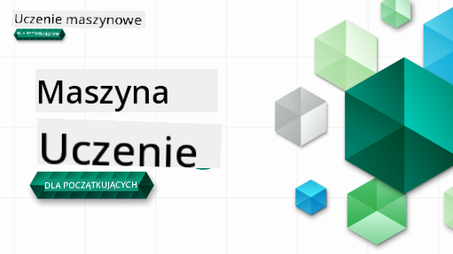

<!--
CO_OP_TRANSLATOR_METADATA:
{
  "original_hash": "a54f98da7bbee99ddc62a9e490eef7dc",
  "translation_date": "2025-09-29T21:58:02+00:00",
  "source_file": "README.md",
  "language_code": "pl"
}
-->

### 🌐 Wsparcie wielojęzyczne

#### Obsługiwane przez GitHub Action (Automatyczne i zawsze aktualne)

[Francuski](../fr/README.md) | [Hiszpański](../es/README.md) | [Niemiecki](../de/README.md) | [Rosyjski](../ru/README.md) | [Arabski](../ar/README.md) | [Perski (Farsi)](../fa/README.md) | [Urdu](../ur/README.md) | [Chiński (uproszczony)](../zh/README.md) | [Chiński (tradycyjny, Makau)](../mo/README.md) | [Chiński (tradycyjny, Hongkong)](../hk/README.md) | [Chiński (tradycyjny, Tajwan)](../tw/README.md) | [Japoński](../ja/README.md) | [Koreański](../ko/README.md) | [Hindi](../hi/README.md) | [Bengalski](../bn/README.md) | [Marathi](../mr/README.md) | [Nepalski](../ne/README.md) | [Pendżabski (Gurmukhi)](../pa/README.md) | [Portugalski (Portugalia)](../pt/README.md) | [Portugalski (Brazylia)](../br/README.md) | [Włoski](../it/README.md) | [Polski](./README.md) | [Turecki](../tr/README.md) | [Grecki](../el/README.md) | [Tajski](../th/README.md) | [Szwedzki](../sv/README.md) | [Duński](../da/README.md) | [Norweski](../no/README.md) | [Fiński](../fi/README.md) | [Holenderski](../nl/README.md) | [Hebrajski](../he/README.md) | [Wietnamski](../vi/README.md) | [Indonezyjski](../id/README.md) | [Malajski](../ms/README.md) | [Tagalog (Filipiński)](../tl/README.md) | [Suahili](../sw/README.md) | [Węgierski](../hu/README.md) | [Czeski](../cs/README.md) | [Słowacki](../sk/README.md) | [Rumuński](../ro/README.md) | [Bułgarski](../bg/README.md) | [Serbski (cyrylica)](../sr/README.md) | [Chorwacki](../hr/README.md) | [Słoweński](../sl/README.md) | [Ukraiński](../uk/README.md) | [Birmański (Myanmar)](../my/README.md)

#### Dołącz do naszej społeczności

Prowadzimy serię nauki z AI na Discordzie, dowiedz się więcej i dołącz do nas na [Learn with AI Series](https://aka.ms/learnwithai/discord) od 18 do 30 września 2025. Otrzymasz wskazówki i porady dotyczące korzystania z GitHub Copilot w Data Science.

# Machine Learning dla początkujących - Program nauczania

> 🌍 Podróżuj po świecie, odkrywając Machine Learning poprzez kultury świata 🌍

Cloud Advocates w Microsoft z dumą oferują 12-tygodniowy, 26-lekcyjny program nauczania dotyczący **Machine Learning**. W tym programie nauczysz się, czym jest czasami nazywany **klasyczny machine learning**, korzystając głównie z biblioteki Scikit-learn i unikając deep learningu, który jest omówiony w naszym [programie AI dla początkujących](https://aka.ms/ai4beginners). Połącz te lekcje z naszym programem ['Data Science dla początkujących'](https://aka.ms/ds4beginners)!

Podróżuj z nami po świecie, stosując te klasyczne techniki do danych z różnych regionów świata. Każda lekcja zawiera quizy przed i po lekcji, pisemne instrukcje do wykonania lekcji, rozwiązanie, zadanie i wiele więcej. Nasze podejście oparte na projektach pozwala uczyć się poprzez tworzenie, co jest sprawdzonym sposobem na trwałe przyswojenie nowych umiejętności.

**✍️ Serdeczne podziękowania dla naszych autorów** Jen Looper, Stephen Howell, Francesca Lazzeri, Tomomi Imura, Cassie Breviu, Dmitry Soshnikov, Chris Noring, Anirban Mukherjee, Ornella Altunyan, Ruth Yakubu i Amy Boyd

**🎨 Podziękowania również dla naszych ilustratorów** Tomomi Imura, Dasani Madipalli i Jen Looper

**🙏 Szczególne podziękowania 🙏 dla naszych autorów, recenzentów i współtwórców treści z grona Microsoft Student Ambassador**, w szczególności Rishit Dagli, Muhammad Sakib Khan Inan, Rohan Raj, Alexandru Petrescu, Abhishek Jaiswal, Nawrin Tabassum, Ioan Samuila i Snigdha Agarwal

**🤩 Dodatkowe podziękowania dla Microsoft Student Ambassadors Eric Wanjau, Jasleen Sondhi i Vidushi Gupta za lekcje R!**

# Rozpoczęcie pracy

Postępuj zgodnie z tymi krokami:
1. **Fork repozytorium**: Kliknij przycisk "Fork" w prawym górnym rogu tej strony.
2. **Sklonuj repozytorium**:   `git clone https://github.com/microsoft/ML-For-Beginners.git`

> [Znajdź wszystkie dodatkowe zasoby dla tego kursu w naszej kolekcji Microsoft Learn](https://learn.microsoft.com/en-us/collections/qrqzamz1nn2wx3?WT.mc_id=academic-77952-bethanycheum)

**[Studenci](https://aka.ms/student-page)**, aby korzystać z tego programu nauczania, zrób fork całego repozytorium na swoje konto GitHub i wykonaj ćwiczenia samodzielnie lub w grupie:

- Rozpocznij od quizu przed lekcją.
- Przeczytaj lekcję i wykonaj aktywności, zatrzymując się i reflektując przy każdym sprawdzeniu wiedzy.
- Spróbuj stworzyć projekty, rozumiejąc lekcje, zamiast uruchamiać kod rozwiązania; jednak ten kod jest dostępny w folderach `/solution` w każdej lekcji opartej na projekcie.
- Zrób quiz po lekcji.
- Wykonaj wyzwanie.
- Wykonaj zadanie.
- Po ukończeniu grupy lekcji odwiedź [Forum dyskusyjne](https://github.com/microsoft/ML-For-Beginners/discussions) i "ucz się na głos", wypełniając odpowiedni rubrykę PAT. 'PAT' to narzędzie oceny postępów, które jest rubryką, którą wypełniasz, aby pogłębić swoją naukę. Możesz również reagować na inne PAT, abyśmy mogli uczyć się razem.

> Do dalszej nauki polecamy śledzenie tych modułów i ścieżek nauki [Microsoft Learn](https://docs.microsoft.com/en-us/users/jenlooper-2911/collections/k7o7tg1gp306q4?WT.mc_id=academic-77952-leestott).

**Nauczyciele**, [zamieściliśmy kilka sugestii](for-teachers.md) dotyczących korzystania z tego programu nauczania.

---

## Przewodniki wideo

Niektóre lekcje są dostępne w formie krótkich filmów. Możesz znaleźć je wszystkie w lekcjach lub na [playliście ML dla początkujących na kanale YouTube Microsoft Developer](https://aka.ms/ml-beginners-videos), klikając obrazek poniżej.

---

## Poznaj zespół

**Gif autorstwa** [Mohit Jaisal](https://linkedin.com/in/mohitjaisal)

> 🎥 Kliknij obrazek powyżej, aby obejrzeć film o projekcie i osobach, które go stworzyły!

---

## Pedagogika

Podczas tworzenia tego programu nauczania wybraliśmy dwa główne założenia pedagogiczne: zapewnienie, że jest on praktyczny **oparty na projektach** oraz że zawiera **częste quizy**. Ponadto program nauczania ma wspólny **motyw**, który nadaje mu spójność.

Zapewniając, że treść jest zgodna z projektami, proces staje się bardziej angażujący dla uczniów, a przyswajanie koncepcji zostaje wzmocnione. Ponadto quiz o niskim ryzyku przed zajęciami ustawia intencję ucznia na naukę danego tematu, podczas gdy drugi quiz po zajęciach zapewnia dalsze przyswajanie wiedzy. Ten program nauczania został zaprojektowany tak, aby był elastyczny i zabawny, i można go realizować w całości lub częściowo. Projekty zaczynają się od prostych i stają się coraz bardziej złożone pod koniec 12-tygodniowego cyklu. Program nauczania zawiera również postscriptum dotyczące zastosowań ML w rzeczywistym świecie, które można wykorzystać jako dodatkowe punkty lub jako podstawę do dyskusji.

> Znajdź nasze [Kodeks postępowania](CODE_OF_CONDUCT.md), [Wskazówki dotyczące współtworzenia](CONTRIBUTING.md) i [Wskazówki dotyczące tłumaczeń](TRANSLATIONS.md). Czekamy na Twoją konstruktywną opinię!

## Każda lekcja zawiera

- opcjonalny sketchnote
- opcjonalny film uzupełniający
- przewodnik wideo (tylko niektóre lekcje)
- [quiz rozgrzewkowy przed lekcją](https://ff-quizzes.netlify.app/en/ml/)
- pisemną lekcję
- dla lekcji opartych na projektach, przewodniki krok po kroku, jak zbudować projekt
- sprawdzenie wiedzy
- wyzwanie
- dodatkowe materiały do czytania
- zadanie
- [quiz po lekcji](https://ff-quizzes.netlify.app/en/ml/)

> **Uwaga dotycząca języków**: Te lekcje są głównie napisane w Pythonie, ale wiele z nich jest również dostępnych w R. Aby ukończyć lekcję w R, przejdź do folderu `/solution` i poszukaj lekcji R. Zawierają one rozszerzenie .rmd, które reprezentuje **R Markdown**, dokument, który można zdefiniować jako połączenie `fragmentów kodu` (R lub innych języków) i `nagłówka YAML` (który określa, jak formatować wyniki, takie jak PDF) w `dokumencie Markdown`. Dzięki temu stanowi doskonałe narzędzie do tworzenia treści dla data science, ponieważ pozwala na łączenie kodu, jego wyników i przemyśleń, umożliwiając ich zapisanie w Markdown. Ponadto dokumenty R Markdown mogą być renderowane do formatów wyjściowych, takich jak PDF, HTML lub Word.

> **Uwaga dotycząca quizów**: Wszystkie quizy znajdują się w [folderze Quiz App](../../quiz-app), w sumie 52 quizy po trzy pytania każdy. Są one powiązane z lekcjami, ale aplikację quizową można uruchomić lokalnie; postępuj zgodnie z instrukcjami w folderze `quiz-app`, aby hostować lokalnie lub wdrożyć na Azure.

| Numer lekcji |                             Temat                              |                   Grupa lekcji                   | Cele nauczania                                                                                                             |                                                              Powiązana lekcja                                                               |                        Autor                        |
| :-----------: | :------------------------------------------------------------: | :-------------------------------------------------: | ------------------------------------------------------------------------------------------------------------------------------- | :--------------------------------------------------------------------------------------------------------------------------------------: | :--------------------------------------------------: |
|      01       |                Wprowadzenie do machine learning                |      [Wprowadzenie](1-Introduction/README.md)       | Poznaj podstawowe pojęcia związane z machine learning                                                                                |                                             [Lekcja](1-Introduction/1-intro-to-ML/README.md)                                             |                       Muhammad                       |
|      02       |                Historia machine learning                 |      [Wprowadzenie](1-Introduction/README.md)       | Poznaj historię stojącą za tą dziedziną                                                                                         |                                            [Lekcja](1-Introduction/2-history-of-ML/README.md)                                            |                     Jen i Amy                      |
|      03       |                 Sprawiedliwość i uczenie maszynowe             |      [Wprowadzenie](1-Introduction/README.md)       | Jakie ważne kwestie filozoficzne dotyczące sprawiedliwości powinni rozważyć studenci podczas tworzenia i stosowania modeli ML? |                                              [Lekcja](1-Introduction/3-fairness/README.md)                                               |                        Tomomi                        |
|      04       |                Techniki uczenia maszynowego                    |      [Wprowadzenie](1-Introduction/README.md)       | Jakie techniki stosują badacze ML do budowy modeli ML?                                                                          |                                          [Lekcja](1-Introduction/4-techniques-of-ML/README.md)                                           |                    Chris i Jen                      |
|      05       |                   Wprowadzenie do regresji                     |        [Regresja](2-Regression/README.md)           | Rozpocznij pracę z Pythonem i Scikit-learn dla modeli regresji                                                                  |         [Python](2-Regression/1-Tools/README.md) • [R](../../2-Regression/1-Tools/solution/R/lesson_1.html)         |      Jen • Eric Wanjau       |
|      06       |                Ceny dyni w Ameryce Północnej 🎃                |        [Regresja](2-Regression/README.md)           | Wizualizacja i czyszczenie danych w przygotowaniu do ML                                                                         |          [Python](2-Regression/2-Data/README.md) • [R](../../2-Regression/2-Data/solution/R/lesson_2.html)          |      Jen • Eric Wanjau       |
|      07       |                Ceny dyni w Ameryce Północnej 🎃                |        [Regresja](2-Regression/README.md)           | Budowa modeli regresji liniowej i wielomianowej                                                                                 |        [Python](2-Regression/3-Linear/README.md) • [R](../../2-Regression/3-Linear/solution/R/lesson_3.html)        |      Jen i Dmitry • Eric Wanjau       |
|      08       |                Ceny dyni w Ameryce Północnej 🎃                |        [Regresja](2-Regression/README.md)           | Budowa modelu regresji logistycznej                                                                                            |     [Python](2-Regression/4-Logistic/README.md) • [R](../../2-Regression/4-Logistic/solution/R/lesson_4.html)      |      Jen • Eric Wanjau       |
|      09       |                          Aplikacja webowa 🔌                   |           [Aplikacja webowa](3-Web-App/README.md)   | Zbuduj aplikację webową do wykorzystania swojego wytrenowanego modelu                                                           |                                                 [Python](3-Web-App/1-Web-App/README.md)                                                  |                         Jen                          |
|      10       |                 Wprowadzenie do klasyfikacji                   |    [Klasyfikacja](4-Classification/README.md)       | Czyszczenie, przygotowanie i wizualizacja danych; wprowadzenie do klasyfikacji                                                  | [Python](4-Classification/1-Introduction/README.md) • [R](../../4-Classification/1-Introduction/solution/R/lesson_10.html)  | Jen i Cassie • Eric Wanjau |
|      11       |             Pyszne kuchnie azjatyckie i indyjskie 🍜           |    [Klasyfikacja](4-Classification/README.md)       | Wprowadzenie do klasyfikatorów                                                                                                  | [Python](4-Classification/2-Classifiers-1/README.md) • [R](../../4-Classification/2-Classifiers-1/solution/R/lesson_11.html) | Jen i Cassie • Eric Wanjau |
|      12       |             Pyszne kuchnie azjatyckie i indyjskie 🍜           |    [Klasyfikacja](4-Classification/README.md)       | Więcej klasyfikatorów                                                                                                           | [Python](4-Classification/3-Classifiers-2/README.md) • [R](../../4-Classification/3-Classifiers-2/solution/R/lesson_12.html) | Jen i Cassie • Eric Wanjau |
|      13       |             Pyszne kuchnie azjatyckie i indyjskie 🍜           |    [Klasyfikacja](4-Classification/README.md)       | Zbuduj aplikację webową rekomendującą na podstawie swojego modelu                                                               |                                              [Python](4-Classification/4-Applied/README.md)                                              |                         Jen                          |
|      14       |                   Wprowadzenie do klastrowania                 |        [Klastrowanie](5-Clustering/README.md)       | Czyszczenie, przygotowanie i wizualizacja danych; wprowadzenie do klastrowania                                                  |         [Python](5-Clustering/1-Visualize/README.md) • [R](../../5-Clustering/1-Visualize/solution/R/lesson_14.html)         |      Jen • Eric Wanjau       |
|      15       |              Eksploracja muzycznych gustów Nigeryjczyków 🎧    |        [Klastrowanie](5-Clustering/README.md)       | Eksploracja metody klastrowania K-Means                                                                                        |           [Python](5-Clustering/2-K-Means/README.md) • [R](../../5-Clustering/2-K-Means/solution/R/lesson_15.html)           |      Jen • Eric Wanjau       |
|      16       |        Wprowadzenie do przetwarzania języka naturalnego ☕️    |   [Przetwarzanie języka naturalnego](6-NLP/README.md)| Poznaj podstawy NLP, budując prostego bota                                                                                     |                                             [Python](6-NLP/1-Introduction-to-NLP/README.md)                                              |                       Stephen                        |
|      17       |                      Typowe zadania NLP ☕️                    |   [Przetwarzanie języka naturalnego](6-NLP/README.md)| Pogłęb swoją wiedzę o NLP, rozumiejąc typowe zadania związane z przetwarzaniem struktur językowych                              |                                                    [Python](6-NLP/2-Tasks/README.md)                                                     |                       Stephen                        |
|      18       |             Tłumaczenie i analiza sentymentu ♥️               |   [Przetwarzanie języka naturalnego](6-NLP/README.md)| Tłumaczenie i analiza sentymentu z Jane Austen                                                                                 |                                            [Python](6-NLP/3-Translation-Sentiment/README.md)                                             |                       Stephen                        |
|      19       |                  Romantyczne hotele Europy ♥️                 |   [Przetwarzanie języka naturalnego](6-NLP/README.md)| Analiza sentymentu na podstawie recenzji hoteli 1                                                                              |                                               [Python](6-NLP/4-Hotel-Reviews-1/README.md)                                                |                       Stephen                        |
|      20       |                  Romantyczne hotele Europy ♥️                 |   [Przetwarzanie języka naturalnego](6-NLP/README.md)| Analiza sentymentu na podstawie recenzji hoteli 2                                                                              |                                               [Python](6-NLP/5-Hotel-Reviews-2/README.md)                                                |                       Stephen                        |
|      21       |            Wprowadzenie do prognozowania szeregów czasowych   |        [Szeregi czasowe](7-TimeSeries/README.md)    | Wprowadzenie do prognozowania szeregów czasowych                                                                               |                                             [Python](7-TimeSeries/1-Introduction/README.md)                                              |                      Francesca                       |
|      22       | ⚡️ Zużycie energii na świecie ⚡️ - prognozowanie z ARIMA     |        [Szeregi czasowe](7-TimeSeries/README.md)    | Prognozowanie szeregów czasowych z ARIMA                                                                                       |                                                 [Python](7-TimeSeries/2-ARIMA/README.md)                                                 |                      Francesca                       |
|      23       |  ⚡️ Zużycie energii na świecie ⚡️ - prognozowanie z SVR      |        [Szeregi czasowe](7-TimeSeries/README.md)    | Prognozowanie szeregów czasowych z Support Vector Regressor                                                                    |                                                  [Python](7-TimeSeries/3-SVR/README.md)                                                  |                       Anirban                        |
|      24       |             Wprowadzenie do uczenia ze wzmocnieniem            | [Uczenie ze wzmocnieniem](8-Reinforcement/README.md)| Wprowadzenie do uczenia ze wzmocnieniem z Q-Learning                                                                           |                                             [Python](8-Reinforcement/1-QLearning/README.md)                                              |                        Dmitry                        |
|      25       |                 Pomóż Piotrowi uniknąć wilka! 🐺              | [Uczenie ze wzmocnieniem](8-Reinforcement/README.md)| Gym w uczeniu ze wzmocnieniem                                                                                                  |                                                [Python](8-Reinforcement/2-Gym/README.md)                                                 |                        Dmitry                        |
|  Postscript   |            Scenariusze i zastosowania ML w rzeczywistości     |      [ML w praktyce](9-Real-World/README.md)        | Interesujące i odkrywcze zastosowania klasycznego ML w rzeczywistości                                                          |                                             [Lekcja](9-Real-World/1-Applications/README.md)                                              |                         Zespół                       |
|  Postscript   |            Debugowanie modeli ML za pomocą panelu RAI         |      [ML w praktyce](9-Real-World/README.md)        | Debugowanie modeli uczenia maszynowego za pomocą komponentów Responsible AI dashboard                                          |                                             [Lekcja](9-Real-World/2-Debugging-ML-Models/README.md)                                              |                         Ruth Yakubu                       |

> [znajdź wszystkie dodatkowe zasoby dla tego kursu w naszej kolekcji Microsoft Learn](https://learn.microsoft.com/en-us/collections/qrqzamz1nn2wx3?WT.mc_id=academic-77952-bethanycheum)

## Dostęp offline

Możesz uruchomić tę dokumentację offline, korzystając z [Docsify](https://docsify.js.org/#/). Sforkuj to repozytorium, [zainstaluj Docsify](https://docsify.js.org/#/quickstart) na swoim lokalnym komputerze, a następnie w głównym folderze tego repozytorium wpisz `docsify serve`. Strona internetowa zostanie uruchomiona na porcie 3000 na Twoim localhost: `localhost:3000`.

## PDF-y

Znajdź PDF z programem nauczania i linkami [tutaj](https://microsoft.github.io/ML-For-Beginners/pdf/readme.pdf).

## 🎒 Inne kursy 

Nasz zespół tworzy inne kursy! Sprawdź:

- [Edge AI dla początkujących](https://aka.ms/edgeai-for-beginners)
- [Agent AI dla początkujących](https://aka.ms/ai-agents-beginners)
- [Generatywna AI dla początkujących](https://aka.ms/genai-beginners)
- [Generatywna AI dla początkujących .NET](https://github.com/microsoft/Generative-AI-for-beginners-dotnet)
- [Generatywna AI z JavaScriptem](https://github.com/microsoft/generative-ai-with-javascript)
- [Generatywna AI z Javą](https://github.com/microsoft/Generative-AI-for-beginners-java)
- [AI dla początkujących](https://aka.ms/ai-beginners)
- [Data Science dla początkujących](https://aka.ms/datascience-beginners)
- [ML dla początkujących](https://aka.ms/ml-beginners)
- [Cyberbezpieczeństwo dla początkujących](https://github.com/microsoft/Security-101) 
- [Web Dev dla początkujących](https://aka.ms/webdev-beginners)
- [IoT dla początkujących](https://aka.ms/iot-beginners)
- [Rozwój XR dla początkujących](https://github.com/microsoft/xr-development-for-beginners)
- [Opanowanie GitHub Copilot dla programowania w parach](https://github.com/microsoft/Mastering-GitHub-Copilot-for-Paired-Programming)
- [Opanowanie GitHub Copilot dla programistów C#/.NET](https://github.com/microsoft/mastering-github-copilot-for-dotnet-csharp-developers)
- [Wybierz swoją własną przygodę z Copilotem](https://github.com/microsoft/CopilotAdventures)

---

**Zastrzeżenie**:  
Ten dokument został przetłumaczony za pomocą usługi tłumaczenia AI [Co-op Translator](https://github.com/Azure/co-op-translator). Chociaż staramy się zapewnić dokładność, prosimy pamiętać, że automatyczne tłumaczenia mogą zawierać błędy lub nieścisłości. Oryginalny dokument w jego języku źródłowym powinien być uznawany za autorytatywne źródło. W przypadku informacji krytycznych zaleca się skorzystanie z profesjonalnego tłumaczenia przez człowieka. Nie ponosimy odpowiedzialności za jakiekolwiek nieporozumienia lub błędne interpretacje wynikające z użycia tego tłumaczenia.