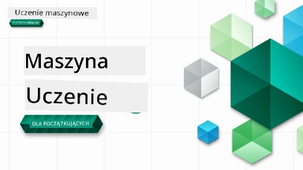

<!--
CO_OP_TRANSLATOR_METADATA:
{
  "original_hash": "ec8385130a8239ad9d827175126a0722",
  "translation_date": "2026-01-01T11:41:45+00:00",
  "source_file": "README.md",
  "language_code": "pl"
}
-->

### 🌐 Wsparcie wielojęzyczne

#### Obsługiwane za pośrednictwem GitHub Action (automatycznie i zawsze aktualne)

<!-- CO-OP TRANSLATOR LANGUAGES TABLE START -->
[Arabski](../ar/README.md) | [Bengalski](../bn/README.md) | [Bułgarski](../bg/README.md) | [Birmański (Myanmar)](../my/README.md) | [Chiński (uproszczony)](../zh/README.md) | [Chiński (tradycyjny, Hongkong)](../hk/README.md) | [Chiński (tradycyjny, Makau)](../mo/README.md) | [Chiński (tradycyjny, Tajwan)](../tw/README.md) | [Chorwacki](../hr/README.md) | [Czeski](../cs/README.md) | [Duński](../da/README.md) | [Holenderski](../nl/README.md) | [Estoński](../et/README.md) | [Fiński](../fi/README.md) | [Francuski](../fr/README.md) | [Niemiecki](../de/README.md) | [Grecki](../el/README.md) | [Hebrajski](../he/README.md) | [Hindi](../hi/README.md) | [Węgierski](../hu/README.md) | [Indonezyjski](../id/README.md) | [Włoski](../it/README.md) | [Japoński](../ja/README.md) | [Kannada](../kn/README.md) | [Koreański](../ko/README.md) | [Litewski](../lt/README.md) | [Malajski](../ms/README.md) | [Malajalam](../ml/README.md) | [Marathi](../mr/README.md) | [Nepalski](../ne/README.md) | [Pidżin nigeryjski](../pcm/README.md) | [Norweski](../no/README.md) | [Perski (Farsi)](../fa/README.md) | [Polski](./README.md) | [Portugalski (Brazylia)](../br/README.md) | [Portugalski (Portugalia)](../pt/README.md) | [Pendżabski (Gurmukhi)](../pa/README.md) | [Rumuński](../ro/README.md) | [Rosyjski](../ru/README.md) | [Serbski (cyrylica)](../sr/README.md) | [Słowacki](../sk/README.md) | [Słoweński](../sl/README.md) | [Hiszpański](../es/README.md) | [Suahili](../sw/README.md) | [Szwedzki](../sv/README.md) | [Tagalog (filipiński)](../tl/README.md) | [Tamilski](../ta/README.md) | [Telugu](../te/README.md) | [Tajski](../th/README.md) | [Turecki](../tr/README.md) | [Ukraiński](../uk/README.md) | [Urdu](../ur/README.md) | [Wietnamski](../vi/README.md)
<!-- CO-OP TRANSLATOR LANGUAGES TABLE END -->

#### Dołącz do naszej społeczności

Prowadzimy serię „Learn with AI” na Discordzie — dowiedz się więcej i dołącz do nas na [Learn with AI Series](https://aka.ms/learnwithai/discord) w dniach 18 - 30 września 2025. Otrzymasz wskazówki i triki dotyczące używania GitHub Copilot w analizie danych.

# Uczenie maszynowe dla początkujących - program nauczania

> 🌍 Podróżuj po świecie, gdy odkrywamy uczenie maszynowe poprzez kultury świata 🌍

Cloud Advocates w Microsoft z przyjemnością oferują 12-tygodniowy program nauczania składający się z 26 lekcji poświęconych **Uczeniu maszynowemu**. W tym programie nauczysz się tego, co bywa nazywane **klasycznym uczeniem maszynowym**, używając głównie biblioteki Scikit-learn i unikając głębokiego uczenia, które jest omówione w naszym [programie AI for Beginners](https://aka.ms/ai4beginners). Połącz te lekcje z naszym [programem 'Data Science for Beginners'](https://aka.ms/ds4beginners) również!

Podróżuj z nami po świecie, stosując te klasyczne techniki do danych z różnych rejonów świata. Każda lekcja zawiera quizy przed i po lekcji, pisemne instrukcje do wykonania lekcji, rozwiązanie, zadanie oraz więcej. Nasza projektowo-zorientowana pedagogika pozwala uczyć się podczas budowania, co jest sprawdzonym sposobem na utrwalenie nowych umiejętności.

**✍️ Serdeczne podziękowania dla naszych autorów** Jen Looper, Stephen Howell, Francesca Lazzeri, Tomomi Imura, Cassie Breviu, Dmitry Soshnikov, Chris Noring, Anirban Mukherjee, Ornella Altunyan, Ruth Yakubu i Amy Boyd

**🎨 Podziękowania również dla naszych ilustratorów** Tomomi Imura, Dasani Madipalli i Jen Looper

**🙏 Specjalne podziękowania 🙏 dla naszych autorów, recenzentów i współtwórców treści ze społeczności Microsoft Student Ambassador**, w szczególności Rishit Dagli, Muhammad Sakib Khan Inan, Rohan Raj, Alexandru Petrescu, Abhishek Jaiswal, Nawrin Tabassum, Ioan Samuila i Snigdha Agarwal

**🤩 Dodatkowe podziękowania dla ambasadorów Microsoft Student Ambassadors Eric Wanjau, Jasleen Sondhi i Vidushi Gupta za nasze lekcje w R!**

# Rozpoczęcie pracy

Wykonaj następujące kroki:
1. **Rozgałęź (Fork) repozytorium**: Kliknij przycisk "Fork" w prawym górnym rogu tej strony.
2. **Sklonuj repozytorium**:   `git clone https://github.com/microsoft/ML-For-Beginners.git`

> [znajdź wszystkie dodatkowe zasoby dla tego kursu w naszej kolekcji Microsoft Learn](https://learn.microsoft.com/en-us/collections/qrqzamz1nn2wx3?WT.mc_id=academic-77952-bethanycheum)

> 🔧 **Potrzebujesz pomocy?** Sprawdź nasz [Przewodnik rozwiązywania problemów](TROUBLESHOOTING.md) w celu uzyskania rozwiązań dla typowych problemów z instalacją, konfiguracją i uruchamianiem lekcji.

**[Studenci](https://aka.ms/student-page)**, aby korzystać z tego programu nauczania, rozgałęź (fork) całe repozytorium na swoje konto GitHub i wykonuj ćwiczenia samodzielnie lub w grupie:

- Zacznij od quizu przedwykładowego.
- Przeczytaj wykład i wykonaj aktywności, zatrzymując się i zastanawiając przy każdym sprawdzeniu wiedzy.
- Staraj się tworzyć projekty, rozumiejąc lekcje zamiast po prostu uruchamiać kod z rozwiązań; jednak ten kod jest dostępny w folderach `/solution` w każdej lekcji zorientowanej projektowo.
- Rozwiąż quiz po wykładzie.
- Wykonaj wyzwanie.
- Wykonaj zadanie.
- Po zakończeniu grupy lekcji odwiedź [Forum dyskusyjne](https://github.com/microsoft/ML-For-Beginners/discussions) i "ucz się na głos", wypełniając odpowiednią ocenę PAT. 'PAT' to narzędzie oceny postępów (Progress Assessment Tool), czyli rubryka, którą wypełniasz, aby pogłębić naukę. Możesz również reagować na inne PATy, abyśmy mogli uczyć się razem.

> Dla dalszych studiów rekomendujemy śledzenie tych modułów i ścieżek nauczania na [Microsoft Learn](https://docs.microsoft.com/en-us/users/jenlooper-2911/collections/k7o7tg1gp306q4?WT.mc_id=academic-77952-leestott).

**Nauczyciele**, zamieściliśmy [kilka sugestii](for-teachers.md) dotyczących wykorzystania tego programu nauczania.

---

## Przewodniki wideo

Niektóre lekcje są dostępne w formie krótkich filmów. Możesz je znaleźć w samych lekcjach lub na [playliście ML for Beginners na kanale Microsoft Developer na YouTube](https://aka.ms/ml-beginners-videos) klikając obraz poniżej.

---

## Poznaj zespół

**Gif autorstwa** [Mohit Jaisal](https://linkedin.com/in/mohitjaisal)

> 🎥 Kliknij powyższy obraz, aby obejrzeć film o projekcie i osobach, które go stworzyły!

---

## Pedagogika

Przy tworzeniu tego programu wybraliśmy dwie zasady pedagogiczne: zapewnienie praktycznego podejścia opartego na projektach oraz włączenie częstych quizów. Ponadto program posiada wspólny **motyw**, który nadaje mu spójność.

Zapewniając, że treść jest powiązana z projektami, proces nauki jest bardziej angażujący dla uczniów, a utrwalenie koncepcji zostaje wzmocnione. Dodatkowo, quiz niskiego ryzyka przed zajęciami ustawia intencję ucznia w kierunku nauki danego tematu, natomiast drugi quiz po zajęciach zapewnia dalsze utrwalenie. Ten program został zaprojektowany tak, aby był elastyczny i przyjemny, i można wziąć w nim udział w całości lub częściowo. Projekty zaczynają się od małych i stają się coraz bardziej skomplikowane pod koniec 12-tygodniowego cyklu. Program zawiera również posłowie na temat zastosowań ML w rzeczywistym świecie, które można wykorzystać jako dodatkowe punkty lub jako podstawę do dyskusji.

> Zapoznaj się z naszym [Kodeksem postępowania](CODE_OF_CONDUCT.md), [Wkładem do projektu](CONTRIBUTING.md), [Tłumaczeniami](TRANSLATIONS.md) i [Przewodnikiem rozwiązywania problemów](TROUBLESHOOTING.md). Czekamy na Twoją konstruktywną opinię!

## Każda lekcja zawiera

- opcjonalną sketchnotkę
- opcjonalne wideo uzupełniające
- przewodnik wideo (tylko niektóre lekcje)
- [quiz rozgrzewkowy przed wykładem](https://ff-quizzes.netlify.app/en/ml/)
- pisemną lekcję
- dla lekcji projektowych: szczegółowe przewodniki krok po kroku, jak zbudować projekt
- sprawdzenia wiedzy
- wyzwanie
- uzupełniającą literaturę
- zadanie
- [quiz po wykładzie](https://ff-quizzes.netlify.app/en/ml/)

> **Uwaga o językach**: Te lekcje są głównie napisane w Pythonie, ale wiele z nich jest również dostępnych w R. Aby ukończyć lekcję w R, przejdź do folderu `/solution` i poszukaj lekcji w R. Zawierają one rozszerzenie .rmd, które oznacza **R Markdown** — można je zdefiniować jako osadzenie `code chunks` (w R lub innych językach) oraz `YAML header` (który określa, jak formatować wyjścia, na przykład PDF) w `Markdown document`. W związku z tym służy jako doskonałe środowisko autorstwa dla data science, ponieważ pozwala łączyć kod, jego wynik oraz Twoje uwagi, umożliwiając zapis ich w Markdown. Ponadto dokumenty R Markdown mogą być renderowane do formatów wyjściowych, takich jak PDF, HTML lub Word.

> **Uwaga o quizach**: Wszystkie quizy znajdują się w folderze [Quiz App](../../quiz-app), łącznie 52 quizy po trzy pytania każdy. Są one linkowane w lekcjach, ale aplikację quizową można uruchomić lokalnie; postępuj zgodnie z instrukcjami w folderze `quiz-app`, aby uruchomić ją lokalnie lub wdrożyć do Azure.

| Numer lekcji |                             Temat                              |                   Grupowanie lekcji                   | Cele nauczania                                                                                                             |                                                              Powiązana lekcja                                                               |                        Autor                        |
| :-----------: | :------------------------------------------------------------: | :-------------------------------------------------: | ------------------------------------------------------------------------------------------------------------------------------- | :--------------------------------------------------------------------------------------------------------------------------------------: | :--------------------------------------------------: |
|      01       |                Wprowadzenie do uczenia maszynowego                |      [Wprowadzenie](1-Introduction/README.md)       | Poznaj podstawowe koncepcje stojące za uczeniem maszynowym                                                                                |                                             [Lekcja](1-Introduction/1-intro-to-ML/README.md)                                             |                       Muhammad                       |
|      02       |                Historia uczenia maszynowego                 |      [Wprowadzenie](1-Introduction/README.md)       | Poznaj historię leżącą u podstaw tej dziedziny                                                                                         |                                            [Lekcja](1-Introduction/2-history-of-ML/README.md)                                            |                     Jen and Amy                      |
|      03       |                 Sprawiedliwość i uczenie maszynowe                  |      [Wprowadzenie](1-Introduction/README.md)       | Jakie są ważne kwestie filozoficzne dotyczące sprawiedliwości, które studenci powinni rozważyć podczas tworzenia i stosowania modeli ML? |                                              [Lekcja](1-Introduction/3-fairness/README.md)                                               |                        Tomomi                        |
|      04       |                Techniki uczenia maszynowego                 |      [Wprowadzenie](1-Introduction/README.md)       | Jakich technik używają badacze ML do budowania modeli ML?                                                                       |                                          [Lekcja](1-Introduction/4-techniques-of-ML/README.md)                                           |                    Chris and Jen                     |
|      05       |                   Wprowadzenie do regresji                   |        [Regresja](2-Regression/README.md)         | Rozpocznij pracę z Pythonem i Scikit-learn przy modelach regresyjnych                                                                  |         [Python](2-Regression/1-Tools/README.md) • [R](../../2-Regression/1-Tools/solution/R/lesson_1.html)         |      Jen • Eric Wanjau       |
|      06       |                Ceny dyni w Ameryce Północnej 🎃                |        [Regresja](2-Regression/README.md)         | Wizualizuj i oczyszczaj dane przygotowując je do ML                                                                                  |          [Python](2-Regression/2-Data/README.md) • [R](../../2-Regression/2-Data/solution/R/lesson_2.html)          |      Jen • Eric Wanjau       |
|      07       |                Ceny dyni w Ameryce Północnej 🎃                |        [Regresja](2-Regression/README.md)         | Buduj modele regresji liniowej i wielomianowej                                                                                   |        [Python](2-Regression/3-Linear/README.md) • [R](../../2-Regression/3-Linear/solution/R/lesson_3.html)        |      Jen and Dmitry • Eric Wanjau       |
|      08       |                Ceny dyni w Ameryce Północnej 🎃                |        [Regresja](2-Regression/README.md)         | Zbuduj model regresji logistycznej                                                                                               |     [Python](2-Regression/4-Logistic/README.md) • [R](../../2-Regression/4-Logistic/solution/R/lesson_4.html)      |      Jen • Eric Wanjau       |
|      09       |                          Aplikacja internetowa 🔌                          |           [Aplikacja internetowa](3-Web-App/README.md)            | Zbuduj aplikację internetową, aby używać wytrenowanego modelu                                                                                       |                                                 [Python](3-Web-App/1-Web-App/README.md)                                                  |                         Jen                          |
|      10       |                 Wprowadzenie do klasyfikacji                 |    [Klasyfikacja](4-Classification/README.md)     | Czyszczenie, przygotowanie i wizualizacja danych; wprowadzenie do klasyfikacji                                                            | [Python](4-Classification/1-Introduction/README.md) • [R](../../4-Classification/1-Introduction/solution/R/lesson_10.html)  | Jen and Cassie • Eric Wanjau |
|      11       |             Pyszne kuchnie azjatyckie i indyjskie 🍜             |    [Klasyfikacja](4-Classification/README.md)     | Wprowadzenie do klasyfikatorów                                                                                                     | [Python](4-Classification/2-Classifiers-1/README.md) • [R](../../4-Classification/2-Classifiers-1/solution/R/lesson_11.html) | Jen and Cassie • Eric Wanjau |
|      12       |             Pyszne kuchnie azjatyckie i indyjskie 🍜             |    [Klasyfikacja](4-Classification/README.md)     | Więcej klasyfikatorów                                                                                                                | [Python](4-Classification/3-Classifiers-2/README.md) • [R](../../4-Classification/3-Classifiers-2/solution/R/lesson_12.html) | Jen and Cassie • Eric Wanjau |
|      13       |             Pyszne kuchnie azjatyckie i indyjskie 🍜             |    [Klasyfikacja](4-Classification/README.md)     | Zbuduj aplikację rekomendacyjną używając swojego modelu                                                                                    |                                              [Python](4-Classification/4-Applied/README.md)                                              |                         Jen                          |
|      14       |                   Wprowadzenie do klasteryzacji                   |        [Klasteryzacja](5-Clustering/README.md)         | Czyszczenie, przygotowanie i wizualizacja danych; wprowadzenie do klasteryzacji                                                                |         [Python](5-Clustering/1-Visualize/README.md) • [R](../../5-Clustering/1-Visualize/solution/R/lesson_14.html)         |      Jen • Eric Wanjau       |
|      15       |              Odkrywanie nigeryjskich gustów muzycznych 🎧              |        [Klasteryzacja](5-Clustering/README.md)         | Poznaj metodę klasteryzacji K-średnich                                                                                           |           [Python](5-Clustering/2-K-Means/README.md) • [R](../../5-Clustering/2-K-Means/solution/R/lesson_15.html)           |      Jen • Eric Wanjau       |
|      16       |        Wprowadzenie do przetwarzania języka naturalnego ☕️         |   [Przetwarzanie języka naturalnego](6-NLP/README.md)    | Poznaj podstawy NLP, budując prostego bota                                                                             |                                             [Python](6-NLP/1-Introduction-to-NLP/README.md)                                              |                       Stephen                        |
|      17       |                      Typowe zadania NLP ☕️                      |   [Przetwarzanie języka naturalnego](6-NLP/README.md)    | Pogłęb wiedzę o NLP, rozumiejąc powszechne zadania związane ze strukturami języka                          |                                                    [Python](6-NLP/2-Tasks/README.md)                                                     |                       Stephen                        |
|      18       |             Tłumaczenie i analiza sentymentu ♥️              |   [Przetwarzanie języka naturalnego](6-NLP/README.md)    | Tłumaczenie i analiza sentymentu na przykładzie Jane Austen                                                                             |                                            [Python](6-NLP/3-Translation-Sentiment/README.md)                                             |                       Stephen                        |
|      19       |                  Romantyczne hotele w Europie ♥️                  |   [Przetwarzanie języka naturalnego](6-NLP/README.md)    | Analiza sentymentu na recenzjach hoteli 1                                                                                         |                                               [Python](6-NLP/4-Hotel-Reviews-1/README.md)                                                |                       Stephen                        |
|      20       |                  Romantyczne hotele w Europie ♥️                  |   [Przetwarzanie języka naturalnego](6-NLP/README.md)    | Analiza sentymentu na recenzjach hoteli 2                                                                                         |                                               [Python](6-NLP/5-Hotel-Reviews-2/README.md)                                                |                       Stephen                        |
|      21       |            Wprowadzenie do prognozowania szeregów czasowych             |        [Szeregi czasowe](7-TimeSeries/README.md)        | Wprowadzenie do prognozowania szeregów czasowych                                                                                         |                                             [Python](7-TimeSeries/1-Introduction/README.md)                                              |                      Francesca                       |
|      22       | ⚡️ Zużycie energii na świecie ⚡️ - prognozowanie szeregów czasowych z ARIMA |        [Szeregi czasowe](7-TimeSeries/README.md)        | Prognozowanie szeregów czasowych z wykorzystaniem ARIMA                                                                                              |                                                 [Python](7-TimeSeries/2-ARIMA/README.md)                                                 |                      Francesca                       |
|      23       |  ⚡️ Zużycie energii na świecie ⚡️ - prognozowanie szeregów czasowych z SVR  |        [Szeregi czasowe](7-TimeSeries/README.md)        | Prognozowanie szeregów czasowych z użyciem Support Vector Regressor                                                                           |                                                  [Python](7-TimeSeries/3-SVR/README.md)                                                  |                       Anirban                        |
|      24       |             Wprowadzenie do uczenia przez wzmacnianie             | [Uczenie przez wzmacnianie](8-Reinforcement/README.md) | Wprowadzenie do uczenia przez wzmacnianie z Q-Learning                                                                          |                                             [Python](8-Reinforcement/1-QLearning/README.md)                                              |                        Dmitry                        |
|      25       |                 Pomóż Peterowi uniknąć wilka! 🐺                  | [Uczenie przez wzmacnianie](8-Reinforcement/README.md) | Uczenie przez wzmacnianie w Gym                                                                                                      |                                                [Python](8-Reinforcement/2-Gym/README.md)                                                 |                        Dmitry                        |
|  Posłowie   |            Scenariusze i zastosowania ML w świecie rzeczywistym            |      [ML w praktyce](9-Real-World/README.md)       | Interesujące i pouczające zastosowania klasycznego ML w świecie rzeczywistym                                                               |                                             [Lekcja](9-Real-World/1-Applications/README.md)                                              |                         Zespół                         |
|  Posłowie   |            Debugowanie modeli w ML z użyciem pulpitu RAI          |      [ML w praktyce](9-Real-World/README.md)       | Debugowanie modeli w uczeniu maszynowym przy użyciu komponentów pulpitu Responsible AI                                                              |                                             [Lekcja](9-Real-World/2-Debugging-ML-Models/README.md)                                              |                         Ruth Yakubu                       |

> [znajdź wszystkie dodatkowe zasoby dla tego kursu w naszej kolekcji Microsoft Learn](https://learn.microsoft.com/en-us/collections/qrqzamz1nn2wx3?WT.mc_id=academic-77952-bethanycheum)

## Dostęp offline

Możesz uruchomić tę dokumentację offline, używając [Docsify](https://docsify.js.org/#/). Sforkuj to repozytorium, [zainstaluj Docsify](https://docsify.js.org/#/quickstart) na swoim komputerze, a następnie w głównym folderze tego repo wpisz `docsify serve`. Witryna będzie serwowana na porcie 3000 na twoim localhost: `localhost:3000`.

## Pliki PDF

Znajdź plik pdf programu nauczania z linkami [tutaj](https://microsoft.github.io/ML-For-Beginners/pdf/readme.pdf).

## 🎒 Inne kursy 

Nasz zespół tworzy inne kursy! Zobacz:

<!-- CO-OP TRANSLATOR OTHER COURSES START -->
### LangChain

---

### Azure / Edge / MCP / Agenci

---
 
### Seria Generative AI

[-9333EA?style=for-the-badge&labelColor=E5E7EB&color=9333EA)](https://github.com/microsoft/Generative-AI-for-beginners-dotnet?WT.mc_id=academic-105485-koreyst)
[-C084FC?style=for-the-badge&labelColor=E5E7EB&color=C084FC)](https://github.com/microsoft/generative-ai-for-beginners-java?WT.mc_id=academic-105485-koreyst)
[-E879F9?style=for-the-badge&labelColor=E5E7EB&color=E879F9)](https://github.com/microsoft/generative-ai-with-javascript?WT.mc_id=academic-105485-koreyst)

---
 
### Główne materiały

---
 
### Seria Copilot

<!-- CO-OP TRANSLATOR OTHER COURSES END -->

## Uzyskiwanie pomocy

Jeśli utkniesz lub będziesz mieć pytania dotyczące tworzenia aplikacji AI, dołącz do innych uczących się i doświadczonych programistów w dyskusjach o MCP. To wspierająca społeczność, gdzie pytania są mile widziane, a wiedza jest swobodnie dzielona.

Jeśli masz uwagi dotyczące produktu lub napotkasz błędy podczas tworzenia, odwiedź:

---

<!-- CO-OP TRANSLATOR DISCLAIMER START -->
**Zastrzeżenie**:
Ten dokument został przetłumaczony przy użyciu usługi tłumaczenia AI [Co-op Translator](https://github.com/Azure/co-op-translator). Dokładamy starań, aby tłumaczenie było jak najbardziej precyzyjne, jednak prosimy pamiętać, że tłumaczenia automatyczne mogą zawierać błędy lub nieścisłości. Za wiążące należy uważać oryginalny dokument w języku źródłowym. W przypadku informacji o krytycznym znaczeniu zaleca się skorzystanie z profesjonalnego tłumaczenia wykonanego przez człowieka. Nie ponosimy odpowiedzialności za jakiekolwiek nieporozumienia lub błędne interpretacje wynikające z korzystania z tego tłumaczenia.
<!-- CO-OP TRANSLATOR DISCLAIMER END -->