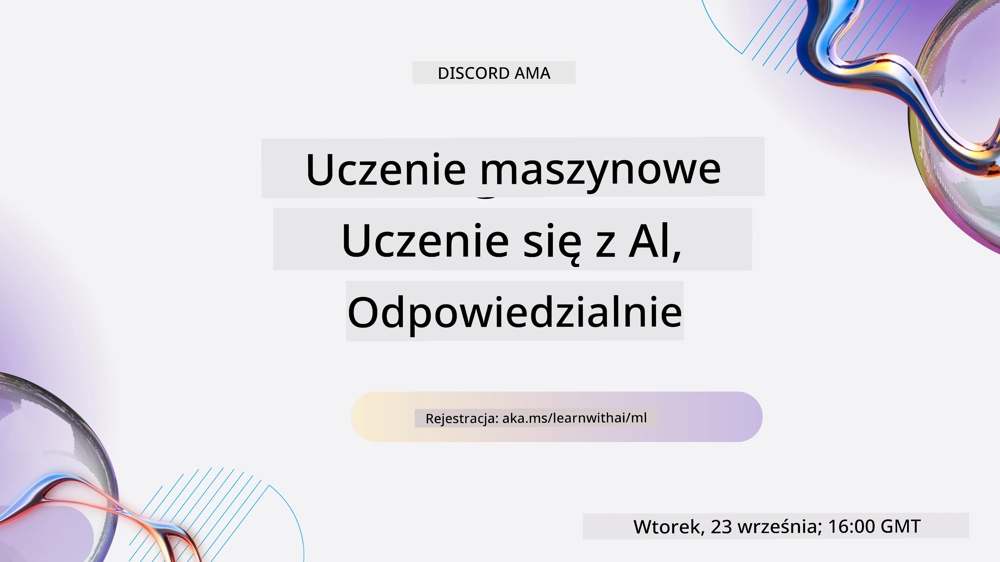
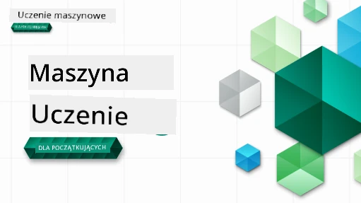

[](https://github.com/microsoft/ML-For-Beginners/blob/master/LICENSE)
[](https://GitHub.com/microsoft/ML-For-Beginners/graphs/contributors/)
[](https://GitHub.com/microsoft/ML-For-Beginners/issues/)
[](https://GitHub.com/microsoft/ML-For-Beginners/pulls/)
[](http://makeapullrequest.com)

[](https://GitHub.com/microsoft/ML-For-Beginners/watchers/)
[](https://GitHub.com/microsoft/ML-For-Beginners/network/)
[](https://GitHub.com/microsoft/ML-For-Beginners/stargazers/)

### 🌐 Wsparcie Wielojęzyczne

#### Wspierane przez GitHub Action (Automatyczne i Zawsze Aktualne)

<!-- CO-OP TRANSLATOR LANGUAGES TABLE START -->
[Arabski](../ar/README.md) | [Bengalski](../bn/README.md) | [Bułgarski](../bg/README.md) | [Birmański (Myanmar)](../my/README.md) | [Chiński (uproszczony)](../zh-CN/README.md) | [Chiński (tradycyjny, Hong Kong)](../zh-HK/README.md) | [Chiński (tradycyjny, Makau)](../zh-MO/README.md) | [Chiński (tradycyjny, Tajwan)](../zh-TW/README.md) | [Chorwacki](../hr/README.md) | [Czeski](../cs/README.md) | [Duński](../da/README.md) | [Niderlandzki](../nl/README.md) | [Estoński](../et/README.md) | [Fiński](../fi/README.md) | [Francuski](../fr/README.md) | [Niemiecki](../de/README.md) | [Grecki](../el/README.md) | [Hebrajski](../he/README.md) | [Hindi](../hi/README.md) | [Węgierski](../hu/README.md) | [Indonezyjski](../id/README.md) | [Włoski](../it/README.md) | [Japoński](../ja/README.md) | [Kannada](../kn/README.md) | [Khmer](../km/README.md) | [Koreański](../ko/README.md) | [Litewski](../lt/README.md) | [Malajski](../ms/README.md) | [Malajalam](../ml/README.md) | [Marathi](../mr/README.md) | [Nepalski](../ne/README.md) | [Nigeryjski pidżin](../pcm/README.md) | [Norweski](../no/README.md) | [Perski (Farsi)](../fa/README.md) | [Polski](./README.md) | [Portugalski (Brazylia)](../pt-BR/README.md) | [Portugalski (Portugalia)](../pt-PT/README.md) | [Pendżabski (Gurmukhi)](../pa/README.md) | [Rumunski](../ro/README.md) | [Rosyjski](../ru/README.md) | [Serbski (cyryllica)](../sr/README.md) | [Słowacki](../sk/README.md) | [Słoweński](../sl/README.md) | [Hiszpański](../es/README.md) | [Suahili](../sw/README.md) | [Szwedzki](../sv/README.md) | [Tagalog (Filipiński)](../tl/README.md) | [Tamilski](../ta/README.md) | [Telugu](../te/README.md) | [Tajski](../th/README.md) | [Turecki](../tr/README.md) | [Ukraiński](../uk/README.md) | [Urdu](../ur/README.md) | [Wietnamski](../vi/README.md)

> **Wolisz klonować lokalnie?**
>
> To repozytorium zawiera tłumaczenia na ponad 50 języków, co znacznie zwiększa rozmiar pobierania. Aby sklonować bez tłumaczeń, użyj sparse checkout:
>
> **Bash / macOS / Linux:**
> ```bash
> git clone --filter=blob:none --sparse https://github.com/microsoft/ML-For-Beginners.git
> cd ML-For-Beginners
> git sparse-checkout set --no-cone '/*' '!translations' '!translated_images'
> ```
>
> **CMD (Windows):**
> ```cmd
> git clone --filter=blob:none --sparse https://github.com/microsoft/ML-For-Beginners.git
> cd ML-For-Beginners
> git sparse-checkout set --no-cone "/*" "!translations" "!translated_images"
> ```
>
> Dzięki temu otrzymasz wszystko, czego potrzebujesz, aby ukończyć kurs, przy znacznie szybszym pobieraniu.
<!-- CO-OP TRANSLATOR LANGUAGES TABLE END -->

#### Dołącz do naszej społeczności

[](https://discord.gg/nTYy5BXMWG)

Prowadzimy serię na Discordzie "Learn with AI", dowiedz się więcej i dołącz do nas na [Learn with AI Series](https://aka.ms/learnwithai/discord) w dniach 18 - 30 września 2025. Otrzymasz wskazówki i triki dotyczące korzystania z GitHub Copilot dla Data Science.



# Uczenie Maszynowe dla Początkujących - Program Nauczania

> 🌍 Podróżuj po świecie, odkrywając uczenie maszynowe przez pryzmat kultur świata 🌍

Cloud Advocates w Microsoft z przyjemnością oferują 12-tygodniowy kurs składający się z 26 lekcji poświęconych **Uczeniu Maszynowemu**. W tym kursie poznasz to, co bywa nazywane **klasycznym uczeniem maszynowym**, korzystając głównie z biblioteki Scikit-learn i unikając głębokiego uczenia, które jest omówione w naszym [programie AI dla Początkujących](https://aka.ms/ai4beginners). Połącz te lekcje z naszym ['Data Science dla Początkujących'](https://aka.ms/ds4beginners)!

Podróżuj z nami po świecie, stosując klasyczne techniki do danych z różnych obszarów globu. Każda lekcja zawiera quizy przed i po lekcji, pisemne instrukcje do wykonania zadania, rozwiązanie, zadanie do wykonania i inne. Nasza dydaktyka oparta na projektach pozwala uczyć się przez praktykę — to sprawdzony sposób na skuteczne przyswajanie nowych umiejętności.

**✍️ Serdeczne podziękowania dla naszych autorów** Jen Looper, Stephen Howell, Francesca Lazzeri, Tomomi Imura, Cassie Breviu, Dmitry Soshnikov, Chris Noring, Anirban Mukherjee, Ornella Altunyan, Ruth Yakubu i Amy Boyd

**🎨 Podziękowania również dla naszych ilustratorów** Tomomi Imura, Dasani Madipalli i Jen Looper

**🙏 Specjalne podziękowania 🙏 dla naszych autorów, recenzentów i współtwórców treści z Microsoft Student Ambassador**, zwłaszcza dla Rishit Dagli, Muhammad Sakib Khan Inan, Rohan Raj, Alexandru Petrescu, Abhishek Jaiswal, Nawrin Tabassum, Ioan Samuila i Snigdha Agarwal

**🤩 Szczególne podziękowania dla Microsoft Student Ambassadors Erica Wanjau, Jasleen Sondhi i Vidushi Gupta za nasze lekcje w R!**

# Pierwsze Kroki

Wykonaj następujące kroki:
1. **Zrób forka repozytorium**: Kliknij przycisk "Fork" w prawym górnym rogu tej strony.
2. **Sklonuj repozytorium**:   `git clone https://github.com/microsoft/ML-For-Beginners.git`

> 💡 **Szybka wskazówka:** Chcesz zacząć w przeglądarce bez instalowania Pythona lokalnie? Skorzystaj z [GitHub Codespaces](https://github.com/features/codespaces) do utworzenia środowiska chmurowego dla swojego forka. Otwórz zielone menu **Code**, wybierz **Codespaces** i utwórz codespace; w razie potrzeby zainstaluj w nim zależności wymagane przez każdą lekcję.

> [znajdź wszystkie dodatkowe zasoby do tego kursu w naszej kolekcji Microsoft Learn](https://learn.microsoft.com/en-us/collections/qrqzamz1nn2wx3?WT.mc_id=academic-77952-bethanycheum)

> 🔧 **Potrzebujesz pomocy?** Sprawdź nasz [Przewodnik rozwiązywania problemów](TROUBLESHOOTING.md) z rozwiązaniami typowych kwestii dotyczących instalacji, konfiguracji i uruchamiania lekcji.


**[Studenci](https://aka.ms/student-page)**, aby korzystać z tego programu, zrób fork całego repozytorium na swoje konto GitHub i wykonuj ćwiczenia samodzielnie lub w grupie:

- Zacznij od quizu przed wykładem.
- Przeczytaj wykład i wykonaj aktywności, zatrzymując się i zastanawiając nad każdym sprawdzianem wiedzy.
- Staraj się tworzyć projekty rozumiejąc lekcje, zamiast uruchamiać gotowe rozwiązania; jednak kody rozwiązań są dostępne w folderach `/solution` każdej lekcji projektowej.
- Rozwiąż quiz po wykładzie.
- Wykonaj wyzwanie.
- Wykonaj zadanie domowe.
- Po ukończeniu grupy lekcji odwiedź [Tablicę Dyskusyjną](https://github.com/microsoft/ML-For-Beginners/discussions) i „ucz się na głos” wypełniając odpowiednią rubrykę PAT. PAT to narzędzie oceny postępów, czyli rubryka, którą wypełniasz, aby pogłębić naukę. Możesz też reagować na inne PATy, abyśmy mogli się uczyć razem.

> Do dalszej nauki polecamy następujące [moduły i ścieżki nauki Microsoft Learn](https://docs.microsoft.com/en-us/users/jenlooper-2911/collections/k7o7tg1gp306q4?WT.mc_id=academic-77952-leestott).

**Nauczyciele**, przygotowaliśmy [kilka sugestii](for-teachers.md) dotyczących korzystania z tego programu.

---

## Materiały wideo

Niektóre lekcje dostępne są w formie krótkich filmów. Znajdziesz je osadzone bezpośrednio w lekcjach lub na [playliście ML for Beginners na kanale Microsoft Developer na YouTube](https://aka.ms/ml-beginners-videos), klikając poniższy obrazek.

[](https://aka.ms/ml-beginners-videos)

---

## Poznaj zespół

[](https://youtu.be/Tj1XWrDSYJU)

**Gif autorstwa** [Mohit Jaisal](https://linkedin.com/in/mohitjaisal)

> 🎥 Kliknij powyższy obrazek, aby obejrzeć film o projekcie i ludziach, którzy go stworzyli!

---

## Pedagogika

Przy budowie tego programu wybraliśmy dwie zasady dydaktyczne: zapewnienie praktycznego charakteru **opartego na projektach** oraz obecność **częstych quizów**. Dodatkowo, program ma wspólny **motyw przewodni**, który nadaje mu spójność.

Dzięki powiązaniu materiału z projektami proces nauki staje się bardziej angażujący, a zapamiętywanie pojęć jest skuteczniejsze. Niski próg trudności quizów przed zajęciami ustawia nastawienie ucznia na naukę tematu, a drugi quiz po zajęciach zapewnia lepsze utrwalenie wiedzy. Program został zaprojektowany tak, aby był elastyczny i przyjemny, można go realizować w całości lub częściowo. Projekty zaczynają się od małych, by stopniowo stawać się coraz bardziej złożone pod koniec 12-tygodniowego cyklu. Kurs zawiera również postscriptum o rzeczywistych zastosowaniach ML, które może służyć jako dodatkowe zadanie lub podstawa do dyskusji.

> Znajdź nasze wytyczne: [Kodeks postępowania](CODE_OF_CONDUCT.md), [Wkład](CONTRIBUTING.md), [Tłumaczenia](..) oraz [Rozwiązywanie problemów](TROUBLESHOOTING.md). Chętnie przyjmujemy Twoje konstruktywne uwagi!

## Każda lekcja zawiera

- opcjonalną notatkę typu sketchnote
- opcjonalne wideo uzupełniające
- film instruktażowy (tylko niektóre lekcje)
- [quiz rozgrzewkowy przed lekcją](https://ff-quizzes.netlify.app/en/ml/)
- lekcję napisaną
- w lekcjach projektowych przewodniki krok po kroku jak zbudować projekt
- sprawdziany wiedzy
- wyzwanie
- dodatkowe lektury
- zadanie domowe
- [quiz po lekcji](https://ff-quizzes.netlify.app/en/ml/)

> **Uwagi o językach**: Lekcje są głównie napisane w Pythonie, ale wiele jest także dostępnych w R. Aby ukończyć lekcję w R, przejdź do folderu `/solution` i znajdź lekcje R, które mają rozszerzenie .rmd reprezentujące plik **R Markdown** — można go po prostu zdefiniować jako osadzenie `fragmentów kodu` (R lub innych języków) i `nagłówka YAML` (który określa formatowanie wyników np. PDF) w dokumencie `Markdown`. Dzięki temu jest to wzorcowe środowisko autorskie dla data science, ponieważ pozwala łączyć kod, jego wyniki oraz twoje przemyślenia, zapisane w Markdown. Ponadto dokumenty R Markdown można renderować do formatów wyjściowych takich jak PDF, HTML czy Word.

> **Uwagi o quizach**: Wszystkie quizy znajdują się w [folderze Quiz App](../../quiz-app), łącznie 52 quizy po trzy pytania każdy. Są powiązane z lekcjami, ale aplikację quizową można uruchomić lokalnie; postępuj zgodnie z instrukcjami w folderze `quiz-app`, aby lokalnie hostować lub wdrożyć na Azure.

| Numer lekcji |                             Temat                              |                   Grupa lekcji                   | Cele kształcenia                                                                                                                |                                                              Powiązana lekcja                                                               |                        Autor                        |
| :-----------: | :------------------------------------------------------------: | :-------------------------------------------------: | ------------------------------------------------------------------------------------------------------------------------------- | :--------------------------------------------------------------------------------------------------------------------------------------: | :--------------------------------------------------: |
|      01       |                Wprowadzenie do uczenia maszynowego                |      [Introduction](1-Introduction/README.md)       | Poznaj podstawowe pojęcia stojące za uczeniem maszynowym                                                                            |                                             [Lesson](1-Introduction/1-intro-to-ML/README.md)                                             |                       Muhammad                       |
|      02       |                Historia uczenia maszynowego                 |      [Introduction](1-Introduction/README.md)       | Poznaj historię leżącą u podstaw tej dziedziny                                                                                      |                                            [Lesson](1-Introduction/2-history-of-ML/README.md)                                            |                     Jen and Amy                      |
|      03       |                 Sprawiedliwość i uczenie maszynowe                  |      [Introduction](1-Introduction/README.md)       | Jakie są ważne kwestie filozoficzne dotyczące sprawiedliwości, które uczniowie powinni rozważyć podczas tworzenia i stosowania modeli ML? |                                              [Lesson](1-Introduction/3-fairness/README.md)                                               |                        Tomomi                        |
|      04       |                Techniki w uczeniu maszynowym                 |      [Introduction](1-Introduction/README.md)       | Jakie techniki wykorzystują badacze ML do tworzenia modeli ML?                                                                       |                                          [Lesson](1-Introduction/4-techniques-of-ML/README.md)                                           |                    Chris and Jen                     |
|      05       |                   Wprowadzenie do regresji                   |        [Regression](2-Regression/README.md)         | Zacznij z Pythonem i Scikit-learn dla modeli regresji                                                                                |         [Python](2-Regression/1-Tools/README.md) • [R](../../2-Regression/1-Tools/solution/R/lesson_1.html)         |      Jen • Eric Wanjau       |
|      06       |                Ceny dyni w Ameryce Północnej 🎃                |        [Regression](2-Regression/README.md)         | Wizualizuj i oczyszczaj dane w przygotowaniu do ML                                                                                   |          [Python](2-Regression/2-Data/README.md) • [R](../../2-Regression/2-Data/solution/R/lesson_2.html)          |      Jen • Eric Wanjau       |
|      07       |                Ceny dyni w Ameryce Północnej 🎃                |        [Regression](2-Regression/README.md)         | Buduj modele regresji liniowej i wielomianowej                                                                                       |        [Python](2-Regression/3-Linear/README.md) • [R](../../2-Regression/3-Linear/solution/R/lesson_3.html)        |      Jen and Dmitry • Eric Wanjau       |
|      08       |                Ceny dyni w Ameryce Północnej 🎃                |        [Regression](2-Regression/README.md)         | Buduj model regresji logistycznej                                                                                                   |     [Python](2-Regression/4-Logistic/README.md) • [R](../../2-Regression/4-Logistic/solution/R/lesson_4.html)      |      Jen • Eric Wanjau       |
|      09       |                          Aplikacja internetowa 🔌                          |           [Web App](3-Web-App/README.md)            | Stwórz aplikację internetową do używania wytrenowanego modelu                                                                       |                                                 [Python](3-Web-App/1-Web-App/README.md)                                                  |                         Jen                          |
|      10       |                 Wprowadzenie do klasyfikacji                 |    [Classification](4-Classification/README.md)     | Oczyść, przygotuj i wizualizuj swoje dane; wprowadzenie do klasyfikacji                                                            | [Python](4-Classification/1-Introduction/README.md) • [R](../../4-Classification/1-Introduction/solution/R/lesson_10.html)  | Jen and Cassie • Eric Wanjau |
|      11       |             Pyszne kuchnie azjatyckie i indyjskie 🍜             |    [Classification](4-Classification/README.md)     | Wprowadzenie do klasyfikatorów                                                                                                      | [Python](4-Classification/2-Classifiers-1/README.md) • [R](../../4-Classification/2-Classifiers-1/solution/R/lesson_11.html) | Jen and Cassie • Eric Wanjau |
|      12       |             Pyszne kuchnie azjatyckie i indyjskie 🍜             |    [Classification](4-Classification/README.md)     | Więcej klasyfikatorów                                                                                                               | [Python](4-Classification/3-Classifiers-2/README.md) • [R](../../4-Classification/3-Classifiers-2/solution/R/lesson_12.html) | Jen and Cassie • Eric Wanjau |
|      13       |             Pyszne kuchnie azjatyckie i indyjskie 🍜             |    [Classification](4-Classification/README.md)     | Zbuduj aplikację internetową rekomendacji używając swojego modelu                                                                    |                                              [Python](4-Classification/4-Applied/README.md)                                              |                         Jen                          |
|      14       |                   Wprowadzenie do grupowania                   |        [Clustering](5-Clustering/README.md)         | Oczyść, przygotuj i wizualizuj swoje dane; wprowadzenie do grupowania                                                               |         [Python](5-Clustering/1-Visualize/README.md) • [R](../../5-Clustering/1-Visualize/solution/R/lesson_14.html)         |      Jen • Eric Wanjau       |
|      15       |              Eksplorowanie nigeryjskich gustów muzycznych 🎧              |        [Clustering](5-Clustering/README.md)         | Poznaj metodę grupowania K-Średnich                                                                                               |           [Python](5-Clustering/2-K-Means/README.md) • [R](../../5-Clustering/2-K-Means/solution/R/lesson_15.html)           |      Jen • Eric Wanjau       |
|      16       |        Wprowadzenie do przetwarzania języka naturalnego ☕️         |   [Natural language processing](6-NLP/README.md)    | Poznaj podstawy NLP budując prostego bota                                                                                           |                                             [Python](6-NLP/1-Introduction-to-NLP/README.md)                                              |                       Stephen                        |
|      17       |                      Typowe zadania NLP ☕️                      |   [Natural language processing](6-NLP/README.md)    | Pogłęb swoją wiedzę o NLP, poznając typowe zadania wymagane przy pracy ze strukturami językowymi                                     |                                                    [Python](6-NLP/2-Tasks/README.md)                                                     |                       Stephen                        |
|      18       |             Tłumaczenie i analiza sentymentu ♥️              |   [Natural language processing](6-NLP/README.md)    | Tłumaczenie i analiza sentymentu z Jane Austen                                                                                      |                                            [Python](6-NLP/3-Translation-Sentiment/README.md)                                             |                       Stephen                        |
|      19       |                  Romantyczne hotele w Europie ♥️                  |   [Natural language processing](6-NLP/README.md)    | Analiza sentymentu na podstawie opinii o hotelach 1                                                                                |                                               [Python](6-NLP/4-Hotel-Reviews-1/README.md)                                                |                       Stephen                        |
|      20       |                  Romantyczne hotele w Europie ♥️                  |   [Natural language processing](6-NLP/README.md)    | Analiza sentymentu na podstawie opinii o hotelach 2                                                                                |                                               [Python](6-NLP/5-Hotel-Reviews-2/README.md)                                                |                       Stephen                        |
|      21       |            Wprowadzenie do prognozowania szeregów czasowych             |        [Time series](7-TimeSeries/README.md)        | Wprowadzenie do prognozowania szeregów czasowych                                                                                   |                                             [Python](7-TimeSeries/1-Introduction/README.md)                                              |                      Francesca                       |
|      22       | ⚡️ Zużycie energii na świecie ⚡️ - prognozowanie szeregów czasowych z ARIMA |        [Time series](7-TimeSeries/README.md)        | Prognozowanie szeregów czasowych z ARIMA                                                                                           |                                                 [Python](7-TimeSeries/2-ARIMA/README.md)                                                 |                      Francesca                       |
|      23       |  ⚡️ Zużycie energii na świecie ⚡️ - prognozowanie szeregów czasowych z SVR  |        [Time series](7-TimeSeries/README.md)        | Prognozowanie szeregów czasowych z Regressorem Wektorów Nośnych                                                                   |                                                  [Python](7-TimeSeries/3-SVR/README.md)                                                  |                       Anirban                        |
|      24       |             Wprowadzenie do uczenia przez wzmacnianie             | [Reinforcement learning](8-Reinforcement/README.md) | Wprowadzenie do uczenia przez wzmacnianie z Q-Learning                                                                             |                                             [Python](8-Reinforcement/1-QLearning/README.md)                                              |                        Dmitry                        |
|      25       |                 Pomóż Peterowi uniknąć wilka! 🐺                  | [Reinforcement learning](8-Reinforcement/README.md) | Uczenie przez wzmacnianie w Gym                                                                                                   |                                                [Python](8-Reinforcement/2-Gym/README.md)                                                 |                        Dmitry                        |
|  Postscript   |            Scenariusze i zastosowania ML w rzeczywistym świecie            |      [ML in the Wild](9-Real-World/README.md)       | Interesujące i pouczające zastosowania klasycznego ML w rzeczywistych sytuacjach                                                   |                                             [Lesson](9-Real-World/1-Applications/README.md)                                              |                         Team                         |
|  Postscript   |            Debugowanie modelu ML przy użyciu pulpitu RAI            |      [ML in the Wild](9-Real-World/README.md)       | Debugowanie modelu w uczeniu maszynowym za pomocą komponentów pulpitu Responsible AI                                              |                                             [Lesson](9-Real-World/2-Debugging-ML-Models/README.md)                                              |                     Ruth Yakubu                      |

> [znajdź wszystkie dodatkowe zasoby do tego kursu w naszej kolekcji Microsoft Learn](https://learn.microsoft.com/en-us/collections/qrqzamz1nn2wx3?WT.mc_id=academic-77952-bethanycheum)

## Dostęp offline

Możesz uruchomić tę dokumentację offline, korzystając z [Docsify](https://docsify.js.org/#/). Rozgałęź to repozytorium, [zainstaluj Docsify](https://docsify.js.org/#/quickstart) na swojej lokalnej maszynie, a następnie w katalogu głównym tego repozytorium wpisz `docsify serve`. Strona będzie serwowana na porcie 3000 na twoim localhost: `localhost:3000`.

## Pliki PDF

Znajdź pdf programu nauczania z linkami [tutaj](https://microsoft.github.io/ML-For-Beginners/pdf/readme.pdf).


## 🎒 Inne kursy 

Nasz zespół tworzy inne kursy! Sprawdź:

<!-- CO-OP TRANSLATOR OTHER COURSES START -->
### LangChain
[](https://aka.ms/langchain4j-for-beginners)
[](https://aka.ms/langchainjs-for-beginners?WT.mc_id=m365-94501-dwahlin)
[](https://github.com/microsoft/langchain-for-beginners?WT.mc_id=m365-94501-dwahlin)
---

### Azure / Edge / MCP / Agenci
[](https://github.com/microsoft/AZD-for-beginners?WT.mc_id=academic-105485-koreyst)
[](https://github.com/microsoft/edgeai-for-beginners?WT.mc_id=academic-105485-koreyst)
[](https://github.com/microsoft/mcp-for-beginners?WT.mc_id=academic-105485-koreyst)
[](https://github.com/microsoft/ai-agents-for-beginners?WT.mc_id=academic-105485-koreyst)

---
 
### Seria Generatywnej AI
[](https://github.com/microsoft/generative-ai-for-beginners?WT.mc_id=academic-105485-koreyst)
[-9333EA?style=for-the-badge&labelColor=E5E7EB&color=9333EA)](https://github.com/microsoft/Generative-AI-for-beginners-dotnet?WT.mc_id=academic-105485-koreyst)
[-C084FC?style=for-the-badge&labelColor=E5E7EB&color=C084FC)](https://github.com/microsoft/generative-ai-for-beginners-java?WT.mc_id=academic-105485-koreyst)
[-E879F9?style=for-the-badge&labelColor=E5E7EB&color=E879F9)](https://github.com/microsoft/generative-ai-with-javascript?WT.mc_id=academic-105485-koreyst)

---
 
### Core Learning
[](https://aka.ms/ml-beginners?WT.mc_id=academic-105485-koreyst)
[](https://aka.ms/datascience-beginners?WT.mc_id=academic-105485-koreyst)
[](https://aka.ms/ai-beginners?WT.mc_id=academic-105485-koreyst)
[](https://github.com/microsoft/Security-101?WT.mc_id=academic-96948-sayoung)
[](https://aka.ms/webdev-beginners?WT.mc_id=academic-105485-koreyst)
[](https://aka.ms/iot-beginners?WT.mc_id=academic-105485-koreyst)
[](https://github.com/microsoft/xr-development-for-beginners?WT.mc_id=academic-105485-koreyst)

---
 
### Seria Copilot
[](https://aka.ms/GitHubCopilotAI?WT.mc_id=academic-105485-koreyst)
[](https://github.com/microsoft/mastering-github-copilot-for-dotnet-csharp-developers?WT.mc_id=academic-105485-koreyst)
[](https://github.com/microsoft/CopilotAdventures?WT.mc_id=academic-105485-koreyst)
<!-- CO-OP TRANSLATOR OTHER COURSES END -->

## Uzyskiwanie pomocy

Jeśli utkniesz lub masz pytania podczas nauki uczenia maszynowego lub tworzenia aplikacji AI, nie martw się — pomoc jest dostępna.

Możesz dołączyć do dyskusji z innymi uczącymi się i programistami, zadawać pytania i dzielić się swoimi pomysłami ze społecznością.

- Dołącz do społeczności, aby zadawać pytania i uczyć się wraz z innymi
- Dyskutuj o koncepcjach uczenia maszynowego i pomysłach na projekty
- Uzyskaj wskazówki od doświadczonych programistów

Wspierająca społeczność to świetny sposób na rozwijanie swoich umiejętności i szybsze rozwiązywanie problemów.

[Microsoft Foundry Discord Community](https://discord.gg/nTYy5BXMWG)

Jeśli napotkasz błędy, problemy lub masz sugestie dotyczące ulepszeń, możesz również otworzyć **Issue** w tym repozytorium, aby zgłosić problem.

Aby przekazać opinię o produkcie lub przeszukać istniejące wpisy społeczności, odwiedź Forum deweloperów:

[](https://aka.ms/foundry/forum)

## Dodatkowe wskazówki do nauki

- Przeglądaj notatniki po każdej lekcji, aby lepiej zrozumieć materiał.
- Ćwicz samodzielne implementowanie algorytmów.
- Eksploruj rzeczywiste zbiory danych, korzystając z poznanych koncepcji.

---

<!-- CO-OP TRANSLATOR DISCLAIMER START -->
**Zastrzeżenie**:
Niniejszy dokument został przetłumaczony za pomocą usługi tłumaczenia AI [Co-op Translator](https://github.com/Azure/co-op-translator). Choć dążymy do dokładności, prosimy pamiętać, że automatyczne tłumaczenia mogą zawierać błędy lub niedokładności. Oryginalny dokument w jego języku źródłowym należy uznawać za autorytatywne źródło. W przypadku informacji krytycznych zalecane jest skorzystanie z profesjonalnego tłumaczenia wykonanego przez człowieka. Nie ponosimy odpowiedzialności za jakiekolwiek nieporozumienia lub błędne interpretacje wynikające z użycia tego tłumaczenia.
<!-- CO-OP TRANSLATOR DISCLAIMER END -->