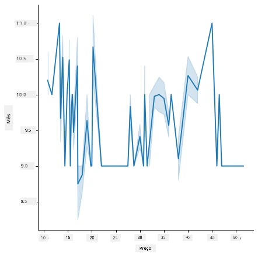
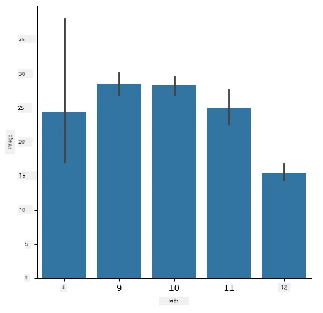
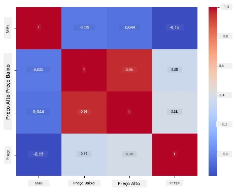

# Construa um modelo de regressão usando Scikit-learn: preparar e visualizar dados


Infográfico por [Dasani Madipalli](https://twitter.com/dasani_decoded)

## [Quiz pré-aula](https://ff-quizzes.netlify.app/en/ml/)

> ### [Esta lição está disponível em R!](../../../../2-Regression/2-Data/solution/R/lesson_2.html)

## Introdução

Agora que você está configurado com as ferramentas necessárias para começar a construir modelos de aprendizado de máquina com Scikit-learn, você está pronto para começar a fazer perguntas sobre os seus dados. Ao trabalhar com dados e aplicar soluções de ML, é muito importante entender como fazer a pergunta certa para desbloquear adequadamente os potenciais do seu conjunto de dados.

Nesta lição, você aprenderá:

- Como preparar seus dados para a construção do modelo.
- Como usar Matplotlib para visualização de dados.
- Como usar Seaborn para uma visualização de dados mais expressiva.

## Fazendo a pergunta certa sobre seus dados

A pergunta que você precisa responder determinará que tipo de algoritmos de ML você utilizará. E a qualidade da resposta que você obterá dependerá muito da natureza dos seus dados.

Dê uma olhada nos [dados](https://github.com/microsoft/ML-For-Beginners/blob/main/2-Regression/data/US-pumpkins.csv) fornecidos para esta lição. Você pode abrir este arquivo .csv no VS Code. Uma rápida análise mostra imediatamente que há espaços em branco e uma mistura de dados numéricos e de texto. Há também uma coluna estranha chamada 'Package' onde os dados são uma mistura entre 'sacks', 'bins' e outros valores. Os dados, de fato, estão um pouco bagunçados.

[](https://youtu.be/5qGjczWTrDQ "ML for beginners - How to Analyze and Clean a Dataset")

> 🎥 Clique na imagem acima para um vídeo curto mostrando o processo de preparação dos dados para esta lição.

De fato, não é muito comum receber um conjunto de dados completamente pronto para usar para criar um modelo de ML imediatamente. Nesta lição, você aprenderá como preparar um conjunto de dados bruto usando bibliotecas padrão do Python. Você também aprenderá várias técnicas para visualizar os dados.

## Estudo de caso: 'o mercado da abóbora'

Nesta pasta você encontrará um arquivo .csv na raiz da pasta `data` chamado [US-pumpkins.csv](https://github.com/microsoft/ML-For-Beginners/blob/main/2-Regression/data/US-pumpkins.csv) que inclui 1757 linhas de dados sobre o mercado de abóboras, organizados em grupos por cidade. Este é um dado bruto extraído dos [Relatórios Padrão dos Mercados de Terminal de Culturas Especiais](https://www.marketnews.usda.gov/mnp/fv-report-config-step1?type=termPrice) distribuídos pelo Departamento de Agricultura dos Estados Unidos.

### Preparando dados

Estes dados estão no domínio público. Podem ser baixados em muitos arquivos separados, por cidade, no site do USDA. Para evitar muitos arquivos separados, concatenamos todos os dados das cidades em uma única planilha, assim já _preparamos_ um pouco os dados. A seguir, vamos dar uma olhada mais detalhada nos dados.

### Os dados da abóbora - primeiras conclusões

O que você percebe sobre esses dados? Você já viu que há uma mistura de textos, números, espaços em branco e valores estranhos que você precisa compreender.

Que pergunta você pode fazer sobre esses dados, usando uma técnica de Regressão? Que tal "Prever o preço de uma abóbora para venda durante um determinado mês". Olhando novamente para os dados, há algumas alterações que você precisa fazer para criar a estrutura de dados necessária para a tarefa.
## Exercício - analise os dados da abóbora

Vamos usar o [Pandas](https://pandas.pydata.org/), (o nome significa `Python Data Analysis`) uma ferramenta muito útil para modelar dados, para analisar e preparar estes dados de abóbora.

### Primeiro, verificar por datas faltantes

Você precisará primeiro tomar providências para verificar se há datas faltando:

1. Converter as datas para um formato mensal (essas são datas dos EUA, então o formato é `MM/DD/YYYY`).
2. Extrair o mês para uma nova coluna.

Abra o arquivo _notebook.ipynb_ no Visual Studio Code e importe a planilha para um novo dataframe do Pandas.

1. Use a função `head()` para ver as cinco primeiras linhas.

    ```python
    import pandas as pd
    pumpkins = pd.read_csv('../data/US-pumpkins.csv')
    pumpkins.head()
    ```

    ✅ Qual função você usaria para ver as últimas cinco linhas?

1. Verifique se há dados faltantes no dataframe atual:

    ```python
    pumpkins.isnull().sum()
    ```

    Há dados faltantes, mas talvez isso não importe para a tarefa em questão.

1. Para facilitar o trabalho com seu dataframe, selecione apenas as colunas necessárias, usando a função `loc` que extrai do dataframe original um grupo de linhas (passado como primeiro parâmetro) e colunas (passado como segundo parâmetro). A expressão `:` no caso abaixo significa "todas as linhas".

    ```python
    columns_to_select = ['Package', 'Low Price', 'High Price', 'Date']
    pumpkins = pumpkins.loc[:, columns_to_select]
    ```

### Segundo, determinar o preço médio da abóbora

Pense em como determinar o preço médio de uma abóbora em um determinado mês. Quais colunas você escolheria para essa tarefa? Dica: você precisará de 3 colunas.

Solução: tire a média das colunas `Low Price` e `High Price` para preencher a nova coluna Price, e converta a coluna Date para mostrar somente o mês. Felizmente, conforme a verificação acima, não há dados faltantes para datas ou preços.

1. Para calcular a média, adicione o seguinte código:

    ```python
    price = (pumpkins['Low Price'] + pumpkins['High Price']) / 2

    month = pd.DatetimeIndex(pumpkins['Date']).month

    ```

   ✅ Sinta-se à vontade para imprimir qualquer dado que desejar verificar usando `print(month)`.

2. Agora, copie seus dados convertidos para um novo dataframe Pandas:

    ```python
    new_pumpkins = pd.DataFrame({'Month': month, 'Package': pumpkins['Package'], 'Low Price': pumpkins['Low Price'],'High Price': pumpkins['High Price'], 'Price': price})
    ```

    Imprimir seu dataframe mostrará um conjunto de dados limpo e organizado sobre o qual você pode construir seu novo modelo de regressão.

### Mas espere! Tem algo estranho aqui

Se você olhar para a coluna `Package`, as abóboras são vendidas em muitas configurações diferentes. Algumas são vendidas em medidas de '1 1/9 bushel' e outras em '1/2 bushel', algumas por abóbora, outras por libra, e algumas em caixas grandes com larguras variadas.

> As abóboras parecem ser muito difíceis de pesar consistentemente

Investigando os dados originais, é interessante notar que tudo que tem `Unit of Sale` igual a 'EACH' ou 'PER BIN' também tem o tipo `Package` por polegada, por caixa ou 'cada uma'. As abóboras parecem ser muito difíceis de se pesar consistentemente, então vamos filtrá-las selecionando apenas as abóboras com a string 'bushel' na coluna `Package`.

1. Adicione um filtro no topo do arquivo, logo abaixo da importação inicial do .csv:

    ```python
    pumpkins = pumpkins[pumpkins['Package'].str.contains('bushel', case=True, regex=True)]
    ```

    Se você imprimir os dados agora, verá que está obtendo apenas cerca de 415 linhas de dados contendo abóboras por bushel.

### Mas espere! Ainda há mais uma coisa a fazer

Você percebeu que a quantidade de bushel varia por linha? Você precisa normalizar os preços para mostrar o preço por bushel, então faça alguns cálculos para padronizá-lo.

1. Adicione estas linhas após o bloco que cria o novo dataframe new_pumpkins:

    ```python
    new_pumpkins.loc[new_pumpkins['Package'].str.contains('1 1/9'), 'Price'] = price/(1 + 1/9)

    new_pumpkins.loc[new_pumpkins['Package'].str.contains('1/2'), 'Price'] = price/(1/2)
    ```

✅ Segundo [The Spruce Eats](https://www.thespruceeats.com/how-much-is-a-bushel-1389308), o peso de um bushel depende do tipo de produto, pois é uma medida de volume. "Um bushel de tomates, por exemplo, deve pesar 56 libras... As folhas e verduras ocupam mais espaço com menos peso, então um bushel de espinafre pesa apenas 20 libras." É tudo bem complicado! Vamos evitar a conversão de bushel para libra e, em vez disso, precificar por bushel. Todo esse estudo sobre bushels de abóboras, no entanto, mostra o quão importante é entender a natureza dos seus dados!

Agora, você pode analisar o preço por unidade baseado na medida de bushel. Se você imprimir os dados mais uma vez, verá como está padronizado.

✅ Você percebeu que abóboras vendidas por meio bushel são muito caras? Consegue descobrir por quê? Dica: abóboras pequenas são muito mais caras do que as grandes, provavelmente porque há muitas mais delas por bushel, dado o espaço não utilizado ocupado por uma grande abóbora oca para torta.

## Estratégias de Visualização

Parte do papel do cientista de dados é demonstrar a qualidade e a natureza dos dados com os quais está trabalhando. Para isso, frequentemente eles criam visualizações interessantes, ou gráficos, plots e tabelas, mostrando diferentes aspectos dos dados. Desta forma, eles conseguem mostrar visualmente relações e lacunas que de outro modo seriam difíceis de detectar.

[](https://youtu.be/SbUkxH6IJo0 "ML for beginners - How to Visualize Data with Matplotlib")

> 🎥 Clique na imagem acima para um vídeo curto mostrando como visualizar os dados para esta lição.

Visualizações também podem ajudar a determinar a técnica de aprendizado de máquina mais apropriada para os dados. Um diagrama de dispersão que parece seguir uma linha, por exemplo, indica que os dados são um bom candidato para um exercício de regressão linear.

Uma biblioteca de visualização de dados que funciona bem em notebooks Jupyter é o [Matplotlib](https://matplotlib.org/) (que você também viu na lição anterior).

> Ganhe mais experiência com visualização de dados nestes [tutoriais](https://docs.microsoft.com/learn/modules/explore-analyze-data-with-python?WT.mc_id=academic-77952-leestott).

## Exercício - experimente com Matplotlib

Tente criar alguns plots básicos para exibir o novo dataframe que você acabou de criar. O que um gráfico de linha básico mostraria?

1. Importe Matplotlib no topo do arquivo, abaixo da importação do Pandas:

    ```python
    import matplotlib.pyplot as plt
    ```

1. Reexecute todo o notebook para atualizar.
1. Na parte inferior do notebook, adicione uma célula para plotar os dados como um boxplot:

    ```python
    price = new_pumpkins.Price
    month = new_pumpkins.Month
    plt.scatter(price, month)
    plt.show()
    ```

    

    Este é um gráfico útil? Algo nele te surpreende?

    Não é particularmente útil, pois tudo o que faz é mostrar seus dados como uma dispersão de pontos em um determinado mês.

### Torne-o útil

Para que os gráficos mostrem dados úteis, normalmente você precisa agrupar os dados de alguma maneira. Vamos tentar criar um plot onde o eixo y mostra os meses e os dados demonstram a distribuição dos dados.

1. Adicione uma célula para criar um gráfico de barras agrupadas:

    ```python
    new_pumpkins.groupby(['Month'])['Price'].mean().plot(kind='bar')
    plt.ylabel("Pumpkin Price")
    ```

    

    Esta é uma visualização de dados mais útil! Parece indicar que o preço mais alto para as abóboras ocorre em setembro e outubro. Isso atende sua expectativa? Por quê ou por quê não?

## Exercício - experimente com Seaborn

O Matplotlib é poderoso, mas pode exigir muito código para produzir um gráfico polido. [Seaborn](https://seaborn.pydata.org/) é uma biblioteca construída _sobre_ o Matplotlib, projetada para visualização de dados estatísticos. Funciona diretamente com dataframes do Pandas, aplica estilos padrão atraentes e permite criar gráficos informativos com muito menos código. Porque o Seaborn retorna objetos do Matplotlib, você ainda pode usar tudo que já sabe sobre Matplotlib para ajustar o resultado.

> Se você ainda não tem o Seaborn instalado, instale com `pip install seaborn`.

1. Importe o Seaborn no topo do notebook, abaixo das outras importações. Ele é convencionalmente importado como `sns`:

    ```python
    import seaborn as sns
    ```

### Gráficos de dispersão para mostrar relações

Uma grande parte da exploração de dados antes de construir um modelo é buscar _relações_ entre variáveis. Um [gráfico de dispersão](https://en.wikipedia.org/wiki/Scatter_plot) é uma das melhores ferramentas para isso: se os pontos parecerem seguir uma linha, as duas variáveis podem estar correlacionadas, o que é um bom indicativo de que um modelo de regressão linear poderia funcionar.

1. Recrie o gráfico de dispersão preço para mês feito antes, desta vez usando o [`relplot()`](https://seaborn.pydata.org/generated/seaborn.relplot.html) do Seaborn (gráfico relacional), que trabalha diretamente com as colunas do seu dataframe:

    ```python
    sns.relplot(x="Price", y="Month", data=new_pumpkins)
    ```

    

    Note como você passa os _nomes das colunas_ e o dataframe, e o Seaborn cuida dos rótulos dos eixos para você.

2. Você pode mudar para um gráfico de linha passando `kind="line"`. O Seaborn desenha até um banda sombreada mostrando o intervalo de confiança em torno da linha:

    ```python
    sns.relplot(x="Price", y="Month", kind="line", data=new_pumpkins)
    ```

    

    Esses dados em particular são bastante ruidosos, então um gráfico de linha não é a escolha mais clara aqui — mas mostra como é fácil mudar o tipo de gráfico no Seaborn.

### Gráficos de barras para mostrar distribuições


Anteriormente, você agrupou os dados manualmente para criar um gráfico de barras com Matplotlib. O [`catplot()`](https://seaborn.pydata.org/generated/seaborn.catplot.html) (gráfico categórico) do Seaborn pode fazer o agrupamento e a agregação para você. Por padrão, `kind="bar"` mostra a média de cada categoria junto com uma linha preta indicando o intervalo de confiança.

1. Crie um gráfico de barras do preço médio por mês:

    ```python
    sns.catplot(x="Month", y="Price", data=new_pumpkins, kind="bar")
    ```

    

    Isso confirma o que você viu com Matplotlib — os preços atingem o pico por volta de setembro e outubro — mas o Seaborn também visualiza o quanto o preço _varia_ dentro de cada mês.

### Mapas de calor para mostrar correlações

Gráficos de dispersão comparam duas variáveis por vez. Quando você tem várias colunas numéricas, um [mapa de calor](https://en.wikipedia.org/wiki/Heat_map) permite visualizar a força da relação entre _todos_ os pares de colunas de uma vez. Essa é uma forma comum de identificar quais características são mais correlacionadas antes de escolher quais usar em um modelo (e o mesmo tipo de gráfico é usado depois para mostrar matrizes de confusão em classificação).

1. Construa uma matriz de correlação com Pandas e depois desenhe-a com o [`heatmap()`](https://seaborn.pydata.org/generated/seaborn.heatmap.html) do Seaborn. A opção `annot=True` imprime os valores de correlação em cada célula:

    ```python
    correlations = new_pumpkins[['Month', 'Low Price', 'High Price', 'Price']].corr()
    sns.heatmap(correlations, annot=True, cmap="coolwarm")
    ```

    

    Valores próximos de `1` (ou `-1`) significam que as colunas são fortemente correlacionadas _linearmente_. Note como “Preço Baixo” e “Preço Alto” são quase perfeitamente correlacionados. Já “Mês” mostra apenas uma correlação linear fraca com o preço — mesmo que o gráfico de barras acima tenha revelado um pico sazonal claro em setembro e outubro. Essa é uma lição importante: o coeficiente de correlação mede apenas relacionamentos _em linha reta_, então pode não detectar padrões sazonais ou outros padrões não lineares. ✅ Por que é útil olhar tanto para um mapa de calor *quanto* para gráficos como o gráfico de barras antes de decidir quais colunas usar?

### Matplotlib ou Seaborn?

Ambas as bibliotecas valem a pena conhecer:

- **Matplotlib** dá controle detalhado sobre cada elemento de um gráfico e é a base sobre a qual quase todas as outras bibliotecas de plotagem Python são construídas.
- **Seaborn** fornece funções de nível mais alto e padrões atraentes para gráficos estatísticos, trabalha diretamente com dataframes e costuma ser mais rápido para análises exploratórias de dados.

Um fluxo de trabalho comum é recorrer ao Seaborn para explorar seus dados rapidamente, depois descer para o Matplotlib quando precisar personalizar os detalhes.

---

## 🚀Desafio

Explore os diferentes tipos de visualização que Matplotlib e Seaborn oferecem. Quais tipos são mais apropriados para problemas de regressão?

## [Quiz pós-aula](https://ff-quizzes.netlify.app/en/ml/)

## Revisão & Autoestudo

Analise as várias formas de visualizar dados. Faça uma lista das diversas bibliotecas disponíveis e anote quais são melhores para tipos específicos de tarefas, por exemplo, visualizações 2D vs. visualizações 3D. O que você descobre?

## Tarefa

[Explorando visualização](assignment.md)

---

<!-- CO-OP TRANSLATOR DISCLAIMER START -->
**Aviso Legal**:
Este documento foi traduzido usando o serviço de tradução por IA [Co-op Translator](https://github.com/Azure/co-op-translator). Embora nos esforcemos pela precisão, por favor, esteja ciente de que traduções automatizadas podem conter erros ou imprecisões. O documento original em seu idioma nativo deve ser considerado a fonte autorizada. Para informações críticas, recomenda-se tradução profissional humana. Não nos responsabilizamos por quaisquer mal-entendidos ou interpretações incorretas decorrentes do uso desta tradução.
<!-- CO-OP TRANSLATOR DISCLAIMER END -->