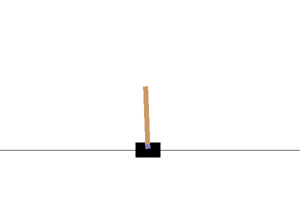
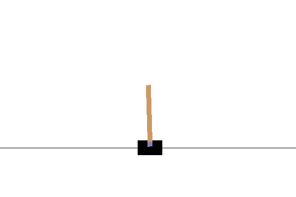

# Patinação CartPole

O problema que estávamos resolvendo na lição anterior pode parecer um problema de brinquedo, não muito aplicável a cenários da vida real. Este não é o caso, porque muitos problemas do mundo real também compartilham esse cenário – incluindo jogar Xadrez ou Go. Eles são semelhantes, porque também temos um tabuleiro com regras definidas e um **estado discreto**.

## [Quiz pré-aula](https://ff-quizzes.netlify.app/en/ml/)

## Introdução

Nesta lição aplicaremos os mesmos princípios do Q-Learning a um problema com **estado contínuo**, ou seja, um estado definido por um ou mais números reais. Trabalharemos com o seguinte problema:

> **Problema**: Se Pedro quiser escapar do lobo, ele precisa conseguir se mover mais rápido. Veremos como Pedro pode aprender a patinar, em particular, a manter o equilíbrio, usando Q-Learning.


> Pedro e seus amigos se mostram criativos para escapar do lobo! Imagem por [Jen Looper](https://twitter.com/jenlooper)

Usaremos uma versão simplificada do equilíbrio conhecida como problema de **CartPole**. No mundo do cartpole, temos um controle deslizante horizontal que pode se mover para a esquerda ou para a direita, e o objetivo é equilibrar um bastão vertical em cima do controle deslizante.


## Pré-requisitos

Nesta lição, usaremos uma biblioteca chamada **OpenAI Gym** para simular diferentes **ambientes**. Você pode executar o código desta lição localmente (por exemplo, no Visual Studio Code), nesse caso a simulação abrirá em uma nova janela. Ao executar o código online, pode ser necessário fazer alguns ajustes, como descrito [aqui](https://towardsdatascience.com/rendering-openai-gym-envs-on-binder-and-google-colab-536f99391cc7).

## OpenAI Gym

Na lição anterior, as regras do jogo e o estado foram definidos pela classe `Board` que escrevemos. Aqui usaremos um ambiente de simulação especial, que simula a física por trás do bastão equilibrador. Um dos ambientes de simulação mais populares para treinar algoritmos de aprendizado por reforço é chamado [Gym](https://gym.openai.com/), mantido pela [OpenAI](https://openai.com/). Usando esse gym podemos criar diferentes **ambientes** desde um cartpole até jogos de Atari.

> **Nota**: Veja outros ambientes disponíveis no OpenAI Gym [aqui](https://gym.openai.com/envs/#classic_control). 

Primeiro, vamos instalar o gym e importar as bibliotecas requeridas (bloco de código 1):

```python
import sys
!{sys.executable} -m pip install gym 

import gym
import matplotlib.pyplot as plt
import numpy as np
import random
```

## Exercício - inicializar um ambiente cartpole

Para trabalhar com o problema de equilíbrio do cartpole, precisamos inicializar o ambiente correspondente. Cada ambiente está associado a:

- **Espaço de observação**, que define a estrutura das informações que recebemos do ambiente. No problema do cartpole, recebemos posição do bastão, velocidade e alguns outros valores.

- **Espaço de ação**, que define as possíveis ações. No nosso caso, o espaço de ações é discreto, e consiste em duas ações – **esquerda** e **direita**. (bloco de código 2)

1. Para inicializar, digite o seguinte código:

    ```python
    env = gym.make("CartPole-v1")
    print(env.action_space)
    print(env.observation_space)
    print(env.action_space.sample())
    ```

Para ver como o ambiente funciona, vamos executar uma simulação curta por 100 passos. A cada passo, fornecemos uma das ações a ser tomada – nesta simulação, apenas selecionamos uma ação aleatória do `action_space`.

1. Execute o código abaixo e veja o que acontece.

    ✅ Lembre-se que é preferível executar este código numa instalação local do Python! (bloco de código 3)

    ```python
    env.reset()
    
    for i in range(100):
       env.render()
       env.step(env.action_space.sample())
    env.close()
    ```

    Você deve ver algo similar a esta imagem:

    

1. Durante a simulação, precisamos obter observações para decidir como agir. Na verdade, a função step retorna a observação atual, uma função recompensa, e a flag done que indica se faz sentido continuar a simulação ou não: (bloco de código 4)

    ```python
    env.reset()
    
    done = False
    while not done:
       env.render()
       obs, rew, done, info = env.step(env.action_space.sample())
       print(f"{obs} -> {rew}")
    env.close()
    ```

    Você verá algo assim na saída do notebook:

    ```text
    [ 0.03403272 -0.24301182  0.02669811  0.2895829 ] -> 1.0
    [ 0.02917248 -0.04828055  0.03248977  0.00543839] -> 1.0
    [ 0.02820687  0.14636075  0.03259854 -0.27681916] -> 1.0
    [ 0.03113408  0.34100283  0.02706215 -0.55904489] -> 1.0
    [ 0.03795414  0.53573468  0.01588125 -0.84308041] -> 1.0
    ...
    [ 0.17299878  0.15868546 -0.20754175 -0.55975453] -> 1.0
    [ 0.17617249  0.35602306 -0.21873684 -0.90998894] -> 1.0
    ```

    O vetor de observação retornado a cada passo da simulação contém os seguintes valores:
    - Posição do carrinho
    - Velocidade do carrinho
    - Ângulo do bastão
    - Taxa de rotação do bastão

1. Obtenha o valor mínimo e máximo desses números: (bloco de código 5)

    ```python
    print(env.observation_space.low)
    print(env.observation_space.high)
    ```

    Você também pode notar que o valor de recompensa em cada passo da simulação é sempre 1. Isso porque nosso objetivo é sobreviver o máximo possível, ou seja, manter o bastão em uma posição razoavelmente vertical pelo maior tempo possível.

    ✅ Na verdade, a simulação CartPole é considerada resolvida se conseguirmos uma recompensa média de 195 em 100 tentativas consecutivas.

## Discretização do estado

No Q-Learning, precisamos construir uma Q-Table que define o que fazer em cada estado. Para isso, precisamos que o estado seja **discreto**, mais precisamente, deve conter um número finito de valores discretos. Portanto, precisamos de alguma forma **discretizar** nossas observações, mapeando-as para um conjunto finito de estados.

Existem algumas formas de fazer isso:

- **Dividir em bins**. Se soubermos o intervalo de um determinado valor, podemos dividi-lo em um número de **bins** e então substituir o valor pelo número do bin ao qual pertence. Isso pode ser feito usando o método [`digitize`](https://numpy.org/doc/stable/reference/generated/numpy.digitize.html) do numpy. Nesse caso, saberemos exatamente o tamanho do estado, pois dependerá do número de bins escolhidos para a digitalização.
  
✅ Podemos usar interpolação linear para trazer os valores a um intervalo finito (por exemplo, de -20 a 20), e então converter os números para inteiros arredondando-os. Isso nos dá um pouco menos de controle sobre o tamanho do estado, especialmente se não conhecermos os intervalos exatos dos valores de entrada. Por exemplo, no nosso caso, 2 dos 4 valores não têm limites superiores/inferiores, o que pode resultar em um número infinito de estados.

No nosso exemplo, usaremos a segunda abordagem. Como você poderá notar, apesar dos limites superiores/inferiores indefinidos, esses valores raramente ultrapassam certos intervalos finitos, portanto estados com valores extremos serão muito raros.

1. Aqui está a função que irá pegar a observação do nosso modelo e produzir uma tupla de 4 valores inteiros: (bloco de código 6)

    ```python
    def discretize(x):
        return tuple((x/np.array([0.25, 0.25, 0.01, 0.1])).astype(np.int))
    ```

1. Vamos também explorar outro método de discretização usando bins: (bloco de código 7)

    ```python
    def create_bins(i,num):
        return np.arange(num+1)*(i[1]-i[0])/num+i[0]
    
    print("Sample bins for interval (-5,5) with 10 bins\n",create_bins((-5,5),10))
    
    ints = [(-5,5),(-2,2),(-0.5,0.5),(-2,2)] # intervalos de valores para cada parâmetro
    nbins = [20,20,10,10] # número de intervalos para cada parâmetro
    bins = [create_bins(ints[i],nbins[i]) for i in range(4)]
    
    def discretize_bins(x):
        return tuple(np.digitize(x[i],bins[i]) for i in range(4))
    ```

1. Agora vamos rodar uma simulação curta e observar esses valores discretos do ambiente. Sinta-se à vontade para testar tanto `discretize` quanto `discretize_bins` e ver se há diferença.

    ✅ `discretize_bins` retorna o número do bin, que é baseado em 0. Assim, para valores da variável de entrada próximos de 0, ele retorna um número perto do meio do intervalo (10). No `discretize`, não nos importamos com o intervalo dos valores de saída, permitindo negativos, então os valores do estado não são deslocados, e 0 corresponde a 0. (bloco de código 8)

    ```python
    env.reset()
    
    done = False
    while not done:
       #env.render()
       obs, rew, done, info = env.step(env.action_space.sample())
       #print(discretize_bins(obs))
       print(discretize(obs))
    env.close()
    ```

    ✅ Descomente a linha começando com env.render se quiser ver como o ambiente executa. Caso contrário, você pode executar em segundo plano, que é mais rápido. Usaremos essa execução "invisível" durante nosso processo de Q-Learning.

## A estrutura da Q-Table

Na lição anterior, o estado era um par simples de números de 0 a 8, e assim era conveniente representar a Q-Table por um tensor numpy com formato 8x8x2. Se usarmos discretização por bins, o tamanho do vetor estado também é conhecido, então podemos usar a mesma abordagem e representar o estado por um array de forma 20x20x10x10x2 (aqui 2 é a dimensão do espaço de ação, e as primeiras dimensões correspondem ao número de bins que selecionamos para cada um dos parâmetros do espaço de observação).

Entretanto, às vezes as dimensões exatas do espaço de observação não são conhecidas. No caso da função `discretize`, nunca podemos ter certeza que o estado fica dentro de certos limites, porque alguns dos valores originais não têm limite. Assim, usaremos uma abordagem um pouco diferente e representaremos a Q-Table por um dicionário.

1. Use o par *(estado,ação)* como a chave do dicionário, e o valor corresponderá ao valor da entrada na Q-Table. (bloco de código 9)

    ```python
    Q = {}
    actions = (0,1)
    
    def qvalues(state):
        return [Q.get((state,a),0) for a in actions]
    ```

    Aqui também definimos a função `qvalues()`, que retorna uma lista dos valores da Q-Table para um dado estado que corresponde a todas as ações possíveis. Se a entrada não existir na Q-Table, retornamos 0 como padrão.

## Vamos começar o Q-Learning

Agora estamos prontos para ensinar Pedro a se equilibrar!

1. Primeiro, defina alguns hiperparâmetros: (bloco de código 10)

    ```python
    # hiperparâmetros
    alpha = 0.3
    gamma = 0.9
    epsilon = 0.90
    ```

    Aqui, `alpha` é a **taxa de aprendizado** que define até que ponto devemos ajustar os valores atuais da Q-Table a cada passo. Na lição anterior, começamos com 1, e depois diminuímos `alpha` para valores mais baixos durante o treino. Neste exemplo, manteremos constante apenas por simplicidade, e você pode experimentar ajustar os valores de `alpha` depois.

    `gamma` é o **fator de desconto** que indica até que ponto devemos priorizar recompensa futura sobre a atual.

    `epsilon` é o **fator de exploração/exploração** que determina se devemos preferir exploração (experimentar) ou exploração (usar o que já sabemos). No nosso algoritmo, em `epsilon` por cento dos casos selecionaremos a próxima ação conforme os valores da Q-Table, e no restante executaremos uma ação aleatória. Isso nos permitirá explorar áreas do espaço de busca que nunca vimos antes.

    ✅ Em termos de equilíbrio – escolher ação aleatória (exploração) seria como dar um soco aleatório na direção errada, e o bastão teria que aprender como recuperar o equilíbrio dessas "falhas".

### Melhorar o algoritmo

Também podemos fazer duas melhorias no nosso algoritmo da lição anterior:

- **Calcular a recompensa acumulada média**, sobre um número de simulações. Vamos imprimir o progresso a cada 5000 iterações, e calcularemos a média da recompensa acumulada nesse período. Isso significa que se obtivermos mais que 195 pontos – podemos considerar o problema resolvido, com qualidade até superior à requerida.
  
- **Calcular o máximo resultado acumulado médio**, `Qmax`, e armazenar a Q-Table correspondente a esse resultado. Quando você executar o treinamento, notará que às vezes a recompensa acumulada média começa a cair, e queremos manter os valores da Q-Table que correspondem ao melhor modelo observado durante o treino.

1. Armazene todas as recompensas acumuladas em cada simulação no vetor `rewards` para gráficos futuros. (bloco de código 11)

    ```python
    def probs(v,eps=1e-4):
        v = v-v.min()+eps
        v = v/v.sum()
        return v
    
    Qmax = 0
    cum_rewards = []
    rewards = []
    for epoch in range(100000):
        obs = env.reset()
        done = False
        cum_reward=0
        # == faça a simulação ==
        while not done:
            s = discretize(obs)
            if random.random()<epsilon:
                # exploração - escolha a ação de acordo com as probabilidades da Tabela-Q
                v = probs(np.array(qvalues(s)))
                a = random.choices(actions,weights=v)[0]
            else:
                # exploração - escolha a ação aleatoriamente
                a = np.random.randint(env.action_space.n)
    
            obs, rew, done, info = env.step(a)
            cum_reward+=rew
            ns = discretize(obs)
            Q[(s,a)] = (1 - alpha) * Q.get((s,a),0) + alpha * (rew + gamma * max(qvalues(ns)))
        cum_rewards.append(cum_reward)
        rewards.append(cum_reward)
        # == Periodicamente imprima os resultados e calcule a recompensa média ==
        if epoch%5000==0:
            print(f"{epoch}: {np.average(cum_rewards)}, alpha={alpha}, epsilon={epsilon}")
            if np.average(cum_rewards) > Qmax:
                Qmax = np.average(cum_rewards)
                Qbest = Q
            cum_rewards=[]
    ```

O que você pode notar a partir desses resultados:

- **Perto do nosso objetivo**. Estamos muito próximos de alcançar o objetivo de obter 195 recompensas acumuladas em 100+ execuções consecutivas da simulação, ou talvez já tenhamos conseguido! Mesmo que obtenhamos números menores, ainda não sabemos, pois fazemos a média sobre 5000 execuções, e o critério formal exige apenas 100 execuções.
  
- **Recompensa começa a cair**. Às vezes a recompensa começa a cair, o que significa que podemos "destruir" valores já aprendidos na Q-Table com outros que pioram a situação.

Essa observação fica mais clara se plotarmos o progresso do treino.

## Plotando o progresso do treino

Durante o treino, colecionamos o valor da recompensa acumulada em cada iteração no vetor `rewards`. Veja como fica ao plotar frente ao número da iteração:

```python
plt.plot(rewards)
```


A partir desse gráfico, não é possível tirar conclusões, pois devido à natureza estocástica do processo de treinamento, a duração das sessões varia muito. Para dar mais sentido a esse gráfico, podemos calcular a **média móvel** sobre uma série de experimentos, digamos 100. Isso pode ser feito convenientemente usando `np.convolve`: (bloco de código 12)

```python
def running_average(x,window):
    return np.convolve(x,np.ones(window)/window,mode='valid')

plt.plot(running_average(rewards,100))
```


## Variando hiperparâmetros

Para tornar o aprendizado mais estável, faz sentido ajustar alguns de nossos hiperparâmetros durante o treino. Em particular:

- **Para a taxa de aprendizado**, `alpha`, podemos começar com valores próximos a 1, e depois ir diminuindo o parâmetro. Com o tempo, teremos boas probabilidades na Q-Table, então devemos ajustá-las ligeiramente, e não sobrescrever completamente com novos valores.

- **Aumentar epsilon**. Podemos querer aumentar lentamente o `epsilon`, para explorar menos e explorar mais. Provavelmente faz sentido começar com um valor baixo de `epsilon`, e subir até quase 1.

> **Tarefa 1**: Brinque com os valores dos hiperparâmetros e veja se consegue obter uma recompensa acumulada maior. Você está conseguindo passar de 195?


> **Tarefa 2**: Para resolver formalmente o problema, você precisa obter uma recompensa média de 195 em 100 execuções consecutivas. Meça isso durante o treinamento e certifique-se de que você resolveu formalmente o problema!

## Vendo o resultado em ação

Seria interessante de fato ver como o modelo treinado se comporta. Vamos executar a simulação e seguir a mesma estratégia de seleção de ação usada durante o treinamento, amostrando de acordo com a distribuição de probabilidade na Q-Table: (bloco de código 13)

```python
obs = env.reset()
done = False
while not done:
   s = discretize(obs)
   env.render()
   v = probs(np.array(qvalues(s)))
   a = random.choices(actions,weights=v)[0]
   obs,_,done,_ = env.step(a)
env.close()
```

Você deve ver algo assim:



---

## 🚀Desafio

> **Tarefa 3**: Aqui, estávamos usando a cópia final da Q-Table, que pode não ser a melhor. Lembre-se que armazenamos a Q-Table com melhor desempenho na variável `Qbest`! Tente o mesmo exemplo usando a Q-Table com melhor desempenho copiando `Qbest` para `Q` e veja se você percebe a diferença.

> **Tarefa 4**: Aqui, não estávamos selecionando a melhor ação a cada passo, mas sim amostrando conforme a distribuição de probabilidade correspondente. Faria mais sentido sempre selecionar a melhor ação, com o maior valor na Q-Table? Isso pode ser feito usando a função `np.argmax` para descobrir o número da ação correspondente ao maior valor na Q-Table. Implemente essa estratégia e veja se isso melhora o equilíbrio.

## [Questionário pós-palestra](https://ff-quizzes.netlify.app/en/ml/)

## Atividade
[Treine um Mountain Car](assignment.md)

## Conclusão

Agora aprendemos como treinar agentes para alcançar bons resultados apenas fornecendo uma função de recompensa que define o estado desejado do jogo, e dando a eles a oportunidade de explorar o espaço de busca de forma inteligente. Aplicamos com sucesso o algoritmo Q-Learning nos casos de ambientes discretos e contínuos, mas com ações discretas.

Também é importante estudar situações onde o estado da ação também é contínuo, e quando o espaço de observação é muito mais complexo, como a imagem da tela de um jogo Atari. Nesses problemas, frequentemente precisamos usar técnicas de aprendizado de máquina mais poderosas, como redes neurais, para alcançar bons resultados. Esses tópicos mais avançados são o assunto do nosso próximo curso de IA mais avançado.

---

<!-- CO-OP TRANSLATOR DISCLAIMER START -->
**Aviso Legal**:
Este documento foi traduzido usando o serviço de tradução por IA [Co-op Translator](https://github.com/Azure/co-op-translator). Embora nos esforcemos pela precisão, por favor, esteja ciente de que traduções automatizadas podem conter erros ou imprecisões. O documento original em seu idioma nativo deve ser considerado a fonte autorizada. Para informações críticas, recomenda-se tradução profissional humana. Não nos responsabilizamos por quaisquer mal-entendidos ou interpretações incorretas decorrentes do uso desta tradução.
<!-- CO-OP TRANSLATOR DISCLAIMER END -->