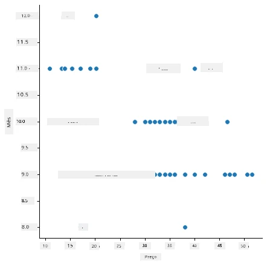
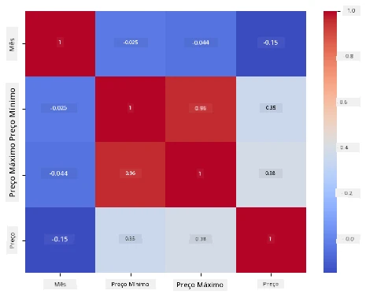

# Construir um modelo de regressão usando Scikit-learn: preparar e visualizar dados


Infográfico por [Dasani Madipalli](https://twitter.com/dasani_decoded)

## [Questionário pré-aula](https://ff-quizzes.netlify.app/en/ml/)

> ### [Esta lição está disponível em R!](../../../../2-Regression/2-Data/solution/R/lesson_2.html)

## Introdução

Agora que tem configuradas as ferramentas necessárias para começar a abordar a construção de modelos de machine learning com Scikit-learn, está pronto para começar a fazer perguntas aos seus dados. À medida que trabalha com dados e aplica soluções de ML, é muito importante compreender como fazer a pergunta certa para desbloquear corretamente o potencial do seu conjunto de dados.

Nesta lição, irá aprender:

- Como preparar os seus dados para a construção do modelo.
- Como usar Matplotlib para visualização de dados.
- Como usar Seaborn para uma visualização de dados mais expressiva.

## Fazer a pergunta certa aos seus dados

A pergunta que precisa de responder irá determinar que tipo de algoritmos de ML irá usar. E a qualidade da resposta que obtém dependerá fortemente da natureza dos seus dados.

Dê uma vista de olhos aos [dados](https://github.com/microsoft/ML-For-Beginners/blob/main/2-Regression/data/US-pumpkins.csv) fornecidos para esta lição. Pode abrir este ficheiro .csv no VS Code. Uma rápida análise mostra imediatamente que existem espaços em branco e uma mistura de dados numéricos e de texto. Há também uma coluna estranha chamada 'Package' onde os dados são uma mistura entre 'sacks', 'bins' e outros valores. De facto, os dados estão um pouco confusos.

[](https://youtu.be/5qGjczWTrDQ "ML para iniciantes - Como Analisar e Limpar um Conjunto de Dados")

> 🎥 Clique na imagem acima para um vídeo curto a trabalhar a preparação dos dados para esta lição.

De facto, não é muito comum receber um conjunto de dados completamente pronto para usar diretamente na criação de um modelo de ML. Nesta lição, irá aprender como preparar um conjunto de dados bruto usando bibliotecas padrão do Python. Também aprenderá várias técnicas para visualizar os dados.

## Estudo de caso: 'o mercado da abóbora'

Nesta pasta encontrará um ficheiro .csv na pasta raiz `data` chamado [US-pumpkins.csv](https://github.com/microsoft/ML-For-Beginners/blob/main/2-Regression/data/US-pumpkins.csv) que inclui 1757 linhas de dados sobre o mercado das abóboras, organizados por cidade. Estes são dados brutos extraídos dos [Relatórios Padrão dos Mercados de Terminais de Culturas Especializadas](https://www.marketnews.usda.gov/mnp/fv-report-config-step1?type=termPrice) distribuídos pelo Departamento de Agricultura dos Estados Unidos.

### Preparar os dados

Estes dados estão em domínio público. Podem ser descarregados em muitos ficheiros separados, distribuídos por cidade, no site do USDA. Para evitar ficheiros separados a mais, concatenámos todos os dados das cidades num único ficheiro, assim já _preparámos_ um pouco os dados. A seguir, vamos analisar os dados mais detalhadamente.

### Dados das abóboras - primeiras conclusões

O que notou sobre estes dados? Já viu que há uma mistura de texto, números, espaços em branco e valores estranhos que precisa de compreender.

Que pergunta pode fazer acerca destes dados, usando uma técnica de Regressão? Que tal "Prever o preço de uma abóbora à venda durante um mês específico". Olhando novamente para os dados, existem algumas alterações a fazer para criar a estrutura de dados necessária para esta tarefa.
## Exercício - analisar os dados das abóboras

Vamos usar [Pandas](https://pandas.pydata.org/) (o nome significa `Python Data Analysis`), uma ferramenta muito útil para modelar dados, para analisar e preparar estes dados das abóboras.

### Primeiro, verificar datas em falta

Primeiramente, precisa tomar medidas para verificar se existem datas em falta:

1. Converter as datas para um formato de mês (são datas dos EUA, então o formato é `MM/DD/YYYY`).
2. Extrair o mês para uma nova coluna.

Abra o ficheiro _notebook.ipynb_ no Visual Studio Code e importe a folha de cálculo para um novo dataframe Pandas.

1. Use a função `head()` para ver as primeiras cinco linhas.

    ```python
    import pandas as pd
    pumpkins = pd.read_csv('../data/US-pumpkins.csv')
    pumpkins.head()
    ```

    ✅ Que função usaria para ver as últimas cinco linhas?

1. Verifique se existe dados em falta no dataframe atual:

    ```python
    pumpkins.isnull().sum()
    ```

    Existem dados em falta, mas talvez isso não importe para a tarefa em mãos.

1. Para tornar o seu dataframe mais fácil de trabalhar, selecione apenas as colunas que precisa, usando a função `loc` que extrai do dataframe original um grupo de linhas (passado como primeiro parâmetro) e colunas (passado como segundo parâmetro). A expressão `:` no exemplo abaixo significa "todas as linhas".

    ```python
    columns_to_select = ['Package', 'Low Price', 'High Price', 'Date']
    pumpkins = pumpkins.loc[:, columns_to_select]
    ```

### Segundo, determinar o preço médio da abóbora

Pense em como determinar o preço médio de uma abóbora num dado mês. Que colunas escolheria para esta tarefa? Dica: vai precisar de 3 colunas.

Solução: faça a média das colunas `Low Price` e `High Price` para preencher a nova coluna Price, e converta a coluna Date para mostrar apenas o mês. Felizmente, de acordo com a verificação acima, não há dados em falta para datas ou preços.

1. Para calcular a média, adicione o seguinte código:

    ```python
    price = (pumpkins['Low Price'] + pumpkins['High Price']) / 2

    month = pd.DatetimeIndex(pumpkins['Date']).month

    ```

   ✅ Sinta-se à vontade para imprimir qualquer dado que queira verificar usando `print(month)`.

2. Agora, copie os seus dados convertidos para um dataframe Pandas novo:

    ```python
    new_pumpkins = pd.DataFrame({'Month': month, 'Package': pumpkins['Package'], 'Low Price': pumpkins['Low Price'],'High Price': pumpkins['High Price'], 'Price': price})
    ```

    Imprimir o seu dataframe mostrará um conjunto de dados limpo e arrumado sobre o qual poderá construir o seu novo modelo de regressão.

### Mas espere! Há algo estranho aqui

Se olhar para a coluna `Package`, as abóboras são vendidas de várias formas. Algumas são vendidas em medidas de '1 1/9 bushel', outras de '1/2 bushel', algumas por abóbora, outras por libra, e algumas em caixas grandes com larguras variadas.

> Parece ser muito difícil pesar abóboras de forma consistente

Analisando os dados originais, é interessante que qualquer coisa com `Unit of Sale` igual a 'EACH' ou 'PER BIN' também tenha o tipo de `Package` por polegada, por caixa ou 'cada'. Parece realmente difícil pesar abóboras de forma consistente, por isso vamos filtrá-las selecionando apenas as abóboras com a string 'bushel' na coluna `Package`.

1. Adicione um filtro no topo do ficheiro, sob a importação inicial do .csv:

    ```python
    pumpkins = pumpkins[pumpkins['Package'].str.contains('bushel', case=True, regex=True)]
    ```

    Se imprimir os dados agora, verá que está a obter apenas cerca de 415 linhas de dados contendo abóboras vendidas por bushel.

### Mas espere! Ainda há mais a fazer

Reparou que a quantia de bushel varia por linha? Precisa de normalizar o preço para mostrar o preço por bushel, então faça alguns cálculos para padronizar isso.

1. Adicione estas linhas depois do bloco que cria o dataframe new_pumpkins:

    ```python
    new_pumpkins.loc[new_pumpkins['Package'].str.contains('1 1/9'), 'Price'] = price/(1 + 1/9)

    new_pumpkins.loc[new_pumpkins['Package'].str.contains('1/2'), 'Price'] = price/(1/2)
    ```

✅ Segundo [The Spruce Eats](https://www.thespruceeats.com/how-much-is-a-bushel-1389308), o peso de um bushel depende do tipo de produto, pois é uma medida de volume. "Um bushel de tomates, por exemplo, deve pesar 56 libras... Folhas e verdes ocupam mais espaço com menos peso, por isso um bushel de espinafres pesa apenas 20 libras." É tudo bastante complicado! Vamos deixar de lado a conversão de bushel para libra e, em vez disso, preço por bushel. Todo este estudo de bushels de abóboras, porém, demonstra a importância de compreender a natureza dos seus dados!

Agora pode analisar o preço por unidade baseado na medida de bushel. Se imprimir os dados mais uma vez, verá como estão padronizados.

✅ Reparou que as abóboras vendidas por meio bushel são muito caras? Consegue perceber porquê? Dica: as abóboras pequenas são muito mais caras do que as grandes, provavelmente porque há muito mais delas por bushel, dado o espaço inutilizado ocupado por uma grande abóbora oca para torta.

## Estratégias de Visualização

Parte do papel do cientista de dados é demonstrar a qualidade e a natureza dos dados com que trabalha. Para isso, frequentemente cria visualizações interessantes, ou gráficos, diagramas e gráficos, mostrando vários aspetos dos dados. Desta forma, conseguem mostrar visualmente relações e lacunas que, de outro modo, são difíceis de detectar.

[](https://youtu.be/SbUkxH6IJo0 "ML para iniciantes - Como Visualizar Dados com Matplotlib")

> 🎥 Clique na imagem acima para um vídeo curto a trabalhar a visualização dos dados para esta lição.

As visualizações também podem ajudar a determinar a técnica de machine learning mais apropriada para os dados. Um gráfico de dispersão que parece seguir uma linha, por exemplo, indica que os dados são bons candidatos para um exercício de regressão linear.

Uma biblioteca de visualização de dados que funciona bem em notebooks Jupyter é [Matplotlib](https://matplotlib.org/) (que também viu na lição anterior).

> Ganhe mais experiência em visualização de dados nestes [tutoriais](https://docs.microsoft.com/learn/modules/explore-analyze-data-with-python?WT.mc_id=academic-77952-leestott).

## Exercício - experimente com Matplotlib

Tente criar alguns gráficos básicos para exibir o novo dataframe que acabou de criar. O que mostraria um gráfico de linha básico?

1. Importe Matplotlib no topo do ficheiro, abaixo da importação do Pandas:

    ```python
    import matplotlib.pyplot as plt
    ```

1. Corra novamente todo o notebook para atualizar.
1. No final do notebook, adicione uma célula para plotar os dados como um boxplot:

    ```python
    price = new_pumpkins.Price
    month = new_pumpkins.Month
    plt.scatter(price, month)
    plt.show()
    ```

    

    Este é um gráfico útil? Algo nele o surpreende?

    Não é particularmente útil, pois tudo o que faz é mostrar os seus dados como uma dispersão de pontos num dado mês.

### Torná-lo útil

Para que os gráficos exibam dados úteis, normalmente é preciso agrupar os dados de alguma forma. Vamos tentar criar um gráfico onde o eixo y mostra os meses e os dados demonstram a distribuição dos valores.

1. Adicione uma célula para criar um gráfico de barras agrupado:

    ```python
    new_pumpkins.groupby(['Month'])['Price'].mean().plot(kind='bar')
    plt.ylabel("Pumpkin Price")
    ```

    

    Esta é uma visualização de dados mais útil! Parece indicar que o preço mais alto das abóboras ocorre em setembro e outubro. Isso corresponde à sua expectativa? Porquê?

## Exercício - experimente com Seaborn

O Matplotlib é poderoso, mas pode exigir muito código para produzir um gráfico polido. [Seaborn](https://seaborn.pydata.org/) é uma biblioteca construída _em cima de_ Matplotlib desenhada para visualização estatística de dados. Trabalha diretamente com dataframes Pandas, aplica estilos padrão atraentes, e deixa criar gráficos informativos com muito menos código. Como o Seaborn retorna objetos Matplotlib, pode ainda usar tudo o que já sabe sobre Matplotlib para ajustar o resultado.

> Se ainda não instalou o Seaborn, instale-o com `pip install seaborn`.

1. Importe Seaborn no topo do notebook, abaixo das outras importações. Convencionalmente é importado como `sns`:

    ```python
    import seaborn as sns
    ```

### Gráficos de dispersão para mostrar relações

Uma grande parte da exploração de dados antes de construir um modelo é procurar _relações_ entre variáveis. Um [gráfico de dispersão](https://en.wikipedia.org/wiki/Scatter_plot) é uma das melhores ferramentas para isso: se os pontos parecem seguir uma linha, as duas variáveis podem estar correlacionadas, o que é um bom sinal de que um modelo de regressão linear pode funcionar.

1. Recrie o gráfico de dispersão preço-mês anterior, desta vez usando a função [`relplot()`](https://seaborn.pydata.org/generated/seaborn.relplot.html) do Seaborn (gráfico relacional), que trabalha diretamente com as colunas do seu dataframe:

    ```python
    sns.relplot(x="Price", y="Month", data=new_pumpkins)
    ```

    

    Repare como passa os _nomes das colunas_ e o dataframe, e o Seaborn cuida dos rótulos dos eixos para si.

2. Pode mudar para um gráfico de linha passando `kind="line"`. O Seaborn até desenha uma banda sombreada mostrando o intervalo de confiança em torno da linha:

    ```python
    sns.relplot(x="Price", y="Month", kind="line", data=new_pumpkins)
    ```

    

    Estes dados em particular são bastante ruidosos, então um gráfico de linhas não é a escolha mais clara aqui — mas mostra como é fácil mudar o tipo de gráfico no Seaborn.

### Gráficos de barras para mostrar distribuições


Anteriormente, agrupaste os dados manualmente para criar um gráfico de barras com Matplotlib. O [`catplot()`](https://seaborn.pydata.org/generated/seaborn.catplot.html) (gráfico categórico) do Seaborn pode fazer o agrupamento e agregação por ti. Por defeito, `kind="bar"` mostra a média de cada categoria juntamente com uma linha preta indicando o intervalo de confiança.

1. Cria um gráfico de barras do preço médio por mês:

    ```python
    sns.catplot(x="Month", y="Price", data=new_pumpkins, kind="bar")
    ```

    

    Isto confirma o que viste com Matplotlib — os preços atingem o pico em setembro e outubro — mas o Seaborn também visualiza o quanto o preço _varia_ dentro de cada mês.

### Mapas de calor para mostrar correlações

Gráficos de dispersão comparam duas variáveis de cada vez. Quando tens várias colunas numéricas, um [mapa de calor](https://en.wikipedia.org/wiki/Heat_map) permite ver a força da relação entre _todos_ os pares de colunas ao mesmo tempo. Esta é uma forma comum de identificar quais as características mais correlacionadas antes de escolher o que alimentar num modelo (e o mesmo tipo de gráfico é depois usado para mostrar matrizes de confusão em classificação).

1. Constrói uma matriz de correlação com Pandas, depois desenha-a com o [`heatmap()`](https://seaborn.pydata.org/generated/seaborn.heatmap.html) do Seaborn. A opção `annot=True` imprime os valores de correlação em cada célula:

    ```python
    correlations = new_pumpkins[['Month', 'Low Price', 'High Price', 'Price']].corr()
    sns.heatmap(correlations, annot=True, cmap="coolwarm")
    ```

    

    Valores próximos de `1` (ou `-1`) significam que as colunas estão fortemente correlacionadas _linearmente_. Repara como `Low Price` e `High Price` estão quase perfeitamente correlacionados. `Month`, por outro lado, mostra apenas uma fraca correlação linear com o preço — apesar do gráfico de barras acima revelar um claro pico sazonal em setembro e outubro. Essa é uma lição importante: o coeficiente de correlação mede apenas relações _em linha reta_, pelo que pode não detetar padrões sazonais ou outros não lineares. ✅ Por que é útil olhar para um mapa de calor *e* gráficos como o gráfico de barras antes de decidir quais colunas usar?

### Matplotlib ou Seaborn?

Ambas as bibliotecas valem a pena conhecer:

- **Matplotlib** dá-te controlo detalhado sobre cada elemento de um gráfico e é a base sobre a qual quase todas as outras bibliotecas Python de plotagem são construídas.
- **Seaborn** fornece funções de nível superior e padrões atraentes para gráficos estatísticos, funciona diretamente com dataframes e é frequentemente mais rápido para análise exploratória de dados.

Um fluxo de trabalho comum é usar o Seaborn para explorar rapidamente os dados, depois passar para Matplotlib quando precisares de personalizar os detalhes.

---

## 🚀Desafio

Explora os diferentes tipos de visualização que Matplotlib e Seaborn oferecem. Quais os tipos mais apropriados para problemas de regressão?

## [Questionário pós-aula](https://ff-quizzes.netlify.app/en/ml/)

## Revisão & Auto-estudo

Dá uma vista de olhos nas várias formas de visualizar dados. Faz uma lista das várias bibliotecas disponíveis e nota quais são melhores para certos tipos de tarefas, por exemplo visualizações 2D vs. visualizações 3D. O que descobres?

## Tarefa

[Explorar visualização](assignment.md)

---

<!-- CO-OP TRANSLATOR DISCLAIMER START -->
**Aviso Legal**:
Este documento foi traduzido utilizando o serviço de tradução automática [Co-op Translator](https://github.com/Azure/co-op-translator). Embora nos esforcemos pela precisão, esteja ciente de que traduções automáticas podem conter erros ou imprecisões. O documento original na sua língua nativa deve ser considerado a fonte autorizada. Para informações críticas, recomenda-se tradução profissional humana. Não nos responsabilizamos por quaisquer mal-entendidos ou interpretações incorretas resultantes da utilização desta tradução.
<!-- CO-OP TRANSLATOR DISCLAIMER END -->