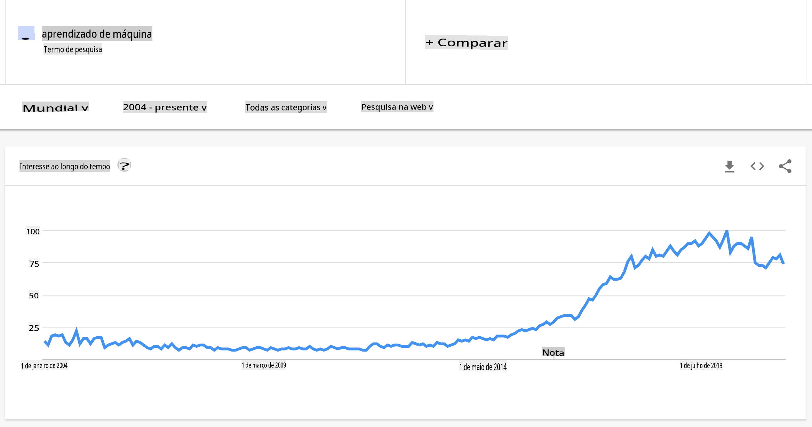
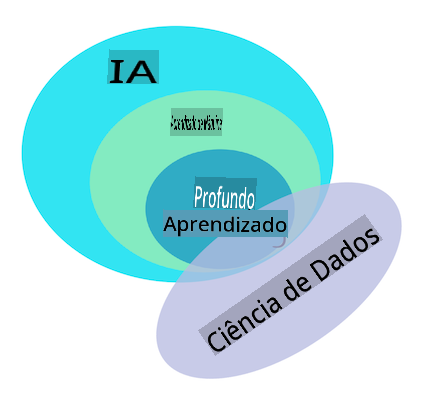

# Introdução ao aprendizado de máquina

## [Quiz pré-aula](https://gray-sand-07a10f403.1.azurestaticapps.net/quiz/1/)

---

> 🎥 Clique na imagem acima para um vídeo curto que explora esta lição.

Bem-vindo a este curso sobre aprendizado de máquina clássica para iniciantes! Seja você totalmente novo neste tópico ou um praticante experiente de ML buscando se atualizar em uma área, estamos felizes em tê-lo conosco! Queremos criar um espaço amigável para o seu estudo de ML e ficaremos felizes em avaliar, responder e incorporar seu [feedback](https://github.com/microsoft/ML-For-Beginners/discussions).

> 🎥 Clique na imagem acima para um vídeo: John Guttag do MIT apresenta o aprendizado de máquina

---
## Começando com aprendizado de máquina

Antes de iniciar este currículo, você precisa ter seu computador configurado e pronto para executar notebooks localmente.

- **Configure sua máquina com esses vídeos**. Use os links a seguir para aprender [como instalar o Python](https://youtu.be/CXZYvNRIAKM) em seu sistema e [configurar um editor de texto](https://youtu.be/EU8eayHWoZg) para desenvolvimento.
- **Aprenda Python**. Também é recomendado ter um entendimento básico de [Python](https://docs.microsoft.com/learn/paths/python-language/?WT.mc_id=academic-77952-leestott), uma linguagem de programação útil para cientistas de dados que usamos neste curso.
- **Aprenda Node.js e JavaScript**. Também usamos JavaScript algumas vezes neste curso ao construir aplicativos web, então você precisará ter [node](https://nodejs.org) e [npm](https://www.npmjs.com/) instalados, além de [Visual Studio Code](https://code.visualstudio.com/) disponível para desenvolvimento em Python e JavaScript.
- **Crie uma conta no GitHub**. Como você nos encontrou aqui no [GitHub](https://github.com), você pode já ter uma conta, mas se não, crie uma e depois faça um fork deste currículo para usar por conta própria. (Sinta-se à vontade para nos dar uma estrela também 😊)
- **Explore o Scikit-learn**. Familiarize-se com o [Scikit-learn](https://scikit-learn.org/stable/user_guide.html), um conjunto de bibliotecas de ML que referenciamos nessas lições.

---
## O que é aprendizado de máquina?

O termo 'aprendizado de máquina' é um dos termos mais populares e frequentemente utilizados atualmente. Há uma possibilidade não trivial de que você tenha ouvido esse termo pelo menos uma vez se tiver algum tipo de familiaridade com tecnologia, não importa em qual domínio você trabalhe. No entanto, a mecânica do aprendizado de máquina é um mistério para a maioria das pessoas. Para um iniciante em aprendizado de máquina, o assunto pode às vezes parecer opressor. Portanto, é importante entender o que realmente é o aprendizado de máquina e aprender sobre isso passo a passo, através de exemplos práticos.

---
## A curva de hype

> O Google Trends mostra a recente 'curva de hype' do termo 'aprendizado de máquina'

---
## Um universo misterioso

Vivemos em um universo cheio de mistérios fascinantes. Grandes cientistas como Stephen Hawking, Albert Einstein e muitos outros dedicaram suas vidas à busca de informações significativas que desvendam os mistérios do mundo ao nosso redor. Esta é a condição humana de aprender: uma criança humana aprende coisas novas e descobre a estrutura de seu mundo ano após ano à medida que cresce até a idade adulta.

---
## O cérebro da criança

O cérebro e os sentidos de uma criança percebem os fatos de seu entorno e gradualmente aprendem os padrões ocultos da vida que ajudam a criança a criar regras lógicas para identificar padrões aprendidos. O processo de aprendizado do cérebro humano torna os humanos a criatura viva mais sofisticada deste mundo. Aprender continuamente ao descobrir padrões ocultos e depois inovar sobre esses padrões nos permite nos tornarmos cada vez melhores ao longo de nossa vida. Essa capacidade de aprendizado e capacidade de evolução está relacionada a um conceito chamado [plasticidade cerebral](https://www.simplypsychology.org/brain-plasticity.html). Superficialmente, podemos traçar algumas semelhanças motivacionais entre o processo de aprendizado do cérebro humano e os conceitos de aprendizado de máquina.

---
## O cérebro humano

O [cérebro humano](https://www.livescience.com/29365-human-brain.html) percebe coisas do mundo real, processa as informações percebidas, toma decisões racionais e realiza certas ações com base nas circunstâncias. Isso é o que chamamos de comportamento inteligente. Quando programamos um fac-símile do processo de comportamento inteligente em uma máquina, isso é chamado de inteligência artificial (IA).

---
## Alguns termos

Embora os termos possam ser confundidos, aprendizado de máquina (ML) é um subconjunto importante da inteligência artificial. **ML se preocupa em usar algoritmos especializados para descobrir informações significativas e encontrar padrões ocultos a partir de dados percebidos para corroborar o processo de tomada de decisão racional**.

---
## IA, ML, Aprendizado Profundo

> Um diagrama mostrando as relações entre IA, ML, aprendizado profundo e ciência de dados. Infográfico por [Jen Looper](https://twitter.com/jenlooper) inspirado por [este gráfico](https://softwareengineering.stackexchange.com/questions/366996/distinction-between-ai-ml-neural-networks-deep-learning-and-data-mining)

---
## Conceitos a serem abordados

Neste currículo, vamos cobrir apenas os conceitos fundamentais de aprendizado de máquina que um iniciante deve conhecer. Abordamos o que chamamos de 'aprendizado de máquina clássico' principalmente usando o Scikit-learn, uma excelente biblioteca que muitos alunos usam para aprender o básico. Para entender conceitos mais amplos de inteligência artificial ou aprendizado profundo, um forte conhecimento fundamental de aprendizado de máquina é indispensável, e por isso gostaríamos de oferecê-lo aqui.

---
## Neste curso você aprenderá:

- conceitos fundamentais de aprendizado de máquina
- a história do ML
- ML e justiça
- técnicas de ML de regressão
- técnicas de ML de classificação
- técnicas de ML de agrupamento
- técnicas de ML de processamento de linguagem natural
- técnicas de ML de previsão de séries temporais
- aprendizado por reforço
- aplicações do mundo real para ML

---
## O que não abordaremos

- aprendizado profundo
- redes neurais
- IA

Para proporcionar uma melhor experiência de aprendizado, evitaremos as complexidades das redes neurais, 'aprendizado profundo' - modelagem de múltiplas camadas usando redes neurais - e IA, que discutiremos em um currículo diferente. Também ofereceremos um futuro currículo de ciência de dados para focar nesse aspecto deste campo mais amplo.

---
## Por que estudar aprendizado de máquina?

O aprendizado de máquina, de uma perspectiva de sistemas, é definido como a criação de sistemas automatizados que podem aprender padrões ocultos a partir de dados para ajudar na tomada de decisões inteligentes.

Essa motivação é vagamente inspirada em como o cérebro humano aprende certas coisas com base nos dados que percebe do mundo exterior.

✅ Pense por um minuto por que uma empresa gostaria de tentar usar estratégias de aprendizado de máquina em vez de criar um mecanismo baseado em regras codificadas.

---
## Aplicações do aprendizado de máquina

As aplicações do aprendizado de máquina estão agora quase em todos os lugares e são tão onipresentes quanto os dados que fluem em nossas sociedades, gerados por nossos smartphones, dispositivos conectados e outros sistemas. Considerando o imenso potencial dos algoritmos de aprendizado de máquina de última geração, os pesquisadores têm explorado sua capacidade de resolver problemas reais multidimensionais e multidisciplinares com grandes resultados positivos.

---
## Exemplos de ML aplicado

**Você pode usar aprendizado de máquina de várias maneiras**:

- Para prever a probabilidade de doença a partir do histórico médico ou relatórios de um paciente.
- Para aproveitar dados meteorológicos para prever eventos climáticos.
- Para entender o sentimento de um texto.
- Para detectar notícias falsas e parar a disseminação de propaganda.

Finanças, economia, ciências da terra, exploração espacial, engenharia biomédica, ciência cognitiva e até mesmo campos das humanidades adaptaram o aprendizado de máquina para resolver os difíceis problemas de processamento de dados de seu domínio.

---
## Conclusão

O aprendizado de máquina automatiza o processo de descoberta de padrões ao encontrar insights significativos a partir de dados do mundo real ou gerados. Ele se mostrou altamente valioso em aplicações comerciais, de saúde e financeiras, entre outras.

No futuro próximo, entender os fundamentos do aprendizado de máquina será uma necessidade para pessoas de qualquer domínio devido à sua ampla adoção.

---
# 🚀 Desafio

Desenhe, em papel ou usando um aplicativo online como [Excalidraw](https://excalidraw.com/), sua compreensão das diferenças entre IA, ML, aprendizado profundo e ciência de dados. Adicione algumas ideias de problemas que cada uma dessas técnicas é boa em resolver.

# [Quiz pós-aula](https://gray-sand-07a10f403.1.azurestaticapps.net/quiz/2/)

---
# Revisão e Autoestudo

Para aprender mais sobre como você pode trabalhar com algoritmos de ML na nuvem, siga este [Caminho de Aprendizagem](https://docs.microsoft.com/learn/paths/create-no-code-predictive-models-azure-machine-learning/?WT.mc_id=academic-77952-leestott).

Faça um [Caminho de Aprendizagem](https://docs.microsoft.com/learn/modules/introduction-to-machine-learning/?WT.mc_id=academic-77952-leestott) sobre os fundamentos do ML.

---
# Tarefa

[Comece a usar](assignment.md)

**Isenção de responsabilidade**:  
Este documento foi traduzido utilizando serviços de tradução automática baseados em IA. Embora nos esforcemos para garantir a precisão, esteja ciente de que traduções automatizadas podem conter erros ou imprecisões. O documento original em seu idioma nativo deve ser considerado a fonte autoritativa. Para informações críticas, recomenda-se a tradução profissional por um humano. Não nos responsabilizamos por quaisquer mal-entendidos ou interpretações errôneas decorrentes do uso desta tradução.