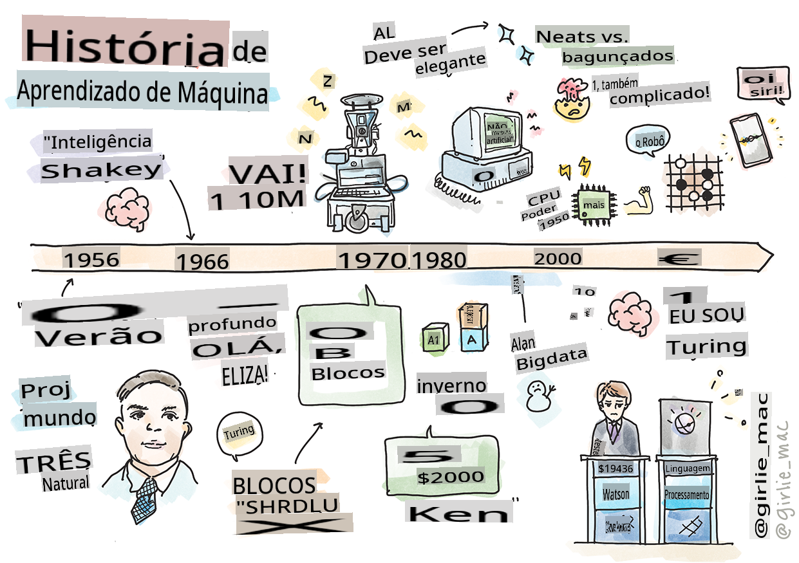
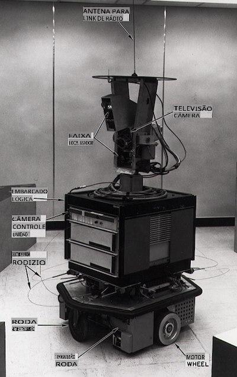

# História do aprendizado de máquina

> Sketchnote por [Tomomi Imura](https://www.twitter.com/girlie_mac)

## [Quiz pré-aula](https://gray-sand-07a10f403.1.azurestaticapps.net/quiz/3/)

---

> 🎥 Clique na imagem acima para um vídeo curto que aborda esta lição.

Nesta lição, vamos explorar os principais marcos na história do aprendizado de máquina e da inteligência artificial.

A história da inteligência artificial (IA) como um campo está entrelaçada com a história do aprendizado de máquina, uma vez que os algoritmos e os avanços computacionais que sustentam o aprendizado de máquina contribuíram para o desenvolvimento da IA. É útil lembrar que, embora esses campos como áreas distintas de investigação tenham começado a se cristalizar na década de 1950, importantes [descobertas algorítmicas, estatísticas, matemáticas, computacionais e técnicas](https://wikipedia.org/wiki/Timeline_of_machine_learning) precederam e se sobrepuseram a essa era. De fato, as pessoas vêm refletindo sobre essas questões há [centenas de anos](https://wikipedia.org/wiki/History_of_artificial_intelligence): este artigo discute as bases intelectuais históricas da ideia de uma 'máquina pensante'.

---
## Descobertas Notáveis

- 1763, 1812 [Teorema de Bayes](https://wikipedia.org/wiki/Bayes%27_theorem) e seus predecessores. Este teorema e suas aplicações fundamentam a inferência, descrevendo a probabilidade de um evento ocorrer com base em conhecimento prévio.
- 1805 [Teoria dos Mínimos Quadrados](https://wikipedia.org/wiki/Least_squares) pelo matemático francês Adrien-Marie Legendre. Esta teoria, que você aprenderá em nossa unidade de Regressão, ajuda no ajuste de dados.
- 1913 [Cadeias de Markov](https://wikipedia.org/wiki/Markov_chain), nomeadas em homenagem ao matemático russo Andrey Markov, são usadas para descrever uma sequência de eventos possíveis com base em um estado anterior.
- 1957 [Perceptron](https://wikipedia.org/wiki/Perceptron) é um tipo de classificador linear inventado pelo psicólogo americano Frank Rosenblatt que fundamenta os avanços em aprendizado profundo.

---

- 1967 [Vizinho Mais Próximo](https://wikipedia.org/wiki/Nearest_neighbor) é um algoritmo originalmente projetado para mapear rotas. Em um contexto de aprendizado de máquina, é usado para detectar padrões.
- 1970 [Retropropagação](https://wikipedia.org/wiki/Backpropagation) é usada para treinar [redes neurais feedforward](https://wikipedia.org/wiki/Feedforward_neural_network).
- 1982 [Redes Neurais Recorrentes](https://wikipedia.org/wiki/Recurrent_neural_network) são redes neurais artificiais derivadas de redes neurais feedforward que criam gráficos temporais.

✅ Faça uma pequena pesquisa. Quais outras datas se destacam como fundamentais na história do aprendizado de máquina e da IA?

---
## 1950: Máquinas que pensam

Alan Turing, uma pessoa verdadeiramente notável que foi votada [pelo público em 2019](https://wikipedia.org/wiki/Icons:_The_Greatest_Person_of_the_20th_Century) como o maior cientista do século 20, é creditado por ajudar a estabelecer a base para o conceito de uma 'máquina que pode pensar.' Ele enfrentou céticos e sua própria necessidade de evidência empírica desse conceito, em parte, criando o [Teste de Turing](https://www.bbc.com/news/technology-18475646), que você explorará em nossas lições de PLN.

---
## 1956: Projeto de Pesquisa de Verão de Dartmouth

"O Projeto de Pesquisa de Verão de Dartmouth sobre inteligência artificial foi um evento seminal para a inteligência artificial como um campo," e foi aqui que o termo 'inteligência artificial' foi cunhado ([fonte](https://250.dartmouth.edu/highlights/artificial-intelligence-ai-coined-dartmouth)).

> Cada aspecto do aprendizado ou qualquer outra característica da inteligência pode, em princípio, ser descrito de forma tão precisa que uma máquina pode ser feita para simular isso.

---

O pesquisador principal, o professor de matemática John McCarthy, esperava "prosseguir com base na conjectura de que cada aspecto do aprendizado ou qualquer outra característica da inteligência pode, em princípio, ser descrito de forma tão precisa que uma máquina pode ser feita para simular isso." Os participantes incluíam outro luminar do campo, Marvin Minsky.

O workshop é creditado por ter iniciado e incentivado várias discussões, incluindo "a ascensão de métodos simbólicos, sistemas focados em domínios limitados (sistemas especialistas iniciais) e sistemas dedutivos versus sistemas indutivos." ([fonte](https://wikipedia.org/wiki/Dartmouth_workshop)).

---
## 1956 - 1974: "Os anos dourados"

Da década de 1950 até meados da década de 70, o otimismo era alto na esperança de que a IA pudesse resolver muitos problemas. Em 1967, Marvin Minsky afirmou com confiança que "Dentro de uma geração... o problema de criar 'inteligência artificial' será substancialmente resolvido." (Minsky, Marvin (1967), Computation: Finite and Infinite Machines, Englewood Cliffs, N.J.: Prentice-Hall)

A pesquisa em processamento de linguagem natural floresceu, as buscas foram refinadas e tornadas mais poderosas, e o conceito de 'micro-mundos' foi criado, onde tarefas simples eram completadas usando instruções em linguagem simples.

---

A pesquisa foi bem financiada por agências governamentais, avanços foram feitos em computação e algoritmos, e protótipos de máquinas inteligentes foram construídos. Algumas dessas máquinas incluem:

* [Shakey, o robô](https://wikipedia.org/wiki/Shakey_the_robot), que podia manobrar e decidir como realizar tarefas 'inteligentemente'.

    
    > Shakey em 1972

---

* Eliza, um dos primeiros 'chatbots', podia conversar com as pessoas e agir como um 'terapeuta' primitivo. Você aprenderá mais sobre Eliza nas lições de PLN.

    
    > Uma versão de Eliza, um chatbot

---

* "Mundo dos blocos" foi um exemplo de um micro-mundo onde blocos podiam ser empilhados e classificados, e experimentos em ensinar máquinas a tomar decisões podiam ser testados. Avanços construídos com bibliotecas como [SHRDLU](https://wikipedia.org/wiki/SHRDLU) ajudaram a impulsionar o processamento de linguagem para frente.

    

    > 🎥 Clique na imagem acima para um vídeo: Mundo dos blocos com SHRDLU

---
## 1974 - 1980: "Inverno da IA"

Na metade da década de 1970, tornou-se evidente que a complexidade de fazer 'máquinas inteligentes' havia sido subestimada e que sua promessa, dada a potência computacional disponível, havia sido exagerada. O financiamento secou e a confiança no campo diminuiu. Algumas questões que impactaram a confiança incluíram:
---
- **Limitações**. A potência computacional era muito limitada.
- **Explosão combinatória**. A quantidade de parâmetros que precisavam ser treinados cresceu exponencialmente à medida que mais era solicitado dos computadores, sem uma evolução paralela da potência e capacidade computacional.
- **Escassez de dados**. Havia uma escassez de dados que dificultou o processo de teste, desenvolvimento e refinamento de algoritmos.
- **Estamos fazendo as perguntas certas?**. As próprias perguntas que estavam sendo feitas começaram a ser questionadas. Pesquisadores começaram a enfrentar críticas sobre suas abordagens:
  - Os testes de Turing foram colocados em questão por meio, entre outras ideias, da 'teoria da sala chinesa', que postulava que "programar um computador digital pode fazê-lo parecer entender a linguagem, mas não poderia produzir uma verdadeira compreensão." ([fonte](https://plato.stanford.edu/entries/chinese-room/))
  - A ética de introduzir inteligências artificiais como o "terapeuta" ELIZA na sociedade foi desafiada.

---

Ao mesmo tempo, várias escolas de pensamento em IA começaram a se formar. Uma dicotomia foi estabelecida entre práticas de ["IA desleixada" vs. "IA organizada"](https://wikipedia.org/wiki/Neats_and_scruffies). _Laboratórios desleixados_ ajustavam programas por horas até obterem os resultados desejados. _Laboratórios organizados_ "focavam em lógica e resolução formal de problemas". ELIZA e SHRDLU eram sistemas _desleixados_ bem conhecidos. Na década de 1980, à medida que surgiu a demanda por tornar os sistemas de aprendizado de máquina reprodutíveis, a abordagem _organizada_ gradualmente tomou a dianteira, pois seus resultados são mais explicáveis.

---
## Sistemas especialistas dos anos 1980

À medida que o campo crescia, seu benefício para os negócios tornava-se mais claro, e na década de 1980 também houve uma proliferação de 'sistemas especialistas'. "Sistemas especialistas foram uma das primeiras formas verdadeiramente bem-sucedidas de software de inteligência artificial (IA)." ([fonte](https://wikipedia.org/wiki/Expert_system)).

Esse tipo de sistema é na verdade _híbrido_, consistindo parcialmente de um motor de regras que define requisitos de negócios e um motor de inferência que aproveita o sistema de regras para deduzir novos fatos.

Essa era também viu um aumento na atenção dada às redes neurais.

---
## 1987 - 1993: 'Resfriamento' da IA

A proliferação de hardware especializado para sistemas especialistas teve o efeito infeliz de se tornar excessivamente especializado. O surgimento dos computadores pessoais também competiu com esses grandes sistemas centralizados e especializados. A democratização da computação havia começado, e isso eventualmente abriu caminho para a explosão moderna de big data.

---
## 1993 - 2011

Esta época viu uma nova era para o aprendizado de máquina e a IA serem capazes de resolver alguns dos problemas que haviam sido causados anteriormente pela falta de dados e potência computacional. A quantidade de dados começou a aumentar rapidamente e se tornar mais amplamente disponível, para o melhor e para o pior, especialmente com o advento do smartphone por volta de 2007. A potência computacional expandiu-se exponencialmente, e os algoritmos evoluíram junto com isso. O campo começou a ganhar maturidade à medida que os dias de liberdade do passado começaram a se cristalizar em uma verdadeira disciplina.

---
## Agora

Hoje, o aprendizado de máquina e a IA tocam quase todas as partes de nossas vidas. Esta era exige uma compreensão cuidadosa dos riscos e dos potenciais efeitos desses algoritmos na vida humana. Como afirmou Brad Smith, da Microsoft, "A tecnologia da informação levanta questões que vão ao cerne das proteções fundamentais dos direitos humanos, como privacidade e liberdade de expressão. Essas questões aumentam a responsabilidade das empresas de tecnologia que criam esses produtos. Em nossa visão, elas também exigem uma regulamentação governamental cuidadosa e o desenvolvimento de normas em torno de usos aceitáveis" ([fonte](https://www.technologyreview.com/2019/12/18/102365/the-future-of-ais-impact-on-society/)).

---

Resta saber o que o futuro reserva, mas é importante entender esses sistemas computacionais e o software e os algoritmos que eles executam. Esperamos que este currículo ajude você a obter uma melhor compreensão para que possa decidir por si mesmo.

> 🎥 Clique na imagem acima para um vídeo: Yann LeCun discute a história do aprendizado profundo nesta palestra

---
## 🚀Desafio

Aprofunde-se em um desses momentos históricos e aprenda mais sobre as pessoas por trás deles. Existem personagens fascinantes, e nenhuma descoberta científica foi criada em um vácuo cultural. O que você descobre?

## [Quiz pós-aula](https://gray-sand-07a10f403.1.azurestaticapps.net/quiz/4/)

---
## Revisão e Autoestudo

Aqui estão itens para assistir e ouvir:

[Este podcast onde Amy Boyd discute a evolução da IA](http://runasradio.com/Shows/Show/739)

---

## Tarefa

[Crie uma linha do tempo](assignment.md)

**Aviso Legal**:  
Este documento foi traduzido utilizando serviços de tradução automática baseados em IA. Embora nos esforcemos para garantir a precisão, esteja ciente de que as traduções automáticas podem conter erros ou imprecisões. O documento original em sua língua nativa deve ser considerado a fonte autoritativa. Para informações críticas, recomenda-se a tradução profissional por um humano. Não nos responsabilizamos por quaisquer mal-entendidos ou interpretações errôneas decorrentes do uso desta tradução.