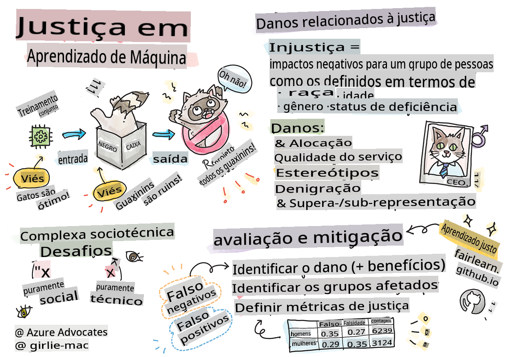

# Construindo soluções de Machine Learning com IA responsável

> Sketchnote por [Tomomi Imura](https://www.twitter.com/girlie_mac)

## [Quiz pré-aula](https://gray-sand-07a10f403.1.azurestaticapps.net/quiz/5/)

## Introdução

Neste currículo, você começará a descobrir como o machine learning pode e está impactando nossas vidas cotidianas. Mesmo agora, sistemas e modelos estão envolvidos em tarefas diárias de tomada de decisão, como diagnósticos de saúde, aprovações de empréstimos ou detecção de fraudes. Portanto, é importante que esses modelos funcionem bem para fornecer resultados confiáveis. Assim como qualquer aplicação de software, os sistemas de IA podem não atender às expectativas ou ter um resultado indesejado. Por isso, é essencial entender e explicar o comportamento de um modelo de IA.

Imagine o que pode acontecer quando os dados que você está usando para construir esses modelos carecem de certas demografias, como raça, gênero, visão política, religião ou representam desproporcionalmente tais demografias. E quando a saída do modelo é interpretada de forma a favorecer alguma demografia? Qual é a consequência para a aplicação? Além disso, o que acontece quando o modelo tem um resultado adverso e prejudica as pessoas? Quem é responsável pelo comportamento dos sistemas de IA? Essas são algumas perguntas que exploraremos neste currículo.

Nesta lição, você irá:

- Aumentar sua conscientização sobre a importância da equidade em machine learning e os danos relacionados à equidade.
- Familiarizar-se com a prática de explorar outliers e cenários incomuns para garantir confiabilidade e segurança.
- Compreender a necessidade de capacitar todos ao projetar sistemas inclusivos.
- Explorar como é vital proteger a privacidade e a segurança de dados e pessoas.
- Ver a importância de ter uma abordagem de caixa de vidro para explicar o comportamento dos modelos de IA.
- Estar ciente de como a responsabilidade é essencial para construir confiança em sistemas de IA.

## Pré-requisitos

Como pré-requisito, por favor, faça o "Caminho de Aprendizagem sobre Princípios de IA Responsável" e assista ao vídeo abaixo sobre o tema:

Saiba mais sobre IA Responsável seguindo este [Caminho de Aprendizagem](https://docs.microsoft.com/learn/modules/responsible-ai-principles/?WT.mc_id=academic-77952-leestott)

> 🎥 Clique na imagem acima para assistir a um vídeo: Abordagem da Microsoft para IA Responsável

## Equidade

Os sistemas de IA devem tratar todos de forma justa e evitar afetar grupos semelhantes de maneiras diferentes. Por exemplo, quando os sistemas de IA fornecem orientações sobre tratamentos médicos, aplicações de empréstimos ou emprego, eles devem fazer as mesmas recomendações a todos com sintomas, circunstâncias financeiras ou qualificações profissionais semelhantes. Cada um de nós, como seres humanos, carrega preconceitos herdados que afetam nossas decisões e ações. Esses preconceitos podem ser evidentes nos dados que usamos para treinar sistemas de IA. Essa manipulação pode, às vezes, ocorrer de forma não intencional. Muitas vezes, é difícil saber conscientemente quando você está introduzindo preconceito nos dados.

**“Injustiça”** abrange impactos negativos, ou “danos”, para um grupo de pessoas, como aqueles definidos em termos de raça, gênero, idade ou status de deficiência. Os principais danos relacionados à equidade podem ser classificados como:

- **Alocação**, se um gênero ou etnia, por exemplo, for favorecido em relação a outro.
- **Qualidade do serviço**. Se você treinar os dados para um cenário específico, mas a realidade for muito mais complexa, isso leva a um serviço de baixo desempenho. Por exemplo, um dispensador de sabão líquido que não parecia conseguir detectar pessoas com pele escura. [Referência](https://gizmodo.com/why-cant-this-soap-dispenser-identify-dark-skin-1797931773)
- **Denigração**. Criticar e rotular injustamente algo ou alguém. Por exemplo, uma tecnologia de rotulagem de imagens infamemente rotulou erroneamente imagens de pessoas de pele escura como gorilas.
- **Super- ou sub-representação**. A ideia é que um determinado grupo não é visto em uma determinada profissão, e qualquer serviço ou função que continue promovendo isso está contribuindo para o dano.
- **Estereotipagem**. Associar um determinado grupo a atributos pré-designados. Por exemplo, um sistema de tradução de linguagem entre inglês e turco pode ter imprecisões devido a palavras com associações estereotipadas de gênero.

> tradução para o turco

> tradução de volta para o inglês

Ao projetar e testar sistemas de IA, precisamos garantir que a IA seja justa e não programada para tomar decisões tendenciosas ou discriminatórias, que os seres humanos também estão proibidos de fazer. Garantir a equidade em IA e machine learning continua sendo um desafio sociotécnico complexo.

### Confiabilidade e segurança

Para construir confiança, os sistemas de IA precisam ser confiáveis, seguros e consistentes em condições normais e inesperadas. É importante saber como os sistemas de IA se comportarão em uma variedade de situações, especialmente quando são outliers. Ao construir soluções de IA, deve haver uma quantidade substancial de foco em como lidar com uma ampla variedade de circunstâncias que as soluções de IA encontrariam. Por exemplo, um carro autônomo precisa colocar a segurança das pessoas como prioridade máxima. Como resultado, a IA que alimenta o carro precisa considerar todos os possíveis cenários que o carro poderia encontrar, como noite, tempestades ou nevascas, crianças correndo pela rua, animais de estimação, construções de estrada, etc. Quão bem um sistema de IA pode lidar com uma ampla gama de condições de forma confiável e segura reflete o nível de antecipação que o cientista de dados ou desenvolvedor de IA considerou durante o design ou teste do sistema.

> [🎥 Clique aqui para um vídeo: ](https://www.microsoft.com/videoplayer/embed/RE4vvIl)

### Inclusividade

Os sistemas de IA devem ser projetados para envolver e capacitar todos. Ao projetar e implementar sistemas de IA, os cientistas de dados e desenvolvedores de IA identificam e abordam barreiras potenciais no sistema que poderiam excluir pessoas de forma não intencional. Por exemplo, existem 1 bilhão de pessoas com deficiência em todo o mundo. Com o avanço da IA, elas podem acessar uma ampla gama de informações e oportunidades mais facilmente em suas vidas diárias. Ao abordar as barreiras, cria-se oportunidades para inovar e desenvolver produtos de IA com experiências melhores que beneficiem a todos.

> [🎥 Clique aqui para um vídeo: inclusão em IA](https://www.microsoft.com/videoplayer/embed/RE4vl9v)

### Segurança e privacidade

Os sistemas de IA devem ser seguros e respeitar a privacidade das pessoas. As pessoas têm menos confiança em sistemas que colocam sua privacidade, informações ou vidas em risco. Ao treinar modelos de machine learning, dependemos de dados para produzir os melhores resultados. Ao fazer isso, a origem dos dados e a integridade devem ser consideradas. Por exemplo, os dados foram enviados pelo usuário ou estavam disponíveis publicamente? Em seguida, ao trabalhar com os dados, é crucial desenvolver sistemas de IA que possam proteger informações confidenciais e resistir a ataques. À medida que a IA se torna mais prevalente, proteger a privacidade e garantir informações pessoais e empresariais importantes está se tornando cada vez mais crítico e complexo. Questões de privacidade e segurança de dados exigem atenção especial para IA, pois o acesso a dados é essencial para que os sistemas de IA façam previsões e decisões precisas e informadas sobre as pessoas.

> [🎥 Clique aqui para um vídeo: segurança em IA](https://www.microsoft.com/videoplayer/embed/RE4voJF)

- Como indústria, fizemos avanços significativos em Privacidade e segurança, impulsionados significativamente por regulamentações como o GDPR (Regulamento Geral sobre a Proteção de Dados).
- No entanto, com sistemas de IA, devemos reconhecer a tensão entre a necessidade de mais dados pessoais para tornar os sistemas mais pessoais e eficazes – e a privacidade.
- Assim como com o surgimento de computadores conectados à internet, também estamos vendo um grande aumento no número de problemas de segurança relacionados à IA.
- Ao mesmo tempo, temos visto a IA sendo usada para melhorar a segurança. Como exemplo, a maioria dos scanners antivírus modernos é impulsionada por heurísticas de IA hoje.
- Precisamos garantir que nossos processos de Ciência de Dados se misturem harmoniosamente com as práticas mais recentes de privacidade e segurança.

### Transparência

Os sistemas de IA devem ser compreensíveis. Uma parte crucial da transparência é explicar o comportamento dos sistemas de IA e seus componentes. Melhorar a compreensão dos sistemas de IA requer que as partes interessadas compreendam como e por que eles funcionam, para que possam identificar possíveis problemas de desempenho, preocupações de segurança e privacidade, preconceitos, práticas excludentes ou resultados indesejados. Também acreditamos que aqueles que usam sistemas de IA devem ser honestos e transparentes sobre quando, por que e como escolhem implantá-los, bem como sobre as limitações dos sistemas que usam. Por exemplo, se um banco usa um sistema de IA para apoiar suas decisões de empréstimos ao consumidor, é importante examinar os resultados e entender quais dados influenciam as recomendações do sistema. Os governos estão começando a regulamentar a IA em várias indústrias, então cientistas de dados e organizações devem explicar se um sistema de IA atende aos requisitos regulatórios, especialmente quando há um resultado indesejado.

> [🎥 Clique aqui para um vídeo: transparência em IA](https://www.microsoft.com/videoplayer/embed/RE4voJF)

- Como os sistemas de IA são tão complexos, é difícil entender como eles funcionam e interpretar os resultados.
- Essa falta de compreensão afeta a forma como esses sistemas são gerenciados, operacionalizados e documentados.
- Essa falta de compreensão, mais importante ainda, afeta as decisões tomadas com base nos resultados que esses sistemas produzem.

### Responsabilidade

As pessoas que projetam e implantam sistemas de IA devem ser responsáveis por como seus sistemas operam. A necessidade de responsabilidade é particularmente crucial com tecnologias de uso sensível, como o reconhecimento facial. Recentemente, houve uma demanda crescente por tecnologia de reconhecimento facial, especialmente de organizações de aplicação da lei que veem o potencial da tecnologia em usos como encontrar crianças desaparecidas. No entanto, essas tecnologias poderiam potencialmente ser usadas por um governo para colocar em risco as liberdades fundamentais de seus cidadãos, por exemplo, permitindo a vigilância contínua de indivíduos específicos. Portanto, cientistas de dados e organizações precisam ser responsáveis por como seu sistema de IA impacta indivíduos ou a sociedade.

> 🎥 Clique na imagem acima para assistir a um vídeo: Alertas sobre Vigilância em Massa através do Reconhecimento Facial

No final, uma das maiores perguntas para nossa geração, como a primeira geração que está trazendo a IA para a sociedade, é como garantir que os computadores permaneçam responsáveis perante as pessoas e como garantir que as pessoas que projetam computadores permaneçam responsáveis perante todos os outros.

## Avaliação de impacto

Antes de treinar um modelo de machine learning, é importante realizar uma avaliação de impacto para entender o propósito do sistema de IA; qual é o uso pretendido; onde será implantado; e quem estará interagindo com o sistema. Esses fatores são úteis para o(s) revisor(es) ou testadores que avaliam o sistema saberem quais fatores considerar ao identificar riscos potenciais e consequências esperadas.

As seguintes áreas são foco ao realizar uma avaliação de impacto:

* **Impacto adverso sobre indivíduos**. Estar ciente de qualquer restrição ou requisito, uso não suportado ou quaisquer limitações conhecidas que impeçam o desempenho do sistema é vital para garantir que o sistema não seja usado de maneira que possa causar danos a indivíduos.
* **Requisitos de dados**. Compreender como e onde o sistema usará dados permite que os revisores explorem quaisquer requisitos de dados dos quais você deve estar ciente (por exemplo, regulamentações de dados GDPR ou HIPPA). Além disso, examine se a fonte ou a quantidade de dados é substancial para o treinamento.
* **Resumo do impacto**. Reúna uma lista de danos potenciais que poderiam surgir do uso do sistema. Ao longo do ciclo de vida do ML, revise se os problemas identificados foram mitigados ou abordados.
* **Metas aplicáveis** para cada um dos seis princípios fundamentais. Avalie se as metas de cada um dos princípios estão sendo atendidas e se há alguma lacuna.

## Depuração com IA responsável

Semelhante à depuração de uma aplicação de software, depurar um sistema de IA é um processo necessário de identificação e resolução de problemas no sistema. Existem muitos fatores que podem afetar um modelo que não está apresentando o desempenho esperado ou responsável. A maioria das métricas tradicionais de desempenho de modelos são agregados quantitativos do desempenho de um modelo, que não são suficientes para analisar como um modelo viola os princípios de IA responsável. Além disso, um modelo de machine learning é uma caixa preta que torna difícil entender o que impulsiona seu resultado ou fornecer explicações quando comete um erro. Mais adiante neste curso, aprenderemos como usar o painel de IA Responsável para ajudar a depurar sistemas de IA. O painel fornece uma ferramenta holística para cientistas de dados e desenvolvedores de IA realizarem:

* **Análise de erros**. Para identificar a distribuição de erros do modelo que pode afetar a equidade ou confiabilidade do sistema.
* **Visão geral do modelo**. Para descobrir onde existem disparidades no desempenho do modelo entre coortes de dados.
* **Análise de dados**. Para entender a distribuição dos dados e identificar qualquer potencial viés nos dados que poderia levar a problemas de equidade, inclusividade e confiabilidade.
* **Interpretabilidade do modelo**. Para entender o que afeta ou influencia as previsões do modelo. Isso ajuda a explicar o comportamento do modelo, o que é importante para a transparência e responsabilidade.

## 🚀 Desafio

Para evitar que danos sejam introduzidos desde o início, devemos:

- ter uma diversidade de origens e perspectivas entre as pessoas que trabalham em sistemas
- investir em conjuntos de dados que reflitam a diversidade de nossa sociedade
- desenvolver melhores métodos ao longo do ciclo de vida do machine learning para detectar e corrigir a IA responsável quando ocorrer

Pense em cenários da vida real onde a falta de confiança em um modelo é evidente na construção e uso do modelo. O que mais devemos considerar?

## [Quiz pós-aula](https://gray-sand-07a10f403.1.azurestaticapps.net/quiz/6/)
## Revisão e Autoestudo

Nesta lição, você aprendeu alguns conceitos básicos sobre equidade e injustiça em machine learning.

Assista a este workshop para se aprofundar nos tópicos:

- Em busca da IA responsável: Colocando princípios em prática por Besmira Nushi, Mehrnoosh Sameki e Amit Sharma

> 🎥 Clique na imagem acima para assistir a um vídeo: RAI Toolbox: Uma estrutura de código aberto para construir IA responsável por Besmira Nushi, Mehrnoosh Sameki e Amit Sharma

Além disso, leia:

- Centro de recursos RAI da Microsoft: [Recursos de IA Responsável – Microsoft AI](https://www.microsoft.com/ai/responsible-ai-resources?activetab=pivot1%3aprimaryr4)

- Grupo de pesquisa FATE da Microsoft: [FATE: Equidade, Responsabilidade, Transparência e Ética em IA - Microsoft Research](https://www.microsoft.com/research/theme/fate/)

RAI Toolbox:

- [Repositório do GitHub da IA Responsável Toolbox](https://github.com/microsoft/responsible-ai-toolbox)

Leia sobre as ferramentas do Azure Machine Learning para garantir equidade:

- [Azure Machine Learning](https://docs.microsoft.com/azure/machine-learning/concept-fairness-ml?WT.mc_id=academic-77952-leestott)

## Tarefa

[Explore a RAI Toolbox](assignment.md)

**Aviso**:  
Este documento foi traduzido utilizando serviços de tradução automática baseados em IA. Embora nos esforcemos pela precisão, esteja ciente de que traduções automáticas podem conter erros ou imprecisões. O documento original em seu idioma nativo deve ser considerado a fonte autoritária. Para informações críticas, recomenda-se a tradução profissional feita por humanos. Não nos responsabilizamos por quaisquer mal-entendidos ou interpretações errôneas decorrentes do uso desta tradução.