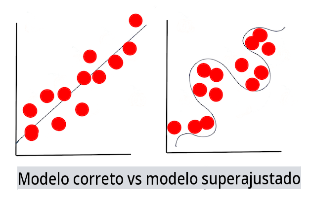

# Técnicas de Aprendizado de Máquina

O processo de construir, usar e manter modelos de aprendizado de máquina e os dados que eles utilizam é muito diferente de muitos outros fluxos de trabalho de desenvolvimento. Nesta lição, vamos desmistificar o processo e delinear as principais técnicas que você precisa conhecer. Você irá:

- Compreender os processos que sustentam o aprendizado de máquina em um nível alto.
- Explorar conceitos básicos como 'modelos', 'previsões' e 'dados de treinamento'.

## [Quiz pré-aula](https://gray-sand-07a10f403.1.azurestaticapps.net/quiz/7/)

> 🎥 Clique na imagem acima para um vídeo curto que aborda esta lição.

## Introdução

Em um nível alto, a arte de criar processos de aprendizado de máquina (ML) é composta por uma série de etapas:

1. **Decida a questão**. A maioria dos processos de ML começa fazendo uma pergunta que não pode ser respondida por um simples programa condicional ou motor baseado em regras. Essas perguntas geralmente giram em torno de previsões baseadas em uma coleção de dados.
2. **Coletar e preparar dados**. Para poder responder à sua pergunta, você precisa de dados. A qualidade e, às vezes, a quantidade dos seus dados determinarão o quão bem você pode responder à sua pergunta inicial. Visualizar dados é um aspecto importante desta fase. Esta fase também inclui dividir os dados em um grupo de treinamento e um grupo de teste para construir um modelo.
3. **Escolher um método de treinamento**. Dependendo da sua pergunta e da natureza dos seus dados, você precisa escolher como deseja treinar um modelo para refletir melhor seus dados e fazer previsões precisas. Esta é a parte do seu processo de ML que requer expertise específica e, frequentemente, uma quantidade considerável de experimentação.
4. **Treinar o modelo**. Usando seus dados de treinamento, você usará vários algoritmos para treinar um modelo para reconhecer padrões nos dados. O modelo pode aproveitar pesos internos que podem ser ajustados para privilegiar certas partes dos dados em detrimento de outras para construir um modelo melhor.
5. **Avaliar o modelo**. Você usa dados que nunca foram vistos antes (seus dados de teste) do conjunto coletado para ver como o modelo está se saindo.
6. **Ajuste de parâmetros**. Com base no desempenho do seu modelo, você pode refazer o processo usando diferentes parâmetros ou variáveis que controlam o comportamento dos algoritmos usados para treinar o modelo.
7. **Prever**. Use novas entradas para testar a precisão do seu modelo.

## Que pergunta fazer

Os computadores são particularmente habilidosos em descobrir padrões ocultos nos dados. Essa utilidade é muito útil para pesquisadores que têm perguntas sobre um determinado domínio que não podem ser facilmente respondidas criando um motor de regras baseado em condições. Dado uma tarefa atuarial, por exemplo, um cientista de dados pode ser capaz de construir regras personalizadas sobre a mortalidade de fumantes versus não fumantes.

Quando muitas outras variáveis são trazidas à equação, no entanto, um modelo de ML pode se mostrar mais eficiente para prever taxas de mortalidade futuras com base em históricos de saúde passados. Um exemplo mais otimista pode ser fazer previsões meteorológicas para o mês de abril em uma determinada localização com base em dados que incluem latitude, longitude, mudanças climáticas, proximidade ao oceano, padrões da corrente de jato e mais.

✅ Este [conjunto de slides](https://www2.cisl.ucar.edu/sites/default/files/2021-10/0900%20June%2024%20Haupt_0.pdf) sobre modelos climáticos oferece uma perspectiva histórica sobre o uso de ML na análise do tempo.

## Tarefas pré-construção

Antes de começar a construir seu modelo, há várias tarefas que você precisa concluir. Para testar sua pergunta e formar uma hipótese com base nas previsões de um modelo, você precisa identificar e configurar vários elementos.

### Dados

Para poder responder à sua pergunta com qualquer tipo de certeza, você precisa de uma boa quantidade de dados do tipo certo. Existem duas coisas que você precisa fazer neste momento:

- **Coletar dados**. Tendo em mente a lição anterior sobre justiça na análise de dados, colete seus dados com cuidado. Esteja ciente das fontes desses dados, quaisquer preconceitos inerentes que eles possam ter e documente sua origem.
- **Preparar dados**. Existem várias etapas no processo de preparação de dados. Você pode precisar compilar dados e normalizá-los se eles vierem de fontes diversas. Você pode melhorar a qualidade e a quantidade dos dados por meio de vários métodos, como converter strings em números (como fazemos em [Agrupamento](../../5-Clustering/1-Visualize/README.md)). Você também pode gerar novos dados, com base nos originais (como fazemos em [Classificação](../../4-Classification/1-Introduction/README.md)). Você pode limpar e editar os dados (como faremos antes da lição sobre [Web App](../../3-Web-App/README.md)). Finalmente, você também pode precisar randomizá-los e embaralhá-los, dependendo das suas técnicas de treinamento.

✅ Após coletar e processar seus dados, reserve um momento para ver se sua forma permitirá que você aborde sua pergunta pretendida. Pode ser que os dados não se desempenhem bem na sua tarefa específica, como descobrimos em nossas lições de [Agrupamento](../../5-Clustering/1-Visualize/README.md)!

### Recursos e Alvo

Um [recurso](https://www.datasciencecentral.com/profiles/blogs/an-introduction-to-variable-and-feature-selection) é uma propriedade mensurável dos seus dados. Em muitos conjuntos de dados, ele é expresso como um cabeçalho de coluna como 'data', 'tamanho' ou 'cor'. Sua variável de recurso, geralmente representada como `X` no código, representa a variável de entrada que será usada para treinar o modelo.

Um alvo é uma coisa que você está tentando prever. O alvo é geralmente representado como `y` no código e representa a resposta à pergunta que você está tentando fazer aos seus dados: em dezembro, qual **cor** de abóboras será a mais barata? em San Francisco, quais bairros terão o melhor **preço** imobiliário? Às vezes, o alvo também é referido como atributo de rótulo.

### Selecionando sua variável de recurso

🎓 **Seleção de Recursos e Extração de Recursos** Como você sabe qual variável escolher ao construir um modelo? Você provavelmente passará por um processo de seleção de recursos ou extração de recursos para escolher as variáveis certas para o modelo mais performático. No entanto, eles não são a mesma coisa: "A extração de recursos cria novos recursos a partir de funções dos recursos originais, enquanto a seleção de recursos retorna um subconjunto dos recursos." ([fonte](https://wikipedia.org/wiki/Feature_selection))

### Visualize seus dados

Um aspecto importante do conjunto de ferramentas do cientista de dados é o poder de visualizar dados usando várias bibliotecas excelentes, como Seaborn ou MatPlotLib. Representar seus dados visualmente pode permitir que você descubra correlações ocultas que pode aproveitar. Suas visualizações também podem ajudá-lo a descobrir preconceitos ou dados desequilibrados (como descobrimos em [Classificação](../../4-Classification/2-Classifiers-1/README.md)).

### Divida seu conjunto de dados

Antes de treinar, você precisa dividir seu conjunto de dados em duas ou mais partes de tamanhos desiguais que ainda representem bem os dados.

- **Treinamento**. Esta parte do conjunto de dados é ajustada ao seu modelo para treiná-lo. Este conjunto constitui a maioria do conjunto de dados original.
- **Teste**. Um conjunto de dados de teste é um grupo independente de dados, frequentemente coletado a partir dos dados originais, que você usa para confirmar o desempenho do modelo construído.
- **Validação**. Um conjunto de validação é um grupo independente menor de exemplos que você usa para ajustar os hiperparâmetros ou a arquitetura do modelo, para melhorar o modelo. Dependendo do tamanho dos seus dados e da pergunta que você está fazendo, pode ser que você não precise construir este terceiro conjunto (como notamos em [Previsão de Séries Temporais](../../7-TimeSeries/1-Introduction/README.md)).

## Construindo um modelo

Usando seus dados de treinamento, seu objetivo é construir um modelo, ou uma representação estatística dos seus dados, usando vários algoritmos para **treiná-lo**. Treinar um modelo expõe-o a dados e permite que ele faça suposições sobre padrões percebidos que descobre, valida e aceita ou rejeita.

### Decida um método de treinamento

Dependendo da sua pergunta e da natureza dos seus dados, você escolherá um método para treiná-lo. Passando pela [documentação do Scikit-learn](https://scikit-learn.org/stable/user_guide.html) - que usamos neste curso - você pode explorar várias maneiras de treinar um modelo. Dependendo da sua experiência, pode ser que você tenha que tentar vários métodos diferentes para construir o melhor modelo. Você provavelmente passará por um processo em que os cientistas de dados avaliam o desempenho de um modelo alimentando-o com dados não vistos, verificando precisão, preconceitos e outros problemas que degradam a qualidade, e selecionando o método de treinamento mais apropriado para a tarefa em questão.

### Treinar um modelo

Armado com seus dados de treinamento, você está pronto para 'ajustá-lo' para criar um modelo. Você notará que em muitas bibliotecas de ML encontrará o código 'model.fit' - é neste momento que você envia sua variável de recurso como um array de valores (geralmente 'X') e uma variável alvo (geralmente 'y').

### Avaliar o modelo

Uma vez que o processo de treinamento esteja completo (pode levar muitas iterações, ou 'épocas', para treinar um grande modelo), você poderá avaliar a qualidade do modelo usando dados de teste para medir seu desempenho. Esses dados são um subconjunto dos dados originais que o modelo não analisou anteriormente. Você pode imprimir uma tabela de métricas sobre a qualidade do seu modelo.

🎓 **Ajuste de modelo**

No contexto de aprendizado de máquina, o ajuste de modelo refere-se à precisão da função subjacente do modelo enquanto ele tenta analisar dados com os quais não está familiarizado.

🎓 **Subajuste** e **sobreajuste** são problemas comuns que degradam a qualidade do modelo, pois o modelo se ajusta de forma inadequada ou excessiva. Isso faz com que o modelo faça previsões que estão muito alinhadas ou muito soltas em relação aos seus dados de treinamento. Um modelo sobreajustado prevê os dados de treinamento muito bem porque aprendeu os detalhes e o ruído dos dados muito bem. Um modelo subajustado não é preciso, pois não consegue analisar com precisão seus dados de treinamento nem dados que ainda não 'viu'.

> Infográfico por [Jen Looper](https://twitter.com/jenlooper)

## Ajuste de parâmetros

Uma vez que seu treinamento inicial esteja completo, observe a qualidade do modelo e considere melhorá-lo ajustando seus 'hiperparâmetros'. Leia mais sobre o processo [na documentação](https://docs.microsoft.com/en-us/azure/machine-learning/how-to-tune-hyperparameters?WT.mc_id=academic-77952-leestott).

## Previsão

Este é o momento em que você pode usar dados completamente novos para testar a precisão do seu modelo. Em um ambiente de ML 'aplicado', onde você está construindo ativos da web para usar o modelo em produção, esse processo pode envolver a coleta de entrada do usuário (um pressionamento de botão, por exemplo) para definir uma variável e enviá-la ao modelo para inferência ou avaliação.

Nestes módulos, você descobrirá como usar essas etapas para preparar, construir, testar, avaliar e prever - todos os gestos de um cientista de dados e mais, à medida que avança em sua jornada para se tornar um engenheiro de ML 'full stack'.

---

## 🚀Desafio

Desenhe um fluxograma refletindo as etapas de um praticante de ML. Onde você se vê agora no processo? Onde você prevê que encontrará dificuldades? O que parece fácil para você?

## [Quiz pós-aula](https://gray-sand-07a10f403.1.azurestaticapps.net/quiz/8/)

## Revisão & Autoestudo

Pesquise online por entrevistas com cientistas de dados que discutem seu trabalho diário. Aqui está [uma](https://www.youtube.com/watch?v=Z3IjgbbCEfs).

## Tarefa

[Entrevistar um cientista de dados](assignment.md)

**Isenção de responsabilidade**:  
Este documento foi traduzido utilizando serviços de tradução automática baseados em IA. Embora nos esforcemos pela precisão, esteja ciente de que traduções automáticas podem conter erros ou imprecisões. O documento original em seu idioma nativo deve ser considerado a fonte autoritária. Para informações críticas, recomenda-se a tradução profissional feita por humanos. Não nos responsabilizamos por quaisquer mal-entendidos ou interpretações erradas decorrentes do uso desta tradução.