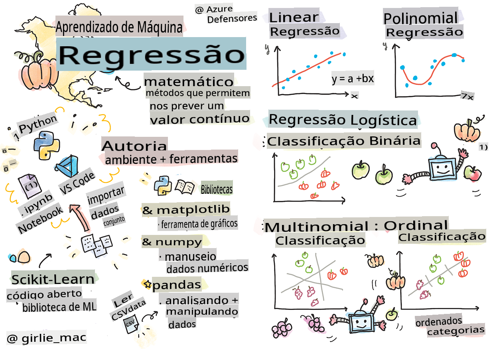
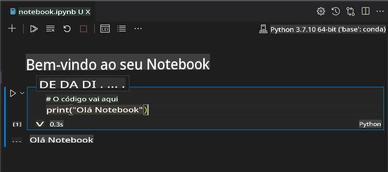
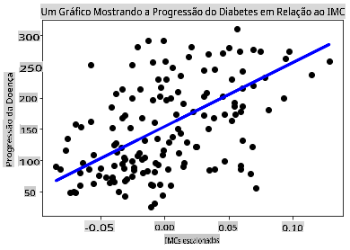

# Comece com Python e Scikit-learn para modelos de regressão



> Sketchnote por [Tomomi Imura](https://www.twitter.com/girlie_mac)

## [Quiz pré-aula](https://gray-sand-07a10f403.1.azurestaticapps.net/quiz/9/)

> ### [Esta lição está disponível em R!](../../../../2-Regression/1-Tools/solution/R/lesson_1.html)

## Introdução

Nestes quatro módulos, você vai descobrir como construir modelos de regressão. Vamos discutir brevemente para que servem. Mas antes de fazer qualquer coisa, certifique-se de que você tem as ferramentas certas para iniciar o processo!

Nesta lição, você aprenderá a:

- Configurar seu computador para tarefas de aprendizado de máquina local.
- Trabalhar com notebooks Jupyter.
- Usar Scikit-learn, incluindo instalação.
- Explorar a regressão linear com um exercício prático.

## Instalações e configurações

[](https://youtu.be/-DfeD2k2Kj0 "ML para iniciantes - Configure suas ferramentas para construir modelos de Machine Learning")

> 🎥 Clique na imagem acima para um vídeo curto mostrando como configurar seu computador para ML.

1. **Instale o Python**. Certifique-se de que o [Python](https://www.python.org/downloads/) está instalado em seu computador. Você usará o Python para muitas tarefas de ciência de dados e aprendizado de máquina. A maioria dos sistemas já inclui uma instalação do Python. Existem também [Pacotes de Codificação Python](https://code.visualstudio.com/learn/educators/installers?WT.mc_id=academic-77952-leestott) úteis disponíveis para facilitar a configuração para alguns usuários.

   Alguns usos do Python, no entanto, exigem uma versão do software, enquanto outros exigem uma versão diferente. Por essa razão, é útil trabalhar dentro de um [ambiente virtual](https://docs.python.org/3/library/venv.html).

2. **Instale o Visual Studio Code**. Certifique-se de que você tem o Visual Studio Code instalado em seu computador. Siga estas instruções para [instalar o Visual Studio Code](https://code.visualstudio.com/) para a instalação básica. Você vai usar Python no Visual Studio Code neste curso, então pode querer revisar como [configurar o Visual Studio Code](https://docs.microsoft.com/learn/modules/python-install-vscode?WT.mc_id=academic-77952-leestott) para desenvolvimento em Python.

   > Familiarize-se com Python trabalhando nesta coleção de [módulos de aprendizado](https://docs.microsoft.com/users/jenlooper-2911/collections/mp1pagggd5qrq7?WT.mc_id=academic-77952-leestott)
   >
   > [](https://youtu.be/yyQM70vi7V8 "Configurar Python com Visual Studio Code")
   >
   > 🎥 Clique na imagem acima para um vídeo: usando Python no VS Code.

3. **Instale o Scikit-learn**, seguindo [estas instruções](https://scikit-learn.org/stable/install.html). Como você precisa garantir que está usando Python 3, é recomendado que você use um ambiente virtual. Observe que, se você estiver instalando esta biblioteca em um Mac M1, há instruções especiais na página vinculada acima.

4. **Instale o Jupyter Notebook**. Você precisará [instalar o pacote Jupyter](https://pypi.org/project/jupyter/).

## Seu ambiente de autoria em ML

Você vai usar **notebooks** para desenvolver seu código Python e criar modelos de aprendizado de máquina. Este tipo de arquivo é uma ferramenta comum para cientistas de dados, e pode ser identificado por seu sufixo ou extensão `.ipynb`.

Os notebooks são um ambiente interativo que permite ao desenvolvedor codificar, adicionar notas e escrever documentação em torno do código, o que é bastante útil para projetos experimentais ou orientados à pesquisa.

[](https://youtu.be/7E-jC8FLA2E "ML para iniciantes - Configure Jupyter Notebooks para começar a construir modelos de regressão")

> 🎥 Clique na imagem acima para um vídeo curto mostrando este exercício.

### Exercício - trabalhar com um notebook

Nesta pasta, você encontrará o arquivo _notebook.ipynb_.

1. Abra _notebook.ipynb_ no Visual Studio Code.

   Um servidor Jupyter será iniciado com Python 3+. Você encontrará áreas do notebook que podem ser `run`, pedaços de código. Você pode executar um bloco de código selecionando o ícone que parece um botão de play.

2. Selecione o ícone `md` e adicione um pouco de markdown, e o seguinte texto **# Bem-vindo ao seu notebook**.

   Em seguida, adicione algum código Python.

3. Digite **print('hello notebook')** no bloco de código.
4. Selecione a seta para executar o código.

   Você deve ver a declaração impressa:

    ```output
    hello notebook
    ```



Você pode intercalar seu código com comentários para auto-documentar o notebook.

✅ Pense por um minuto sobre como o ambiente de trabalho de um desenvolvedor web é diferente do de um cientista de dados.

## Pronto para usar o Scikit-learn

Agora que o Python está configurado em seu ambiente local e você está confortável com notebooks Jupyter, vamos nos familiarizar também com o Scikit-learn (pronuncie como `sci` as in `science`). O Scikit-learn fornece uma [API extensa](https://scikit-learn.org/stable/modules/classes.html#api-ref) para ajudá-lo a realizar tarefas de ML.

De acordo com seu [site](https://scikit-learn.org/stable/getting_started.html), "Scikit-learn é uma biblioteca de aprendizado de máquina de código aberto que suporta aprendizado supervisionado e não supervisionado. Também fornece várias ferramentas para ajuste de modelos, pré-processamento de dados, seleção e avaliação de modelos, e muitas outras utilidades."

Neste curso, você usará o Scikit-learn e outras ferramentas para construir modelos de aprendizado de máquina para realizar o que chamamos de tarefas de 'aprendizado de máquina tradicional'. Evitamos deliberadamente redes neurais e aprendizado profundo, pois eles são melhor abordados em nosso futuro currículo 'IA para Iniciantes'.

O Scikit-learn torna fácil construir modelos e avaliá-los para uso. Ele é principalmente focado no uso de dados numéricos e contém vários conjuntos de dados prontos para uso como ferramentas de aprendizado. Também inclui modelos pré-construídos para os alunos experimentarem. Vamos explorar o processo de carregar dados pré-embalados e usar um estimador embutido para o primeiro modelo de ML com Scikit-learn com alguns dados básicos.

## Exercício - seu primeiro notebook Scikit-learn

> Este tutorial foi inspirado no [exemplo de regressão linear](https://scikit-learn.org/stable/auto_examples/linear_model/plot_ols.html#sphx-glr-auto-examples-linear-model-plot-ols-py) no site do Scikit-learn.

[](https://youtu.be/2xkXL5EUpS0 "ML para iniciantes - Seu Primeiro Projeto de Regressão Linear em Python")

> 🎥 Clique na imagem acima para um vídeo curto mostrando este exercício.

No arquivo _notebook.ipynb_ associado a esta lição, limpe todas as células pressionando o ícone 'lixeira'.

Nesta seção, você trabalhará com um pequeno conjunto de dados sobre diabetes que está embutido no Scikit-learn para fins de aprendizado. Imagine que você deseja testar um tratamento para pacientes diabéticos. Modelos de Aprendizado de Máquina podem ajudá-lo a determinar quais pacientes responderiam melhor ao tratamento, com base em combinações de variáveis. Mesmo um modelo de regressão muito básico, quando visualizado, pode mostrar informações sobre variáveis que ajudariam a organizar seus ensaios clínicos teóricos.

✅ Existem muitos tipos de métodos de regressão, e qual você escolher depende da resposta que está buscando. Se você deseja prever a altura provável de uma pessoa de uma determinada idade, usaria regressão linear, já que está buscando um **valor numérico**. Se você está interessado em descobrir se um tipo de cozinha deve ser considerado vegano ou não, você está buscando uma **atribuição de categoria**, então usaria regressão logística. Você aprenderá mais sobre regressão logística mais adiante. Pense um pouco sobre algumas perguntas que você pode fazer aos dados e qual desses métodos seria mais apropriado.

Vamos começar esta tarefa.

### Importar bibliotecas

Para esta tarefa, importaremos algumas bibliotecas:

- **matplotlib**. É uma [ferramenta de gráficos](https://matplotlib.org/) útil e a usaremos para criar um gráfico de linha.
- **numpy**. [numpy](https://numpy.org/doc/stable/user/whatisnumpy.html) é uma biblioteca útil para manipular dados numéricos em Python.
- **sklearn**. Esta é a biblioteca [Scikit-learn](https://scikit-learn.org/stable/user_guide.html).

Importe algumas bibliotecas para ajudar com suas tarefas.

1. Adicione as importações digitando o seguinte código:

   ```python
   import matplotlib.pyplot as plt
   import numpy as np
   from sklearn import datasets, linear_model, model_selection
   ```

   Acima, você está importando `matplotlib`, `numpy` and you are importing `datasets`, `linear_model` and `model_selection` from `sklearn`. `model_selection` is used for splitting data into training and test sets.

### The diabetes dataset

The built-in [diabetes dataset](https://scikit-learn.org/stable/datasets/toy_dataset.html#diabetes-dataset) includes 442 samples of data around diabetes, with 10 feature variables, some of which include:

- age: age in years
- bmi: body mass index
- bp: average blood pressure
- s1 tc: T-Cells (a type of white blood cells)

✅ This dataset includes the concept of 'sex' as a feature variable important to research around diabetes. Many medical datasets include this type of binary classification. Think a bit about how categorizations such as this might exclude certain parts of a population from treatments.

Now, load up the X and y data.

> 🎓 Remember, this is supervised learning, and we need a named 'y' target.

In a new code cell, load the diabetes dataset by calling `load_diabetes()`. The input `return_X_y=True` signals that `X` will be a data matrix, and `y` será o alvo da regressão.

2. Adicione alguns comandos de impressão para mostrar a forma da matriz de dados e seu primeiro elemento:

    ```python
    X, y = datasets.load_diabetes(return_X_y=True)
    print(X.shape)
    print(X[0])
    ```

    O que você está recebendo como resposta é uma tupla. O que você está fazendo é atribuir os dois primeiros valores da tupla a `X` and `y` respectivamente. Aprenda mais [sobre tuplas](https://wikipedia.org/wiki/Tuple).

    Você pode ver que esses dados têm 442 itens moldados em arrays de 10 elementos:

    ```text
    (442, 10)
    [ 0.03807591  0.05068012  0.06169621  0.02187235 -0.0442235  -0.03482076
    -0.04340085 -0.00259226  0.01990842 -0.01764613]
    ```

    ✅ Pense um pouco sobre a relação entre os dados e o alvo da regressão. A regressão linear prevê relações entre a característica X e a variável alvo y. Você consegue encontrar o [alvo](https://scikit-learn.org/stable/datasets/toy_dataset.html#diabetes-dataset) para o conjunto de dados de diabetes na documentação? O que este conjunto de dados está demonstrando, dado aquele alvo?

3. Em seguida, selecione uma parte deste conjunto de dados para plotar selecionando a 3ª coluna do conjunto de dados. Você pode fazer isso usando `:` operator to select all rows, and then selecting the 3rd column using the index (2). You can also reshape the data to be a 2D array - as required for plotting - by using `reshape(n_rows, n_columns)`. Se um dos parâmetros for -1, a dimensão correspondente é calculada automaticamente.

   ```python
   X = X[:, 2]
   X = X.reshape((-1,1))
   ```

   ✅ A qualquer momento, imprima os dados para verificar sua forma.

4. Agora que você tem os dados prontos para serem plotados, você pode ver se uma máquina pode ajudar a determinar uma divisão lógica entre os números neste conjunto de dados. Para fazer isso, você precisa dividir tanto os dados (X) quanto o alvo (y) em conjuntos de teste e treinamento. O Scikit-learn tem uma maneira simples de fazer isso; você pode dividir seus dados de teste em um determinado ponto.

   ```python
   X_train, X_test, y_train, y_test = model_selection.train_test_split(X, y, test_size=0.33)
   ```

5. Agora você está pronto para treinar seu modelo! Carregue o modelo de regressão linear e treine-o com seus conjuntos de treinamento X e y usando `model.fit()`:

    ```python
    model = linear_model.LinearRegression()
    model.fit(X_train, y_train)
    ```

    ✅ `model.fit()` is a function you'll see in many ML libraries such as TensorFlow

5. Then, create a prediction using test data, using the function `predict()`. Isso será usado para traçar a linha entre os grupos de dados

    ```python
    y_pred = model.predict(X_test)
    ```

6. Agora é hora de mostrar os dados em um gráfico. O Matplotlib é uma ferramenta muito útil para essa tarefa. Crie um gráfico de dispersão de todos os dados de teste X e y, e use a previsão para traçar uma linha no lugar mais apropriado, entre as agrupamentos de dados do modelo.

    ```python
    plt.scatter(X_test, y_test,  color='black')
    plt.plot(X_test, y_pred, color='blue', linewidth=3)
    plt.xlabel('Scaled BMIs')
    plt.ylabel('Disease Progression')
    plt.title('A Graph Plot Showing Diabetes Progression Against BMI')
    plt.show()
    ```

   

   ✅ Pense um pouco sobre o que está acontecendo aqui. Uma linha reta está passando por muitos pequenos pontos de dados, mas o que ela está fazendo exatamente? Você consegue ver como deve ser capaz de usar essa linha para prever onde um novo ponto de dado não visto deve se encaixar em relação ao eixo y do gráfico? Tente colocar em palavras o uso prático deste modelo.

Parabéns, você construiu seu primeiro modelo de regressão linear, criou uma previsão com ele e o exibiu em um gráfico!

---
## 🚀Desafio

Plote uma variável diferente deste conjunto de dados. Dica: edite esta linha: `X = X[:,2]`. Dado o alvo deste conjunto de dados, o que você é capaz de descobrir sobre a progressão do diabetes como doença?
## [Quiz pós-aula](https://gray-sand-07a10f403.1.azurestaticapps.net/quiz/10/)

## Revisão & Autoestudo

Neste tutorial, você trabalhou com regressão linear simples, em vez de regressão linear univariada ou múltipla. Leia um pouco sobre as diferenças entre esses métodos, ou dê uma olhada [neste vídeo](https://www.coursera.org/lecture/quantifying-relationships-regression-models/linear-vs-nonlinear-categorical-variables-ai2Ef).

Leia mais sobre o conceito de regressão e pense sobre quais tipos de perguntas podem ser respondidas por essa técnica. Faça este [tutorial](https://docs.microsoft.com/learn/modules/train-evaluate-regression-models?WT.mc_id=academic-77952-leestott) para aprofundar sua compreensão.

## Tarefa

[Um conjunto de dados diferente](assignment.md)

**Isenção de responsabilidade**:  
Este documento foi traduzido utilizando serviços de tradução automática baseados em IA. Embora nos esforcemos pela precisão, esteja ciente de que traduções automatizadas podem conter erros ou imprecisões. O documento original em sua língua nativa deve ser considerado a fonte autoritativa. Para informações críticas, recomenda-se a tradução profissional por um humano. Não nos responsabilizamos por quaisquer mal-entendidos ou interpretações equivocadas resultantes do uso desta tradução.