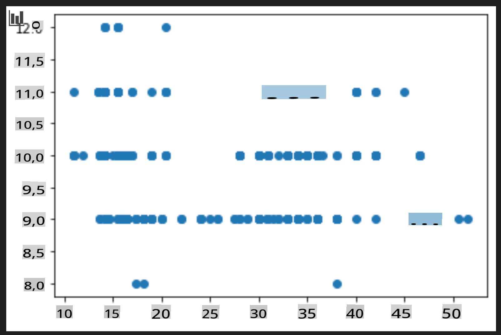
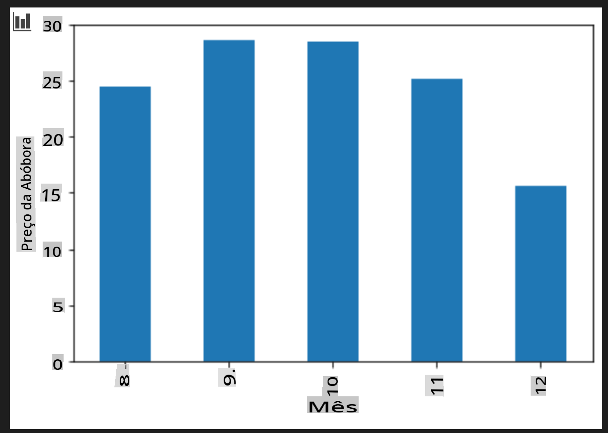

# Construa um modelo de regressão usando Scikit-learn: prepare e visualize os dados


Infográfico por [Dasani Madipalli](https://twitter.com/dasani_decoded)

## [Quiz pré-aula](https://gray-sand-07a10f403.1.azurestaticapps.net/quiz/11/)

> ### [Esta lição está disponível em R!](../../../../2-Regression/2-Data/solution/R/lesson_2.html)

## Introdução

Agora que você está equipado com as ferramentas necessárias para começar a enfrentar a construção de modelos de aprendizado de máquina com Scikit-learn, você está pronto para começar a fazer perguntas sobre seus dados. Ao trabalhar com dados e aplicar soluções de ML, é muito importante entender como fazer a pergunta certa para desbloquear adequadamente os potenciais do seu conjunto de dados.

Nesta lição, você aprenderá:

- Como preparar seus dados para a construção do modelo.
- Como usar o Matplotlib para visualização de dados.

## Fazendo a pergunta certa sobre seus dados

A pergunta que você precisa responder determinará quais tipos de algoritmos de ML você irá utilizar. E a qualidade da resposta que você obtém dependerá fortemente da natureza dos seus dados.

Dê uma olhada nos [dados](https://github.com/microsoft/ML-For-Beginners/blob/main/2-Regression/data/US-pumpkins.csv) fornecidos para esta lição. Você pode abrir este arquivo .csv no VS Code. Uma rápida olhada imediatamente mostra que há campos em branco e uma mistura de strings e dados numéricos. Também há uma coluna estranha chamada 'Package' onde os dados são uma mistura de 'sacos', 'caixas' e outros valores. Os dados, na verdade, estão um pouco bagunçados.

[](https://youtu.be/5qGjczWTrDQ "ML para iniciantes - Como Analisar e Limpar um Conjunto de Dados")

> 🎥 Clique na imagem acima para um vídeo curto que mostra como preparar os dados para esta lição.

Na verdade, não é muito comum receber um conjunto de dados que esteja completamente pronto para ser usado na criação de um modelo de ML. Nesta lição, você aprenderá como preparar um conjunto de dados bruto usando bibliotecas padrão do Python. Você também aprenderá várias técnicas para visualizar os dados.

## Estudo de caso: 'o mercado de abóboras'

Nesta pasta, você encontrará um arquivo .csv na pasta raiz `data` chamado [US-pumpkins.csv](https://github.com/microsoft/ML-For-Beginners/blob/main/2-Regression/data/US-pumpkins.csv), que inclui 1757 linhas de dados sobre o mercado de abóboras, organizados em grupos por cidade. Estes são dados brutos extraídos dos [Relatórios Padrão dos Mercados de Produtos Especiais](https://www.marketnews.usda.gov/mnp/fv-report-config-step1?type=termPrice) distribuídos pelo Departamento de Agricultura dos Estados Unidos.

### Preparando os dados

Esses dados estão no domínio público. Eles podem ser baixados em muitos arquivos separados, por cidade, no site do USDA. Para evitar muitos arquivos separados, nós concatenamos todos os dados das cidades em uma única planilha, assim já _preparamos_ os dados um pouco. A seguir, vamos dar uma olhada mais de perto nos dados.

### Os dados das abóboras - conclusões iniciais

O que você nota sobre esses dados? Você já viu que há uma mistura de strings, números, campos em branco e valores estranhos que você precisa entender.

Que pergunta você pode fazer sobre esses dados, usando uma técnica de Regressão? Que tal "Prever o preço de uma abóbora à venda durante um determinado mês". Olhando novamente para os dados, há algumas mudanças que você precisa fazer para criar a estrutura de dados necessária para a tarefa.

## Exercício - analisar os dados das abóboras

Vamos usar [Pandas](https://pandas.pydata.org/), (o nome se refere a `Python Data Analysis`) uma ferramenta muito útil para moldar dados, para analisar e preparar esses dados de abóbora.

### Primeiro, verifique as datas ausentes

Você precisará primeiro tomar medidas para verificar as datas ausentes:

1. Converta as datas para um formato de mês (essas são datas dos EUA, então o formato é `MM/DD/YYYY`).
2. Extraia o mês para uma nova coluna.

Abra o arquivo _notebook.ipynb_ no Visual Studio Code e importe a planilha para um novo dataframe do Pandas.

1. Use a função `head()` para visualizar as cinco primeiras linhas.

    ```python
    import pandas as pd
    pumpkins = pd.read_csv('../data/US-pumpkins.csv')
    pumpkins.head()
    ```

    ✅ Que função você usaria para visualizar as últimas cinco linhas?

1. Verifique se há dados ausentes no dataframe atual:

    ```python
    pumpkins.isnull().sum()
    ```

    Há dados ausentes, mas talvez isso não importe para a tarefa em questão.

1. Para tornar seu dataframe mais fácil de trabalhar, selecione apenas as colunas que você precisa, usando `loc` function which extracts from the original dataframe a group of rows (passed as first parameter) and columns (passed as second parameter). The expression `:` no caso abaixo significa "todas as linhas".

    ```python
    columns_to_select = ['Package', 'Low Price', 'High Price', 'Date']
    pumpkins = pumpkins.loc[:, columns_to_select]
    ```

### Segundo, determine o preço médio da abóbora

Pense em como determinar o preço médio de uma abóbora em um determinado mês. Quais colunas você escolheria para essa tarefa? Dica: você precisará de 3 colunas.

Solução: tire a média das colunas `Low Price` and `High Price` para preencher a nova coluna de Preço e converta a coluna de Data para mostrar apenas o mês. Felizmente, de acordo com a verificação acima, não há dados ausentes para datas ou preços.

1. Para calcular a média, adicione o seguinte código:

    ```python
    price = (pumpkins['Low Price'] + pumpkins['High Price']) / 2

    month = pd.DatetimeIndex(pumpkins['Date']).month

    ```

   ✅ Sinta-se à vontade para imprimir quaisquer dados que você gostaria de verificar usando `print(month)`.

2. Agora, copie seus dados convertidos para um novo dataframe do Pandas:

    ```python
    new_pumpkins = pd.DataFrame({'Month': month, 'Package': pumpkins['Package'], 'Low Price': pumpkins['Low Price'],'High Price': pumpkins['High Price'], 'Price': price})
    ```

    Imprimir seu dataframe mostrará um conjunto de dados limpo e organizado sobre o qual você pode construir seu novo modelo de regressão.

### Mas espere! Há algo estranho aqui

Se você olhar a coluna `Package` column, pumpkins are sold in many different configurations. Some are sold in '1 1/9 bushel' measures, and some in '1/2 bushel' measures, some per pumpkin, some per pound, and some in big boxes with varying widths.

> Pumpkins seem very hard to weigh consistently

Digging into the original data, it's interesting that anything with `Unit of Sale` equalling 'EACH' or 'PER BIN' also have the `Package` type per inch, per bin, or 'each'. Pumpkins seem to be very hard to weigh consistently, so let's filter them by selecting only pumpkins with the string 'bushel' in their `Package`.

1. Adicione um filtro no topo do arquivo, abaixo da importação inicial do .csv:

    ```python
    pumpkins = pumpkins[pumpkins['Package'].str.contains('bushel', case=True, regex=True)]
    ```

    Se você imprimir os dados agora, verá que está obtendo apenas cerca de 415 linhas de dados contendo abóboras por alqueire.

### Mas espere! Há mais uma coisa a fazer

Você notou que a quantidade de alqueire varia por linha? Você precisa normalizar o preço para mostrar o preço por alqueire, então faça algumas contas para padronizá-lo.

1. Adicione estas linhas após o bloco que cria o novo dataframe de novas_abóboras:

    ```python
    new_pumpkins.loc[new_pumpkins['Package'].str.contains('1 1/9'), 'Price'] = price/(1 + 1/9)

    new_pumpkins.loc[new_pumpkins['Package'].str.contains('1/2'), 'Price'] = price/(1/2)
    ```

✅ De acordo com [The Spruce Eats](https://www.thespruceeats.com/how-much-is-a-bushel-1389308), o peso de um alqueire depende do tipo de produto, já que é uma medida de volume. "Um alqueire de tomates, por exemplo, deve pesar 56 libras... Folhas e verduras ocupam mais espaço com menos peso, então um alqueire de espinafre pesa apenas 20 libras." É tudo bastante complicado! Vamos não nos preocupar com a conversão de alqueire para libras e, em vez disso, precificar por alqueire. Todo esse estudo sobre alqueires de abóboras, no entanto, mostra o quão importante é entender a natureza dos seus dados!

Agora, você pode analisar o preço por unidade com base na medida de alqueire. Se você imprimir os dados mais uma vez, poderá ver como está padronizado.

✅ Você notou que as abóboras vendidas por meio alqueire são muito caras? Você consegue descobrir por quê? Dica: pequenas abóboras são muito mais caras do que as grandes, provavelmente porque há muito mais delas por alqueire, dada a quantidade de espaço não utilizado ocupada por uma grande abóbora oca.

## Estratégias de Visualização

Parte do papel do cientista de dados é demonstrar a qualidade e a natureza dos dados com os quais estão trabalhando. Para fazer isso, eles costumam criar visualizações interessantes, ou gráficos, mostrando diferentes aspectos dos dados. Dessa forma, eles conseguem mostrar visualmente relacionamentos e lacunas que, de outra forma, seriam difíceis de descobrir.

[](https://youtu.be/SbUkxH6IJo0 "ML para iniciantes - Como Visualizar Dados com Matplotlib")

> 🎥 Clique na imagem acima para um vídeo curto que mostra como visualizar os dados para esta lição.

As visualizações também podem ajudar a determinar a técnica de aprendizado de máquina mais apropriada para os dados. Um gráfico de dispersão que parece seguir uma linha, por exemplo, indica que os dados são um bom candidato para um exercício de regressão linear.

Uma biblioteca de visualização de dados que funciona bem em notebooks Jupyter é [Matplotlib](https://matplotlib.org/) (que você também viu na lição anterior).

> Obtenha mais experiência com visualização de dados em [esses tutoriais](https://docs.microsoft.com/learn/modules/explore-analyze-data-with-python?WT.mc_id=academic-77952-leestott).

## Exercício - experimente com Matplotlib

Tente criar alguns gráficos básicos para exibir o novo dataframe que você acabou de criar. O que um gráfico de linhas básico mostraria?

1. Importe o Matplotlib no topo do arquivo, abaixo da importação do Pandas:

    ```python
    import matplotlib.pyplot as plt
    ```

1. Execute novamente todo o notebook para atualizar.
1. Na parte inferior do notebook, adicione uma célula para plotar os dados como um box:

    ```python
    price = new_pumpkins.Price
    month = new_pumpkins.Month
    plt.scatter(price, month)
    plt.show()
    ```

    

    Este é um gráfico útil? Há algo nele que te surpreende?

    Não é particularmente útil, pois tudo o que faz é exibir seus dados como uma dispersão de pontos em um determinado mês.

### Torne-o útil

Para que os gráficos exibam dados úteis, geralmente é necessário agrupar os dados de alguma forma. Vamos tentar criar um gráfico onde o eixo y mostra os meses e os dados demonstram a distribuição dos dados.

1. Adicione uma célula para criar um gráfico de barras agrupadas:

    ```python
    new_pumpkins.groupby(['Month'])['Price'].mean().plot(kind='bar')
    plt.ylabel("Pumpkin Price")
    ```

    

    Esta é uma visualização de dados mais útil! Parece indicar que o preço mais alto das abóboras ocorre em setembro e outubro. Isso atende à sua expectativa? Por que ou por que não?

---

## 🚀Desafio

Explore os diferentes tipos de visualização que o Matplotlib oferece. Quais tipos são mais apropriados para problemas de regressão?

## [Quiz pós-aula](https://gray-sand-07a10f403.1.azurestaticapps.net/quiz/12/)

## Revisão e Estudo Pessoal

Dê uma olhada nas muitas maneiras de visualizar dados. Faça uma lista das várias bibliotecas disponíveis e observe quais são melhores para determinados tipos de tarefas, por exemplo, visualizações 2D vs. 3D. O que você descobre?

## Tarefa

[Explorando visualização](assignment.md)

**Isenção de responsabilidade**:  
Este documento foi traduzido usando serviços de tradução automática baseados em IA. Embora nos esforcemos pela precisão, esteja ciente de que traduções automatizadas podem conter erros ou imprecisões. O documento original em sua língua nativa deve ser considerado a fonte autoritativa. Para informações críticas, recomenda-se a tradução profissional realizada por humanos. Não nos responsabilizamos por quaisquer mal-entendidos ou interpretações erradas decorrentes do uso desta tradução.