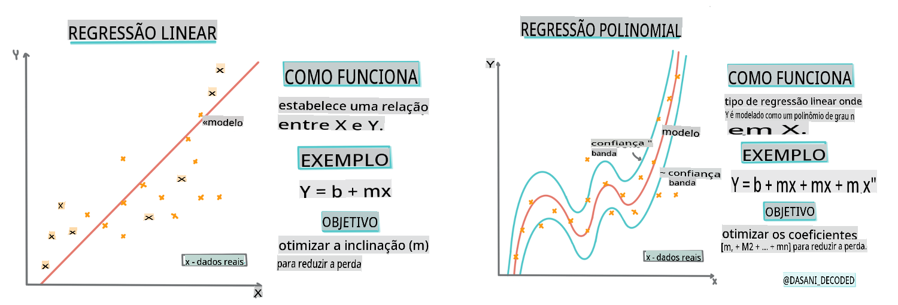
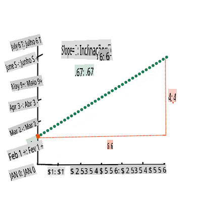
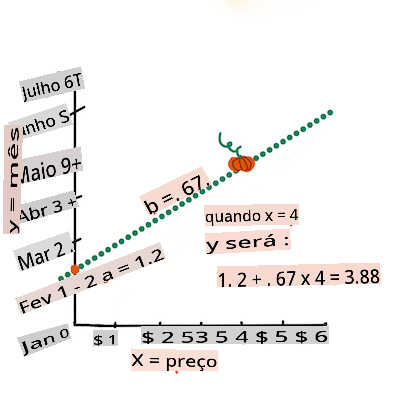

# Construa um modelo de regressão usando Scikit-learn: regressão de quatro maneiras


> Infográfico por [Dasani Madipalli](https://twitter.com/dasani_decoded)
## [Questionário pré-aula](https://gray-sand-07a10f403.1.azurestaticapps.net/quiz/13/)

> ### [Esta lição está disponível em R!](../../../../2-Regression/3-Linear/solution/R/lesson_3.html)
### Introdução 

Até agora, você explorou o que é regressão com dados de amostra coletados do conjunto de dados de preços de abóbora que usaremos ao longo desta lição. Você também visualizou isso usando Matplotlib.

Agora você está pronto para mergulhar mais fundo na regressão para ML. Enquanto a visualização permite que você compreenda os dados, o verdadeiro poder do Aprendizado de Máquina vem do _treinamento de modelos_. Modelos são treinados com dados históricos para capturar automaticamente as dependências dos dados, e eles permitem que você preveja resultados para novos dados, que o modelo não viu antes.

Nesta lição, você aprenderá mais sobre dois tipos de regressão: _regressão linear básica_ e _regressão polinomial_, junto com um pouco da matemática subjacente a essas técnicas. Esses modelos nos permitirão prever os preços das abóboras dependendo de diferentes dados de entrada. 

[](https://youtu.be/CRxFT8oTDMg "ML para iniciantes - Compreendendo Regressão Linear")

> 🎥 Clique na imagem acima para um breve vídeo sobre regressão linear.

> Ao longo deste currículo, assumimos conhecimento mínimo de matemática e buscamos torná-la acessível para estudantes de outras áreas, então fique atento a notas, 🧮 destaques, diagramas e outras ferramentas de aprendizado para ajudar na compreensão.

### Pré-requisitos

Você deve estar familiarizado agora com a estrutura dos dados de abóbora que estamos examinando. Você pode encontrá-los pré-carregados e pré-limpos no arquivo _notebook.ipynb_ desta lição. No arquivo, o preço da abóbora é exibido por alqueire em um novo DataFrame. Certifique-se de que você pode executar esses notebooks em kernels no Visual Studio Code.

### Preparação

Como lembrete, você está carregando esses dados para poder fazer perguntas sobre eles. 

- Quando é o melhor momento para comprar abóboras? 
- Que preço posso esperar de uma caixa de abóboras em miniatura?
- Devo comprá-las em cestos de meia alqueire ou pela caixa de 1 1/9 alqueire?
Vamos continuar explorando esses dados.

Na lição anterior, você criou um DataFrame do Pandas e o preencheu com parte do conjunto de dados original, padronizando os preços por alqueire. No entanto, ao fazer isso, você conseguiu reunir apenas cerca de 400 pontos de dados e apenas para os meses de outono. 

Dê uma olhada nos dados que pré-carregamos no notebook que acompanha esta lição. Os dados estão pré-carregados e um gráfico de dispersão inicial é traçado para mostrar os dados mensais. Talvez possamos obter um pouco mais de detalhe sobre a natureza dos dados limpando-os mais.

## Uma linha de regressão linear

Como você aprendeu na Lição 1, o objetivo de um exercício de regressão linear é ser capaz de traçar uma linha para:

- **Mostrar relações variáveis**. Mostrar a relação entre variáveis
- **Fazer previsões**. Fazer previsões precisas sobre onde um novo ponto de dados se encaixaria em relação a essa linha. 
 
É típico da **Regressão de Mínimos Quadrados** desenhar esse tipo de linha. O termo 'mínimos quadrados' significa que todos os pontos de dados em torno da linha de regressão são elevados ao quadrado e, em seguida, somados. Idealmente, essa soma final é a menor possível, porque queremos um baixo número de erros, ou `least-squares`. 

Fazemos isso porque queremos modelar uma linha que tenha a menor distância cumulativa de todos os nossos pontos de dados. Também elevamos os termos ao quadrado antes de somá-los, pois estamos preocupados com sua magnitude em vez de sua direção.

> **🧮 Mostre-me a matemática** 
> 
> Esta linha, chamada de _linha de melhor ajuste_, pode ser expressa por [uma equação](https://en.wikipedia.org/wiki/Simple_linear_regression): 
> 
> ```
> Y = a + bX
> ```
>
> `X` is the 'explanatory variable'. `Y` is the 'dependent variable'. The slope of the line is `b` and `a` is the y-intercept, which refers to the value of `Y` when `X = 0`. 
>
>
>
> First, calculate the slope `b`. Infographic by [Jen Looper](https://twitter.com/jenlooper)
>
> In other words, and referring to our pumpkin data's original question: "predict the price of a pumpkin per bushel by month", `X` would refer to the price and `Y` would refer to the month of sale. 
>
>
>
> Calculate the value of Y. If you're paying around $4, it must be April! Infographic by [Jen Looper](https://twitter.com/jenlooper)
>
> The math that calculates the line must demonstrate the slope of the line, which is also dependent on the intercept, or where `Y` is situated when `X = 0`.
>
> You can observe the method of calculation for these values on the [Math is Fun](https://www.mathsisfun.com/data/least-squares-regression.html) web site. Also visit [this Least-squares calculator](https://www.mathsisfun.com/data/least-squares-calculator.html) to watch how the numbers' values impact the line.

## Correlation

One more term to understand is the **Correlation Coefficient** between given X and Y variables. Using a scatterplot, you can quickly visualize this coefficient. A plot with datapoints scattered in a neat line have high correlation, but a plot with datapoints scattered everywhere between X and Y have a low correlation.

A good linear regression model will be one that has a high (nearer to 1 than 0) Correlation Coefficient using the Least-Squares Regression method with a line of regression.

✅ Run the notebook accompanying this lesson and look at the Month to Price scatterplot. Does the data associating Month to Price for pumpkin sales seem to have high or low correlation, according to your visual interpretation of the scatterplot? Does that change if you use more fine-grained measure instead of `Month`, eg. *day of the year* (i.e. number of days since the beginning of the year)?

In the code below, we will assume that we have cleaned up the data, and obtained a data frame called `new_pumpkins`, similar to the following:

ID | Month | DayOfYear | Variety | City | Package | Low Price | High Price | Price
---|-------|-----------|---------|------|---------|-----------|------------|-------
70 | 9 | 267 | PIE TYPE | BALTIMORE | 1 1/9 bushel cartons | 15.0 | 15.0 | 13.636364
71 | 9 | 267 | PIE TYPE | BALTIMORE | 1 1/9 bushel cartons | 18.0 | 18.0 | 16.363636
72 | 10 | 274 | PIE TYPE | BALTIMORE | 1 1/9 bushel cartons | 18.0 | 18.0 | 16.363636
73 | 10 | 274 | PIE TYPE | BALTIMORE | 1 1/9 bushel cartons | 17.0 | 17.0 | 15.454545
74 | 10 | 281 | PIE TYPE | BALTIMORE | 1 1/9 bushel cartons | 15.0 | 15.0 | 13.636364

> The code to clean the data is available in [`notebook.ipynb`](../../../../2-Regression/3-Linear/notebook.ipynb). We have performed the same cleaning steps as in the previous lesson, and have calculated `DayOfYear` coluna usando a seguinte expressão: 

```python
day_of_year = pd.to_datetime(pumpkins['Date']).apply(lambda dt: (dt-datetime(dt.year,1,1)).days)
```

Agora que você tem uma compreensão da matemática por trás da regressão linear, vamos criar um modelo de Regressão para ver se conseguimos prever qual pacote de abóboras terá os melhores preços de abóbora. Alguém comprando abóboras para um patch de abóboras de feriado pode querer essa informação para otimizar suas compras de pacotes de abóbora para o patch.

## Procurando por Correlação

[](https://youtu.be/uoRq-lW2eQo "ML para iniciantes - Procurando por Correlação: A Chave para a Regressão Linear")

> 🎥 Clique na imagem acima para um breve vídeo sobre correlação.

Na lição anterior, você provavelmente viu que o preço médio para diferentes meses parece assim:


Isso sugere que deve haver alguma correlação, e podemos tentar treinar um modelo de regressão linear para prever a relação entre `Month` and `Price`, or between `DayOfYear` and `Price`. Here is the scatter plot that shows the latter relationship:

 

Let's see if there is a correlation using the `corr` função:

```python
print(new_pumpkins['Month'].corr(new_pumpkins['Price']))
print(new_pumpkins['DayOfYear'].corr(new_pumpkins['Price']))
```

Parece que a correlação é bastante pequena, -0.15 pela função de plotagem `Month` and -0.17 by the `DayOfMonth`, but there could be another important relationship. It looks like there are different clusters of prices corresponding to different pumpkin varieties. To confirm this hypothesis, let's plot each pumpkin category using a different color. By passing an `ax` parameter to the `scatter`, podemos plotar todos os pontos no mesmo gráfico:

```python
ax=None
colors = ['red','blue','green','yellow']
for i,var in enumerate(new_pumpkins['Variety'].unique()):
    df = new_pumpkins[new_pumpkins['Variety']==var]
    ax = df.plot.scatter('DayOfYear','Price',ax=ax,c=colors[i],label=var)
```

 

Nossa investigação sugere que a variedade tem mais efeito sobre o preço geral do que a data de venda real. Podemos ver isso com um gráfico de barras:

```python
new_pumpkins.groupby('Variety')['Price'].mean().plot(kind='bar')
```

 

Vamos nos concentrar por enquanto apenas em uma variedade de abóbora, a 'tipo torta', e ver qual efeito a data tem sobre o preço:

```python
pie_pumpkins = new_pumpkins[new_pumpkins['Variety']=='PIE TYPE']
pie_pumpkins.plot.scatter('DayOfYear','Price') 
```
 

Se agora calcularmos a correlação entre `Price` and `DayOfYear` using `corr` function, we will get something like `-0.27` - o que significa que treinar um modelo preditivo faz sentido.

> Antes de treinar um modelo de regressão linear, é importante garantir que nossos dados estejam limpos. A regressão linear não funciona bem com valores ausentes, portanto, faz sentido se livrar de todas as células vazias:

```python
pie_pumpkins.dropna(inplace=True)
pie_pumpkins.info()
```

Outra abordagem seria preencher esses valores vazios com valores médios da coluna correspondente.

## Regressão Linear Simples

[](https://youtu.be/e4c_UP2fSjg "ML para iniciantes - Regressão Linear e Polinomial usando Scikit-learn")

> 🎥 Clique na imagem acima para um breve vídeo sobre regressão linear e polinomial.

Para treinar nosso modelo de Regressão Linear, usaremos a biblioteca **Scikit-learn**.

```python
from sklearn.linear_model import LinearRegression
from sklearn.metrics import mean_squared_error
from sklearn.model_selection import train_test_split
```

Começamos separando os valores de entrada (características) e a saída esperada (rótulo) em arrays numpy separados:

```python
X = pie_pumpkins['DayOfYear'].to_numpy().reshape(-1,1)
y = pie_pumpkins['Price']
```

> Note que tivemos que realizar `reshape` nos dados de entrada para que o pacote de Regressão Linear os entendesse corretamente. A Regressão Linear espera um array 2D como entrada, onde cada linha do array corresponde a um vetor de características de entrada. No nosso caso, como temos apenas uma entrada - precisamos de um array com formato N×1, onde N é o tamanho do conjunto de dados.

Em seguida, precisamos dividir os dados em conjuntos de dados de treinamento e teste, para que possamos validar nosso modelo após o treinamento:

```python
X_train, X_test, y_train, y_test = train_test_split(X, y, test_size=0.2, random_state=0)
```

Finalmente, treinar o modelo de Regressão Linear real leva apenas duas linhas de código. Definimos o método `LinearRegression` object, and fit it to our data using the `fit`:

```python
lin_reg = LinearRegression()
lin_reg.fit(X_train,y_train)
```

O `LinearRegression` object after `fit`-ting contains all the coefficients of the regression, which can be accessed using `.coef_` property. In our case, there is just one coefficient, which should be around `-0.017`. It means that prices seem to drop a bit with time, but not too much, around 2 cents per day. We can also access the intersection point of the regression with Y-axis using `lin_reg.intercept_` - it will be around `21` no nosso caso, indicando o preço no início do ano.

Para ver quão preciso é nosso modelo, podemos prever preços em um conjunto de dados de teste e, em seguida, medir quão próximas nossas previsões estão dos valores esperados. Isso pode ser feito usando a métrica de erro quadrático médio (MSE), que é a média de todas as diferenças quadradas entre o valor esperado e o valor previsto.

```python
pred = lin_reg.predict(X_test)

mse = np.sqrt(mean_squared_error(y_test,pred))
print(f'Mean error: {mse:3.3} ({mse/np.mean(pred)*100:3.3}%)')
```

Nosso erro parece estar em torno de 2 pontos, o que é ~17%. Não é muito bom. Outro indicador da qualidade do modelo é o **coeficiente de determinação**, que pode ser obtido assim:

```python
score = lin_reg.score(X_train,y_train)
print('Model determination: ', score)
```
Se o valor for 0, isso significa que o modelo não leva em conta os dados de entrada e atua como o *pior preditor linear*, que é simplesmente um valor médio do resultado. O valor de 1 significa que podemos prever perfeitamente todas as saídas esperadas. No nosso caso, o coeficiente é em torno de 0.06, o que é bastante baixo.

Também podemos plotar os dados de teste junto com a linha de regressão para ver melhor como a regressão funciona em nosso caso:

```python
plt.scatter(X_test,y_test)
plt.plot(X_test,pred)
```


## Regressão Polinomial

Outro tipo de Regressão Linear é a Regressão Polinomial. Embora às vezes haja uma relação linear entre variáveis - quanto maior o volume da abóbora, maior o preço - às vezes essas relações não podem ser plotadas como um plano ou linha reta. 

✅ Aqui estão [mais alguns exemplos](https://online.stat.psu.edu/stat501/lesson/9/9.8) de dados que poderiam usar Regressão Polinomial

Dê mais uma olhada na relação entre Data e Preço. Este gráfico de dispersão parece que deve ser necessariamente analisado por uma linha reta? Os preços não podem flutuar? Nesse caso, você pode tentar a regressão polinomial.

✅ Polinômios são expressões matemáticas que podem consistir em uma ou mais variáveis e coeficientes

A regressão polinomial cria uma linha curva para se ajustar melhor aos dados não lineares. No nosso caso, se incluirmos uma variável `DayOfYear` elevada ao quadrado nos dados de entrada, devemos ser capazes de ajustar nossos dados com uma curva parabólica, que terá um mínimo em um certo ponto dentro do ano.

O Scikit-learn inclui uma útil [API de pipeline](https://scikit-learn.org/stable/modules/generated/sklearn.pipeline.make_pipeline.html?highlight=pipeline#sklearn.pipeline.make_pipeline) para combinar diferentes etapas do processamento de dados. Um **pipeline** é uma cadeia de **estimadores**. No nosso caso, criaremos um pipeline que primeiro adiciona recursos polinomiais ao nosso modelo e, em seguida, treina a regressão:

```python
from sklearn.preprocessing import PolynomialFeatures
from sklearn.pipeline import make_pipeline

pipeline = make_pipeline(PolynomialFeatures(2), LinearRegression())

pipeline.fit(X_train,y_train)
```

Usando `PolynomialFeatures(2)` means that we will include all second-degree polynomials from the input data. In our case it will just mean `DayOfYear`<sup>2</sup>, but given two input variables X and Y, this will add X<sup>2</sup>, XY and Y<sup>2</sup>. We may also use higher degree polynomials if we want.

Pipelines can be used in the same manner as the original `LinearRegression` object, i.e. we can `fit` the pipeline, and then use `predict` to get the prediction results. Here is the graph showing test data, and the approximation curve:


Using Polynomial Regression, we can get slightly lower MSE and higher determination, but not significantly. We need to take into account other features!

> You can see that the minimal pumpkin prices are observed somewhere around Halloween. How can you explain this? 

🎃 Congratulations, you just created a model that can help predict the price of pie pumpkins. You can probably repeat the same procedure for all pumpkin types, but that would be tedious. Let's learn now how to take pumpkin variety into account in our model!

## Categorical Features

In the ideal world, we want to be able to predict prices for different pumpkin varieties using the same model. However, the `Variety` column is somewhat different from columns like `Month`, because it contains non-numeric values. Such columns are called **categorical**.

[](https://youtu.be/DYGliioIAE0 "ML for beginners - Categorical Feature Predictions with Linear Regression")

> 🎥 Click the image above for a short video overview of using categorical features.

Here you can see how average price depends on variety:


To take variety into account, we first need to convert it to numeric form, or **encode** it. There are several way we can do it:

* Simple **numeric encoding** will build a table of different varieties, and then replace the variety name by an index in that table. This is not the best idea for linear regression, because linear regression takes the actual numeric value of the index, and adds it to the result, multiplying by some coefficient. In our case, the relationship between the index number and the price is clearly non-linear, even if we make sure that indices are ordered in some specific way.
* **One-hot encoding** will replace the `Variety` column by 4 different columns, one for each variety. Each column will contain `1` if the corresponding row is of a given variety, and `0` de outra forma. Isso significa que haverá quatro coeficientes na regressão linear, um para cada variedade de abóbora, responsável pelo "preço inicial" (ou melhor, "preço adicional") para essa variedade em particular.

O código abaixo mostra como podemos codificar uma variedade usando one-hot:

```python
pd.get_dummies(new_pumpkins['Variety'])
```

 ID | FAIRYTALE | MINIATURE | VARIEDADES MISTAS HEREDITÁRIAS | TIPO TORTA
----|-----------|-----------|-------------------------------|----------
70 | 0 | 0 | 0 | 1
71 | 0 | 0 | 0 | 1
... | ... | ... | ... | ...
1738 | 0 | 1 | 0 | 0
1739 | 0 | 1 | 0 | 0
1740 | 0 | 1 | 0 | 0
1741 | 0 | 1 | 0 | 0
1742 | 0 | 1 | 0 | 0

Para treinar a regressão linear usando a variedade codificada one-hot como entrada, só precisamos inicializar os dados `X` and `y` corretamente:

```python
X = pd.get_dummies(new_pumpkins['Variety'])
y = new_pumpkins['Price']
```

O restante do código é o mesmo que usamos acima para treinar a Regressão Linear. Se você tentar, verá que o erro quadrático médio é aproximadamente o mesmo, mas obtemos um coeficiente de determinação muito mais alto (~77%). Para obter previsões ainda mais precisas, podemos levar em conta mais recursos categóricos, bem como recursos numéricos, como `Month` or `DayOfYear`. To get one large array of features, we can use `join`:

```python
X = pd.get_dummies(new_pumpkins['Variety']) \
        .join(new_pumpkins['Month']) \
        .join(pd.get_dummies(new_pumpkins['City'])) \
        .join(pd.get_dummies(new_pumpkins['Package']))
y = new_pumpkins['Price']
```

Aqui também levamos em consideração o tipo de `City` and `Package`, que nos dá MSE 2.84 (10%) e determinação 0.94!

## Juntando tudo

Para fazer o melhor modelo, podemos usar dados combinados (categóricos codificados one-hot + numéricos) do exemplo acima junto com a Regressão Polinomial. Aqui está o código completo para sua conveniência:

```python
# set up training data
X = pd.get_dummies(new_pumpkins['Variety']) \
        .join(new_pumpkins['Month']) \
        .join(pd.get_dummies(new_pumpkins['City'])) \
        .join(pd.get_dummies(new_pumpkins['Package']))
y = new_pumpkins['Price']

# make train-test split
X_train, X_test, y_train, y_test = train_test_split(X, y, test_size=0.2, random_state=0)

# setup and train the pipeline
pipeline = make_pipeline(PolynomialFeatures(2), LinearRegression())
pipeline.fit(X_train,y_train)

# predict results for test data
pred = pipeline.predict(X_test)

# calculate MSE and determination
mse = np.sqrt(mean_squared_error(y_test,pred))
print(f'Mean error: {mse:3.3} ({mse/np.mean(pred)*100:3.3}%)')

score = pipeline.score(X_train,y_train)
print('Model determination: ', score)
```

Isso deve nos dar o melhor coeficiente de determinação de quase 97%, e MSE=2.23 (~8% de erro de previsão).

| Modelo | MSE | Determinação |
|-------|-----|---------------|
| `DayOfYear` Linear | 2.77 (17.2%) | 0.07 |
| `DayOfYear` Polynomial | 2.73 (17.0%) | 0.08 |
| `Variety` Linear | 5.24 (19.7%) | 0.77 |
| Todas as características Linear | 2.84 (10.5%) | 0.94 |
| Todas as características Polinomial | 2.23 (8.25%) | 0.97 |

🏆 Muito bem! Você criou quatro modelos de Regressão em uma lição e melhorou a qualidade do modelo para 97%. Na seção final sobre Regressão, você aprenderá sobre Regressão Logística para determinar categorias. 

---
## 🚀Desafio

Teste várias variáveis diferentes neste notebook para ver como a correlação corresponde à precisão do modelo.

## [Questionário pós-aula](https://gray-sand-07a10f403.1.azurestaticapps.net/quiz/14/)

## Revisão e Autoestudo

Nesta lição, aprendemos sobre Regressão Linear. Existem outros tipos importantes de Regressão. Leia sobre as técnicas Stepwise, Ridge, Lasso e Elasticnet. Um bom curso para estudar e aprender mais é o [curso de Aprendizado Estatístico de Stanford](https://online.stanford.edu/courses/sohs-ystatslearning-statistical-learning)

## Tarefa 

[Construa um Modelo](assignment.md)

**Isenção de responsabilidade**:  
Este documento foi traduzido utilizando serviços de tradução automática baseados em IA. Embora nos esforcemos pela precisão, esteja ciente de que traduções automáticas podem conter erros ou imprecisões. O documento original em seu idioma nativo deve ser considerado a fonte autoritativa. Para informações críticas, recomenda-se a tradução profissional por um humano. Não nos responsabilizamos por quaisquer mal-entendidos ou interpretações errôneas decorrentes do uso desta tradução.