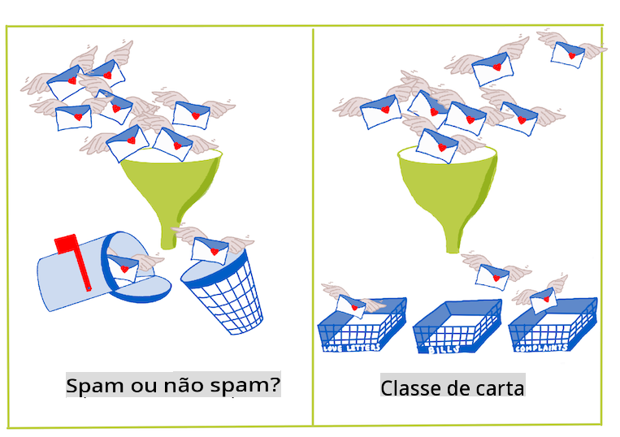
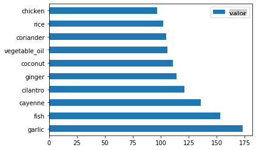
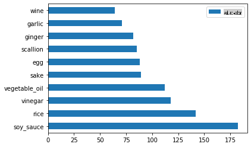
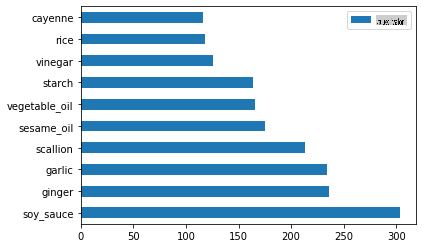
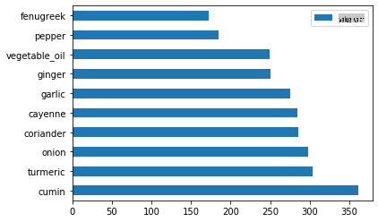
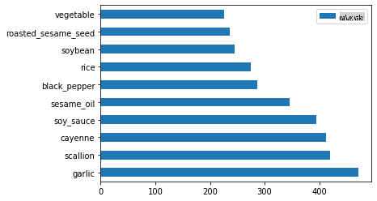

# Introdução à classificação

Nestas quatro lições, você explorará um foco fundamental do aprendizado de máquina clássico - _classificação_. Vamos percorrer o uso de vários algoritmos de classificação com um conjunto de dados sobre todas as brilhantes culinárias da Ásia e da Índia. Espero que você esteja com fome!


> Celebre as culinárias pan-asiáticas nestas lições! Imagem por [Jen Looper](https://twitter.com/jenlooper)

A classificação é uma forma de [aprendizado supervisionado](https://wikipedia.org/wiki/Supervised_learning) que possui muito em comum com técnicas de regressão. Se o aprendizado de máquina se trata de prever valores ou nomes para coisas usando conjuntos de dados, então a classificação geralmente se divide em dois grupos: _classificação binária_ e _classificação multiclasse_.

[](https://youtu.be/eg8DJYwdMyg "Introdução à classificação")

> 🎥 Clique na imagem acima para assistir a um vídeo: John Guttag do MIT apresenta a classificação

Lembre-se:

- **A regressão linear** ajudou você a prever relações entre variáveis e fazer previsões precisas sobre onde um novo ponto de dados se encaixaria em relação a essa linha. Por exemplo, você poderia prever _qual seria o preço de uma abóbora em setembro vs. dezembro_.
- **A regressão logística** ajudou você a descobrir "categorias binárias": neste ponto de preço, _esta abóbora é laranja ou não-laranja_?

A classificação usa vários algoritmos para determinar outras maneiras de identificar o rótulo ou a classe de um ponto de dados. Vamos trabalhar com esses dados de culinária para ver se, ao observar um grupo de ingredientes, conseguimos determinar sua culinária de origem.

## [Quiz pré-aula](https://gray-sand-07a10f403.1.azurestaticapps.net/quiz/19/)

> ### [Esta lição está disponível em R!](../../../../4-Classification/1-Introduction/solution/R/lesson_10.html)

### Introdução

A classificação é uma das atividades fundamentais do pesquisador em aprendizado de máquina e do cientista de dados. Desde a classificação básica de um valor binário ("este e-mail é spam ou não?"), até a classificação e segmentação de imagens complexas usando visão computacional, é sempre útil ser capaz de classificar dados em categorias e fazer perguntas sobre eles.

Para declarar o processo de uma maneira mais científica, seu método de classificação cria um modelo preditivo que permite mapear a relação entre variáveis de entrada e variáveis de saída.



> Problemas binários vs. multiclasse para algoritmos de classificação lidarem. Infográfico por [Jen Looper](https://twitter.com/jenlooper)

Antes de iniciar o processo de limpeza de nossos dados, visualizá-los e prepará-los para nossas tarefas de ML, vamos aprender um pouco sobre as várias maneiras que o aprendizado de máquina pode ser aproveitado para classificar dados.

Derivada de [estatísticas](https://wikipedia.org/wiki/Statistical_classification), a classificação usando aprendizado de máquina clássico utiliza características, como `smoker`, `weight` e `age` para determinar _probabilidade de desenvolver a doença X_. Como uma técnica de aprendizado supervisionado semelhante aos exercícios de regressão que você realizou anteriormente, seus dados são rotulados e os algoritmos de ML usam esses rótulos para classificar e prever classes (ou 'características') de um conjunto de dados e atribuí-los a um grupo ou resultado.

✅ Reserve um momento para imaginar um conjunto de dados sobre culinárias. O que um modelo multiclasse seria capaz de responder? O que um modelo binário seria capaz de responder? E se você quisesse determinar se uma determinada culinária provavelmente usaria feno-grego? E se você quisesse ver se, dado um presente de uma sacola de compras cheia de anis estrelado, alcachofras, couve-flor e raiz-forte, você conseguiria criar um prato indiano típico?

[](https://youtu.be/GuTeDbaNoEU "Cestas de mistério malucas")

> 🎥 Clique na imagem acima para assistir a um vídeo. A premissa do programa 'Chopped' é a 'cesta de mistério', onde os chefs têm que fazer um prato a partir de uma escolha aleatória de ingredientes. Com certeza, um modelo de ML teria ajudado!

## Olá 'classificador'

A pergunta que queremos fazer sobre este conjunto de dados de culinária é na verdade uma **pergunta multiclasse**, pois temos várias culinárias nacionais potenciais para trabalhar. Dada uma quantidade de ingredientes, em qual dessas muitas classes os dados se encaixarão?

O Scikit-learn oferece vários algoritmos diferentes para classificar dados, dependendo do tipo de problema que você deseja resolver. Nas próximas duas lições, você aprenderá sobre vários desses algoritmos.

## Exercício - limpe e equilibre seus dados

A primeira tarefa a ser realizada, antes de iniciar este projeto, é limpar e **equilibrar** seus dados para obter melhores resultados. Comece com o arquivo em branco _notebook.ipynb_ na raiz desta pasta.

A primeira coisa a instalar é o [imblearn](https://imbalanced-learn.org/stable/). Este é um pacote do Scikit-learn que permitirá que você equilibre melhor os dados (você aprenderá mais sobre essa tarefa em um minuto).

1. Para instalar `imblearn`, execute `pip install`, assim:

    ```python
    pip install imblearn
    ```

1. Importe os pacotes que você precisa para importar seus dados e visualizá-los, também importe `SMOTE` de `imblearn`.

    ```python
    import pandas as pd
    import matplotlib.pyplot as plt
    import matplotlib as mpl
    import numpy as np
    from imblearn.over_sampling import SMOTE
    ```

    Agora você está preparado para ler e importar os dados a seguir.

1. A próxima tarefa será importar os dados:

    ```python
    df  = pd.read_csv('../data/cuisines.csv')
    ```

   Usando `read_csv()` will read the content of the csv file _cusines.csv_ and place it in the variable `df`.

1. Verifique a forma dos dados:

    ```python
    df.head()
    ```

   As primeiras cinco linhas parecem assim:

    ```output
    |     | Unnamed: 0 | cuisine | almond | angelica | anise | anise_seed | apple | apple_brandy | apricot | armagnac | ... | whiskey | white_bread | white_wine | whole_grain_wheat_flour | wine | wood | yam | yeast | yogurt | zucchini |
    | --- | ---------- | ------- | ------ | -------- | ----- | ---------- | ----- | ------------ | ------- | -------- | --- | ------- | ----------- | ---------- | ----------------------- | ---- | ---- | --- | ----- | ------ | -------- |
    | 0   | 65         | indian  | 0      | 0        | 0     | 0          | 0     | 0            | 0       | 0        | ... | 0       | 0           | 0          | 0                       | 0    | 0    | 0   | 0     | 0      | 0        |
    | 1   | 66         | indian  | 1      | 0        | 0     | 0          | 0     | 0            | 0       | 0        | ... | 0       | 0           | 0          | 0                       | 0    | 0    | 0   | 0     | 0      | 0        |
    | 2   | 67         | indian  | 0      | 0        | 0     | 0          | 0     | 0            | 0       | 0        | ... | 0       | 0           | 0          | 0                       | 0    | 0    | 0   | 0     | 0      | 0        |
    | 3   | 68         | indian  | 0      | 0        | 0     | 0          | 0     | 0            | 0       | 0        | ... | 0       | 0           | 0          | 0                       | 0    | 0    | 0   | 0     | 0      | 0        |
    | 4   | 69         | indian  | 0      | 0        | 0     | 0          | 0     | 0            | 0       | 0        | ... | 0       | 0           | 0          | 0                       | 0    | 0    | 0   | 0     | 1      | 0        |
    ```

1. Obtenha informações sobre esses dados chamando `info()`:

    ```python
    df.info()
    ```

    Sua saída se parece com:

    ```output
    <class 'pandas.core.frame.DataFrame'>
    RangeIndex: 2448 entries, 0 to 2447
    Columns: 385 entries, Unnamed: 0 to zucchini
    dtypes: int64(384), object(1)
    memory usage: 7.2+ MB
    ```

## Exercício - aprendendo sobre culinárias

Agora o trabalho começa a se tornar mais interessante. Vamos descobrir a distribuição dos dados, por culinária 

1. Plote os dados como barras chamando `barh()`:

    ```python
    df.cuisine.value_counts().plot.barh()
    ```

    

    Há um número finito de culinárias, mas a distribuição dos dados é desigual. Você pode corrigir isso! Antes de fazê-lo, explore um pouco mais. 

1. Descubra quanto de dados está disponível por culinária e imprima:

    ```python
    thai_df = df[(df.cuisine == "thai")]
    japanese_df = df[(df.cuisine == "japanese")]
    chinese_df = df[(df.cuisine == "chinese")]
    indian_df = df[(df.cuisine == "indian")]
    korean_df = df[(df.cuisine == "korean")]
    
    print(f'thai df: {thai_df.shape}')
    print(f'japanese df: {japanese_df.shape}')
    print(f'chinese df: {chinese_df.shape}')
    print(f'indian df: {indian_df.shape}')
    print(f'korean df: {korean_df.shape}')
    ```

    a saída se parece com:

    ```output
    thai df: (289, 385)
    japanese df: (320, 385)
    chinese df: (442, 385)
    indian df: (598, 385)
    korean df: (799, 385)
    ```

## Descobrindo ingredientes

Agora você pode se aprofundar nos dados e aprender quais são os ingredientes típicos por culinária. Você deve eliminar dados recorrentes que criam confusão entre as culinárias, então vamos aprender sobre esse problema.

1. Crie uma função `create_ingredient()` em Python para criar um dataframe de ingredientes. Esta função começará removendo uma coluna não útil e classificará os ingredientes por sua contagem:

    ```python
    def create_ingredient_df(df):
        ingredient_df = df.T.drop(['cuisine','Unnamed: 0']).sum(axis=1).to_frame('value')
        ingredient_df = ingredient_df[(ingredient_df.T != 0).any()]
        ingredient_df = ingredient_df.sort_values(by='value', ascending=False,
        inplace=False)
        return ingredient_df
    ```

   Agora você pode usar essa função para ter uma ideia dos dez ingredientes mais populares por culinária.

1. Chame `create_ingredient()` and plot it calling `barh()`:

    ```python
    thai_ingredient_df = create_ingredient_df(thai_df)
    thai_ingredient_df.head(10).plot.barh()
    ```

    

1. Faça o mesmo para os dados japoneses:

    ```python
    japanese_ingredient_df = create_ingredient_df(japanese_df)
    japanese_ingredient_df.head(10).plot.barh()
    ```

    

1. Agora para os ingredientes chineses:

    ```python
    chinese_ingredient_df = create_ingredient_df(chinese_df)
    chinese_ingredient_df.head(10).plot.barh()
    ```

    

1. Plote os ingredientes indianos:

    ```python
    indian_ingredient_df = create_ingredient_df(indian_df)
    indian_ingredient_df.head(10).plot.barh()
    ```

    

1. Finalmente, plote os ingredientes coreanos:

    ```python
    korean_ingredient_df = create_ingredient_df(korean_df)
    korean_ingredient_df.head(10).plot.barh()
    ```

    

1. Agora, elimine os ingredientes mais comuns que criam confusão entre culinárias distintas, chamando `drop()`: 

   Todos adoram arroz, alho e gengibre!

    ```python
    feature_df= df.drop(['cuisine','Unnamed: 0','rice','garlic','ginger'], axis=1)
    labels_df = df.cuisine #.unique()
    feature_df.head()
    ```

## Equilibrar o conjunto de dados

Agora que você limpou os dados, use [SMOTE](https://imbalanced-learn.org/dev/references/generated/imblearn.over_sampling.SMOTE.html) - "Técnica de Sobreamostragem Sintética de Minorias" - para equilibrá-los.

1. Chame `fit_resample()`, essa estratégia gera novas amostras por interpolação.

    ```python
    oversample = SMOTE()
    transformed_feature_df, transformed_label_df = oversample.fit_resample(feature_df, labels_df)
    ```

    Ao equilibrar seus dados, você terá melhores resultados ao classificá-los. Pense em uma classificação binária. Se a maior parte dos seus dados pertence a uma classe, um modelo de ML irá prever essa classe com mais frequência, apenas porque há mais dados para isso. Equilibrar os dados remove qualquer viés e ajuda a eliminar esse desequilíbrio. 

1. Agora você pode verificar o número de rótulos por ingrediente:

    ```python
    print(f'new label count: {transformed_label_df.value_counts()}')
    print(f'old label count: {df.cuisine.value_counts()}')
    ```

    Sua saída se parece com:

    ```output
    new label count: korean      799
    chinese     799
    indian      799
    japanese    799
    thai        799
    Name: cuisine, dtype: int64
    old label count: korean      799
    indian      598
    chinese     442
    japanese    320
    thai        289
    Name: cuisine, dtype: int64
    ```

    Os dados estão limpos, equilibrados e muito deliciosos! 

1. O último passo é salvar seus dados equilibrados, incluindo rótulos e características, em um novo dataframe que pode ser exportado para um arquivo:

    ```python
    transformed_df = pd.concat([transformed_label_df,transformed_feature_df],axis=1, join='outer')
    ```

1. Você pode dar mais uma olhada nos dados usando `transformed_df.head()` and `transformed_df.info()`. Salve uma cópia desses dados para uso em lições futuras:

    ```python
    transformed_df.head()
    transformed_df.info()
    transformed_df.to_csv("../data/cleaned_cuisines.csv")
    ```

    Este novo CSV agora pode ser encontrado na pasta de dados raiz.

---

## 🚀Desafio

Este currículo contém vários conjuntos de dados interessantes. Explore as pastas `data` e veja se alguma contém conjuntos de dados que seriam apropriados para classificação binária ou multiclasse? Que perguntas você faria sobre este conjunto de dados?

## [Quiz pós-aula](https://gray-sand-07a10f403.1.azurestaticapps.net/quiz/20/)

## Revisão & Autoestudo

Explore a API do SMOTE. Para quais casos de uso ela é mais adequada? Que problemas ela resolve?

## Tarefa 

[Explore métodos de classificação](assignment.md)

**Aviso Legal**:  
Este documento foi traduzido utilizando serviços de tradução automática baseados em IA. Embora nos esforcemos para garantir a precisão, esteja ciente de que traduções automatizadas podem conter erros ou imprecisões. O documento original em seu idioma nativo deve ser considerado a fonte autorizada. Para informações críticas, recomenda-se a tradução profissional por um humano. Não nos responsabilizamos por quaisquer mal-entendidos ou interpretações errôneas decorrentes do uso desta tradução.