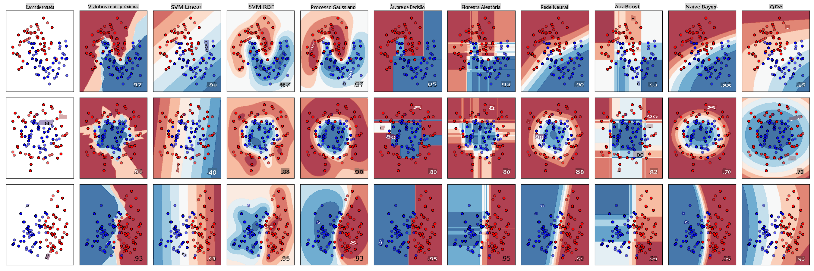
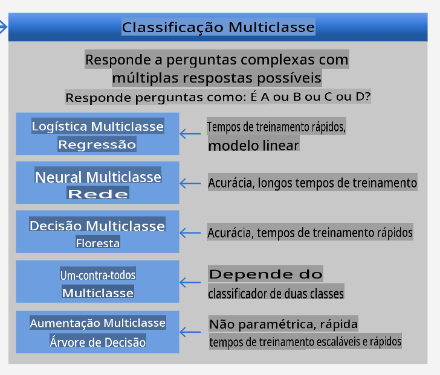
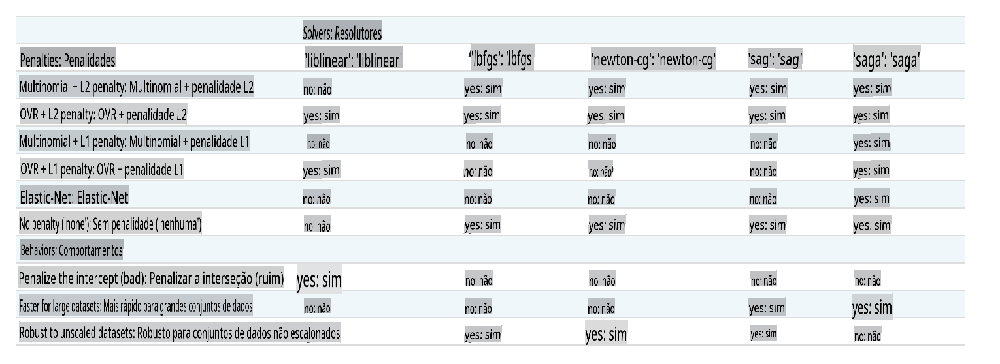

# Classificadores de culinária 1

Nesta lição, você usará o conjunto de dados que salvou na última lição, repleto de dados equilibrados e limpos sobre culinárias.

Você utilizará esse conjunto de dados com uma variedade de classificadores para _prever uma determinada culinária nacional com base em um grupo de ingredientes_. Enquanto faz isso, você aprenderá mais sobre algumas das maneiras que os algoritmos podem ser aproveitados para tarefas de classificação.

## [Quiz pré-aula](https://gray-sand-07a10f403.1.azurestaticapps.net/quiz/21/)
# Preparação

Assumindo que você completou a [Lição 1](../1-Introduction/README.md), certifique-se de que um arquivo _cleaned_cuisines.csv_ exista na pasta raiz `/data` para essas quatro lições.

## Exercício - prever uma culinária nacional

1. Trabalhando na pasta _notebook.ipynb_ desta lição, importe esse arquivo juntamente com a biblioteca Pandas:

    ```python
    import pandas as pd
    cuisines_df = pd.read_csv("../data/cleaned_cuisines.csv")
    cuisines_df.head()
    ```

    Os dados se parecem com isto:

|     | Unnamed: 0 | cuisine | almond | angelica | anise | anise_seed | apple | apple_brandy | apricot | armagnac | ... | whiskey | white_bread | white_wine | whole_grain_wheat_flour | wine | wood | yam | yeast | yogurt | zucchini |
| --- | ---------- | ------- | ------ | -------- | ----- | ---------- | ----- | ------------ | ------- | -------- | --- | ------- | ----------- | ---------- | ----------------------- | ---- | ---- | --- | ----- | ------ | -------- |
| 0   | 0          | indiana | 0      | 0        | 0     | 0          | 0     | 0            | 0       | 0        | ... | 0       | 0           | 0          | 0                       | 0    | 0    | 0   | 0     | 0      | 0        |
| 1   | 1          | indiana | 1      | 0        | 0     | 0          | 0     | 0            | 0       | 0        | ... | 0       | 0           | 0          | 0                       | 0    | 0    | 0   | 0     | 0      | 0        |
| 2   | 2          | indiana | 0      | 0        | 0     | 0          | 0     | 0            | 0       | 0        | ... | 0       | 0           | 0          | 0                       | 0    | 0    | 0   | 0     | 0      | 0        |
| 3   | 3          | indiana | 0      | 0        | 0     | 0          | 0     | 0            | 0       | 0        | ... | 0       | 0           | 0          | 0                       | 0    | 0    | 0   | 0     | 0      | 0        |
| 4   | 4          | indiana | 0      | 0        | 0     | 0          | 0     | 0            | 0       | 0        | ... | 0       | 0           | 0          | 0                       | 0    | 0    | 0   | 0     | 1      | 0        |
  

1. Agora, importe várias outras bibliotecas:

    ```python
    from sklearn.linear_model import LogisticRegression
    from sklearn.model_selection import train_test_split, cross_val_score
    from sklearn.metrics import accuracy_score,precision_score,confusion_matrix,classification_report, precision_recall_curve
    from sklearn.svm import SVC
    import numpy as np
    ```

1. Divida as coordenadas X e y em dois dataframes para treinamento. `cuisine` pode ser o dataframe de rótulos:

    ```python
    cuisines_label_df = cuisines_df['cuisine']
    cuisines_label_df.head()
    ```

    Ele se parecerá com isto:

    ```output
    0    indian
    1    indian
    2    indian
    3    indian
    4    indian
    Name: cuisine, dtype: object
    ```

1. Remova `Unnamed: 0` column and the `cuisine` column, calling `drop()`. Salve o restante dos dados como características treináveis:

    ```python
    cuisines_feature_df = cuisines_df.drop(['Unnamed: 0', 'cuisine'], axis=1)
    cuisines_feature_df.head()
    ```

    Suas características se parecem com isto:

|      | almond | angelica | anise | anise_seed | apple | apple_brandy | apricot | armagnac | artemisia | artichoke |  ... | whiskey | white_bread | white_wine | whole_grain_wheat_flour | wine | wood |  yam | yeast | yogurt | zucchini |
| ---: | -----: | -------: | ----: | ---------: | ----: | -----------: | ------: | -------: | --------: | --------: | ---: | ------: | ----------: | ---------: | ----------------------: | ---: | ---: | ---: | ----: | -----: | -------: |
|    0 |      0 |        0 |     0 |          0 |     0 |            0 |       0 |        0 |         0 |         0 |  ... |       0 |           0 |          0 |                       0 |    0 |    0 |    0 |     0 |      0 |        0 | 0 |
|    1 |      1 |        0 |     0 |          0 |     0 |            0 |       0 |        0 |         0 |         0 |  ... |       0 |           0 |          0 |                       0 |    0 |    0 |    0 |     0 |      0 |        0 | 0 |
|    2 |      0 |        0 |     0 |          0 |     0 |            0 |       0 |        0 |         0 |         0 |  ... |       0 |           0 |          0 |                       0 |    0 |    0 |    0 |     0 |      0 |        0 | 0 |
|    3 |      0 |        0 |     0 |          0 |     0 |            0 |       0 |        0 |         0 |         0 |  ... |       0 |           0 |          0 |                       0 |    0 |    0 |    0 |     0 |      0 |        0 | 0 |
|    4 |      0 |        0 |     0 |          0 |     0 |            0 |       0 |        0 |         0 |         0 |  ... |       0 |           0 |          0 |                       0 |    0 |    0 |    0 |     0 |      1 |        0 | 0 |

Agora você está pronto para treinar seu modelo!

## Escolhendo seu classificador

Agora que seus dados estão limpos e prontos para treinamento, você precisa decidir qual algoritmo usar para o trabalho. 

O Scikit-learn agrupa a classificação sob Aprendizado Supervisionado, e nessa categoria você encontrará muitas maneiras de classificar. [A variedade](https://scikit-learn.org/stable/supervised_learning.html) é bastante impressionante à primeira vista. Os seguintes métodos incluem técnicas de classificação:

- Modelos Lineares
- Máquinas de Vetores de Suporte
- Gradiente Estocástico
- Vizinhos Mais Próximos
- Processos Gaussianos
- Árvores de Decisão
- Métodos de Conjunto (Classificador de Votação)
- Algoritmos Multiclasse e Multi-saída (classificação multiclasse e multilabel, classificação multiclasse-multi-saída)

> Você também pode usar [redes neurais para classificar dados](https://scikit-learn.org/stable/modules/neural_networks_supervised.html#classification), mas isso está fora do escopo desta lição.

### Qual classificador escolher?

Então, qual classificador você deve escolher? Muitas vezes, passar por vários e buscar um bom resultado é uma maneira de testar. O Scikit-learn oferece uma [comparação lado a lado](https://scikit-learn.org/stable/auto_examples/classification/plot_classifier_comparison.html) em um conjunto de dados criado, comparando KNeighbors, SVC de duas maneiras, GaussianProcessClassifier, DecisionTreeClassifier, RandomForestClassifier, MLPClassifier, AdaBoostClassifier, GaussianNB e QuadraticDiscriminantAnalysis, mostrando os resultados visualizados: 


> Gráficos gerados na documentação do Scikit-learn

> O AutoML resolve esse problema de forma elegante executando essas comparações na nuvem, permitindo que você escolha o melhor algoritmo para seus dados. Experimente [aqui](https://docs.microsoft.com/learn/modules/automate-model-selection-with-azure-automl/?WT.mc_id=academic-77952-leestott)

### Uma abordagem melhor

Uma maneira melhor do que adivinhar aleatoriamente, no entanto, é seguir as ideias neste [ML Cheat sheet](https://docs.microsoft.com/azure/machine-learning/algorithm-cheat-sheet?WT.mc_id=academic-77952-leestott) que pode ser baixada. Aqui, descobrimos que, para o nosso problema multiclasse, temos algumas opções:


> Uma seção da Folha de Dicas de Algoritmos da Microsoft, detalhando opções de classificação multiclasse

✅ Baixe esta folha de dicas, imprima e coloque na sua parede!

### Raciocínio

Vamos ver se conseguimos raciocinar sobre diferentes abordagens dadas as restrições que temos:

- **Redes neurais são muito pesadas**. Dado nosso conjunto de dados limpo, mas mínimo, e o fato de que estamos realizando o treinamento localmente via notebooks, redes neurais são muito pesadas para esta tarefa.
- **Nenhum classificador de duas classes**. Não usamos um classificador de duas classes, então isso elimina um contra todos. 
- **Árvore de decisão ou regressão logística podem funcionar**. Uma árvore de decisão pode funcionar, ou regressão logística para dados multiclasse. 
- **Árvores de Decisão Aumentadas Multiclasse resolvem um problema diferente**. A árvore de decisão aumentada multiclasse é mais adequada para tarefas não paramétricas, por exemplo, tarefas projetadas para construir classificações, então não é útil para nós.

### Usando Scikit-learn 

Usaremos o Scikit-learn para analisar nossos dados. No entanto, existem muitas maneiras de usar a regressão logística no Scikit-learn. Dê uma olhada nos [parâmetros a serem passados](https://scikit-learn.org/stable/modules/generated/sklearn.linear_model.LogisticRegression.html?highlight=logistic%20regressio#sklearn.linear_model.LogisticRegression).  

Essencialmente, há dois parâmetros importantes - `multi_class` and `solver` - that we need to specify, when we ask Scikit-learn to perform a logistic regression. The `multi_class` value applies a certain behavior. The value of the solver is what algorithm to use. Not all solvers can be paired with all `multi_class` values.

According to the docs, in the multiclass case, the training algorithm:

- **Uses the one-vs-rest (OvR) scheme**, if the `multi_class` option is set to `ovr`
- **Uses the cross-entropy loss**, if the `multi_class` option is set to `multinomial`. (Currently the `multinomial` option is supported only by the ‘lbfgs’, ‘sag’, ‘saga’ and ‘newton-cg’ solvers.)"

> 🎓 The 'scheme' here can either be 'ovr' (one-vs-rest) or 'multinomial'. Since logistic regression is really designed to support binary classification, these schemes allow it to better handle multiclass classification tasks. [source](https://machinelearningmastery.com/one-vs-rest-and-one-vs-one-for-multi-class-classification/)

> 🎓 The 'solver' is defined as "the algorithm to use in the optimization problem". [source](https://scikit-learn.org/stable/modules/generated/sklearn.linear_model.LogisticRegression.html?highlight=logistic%20regressio#sklearn.linear_model.LogisticRegression).

Scikit-learn offers this table to explain how solvers handle different challenges presented by different kinds of data structures:



## Exercise - split the data

We can focus on logistic regression for our first training trial since you recently learned about the latter in a previous lesson.
Split your data into training and testing groups by calling `train_test_split()`:

```python
X_train, X_test, y_train, y_test = train_test_split(cuisines_feature_df, cuisines_label_df, test_size=0.3)
```

## Exercício - aplicar regressão logística

Como você está usando o caso multiclasse, precisa escolher qual _esquema_ usar e qual _solver_ definir. Use LogisticRegression com uma configuração multiclasse e o **liblinear** solver para treinar.

1. Crie uma regressão logística com multi_class definido como `ovr` and the solver set to `liblinear`:

    ```python
    lr = LogisticRegression(multi_class='ovr',solver='liblinear')
    model = lr.fit(X_train, np.ravel(y_train))
    
    accuracy = model.score(X_test, y_test)
    print ("Accuracy is {}".format(accuracy))
    ```

    ✅ Tente um solver diferente como `lbfgs`, which is often set as default

    > Note, use Pandas [`ravel`](https://pandas.pydata.org/pandas-docs/stable/reference/api/pandas.Series.ravel.html) para achatar seus dados quando necessário.

    A precisão é boa, acima de **80%**!

1. Você pode ver este modelo em ação testando uma linha de dados (#50):

    ```python
    print(f'ingredients: {X_test.iloc[50][X_test.iloc[50]!=0].keys()}')
    print(f'cuisine: {y_test.iloc[50]}')
    ```

    O resultado é impresso:

   ```output
   ingredients: Index(['cilantro', 'onion', 'pea', 'potato', 'tomato', 'vegetable_oil'], dtype='object')
   cuisine: indian
   ```

   ✅ Tente um número de linha diferente e verifique os resultados

1. Aprofundando, você pode verificar a precisão desta previsão:

    ```python
    test= X_test.iloc[50].values.reshape(-1, 1).T
    proba = model.predict_proba(test)
    classes = model.classes_
    resultdf = pd.DataFrame(data=proba, columns=classes)
    
    topPrediction = resultdf.T.sort_values(by=[0], ascending = [False])
    topPrediction.head()
    ```

    O resultado é impresso - a culinária indiana é a melhor aposta, com boa probabilidade:

    |          |        0 |
    | -------: | -------: |
    |   indiana | 0.715851 |
    |  chinesa | 0.229475 |
    | japonesa | 0.029763 |
    |   coreana | 0.017277 |
    |     tailandesa | 0.007634 |

    ✅ Você consegue explicar por que o modelo está bastante certo de que esta é uma culinária indiana?

1. Obtenha mais detalhes imprimindo um relatório de classificação, como você fez nas lições de regressão:

    ```python
    y_pred = model.predict(X_test)
    print(classification_report(y_test,y_pred))
    ```

    |              | precisão | recall | f1-score | suporte |
    | ------------ | --------- | ------ | -------- | ------- |
    | chinesa      | 0.73      | 0.71   | 0.72     | 229     |
    | indiana       | 0.91      | 0.93   | 0.92     | 254     |
    | japonesa     | 0.70      | 0.75   | 0.72     | 220     |
    | coreana       | 0.86      | 0.76   | 0.81     | 242     |
    | tailandesa         | 0.79      | 0.85   | 0.82     | 254     |
    | precisão     | 0.80      | 1199   |          |         |
    | média macro    | 0.80      | 0.80   | 0.80     | 1199    |
    | média ponderada | 0.80      | 0.80   | 0.80     | 1199    |

## 🚀Desafio

Nesta lição, você usou seus dados limpos para construir um modelo de aprendizado de máquina que pode prever uma culinária nacional com base em uma série de ingredientes. Reserve um tempo para ler sobre as muitas opções que o Scikit-learn oferece para classificar dados. Aprofunde-se no conceito de 'solver' para entender o que acontece nos bastidores.

## [Quiz pós-aula](https://gray-sand-07a10f403.1.azurestaticapps.net/quiz/22/)

## Revisão e Autoestudo

Aprofunde-se um pouco mais na matemática por trás da regressão logística nesta [lição](https://people.eecs.berkeley.edu/~russell/classes/cs194/f11/lectures/CS194%20Fall%202011%20Lecture%2006.pdf)
## Tarefa 

[Estude os solvers](assignment.md)

**Isenção de responsabilidade**:  
Este documento foi traduzido usando serviços de tradução automática baseados em IA. Embora nos esforcemos pela precisão, esteja ciente de que traduções automatizadas podem conter erros ou imprecisões. O documento original em seu idioma nativo deve ser considerado a fonte autoritária. Para informações críticas, recomenda-se a tradução profissional feita por humanos. Não nos responsabilizamos por quaisquer mal-entendidos ou interpretações errôneas decorrentes do uso desta tradução.