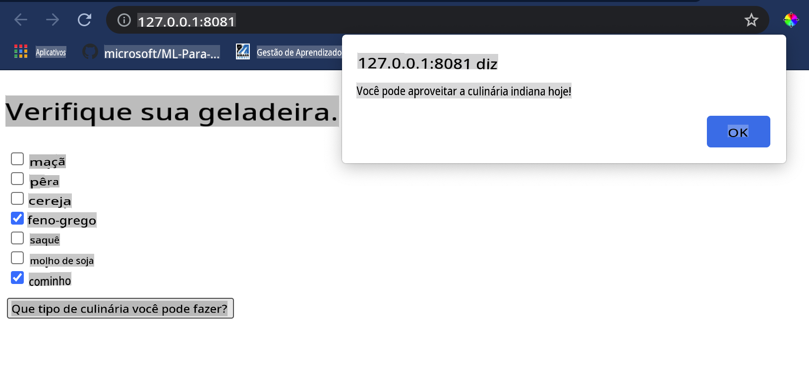

# Construa um Aplicativo Web de Recomendação de Culinária

Nesta lição, você irá construir um modelo de classificação usando algumas das técnicas que aprendeu em lições anteriores e com o delicioso conjunto de dados de culinária utilizado ao longo desta série. Além disso, você irá criar um pequeno aplicativo web para usar um modelo salvo, aproveitando o runtime web do Onnx.

Uma das aplicações práticas mais úteis do aprendizado de máquina é a construção de sistemas de recomendação, e você pode dar o primeiro passo nessa direção hoje!

[](https://youtu.be/17wdM9AHMfg "ML Aplicado")

> 🎥 Clique na imagem acima para assistir a um vídeo: Jen Looper constrói um aplicativo web usando dados de culinária classificados

## [Quiz pré-aula](https://gray-sand-07a10f403.1.azurestaticapps.net/quiz/25/)

Nesta lição, você aprenderá:

- Como construir um modelo e salvá-lo como um modelo Onnx
- Como usar o Netron para inspecionar o modelo
- Como usar seu modelo em um aplicativo web para inferência

## Construa seu modelo

Construir sistemas de ML aplicados é uma parte importante de como aproveitar essas tecnologias para seus sistemas empresariais. Você pode usar modelos dentro de suas aplicações web (e, assim, usá-los em um contexto offline, se necessário) utilizando o Onnx.

Em uma [lição anterior](../../3-Web-App/1-Web-App/README.md), você construiu um modelo de Regressão sobre avistamentos de OVNIs, "congelou" ele e o utilizou em um aplicativo Flask. Embora essa arquitetura seja muito útil de se conhecer, trata-se de um aplicativo Python full-stack, e suas necessidades podem incluir o uso de uma aplicação JavaScript.

Nesta lição, você pode construir um sistema básico baseado em JavaScript para inferência. Primeiro, no entanto, você precisa treinar um modelo e convertê-lo para uso com o Onnx.

## Exercício - treinar modelo de classificação

Primeiro, treine um modelo de classificação usando o conjunto de dados de culinárias limpo que utilizamos.

1. Comece importando bibliotecas úteis:

    ```python
    !pip install skl2onnx
    import pandas as pd 
    ```

    Você precisa de '[skl2onnx](https://onnx.ai/sklearn-onnx/)' para ajudar a converter seu modelo Scikit-learn para o formato Onnx.

1. Em seguida, trabalhe com seus dados da mesma forma que fez em lições anteriores, lendo um arquivo CSV usando `read_csv()`:

    ```python
    data = pd.read_csv('../data/cleaned_cuisines.csv')
    data.head()
    ```

1. Remova as duas primeiras colunas desnecessárias e salve os dados restantes como 'X':

    ```python
    X = data.iloc[:,2:]
    X.head()
    ```

1. Salve os rótulos como 'y':

    ```python
    y = data[['cuisine']]
    y.head()
    
    ```

### Inicie a rotina de treinamento

Usaremos a biblioteca 'SVC', que possui boa precisão.

1. Importe as bibliotecas apropriadas do Scikit-learn:

    ```python
    from sklearn.model_selection import train_test_split
    from sklearn.svm import SVC
    from sklearn.model_selection import cross_val_score
    from sklearn.metrics import accuracy_score,precision_score,confusion_matrix,classification_report
    ```

1. Separe os conjuntos de treinamento e teste:

    ```python
    X_train, X_test, y_train, y_test = train_test_split(X,y,test_size=0.3)
    ```

1. Construa um modelo de Classificação SVC como fez na lição anterior:

    ```python
    model = SVC(kernel='linear', C=10, probability=True,random_state=0)
    model.fit(X_train,y_train.values.ravel())
    ```

1. Agora, teste seu modelo, chamando `predict()`:

    ```python
    y_pred = model.predict(X_test)
    ```

1. Imprima um relatório de classificação para verificar a qualidade do modelo:

    ```python
    print(classification_report(y_test,y_pred))
    ```

    Como vimos antes, a precisão é boa:

    ```output
                    precision    recall  f1-score   support
    
         chinese       0.72      0.69      0.70       257
          indian       0.91      0.87      0.89       243
        japanese       0.79      0.77      0.78       239
          korean       0.83      0.79      0.81       236
            thai       0.72      0.84      0.78       224
    
        accuracy                           0.79      1199
       macro avg       0.79      0.79      0.79      1199
    weighted avg       0.79      0.79      0.79      1199
    ```

### Converta seu modelo para Onnx

Certifique-se de fazer a conversão com o número de Tensor apropriado. Este conjunto de dados tem 380 ingredientes listados, então você precisa anotar esse número em `FloatTensorType`:

1. Converta usando um número de tensor de 380.

    ```python
    from skl2onnx import convert_sklearn
    from skl2onnx.common.data_types import FloatTensorType
    
    initial_type = [('float_input', FloatTensorType([None, 380]))]
    options = {id(model): {'nocl': True, 'zipmap': False}}
    ```

1. Crie o onx e armazene como um arquivo **model.onnx**:

    ```python
    onx = convert_sklearn(model, initial_types=initial_type, options=options)
    with open("./model.onnx", "wb") as f:
        f.write(onx.SerializeToString())
    ```

    > Nota: você pode passar [opções](https://onnx.ai/sklearn-onnx/parameterized.html) em seu script de conversão. Neste caso, passamos 'nocl' como True e 'zipmap' como False. Como este é um modelo de classificação, você tem a opção de remover o ZipMap, que produz uma lista de dicionários (não é necessário). `nocl` refers to class information being included in the model. Reduce your model's size by setting `nocl` to 'True'. 

Running the entire notebook will now build an Onnx model and save it to this folder.

## View your model

Onnx models are not very visible in Visual Studio code, but there's a very good free software that many researchers use to visualize the model to ensure that it is properly built. Download [Netron](https://github.com/lutzroeder/Netron) and  open your model.onnx file. You can see your simple model visualized, with its 380 inputs and classifier listed:


Netron is a helpful tool to view your models.

Now you are ready to use this neat model in a web app. Let's build an app that will come in handy when you look in your refrigerator and try to figure out which combination of your leftover ingredients you can use to cook a given cuisine, as determined by your model.

## Build a recommender web application

You can use your model directly in a web app. This architecture also allows you to run it locally and even offline if needed. Start by creating an `index.html` file in the same folder where you stored your `model.onnx` arquivo.

1. Neste arquivo _index.html_, adicione a seguinte marcação:

    ```html
    <!DOCTYPE html>
    <html>
        <header>
            <title>Cuisine Matcher</title>
        </header>
        <body>
            ...
        </body>
    </html>
    ```

1. Agora, trabalhando dentro das tags `body`, adicione um pouco de marcação para mostrar uma lista de caixas de seleção refletindo alguns ingredientes:

    ```html
    <h1>Check your refrigerator. What can you create?</h1>
            <div id="wrapper">
                <div class="boxCont">
                    <input type="checkbox" value="4" class="checkbox">
                    <label>apple</label>
                </div>
            
                <div class="boxCont">
                    <input type="checkbox" value="247" class="checkbox">
                    <label>pear</label>
                </div>
            
                <div class="boxCont">
                    <input type="checkbox" value="77" class="checkbox">
                    <label>cherry</label>
                </div>
    
                <div class="boxCont">
                    <input type="checkbox" value="126" class="checkbox">
                    <label>fenugreek</label>
                </div>
    
                <div class="boxCont">
                    <input type="checkbox" value="302" class="checkbox">
                    <label>sake</label>
                </div>
    
                <div class="boxCont">
                    <input type="checkbox" value="327" class="checkbox">
                    <label>soy sauce</label>
                </div>
    
                <div class="boxCont">
                    <input type="checkbox" value="112" class="checkbox">
                    <label>cumin</label>
                </div>
            </div>
            <div style="padding-top:10px">
                <button onClick="startInference()">What kind of cuisine can you make?</button>
            </div> 
    ```

    Note que cada caixa de seleção recebe um valor. Isso reflete o índice onde o ingrediente é encontrado de acordo com o conjunto de dados. Maçã, por exemplo, nesta lista alfabética, ocupa a quinta coluna, então seu valor é '4', já que começamos a contar a partir de 0. Você pode consultar a [planilha de ingredientes](../../../../4-Classification/data/ingredient_indexes.csv) para descobrir o índice de um dado ingrediente.

    Continuando seu trabalho no arquivo index.html, adicione um bloco de script onde o modelo é chamado após o fechamento final `</div>`.

1. Primeiro, importe o [Onnx Runtime](https://www.onnxruntime.ai/):

    ```html
    <script src="https://cdn.jsdelivr.net/npm/onnxruntime-web@1.9.0/dist/ort.min.js"></script> 
    ```

    > O Onnx Runtime é utilizado para permitir a execução de seus modelos Onnx em uma ampla gama de plataformas de hardware, incluindo otimizações e uma API para uso.

1. Uma vez que o Runtime esteja no lugar, você pode chamá-lo:

    ```html
    <script>
        const ingredients = Array(380).fill(0);
        
        const checks = [...document.querySelectorAll('.checkbox')];
        
        checks.forEach(check => {
            check.addEventListener('change', function() {
                // toggle the state of the ingredient
                // based on the checkbox's value (1 or 0)
                ingredients[check.value] = check.checked ? 1 : 0;
            });
        });

        function testCheckboxes() {
            // validate if at least one checkbox is checked
            return checks.some(check => check.checked);
        }

        async function startInference() {

            let atLeastOneChecked = testCheckboxes()

            if (!atLeastOneChecked) {
                alert('Please select at least one ingredient.');
                return;
            }
            try {
                // create a new session and load the model.
                
                const session = await ort.InferenceSession.create('./model.onnx');

                const input = new ort.Tensor(new Float32Array(ingredients), [1, 380]);
                const feeds = { float_input: input };

                // feed inputs and run
                const results = await session.run(feeds);

                // read from results
                alert('You can enjoy ' + results.label.data[0] + ' cuisine today!')

            } catch (e) {
                console.log(`failed to inference ONNX model`);
                console.error(e);
            }
        }
               
    </script>
    ```

Neste código, várias coisas estão acontecendo:

1. Você criou um array de 380 possíveis valores (1 ou 0) a serem definidos e enviados ao modelo para inferência, dependendo de se uma caixa de seleção de ingrediente está marcada.
2. Você criou um array de caixas de seleção e uma forma de determinar se elas estavam marcadas em um `init` function that is called when the application starts. When a checkbox is checked, the `ingredients` array is altered to reflect the chosen ingredient.
3. You created a `testCheckboxes` function that checks whether any checkbox was checked.
4. You use `startInference` function when the button is pressed and, if any checkbox is checked, you start inference.
5. The inference routine includes:
   1. Setting up an asynchronous load of the model
   2. Creating a Tensor structure to send to the model
   3. Creating 'feeds' that reflects the `float_input` input that you created when training your model (you can use Netron to verify that name)
   4. Sending these 'feeds' to the model and waiting for a response

## Test your application

Open a terminal session in Visual Studio Code in the folder where your index.html file resides. Ensure that you have [http-server](https://www.npmjs.com/package/http-server) installed globally, and type `http-server` no prompt. Um localhost deve abrir e você pode visualizar seu aplicativo web. Verifique qual culinária é recomendada com base em vários ingredientes:



Parabéns, você criou um aplicativo web de 'recomendação' com alguns campos. Reserve um tempo para desenvolver este sistema!
## 🚀Desafio

Seu aplicativo web é muito minimalista, então continue a desenvolvê-lo usando ingredientes e seus índices do dado [ingredient_indexes](../../../../4-Classification/data/ingredient_indexes.csv). Quais combinações de sabores funcionam para criar um determinado prato nacional?

## [Quiz pós-aula](https://gray-sand-07a10f403.1.azurestaticapps.net/quiz/26/)

## Revisão & Autoestudo

Embora esta lição tenha abordado apenas a utilidade de criar um sistema de recomendação para ingredientes alimentares, esta área de aplicações de ML é muito rica em exemplos. Leia mais sobre como esses sistemas são construídos:

- https://www.sciencedirect.com/topics/computer-science/recommendation-engine
- https://www.technologyreview.com/2014/08/25/171547/the-ultimate-challenge-for-recommendation-engines/
- https://www.technologyreview.com/2015/03/23/168831/everything-is-a-recommendation/

## Tarefa 

[Construa um novo recomendador](assignment.md)

**Isenção de responsabilidade**:  
Este documento foi traduzido utilizando serviços de tradução automática baseados em IA. Embora nos esforcemos pela precisão, esteja ciente de que traduções automatizadas podem conter erros ou imprecisões. O documento original em seu idioma nativo deve ser considerado a fonte autorizada. Para informações críticas, recomenda-se a tradução profissional por um humano. Não nos responsabilizamos por quaisquer mal-entendidos ou interpretações errôneas decorrentes do uso desta tradução.