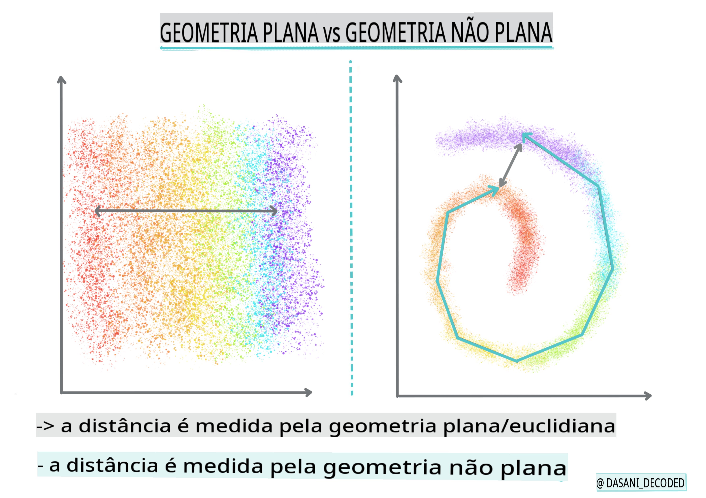
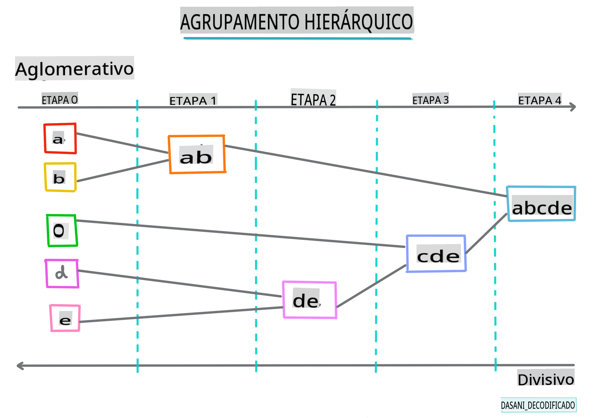

# Introdução ao agrupamento

Agrupamento é um tipo de [Aprendizado Não Supervisionado](https://wikipedia.org/wiki/Unsupervised_learning) que presume que um conjunto de dados não está rotulado ou que suas entradas não estão associadas a saídas pré-definidas. Ele utiliza vários algoritmos para analisar dados não rotulados e fornecer agrupamentos de acordo com os padrões que identifica nos dados.

[](https://youtu.be/ty2advRiWJM "No One Like You by PSquare")

> 🎥 Clique na imagem acima para assistir a um vídeo. Enquanto você estuda aprendizado de máquina com agrupamento, aproveite algumas faixas de Dance Hall nigeriano - esta é uma música muito bem avaliada de 2014 do PSquare.
## [Quiz pré-aula](https://gray-sand-07a10f403.1.azurestaticapps.net/quiz/27/)
### Introdução

[Agregação](https://link.springer.com/referenceworkentry/10.1007%2F978-0-387-30164-8_124) é muito útil para exploração de dados. Vamos ver se pode ajudar a descobrir tendências e padrões na forma como o público nigeriano consome música.

✅ Reserve um minuto para pensar sobre as aplicações do agrupamento. Na vida real, o agrupamento acontece sempre que você tem uma pilha de roupas e precisa separar as roupas dos membros da sua família 🧦👕👖🩲. Na ciência de dados, o agrupamento ocorre ao tentar analisar as preferências de um usuário ou determinar as características de qualquer conjunto de dados não rotulado. O agrupamento, de certa forma, ajuda a dar sentido ao caos, como uma gaveta de meias.

[](https://youtu.be/esmzYhuFnds "Introdução ao Agrupamento")

> 🎥 Clique na imagem acima para assistir a um vídeo: John Guttag do MIT apresenta o agrupamento.

Em um ambiente profissional, o agrupamento pode ser usado para determinar coisas como segmentação de mercado, identificando quais faixas etárias compram quais itens, por exemplo. Outro uso seria a detecção de anomalias, talvez para detectar fraudes a partir de um conjunto de dados de transações de cartão de crédito. Ou você pode usar o agrupamento para identificar tumores em um lote de exames médicos.

✅ Pense por um minuto sobre como você pode ter encontrado o agrupamento 'na prática', em um ambiente bancário, de comércio eletrônico ou empresarial.

> 🎓 Curiosamente, a análise de agrupamento se originou nos campos da Antropologia e Psicologia na década de 1930. Você consegue imaginar como poderia ter sido utilizada?

Alternativamente, você poderia usá-lo para agrupar resultados de pesquisa - por links de compras, imagens ou avaliações, por exemplo. O agrupamento é útil quando você tem um grande conjunto de dados que deseja reduzir e sobre o qual deseja realizar uma análise mais granular, então a técnica pode ser usada para aprender sobre os dados antes que outros modelos sejam construídos.

✅ Uma vez que seus dados estão organizados em clusters, você atribui a eles um ID de cluster, e essa técnica pode ser útil ao preservar a privacidade de um conjunto de dados; você pode se referir a um ponto de dados pelo seu ID de cluster, em vez de por dados identificáveis mais reveladores. Você consegue pensar em outras razões pelas quais você se referiria a um ID de cluster em vez de outros elementos do cluster para identificá-lo?

Aprofunde seu entendimento sobre técnicas de agrupamento neste [módulo de Aprendizado](https://docs.microsoft.com/learn/modules/train-evaluate-cluster-models?WT.mc_id=academic-77952-leestott)
## Começando com o agrupamento

[Scikit-learn oferece uma grande variedade](https://scikit-learn.org/stable/modules/clustering.html) de métodos para realizar agrupamento. O tipo que você escolher dependerá do seu caso de uso. De acordo com a documentação, cada método tem vários benefícios. Aqui está uma tabela simplificada dos métodos suportados pelo Scikit-learn e seus casos de uso apropriados:

| Nome do método                  | Caso de uso                                                               |
| :------------------------------ | :------------------------------------------------------------------------ |
| K-Means                         | propósito geral, indutivo                                                |
| Propagação de afinidade         | muitos, clusters desiguais, indutivo                                    |
| Mean-shift                      | muitos, clusters desiguais, indutivo                                    |
| Agrupamento espectral           | poucos, clusters iguais, transdutivo                                     |
| Agrupamento hierárquico de Ward | muitos, clusters restritos, transdutivo                                  |
| Agrupamento aglomerativo        | muitos, distâncias não euclidianas, transdutivo                        |
| DBSCAN                          | geometria não plana, clusters desiguais, transdutivo                    |
| OPTICS                          | geometria não plana, clusters desiguais com densidade variável, transdutivo |
| Misturas gaussianas             | geometria plana, indutivo                                               |
| BIRCH                           | grande conjunto de dados com outliers, indutivo                        |

> 🎓 Como criamos clusters está muito relacionado a como agrupamos os pontos de dados em grupos. Vamos desvendar algum vocabulário:
>
> 🎓 ['Transdutivo' vs. 'indutivo'](https://wikipedia.org/wiki/Transduction_(machine_learning))
>
> A inferência transdutiva é derivada de casos de treinamento observados que mapeiam para casos de teste específicos. A inferência indutiva é derivada de casos de treinamento que mapeiam para regras gerais que são aplicadas apenas a casos de teste.
>
> Um exemplo: imagine que você tem um conjunto de dados que está apenas parcialmente rotulado. Algumas coisas são 'discos', algumas 'cds' e algumas estão em branco. Sua tarefa é fornecer rótulos para os espaços em branco. Se você escolher uma abordagem indutiva, você treinaria um modelo procurando por 'discos' e 'cds' e aplicaria esses rótulos aos seus dados não rotulados. Essa abordagem terá dificuldades em classificar coisas que são na verdade 'fitas'. Uma abordagem transdutiva, por outro lado, lida com esses dados desconhecidos de forma mais eficaz, pois trabalha para agrupar itens semelhantes e, em seguida, aplica um rótulo a um grupo. Nesse caso, os clusters poderiam refletir 'coisas musicais redondas' e 'coisas musicais quadradas'.
>
> 🎓 ['Geometria não plana' vs. 'plana'](https://datascience.stackexchange.com/questions/52260/terminology-flat-geometry-in-the-context-of-clustering)
>
> Derivada da terminologia matemática, geometria não plana vs. plana refere-se à medida de distâncias entre pontos por métodos geométricos 'plano' ([Euclidiano](https://wikipedia.org/wiki/Euclidean_geometry)) ou 'não plano' (não euclidiano).
>
> 'Plano' neste contexto refere-se à geometria euclidiana (partes da qual são ensinadas como geometria 'plana'), e não plano refere-se à geometria não euclidiana. O que a geometria tem a ver com aprendizado de máquina? Bem, como dois campos que estão enraizados na matemática, deve haver uma maneira comum de medir distâncias entre pontos em clusters, e isso pode ser feito de maneira 'plana' ou 'não plana', dependendo da natureza dos dados. [Distâncias euclidianas](https://wikipedia.org/wiki/Euclidean_distance) são medidas como o comprimento de um segmento de linha entre dois pontos. [Distâncias não euclidianas](https://wikipedia.org/wiki/Non-Euclidean_geometry) são medidas ao longo de uma curva. Se seus dados, visualizados, parecem não existir em um plano, você pode precisar usar um algoritmo especializado para lidar com isso.
>

> Infográfico por [Dasani Madipalli](https://twitter.com/dasani_decoded)
>
> 🎓 ['Distâncias'](https://web.stanford.edu/class/cs345a/slides/12-clustering.pdf)
>
> Clusters são definidos por sua matriz de distância, ou seja, as distâncias entre pontos. Essa distância pode ser medida de algumas maneiras. Clusters euclidianos são definidos pela média dos valores dos pontos e contêm um 'centroide' ou ponto central. As distâncias são assim medidas pela distância até esse centroide. Distâncias não euclidianas referem-se a 'clustroides', o ponto mais próximo de outros pontos. Clustroides, por sua vez, podem ser definidos de várias maneiras.
>
> 🎓 ['Constrainido'](https://wikipedia.org/wiki/Constrained_clustering)
>
> [Agrupamento Constrangido](https://web.cs.ucdavis.edu/~davidson/Publications/ICDMTutorial.pdf) introduz o aprendizado 'semi-supervisionado' neste método não supervisionado. As relações entre os pontos são sinalizadas como 'não podem se conectar' ou 'devem se conectar', então algumas regras são impostas ao conjunto de dados.
>
> Um exemplo: se um algoritmo é liberado em um lote de dados não rotulados ou semi-rotulados, os clusters que ele produz podem ser de baixa qualidade. No exemplo acima, os clusters podem agrupar 'coisas musicais redondas' e 'coisas musicais quadradas' e 'coisas triangulares' e 'biscoitos'. Se forem dadas algumas restrições, ou regras a serem seguidas ("o item deve ser feito de plástico", "o item precisa ser capaz de produzir música"), isso pode ajudar a 'constranger' o algoritmo a fazer melhores escolhas.
>
> 🎓 'Densidade'
>
> Dados que são 'ruidosos' são considerados 'densos'. As distâncias entre pontos em cada um de seus clusters podem se mostrar, ao exame, mais ou menos densas, ou 'superlotadas', e, portanto, esses dados precisam ser analisados com o método de agrupamento apropriado. [Este artigo](https://www.kdnuggets.com/2020/02/understanding-density-based-clustering.html) demonstra a diferença entre usar o agrupamento K-Means vs. algoritmos HDBSCAN para explorar um conjunto de dados ruidoso com densidade de cluster desigual.

## Algoritmos de agrupamento

Existem mais de 100 algoritmos de agrupamento, e seu uso depende da natureza dos dados em questão. Vamos discutir alguns dos principais:

- **Agrupamento hierárquico**. Se um objeto é classificado pela sua proximidade a um objeto próximo, em vez de a um mais distante, os clusters são formados com base na distância de seus membros em relação a outros objetos. O agrupamento aglomerativo do Scikit-learn é hierárquico.

   
   > Infográfico por [Dasani Madipalli](https://twitter.com/dasani_decoded)

- **Agrupamento por centróide**. Este algoritmo popular requer a escolha de 'k', ou o número de clusters a serem formados, após o que o algoritmo determina o ponto central de um cluster e reúne dados ao redor desse ponto. [Agrupamento K-means](https://wikipedia.org/wiki/K-means_clustering) é uma versão popular do agrupamento por centróide. O centro é determinado pela média mais próxima, daí o nome. A distância ao quadrado do cluster é minimizada.

   
   > Infográfico por [Dasani Madipalli](https://twitter.com/dasani_decoded)

- **Agrupamento baseado em distribuição**. Baseado em modelagem estatística, o agrupamento baseado em distribuição se concentra em determinar a probabilidade de que um ponto de dados pertença a um cluster e o atribui adequadamente. Métodos de mistura gaussiana pertencem a este tipo.

- **Agrupamento baseado em densidade**. Pontos de dados são atribuídos a clusters com base em sua densidade, ou seu agrupamento em torno uns dos outros. Pontos de dados distantes do grupo são considerados outliers ou ruído. DBSCAN, Mean-shift e OPTICS pertencem a este tipo de agrupamento.

- **Agrupamento baseado em grade**. Para conjuntos de dados multidimensionais, uma grade é criada e os dados são divididos entre as células da grade, criando assim clusters.

## Exercício - agrupe seus dados

O agrupamento como técnica é amplamente auxiliado por uma visualização adequada, então vamos começar visualizando nossos dados musicais. Este exercício nos ajudará a decidir qual dos métodos de agrupamento devemos usar de forma mais eficaz para a natureza desses dados.

1. Abra o arquivo [_notebook.ipynb_](https://github.com/microsoft/ML-For-Beginners/blob/main/5-Clustering/1-Visualize/notebook.ipynb) nesta pasta.

1. Importe o pacote `Seaborn` para uma boa visualização de dados.

    ```python
    !pip install seaborn
    ```

1. Anexe os dados das músicas do arquivo [_nigerian-songs.csv_](https://github.com/microsoft/ML-For-Beginners/blob/main/5-Clustering/data/nigerian-songs.csv). Carregue um dataframe com algumas informações sobre as músicas. Prepare-se para explorar esses dados importando as bibliotecas e despejando os dados:

    ```python
    import matplotlib.pyplot as plt
    import pandas as pd
    
    df = pd.read_csv("../data/nigerian-songs.csv")
    df.head()
    ```

    Verifique as primeiras linhas dos dados:

    |     | nome                     | álbum                        | artista              | gênero_top_artista | data_lançamento | duração | popularidade | dançabilidade | acústica | energia | instrumentalidade | vivacidade | volume | fala | tempo   | assinatura_tempo |
    | --- | ------------------------ | ---------------------------- | ------------------- | ---------------- | ------------ | ------ | ---------- | ------------ | ------------ | ------ | ---------------- | -------- | -------- | ----------- | ------- | -------------- |
    | 0   | Sparky                   | Mandy & The Jungle           | Cruel Santino       | alternative r&b  | 2019         | 144000 | 48         | 0.666        | 0.851        | 0.42   | 0.534            | 0.11     | -6.699   | 0.0829      | 133.015 | 5              |
    | 1   | shuga rush               | EVERYTHING YOU HEARD IS TRUE | Odunsi (The Engine) | afropop          | 2020         | 89488  | 30         | 0.71         | 0.0822       | 0.683  | 0.000169         | 0.101    | -5.64    | 0.36        | 129.993 | 3              |
    | 2   | LITT!                    | LITT!                        | AYLØ                | indie r&b        | 2018         | 207758 | 40         | 0.836        | 0.272        | 0.564  | 0.000537         | 0.11     | -7.127   | 0.0424      | 130.005 | 4              |
    | 3   | Confident / Feeling Cool | Enjoy Your Life              | Lady Donli          | nigerian pop     | 2019         | 175135 | 14         | 0.894        | 0.798        | 0.611  | 0.000187         | 0.0964   | -4.961   | 0.113       | 111.087 | 4              |
    | 4   | wanted you               | rare.                        | Odunsi (The Engine) | afropop          | 2018         | 152049 | 25         | 0.702        | 0.116        | 0.833  | 0.91             | 0.348    | -6.044   | 0.0447      | 105.115 | 4              |

1. Obtenha algumas informações sobre o dataframe, chamando `info()`:

    ```python
    df.info()
    ```

   A saída deve ser assim:

    ```output
    <class 'pandas.core.frame.DataFrame'>
    RangeIndex: 530 entries, 0 to 529
    Data columns (total 16 columns):
     #   Column            Non-Null Count  Dtype  
    ---  ------            --------------  -----  
     0   name              530 non-null    object 
     1   album             530 non-null    object 
     2   artist            530 non-null    object 
     3   artist_top_genre  530 non-null    object 
     4   release_date      530 non-null    int64  
     5   length            530 non-null    int64  
     6   popularity        530 non-null    int64  
     7   danceability      530 non-null    float64
     8   acousticness      530 non-null    float64
     9   energy            530 non-null    float64
     10  instrumentalness  530 non-null    float64
     11  liveness          530 non-null    float64
     12  loudness          530 non-null    float64
     13  speechiness       530 non-null    float64
     14  tempo             530 non-null    float64
     15  time_signature    530 non-null    int64  
    dtypes: float64(8), int64(4), object(4)
    memory usage: 66.4+ KB
    ```

1. Verifique se há valores nulos, chamando `isnull()` e verificando se a soma é 0:

    ```python
    df.isnull().sum()
    ```

    Tudo certo:

    ```output
    name                0
    album               0
    artist              0
    artist_top_genre    0
    release_date        0
    length              0
    popularity          0
    danceability        0
    acousticness        0
    energy              0
    instrumentalness    0
    liveness            0
    loudness            0
    speechiness         0
    tempo               0
    time_signature      0
    dtype: int64
    ```

1. Descreva os dados:

    ```python
    df.describe()
    ```

    |       | data_lançamento | duração      | popularidade | dançabilidade | acústica | energia   | instrumentalidade | vivacidade | volume  | fala | tempo      | assinatura_tempo |
    | ----- | ------------ | ----------- | ---------- | ------------ | ------------ | -------- | ---------------- | -------- | --------- | ----------- | ---------- | -------------- |
    | count | 530          | 530         | 530        | 530          | 530          | 530      | 530              | 530      | 530       | 530         | 530        | 530            |
    | mean  | 2015.390566  | 222298.1698 | 17.507547  | 0.741619     | 0.265412     | 0.760623 | 0.016305         | 0.147308 | -4.953011 | 0.130748    | 116.487864 | 3.986792       |
    | std   | 3.131688     | 39696.82226 | 18.992212  | 0.117522     | 0.208342     | 0.148533 | 0.090321         | 0.123588 | 2.464186  | 0.092939    | 23.518601  | 0.333701       |
    | min   | 1998         | 89488       | 0          | 0.255        | 0.000665     | 0.111    | 0                | 0.0283   | -19.362   | 0.0278      | 61.695     | 3              |
    | 25%   | 2014         | 199305      | 0          | 0.681        | 0.089525     | 0.669    | 0                | 0.07565  | -6.29875  | 0.0591      | 102.96125  | 4              |
    | 50%   | 2016         | 218509      | 13         | 0.761
## [Questionário pós-aula](https://gray-sand-07a10f403.1.azurestaticapps.net/quiz/28/)

## Revisão e Estudo Autônomo

Antes de aplicar algoritmos de agrupamento, como aprendemos, é uma boa ideia entender a natureza do seu conjunto de dados. Leia mais sobre este tópico [aqui](https://www.kdnuggets.com/2019/10/right-clustering-algorithm.html)

[Este artigo útil](https://www.freecodecamp.org/news/8-clustering-algorithms-in-machine-learning-that-all-data-scientists-should-know/) explica as diferentes maneiras como vários algoritmos de agrupamento se comportam, considerando diferentes formas de dados.

## Tarefa

[Pesquise outras visualizações para agrupamento](assignment.md)

**Isenção de responsabilidade**:  
Este documento foi traduzido utilizando serviços de tradução automática baseados em IA. Embora nos esforcemos pela precisão, esteja ciente de que traduções automatizadas podem conter erros ou imprecisões. O documento original em seu idioma nativo deve ser considerado a fonte autoritativa. Para informações críticas, recomenda-se a tradução profissional realizada por humanos. Não nos responsabilizamos por quaisquer mal-entendidos ou interpretações errôneas decorrentes do uso desta tradução.