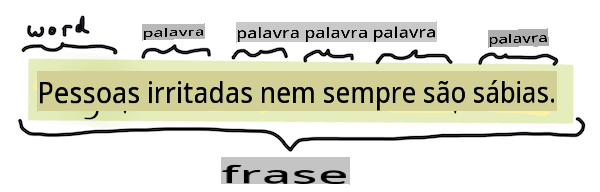
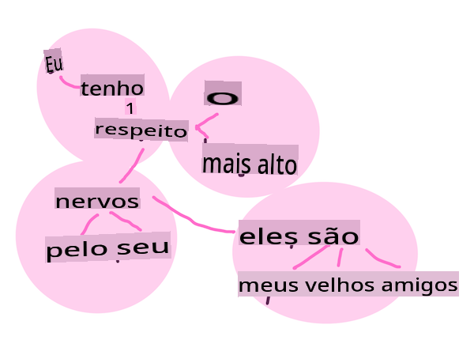
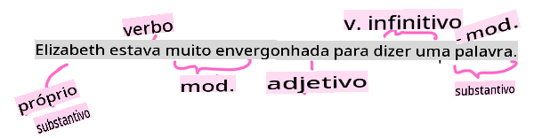

# Tarefas e técnicas comuns de processamento de linguagem natural

Para a maioria das tarefas de *processamento de linguagem natural*, o texto a ser processado deve ser dividido, examinado e os resultados armazenados ou cruzados com regras e conjuntos de dados. Essas tarefas permitem que o programador derive o _significado_ ou _intenção_ ou apenas a _frequência_ de termos e palavras em um texto.

## [Quiz pré-aula](https://gray-sand-07a10f403.1.azurestaticapps.net/quiz/33/)

Vamos descobrir técnicas comuns usadas no processamento de texto. Combinadas com aprendizado de máquina, essas técnicas ajudam você a analisar grandes quantidades de texto de forma eficiente. Antes de aplicar ML a essas tarefas, no entanto, vamos entender os problemas enfrentados por um especialista em NLP.

## Tarefas comuns de NLP

Existem diferentes maneiras de analisar um texto com o qual você está trabalhando. Existem tarefas que você pode realizar e, por meio dessas tarefas, você pode avaliar a compreensão do texto e tirar conclusões. Normalmente, você realiza essas tarefas em sequência.

### Tokenização

Provavelmente, a primeira coisa que a maioria dos algoritmos de NLP precisa fazer é dividir o texto em tokens ou palavras. Embora isso pareça simples, ter que considerar a pontuação e os delimitadores de palavras e frases de diferentes idiomas pode tornar a tarefa complicada. Você pode precisar usar vários métodos para determinar as demarcações.


> Tokenizando uma frase de **Orgulho e Preconceito**. Infográfico por [Jen Looper](https://twitter.com/jenlooper)

### Embeddings

[Word embeddings](https://wikipedia.org/wiki/Word_embedding) são uma maneira de converter seus dados textuais em forma numérica. Os embeddings são feitos de maneira que palavras com significados semelhantes ou palavras usadas juntas se agrupem.


> "Eu tenho o maior respeito pelos seus nervos, eles são meus velhos amigos." - Embeddings de palavras para uma frase em **Orgulho e Preconceito**. Infográfico por [Jen Looper](https://twitter.com/jenlooper)

✅ Experimente [esta ferramenta interessante](https://projector.tensorflow.org/) para experimentar com embeddings de palavras. Clicar em uma palavra mostra grupos de palavras semelhantes: 'brinquedo' se agrupa com 'disney', 'lego', 'playstation' e 'console'.

### Análise Sintática e Marcação de Partes do Discurso

Cada palavra que foi tokenizada pode ser marcada como uma parte do discurso - um substantivo, verbo ou adjetivo. A frase `the quick red fox jumped over the lazy brown dog` pode ser marcada como fox = substantivo, jumped = verbo.



> Analisando uma frase de **Orgulho e Preconceito**. Infográfico por [Jen Looper](https://twitter.com/jenlooper)

A análise sintática é reconhecer quais palavras estão relacionadas entre si em uma frase - por exemplo, `the quick red fox jumped` é uma sequência de adjetivo-substantivo-verbo que é separada da sequência `lazy brown dog`.

### Frequências de Palavras e Frases

Um procedimento útil ao analisar um grande corpo de texto é construir um dicionário de cada palavra ou frase de interesse e com que frequência ela aparece. A frase `the quick red fox jumped over the lazy brown dog` tem uma frequência de palavra de 2 para the.

Vamos olhar um texto de exemplo onde contamos a frequência das palavras. O poema "Os Vencedores" de Rudyard Kipling contém o seguinte verso:

```output
What the moral? Who rides may read.
When the night is thick and the tracks are blind
A friend at a pinch is a friend, indeed,
But a fool to wait for the laggard behind.
Down to Gehenna or up to the Throne,
He travels the fastest who travels alone.
```

Como as frequências de frases podem ser insensíveis ou sensíveis a maiúsculas conforme necessário, a frase `a friend` has a frequency of 2 and `the` has a frequency of 6, and `travels` é 2.

### N-grams

Um texto pode ser dividido em sequências de palavras de um comprimento definido, uma única palavra (unigrama), duas palavras (bigrama), três palavras (trigrama) ou qualquer número de palavras (n-grams).

Por exemplo, `the quick red fox jumped over the lazy brown dog` com uma pontuação de n-gram de 2 produz os seguintes n-grams:

1. the quick 
2. quick red 
3. red fox
4. fox jumped 
5. jumped over 
6. over the 
7. the lazy 
8. lazy brown 
9. brown dog

Pode ser mais fácil visualizar isso como uma caixa deslizante sobre a frase. Aqui está para n-grams de 3 palavras, o n-gram está em negrito em cada frase:

1.   <u>**the quick red**</u> fox jumped over the lazy brown dog
2.   the **<u>quick red fox</u>** jumped over the lazy brown dog
3.   the quick **<u>red fox jumped</u>** over the lazy brown dog
4.   the quick red **<u>fox jumped over</u>** the lazy brown dog
5.   the quick red fox **<u>jumped over the</u>** lazy brown dog
6.   the quick red fox jumped **<u>over the lazy</u>** brown dog
7.   the quick red fox jumped over <u>**the lazy brown**</u> dog
8.   the quick red fox jumped over the **<u>lazy brown dog</u>**


> Valor de n-gram de 3: Infográfico por [Jen Looper](https://twitter.com/jenlooper)

### Extração de Frases Nominais

Na maioria das frases, há um substantivo que é o sujeito ou objeto da frase. Em inglês, é frequentemente identificável por ter 'a' ou 'an' ou 'the' precedendo-o. Identificar o sujeito ou objeto de uma frase "extraindo a frase nominal" é uma tarefa comum em NLP ao tentar entender o significado de uma frase.

✅ Na frase "Eu não consigo fixar na hora, ou no local, ou na aparência ou nas palavras, que estabeleceram a fundação. Faz muito tempo. Eu estava no meio antes de saber que havia começado.", você consegue identificar as frases nominais?

Na frase `the quick red fox jumped over the lazy brown dog` existem 2 frases nominais: **quick red fox** e **lazy brown dog**.

### Análise de Sentimento

Uma frase ou texto pode ser analisado quanto ao sentimento, ou quão *positivo* ou *negativo* ele é. O sentimento é medido em *polaridade* e *objetividade/subjetividade*. A polaridade é medida de -1.0 a 1.0 (negativo a positivo) e de 0.0 a 1.0 (mais objetivo a mais subjetivo).

✅ Mais tarde, você aprenderá que existem diferentes maneiras de determinar o sentimento usando aprendizado de máquina, mas uma maneira é ter uma lista de palavras e frases que são categorizadas como positivas ou negativas por um especialista humano e aplicar esse modelo ao texto para calcular uma pontuação de polaridade. Você consegue ver como isso funcionaria em algumas circunstâncias e menos bem em outras?

### Inflação

A inflexão permite que você pegue uma palavra e obtenha o singular ou plural da palavra.

### Lematização

Um *lema* é a raiz ou palavra principal para um conjunto de palavras, por exemplo, *flew*, *flies*, *flying* têm um lema do verbo *fly*.

Existem também bancos de dados úteis disponíveis para o pesquisador de NLP, notavelmente:

### WordNet

[WordNet](https://wordnet.princeton.edu/) é um banco de dados de palavras, sinônimos, antônimos e muitos outros detalhes para cada palavra em muitos idiomas diferentes. É incrivelmente útil ao tentar construir traduções, verificadores de ortografia ou ferramentas de linguagem de qualquer tipo.

## Bibliotecas de NLP

Felizmente, você não precisa construir todas essas técnicas sozinho, pois existem excelentes bibliotecas Python disponíveis que tornam isso muito mais acessível para desenvolvedores que não são especializados em processamento de linguagem natural ou aprendizado de máquina. As próximas lições incluem mais exemplos disso, mas aqui você aprenderá alguns exemplos úteis para ajudá-lo na próxima tarefa.

### Exercício - usando `TextBlob` library

Let's use a library called TextBlob as it contains helpful APIs for tackling these types of tasks. TextBlob "stands on the giant shoulders of [NLTK](https://nltk.org) and [pattern](https://github.com/clips/pattern), and plays nicely with both." It has a considerable amount of ML embedded in its API.

> Note: A useful [Quick Start](https://textblob.readthedocs.io/en/dev/quickstart.html#quickstart) guide is available for TextBlob that is recommended for experienced Python developers 

When attempting to identify *noun phrases*, TextBlob offers several options of extractors to find noun phrases. 

1. Take a look at `ConllExtractor`.

    ```python
    from textblob import TextBlob
    from textblob.np_extractors import ConllExtractor
    # import and create a Conll extractor to use later 
    extractor = ConllExtractor()
    
    # later when you need a noun phrase extractor:
    user_input = input("> ")
    user_input_blob = TextBlob(user_input, np_extractor=extractor)  # note non-default extractor specified
    np = user_input_blob.noun_phrases                                    
    ```

    > O que está acontecendo aqui? [ConllExtractor](https://textblob.readthedocs.io/en/dev/api_reference.html?highlight=Conll#textblob.en.np_extractors.ConllExtractor) é "Um extrator de frases nominais que usa análise de segmentos treinada com o corpus de treinamento ConLL-2000." ConLL-2000 refere-se à Conferência de 2000 sobre Aprendizado de Linguagem Natural Computacional. A cada ano, a conferência hospedava um workshop para enfrentar um problema espinhoso de NLP, e em 2000 foi a fragmentação nominal. Um modelo foi treinado no Wall Street Journal, com "seções 15-18 como dados de treinamento (211727 tokens) e seção 20 como dados de teste (47377 tokens)". Você pode ver os procedimentos utilizados [aqui](https://www.clips.uantwerpen.be/conll2000/chunking/) e os [resultados](https://ifarm.nl/erikt/research/np-chunking.html).

### Desafio - melhorando seu bot com NLP

Na lição anterior, você construiu um bot de perguntas e respostas muito simples. Agora, você fará com que Marvin seja um pouco mais simpático analisando sua entrada para sentimento e imprimindo uma resposta que corresponda ao sentimento. Você também precisará identificar uma `noun_phrase` e perguntar sobre isso.

Seus passos ao construir um bot de conversa melhor:

1. Imprima instruções orientando o usuário sobre como interagir com o bot
2. Inicie o loop 
   1. Aceite a entrada do usuário
   2. Se o usuário pediu para sair, saia
   3. Processem a entrada do usuário e determine a resposta de sentimento apropriada
   4. Se uma frase nominal for detectada no sentimento, pluralize-a e pergunte mais sobre esse tópico
   5. Imprima a resposta
3. Volte ao passo 2

Aqui está o trecho de código para determinar o sentimento usando TextBlob. Observe que há apenas quatro *gradientes* de resposta de sentimento (você pode ter mais se quiser):

```python
if user_input_blob.polarity <= -0.5:
  response = "Oh dear, that sounds bad. "
elif user_input_blob.polarity <= 0:
  response = "Hmm, that's not great. "
elif user_input_blob.polarity <= 0.5:
  response = "Well, that sounds positive. "
elif user_input_blob.polarity <= 1:
  response = "Wow, that sounds great. "
```

Aqui está uma saída de exemplo para guiá-lo (a entrada do usuário está nas linhas que começam com >):

```output
Hello, I am Marvin, the friendly robot.
You can end this conversation at any time by typing 'bye'
After typing each answer, press 'enter'
How are you today?
> I am ok
Well, that sounds positive. Can you tell me more?
> I went for a walk and saw a lovely cat
Well, that sounds positive. Can you tell me more about lovely cats?
> cats are the best. But I also have a cool dog
Wow, that sounds great. Can you tell me more about cool dogs?
> I have an old hounddog but he is sick
Hmm, that's not great. Can you tell me more about old hounddogs?
> bye
It was nice talking to you, goodbye!
```

Uma possível solução para a tarefa está [aqui](https://github.com/microsoft/ML-For-Beginners/blob/main/6-NLP/2-Tasks/solution/bot.py)

✅ Verificação de Conhecimento

1. Você acha que as respostas simpáticas "enganariam" alguém a pensar que o bot realmente os entendeu?
2. A identificação da frase nominal torna o bot mais "crível"?
3. Por que extrair uma "frase nominal" de uma frase é algo útil a se fazer?

---

Implemente o bot na verificação de conhecimento anterior e teste-o em um amigo. Ele consegue enganá-los? Você consegue tornar seu bot mais "crível"?

## 🚀Desafio

Pegue uma tarefa na verificação de conhecimento anterior e tente implementá-la. Teste o bot em um amigo. Ele consegue enganá-los? Você consegue tornar seu bot mais "crível"?

## [Quiz pós-aula](https://gray-sand-07a10f403.1.azurestaticapps.net/quiz/34/)

## Revisão e Autoestudo

Nas próximas lições, você aprenderá mais sobre análise de sentimento. Pesquise essa técnica interessante em artigos como estes no [KDNuggets](https://www.kdnuggets.com/tag/nlp)

## Tarefa 

[Faça um bot responder](assignment.md)

**Isenção de responsabilidade**:  
Este documento foi traduzido utilizando serviços de tradução automática baseados em IA. Embora nos esforcemos pela precisão, esteja ciente de que traduções automatizadas podem conter erros ou imprecisões. O documento original em seu idioma nativo deve ser considerado a fonte autoritativa. Para informações críticas, recomenda-se a tradução profissional por um humano. Não nos responsabilizamos por quaisquer mal-entendidos ou interpretações erradas decorrentes do uso desta tradução.