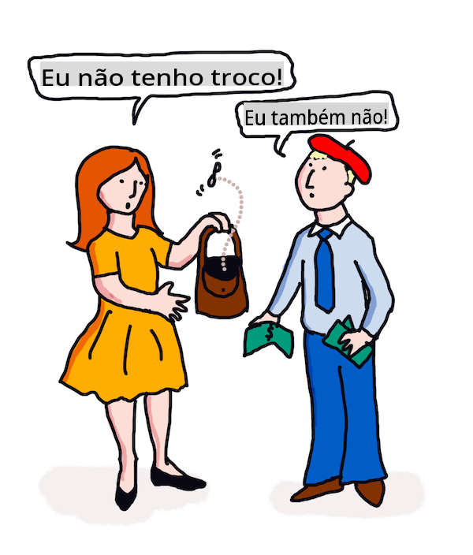

# Tradução e análise de sentimentos com ML

Nas lições anteriores, você aprendeu como construir um bot básico usando `TextBlob`, uma biblioteca que incorpora ML nos bastidores para realizar tarefas básicas de PNL, como extração de frases nominais. Outro desafio importante em linguística computacional é a _tradução_ precisa de uma frase de uma língua falada ou escrita para outra.

## [Quiz pré-aula](https://gray-sand-07a10f403.1.azurestaticapps.net/quiz/35/)

A tradução é um problema muito difícil, agravado pelo fato de que existem milhares de idiomas e cada um pode ter regras gramaticais muito diferentes. Uma abordagem é converter as regras gramaticais formais de uma língua, como o inglês, em uma estrutura não dependente de língua, e então traduzi-la convertendo-a de volta para outra língua. Essa abordagem significa que você seguiria os seguintes passos:

1. **Identificação**. Identifique ou classifique as palavras na língua de entrada em substantivos, verbos etc.
2. **Criar tradução**. Produza uma tradução direta de cada palavra no formato da língua-alvo.

### Exemplo de frase, inglês para irlandês

Em 'inglês', a frase _I feel happy_ é composta por três palavras na seguinte ordem:

- **sujeito** (I)
- **verbo** (feel)
- **adjetivo** (happy)

No entanto, na língua 'irlandesa', a mesma frase tem uma estrutura gramatical muito diferente - emoções como "*happy*" ou "*sad*" são expressas como estando *sobre* você.

A frase em inglês `I feel happy` em irlandês seria `Tá athas orm`. Uma tradução *literal* seria `Happy is upon me`.

Um falante de irlandês traduzindo para o inglês diria `I feel happy`, não `Happy is upon me`, porque entende o significado da frase, mesmo que as palavras e a estrutura da frase sejam diferentes.

A ordem formal para a frase em irlandês é:

- **verbo** (Tá ou is)
- **adjetivo** (athas, ou happy)
- **sujeito** (orm, ou sobre mim)

## Tradução

Um programa de tradução ingênuo poderia traduzir apenas palavras, ignorando a estrutura da frase.

✅ Se você aprendeu uma segunda (ou terceira ou mais) língua como adulto, pode ter começado pensando na sua língua nativa, traduzindo um conceito palavra por palavra na sua cabeça para a segunda língua, e então falando sua tradução. Isso é semelhante ao que os programas de tradução ingênuos estão fazendo. É importante passar dessa fase para alcançar fluência!

A tradução ingênua leva a traduções erradas (e às vezes hilárias): `I feel happy` traduz-se literalmente como `Mise bhraitheann athas` em irlandês. Isso significa (literalmente) `me feel happy` e não é uma frase válida em irlandês. Mesmo que o inglês e o irlandês sejam línguas faladas em duas ilhas vizinhas, elas são línguas muito diferentes com estruturas gramaticais diferentes.

> Você pode assistir a alguns vídeos sobre tradições linguísticas irlandesas, como [este](https://www.youtube.com/watch?v=mRIaLSdRMMs)

### Abordagens de aprendizado de máquina

Até agora, você aprendeu sobre a abordagem de regras formais para o processamento de linguagem natural. Outra abordagem é ignorar o significado das palavras e _em vez disso, usar aprendizado de máquina para detectar padrões_. Isso pode funcionar na tradução se você tiver muitos textos (um *corpus*) ou textos (*corpora*) nas línguas de origem e alvo.

Por exemplo, considere o caso de *Orgulho e Preconceito*, um famoso romance inglês escrito por Jane Austen em 1813. Se você consultar o livro em inglês e uma tradução humana do livro em *francês*, você poderia detectar frases em um que são traduzidas _idiomaticamente_ para o outro. Você fará isso em um minuto.

Por exemplo, quando uma frase em inglês como `I have no money` é traduzida literalmente para o francês, pode se tornar `Je n'ai pas de monnaie`. "Monnaie" é um 'falso cognato' francês complicado, já que 'money' e 'monnaie' não são sinônimos. Uma tradução melhor que um humano poderia fazer seria `Je n'ai pas d'argent`, porque transmite melhor o significado de que você não tem dinheiro (em vez de 'moeda solta', que é o significado de 'monnaie').



> Imagem de [Jen Looper](https://twitter.com/jenlooper)

Se um modelo de ML tiver traduções humanas suficientes para construir um modelo, ele pode melhorar a precisão das traduções identificando padrões comuns em textos que foram previamente traduzidos por falantes humanos especialistas de ambas as línguas.

### Exercício - tradução

Você pode usar `TextBlob` para traduzir frases. Tente a famosa primeira linha de **Orgulho e Preconceito**:

```python
from textblob import TextBlob

blob = TextBlob(
    "It is a truth universally acknowledged, that a single man in possession of a good fortune, must be in want of a wife!"
)
print(blob.translate(to="fr"))

```

`TextBlob` faz um trabalho bastante bom na tradução: "C'est une vérité universellement reconnue, qu'un homme célibataire en possession d'une bonne fortune doit avoir besoin d'une femme!".

Pode-se argumentar que a tradução do TextBlob é, de fato, muito mais exata do que a tradução francesa de 1932 do livro por V. Leconte e Ch. Pressoir:

"C'est une vérité universelle qu'un célibataire pourvu d'une belle fortune doit avoir envie de se marier, et, si peu que l'on sache de son sentiment à cet égard, lorsqu'il arrive dans une nouvelle résidence, cette idée est si bien fixée dans l'esprit de ses voisins qu'ils le considèrent sur-le-champ comme la propriété légitime de l'une ou l'autre de leurs filles."

Neste caso, a tradução informada por ML faz um trabalho melhor do que o tradutor humano, que está desnecessariamente colocando palavras na boca do autor original para 'clareza'.

> O que está acontecendo aqui? E por que o TextBlob é tão bom em tradução? Bem, nos bastidores, ele está usando o Google Translate, uma IA sofisticada capaz de analisar milhões de frases para prever as melhores expressões para a tarefa em questão. Não há nada manual acontecendo aqui e você precisa de uma conexão com a internet para usar `blob.translate`.

✅ Try some more sentences. Which is better, ML or human translation? In which cases?

## Sentiment analysis

Another area where machine learning can work very well is sentiment analysis. A non-ML approach to sentiment is to identify words and phrases which are 'positive' and 'negative'. Then, given a new piece of text, calculate the total value of the positive, negative and neutral words to identify the overall sentiment. 

This approach is easily tricked as you may have seen in the Marvin task - the sentence `Ótimo, isso foi uma maravilhosa perda de tempo, estou feliz que estamos perdidos nesta estrada escura` é uma frase com sentimento sarcástico e negativo, mas o algoritmo simples detecta 'ótimo', 'maravilhoso', 'feliz' como positivos e 'perda', 'perdido' e 'escura' como negativos. O sentimento geral é influenciado por essas palavras conflitantes.

✅ Pare um segundo e pense em como nós, como falantes humanos, transmitimos sarcasmo. A inflexão do tom desempenha um grande papel. Tente dizer a frase "Bem, aquele filme foi incrível" de diferentes maneiras para descobrir como sua voz transmite significado.

### Abordagens de ML

A abordagem de ML seria coletar manualmente textos negativos e positivos - tweets, ou críticas de filmes, ou qualquer coisa onde o humano tenha dado uma pontuação *e* uma opinião escrita. Então, técnicas de PNL podem ser aplicadas a opiniões e pontuações, para que padrões surjam (por exemplo, críticas de filmes positivas tendem a ter a frase 'digno do Oscar' mais do que críticas negativas de filmes, ou críticas de restaurantes positivas dizem 'gourmet' muito mais do que 'desagradável').

> ⚖️ **Exemplo**: Se você trabalhasse no escritório de um político e houvesse uma nova lei sendo debatida, os constituintes poderiam escrever para o escritório com e-mails apoiando ou e-mails contra a nova lei em questão. Vamos supor que você tenha a tarefa de ler os e-mails e classificá-los em 2 pilhas, *a favor* e *contra*. Se houvesse muitos e-mails, você poderia se sentir sobrecarregado tentando ler todos eles. Não seria bom se um bot pudesse ler todos eles por você, entendê-los e lhe dizer em qual pilha cada e-mail pertencia?
> 
> Uma maneira de conseguir isso é usar Aprendizado de Máquina. Você treinaria o modelo com uma parte dos e-mails *contra* e uma parte dos e-mails *a favor*. O modelo tenderia a associar frases e palavras com o lado contra e o lado a favor, *mas não entenderia nenhum do conteúdo*, apenas que certas palavras e padrões eram mais propensos a aparecer em um e-mail *contra* ou *a favor*. Você poderia testá-lo com alguns e-mails que não usou para treinar o modelo e ver se chegava à mesma conclusão que você. Então, uma vez que você estivesse satisfeito com a precisão do modelo, poderia processar e-mails futuros sem ter que ler cada um.

✅ Esse processo soa como processos que você usou em lições anteriores?

## Exercício - frases sentimentais

O sentimento é medido com uma *polaridade* de -1 a 1, significando que -1 é o sentimento mais negativo e 1 é o mais positivo. O sentimento também é medido com uma pontuação de 0 a 1 para objetividade (0) e subjetividade (1).

Dê uma olhada novamente em *Orgulho e Preconceito* de Jane Austen. O texto está disponível aqui no [Project Gutenberg](https://www.gutenberg.org/files/1342/1342-h/1342-h.htm). O exemplo abaixo mostra um pequeno programa que analisa o sentimento das primeiras e últimas frases do livro e exibe sua polaridade de sentimento e a pontuação de subjetividade/objetividade.

Você deve usar a biblioteca `TextBlob` (descrita acima) para determinar `sentiment` (você não precisa escrever seu próprio calculador de sentimentos) na tarefa a seguir.

```python
from textblob import TextBlob

quote1 = """It is a truth universally acknowledged, that a single man in possession of a good fortune, must be in want of a wife."""

quote2 = """Darcy, as well as Elizabeth, really loved them; and they were both ever sensible of the warmest gratitude towards the persons who, by bringing her into Derbyshire, had been the means of uniting them."""

sentiment1 = TextBlob(quote1).sentiment
sentiment2 = TextBlob(quote2).sentiment

print(quote1 + " has a sentiment of " + str(sentiment1))
print(quote2 + " has a sentiment of " + str(sentiment2))
```

Você verá a seguinte saída:

```output
It is a truth universally acknowledged, that a single man in possession of a good fortune, must be in want # of a wife. has a sentiment of Sentiment(polarity=0.20952380952380953, subjectivity=0.27142857142857146)

Darcy, as well as Elizabeth, really loved them; and they were
     both ever sensible of the warmest gratitude towards the persons
      who, by bringing her into Derbyshire, had been the means of
      uniting them. has a sentiment of Sentiment(polarity=0.7, subjectivity=0.8)
```

## Desafio - verificar a polaridade do sentimento

Sua tarefa é determinar, usando a polaridade do sentimento, se *Orgulho e Preconceito* tem mais frases absolutamente positivas do que absolutamente negativas. Para esta tarefa, você pode assumir que uma pontuação de polaridade de 1 ou -1 é absolutamente positiva ou negativa, respectivamente.

**Passos:**

1. Baixe uma [cópia de Orgulho e Preconceito](https://www.gutenberg.org/files/1342/1342-h/1342-h.htm) do Project Gutenberg como um arquivo .txt. Remova os metadados no início e no final do arquivo, deixando apenas o texto original.
2. Abra o arquivo no Python e extraia o conteúdo como uma string.
3. Crie um TextBlob usando a string do livro.
4. Analise cada frase no livro em um loop.
   1. Se a polaridade for 1 ou -1, armazene a frase em um array ou lista de mensagens positivas ou negativas.
5. No final, imprima todas as frases positivas e negativas (separadamente) e o número de cada uma.

Aqui está uma [solução](https://github.com/microsoft/ML-For-Beginners/blob/main/6-NLP/3-Translation-Sentiment/solution/notebook.ipynb).

✅ Verificação de Conhecimento

1. O sentimento é baseado nas palavras usadas na frase, mas o código *entende* as palavras?
2. Você acha que a polaridade do sentimento é precisa, ou em outras palavras, você *concorda* com as pontuações?
   1. Em particular, você concorda ou discorda da polaridade **positiva** absoluta das seguintes frases?
      * “Que pai excelente você tem, meninas!” disse ela, quando a porta foi fechada.
      * “Sua análise do Sr. Darcy acabou, presumo,” disse a Srta. Bingley; “e, por favor, qual é o resultado?” “Estou perfeitamente convencida de que o Sr. Darcy não tem defeito.”
      * Como essas coisas ocorrem maravilhosamente!
      * Eu tenho a maior aversão do mundo a esse tipo de coisa.
      * Charlotte é uma excelente gestora, ouso dizer.
      * “Isso é realmente encantador!”
      * Estou tão feliz!
      * Sua ideia sobre os pôneis é encantadora.
   2. As próximas 3 frases foram pontuadas com um sentimento positivo absoluto, mas, ao ler de perto, não são frases positivas. Por que a análise de sentimento pensou que eram frases positivas?
      * Feliz serei eu, quando sua estadia em Netherfield acabar!” “Gostaria de poder dizer algo para confortá-la,” respondeu Elizabeth; “mas está totalmente fora do meu alcance.
      * Se eu pudesse apenas vê-la feliz!
      * Nossa angústia, minha querida Lizzy, é muito grande.
   3. Você concorda ou discorda da polaridade **negativa** absoluta das seguintes frases?
      - Todo mundo está disgustado com seu orgulho.
      - “Eu gostaria de saber como ele se comporta entre estranhos.” “Você ouvirá então - mas prepare-se para algo muito terrível.”
      - A pausa foi para os sentimentos de Elizabeth terrível.
      - Seria terrível!

✅ Qualquer aficionado por Jane Austen entenderá que ela frequentemente usa seus livros para criticar os aspectos mais ridículos da sociedade da Regência inglesa. Elizabeth Bennett, a protagonista de *Orgulho e Preconceito*, é uma observadora social perspicaz (como a autora) e sua linguagem é frequentemente muito nuançada. Até mesmo o Sr. Darcy (o interesse amoroso da história) nota o uso brincalhão e provocativo da linguagem por Elizabeth: "Eu tive o prazer de sua companhia tempo suficiente para saber que você encontra grande prazer em ocasionalmente professar opiniões que, de fato, não são suas."

---

## 🚀Desafio

Você pode tornar Marvin ainda melhor extraindo outros recursos da entrada do usuário?

## [Quiz pós-aula](https://gray-sand-07a10f403.1.azurestaticapps.net/quiz/36/)

## Revisão & Autoestudo

Existem muitas maneiras de extrair sentimentos de textos. Pense nas aplicações comerciais que podem fazer uso dessa técnica. Pense em como isso pode dar errado. Leia mais sobre sistemas sofisticados prontos para empresas que analisam sentimentos, como [Azure Text Analysis](https://docs.microsoft.com/azure/cognitive-services/Text-Analytics/how-tos/text-analytics-how-to-sentiment-analysis?tabs=version-3-1?WT.mc_id=academic-77952-leestott). Teste algumas das frases de Orgulho e Preconceito acima e veja se consegue detectar nuances.

## Tarefa 

[Licença poética](assignment.md)

**Isenção de responsabilidade**:  
Este documento foi traduzido utilizando serviços de tradução automática baseados em IA. Embora nos esforcemos pela precisão, esteja ciente de que as traduções automatizadas podem conter erros ou imprecisões. O documento original em seu idioma nativo deve ser considerado a fonte autoritativa. Para informações críticas, recomenda-se a tradução profissional feita por humanos. Não nos responsabilizamos por quaisquer mal-entendidos ou interpretações incorretas decorrentes do uso desta tradução.