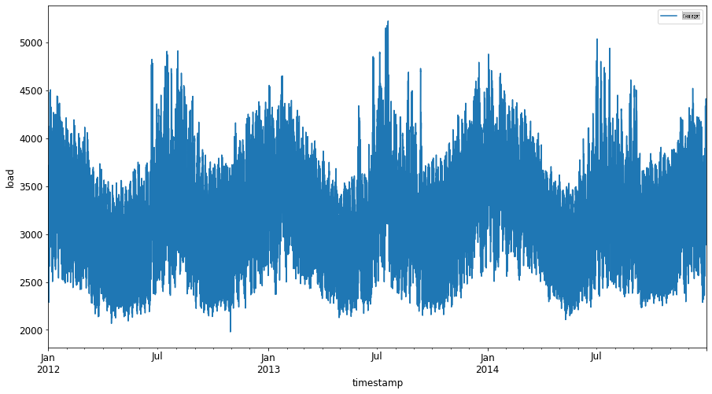
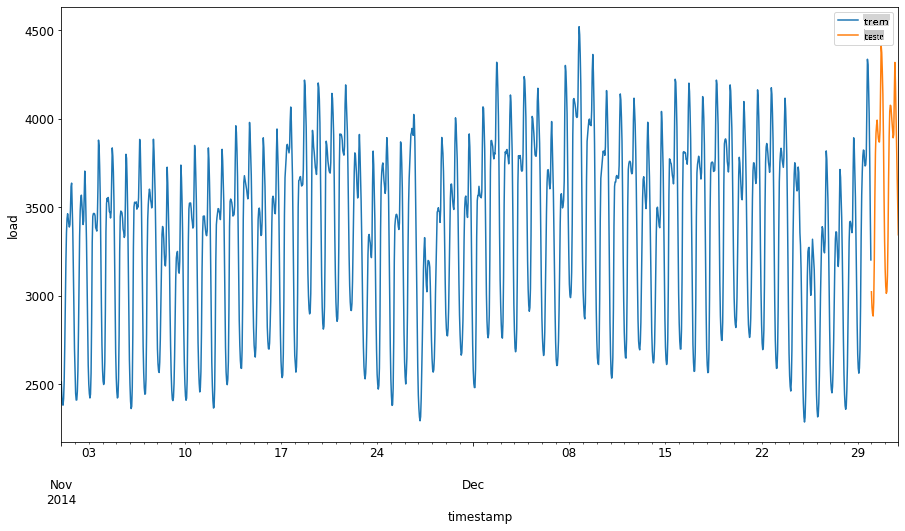
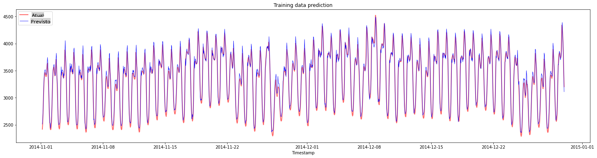
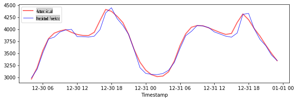

# Previsão de Séries Temporais com Regressor de Vetores de Suporte

Na lição anterior, você aprendeu a usar o modelo ARIMA para fazer previsões de séries temporais. Agora, você irá explorar o modelo Regressor de Vetores de Suporte, que é um modelo de regressão utilizado para prever dados contínuos.

## [Quiz pré-aula](https://gray-sand-07a10f403.1.azurestaticapps.net/quiz/51/) 

## Introdução

Nesta lição, você descobrirá uma maneira específica de construir modelos com [**SVM**: **S**uporte **V**ector **M**achine](https://en.wikipedia.org/wiki/Support-vector_machine) para regressão, ou **SVR: Regressor de Vetores de Suporte**. 

### SVR no contexto de séries temporais [^1]

Antes de entender a importância do SVR na previsão de séries temporais, aqui estão alguns conceitos importantes que você precisa saber:

- **Regressão:** Técnica de aprendizado supervisionado para prever valores contínuos a partir de um conjunto de entradas fornecido. A ideia é ajustar uma curva (ou linha) no espaço das características que tenha o maior número de pontos de dados. [Clique aqui](https://en.wikipedia.org/wiki/Regression_analysis) para mais informações.
- **Máquina de Vetores de Suporte (SVM):** Um tipo de modelo de aprendizado de máquina supervisionado usado para classificação, regressão e detecção de outliers. O modelo é um hiperplano no espaço das características, que no caso da classificação atua como uma fronteira, e no caso da regressão atua como a linha de melhor ajuste. No SVM, uma função Kernel é geralmente usada para transformar o conjunto de dados em um espaço de maior número de dimensões, de modo que possam ser facilmente separáveis. [Clique aqui](https://en.wikipedia.org/wiki/Support-vector_machine) para mais informações sobre SVMs.
- **Regressor de Vetores de Suporte (SVR):** Um tipo de SVM, para encontrar a linha de melhor ajuste (que no caso do SVM é um hiperplano) que tenha o maior número de pontos de dados.

### Por que SVR? [^1]

Na última lição, você aprendeu sobre ARIMA, que é um método linear estatístico muito bem-sucedido para prever dados de séries temporais. No entanto, em muitos casos, os dados de séries temporais apresentam *não-linearidade*, que não pode ser mapeada por modelos lineares. Nesses casos, a capacidade do SVM de considerar a não-linearidade nos dados para tarefas de regressão torna o SVR bem-sucedido na previsão de séries temporais.

## Exercício - construir um modelo SVR

Os primeiros passos para a preparação dos dados são os mesmos da lição anterior sobre [ARIMA](https://github.com/microsoft/ML-For-Beginners/tree/main/7-TimeSeries/2-ARIMA). 

Abra a pasta [_/working_](https://github.com/microsoft/ML-For-Beginners/tree/main/7-TimeSeries/3-SVR/working) nesta lição e encontre o arquivo [_notebook.ipynb_](https://github.com/microsoft/ML-For-Beginners/blob/main/7-TimeSeries/3-SVR/working/notebook.ipynb). [^2]

1. Execute o notebook e importe as bibliotecas necessárias:  [^2]

   ```python
   import sys
   sys.path.append('../../')
   ```

   ```python
   import os
   import warnings
   import matplotlib.pyplot as plt
   import numpy as np
   import pandas as pd
   import datetime as dt
   import math
   
   from sklearn.svm import SVR
   from sklearn.preprocessing import MinMaxScaler
   from common.utils import load_data, mape
   ```

2. Carregue os dados do arquivo `/data/energy.csv` em um dataframe do Pandas e dê uma olhada:  [^2]

   ```python
   energy = load_data('../../data')[['load']]
   ```

3. Plote todos os dados de energia disponíveis de janeiro de 2012 a dezembro de 2014: [^2]

   ```python
   energy.plot(y='load', subplots=True, figsize=(15, 8), fontsize=12)
   plt.xlabel('timestamp', fontsize=12)
   plt.ylabel('load', fontsize=12)
   plt.show()
   ```

   

   Agora, vamos construir nosso modelo SVR.

### Criar conjuntos de dados de treinamento e teste

Agora que seus dados estão carregados, você pode separá-los em conjuntos de treino e teste. Em seguida, você irá remodelar os dados para criar um conjunto de dados baseado em passos de tempo, que será necessário para o SVR. Você treinará seu modelo no conjunto de treino. Após o término do treinamento do modelo, você avaliará sua precisão no conjunto de treinamento, no conjunto de teste e, em seguida, no conjunto de dados completo para ver o desempenho geral. Você precisa garantir que o conjunto de teste abranja um período posterior em relação ao conjunto de treinamento, para garantir que o modelo não obtenha informações de períodos de tempo futuros [^2] (uma situação conhecida como *Overfitting*).

1. Alocar um período de dois meses de 1º de setembro a 31 de outubro de 2014 para o conjunto de treinamento. O conjunto de teste incluirá o período de dois meses de 1º de novembro a 31 de dezembro de 2014: [^2]

   ```python
   train_start_dt = '2014-11-01 00:00:00'
   test_start_dt = '2014-12-30 00:00:00'
   ```

2. Visualize as diferenças: [^2]

   ```python
   energy[(energy.index < test_start_dt) & (energy.index >= train_start_dt)][['load']].rename(columns={'load':'train'}) \
       .join(energy[test_start_dt:][['load']].rename(columns={'load':'test'}), how='outer') \
       .plot(y=['train', 'test'], figsize=(15, 8), fontsize=12)
   plt.xlabel('timestamp', fontsize=12)
   plt.ylabel('load', fontsize=12)
   plt.show()
   ```

   

### Preparar os dados para treinamento

Agora, você precisa preparar os dados para o treinamento, realizando filtragem e escalonamento dos seus dados. Filtre seu conjunto de dados para incluir apenas os períodos de tempo e colunas que você precisa, e escale para garantir que os dados sejam projetados no intervalo de 0 a 1.

1. Filtrar o conjunto de dados original para incluir apenas os períodos de tempo mencionados por conjunto e incluindo apenas a coluna necessária 'load' mais a data: [^2]

   ```python
   train = energy.copy()[(energy.index >= train_start_dt) & (energy.index < test_start_dt)][['load']]
   test = energy.copy()[energy.index >= test_start_dt][['load']]
   
   print('Training data shape: ', train.shape)
   print('Test data shape: ', test.shape)
   ```

   ```output
   Training data shape:  (1416, 1)
   Test data shape:  (48, 1)
   ```
   
2. Escale os dados de treinamento para que fiquem na faixa (0, 1): [^2]

   ```python
   scaler = MinMaxScaler()
   train['load'] = scaler.fit_transform(train)
   ```
   
4. Agora, você escala os dados de teste: [^2]

   ```python
   test['load'] = scaler.transform(test)
   ```

### Criar dados com passos de tempo [^1]

Para o SVR, você transforma os dados de entrada para ter a forma `[batch, timesteps]`. So, you reshape the existing `train_data` and `test_data`, de modo que haja uma nova dimensão que se refere aos passos de tempo. 

```python
# Converting to numpy arrays
train_data = train.values
test_data = test.values
```

Para este exemplo, tomamos `timesteps = 5`. Assim, as entradas para o modelo são os dados dos primeiros 4 passos de tempo, e a saída será os dados do 5º passo de tempo.

```python
timesteps=5
```

Convertendo dados de treinamento em tensor 2D usando compreensão de lista aninhada:

```python
train_data_timesteps=np.array([[j for j in train_data[i:i+timesteps]] for i in range(0,len(train_data)-timesteps+1)])[:,:,0]
train_data_timesteps.shape
```

```output
(1412, 5)
```

Convertendo dados de teste em tensor 2D:

```python
test_data_timesteps=np.array([[j for j in test_data[i:i+timesteps]] for i in range(0,len(test_data)-timesteps+1)])[:,:,0]
test_data_timesteps.shape
```

```output
(44, 5)
```

Selecionando entradas e saídas dos dados de treinamento e teste:

```python
x_train, y_train = train_data_timesteps[:,:timesteps-1],train_data_timesteps[:,[timesteps-1]]
x_test, y_test = test_data_timesteps[:,:timesteps-1],test_data_timesteps[:,[timesteps-1]]

print(x_train.shape, y_train.shape)
print(x_test.shape, y_test.shape)
```

```output
(1412, 4) (1412, 1)
(44, 4) (44, 1)
```

### Implementar SVR [^1]

Agora, é hora de implementar o SVR. Para ler mais sobre esta implementação, você pode consultar [esta documentação](https://scikit-learn.org/stable/modules/generated/sklearn.svm.SVR.html). Para nossa implementação, seguimos estas etapas:

1. Defina o modelo chamando a função `SVR()` and passing in the model hyperparameters: kernel, gamma, c and epsilon
  2. Prepare the model for the training data by calling the `fit()` function
  3. Make predictions calling the `predict()`

Agora criamos um modelo SVR. Aqui usamos o [kernel RBF](https://scikit-learn.org/stable/modules/svm.html#parameters-of-the-rbf-kernel) e definimos os hiperparâmetros gamma, C e epsilon como 0.5, 10 e 0.05, respectivamente.

```python
model = SVR(kernel='rbf',gamma=0.5, C=10, epsilon = 0.05)
```

#### Ajustar o modelo nos dados de treinamento [^1]

```python
model.fit(x_train, y_train[:,0])
```

```output
SVR(C=10, cache_size=200, coef0=0.0, degree=3, epsilon=0.05, gamma=0.5,
    kernel='rbf', max_iter=-1, shrinking=True, tol=0.001, verbose=False)
```

#### Fazer previsões do modelo [^1]

```python
y_train_pred = model.predict(x_train).reshape(-1,1)
y_test_pred = model.predict(x_test).reshape(-1,1)

print(y_train_pred.shape, y_test_pred.shape)
```

```output
(1412, 1) (44, 1)
```

Você construiu seu SVR! Agora precisamos avaliá-lo.

### Avaliar seu modelo [^1]

Para avaliação, primeiro escalaremos os dados de volta para nossa escala original. Em seguida, para verificar o desempenho, plotaremos o gráfico da série temporal original e prevista, e também imprimiremos o resultado do MAPE.

Escale a saída prevista e a original:

```python
# Scaling the predictions
y_train_pred = scaler.inverse_transform(y_train_pred)
y_test_pred = scaler.inverse_transform(y_test_pred)

print(len(y_train_pred), len(y_test_pred))
```

```python
# Scaling the original values
y_train = scaler.inverse_transform(y_train)
y_test = scaler.inverse_transform(y_test)

print(len(y_train), len(y_test))
```

#### Verificar o desempenho do modelo nos dados de treinamento e teste [^1]

Extraímos os timestamps do conjunto de dados para mostrar no eixo x do nosso gráfico. Observe que estamos usando os primeiros ```timesteps-1``` valores como entrada para a primeira saída, então os timestamps para a saída começarão após isso.

```python
train_timestamps = energy[(energy.index < test_start_dt) & (energy.index >= train_start_dt)].index[timesteps-1:]
test_timestamps = energy[test_start_dt:].index[timesteps-1:]

print(len(train_timestamps), len(test_timestamps))
```

```output
1412 44
```

Plote as previsões para os dados de treinamento:

```python
plt.figure(figsize=(25,6))
plt.plot(train_timestamps, y_train, color = 'red', linewidth=2.0, alpha = 0.6)
plt.plot(train_timestamps, y_train_pred, color = 'blue', linewidth=0.8)
plt.legend(['Actual','Predicted'])
plt.xlabel('Timestamp')
plt.title("Training data prediction")
plt.show()
```



Imprima o MAPE para os dados de treinamento

```python
print('MAPE for training data: ', mape(y_train_pred, y_train)*100, '%')
```

```output
MAPE for training data: 1.7195710200875551 %
```

Plote as previsões para os dados de teste

```python
plt.figure(figsize=(10,3))
plt.plot(test_timestamps, y_test, color = 'red', linewidth=2.0, alpha = 0.6)
plt.plot(test_timestamps, y_test_pred, color = 'blue', linewidth=0.8)
plt.legend(['Actual','Predicted'])
plt.xlabel('Timestamp')
plt.show()
```



Imprima o MAPE para os dados de teste

```python
print('MAPE for testing data: ', mape(y_test_pred, y_test)*100, '%')
```

```output
MAPE for testing data:  1.2623790187854018 %
```

🏆 Você obteve um resultado muito bom no conjunto de dados de teste!

### Verificar o desempenho do modelo no conjunto de dados completo [^1]

```python
# Extracting load values as numpy array
data = energy.copy().values

# Scaling
data = scaler.transform(data)

# Transforming to 2D tensor as per model input requirement
data_timesteps=np.array([[j for j in data[i:i+timesteps]] for i in range(0,len(data)-timesteps+1)])[:,:,0]
print("Tensor shape: ", data_timesteps.shape)

# Selecting inputs and outputs from data
X, Y = data_timesteps[:,:timesteps-1],data_timesteps[:,[timesteps-1]]
print("X shape: ", X.shape,"\nY shape: ", Y.shape)
```

```output
Tensor shape:  (26300, 5)
X shape:  (26300, 4) 
Y shape:  (26300, 1)
```

```python
# Make model predictions
Y_pred = model.predict(X).reshape(-1,1)

# Inverse scale and reshape
Y_pred = scaler.inverse_transform(Y_pred)
Y = scaler.inverse_transform(Y)
```

```python
plt.figure(figsize=(30,8))
plt.plot(Y, color = 'red', linewidth=2.0, alpha = 0.6)
plt.plot(Y_pred, color = 'blue', linewidth=0.8)
plt.legend(['Actual','Predicted'])
plt.xlabel('Timestamp')
plt.show()
```


```python
print('MAPE: ', mape(Y_pred, Y)*100, '%')
```

```output
MAPE:  2.0572089029888656 %
```

🏆 Gráficos muito bons, mostrando um modelo com boa precisão. Parabéns!

---

## 🚀Desafio

- Tente ajustar os hiperparâmetros (gamma, C, epsilon) ao criar o modelo e avalie os dados para ver qual conjunto de hiperparâmetros oferece os melhores resultados nos dados de teste. Para saber mais sobre esses hiperparâmetros, você pode consultar o documento [aqui](https://scikit-learn.org/stable/modules/svm.html#parameters-of-the-rbf-kernel). 
- Tente usar diferentes funções de kernel para o modelo e analise seu desempenho no conjunto de dados. Um documento útil pode ser encontrado [aqui](https://scikit-learn.org/stable/modules/svm.html#kernel-functions).
- Tente usar diferentes valores para `timesteps` para que o modelo faça previsões considerando os passos anteriores.

## [Quiz pós-aula](https://gray-sand-07a10f403.1.azurestaticapps.net/quiz/52/)

## Revisão e Estudo Autônomo

Esta lição teve como objetivo introduzir a aplicação do SVR para Previsão de Séries Temporais. Para ler mais sobre SVR, você pode consultar [este blog](https://www.analyticsvidhya.com/blog/2020/03/support-vector-regression-tutorial-for-machine-learning/). Esta [documentação sobre scikit-learn](https://scikit-learn.org/stable/modules/svm.html) fornece uma explicação mais abrangente sobre SVMs em geral, [SVRs](https://scikit-learn.org/stable/modules/svm.html#regression) e também outros detalhes de implementação, como as diferentes [funções de kernel](https://scikit-learn.org/stable/modules/svm.html#kernel-functions) que podem ser utilizadas e seus parâmetros.

## Tarefa

[Um novo modelo SVR](assignment.md)

## Créditos

[^1]: O texto, código e saída nesta seção foram contribuídos por [@AnirbanMukherjeeXD](https://github.com/AnirbanMukherjeeXD)
[^2]: O texto, código e saída nesta seção foram retirados de [ARIMA](https://github.com/microsoft/ML-For-Beginners/tree/main/7-TimeSeries/2-ARIMA)

**Aviso Legal**:  
Este documento foi traduzido utilizando serviços de tradução automática baseados em IA. Embora nos esforcemos para garantir a precisão, esteja ciente de que traduções automatizadas podem conter erros ou imprecisões. O documento original em seu idioma nativo deve ser considerado a fonte autoritativa. Para informações críticas, recomenda-se a tradução profissional realizada por humanos. Não nos responsabilizamos por quaisquer mal-entendidos ou interpretações errôneas que possam surgir do uso desta tradução.