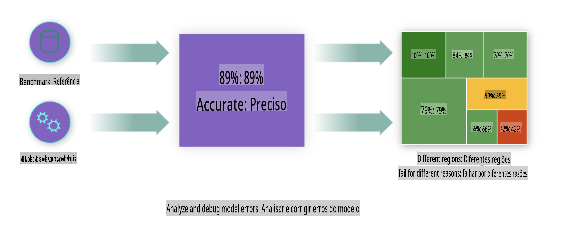
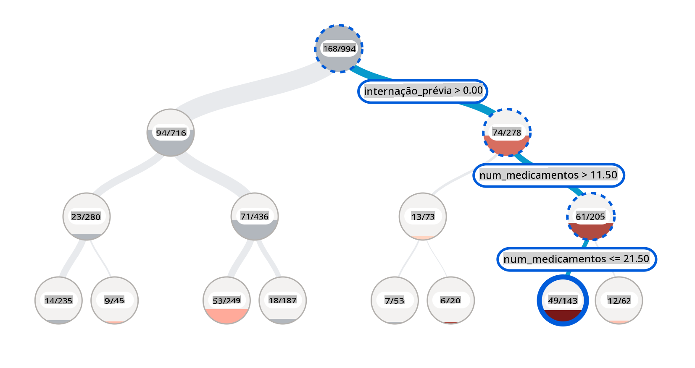
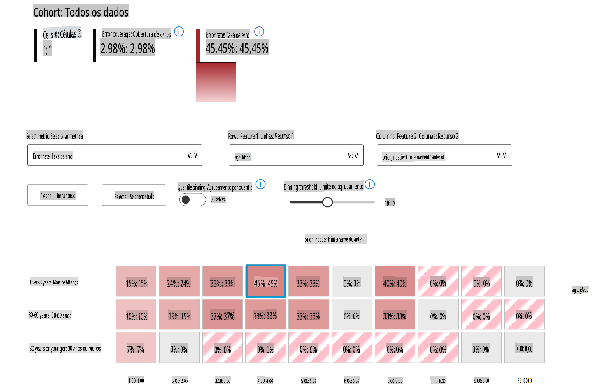
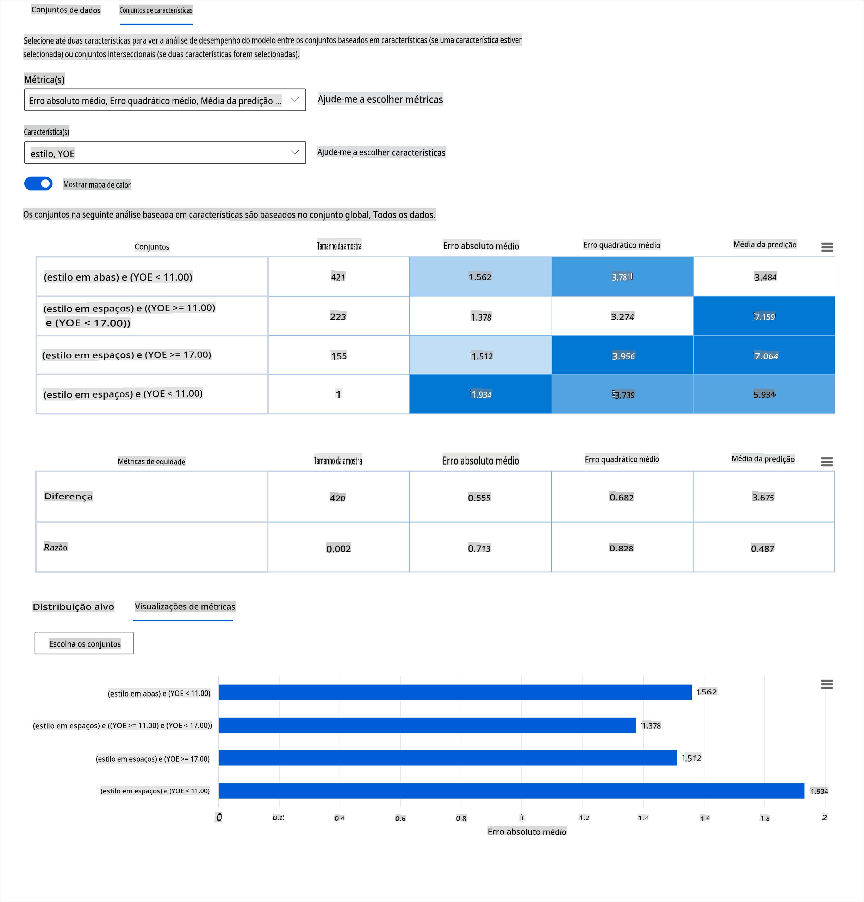
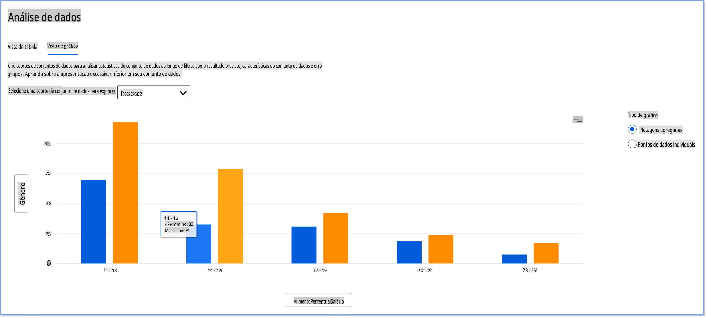
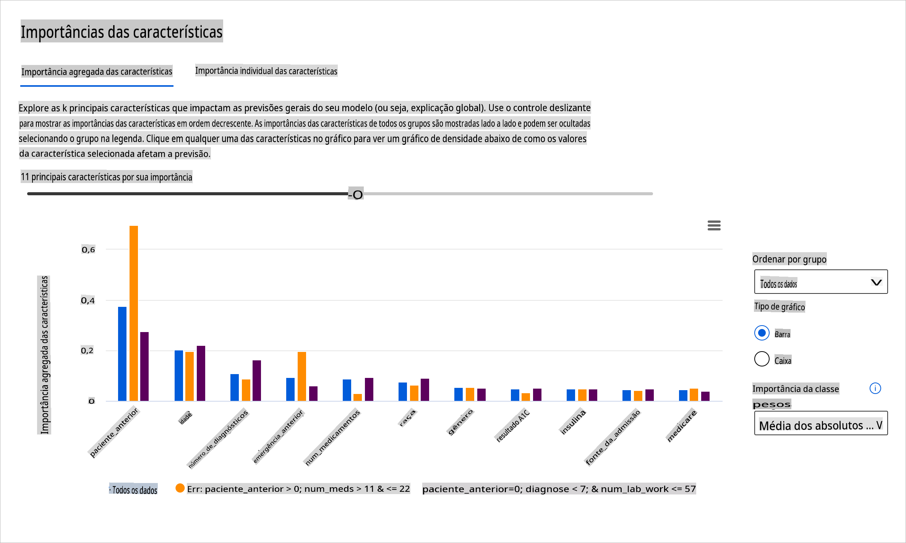
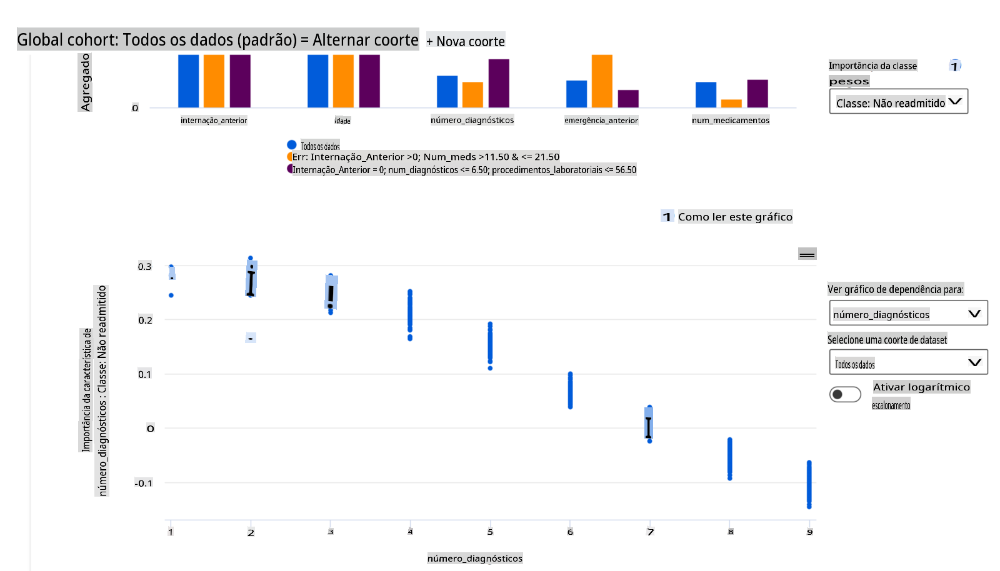

# Pós-escrito: Depuração de Modelos em Aprendizado de Máquina usando componentes do painel de IA Responsável

## [Quiz pré-aula](https://gray-sand-07a10f403.1.azurestaticapps.net/quiz/5/)

## Introdução

O aprendizado de máquina impacta nossas vidas cotidianas. A IA está se infiltrando em alguns dos sistemas mais importantes que nos afetam como indivíduos e nossa sociedade, desde saúde, finanças, educação até emprego. Por exemplo, sistemas e modelos estão envolvidos em tarefas diárias de tomada de decisão, como diagnósticos de saúde ou detecção de fraudes. Consequentemente, os avanços em IA, juntamente com a adoção acelerada, estão sendo confrontados com expectativas sociais em evolução e crescente regulamentação em resposta. Vemos constantemente áreas onde os sistemas de IA continuam a não atender às expectativas; eles expõem novos desafios; e os governos estão começando a regular soluções de IA. Portanto, é importante que esses modelos sejam analisados para fornecer resultados justos, confiáveis, inclusivos, transparentes e responsáveis para todos.

Neste currículo, vamos explorar ferramentas práticas que podem ser usadas para avaliar se um modelo apresenta problemas de IA responsável. As técnicas tradicionais de depuração de aprendizado de máquina tendem a ser baseadas em cálculos quantitativos, como precisão agregada ou perda de erro média. Imagine o que pode acontecer quando os dados que você está usando para construir esses modelos carecem de certas demografias, como raça, gênero, visão política, religião, ou representam desproporcionalmente essas demografias. E quando a saída do modelo é interpretada para favorecer alguma demografia? Isso pode introduzir uma super ou sub-representação desses grupos de características sensíveis, resultando em problemas de justiça, inclusão ou confiabilidade do modelo. Outro fator é que os modelos de aprendizado de máquina são considerados caixas-pretas, o que torna difícil entender e explicar o que impulsiona a previsão de um modelo. Todos esses são desafios que cientistas de dados e desenvolvedores de IA enfrentam quando não têm ferramentas adequadas para depurar e avaliar a justiça ou confiabilidade de um modelo.

Nesta lição, você aprenderá sobre a depuração de seus modelos usando:

- **Análise de Erros**: identificar onde na distribuição de seus dados o modelo apresenta altas taxas de erro.
- **Visão Geral do Modelo**: realizar análise comparativa entre diferentes coortes de dados para descobrir disparidades nas métricas de desempenho do seu modelo.
- **Análise de Dados**: investigar onde pode haver super ou sub-representação de seus dados que pode enviesar seu modelo para favorecer uma demografia em relação a outra.
- **Importância das Características**: entender quais características estão impulsionando as previsões do seu modelo em nível global ou local.

## Pré-requisito

Como pré-requisito, por favor, faça a revisão [Ferramentas de IA Responsável para desenvolvedores](https://www.microsoft.com/ai/ai-lab-responsible-ai-dashboard)

> 

## Análise de Erros

As métricas de desempenho tradicionais usadas para medir a precisão são, na maioria, cálculos baseados em previsões corretas versus incorretas. Por exemplo, determinar que um modelo é preciso 89% das vezes com uma perda de erro de 0,001 pode ser considerado um bom desempenho. Os erros frequentemente não estão distribuídos uniformemente em seu conjunto de dados subjacente. Você pode obter uma pontuação de precisão de modelo de 89%, mas descobrir que há diferentes regiões de seus dados para as quais o modelo está falhando 42% das vezes. A consequência desses padrões de falha com certos grupos de dados pode levar a problemas de justiça ou confiabilidade. É essencial entender as áreas onde o modelo está se saindo bem ou não. As regiões de dados onde há um alto número de imprecisões em seu modelo podem se revelar uma demografia de dados importante.

O componente de Análise de Erros no painel de RAI ilustra como a falha do modelo está distribuída entre várias coortes com uma visualização em árvore. Isso é útil para identificar características ou áreas onde há uma alta taxa de erro em seu conjunto de dados. Ao ver de onde a maioria das imprecisões do modelo está vindo, você pode começar a investigar a causa raiz. Você também pode criar coortes de dados para realizar análises. Essas coortes de dados ajudam no processo de depuração para determinar por que o desempenho do modelo é bom em uma coorte, mas errôneo em outra.

Os indicadores visuais no mapa da árvore ajudam a localizar as áreas problemáticas mais rapidamente. Por exemplo, quanto mais escura a sombra de vermelho que um nó da árvore possui, maior a taxa de erro.

O mapa de calor é outra funcionalidade de visualização que os usuários podem usar para investigar a taxa de erro usando uma ou duas características para encontrar um contribuinte para os erros do modelo em todo o conjunto de dados ou coortes.

Use a análise de erros quando precisar:

* Obter uma compreensão profunda de como as falhas do modelo estão distribuídas em um conjunto de dados e em várias dimensões de entrada e características.
* Desmembrar as métricas de desempenho agregadas para descobrir automaticamente coortes errôneas que informem suas etapas de mitigação direcionadas.

## Visão Geral do Modelo

Avaliar o desempenho de um modelo de aprendizado de máquina requer uma compreensão holística de seu comportamento. Isso pode ser alcançado revisando mais de uma métrica, como taxa de erro, precisão, recall, precisão ou MAE (Erro Absoluto Médio), para encontrar disparidades entre as métricas de desempenho. Uma métrica de desempenho pode parecer ótima, mas imprecisões podem ser expostas em outra métrica. Além disso, comparar as métricas em busca de disparidades em todo o conjunto de dados ou coortes ajuda a esclarecer onde o modelo está se saindo bem ou não. Isso é especialmente importante para ver o desempenho do modelo entre características sensíveis e insensíveis (por exemplo, raça do paciente, gênero ou idade) para descobrir potenciais injustiças que o modelo possa ter. Por exemplo, descobrir que o modelo é mais errôneo em uma coorte que possui características sensíveis pode revelar potenciais injustiças que o modelo possa ter.

O componente Visão Geral do Modelo do painel de RAI ajuda não apenas na análise das métricas de desempenho da representação de dados em uma coorte, mas também oferece aos usuários a capacidade de comparar o comportamento do modelo entre diferentes coortes.

A funcionalidade de análise baseada em características do componente permite que os usuários reduzam subgrupos de dados dentro de uma característica específica para identificar anomalias em um nível mais granular. Por exemplo, o painel possui inteligência embutida para gerar automaticamente coortes para uma característica selecionada pelo usuário (por exemplo, *"time_in_hospital < 3"* ou *"time_in_hospital >= 7"*). Isso permite que um usuário isole uma característica específica de um grupo de dados maior para ver se ela é um influenciador chave dos resultados errôneos do modelo.

O componente Visão Geral do Modelo suporta duas classes de métricas de disparidade:

**Disparidade no desempenho do modelo**: Esses conjuntos de métricas calculam a disparidade (diferença) nos valores da métrica de desempenho selecionada entre subgrupos de dados. Aqui estão alguns exemplos:

* Disparidade na taxa de precisão
* Disparidade na taxa de erro
* Disparidade na precisão
* Disparidade no recall
* Disparidade no erro absoluto médio (MAE)

**Disparidade na taxa de seleção**: Essa métrica contém a diferença na taxa de seleção (previsão favorável) entre subgrupos. Um exemplo disso é a disparidade nas taxas de aprovação de empréstimos. A taxa de seleção significa a fração de pontos de dados em cada classe classificados como 1 (na classificação binária) ou a distribuição dos valores de previsão (na regressão).

## Análise de Dados

> "Se você torturar os dados por tempo suficiente, eles confessarão qualquer coisa" - Ronald Coase

Essa afirmação parece extrema, mas é verdade que os dados podem ser manipulados para apoiar qualquer conclusão. Tal manipulação pode, às vezes, ocorrer involuntariamente. Como seres humanos, todos temos preconceitos, e muitas vezes é difícil saber conscientemente quando você está introduzindo viés nos dados. Garantir a justiça em IA e aprendizado de máquina continua a ser um desafio complexo.

Os dados são um grande ponto cego para as métricas de desempenho tradicionais do modelo. Você pode ter altas pontuações de precisão, mas isso nem sempre reflete o viés subjacente dos dados que pode estar em seu conjunto de dados. Por exemplo, se um conjunto de dados de funcionários tem 27% de mulheres em cargos executivos em uma empresa e 73% de homens no mesmo nível, um modelo de IA de anúncios de emprego treinado com esses dados pode direcionar principalmente um público masculino para cargos de nível sênior. Ter esse desequilíbrio nos dados enviesou a previsão do modelo para favorecer um gênero. Isso revela um problema de justiça onde há um viés de gênero no modelo de IA.

O componente de Análise de Dados no painel de RAI ajuda a identificar áreas onde há uma super- e sub-representação no conjunto de dados. Ele ajuda os usuários a diagnosticar a causa raiz dos erros e problemas de justiça introduzidos por desequilíbrios nos dados ou falta de representação de um grupo de dados específico. Isso dá aos usuários a capacidade de visualizar conjuntos de dados com base em resultados previstos e reais, grupos de erro e características específicas. Às vezes, descobrir um grupo de dados sub-representado também pode revelar que o modelo não está aprendendo bem, resultando em altas imprecisões. Ter um modelo que possui viés nos dados não é apenas um problema de justiça, mas demonstra que o modelo não é inclusivo ou confiável.

Use a análise de dados quando precisar:

* Explorar as estatísticas do seu conjunto de dados selecionando diferentes filtros para dividir seus dados em diferentes dimensões (também conhecidas como coortes).
* Compreender a distribuição do seu conjunto de dados entre diferentes coortes e grupos de características.
* Determinar se suas descobertas relacionadas à justiça, análise de erros e causalidade (derivadas de outros componentes do painel) são resultado da distribuição do seu conjunto de dados.
* Decidir em quais áreas coletar mais dados para mitigar erros que surgem de problemas de representação, ruído de rótulo, ruído de característica, viés de rótulo e fatores semelhantes.

## Interpretabilidade do Modelo

Modelos de aprendizado de máquina tendem a ser caixas-pretas. Entender quais características de dados chave impulsionam a previsão de um modelo pode ser desafiador. É importante fornecer transparência sobre por que um modelo faz uma certa previsão. Por exemplo, se um sistema de IA prevê que um paciente diabético está em risco de ser readmitido em um hospital em menos de 30 dias, ele deve ser capaz de fornecer dados de suporte que levaram à sua previsão. Ter indicadores de dados de suporte traz transparência para ajudar clínicos ou hospitais a tomar decisões bem informadas. Além disso, ser capaz de explicar por que um modelo fez uma previsão para um paciente individual permite responsabilidade em relação às regulamentações de saúde. Quando você está usando modelos de aprendizado de máquina de maneiras que afetam a vida das pessoas, é crucial entender e explicar o que influencia o comportamento de um modelo. A explicabilidade e interpretabilidade do modelo ajudam a responder perguntas em cenários como:

* Depuração do modelo: Por que meu modelo cometeu esse erro? Como posso melhorar meu modelo?
* Colaboração humano-IA: Como posso entender e confiar nas decisões do modelo?
* Conformidade regulatória: Meu modelo satisfaz os requisitos legais?

O componente de Importância das Características do painel de RAI ajuda você a depurar e obter uma compreensão abrangente de como um modelo faz previsões. É também uma ferramenta útil para profissionais de aprendizado de máquina e tomadores de decisão explicarem e mostrarem evidências das características que influenciam o comportamento de um modelo para conformidade regulatória. Em seguida, os usuários podem explorar explicações globais e locais para validar quais características impulsionam a previsão de um modelo. As explicações globais listam as principais características que afetaram a previsão geral de um modelo. As explicações locais exibem quais características levaram à previsão de um modelo para um caso individual. A capacidade de avaliar explicações locais também é útil na depuração ou auditoria de um caso específico para entender melhor e interpretar por que um modelo fez uma previsão precisa ou imprecisa.

* Explicações globais: Por exemplo, quais características afetam o comportamento geral de um modelo de readmissão hospitalar para diabéticos?
* Explicações locais: Por exemplo, por que um paciente diabético com mais de 60 anos e com hospitalizações anteriores foi previsto para ser readmitido ou não readmitido em um hospital dentro de 30 dias?

No processo de depuração de exame do desempenho de um modelo em diferentes coortes, a Importância das Características mostra qual nível de impacto uma característica tem entre as coortes. Ela ajuda a revelar anomalias ao comparar o nível de influência que a característica tem na condução das previsões errôneas de um modelo. O componente de Importância das Características pode mostrar quais valores em uma característica influenciaram positiva ou negativamente o resultado do modelo. Por exemplo, se um modelo fez uma previsão imprecisa, o componente dá a você a capacidade de detalhar e identificar quais características ou valores de características impulsionaram a previsão. Esse nível de detalhe ajuda não apenas na depuração, mas fornece transparência e responsabilidade em situações de auditoria. Por fim, o componente pode ajudá-lo a identificar problemas de justiça. Para ilustrar, se uma característica sensível, como etnia ou gênero, for altamente influente na condução da previsão de um modelo, isso pode ser um sinal de viés racial ou de gênero no modelo.

Use a interpretabilidade quando precisar:

* Determinar quão confiáveis são as previsões do seu sistema de IA, entendendo quais características são mais importantes para as previsões.
* Abordar a depuração do seu modelo entendendo-o primeiro e identificando se o modelo está usando características saudáveis ou meramente correlações falsas.
* Descobrir potenciais fontes de injustiça entendendo se o modelo está baseando previsões em características sensíveis ou em características que estão altamente correlacionadas a elas.
* Construir confiança do usuário nas decisões do seu modelo gerando explicações locais para ilustrar seus resultados.
* Completar uma auditoria regulatória de um sistema de IA para validar modelos e monitorar o impacto das decisões do modelo sobre os humanos.

## Conclusão

Todos os componentes do painel de RAI são ferramentas práticas para ajudá-lo a construir modelos de aprendizado de máquina que sejam menos prejudiciais e mais confiáveis para a sociedade. Isso melhora a prevenção de ameaças aos direitos humanos; a discriminação ou exclusão de certos grupos de oportunidades de vida; e o risco de lesões físicas ou psicológicas. Também ajuda a construir confiança nas decisões do seu modelo gerando explicações locais para ilustrar seus resultados. Alguns dos danos potenciais podem ser classificados como:

- **Alocação**, se um gênero ou etnia, por exemplo, for favorecido em relação a outro.
- **Qualidade do serviço**. Se você treinar os dados para um cenário específico, mas a realidade for muito mais complexa, isso leva a um serviço de baixo desempenho.
- **Estereotipagem**. Associar um determinado grupo a atributos pré-designados.
- **Denigração**. Criticar e rotular injustamente algo ou alguém.
- **Super- ou sub-representação**. A ideia é que um determinado grupo não é visto em uma determinada profissão, e qualquer serviço ou função que continue promovendo isso está contribuindo para o dano.

### Painel Azure RAI

O [Painel Azure RAI](https://learn.microsoft.com/en-us/azure/machine-learning/concept-responsible-ai-dashboard?WT.mc_id=aiml-90525-ruyakubu) é construído com ferramentas de código aberto desenvolvidas por instituições acadêmicas e organizações líderes, incluindo a Microsoft, que são instrumentais para cientistas de dados e desenvolvedores de IA para entender melhor o comportamento do modelo, descobrir e mitigar problemas indesejáveis de modelos de IA.

- Aprenda a usar os diferentes componentes consultando a [documentação do painel RAI.](https://learn.microsoft.com/en-us/azure/machine-learning/how-to-responsible-ai-dashboard?WT.mc_id=aiml-90525-ruyakubu)

- Confira alguns [notebooks de amostra do painel RAI](https://github.com/Azure/RAI-vNext-Preview/tree/main/examples/notebooks) para depurar cenários de IA responsável no Azure Machine Learning.

---

## 🚀 Desafio

Para evitar que vieses estatísticos ou de dados sejam introduzidos em primeiro lugar, devemos:

- ter uma diversidade de origens e perspectivas entre as pessoas que trabalham em sistemas
- investir em conjuntos de dados que reflitam a diversidade da nossa sociedade
- desenvolver melhores métodos para detectar e corrigir viés quando ele ocorrer

Pense em cenários da vida real onde a injustiça é evidente na construção e uso de modelos. O que mais devemos considerar?

## [Quiz pós-aula](https://gray-sand-07a10f403.1.azurestaticapps.net/quiz/6/)

## Revisão e Autoestudo

Nesta lição, você aprendeu algumas das ferramentas práticas de incorporação de IA responsável em aprendizado de máquina.

Assista a este workshop para se aprofundar nos tópicos:

- Painel de IA Responsável: Um ponto de encontro para operacionalizar RAI na prática por Besmira Nushi e Mehrnoosh Sameki

> 🎥 Clique na imagem acima para ver o vídeo: Painel de IA Responsável: Um ponto de encontro para operacionalizar RAI na prática por Besmira Nushi e Mehrnoosh Sameki

Referencie os seguintes materiais para aprender mais sobre IA responsável e como construir modelos

**Aviso Legal**:  
Este documento foi traduzido utilizando serviços de tradução automática baseados em IA. Embora nos esforcemos pela precisão, esteja ciente de que traduções automatizadas podem conter erros ou imprecisões. O documento original em sua língua nativa deve ser considerado a fonte autoritativa. Para informações críticas, recomenda-se a tradução profissional por humanos. Não nos responsabilizamos por quaisquer mal-entendidos ou interpretações errôneas decorrentes do uso desta tradução.