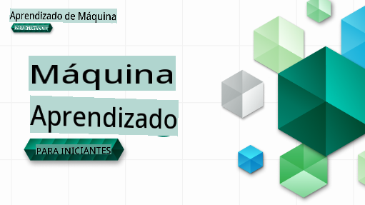

# Aprendizado de Máquina para Iniciantes - Um Currículo

> 🌍 Viaje pelo mundo enquanto exploramos o Aprendizado de Máquina por meio das culturas do mundo 🌍

Os Cloud Advocates da Microsoft têm o prazer de oferecer um currículo de 12 semanas, com 26 aulas, tudo sobre **Aprendizado de Máquina**. Neste currículo, você aprenderá sobre o que às vezes é chamado de **aprendizado de máquina clássico**, utilizando principalmente o Scikit-learn como biblioteca e evitando o aprendizado profundo, que é abordado em nosso [currículo de IA para Iniciantes](https://aka.ms/ai4beginners). Combine estas lições com nosso [currículo de 'Ciência de Dados para Iniciantes'](https://aka.ms/ds4beginners), também!

Viaje conosco pelo mundo enquanto aplicamos essas técnicas clássicas a dados de muitas áreas do mundo. Cada lição inclui questionários antes e depois da aula, instruções escritas para completar a lição, uma solução, uma tarefa e muito mais. Nossa pedagogia baseada em projetos permite que você aprenda enquanto constrói, uma maneira comprovada de fazer novas habilidades 'grudarem'.

**✍️ Agradecimentos especiais aos nossos autores** Jen Looper, Stephen Howell, Francesca Lazzeri, Tomomi Imura, Cassie Breviu, Dmitry Soshnikov, Chris Noring, Anirban Mukherjee, Ornella Altunyan, Ruth Yakubu e Amy Boyd

**🎨 Agradecimentos também aos nossos ilustradores** Tomomi Imura, Dasani Madipalli e Jen Looper

**🙏 Agradecimentos especiais 🙏 aos nossos autores, revisores e colaboradores de conteúdo Microsoft Student Ambassador**, notavelmente Rishit Dagli, Muhammad Sakib Khan Inan, Rohan Raj, Alexandru Petrescu, Abhishek Jaiswal, Nawrin Tabassum, Ioan Samuila e Snigdha Agarwal

**🤩 Agradecimentos extras aos Microsoft Student Ambassadors Eric Wanjau, Jasleen Sondhi e Vidushi Gupta por nossas lições de R!**

# Começando

Siga estas etapas:
1. **Faça um Fork do Repositório**: Clique no botão "Fork" no canto superior direito desta página.
2. **Clone o Repositório**:   `git clone https://github.com/microsoft/ML-For-Beginners.git`

> [encontre todos os recursos adicionais para este curso em nossa coleção do Microsoft Learn](https://learn.microsoft.com/en-us/collections/qrqzamz1nn2wx3?WT.mc_id=academic-77952-bethanycheum)

**[Estudantes](https://aka.ms/student-page)**, para usar este currículo, faça um fork de todo o repositório para sua própria conta do GitHub e complete os exercícios sozinho ou em grupo:

- Comece com um questionário pré-aula.
- Leia a aula e complete as atividades, pausando e refletindo a cada verificação de conhecimento.
- Tente criar os projetos compreendendo as lições em vez de executar o código da solução; no entanto, esse código está disponível nas pastas `/solution` em cada lição orientada a projetos.
- Faça o questionário pós-aula.
- Complete o desafio.
- Complete a tarefa.
- Após completar um grupo de lições, visite o [Fórum de Discussão](https://github.com/microsoft/ML-For-Beginners/discussions) e "aprenda em voz alta" preenchendo a rubrica PAT apropriada. Um 'PAT' é uma Ferramenta de Avaliação de Progresso que é uma rubrica que você preenche para aprofundar seu aprendizado. Você também pode reagir a outros PATs para que possamos aprender juntos.

> Para estudo adicional, recomendamos seguir estes módulos e trilhas de aprendizado do [Microsoft Learn](https://docs.microsoft.com/en-us/users/jenlooper-2911/collections/k7o7tg1gp306q4?WT.mc_id=academic-77952-leestott).

**Professores**, incluímos [algumas sugestões](for-teachers.md) sobre como usar este currículo.

---

## Vídeos explicativos

Algumas das lições estão disponíveis como vídeos curtos. Você pode encontrar todos esses vídeos dentro das lições ou na [playlist ML para Iniciantes no canal do YouTube da Microsoft Developer](https://aka.ms/ml-beginners-videos) clicando na imagem abaixo.

---

## Conheça a Equipe

**Gif por** [Mohit Jaisal](https://linkedin.com/in/mohitjaisal)

> 🎥 Clique na imagem acima para ver um vídeo sobre o projeto e as pessoas que o criaram!

---

## Pedagogia

Escolhemos dois princípios pedagógicos ao construir este currículo: garantir que ele seja prático **baseado em projetos** e que inclua **questionários frequentes**. Além disso, este currículo tem um **tema** comum para dar coesão.

Ao garantir que o conteúdo esteja alinhado com os projetos, o processo se torna mais envolvente para os alunos e a retenção dos conceitos será aumentada. Além disso, um questionário de baixo risco antes de uma aula estabelece a intenção do aluno em relação ao aprendizado de um tópico, enquanto um segundo questionário após a aula garante uma maior retenção. Este currículo foi projetado para ser flexível e divertido e pode ser realizado total ou parcialmente. Os projetos começam pequenos e se tornam cada vez mais complexos até o final do ciclo de 12 semanas. Este currículo também inclui um pós-escrito sobre aplicações do mundo real de ML, que pode ser usado como crédito extra ou como base para discussão.

> Encontre nosso [Código de Conduta](CODE_OF_CONDUCT.md), diretrizes de [Contribuição](CONTRIBUTING.md) e [Tradução](TRANSLATIONS.md). Agradecemos seu feedback construtivo!

## Cada lição inclui

- sketchnote opcional
- vídeo suplementar opcional
- vídeo explicativo (apenas algumas lições)
- questionário de aquecimento pré-aula
- lição escrita
- para lições baseadas em projetos, guias passo a passo sobre como construir o projeto
- verificações de conhecimento
- um desafio
- leitura suplementar
- tarefa
- questionário pós-aula

> **Uma nota sobre idiomas**: Essas lições são escritas principalmente em Python, mas muitas também estão disponíveis em R. Para completar uma lição de R, vá até a pasta `/solution` e procure lições de R. Elas incluem uma extensão .rmd que representa um **arquivo R Markdown**, que pode ser simplesmente definido como uma incorporação de `code chunks` (de R ou outras linguagens) e um `YAML header` (que orienta como formatar saídas como PDF) em um `Markdown document`. Assim, serve como uma estrutura de autoria exemplar para ciência de dados, pois permite que você combine seu código, sua saída e seus pensamentos ao permitir que você os escreva em Markdown. Além disso, documentos R Markdown podem ser renderizados em formatos de saída como PDF, HTML ou Word.

> **Uma nota sobre questionários**: Todos os questionários estão contidos na [pasta do aplicativo de questionários](../../quiz-app), totalizando 52 questionários de três perguntas cada. Eles estão vinculados dentro das lições, mas o aplicativo de questionários pode ser executado localmente; siga as instruções na pasta `quiz-app` para hospedar localmente ou implantar no Azure.

| Número da Lição |                             Tópico                              |                   Agrupamento da Lição                   | Objetivos de Aprendizado                                                                                                       |                                                              Lição Vinculada                                                               |                        Autor                        |
| :-------------: | :--------------------------------------------------------------: | :-----------------------------------------------------: | ------------------------------------------------------------------------------------------------------------------------------ | :--------------------------------------------------------------------------------------------------------------------------------------: | :--------------------------------------------------: |
|       01       |                Introdução ao aprendizado de máquina             |      [Introdução](1-Introduction/README.md)             | Aprender os conceitos básicos por trás do aprendizado de máquina                                                               |                                             [Lição](1-Introduction/1-intro-to-ML/README.md)                                             |                       Muhammad                       |
|       02       |                A História do aprendizado de máquina              |      [Introdução](1-Introduction/README.md)             | Aprender a história subjacente a este campo                                                                                   |                                            [Lição](1-Introduction/2-history-of-ML/README.md)                                            |                     Jen e Amy                       |
|       03       |                 Justiça e aprendizado de máquina                 |      [Introdução](1-Introduction/README.md)             | Quais são as questões filosóficas importantes em torno da justiça que os alunos devem considerar ao construir e aplicar modelos de ML? |                                              [Lição](1-Introduction/3-fairness/README.md)                                               |                        Tomomi                        |
|      04       |                Técnicas de aprendizado de máquina                 |      [Introdução](1-Introduction/README.md)       | Quais técnicas os pesquisadores de ML usam para construir modelos de ML?                                                                       |                                          [Aula](1-Introduction/4-techniques-of-ML/README.md)                                           |                    Chris e Jen                     |
|      05       |                   Introdução à regressão                   |        [Regressão](2-Regression/README.md)         | Comece com Python e Scikit-learn para modelos de regressão                                                                  |         <ul><li>[Python](2-Regression/1-Tools/README.md)</li><li>[R](../../2-Regression/1-Tools/solution/R/lesson_1.html)</li></ul>         |      <ul><li>Jen</li><li>Eric Wanjau</li></ul>       |
|      06       |                Preços de abóbora na América do Norte 🎃                |        [Regressão](2-Regression/README.md)         | Visualize e limpe os dados em preparação para ML                                                                                  |          <ul><li>[Python](2-Regression/2-Data/README.md)</li><li>[R](../../2-Regression/2-Data/solution/R/lesson_2.html)</li></ul>          |      <ul><li>Jen</li><li>Eric Wanjau</li></ul>       |
|      07       |                Preços de abóbora na América do Norte 🎃                |        [Regressão](2-Regression/README.md)         | Construa modelos de regressão linear e polinomial                                                                                   |        <ul><li>[Python](2-Regression/3-Linear/README.md)</li><li>[R](../../2-Regression/3-Linear/solution/R/lesson_3.html)</li></ul>        |      <ul><li>Jen e Dmitry</li><li>Eric Wanjau</li></ul>       |
|      08       |                Preços de abóbora na América do Norte 🎃                |        [Regressão](2-Regression/README.md)         | Construa um modelo de regressão logística                                                                                               |     <ul><li>[Python](2-Regression/4-Logistic/README.md) </li><li>[R](../../2-Regression/4-Logistic/solution/R/lesson_4.html)</li></ul>      |      <ul><li>Jen</li><li>Eric Wanjau</li></ul>       |
|      09       |                          Um App Web 🔌                          |           [App Web](3-Web-App/README.md)            | Construa um app web para usar seu modelo treinado                                                                                       |                                                 [Python](3-Web-App/1-Web-App/README.md)                                                  |                         Jen                          |
|      10       |                 Introdução à classificação                 |    [Classificação](4-Classification/README.md)     | Limpe, prepare e visualize seus dados; introdução à classificação                                                            | <ul><li> [Python](4-Classification/1-Introduction/README.md) </li><li>[R](../../4-Classification/1-Introduction/solution/R/lesson_10.html)  | <ul><li>Jen e Cassie</li><li>Eric Wanjau</li></ul> |
|      11       |             Deliciosas culinárias asiáticas e indianas 🍜             |    [Classificação](4-Classification/README.md)     | Introdução aos classificadores                                                                                                     | <ul><li> [Python](4-Classification/2-Classifiers-1/README.md)</li><li>[R](../../4-Classification/2-Classifiers-1/solution/R/lesson_11.html) | <ul><li>Jen e Cassie</li><li>Eric Wanjau</li></ul> |
|      12       |             Deliciosas culinárias asiáticas e indianas 🍜             |    [Classificação](4-Classification/README.md)     | Mais classificadores                                                                                                                | <ul><li> [Python](4-Classification/3-Classifiers-2/README.md)</li><li>[R](../../4-Classification/3-Classifiers-2/solution/R/lesson_12.html) | <ul><li>Jen e Cassie</li><li>Eric Wanjau</li></ul> |
|      13       |             Deliciosas culinárias asiáticas e indianas 🍜             |    [Classificação](4-Classification/README.md)     | Construa um app web de recomendação usando seu modelo                                                                                    |                                              [Python](4-Classification/4-Applied/README.md)                                              |                         Jen                          |
|      14       |                   Introdução ao agrupamento                   |        [Agrupamento](5-Clustering/README.md)         | Limpe, prepare e visualize seus dados; Introdução ao agrupamento                                                                |         <ul><li> [Python](5-Clustering/1-Visualize/README.md)</li><li>[R](../../5-Clustering/1-Visualize/solution/R/lesson_14.html)         |      <ul><li>Jen</li><li>Eric Wanjau</li></ul>       |
|      15       |              Explorando os Gostos Musicais Nigerianos 🎧              |        [Agrupamento](5-Clustering/README.md)         | Explore o método de agrupamento K-Means                                                                                           |           <ul><li> [Python](5-Clustering/2-K-Means/README.md)</li><li>[R](../../5-Clustering/2-K-Means/solution/R/lesson_15.html)           |      <ul><li>Jen</li><li>Eric Wanjau</li></ul>       |
|      16       |        Introdução ao processamento de linguagem natural ☕️         |   [Processamento de linguagem natural](6-NLP/README.md)    | Aprenda os conceitos básicos sobre PLN construindo um bot simples                                                                             |                                             [Python](6-NLP/1-Introduction-to-NLP/README.md)                                              |                       Stephen                        |
|      17       |                      Tarefas Comuns de PLN ☕️                      |   [Processamento de linguagem natural](6-NLP/README.md)    | Aprofunde seu conhecimento em PLN entendendo as tarefas comuns necessárias ao lidar com estruturas linguísticas                          |                                                    [Python](6-NLP/2-Tasks/README.md)                                                     |                       Stephen                        |
|      18       |             Tradução e Análise de Sentimento ♥️              |   [Processamento de linguagem natural](6-NLP/README.md)    | Tradução e análise de sentimento com Jane Austen                                                                             |                                            [Python](6-NLP/3-Translation-Sentiment/README.md)                                             |                       Stephen                        |
|      19       |                  Hotéis Românticos da Europa ♥️                  |   [Processamento de linguagem natural](6-NLP/README.md)    | Análise de sentimento com avaliações de hotéis 1                                                                                         |                                               [Python](6-NLP/4-Hotel-Reviews-1/README.md)                                                |                       Stephen                        |
|      20       |                  Hotéis Românticos da Europa ♥️                  |   [Processamento de linguagem natural](6-NLP/README.md)    | Análise de sentimento com avaliações de hotéis 2                                                                                         |                                               [Python](6-NLP/5-Hotel-Reviews-2/README.md)                                                |                       Stephen                        |
|      21       |            Introdução à Previsão de Séries Temporais             |        [Séries Temporais](7-TimeSeries/README.md)        | Introdução à previsão de séries temporais                                                                                         |                                             [Python](7-TimeSeries/1-Introduction/README.md)                                              |                      Francesca                       |
|      22       | ⚡️ Uso de Energia Mundial ⚡️ - previsão de séries temporais com ARIMA |        [Séries Temporais](7-TimeSeries/README.md)        | Previsão de séries temporais com ARIMA                                                                                              |                                                 [Python](7-TimeSeries/2-ARIMA/README.md)                                                 |                      Francesca                       |
|      23       |  ⚡️ Uso de Energia Mundial ⚡️ - previsão de séries temporais com SVR  |        [Séries Temporais](7-TimeSeries/README.md)        | Previsão de séries temporais com Regressor de Vetores de Suporte                                                                           |                                                  [Python](7-TimeSeries/3-SVR/README.md)                                                  |                       Anirban                        |
|      24       |             Introdução ao Aprendizado por Reforço             | [Aprendizado por Reforço](8-Reinforcement/README.md) | Introdução ao aprendizado por reforço com Q-Learning                                                                          |                                             [Python](8-Reinforcement/1-QLearning/README.md)                                              |                        Dmitry                        |
|      25       |                 Ajude Peter a evitar o lobo! 🐺                  | [Aprendizado por Reforço](8-Reinforcement/README.md) | Aprendizado por reforço no Gym                                                                                                      |                                                [Python](8-Reinforcement/2-Gym/README.md)                                                 |                        Dmitry                        |
|  Postscript   |            Cenários e Aplicações do ML no Mundo Real            |      [ML no Mundo Real](9-Real-World/README.md)       | Aplicações interessantes e reveladoras do ML clássico                                                               |                                             [Aula](9-Real-World/1-Applications/README.md)                                              |                         Equipe                         |
|  Postscript   |            Depuração de Modelos em ML usando o painel RAI          |      [ML no Mundo Real](9-Real-World/README.md)       | Depuração de modelos em Aprendizado de Máquina usando componentes do painel de IA Responsável                                                              |                                             [Aula](9-Real-World/2-Debugging-ML-Models/README.md)                                              |                         Ruth Yakubu                       |

> [encontre todos os recursos adicionais para este curso em nossa coleção do Microsoft Learn](https://learn.microsoft.com/en-us/collections/qrqzamz1nn2wx3?WT.mc_id=academic-77952-bethanycheum)

## Acesso Offline

Você pode executar esta documentação offline usando [Docsify](https://docsify.js.org/#/). Faça um fork deste repositório, [instale o Docsify](https://docsify.js.org/#/quickstart) em sua máquina local e, em seguida, na pasta raiz deste repositório, digite `docsify serve`. O site será servido na porta 3000 em seu localhost: `localhost:3000`.

## PDFs
Encontre um PDF do currículo com links [aqui](https://microsoft.github.io/ML-For-Beginners/pdf/readme.pdf).

## Ajuda Necessária

Você gostaria de contribuir com uma tradução? Por favor, leia nossas [diretrizes de tradução](TRANSLATIONS.md) e adicione uma questão com modelo para gerenciar a carga de trabalho [aqui](https://github.com/microsoft/ML-For-Beginners/issues).

## Outros Currículos

Nossa equipe produz outros currículos! Confira:

- [AI para Iniciantes](https://aka.ms/ai4beginners)
- [Ciência de Dados para Iniciantes](https://aka.ms/datascience-beginners)
- [**Nova Versão 2.0** - IA Generativa para Iniciantes](https://aka.ms/genai-beginners)
- [**NOVO** Cibersegurança para Iniciantes](https://github.com/microsoft/Security-101??WT.mc_id=academic-96948-sayoung)
- [Desenvolvimento Web para Iniciantes](https://aka.ms/webdev-beginners)
- [IoT para Iniciantes](https://aka.ms/iot-beginners)
- [Aprendizado de Máquina para Iniciantes](https://aka.ms/ml4beginners)
- [Desenvolvimento XR para Iniciantes](https://aka.ms/xr-dev-for-beginners)
- [Dominando o GitHub Copilot para Programação em Par com IA](https://aka.ms/GitHubCopilotAI)

**Isenção de responsabilidade**:  
Este documento foi traduzido utilizando serviços de tradução baseados em IA. Embora nos esforcemos pela precisão, esteja ciente de que traduções automáticas podem conter erros ou imprecisões. O documento original em seu idioma nativo deve ser considerado a fonte autoritativa. Para informações críticas, recomenda-se a tradução profissional por um humano. Não nos responsabilizamos por quaisquer mal-entendidos ou interpretações errôneas decorrentes do uso desta tradução.