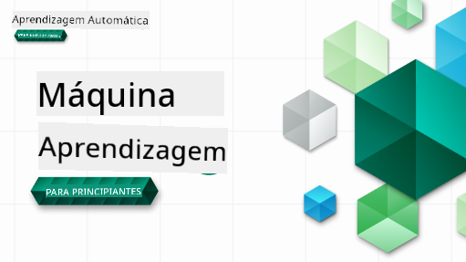

<!--
CO_OP_TRANSLATOR_METADATA:
{
  "original_hash": "b79add6cc71cc7468fa23c9cf42f2327",
  "translation_date": "2025-09-03T16:08:19+00:00",
  "source_file": "README.md",
  "language_code": "pt"
}
-->
  
  
  
  
  

  
  
  

### 🌐 Suporte Multilíngue  

#### Suportado via GitHub Action (Automatizado e Sempre Atualizado)  

[French](../fr/README.md) | [Spanish](../es/README.md) | [German](../de/README.md) | [Russian](../ru/README.md) | [Arabic](../ar/README.md) | [Persian (Farsi)](../fa/README.md) | [Urdu](../ur/README.md) | [Chinese (Simplified)](../zh/README.md) | [Chinese (Traditional, Macau)](../mo/README.md) | [Chinese (Traditional, Hong Kong)](../hk/README.md) | [Chinese (Traditional, Taiwan)](../tw/README.md) | [Japanese](../ja/README.md) | [Korean](../ko/README.md) | [Hindi](../hi/README.md) | [Bengali](../bn/README.md) | [Marathi](../mr/README.md) | [Nepali](../ne/README.md) | [Punjabi (Gurmukhi)](../pa/README.md) | [Portuguese (Portugal)](./README.md) | [Portuguese (Brazil)](../br/README.md) | [Italian](../it/README.md) | [Polish](../pl/README.md) | [Turkish](../tr/README.md) | [Greek](../el/README.md) | [Thai](../th/README.md) | [Swedish](../sv/README.md) | [Danish](../da/README.md) | [Norwegian](../no/README.md) | [Finnish](../fi/README.md) | [Dutch](../nl/README.md) | [Hebrew](../he/README.md) | [Vietnamese](../vi/README.md) | [Indonesian](../id/README.md) | [Malay](../ms/README.md) | [Tagalog (Filipino)](../tl/README.md) | [Swahili](../sw/README.md) | [Hungarian](../hu/README.md) | [Czech](../cs/README.md) | [Slovak](../sk/README.md) | [Romanian](../ro/README.md) | [Bulgarian](../bg/README.md) | [Serbian (Cyrillic)](../sr/README.md) | [Croatian](../hr/README.md) | [Slovenian](../sl/README.md) | [Ukrainian](../uk/README.md) | [Burmese (Myanmar)](../my/README.md)  

#### Junte-se à Comunidade  

  

# Aprendizagem Automática para Iniciantes - Um Currículo  

> 🌍 Viaje pelo mundo enquanto exploramos Aprendizagem Automática através de culturas globais 🌍  

Os Cloud Advocates da Microsoft têm o prazer de oferecer um currículo de 12 semanas e 26 lições sobre **Aprendizagem Automática**. Neste currículo, aprenderá sobre o que é frequentemente chamado de **aprendizagem automática clássica**, utilizando principalmente a biblioteca Scikit-learn e evitando aprendizagem profunda, que é abordada no nosso [currículo de IA para Iniciantes](https://aka.ms/ai4beginners). Combine estas lições com o nosso currículo ['Ciência de Dados para Iniciantes'](https://aka.ms/ds4beginners), também!  

Viaje connosco pelo mundo enquanto aplicamos estas técnicas clássicas a dados de várias regiões do globo. Cada lição inclui questionários antes e depois da aula, instruções escritas para completar a lição, uma solução, um exercício e muito mais. A nossa pedagogia baseada em projetos permite-lhe aprender enquanto constrói, uma forma comprovada de fazer com que novas competências se fixem.  

**✍️ Um agradecimento especial aos nossos autores** Jen Looper, Stephen Howell, Francesca Lazzeri, Tomomi Imura, Cassie Breviu, Dmitry Soshnikov, Chris Noring, Anirban Mukherjee, Ornella Altunyan, Ruth Yakubu e Amy Boyd  

**🎨 Agradecimentos também aos nossos ilustradores** Tomomi Imura, Dasani Madipalli e Jen Looper  

**🙏 Agradecimentos especiais 🙏 aos nossos Microsoft Student Ambassador autores, revisores e contribuidores de conteúdo**, nomeadamente Rishit Dagli, Muhammad Sakib Khan Inan, Rohan Raj, Alexandru Petrescu, Abhishek Jaiswal, Nawrin Tabassum, Ioan Samuila e Snigdha Agarwal  

**🤩 Gratidão extra aos Microsoft Student Ambassadors Eric Wanjau, Jasleen Sondhi e Vidushi Gupta pelas nossas lições em R!**  

# Começar  

Siga estes passos:  
1. **Faça um Fork do Repositório**: Clique no botão "Fork" no canto superior direito desta página.  
2. **Clone o Repositório**:   `git clone https://github.com/microsoft/ML-For-Beginners.git`  

> [encontre todos os recursos adicionais para este curso na nossa coleção Microsoft Learn](https://learn.microsoft.com/en-us/collections/qrqzamz1nn2wx3?WT.mc_id=academic-77952-bethanycheum)  

**[Estudantes](https://aka.ms/student-page)**, para utilizar este currículo, faça um fork de todo o repositório para a sua própria conta GitHub e complete os exercícios sozinho ou em grupo:  

- Comece com um questionário antes da aula.  
- Leia a aula e complete as atividades, pausando e refletindo em cada verificação de conhecimento.  
- Tente criar os projetos compreendendo as lições em vez de executar o código da solução; no entanto, esse código está disponível nas pastas `/solution` em cada lição orientada por projeto.  
- Faça o questionário após a aula.  
- Complete o desafio.  
- Complete o exercício.  
- Após completar um grupo de lições, visite o [Fórum de Discussão](https://github.com/microsoft/ML-For-Beginners/discussions) e "aprenda em voz alta" preenchendo o PAT apropriado. Um 'PAT' é uma Ferramenta de Avaliação de Progresso que é um rubrica que preenche para aprofundar a sua aprendizagem. Também pode reagir a outros PATs para aprendermos juntos.  

> Para estudo adicional, recomendamos seguir estes [Microsoft Learn](https://docs.microsoft.com/en-us/users/jenlooper-2911/collections/k7o7tg1gp306q4?WT.mc_id=academic-77952-leestott) módulos e percursos de aprendizagem.  

**Professores**, incluímos [algumas sugestões](for-teachers.md) sobre como utilizar este currículo.  

---  

## Vídeos explicativos  

Algumas das lições estão disponíveis em formato de vídeo curto. Pode encontrar todos estes vídeos nas lições ou na [playlist ML para Iniciantes no canal Microsoft Developer no YouTube](https://aka.ms/ml-beginners-videos) clicando na imagem abaixo.  

  

---  

## Conheça a Equipa  

  

**Gif por** [Mohit Jaisal](https://linkedin.com/in/mohitjaisal)  

> 🎥 Clique na imagem acima para ver um vídeo sobre o projeto e as pessoas que o criaram!  

---  

## Pedagogia  

Escolhemos dois princípios pedagógicos ao construir este currículo: garantir que é **baseado em projetos práticos** e que inclui **questionários frequentes**. Além disso, este currículo tem um **tema comum** para lhe dar coesão.  

Ao garantir que o conteúdo está alinhado com projetos, o processo torna-se mais envolvente para os estudantes e a retenção de conceitos será aumentada. Além disso, um questionário de baixo risco antes da aula define a intenção do estudante em aprender um tópico, enquanto um segundo questionário após a aula garante uma maior retenção. Este currículo foi projetado para ser flexível e divertido e pode ser realizado na totalidade ou em parte. Os projetos começam pequenos e tornam-se progressivamente mais complexos até ao final do ciclo de 12 semanas. Este currículo também inclui um pós-escrito sobre aplicações reais de ML, que pode ser usado como crédito extra ou como base para discussão.  

> Encontre o nosso [Código de Conduta](CODE_OF_CONDUCT.md), [Contribuição](CONTRIBUTING.md) e diretrizes de [Tradução](TRANSLATIONS.md). Agradecemos o seu feedback construtivo!  

## Cada lição inclui  

- sketchnote opcional  
- vídeo suplementar opcional  
- vídeo explicativo (apenas algumas lições)  
- questionário de aquecimento antes da aula  
- lição escrita  
- para lições baseadas em projetos, guias passo a passo sobre como construir o projeto  
- verificações de conhecimento  
- um desafio  
- leitura suplementar  
- exercício  
- questionário após a aula  

> **Uma nota sobre linguagens**: Estas lições são escritas principalmente em Python, mas muitas também estão disponíveis em R. Para completar uma lição em R, vá à pasta `/solution` e procure lições em R. Elas incluem uma extensão .rmd que representa um ficheiro **R Markdown**, que pode ser definido como uma incorporação de `blocos de código` (de R ou outras linguagens) e um `cabeçalho YAML` (que orienta como formatar saídas como PDF) num `documento Markdown`. Assim, serve como um excelente framework de autoria para ciência de dados, pois permite combinar o seu código, os seus resultados e os seus pensamentos, permitindo que os escreva em Markdown. Além disso, documentos R Markdown podem ser renderizados em formatos de saída como PDF, HTML ou Word.  

> **Uma nota sobre questionários**: Todos os questionários estão contidos na pasta [Quiz App](../../quiz-app), num total de 52 questionários com três perguntas cada. Estão ligados dentro das lições, mas a aplicação de questionários pode ser executada localmente; siga as instruções na pasta `quiz-app` para hospedar localmente ou implementar no Azure.  

| Número da Lição |                             Tópico                              |                   Agrupamento de Lições                   | Objetivos de Aprendizagem                                                                                                        |                                                              Lição Ligada                                                               |                        Autor                        |  
| :-------------: | :------------------------------------------------------------: | :------------------------------------------------------: | ------------------------------------------------------------------------------------------------------------------------------- | :--------------------------------------------------------------------------------------------------------------------------------------: | :--------------------------------------------------: |  
|        01       |                Introdução à aprendizagem automática            |      [Introdução](1-Introduction/README.md)              | Aprenda os conceitos básicos por trás da aprendizagem automática                                                                |                                             [Lição](1-Introduction/1-intro-to-ML/README.md)                                             |                       Muhammad                       |  
|        02       |                A História da aprendizagem automática           |      [Introdução](1-Introduction/README.md)              | Aprenda a história por trás deste campo                                                                                        |                                            [Lição](1-Introduction/2-history-of-ML/README.md)                                            |                     Jen e Amy                      |  
|        03       |                 Justiça e aprendizagem automática              |      [Introdução](1-Introduction/README.md)              | Quais são as questões filosóficas importantes sobre justiça que os estudantes devem considerar ao construir e aplicar modelos de ML? |                                              [Lição](1-Introduction/3-fairness/README.md)                                               |                        Tomomi                        |  
|        04       |                Técnicas para aprendizagem automática           |      [Introdução](1-Introduction/README.md)              | Quais técnicas os investigadores de ML utilizam para construir modelos de ML?                                                  |                                          [Lição](1-Introduction/4-techniques-of-ML/README.md)                                           |                    Chris e Jen                     |  
|      05       |                   Introdução à regressão                      |        [Regression](2-Regression/README.md)         | Comece a trabalhar com Python e Scikit-learn para modelos de regressão                                                          |         
<ul><li>[Python](2-Regression/1-Tools/README.md)</li><li>[R](../../2-Regression/1-Tools/solution/R/lesson_1.html)</li></ul>         |      <ul><li>Jen</li><li>Eric Wanjau</li></ul>       |
|      06       |                Preços de abóboras na América do Norte 🎃       |        [Regression](2-Regression/README.md)         | Visualize e limpe os dados em preparação para ML                                                                               |          <ul><li>[Python](2-Regression/2-Data/README.md)</li><li>[R](../../2-Regression/2-Data/solution/R/lesson_2.html)</li></ul>          |      <ul><li>Jen</li><li>Eric Wanjau</li></ul>       |
|      07       |                Preços de abóboras na América do Norte 🎃       |        [Regression](2-Regression/README.md)         | Construa modelos de regressão linear e polinomial                                                                              |        <ul><li>[Python](2-Regression/3-Linear/README.md)</li><li>[R](../../2-Regression/3-Linear/solution/R/lesson_3.html)</li></ul>        |      <ul><li>Jen e Dmitry</li><li>Eric Wanjau</li></ul>       |
|      08       |                Preços de abóboras na América do Norte 🎃       |        [Regression](2-Regression/README.md)         | Construa um modelo de regressão logística                                                                                      |     <ul><li>[Python](2-Regression/4-Logistic/README.md) </li><li>[R](../../2-Regression/4-Logistic/solution/R/lesson_4.html)</li></ul>      |      <ul><li>Jen</li><li>Eric Wanjau</li></ul>       |
|      09       |                          Uma aplicação web 🔌                  |           [Web App](3-Web-App/README.md)            | Construa uma aplicação web para usar o seu modelo treinado                                                                     |                                                 [Python](3-Web-App/1-Web-App/README.md)                                                  |                         Jen                          |
|      10       |                 Introdução à classificação                     |    [Classification](4-Classification/README.md)     | Limpe, prepare e visualize os seus dados; introdução à classificação                                                           | <ul><li> [Python](4-Classification/1-Introduction/README.md) </li><li>[R](../../4-Classification/1-Introduction/solution/R/lesson_10.html)  | <ul><li>Jen e Cassie</li><li>Eric Wanjau</li></ul> |
|      11       |             Deliciosas culinárias asiáticas e indianas 🍜      |    [Classification](4-Classification/README.md)     | Introdução aos classificadores                                                                                                 | <ul><li> [Python](4-Classification/2-Classifiers-1/README.md)</li><li>[R](../../4-Classification/2-Classifiers-1/solution/R/lesson_11.html) | <ul><li>Jen e Cassie</li><li>Eric Wanjau</li></ul> |
|      12       |             Deliciosas culinárias asiáticas e indianas 🍜      |    [Classification](4-Classification/README.md)     | Mais classificadores                                                                                                           | <ul><li> [Python](4-Classification/3-Classifiers-2/README.md)</li><li>[R](../../4-Classification/3-Classifiers-2/solution/R/lesson_12.html) | <ul><li>Jen e Cassie</li><li>Eric Wanjau</li></ul> |
|      13       |             Deliciosas culinárias asiáticas e indianas 🍜      |    [Classification](4-Classification/README.md)     | Construa uma aplicação web de recomendação usando o seu modelo                                                                 |                                              [Python](4-Classification/4-Applied/README.md)                                              |                         Jen                          |
|      14       |                   Introdução à clusterização                   |        [Clustering](5-Clustering/README.md)         | Limpe, prepare e visualize os seus dados; introdução à clusterização                                                           |         <ul><li> [Python](5-Clustering/1-Visualize/README.md)</li><li>[R](../../5-Clustering/1-Visualize/solution/R/lesson_14.html)         |      <ul><li>Jen</li><li>Eric Wanjau</li></ul>       |
|      15       |              Explorando gostos musicais nigerianos 🎧          |        [Clustering](5-Clustering/README.md)         | Explore o método de clusterização K-Means                                                                                      |           <ul><li> [Python](5-Clustering/2-K-Means/README.md)</li><li>[R](../../5-Clustering/2-K-Means/solution/R/lesson_15.html)           |      <ul><li>Jen</li><li>Eric Wanjau</li></ul>       |
|      16       |        Introdução ao processamento de linguagem natural ☕️    |   [Natural language processing](6-NLP/README.md)    | Aprenda o básico sobre PLN construindo um bot simples                                                                          |                                             [Python](6-NLP/1-Introduction-to-NLP/README.md)                                              |                       Stephen                        |
|      17       |                      Tarefas comuns de PLN ☕️                 |   [Natural language processing](6-NLP/README.md)    | Aprofunde o seu conhecimento em PLN entendendo tarefas comuns ao lidar com estruturas de linguagem                             |                                                    [Python](6-NLP/2-Tasks/README.md)                                                     |                       Stephen                        |
|      18       |             Tradução e análise de sentimentos ♥️              |   [Natural language processing](6-NLP/README.md)    | Tradução e análise de sentimentos com Jane Austen                                                                              |                                            [Python](6-NLP/3-Translation-Sentiment/README.md)                                             |                       Stephen                        |
|      19       |                  Hotéis românticos da Europa ♥️               |   [Natural language processing](6-NLP/README.md)    | Análise de sentimentos com avaliações de hotéis 1                                                                              |                                               [Python](6-NLP/4-Hotel-Reviews-1/README.md)                                                |                       Stephen                        |
|      20       |                  Hotéis românticos da Europa ♥️               |   [Natural language processing](6-NLP/README.md)    | Análise de sentimentos com avaliações de hotéis 2                                                                              |                                               [Python](6-NLP/5-Hotel-Reviews-2/README.md)                                                |                       Stephen                        |
|      21       |            Introdução à previsão de séries temporais          |        [Time series](7-TimeSeries/README.md)        | Introdução à previsão de séries temporais                                                                                      |                                             [Python](7-TimeSeries/1-Introduction/README.md)                                              |                      Francesca                       |
|      22       | ⚡️ Consumo de energia mundial ⚡️ - previsão com ARIMA         |        [Time series](7-TimeSeries/README.md)        | Previsão de séries temporais com ARIMA                                                                                         |                                                 [Python](7-TimeSeries/2-ARIMA/README.md)                                                 |                      Francesca                       |
|      23       |  ⚡️ Consumo de energia mundial ⚡️ - previsão com SVR          |        [Time series](7-TimeSeries/README.md)        | Previsão de séries temporais com Support Vector Regressor                                                                      |                                                  [Python](7-TimeSeries/3-SVR/README.md)                                                  |                       Anirban                        |
|      24       |             Introdução ao aprendizado por reforço             | [Reinforcement learning](8-Reinforcement/README.md) | Introdução ao aprendizado por reforço com Q-Learning                                                                           |                                             [Python](8-Reinforcement/1-QLearning/README.md)                                              |                        Dmitry                        |
|      25       |                 Ajude o Peter a evitar o lobo! 🐺             | [Reinforcement learning](8-Reinforcement/README.md) | Gym de aprendizado por reforço                                                                                                 |                                                [Python](8-Reinforcement/2-Gym/README.md)                                                 |                        Dmitry                        |
|  Postscript   |            Cenários e aplicações reais de ML                  |      [ML in the Wild](9-Real-World/README.md)       | Aplicações reais interessantes e reveladoras de ML clássico                                                                    |                                             [Lesson](9-Real-World/1-Applications/README.md)                                              |                         Team                         |
|  Postscript   |            Depuração de modelos de ML com RAI dashboard       |      [ML in the Wild](9-Real-World/README.md)       | Depuração de modelos de Machine Learning usando componentes do painel de IA Responsável                                        |                                             [Lesson](9-Real-World/2-Debugging-ML-Models/README.md)                                       |                         Ruth Yakubu                  |

> [encontre todos os recursos adicionais para este curso na nossa coleção Microsoft Learn](https://learn.microsoft.com/en-us/collections/qrqzamz1nn2wx3?WT.mc_id=academic-77952-bethanycheum)

## Acesso offline

Pode executar esta documentação offline utilizando o [Docsify](https://docsify.js.org/#/). Faça um fork deste repositório, [instale o Docsify](https://docsify.js.org/#/quickstart) na sua máquina local e, na pasta raiz deste repositório, digite `docsify serve`. O site será servido na porta 3000 no seu localhost: `localhost:3000`.

## PDFs

Encontre um PDF do currículo com links [aqui](https://microsoft.github.io/ML-For-Beginners/pdf/readme.pdf).

## 🎒 Outros Cursos 

A nossa equipa produz outros cursos! Confira:

- [Generative AI for Beginners](https://aka.ms/genai-beginners)
- [Generative AI for Beginners .NET](https://github.com/microsoft/Generative-AI-for-beginners-dotnet)
- [Generative AI with JavaScript](https://github.com/microsoft/generative-ai-with-javascript)
- [Generative AI with Java](https://github.com/microsoft/Generative-AI-for-beginners-java)
- [AI for Beginners](https://aka.ms/ai-beginners)
- [Data Science for Beginners](https://aka.ms/datascience-beginners)
- [ML for Beginners](https://aka.ms/ml-beginners)
- [Cybersecurity for Beginners](https://github.com/microsoft/Security-101) 
- [Web Dev for Beginners](https://aka.ms/webdev-beginners)
- [IoT for Beginners](https://aka.ms/iot-beginners)
- [XR Development for Beginners](https://github.com/microsoft/xr-development-for-beginners)
- [Mastering GitHub Copilot for Paired Programming](https://github.com/microsoft/Mastering-GitHub-Copilot-for-Paired-Programming)
- [Mastering GitHub Copilot for C#/.NET Developers](https://github.com/microsoft/mastering-github-copilot-for-dotnet-csharp-developers)
- [Choose Your Own Copilot Adventure](https://github.com/microsoft/CopilotAdventures)

---

**Aviso Legal**:  
Este documento foi traduzido utilizando o serviço de tradução por IA [Co-op Translator](https://github.com/Azure/co-op-translator). Embora nos esforcemos para garantir a precisão, é importante notar que traduções automáticas podem conter erros ou imprecisões. O documento original na sua língua nativa deve ser considerado a fonte autoritária. Para informações críticas, recomenda-se a tradução profissional realizada por humanos. Não nos responsabilizamos por quaisquer mal-entendidos ou interpretações incorretas decorrentes da utilização desta tradução.