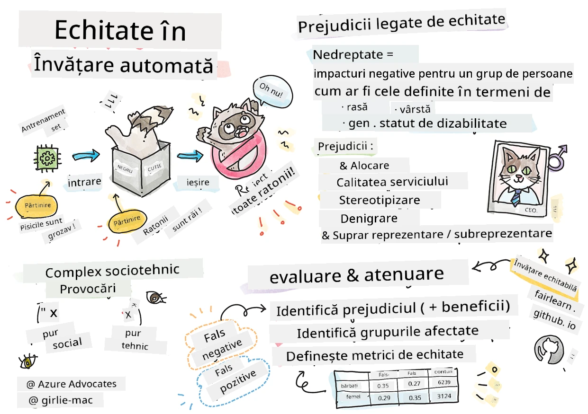

# Construirea soluțiilor de Machine Learning cu AI responsabil
 

> Sketchnote de [Tomomi Imura](https://www.twitter.com/girlie_mac)

## [Test înainte de lecție](https://ff-quizzes.netlify.app/en/ml/)
 
## Introducere

În acest curriculum, vei începe să descoperi cum învățarea automată poate și impactează viața noastră de zi cu zi. Chiar acum, sistemele și modelele sunt implicate în sarcini zilnice de luare a deciziilor, cum ar fi diagnostice medicale, aprobări de împrumuturi sau detectarea fraudelor. Prin urmare, este important ca aceste modele să funcționeze bine pentru a oferi rezultate de încredere. La fel ca orice aplicație software, sistemele AI pot să nu corespundă așteptărilor sau să aibă un rezultat nedorit. De aceea este esențial să înțelegem și să explicăm comportamentul unui model AI.

Imaginează-ți ce se poate întâmpla când datele pe care le folosești pentru construirea acestor modele lipsesc anumite demografii, cum ar fi rasa, genul, orientarea politică, religia, sau reprezintă disproporționat astfel de demografii. Ce se întâmplă când rezultatul modelului este interpretat în favoarea unui anumit grup demografic? Care este consecința pentru aplicație? În plus, ce se întâmplă când modelul are un rezultat advers și este dăunător pentru oameni? Cine este responsabil pentru comportamentul sistemelor AI? Acestea sunt câteva întrebări pe care le vom explora în acest curriculum.

În această lecție vei:

- Să-ți crești conștientizarea asupra importanței echității în învățarea automată și a daunelor legate de echitate.
- Să te familiarizezi cu practica explorării excepțiilor și scenariilor neobișnuite pentru a asigura fiabilitatea și siguranța.
- Să dobândești înțelegere despre nevoia de a împuternici pe toată lumea prin proiectarea sistemelor incluzive.
- Să explorezi cât de vital este să protejezi intimitatea și securitatea datelor și a persoanelor.
- Să vezi importanța unei abordări transparențe pentru a explica comportamentul modelelor AI.
- Să fii atent la cum responsabilitatea este esențială pentru a construi încredere în sistemele AI.

## Cerințe prealabile

Ca cerință prealabilă, te rugăm să parcurgi "Principiile AI-ului Responsabil" în cadrul unui traseu de învățare și să urmărești videoclipul de mai jos pe acest subiect:

Află mai multe despre AI responsabil urmând acest [Traseu de învățare](https://docs.microsoft.com/learn/modules/responsible-ai-principles/?WT.mc_id=academic-77952-leestott)

> 🎥 Click pe imaginea de mai sus pentru un video: Abordarea Microsoft față de AI responsabil

## Echitate

Sistemele AI ar trebui să trateze pe toată lumea în mod echitabil și să evite să afecteze grupuri similare de oameni în moduri diferite. De exemplu, când sistemele AI oferă recomandări pentru tratament medical, aplicații de împrumuturi sau angajare, ele ar trebui să facă aceleași recomandări pentru toți cu simptome similare, condiții financiare sau calificări profesionale asemănătoare. Fiecare dintre noi ca oameni purtăm prejudecăți moștenite care ne influențează deciziile și acțiunile. Aceste prejudecăți pot fi evidente în datele folosite pentru antrenarea sistemelor AI. O astfel de manipulare poate apărea uneori neintenționat. Este adesea dificil de conștientizat când introduci un bias în date.

**„Nedreptatea”** cuprinde impacturi negative, sau „daune”, pentru un grup de oameni, cum ar fi cele definite prin rasă, gen, vârstă sau statut de dizabilitate. Principalele daune legate de echitate pot fi clasificate astfel:

- **Alocare**, dacă un gen sau o etnie, de exemplu, este favorizată în detrimentul altuia.
- **Calitatea serviciului**. Dacă antrenezi date pentru un scenariu specific, dar realitatea este mult mai complexă, rezultă un serviciu slab. De exemplu, un dozator de săpun care nu poate detecta persoane cu piele închisă la culoare. [Referință](https://gizmodo.com/why-cant-this-soap-dispenser-identify-dark-skin-1797931773)
- **Denigrare**. Criticarea și etichetarea nedreaptă a unui lucru sau persoană. De exemplu, o tehnologie de etichetare a imaginilor care a etichetat infam imagini ale persoanelor cu piele închisă la culoare ca gorile.
- **Supra- sau subreprezentare**. Ideea este că un grup anume nu apare într-o anumită profesie, iar orice serviciu sau funcție ce promovează acest lucru contribuie la daune.
- **Stereotipizare**. Asocierea unui grup cu atribute prealabile atribuite. De exemplu, un sistem de traducere între engleză și turcă poate avea inexactități din cauza cuvintelor cu asocieri stereotipice de gen.

> traducere în turcă

> traducere înapoi în engleză

La proiectarea și testarea sistemelor AI, trebuie să ne asigurăm că AI este echitabil și nu este programat să ia decizii părtinitoare sau discriminatorii, decizii pe care oamenii sunt de asemenea opriți să le ia. Garantarea echității în AI și învățarea automată rămâne o provocare sociotehnică complexă.

### Fiabilitate și siguranță

Pentru a construi încredere, sistemele AI trebuie să fie fiabile, sigure și consistente în condiții normale și neașteptate. Este important să știm cum se vor comporta sistemele AI în diverse situații, mai ales când sunt excepții. La construirea soluțiilor AI trebuie să existe un focus substanțial pe gestionarea unei varietăți largi de circumstanțe pe care soluțiile AI le-ar putea întâlni. De exemplu, o mașină autonomă trebuie să pună siguranța oamenilor pe primul loc. Drept urmare, AI care conduce mașina trebuie să ia în considerare toate scenariile posibile pe care mașina le-ar putea întâlni, cum ar fi noaptea, furtuni sau ninsori puternice, copii care traversează strada, animale de companie, construcții rutiere etc. Cât de bine poate gestiona un sistem AI o gamă largă de condiții în mod fiabil și sigur reflectă nivelul de anticipare pe care l-a avut omul de știință în date sau dezvoltatorul AI în timpul proiectării sau testării sistemului.

> [🎥 Click aici pentru un video: ](https://www.microsoft.com/videoplayer/embed/RE4vvIl)

### Incluziune

Sistemele AI trebuie proiectate pentru a implica și împuternici pe toată lumea. La proiectarea și implementarea sistemelor AI, oamenii de știință în date și dezvoltatorii AI identifică și abordează posibile bariere în sistem care ar putea exclude neintenționat oamenii. De exemplu, există 1 miliard de persoane cu dizabilități în întreaga lume. Odată cu avansul AI, acestea pot accesa o gamă largă de informații și oportunități mai ușor în viața lor de zi cu zi. Prin eliminarea barierelor se creează oportunități de a inova și dezvolta produse AI cu experiențe mai bune care să beneficieze pe toată lumea.

> [🎥 Click aici pentru un video: incluziune în AI](https://www.microsoft.com/videoplayer/embed/RE4vl9v)

### Securitate și intimitate

Sistemele AI trebuie să fie sigure și să respecte intimitatea persoanelor. Oamenii au mai puțină încredere în sistemele care le pun intimitatea, informațiile sau viețile în pericol. Când antrenăm modelele de învățare automată, ne bazăm pe date pentru a obține cele mai bune rezultate. În acest proces, trebuie să considerăm originea datelor și integritatea acestora. De exemplu, datele au fost furnizate de utilizator sau sunt disponibile public? În plus, în timpul lucrului cu datele, este crucial să dezvoltăm sisteme AI care să poată proteja informațiile confidențiale și să reziste atacurilor. Pe măsură ce AI devine tot mai răspândit, protejarea intimității și securizarea informațiilor personale și de afaceri importante devin din ce în ce mai critice și complexe. Problemele de intimitate și securitate a datelor necesită o atenție deosebită pentru AI pentru că accesul la date este esențial pentru ca sistemele AI să facă predicții și decizii corecte și informate despre oameni.

> [🎥 Click aici pentru un video: securitate în AI](https://www.microsoft.com/videoplayer/embed/RE4voJF)

- Ca industrie, am făcut progrese semnificative în intimitate și securitate, impulsionate semnificativ de reglementări precum GDPR (Regulamentul General pentru Protecția Datelor).
- Totuși, în cazul sistemelor AI trebuie să recunoaștem tensiunea dintre necesitatea de mai multe date personale pentru a face sistemele mai personale și eficiente – și intimitate.
- La fel cum la nașterea calculatoarelor conectate la internet am văzut o creștere masivă a problemelor de securitate, vedem acum o creștere semnificativă a problemelor de securitate legate de AI.
- În același timp, am văzut AI folosit pentru îmbunătățirea securității. De exemplu, majoritatea scanerelor antivirale moderne sunt astăzi conduse de euristici AI.
- Trebuie să ne asigurăm că procesele noastre de Data Science sunt în armonie cu cele mai noi practici de intimitate și securitate.

### Transparență
Sistemele AI trebuie să fie înțelese. O parte crucială a transparenței este explicarea comportamentului sistemelor AI și a componentelor acestora. Îmbunătățirea înțelegerii sistemelor AI necesită ca părțile interesate să înțeleagă cum și de ce funcționează astfel încât să poată identifica eventuale probleme de performanță, preocupări de siguranță și intimitate, prejudecăți, practici excluzive sau rezultate nedorite. Credem, de asemenea, că cei care folosesc sistemele AI trebuie să fie sinceri și deschiși privind când, de ce și cum aleg să le utilizeze. Dar și limitările sistemelor pe care le folosesc. De exemplu, dacă o bancă folosește un sistem AI pentru a susține deciziile de creditare către consumatori, este important să examineze rezultatele și să înțeleagă ce date influențează recomandările sistemului. Guvernele încep să reglementeze AI-ul în diverse industrii, așa că oamenii de știință în date și organizațiile trebuie să explice dacă un sistem AI respectă cerințele reglementărilor, mai ales când există un rezultat nedorit.

> [🎥 Click aici pentru un video: transparență în AI](https://www.microsoft.com/videoplayer/embed/RE4voJF)

- Pentru că sistemele AI sunt atât de complexe, este greu să înțelegem cum funcționează și să interpretăm rezultatele.
- Această lipsă de înțelegere afectează modul în care aceste sisteme sunt gestionate, operaționalizate și documentate.
- Mai important, lipsa de înțelegere afectează deciziile luate folosind rezultatele produse de aceste sisteme.

### Responsabilitate
 
Persoanele care proiectează și implementează sistemele AI trebuie să fie responsabile pentru modul în care operază sistemele lor. Nevoia de responsabilitate este deosebit de crucială în cazul tehnologiilor sensibile, cum ar fi recunoașterea facială. Recent, există o cerere crescândă pentru tehnologia de recunoaștere facială, în special din partea organizațiilor de aplicare a legii care văd potențialul acestei tehnologii în utilizări precum găsirea copiilor dispăruți. Totuși, aceste tehnologii ar putea fi folosite de un guvern pentru a pune în pericol libertățile fundamentale ale cetățenilor prin, de exemplu, monitorizarea continuă a persoanelor specifice. Prin urmare, oamenii de știință în date și organizațiile trebuie să fie responsabile pentru modul în care sistemul lor AI influențează indivizii sau societatea.

> 🎥 Click pe imaginea de mai sus pentru un video: Avertismente despre supravegherea în masă prin recunoaștere facială

În cele din urmă, una dintre cele mai mari întrebări pentru generația noastră, ca prima generație care aduce AI în societate, este cum să asigurăm că calculatoarele vor rămâne responsabile față de oameni și cum să asigurăm că persoanele care proiectează calculatoarele rămân responsabile față de toți ceilalți.

## Evaluarea impactului

Înainte de a antrena un model de învățare automată, este important să se efectueze o evaluare a impactului pentru a înțelege scopul sistemului AI; care este utilizarea intenționată; unde va fi implementat; și cine va interacționa cu sistemul. Acestea sunt utile pentru recenzori sau testeri care evaluează sistemul să știe ce factori să ia în considerare la identificarea riscurilor potențiale și a consecințelor așteptate.

Următoarele sunt domenii de interes la efectuarea unei evaluări a impactului:

* **Impact advers asupra indivizilor**. A fi conștient de orice restricții sau cerințe, utilizare nesuportată sau orice limitări cunoscute ce pot afecta performanța sistemului este vital pentru a asigura că sistemul nu este folosit într-un mod care să cauzeze daune indivizilor.
* **Cerințe privind datele**. Înțelegerea modului și locului unde sistemul va folosi datele permite recenzenților să exploreze orice cerințe de date de care trebuie să se țină cont (de ex. regulamente GDPR sau HIPAA). În plus, să examineze dacă sursa sau cantitatea de date este suficientă pentru antrenare.
* **Sumar al impactului**. Strânge o listă de potențiale daune care pot apărea din utilizarea sistemului. Pe tot parcursul ciclului de viață al ML, verifică dacă problemele identificate sunt atenuate sau rezolvate.
* **Obiective aplicabile** pentru fiecare dintre cele șase principii de bază. Evaluează dacă obiectivele fiecăruia dintre principii sunt atinse și dacă există lacune.

## Depanare cu AI responsabil

Asemenea depanării unei aplicații software, depanarea unui sistem AI este un proces necesar de identificare și rezolvare a problemelor din sistem. Există mulți factori care pot determina un model să nu performeze conform așteptărilor sau responsabil. Majoritatea metricilor tradiționale de performanță a modelului sunt agregate cantitative ale performanței modelului, care nu sunt suficiente pentru a analiza cum un model încalcă principiile AI responsabile. Mai mult, un model de învățare automată este o cutie neagră care face dificilă înțelegerea ce determină rezultatul său sau oferirea unei explicații când face o greșeală. Mai târziu în acest curs, vom învăța cum să folosim tabloul de bord Responsible AI pentru a ajuta la depanarea sistemelor AI. Tabloul de bord oferă un instrument holistic pentru oamenii de știință în date și dezvoltatorii AI pentru a realiza:

* **Analiza erorilor**. Pentru a identifica distribuția erorilor modelului care poate afecta echitatea sau fiabilitatea sistemului.
* **Prezentare generală a modelului**. Pentru a descoperi unde există disparități în performanța modelului pe diferite cohorte de date.
* **Analiza datelor**. Pentru a înțelege distribuția datelor și a identifica orice potențial bias în date care ar putea duce la probleme de echitate, incluziune și fiabilitate.
* **Interpretabilitatea modelului**. Pentru a înțelege ce afectează sau influențează predicțiile modelului. Aceasta ajută la explicarea comportamentului modelului, ceea ce este important pentru transparență și responsabilitate.

## 🚀 Provocare
 
Pentru a preveni apariția daunelor, ar trebui să:

- avem o diversitate de background-uri și perspective în rândul celor care lucrează la sisteme
- investim în seturi de date care reflectă diversitatea societății noastre
- dezvoltăm metode mai bune pe tot parcursul ciclului de viață al învățării automate pentru a detecta și corecta AI responsabil atunci când apare

Gândește-te la scenarii din viața reală în care lipsa de încredere într-un model este evidentă în construirea și utilizarea modelului. Ce altceva ar trebui să luăm în considerare?

## [Test după lecție](https://ff-quizzes.netlify.app/en/ml/)

## Recapitulare & Studiu individual
 

În această lecție, ai învățat câteva noțiuni de bază despre conceptele de echitate și inechitate în învățarea automată.  
 
Urmărește acest atelier pentru a aprofunda subiectele: 

- În căutarea AI responsabil: Aplicarea principiilor în practică de Besmira Nushi, Mehrnoosh Sameki și Amit Sharma

> 🎥 Apasă pe imaginea de mai sus pentru un videoclip: RAI Toolbox: Un cadru open-source pentru construirea AI responsabil de Besmira Nushi, Mehrnoosh Sameki și Amit Sharma

De asemenea, citește: 

- Centrul de resurse RAI al Microsoft: [Responsible AI Resources – Microsoft AI](https://www.microsoft.com/ai/responsible-ai-resources?activetab=pivot1%3aprimaryr4) 

- Grupul de cercetare FATE al Microsoft: [FATE: Fairness, Accountability, Transparency, and Ethics in AI - Microsoft Research](https://www.microsoft.com/research/theme/fate/) 

RAI Toolbox: 

- [Depozitul GitHub Responsible AI Toolbox](https://github.com/microsoft/responsible-ai-toolbox)

Citește despre instrumentele Azure Machine Learning pentru a asigura echitatea:

- [Azure Machine Learning](https://docs.microsoft.com/azure/machine-learning/concept-fairness-ml?WT.mc_id=academic-77952-leestott) 

## Tema

[Explorează RAI Toolbox](assignment.md)

---

<!-- CO-OP TRANSLATOR DISCLAIMER START -->
**Declinare a responsabilității**:
Acest document a fost tradus folosind serviciul de traducere AI [Co-op Translator](https://github.com/Azure/co-op-translator). În timp ce ne străduim pentru acuratețe, vă rugăm să rețineți că traducerile automate pot conține erori sau inexactități. Documentul original în limba sa nativă trebuie considerat sursa autorizată. Pentru informații critice, se recomandă traducerea profesională realizată de un om. Nu ne asumăm responsabilitatea pentru eventualele neînțelegeri sau interpretări greșite care decurg din utilizarea acestei traduceri.
<!-- CO-OP TRANSLATOR DISCLAIMER END -->