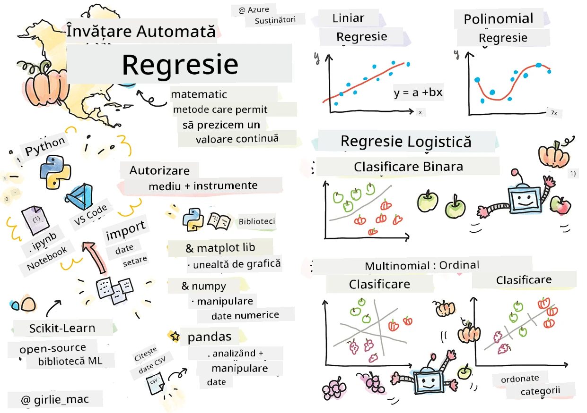
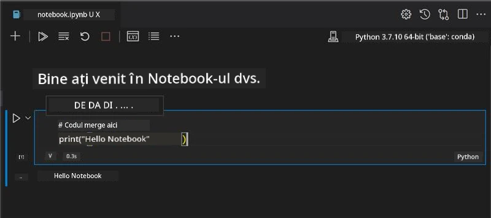
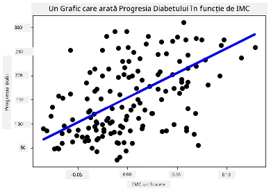

# Începeți cu Python și Scikit-learn pentru modele de regresie



> Sketchnote de [Tomomi Imura](https://www.twitter.com/girlie_mac)

## [Chestionar pre-lectură](https://ff-quizzes.netlify.app/en/ml/)

> ### [Această lecție este disponibilă în R!](../../../../2-Regression/1-Tools/solution/R/lesson_1.html)

## Introducere

În aceste patru lecții, veți descoperi cum să construiți modele de regresie. Vom discuta în curând la ce folosesc acestea. Dar înainte să faceți orice, asigurați-vă că aveți instrumentele potrivite pentru a începe procesul!

În această lecție, veți învăța cum să:

- Configurați computerul pentru sarcini locale de învățare automată.
- Lucrați cu Jupyter Notebooks.
- Folosiți Scikit-learn, inclusiv instalarea.
- Explorați regresia liniară printr-un exercițiu practic.

## Instalări și configurații

[](https://youtu.be/-DfeD2k2Kj0 "ML pentru începători -Configurați-vă instrumentele pregătite pentru a construi modele de învățare automată")

> 🎥 Faceți clic pe imaginea de mai sus pentru un scurt videoclip despre configurarea computerului pentru ML.

1. **Instalați Python**. Asigurați-vă că [Python](https://www.python.org/downloads/) este instalat pe computerul dumneavoastră. Veți folosi Python pentru multe sarcini de știința datelor și învățare automată. Majoritatea sistemelor de operare au deja o instalare Python. Există pachete utile [Python Coding Packs](https://code.visualstudio.com/learn/educators/installers?WT.mc_id=academic-77952-leestott) disponibile, pentru a ușura configurarea pentru unii utilizatori.

   Totuși, unele utilizări ale Python cer o anumită versiune a software-ului, iar altele necesită o altă versiune. Din acest motiv, este util să lucrați într-un [mediu virtual](https://docs.python.org/3/library/venv.html).

2. **Instalați Visual Studio Code**. Asigurați-vă că aveți instalat Visual Studio Code pe computer. Urmați aceste instrucțiuni pentru a [instala Visual Studio Code](https://code.visualstudio.com/) pentru instalarea de bază. Veți folosi Python în Visual Studio Code în acest curs, așa că poate doriți să vă familiarizați cu modul de a [configura Visual Studio Code](https://docs.microsoft.com/learn/modules/python-install-vscode?WT.mc_id=academic-77952-leestott) pentru dezvoltarea Python.

   > Familiarizați-vă cu Python parcurgând această colecție de [module Learn](https://docs.microsoft.com/users/jenlooper-2911/collections/mp1pagggd5qrq7?WT.mc_id=academic-77952-leestott)
   >
   > [](https://youtu.be/yyQM70vi7V8 "Configurare Python cu Visual Studio Code")
   >
   > 🎥 Faceți clic pe imaginea de mai sus pentru un videoclip: folosirea Python în VS Code.

3. **Instalați Scikit-learn**, urmând [aceste instrucțiuni](https://scikit-learn.org/stable/install.html). Deoarece trebuie să vă asigurați că folosiți Python 3, se recomandă să utilizați un mediu virtual. Rețineți că, dacă instalați această bibliotecă pe un Mac M1, există instrucțiuni speciale pe pagina legată mai sus.

1. **Instalați Jupyter Notebook**. Veți avea nevoie să [instalați pachetul Jupyter](https://pypi.org/project/jupyter/).

## Mediul dvs. de dezvoltare ML

Veți folosi **notebook-uri** pentru a dezvolta codul Python și pentru a crea modele de învățare automată. Acest tip de fișier este un instrument comun pentru oamenii de știință în date și poate fi recunoscut după sufixul sau extensia `.ipynb`.

Notebook-urile sunt un mediu interactiv care permite dezvoltatorului să scrie cod, să adauge note și să documenteze codul, ceea ce este foarte util pentru proiecte experimentale sau orientate spre cercetare.

[](https://youtu.be/7E-jC8FLA2E "ML pentru începători - Configurați Jupyter Notebooks pentru a începe construirea modelelor de regresie")

> 🎥 Faceți clic pe imaginea de mai sus pentru un scurt videoclip despre acest exercițiu.

### Exercițiu - lucrați cu un notebook

În acest dosar, veți găsi fișierul _notebook.ipynb_.

1. Deschideți _notebook.ipynb_ în Visual Studio Code.

   Un server Jupyter va porni cu Python 3+ lansat. Veți găsi zone în notebook care pot fi `run`, bucăți de cod. Puteți rula un bloc de cod selectând iconița care arată ca un buton de redare.

1. Selectați iconița `md` și adăugați puțin markdown, și următorul text **# Bine ați venit în notebook-ul vostru**.

   Apoi, adăugați cod Python.

1. Tastați **print('hello notebook')** în blocul de cod.
1. Selectați săgeata pentru a rula codul.

   Ar trebui să vedeți instrucțiunea afișată:

    ```output
    hello notebook
    ```



Puteți combina codul cu comentarii pentru a auto-documenta notebook-ul.

✅ Gândiți-vă pentru un minut cât de diferit este mediul de lucru al unui dezvoltator web față de cel al unui om de știință în date.

## Pregătire și rulare cu Scikit-learn

Acum că Python este configurat în mediul local și sunteți confortabil cu Jupyter Notebooks, haideți să devenim la fel de confortabili cu Scikit-learn (pronunțați `sci` ca în `science`). Scikit-learn oferă o [API extinsă](https://scikit-learn.org/stable/modules/classes.html#api-ref) pentru a vă ajuta să realizați sarcini de ML.

Conform [site-ului lor](https://scikit-learn.org/stable/getting_started.html), "Scikit-learn este o bibliotecă open source de învățare automată care suportă învățare supravegheată și nesupravegheată. De asemenea, oferă diverse unelte pentru ajustarea modelelor, preprocesarea datelor, selecția și evaluarea modelelor și multe alte utilități."

În acest curs, veți folosi Scikit-learn și alte instrumente pentru a construi modele de învățare automată care să realizeze ceea ce numim sarcini 'tradiționale de învățare automată'. Am evitat deliberat rețelele neuronale și deep learning, deoarece acestea sunt mai bine acoperite în viitorul nostru curriculum 'AI pentru începători'.

Scikit-learn face simplă construirea și evaluarea modelelor pentru utilizare. Se concentrează în principal pe folosirea datelor numerice și conține mai multe seturi de date gata făcute pentru a fi folosite ca instrumente de învățare. Include, de asemenea, modele predefinite pentru studenți. Să explorăm procesul de încărcare a datelor preambalate și să folosim un estimator încorporat pentru primul model ML cu Scikit-learn și date de bază.

## Exercițiu - primul vostru notebook Scikit-learn

> Acest tutorial a fost inspirat de [exemplul de regresie liniară](https://scikit-learn.org/stable/auto_examples/linear_model/plot_ols.html#sphx-glr-auto-examples-linear-model-plot-ols-py) de pe site-ul Scikit-learn.


[](https://youtu.be/2xkXL5EUpS0 "ML pentru începători - Primul vostru proiect de regresie liniară în Python")

> 🎥 Faceți clic pe imaginea de mai sus pentru un scurt videoclip despre acest exercițiu.

În fișierul _notebook.ipynb_ asociat acestei lecții, ștergeți toate celulele apăsând iconița 'coș de gunoi'.

În această secțiune, veți lucra cu un set mic de date despre diabet care este încorporat în Scikit-learn pentru scopuri de învățare. Imaginați-vă că doriți să testați un tratament pentru pacienții cu diabet. Modelele de învățare automată v-ar putea ajuta să determinați care pacienți vor răspunde mai bine la tratament în funcție de combinații de variabile. Chiar și un model foarte simplu de regresie, atunci când este vizualizat, ar putea arăta informații despre variabile care v-ar ajuta să organizați teoretic studiile clinice.

✅ Există multe tipuri de metode de regresie, iar alegerea depinde de răspunsul pe care îl căutați. Dacă doriți să preziceți înălțimea probabilă a unei persoane la o anumită vârstă, veți folosi regresia liniară, deoarece căutați o **valoare numerică**. Dacă sunteți interesat să descoperiți dacă un tip de bucătărie este considerat vegan sau nu, căutați o **atributie de categorie**, deci ați folosi regresia logistică. Veți învăța mai târziu despre regresia logistică. Gândiți-vă puțin la întrebările pe care le puteți pune datelor și la care dintre aceste metode ar fi mai potrivită.

Să începem această sarcină.

### Importați biblioteci

Pentru această sarcină vom importa câteva biblioteci:

- **matplotlib**. Este un [instrument de graficare](https://matplotlib.org/) util pe care îl vom folosi pentru a crea un grafic liniar.
- **numpy**. [numpy](https://numpy.org/doc/stable/user/whatisnumpy.html) este o bibliotecă utilă pentru manipularea datelor numerice în Python.
- **sklearn**. Aceasta este biblioteca [Scikit-learn](https://scikit-learn.org/stable/user_guide.html).

Importați câteva biblioteci pentru a vă ajuta cu sarcinile.

1. Adăugați importurile tastând următorul cod:

   ```python
   import matplotlib.pyplot as plt
   import numpy as np
   from sklearn import datasets, linear_model, model_selection
   ```

   De mai sus importați `matplotlib`, `numpy` și importați `datasets`, `linear_model` și `model_selection` din `sklearn`. `model_selection` este folosit pentru împărțirea datelor în seturi de antrenament și test.

### Setul de date despre diabet

Setul de date încorporat [diabet](https://scikit-learn.org/stable/datasets/toy_dataset.html#diabetes-dataset) include 442 de mostre de date legate de diabet, cu 10 variabile caracteristice, dintre care unele includ:

- vârstă: vârsta în ani
- bmi: indicele de masă corporală
- bp: tensiunea arterială medie
- s1 tc: celule T (un tip de globule albe)

✅ Acest set de date include conceptul de 'sex' ca o variabilă caracteristică importantă pentru cercetarea diabetului. Multe seturi medicale de date includ acest tip de clasificare binară. Gândiți-vă puțin la cum astfel de categorii ar putea exclude anumite părți ale populației de la tratamente.

Acum, încărcați datele X și y.

> 🎓 Amintiți-vă, aceasta este învățare supravegheată, și avem nevoie de o țintă denumită 'y'.

Într-o celulă nouă de cod, încărcați setul de date pentru diabet apelând `load_diabetes()`. Intrarea `return_X_y=True` semnalează faptul că `X` va fi o matrice de date, iar `y` va fi ținta regresiei.

1. Adăugați câteva comenzi print pentru a arăta forma matricei de date și primul său element:

    ```python
    X, y = datasets.load_diabetes(return_X_y=True)
    print(X.shape)
    print(X[0])
    ```

    Ce primiți ca răspuns este un tuplu. Ce faceți este să atribuiți primele două valori ale tuplei la `X` și `y` respectiv. Aflați mai multe [despre tuple](https://wikipedia.org/wiki/Tuple).

    Puteți vedea că acest set de date are 442 de itemi formați în array-uri cu câte 10 elemente:

    ```text
    (442, 10)
    [ 0.03807591  0.05068012  0.06169621  0.02187235 -0.0442235  -0.03482076
    -0.04340085 -0.00259226  0.01990842 -0.01764613]
    ```

    ✅ Gândiți-vă puțin la relația dintre date și ținta regresiei. Regresia liniară prezice relații între caracteristica X și variabila țintă y. Puteți găsi [ținta](https://scikit-learn.org/stable/datasets/toy_dataset.html#diabetes-dataset) pentru setul de date diabet în documentație? Ce demonstrează acest set de date, având ținta?

2. În continuare, selectați o porțiune din acest set de date pentru grafic prin selectarea celei de-a 3-a coloane din setul de date. Puteți face asta folosind operatorul `:` pentru a selecta toate rândurile, apoi selectând a 3-a coloană folosind indexul (2). Puteți, de asemenea, să remodelați datele pentru a fi un array 2D - necesar pentru graficare - folosind `reshape(n_rânduri, n_coloane)`. Dacă unul dintre parametri este -1, dimensiunea respectivă se calculează automat.

   ```python
   X = X[:, 2]
   X = X.reshape((-1,1))
   ```

   ✅ Oricând, afișați datele pentru a verifica forma lor.

3. Acum că aveți datele pregătite pentru graficare, puteți vedea dacă o mașină poate ajuta să determine o separare logică între numerele din acest set de date. Pentru aceasta trebuie să împărțiți atât datele (X), cât și ținta (y) în seturi de testare și antrenament. Scikit-learn oferă o metodă simplă pentru asta; puteți diviza setul de testare la un punct dat.

   ```python
   X_train, X_test, y_train, y_test = model_selection.train_test_split(X, y, test_size=0.33)
   ```

4. Acum sunteți gata să antrenați modelul! Încărcați modelul de regresie liniară și antrenați-l cu seturile de antrenament X și y folosind `model.fit()`:

    ```python
    model = linear_model.LinearRegression()
    model.fit(X_train, y_train)
    ```

    ✅ `model.fit()` este o funcție pe care o veți vedea în multe biblioteci ML cum ar fi TensorFlow

5. Apoi, creați o predicție folosind datele de testare, utilizând funcția `predict()`. Aceasta va fi folosită pentru a trasa linia între grupurile de date

    ```python
    y_pred = model.predict(X_test)
    ```

6. Acum este momentul să afișați datele într-un grafic. Matplotlib este un instrument foarte util pentru această sarcină. Creați un grafic de dispersie (scatterplot) al tuturor datelor X și y de testare, și folosiți predicția pentru a desena o linie în locul cel mai potrivit, între grupările de date ale modelului.

    ```python
    plt.scatter(X_test, y_test,  color='black')
    plt.plot(X_test, y_pred, color='blue', linewidth=3)
    plt.xlabel('Scaled BMIs')
    plt.ylabel('Disease Progression')
    plt.title('A Graph Plot Showing Diabetes Progression Against BMI')
    plt.show()
    ```

   


   ✅ Gândește-te puțin la ce se întâmplă aici. O linie dreaptă trece prin multe puncte mici de date, dar ce face exact? Poți vedea cum ar trebui să folosești această linie pentru a prezice unde ar trebui să se potrivească un punct de date nou, nevăzut, în raport cu axa y a graficului? Încearcă să pui în cuvinte utilizarea practică a acestui model.

Felicitări, ai construit primul tău model de regresie liniară, ai creat o predicție cu acesta și ai afișat-o într-un grafic!

---
## 🚀Provocare

Grafică o variabilă diferită din acest set de date. Sfat: editează această linie: `X = X[:,2]`. Având în vedere ținta acestui set de date, ce poți descoperi despre progresia diabetului ca boală?
## [Chestionar post-lectură](https://ff-quizzes.netlify.app/en/ml/)

## Recapitulare & Studiu individual

În acest tutorial, ai lucrat cu regresia liniară simplă, mai degrabă decât cu regresia liniară univariată sau multiplă. Citește puțin despre diferențele dintre aceste metode sau aruncă o privire la [acest videoclip](https://www.coursera.org/lecture/quantifying-relationships-regression-models/linear-vs-nonlinear-categorical-variables-ai2Ef)

Citește mai multe despre conceptul de regresie și gândește-te la ce fel de întrebări pot fi rezolvate cu această tehnică. Urmează acest [tutorial](https://docs.microsoft.com/learn/modules/train-evaluate-regression-models?WT.mc_id=academic-77952-leestott) pentru a-ți aprofunda înțelegerea.

## Tema

[Un set de date diferit](assignment.md)

---

<!-- CO-OP TRANSLATOR DISCLAIMER START -->
**Declinare a responsabilității**:
Acest document a fost tradus folosind serviciul de traducere AI [Co-op Translator](https://github.com/Azure/co-op-translator). În timp ce ne străduim pentru acuratețe, vă rugăm să rețineți că traducerile automate pot conține erori sau inexactități. Documentul original în limba sa nativă trebuie considerat sursa autorizată. Pentru informații critice, se recomandă traducerea profesională realizată de un om. Nu ne asumăm responsabilitatea pentru eventualele neînțelegeri sau interpretări greșite care decurg din utilizarea acestei traduceri.
<!-- CO-OP TRANSLATOR DISCLAIMER END -->