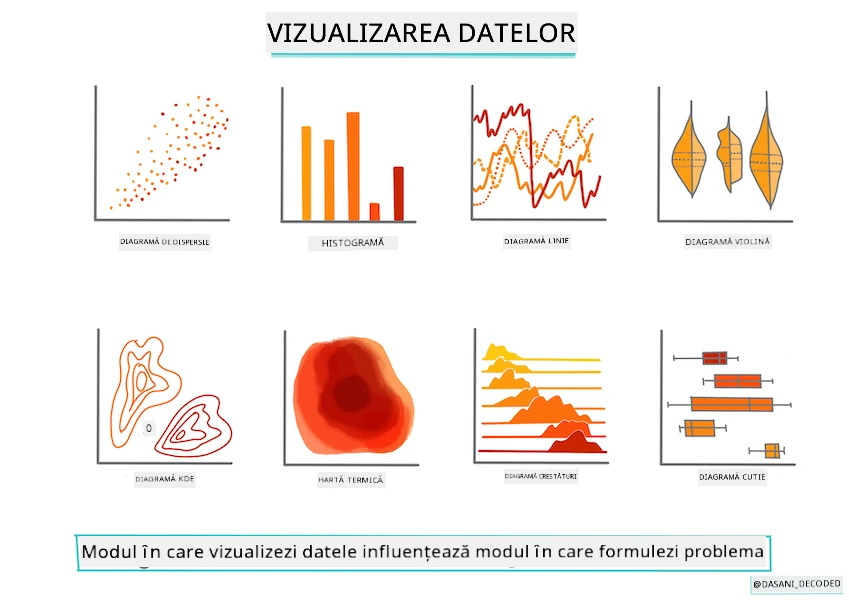
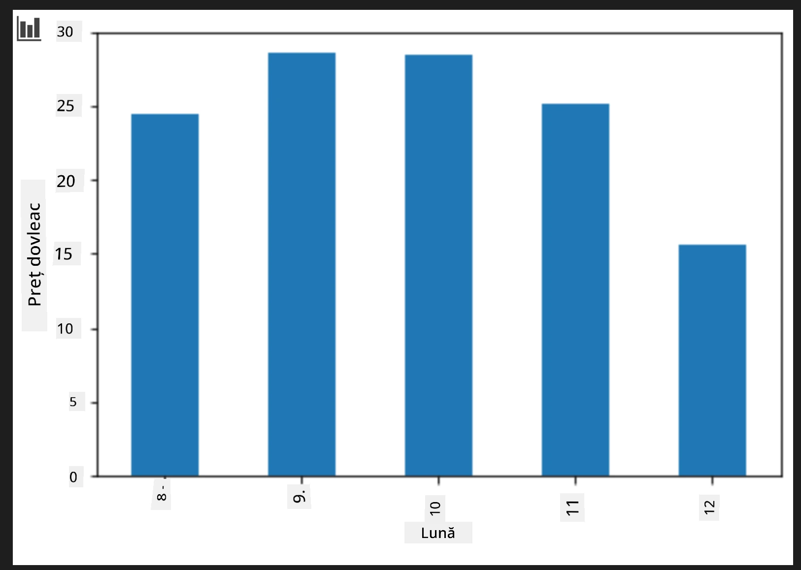
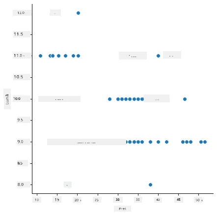
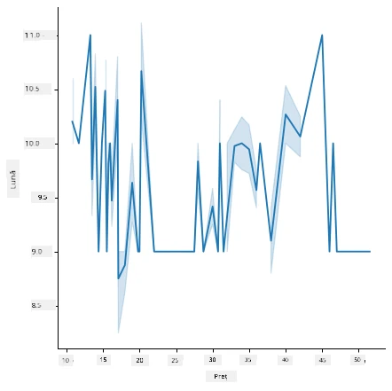
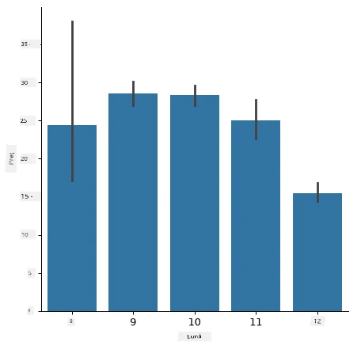
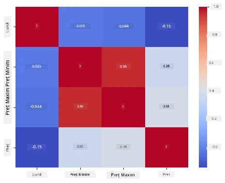

# Construiește un model de regresie folosind Scikit-learn: pregătește și vizualizează datele



Infografic de [Dasani Madipalli](https://twitter.com/dasani_decoded)

## [Chestionar pre-lectură](https://ff-quizzes.netlify.app/en/ml/)

> ### [Această lecție este disponibilă în R!](../../../../2-Regression/2-Data/solution/R/lesson_2.html)

## Introducere

Acum că ai configurat uneltele de care ai nevoie pentru a începe construirea unui model de machine learning cu Scikit-learn, ești pregătit să începi să pui întrebări datelor tale. Pe măsură ce lucrezi cu datele și aplici soluții ML, este foarte important să înțelegi cum să pui întrebarea corectă pentru a valorifica pe deplin potențialul setului de date.

În această lecție, vei învăța:

- Cum să pregătești datele pentru construirea unui model.
- Cum să folosești Matplotlib pentru vizualizarea datelor.
- Cum să folosești Seaborn pentru o vizualizare mai expresivă a datelor.

## Pune întrebarea potrivită datelor tale

Întrebarea la care ai nevoie de răspuns va determina ce tip de algoritmi ML vei folosi. Iar calitatea răspunsului pe care îl primești depinde mult de natura datelor tale.

Aruncă o privire la [datele](https://github.com/microsoft/ML-For-Beginners/blob/main/2-Regression/data/US-pumpkins.csv) oferite pentru această lecție. Poți deschide acest fișier .csv în VS Code. O scanare rapidă arată imediat că există goluri și o combinație de șiruri și date numerice. Există și o coloană ciudată numită „Package” unde datele sunt un amestec între „sacs”, „bins” și alte valori. Datele, de fapt, sunt puțin dezordonate.

[](https://youtu.be/5qGjczWTrDQ "ML pentru începători - Cum să analizezi și să cureți un set de date")

> 🎥 Dă click pe imaginea de mai sus pentru un videoclip scurt ce parcurge pregătirea datelor pentru această lecție.

De fapt, nu este foarte comun să primești un set de date complet gata pentru a construi un model ML imediat. În această lecție, vei învăța cum să pregătești un set de date brut folosind biblioteci Python standard. De asemenea, vei învăța diverse tehnici pentru a vizualiza datele.

## Studiu de caz: 'piața dovlecilor'

În acest folder vei găsi un fișier .csv în folderul rădăcină `data` numit [US-pumpkins.csv](https://github.com/microsoft/ML-For-Beginners/blob/main/2-Regression/data/US-pumpkins.csv) care include 1757 de linii de date despre piața dovlecilor, sortate pe grupe după oraș. Acestea sunt date brute extrase din [Specialty Crops Terminal Markets Standard Reports](https://www.marketnews.usda.gov/mnp/fv-report-config-step1?type=termPrice) distribuite de Departamentul de Agricultură al Statelor Unite.

### Pregătirea datelor

Aceste date sunt în domeniul public. Pot fi descărcate în mai multe fișiere separate, câte unul pentru fiecare oraș, de pe site-ul USDA. Pentru a evita prea multe fișiere separate, am concatenat toate datele orașelor într-un singur tabel, astfel că am _pregătit_ deja datele puțin. Următorul pas este să analizăm datele mai în detaliu.

### Datele despre dovleci - concluzii preliminare

Ce observi despre aceste date? Ai văzut deja că există un amestec de șiruri, numere, goluri și valori ciudate de care trebuie să înțelegi sensul.

Ce întrebare poți pune acestor date, folosind o tehnică de regresie? Poate „Prezice prețul unui dovleac de vânzare într-o anumită lună”. Privind din nou datele, există unele modificări pe care trebuie să le faci pentru a crea structura necesară a datelor pentru acest scop.
## Exercițiu - analizează datele despre dovleci

Să folosim [Pandas](https://pandas.pydata.org/), (numele vine de la `Python Data Analysis`), un instrument foarte util pentru modelarea datelor, pentru a analiza și a pregăti aceste date despre dovleci.

### Mai întâi, verifică datele lipsă

Trebuie să folosești pași pentru a verifica datele lipsă:

1. Convertește datele în format lună (sunt datele din SUA, deci formatul este `MM/DD/YYYY`).
2. Extrage luna într-o coloană nouă.

Deschide fișierul _notebook.ipynb_ în Visual Studio Code și importă tabelul într-un nou dataframe Pandas.

1. Folosește funcția `head()` pentru a vizualiza primele cinci rânduri.

    ```python
    import pandas as pd
    pumpkins = pd.read_csv('../data/US-pumpkins.csv')
    pumpkins.head()
    ```

    ✅ Ce funcție ai folosi pentru a vedea ultimele cinci rânduri?

1. Verifică dacă sunt date lipsă în cadrul dataframe-ului curent:

    ```python
    pumpkins.isnull().sum()
    ```

    Există date lipsă, dar poate că nu contează pentru sarcina de lucru.

1. Pentru a face dataframe-ul mai ușor de utilizat, selectează doar coloanele de care ai nevoie, folosind funcția `loc` care extrage din dataframe-ul original un grup de rânduri (trecut ca primul parametru) și coloane (trecute ca al doilea parametru). Expresia `:` în exemplul de mai jos înseamnă „toate rândurile”.

    ```python
    columns_to_select = ['Package', 'Low Price', 'High Price', 'Date']
    pumpkins = pumpkins.loc[:, columns_to_select]
    ```

### Al doilea pas, determină prețul mediu al dovleacului

Gândește-te cum să determini prețul mediu al unui dovleac într-o anumită lună. Ce coloane ai alege pentru această sarcină? Indiciu: ai nevoie de 3 coloane.

Soluție: ia media coloanelor `Low Price` și `High Price` pentru a popula noua coloană Preț, și convertește coloana Date pentru a arăta doar luna. Din fericire, conform verificării de mai sus, nu există date lipsă pentru date sau prețuri.

1. Pentru a calcula media, adaugă următorul cod:

    ```python
    price = (pumpkins['Low Price'] + pumpkins['High Price']) / 2

    month = pd.DatetimeIndex(pumpkins['Date']).month

    ```

   ✅ Poți tipări orice date dorești să verifici cu `print(month)`.

2. Acum, copiază datele convertite într-un nou dataframe Pandas:

    ```python
    new_pumpkins = pd.DataFrame({'Month': month, 'Package': pumpkins['Package'], 'Low Price': pumpkins['Low Price'],'High Price': pumpkins['High Price'], 'Price': price})
    ```

    Tipărirea dataframe-ului arată un set de date curat și ordonat pe care poți construi un nou model de regresie.

### Dar stai! E ceva ciudat aici

Dacă te uiți în coloana `Package`, dovlecii sunt vânduți în multe configurații diferite. Unii sunt vânduți în măsurători de '1 1/9 bushel', alții în '1/2 bushel', unii pe bucăți, alții pe livre, iar unii în cutii mari cu lățimi variate.

> Dovlecii par foarte greu de cântărit constant

Uitându-ne la datele originale, e interesant că orice cu `Unit of Sale` egal cu 'EACH' sau 'PER BIN' are și tipul `Package` după inch, bin, sau ‘fiecare’. Dovlecii par foarte greu de cântărit constant, așa că să-i filtrăm selectând doar dovlecii cu șirul 'bushel' în coloana `Package`.

1. Adaugă un filtru în partea de sus a fișierului, sub importul inițial .csv:

    ```python
    pumpkins = pumpkins[pumpkins['Package'].str.contains('bushel', case=True, regex=True)]
    ```

    Dacă tipărești datele acum, vei vedea că primești doar aproximativ 415 rânduri cu dovleci vânduți pe bushel.

### Dar stai! Mai e ceva de făcut

Ai observat că cantitatea pe bushel variază pe rând? Trebuie să normalizezi prețul simbolic astfel încât să arăți prețul per bushel, așa că fă niște calcule pentru a standardiza.

1. Adaugă aceste linii după blocul care creează noul dataframe new_pumpkins:

    ```python
    new_pumpkins.loc[new_pumpkins['Package'].str.contains('1 1/9'), 'Price'] = price/(1 + 1/9)

    new_pumpkins.loc[new_pumpkins['Package'].str.contains('1/2'), 'Price'] = price/(1/2)
    ```

✅ Conform [The Spruce Eats](https://www.thespruceeats.com/how-much-is-a-bushel-1389308), greutatea unui bushel depinde de tipul de produs, deoarece este o măsură de volum. "Un bushel de roșii, de exemplu, ar trebui să cântărească 56 de livre... Frunzele și verdețurile ocupă mai mult spațiu cu mai puțină greutate, așa că un bushel de spanac cântărește doar 20 de livre." Totul este destul de complicat! Hai să nu ne complicăm cu o conversie bushel-livre și să păstrăm prețul per bushel. Tot acest studiu despre busheluri de dovleci arată cât de important este să înțelegi natura datelor tale!

Acum poți analiza prețul per unitate bazat pe măsurătoarea bushel. Dacă tipărești datele încă o dată, vei vedea cum sunt standardizate.

✅ Ai observat că dovlecii vânduți la jumătate de bushel sunt foarte scumpi? Poți să-ți dai seama de ce? Indiciu: dovlecii mici sunt mult mai scumpi decât cei mari, probabil pentru că sunt mult mai mulți în bushel, date fiind spațiile neutilizate ocupate de un dovleac mare și gol pentru plăcintă.

## Strategii de vizualizare

O parte din rolul unui data scientist este să demonstreze calitatea și natura datelor cu care lucrează. Pentru aceasta, creează adesea vizualizări interesante, grafice, diagrame care arată diferite aspecte ale datelor. Astfel, pot arăta vizual relații și lacune ce sunt altfel greu de descoperit.

[](https://youtu.be/SbUkxH6IJo0 "ML pentru începători - Cum să vizualizezi datele cu Matplotlib")

> 🎥 Dă click pe imaginea de mai sus pentru un videoclip scurt despre vizualizarea datelor pentru această lecție.

Vizualizările pot, de asemenea, ajuta la determinarea tehnicii de machine learning cea mai potrivită pentru date. Un scatterplot care pare să urmeze o linie, de exemplu, indică faptul că datele sunt un bun candidat pentru un exercițiu de regresie liniară.

O bibliotecă de vizualizare a datelor care funcționează bine în Jupyter notebooks este [Matplotlib](https://matplotlib.org/) (pe care ai văzut-o și în lecția anterioară).

> Obține mai multă experiență în vizualizarea datelor în [aceste tutoriale](https://docs.microsoft.com/learn/modules/explore-analyze-data-with-python?WT.mc_id=academic-77952-leestott).

## Exercițiu - experimentează cu Matplotlib

Încearcă să creezi câteva grafice de bază pentru a afișa noul dataframe pe care tocmai l-ai creat. Ce ar arăta un grafic de linie simplu?

1. Importă Matplotlib în partea de sus a fișierului, sub importul Pandas:

    ```python
    import matplotlib.pyplot as plt
    ```

1. Rulează întreg notebook-ul din nou pentru a reîmprospăta.
1. La finalul notebook-ului, adaugă o celulă pentru a afișa datele ca un boxplot:

    ```python
    price = new_pumpkins.Price
    month = new_pumpkins.Month
    plt.scatter(price, month)
    plt.show()
    ```

    

    Este acest grafic util? Te surprinde ceva la el?

    Nu este foarte util deoarece doar afișează datele tale ca o răspândire de puncte într-o lună dată.

### Fă-l util

Pentru a face graficele să afișeze date utile, de obicei trebuie să grupezi datele într-un fel. Hai să încercăm să creăm un grafic în care axa y să arate lunile și datele să demonstreze distribuția datelor.

1. Adaugă o celulă pentru a crea un grafic cu bare grupate:

    ```python
    new_pumpkins.groupby(['Month'])['Price'].mean().plot(kind='bar')
    plt.ylabel("Pumpkin Price")
    ```

    

    Aceasta este o vizualizare a datelor mai utilă! Pare să indice că cel mai mare preț pentru dovleci apare în septembrie și octombrie. Se potrivește cu așteptările tale? De ce sau de ce nu?

## Exercițiu - experimentează cu Seaborn

Matplotlib este puternic, dar poate necesita mult cod pentru a produce un grafic finisat. [Seaborn](https://seaborn.pydata.org/) este o bibliotecă construită _peste_ Matplotlib, destinată vizualizării datelor statistice. Lucrează direct cu dataframe-urile Pandas, aplică stiluri implicite atractive și permite crearea de grafice informative cu mult mai puțin cod. Deoarece Seaborn returnează obiecte Matplotlib, poți folosi în continuare tot ce știi despre Matplotlib pentru a ajusta fin rezultatul.

> Dacă nu ai instalat deja Seaborn, instalează-l cu `pip install seaborn`.

1. Importă Seaborn în partea de sus a notebook-ului, sub celelalte importuri. Este convențional importat ca `sns`:

    ```python
    import seaborn as sns
    ```

### Diagramă scatter pentru a arăta relații

O parte importantă a explorării datelor înainte de a construi un model este căutarea _relațiilor_ între variabile. Un [scatter plot](https://en.wikipedia.org/wiki/Scatter_plot) este unul dintre cele mai bune instrumente pentru acest scop: dacă punctele par să urmeze o linie, cele două variabile pot fi corelate, ceea ce este un semn bun că un model de regresie liniară ar funcționa.

1. Recreează scatterplot-ul preț-lună de mai înainte, de data aceasta folosind [`relplot()`](https://seaborn.pydata.org/generated/seaborn.relplot.html) (plot relațional) al Seaborn, care lucrează direct cu coloanele dataframe-ului tău:

    ```python
    sns.relplot(x="Price", y="Month", data=new_pumpkins)
    ```

    

    Observă cum treci _numele coloanelor_ și dataframe-ul, iar Seaborn se ocupă de etichetele axelor pentru tine.

2. Poți schimba în grafic de linie trecând `kind="line"`. Seaborn trasează chiar o bandă umbrită care arată intervalul de încredere în jurul liniei:

    ```python
    sns.relplot(x="Price", y="Month", kind="line", data=new_pumpkins)
    ```

    

    Aceste date sunt destul de zgomotoase, așa că un grafic de linie nu este cea mai clară alegere aici — dar arată cât de ușor poți schimba tipul de grafic în Seaborn.

### Grafice cu bare pentru a arăta distribuții


Mai devreme ai grupat datele manual pentru a crea un grafic cu bare cu Matplotlib. Seaborn's [`catplot()`](https://seaborn.pydata.org/generated/seaborn.catplot.html) (grafic categoric) poate face gruparea și agregarea pentru tine. Implicit, `kind="bar"` afișează media fiecărei categorii împreună cu o linie neagră care indică intervalul de încredere.

1. Creează un grafic cu bare al prețului mediu pe lună:

    ```python
    sns.catplot(x="Month", y="Price", data=new_pumpkins, kind="bar")
    ```

    

    Aceasta confirmă ceea ce ai văzut cu Matplotlib — prețurile ating un maxim în jurul lunilor septembrie și octombrie — dar Seaborn vizualizează și cât de mult _variază_ prețul în fiecare lună.

### Heatmaps pentru a arăta corelații

Graficele scatter compară două variabile odată. Când ai mai multe coloane numerice, un [heatmap](https://en.wikipedia.org/wiki/Heat_map) îți permite să vezi puterea relației dintre _fiecare_ pereche de coloane simultan. Aceasta este o metodă obișnuită pentru a identifica ce caracteristici sunt cele mai corelate înainte de a alege ce să introduci într-un model (și același tip de grafic este folosit ulterior pentru a afișa matricile de confuzie în clasificare).

1. Construiește o matrice de corelație cu Pandas, apoi deseneaz-o cu [`heatmap()`](https://seaborn.pydata.org/generated/seaborn.heatmap.html) din Seaborn. Opțiunea `annot=True` afișează valorile corelației în fiecare celulă:

    ```python
    correlations = new_pumpkins[['Month', 'Low Price', 'High Price', 'Price']].corr()
    sns.heatmap(correlations, annot=True, cmap="coolwarm")
    ```

    

    Valorile apropiate de `1` (sau `-1`) înseamnă că coloanele sunt puternic corelate _liniar_. Observă cum `Low Price` și `High Price` sunt aproape perfect corelate. `Month`, pe de altă parte, arată doar o corelație liniară slabă cu prețul — chiar dacă graficul cu bare de mai sus a arătat un vârf sezonier clar în septembrie și octombrie. Aceasta este o lecție importantă: coeficientul de corelație măsoară doar relațiile _liniare_, așa că poate să nu surprindă modelele sezoniere sau alte tipuri de relații neliniare. ✅ De ce este util să te uiți atât la un heatmap *cât și* la grafice precum cel cu bare înainte de a decide ce coloane să folosești?

### Matplotlib sau Seaborn?

Ambele biblioteci merită să fie cunoscute:

- **Matplotlib** îți oferă control detaliat asupra fiecărui element al unui grafic și este baza pe care se construiește aproape orice altă bibliotecă de plotare Python.
- **Seaborn** oferă funcții la nivel înalt și setări implicite atractive pentru grafice statistice, lucrează direct cu dataframes și este adesea mai rapid pentru analiza exploratorie a datelor.

Un flux de lucru comun este să folosești Seaborn pentru a explora rapid datele, apoi să treci la Matplotlib când ai nevoie să personalizezi detaliile.

---

## 🚀Provocare

Explorează diferitele tipuri de vizualizări pe care le oferă Matplotlib și Seaborn. Care tipuri sunt cele mai potrivite pentru probleme de regresie?

## [Chestionar post-lectură](https://ff-quizzes.netlify.app/en/ml/)

## Recenzie & Auto-studiu

Aruncă o privire asupra multiplelor moduri de a vizualiza date. Fă o listă cu diferitele biblioteci disponibile și notează care sunt cele mai bune pentru anumite tipuri de taskuri, de exemplu vizualizări 2D vs. vizualizări 3D. Ce descoperi?

## Temă

[Explorarea vizualizărilor](assignment.md)

---

<!-- CO-OP TRANSLATOR DISCLAIMER START -->
**Declinare a responsabilității**:
Acest document a fost tradus folosind serviciul de traducere AI [Co-op Translator](https://github.com/Azure/co-op-translator). În timp ce ne străduim pentru acuratețe, vă rugăm să rețineți că traducerile automate pot conține erori sau inexactități. Documentul original în limba sa nativă trebuie considerat sursa autorizată. Pentru informații critice, se recomandă traducerea profesională realizată de un om. Nu ne asumăm responsabilitatea pentru eventualele neînțelegeri sau interpretări greșite care decurg din utilizarea acestei traduceri.
<!-- CO-OP TRANSLATOR DISCLAIMER END -->