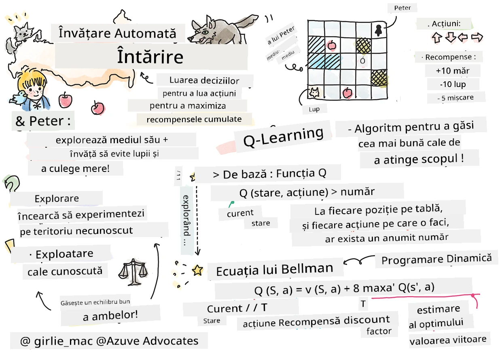

# Introducere în Învățarea prin Recompensare și Q-Learning


> Schiță realizată de [Tomomi Imura](https://www.twitter.com/girlie_mac)

Învățarea prin recompensare implică trei concepte importante: agentul, unele stări și un set de acțiuni pentru fiecare stare. Prin executarea unei acțiuni într-o stare specificată, agentul primește o recompensă. Imaginați din nou jocul video Super Mario. Tu ești Mario, ești într-un nivel al jocului, stând lângă marginea unei prăpastii. Deasupra ta este o monedă. Tu, fiind Mario, într-un nivel al jocului, într-o poziție specifică ... aceasta este starea ta. Să faci un pas spre dreapta (o acțiune) te va duce peste margine, ceea ce ți-ar da un scor numeric scăzut. Totuși, apăsând butonul de săritură ai putea să înscrii un punct și ai rămâne în viață. Acesta este un rezultat pozitiv și ar trebui să primești un scor numeric pozitiv.

Folosind învățarea prin recompensă și un simulator (jocul), poți învăța cum să joci jocul pentru a maximiza recompensa, care este să rămâi în viață și să înscrii cât mai multe puncte posibil.

[](https://www.youtube.com/watch?v=lDq_en8RNOo)

> 🎥 Click pe imaginea de mai sus pentru a-l auzi pe Dmitry discutând despre Învățarea prin Recompensare

## [Quiz înainte de lecție](https://ff-quizzes.netlify.app/en/ml/)

## Cerințe și configurare

În această lecție, vom experimenta cu un cod în Python. Ar trebui să fii capabil să rulezi codul din Jupyter Notebook al acestei lecții, fie pe calculatorul tău, fie undeva în cloud.

Poți deschide [notebook-ul lecției](https://github.com/microsoft/ML-For-Beginners/blob/main/8-Reinforcement/1-QLearning/notebook.ipynb) și să parcurgi lecția pentru a construi.

> **Notă:** Dacă deschizi acest cod din cloud, trebuie să preiei și fișierul [`rlboard.py`](https://github.com/microsoft/ML-For-Beginners/blob/main/8-Reinforcement/1-QLearning/rlboard.py), care este folosit în codul notebook-ului. Adaugă-l în același director cu notebook-ul.

## Introducere

În această lecție, vom explora lumea lui **[Petrica și Lupul](https://ro.wikipedia.org/wiki/Petrica_și_lupul)**, inspirată de o poveste muzicală de un compozitor rus, [Sergei Prokofiev](https://en.wikipedia.org/wiki/Sergei_Prokofiev). Vom folosi **Învățarea prin Recompensare** pentru a-l lăsa pe Petrica să exploreze mediul său, să adune mere gustoase și să evite să-l întâlnească pe lup.

**Învățarea prin Recompensare** (RL) este o tehnică de învățare care ne permite să învățăm un comportament optim al unui **agent** într-un anumit **mediu** prin efectuarea multor experimente. Un agent în acest mediu ar trebui să aibă un **scop**, definit printr-o **funcție de recompensă**.

## Mediul

Pentru simplitate, să considerăm lumea lui Petrica ca fiind o tablă pătrată de dimensiunea `width` x `height`, astfel:


Fiecare celulă din această tablă poate fi:

* **teren**, pe care Petrica și alte creaturi pot umbla.
* **apă**, pe care evident nu poți merge.
* un **copac** sau **iarbă**, un loc unde poți să te odihnești.
* un **măr**, care reprezintă ceva ce Petrica ar fi fericit să găsească pentru a se hrăni.
* un **lup**, care este periculos și trebuie evitat.

Există un modul Python separat, [`rlboard.py`](https://github.com/microsoft/ML-For-Beginners/blob/main/8-Reinforcement/1-QLearning/rlboard.py), care conține codul pentru a lucra cu acest mediu. Deoarece acest cod nu este important pentru înțelegerea conceptelor noastre, vom importa modulul și îl vom folosi pentru a crea tabla de probă (blocul de cod 1):

```python
from rlboard import *

width, height = 8,8
m = Board(width,height)
m.randomize(seed=13)
m.plot()
```

Acest cod ar trebui să afișeze o imagine a mediului asemănătoare cu cea de mai sus.

## Acțiuni și politică

În exemplul nostru, scopul lui Petrica ar fi să găsească un măr, evitând lupul și alte obstacole. Pentru aceasta, el poate pur și simplu să umble până găsește un măr.

Astfel, la orice poziție, el poate alege una dintre următoarele acțiuni: sus, jos, stânga și dreapta.

Vom defini aceste acțiuni ca un dicționar și le vom asocia cu perechi de modificări corespunzătoare ale coordonatelor. De exemplu, mutarea spre dreapta (`R`) ar corespunde perechii `(1,0)`. (blocul de cod 2):

```python
actions = { "U" : (0,-1), "D" : (0,1), "L" : (-1,0), "R" : (1,0) }
action_idx = { a : i for i,a in enumerate(actions.keys()) }
```

Pe scurt, strategia și scopul acestui scenariu sunt următoarele:

- **Strategia**, a agentului nostru (Petrica) este definită de o așa-numită **politică**. O politică este o funcție care întoarce acțiunea pentru orice stare dată. În cazul nostru, starea problemei este reprezentată de tablă, inclusiv poziția curentă a jucătorului.

- **Scopul**, învățării prin recompensare este să învățăm eventual o politică bună care să ne permită să rezolvăm problema eficient. Totuși, ca punct de reper, să considerăm cea mai simplă politică numită **mers aleatoriu**.

## Mers aleatoriu

Hai să rezolvăm mai întâi problema implementând o strategie de mers aleatoriu. Cu mers aleatoriu, vom alege aleator următoarea acțiune din acțiunile permise, până când ajungem la măr (blocul de cod 3).

1. Implementează mersul aleator cu codul de mai jos:

    ```python
    def random_policy(m):
        return random.choice(list(actions))
    
    def walk(m,policy,start_position=None):
        n = 0 # număr de pași
        # setează poziția inițială
        if start_position:
            m.human = start_position 
        else:
            m.random_start()
        while True:
            if m.at() == Board.Cell.apple:
                return n # succes!
            if m.at() in [Board.Cell.wolf, Board.Cell.water]:
                return -1 # mâncat de lup sau înecat
            while True:
                a = actions[policy(m)]
                new_pos = m.move_pos(m.human,a)
                if m.is_valid(new_pos) and m.at(new_pos)!=Board.Cell.water:
                    m.move(a) # execută mutarea propriu-zisă
                    break
            n+=1
    
    walk(m,random_policy)
    ```

    Apelul către `walk` ar trebui să întoarcă lungimea traseului corespunzător, care poate varia de la o execuție la alta.

1. Rulează experimentul de mers de mai multe ori (să zicem 100) și afișează statisticile rezultate (blocul de cod 4):

    ```python
    def print_statistics(policy):
        s,w,n = 0,0,0
        for _ in range(100):
            z = walk(m,policy)
            if z<0:
                w+=1
            else:
                s += z
                n += 1
        print(f"Average path length = {s/n}, eaten by wolf: {w} times")
    
    print_statistics(random_policy)
    ```

    Observă că lungimea medie a unui traseu este în jur de 30-40 de pași, ceea ce este destul de mult, dat fiind faptul că distanța medie până la cel mai apropiat măr este în jur de 5-6 pași.

    Poți vedea și cum arată mișcarea lui Petrica în timpul mersului aleator:

    

## Funcția de recompensă

Pentru a face politica noastră mai inteligentă, trebuie să înțelegem care mișcări sunt „mai bune” decât altele. Pentru acest lucru, trebuie să definim scopul nostru.

Scopul poate fi definit în termeni de **funcție de recompensă**, care va întoarce o valoare de scor pentru fiecare stare. Cu cât numărul este mai mare, cu atât funcția de recompensă este mai bună. (blocul de cod 5)

```python
move_reward = -0.1
goal_reward = 10
end_reward = -10

def reward(m,pos=None):
    pos = pos or m.human
    if not m.is_valid(pos):
        return end_reward
    x = m.at(pos)
    if x==Board.Cell.water or x == Board.Cell.wolf:
        return end_reward
    if x==Board.Cell.apple:
        return goal_reward
    return move_reward
```

Un lucru interesant despre funcțiile de recompensă este că, în cele mai multe cazuri, *ni se oferă o recompensă substanțială doar la sfârșitul jocului*. Aceasta înseamnă că algoritmul nostru ar trebui cumva să-și amintească pașii "buni" care duc la o recompensă pozitivă la final și să le dea o importanță mai mare. Similar, toate mișcările care duc la rezultate slabe ar trebui descurajate.

## Q-Learning

Un algoritm pe care îl vom discuta aici se numește **Q-Learning**. În acest algoritm, politica este definită printr-o funcție (sau o structură de date) numită **Q-Table**. Aceasta înregistrează „calitatea” fiecărei acțiuni într-o stare dată.

Se numește Q-Table deoarece este adesea convenabil să o reprezentăm ca pe un tabel sau un array multidimensional. Deoarece tabla noastră are dimensiunile `width` x `height`, putem reprezenta Q-Table folosind un array numpy cu forma `width` x `height` x `len(actions)`: (blocul de cod 6)

```python
Q = np.ones((width,height,len(actions)),dtype=np.float)*1.0/len(actions)
```

Observă că inițializăm toate valorile din Q-Table cu o valoare egală, în cazul nostru - 0.25. Aceasta corespunde politicii „mersului aleatoriu”, deoarece toate mișcările într-o stare sunt la fel de bune. Putem transmite Q-Table funcției `plot` pentru a vizualiza tabela pe tablă: `m.plot(Q)`.


În centrul fiecărei celule există o „săgeată” care indică direcția preferată de mișcare. Deoarece toate direcțiile sunt egale, este afișat un punct.

Acum trebuie să rulăm simularea, să explorăm mediul nostru și să învățăm o distribuție mai bună a valorilor din Q-Table, care ne va permite să găsim drumul către măr mult mai repede.

## Esența Q-Learning: Ecuația Bellman

Odată ce începem să ne mișcăm, fiecare acțiune va avea o recompensă corespunzătoare, adică teoretic putem selecta următoarea acțiune bazându-ne pe recompensa imediată cea mai mare. Totuși, în majoritatea stărilor, mișcarea nu va atinge scopul nostru de a ajunge la măr, astfel încât nu putem decide imediat care direcție este mai bună.

> Amintește-ți că nu rezultatul imediat contează, ci mai degrabă rezultatul final, pe care îl vom obține la sfârșitul simulării.

Pentru a lua în considerare această recompensă întârziată, trebuie să folosim principiile **[programării dinamice](https://en.wikipedia.org/wiki/Dynamic_programming)**, care ne permit să privim problema noastră recursiv.

Să presupunem că acum ne aflăm în starea *s* și vrem să trecem în următoarea stare *s'*. Făcând acest lucru, vom primi recompensa imediată *r(s,a)*, definită de funcția de recompensă, plus o recompensă viitoare. Dacă presupunem că Q-Table reflectă corect „atractivitatea” fiecărei acțiuni, atunci în starea *s'* vom alege o acțiune *a* care corespunde valorii maxime *Q(s',a')*. Astfel, cea mai bună recompensă viitoare posibilă pe care am putea-o obține în starea *s* va fi definită ca `max`<sub>a'</sub>*Q(s',a')* (maximul aici este calculat peste toate acțiunile posibile *a'* din starea *s'*).

Aceasta dă **formula Bellman** pentru calculul valorii Q-Table în starea *s*, dată acțiunea *a*:


Aici γ este așa-numitul **factor de discount** care determină în ce măsură trebuie să preferi recompensa curentă față de recompensa viitoare și viceversa.

## Algoritmul de învățare

Având ecuația de mai sus, acum putem scrie pseudo-codul pentru algoritmul nostru de învățare:

* Inițializează Q-Table Q cu numere egale pentru toate stările și acțiunile
* Setează rata de învățare α ← 1
* Repetă simularea de multe ori
   1. Pornește de la o poziție aleatorie
   1. Repetă
        1. Alege o acțiune *a* în starea *s*
        2. Execută acțiunea mutându-te într-o nouă stare *s'*
        3. Dacă întâlnim condiția de sfârșit de joc, sau recompensa totală este prea mică - încheie simularea  
        4. Calculează recompensa *r* în noua stare
        5. Actualizează funcția Q conform ecuației Bellman: *Q(s,a)* ← *(1-α)Q(s,a)+α(r+γ max<sub>a'</sub>Q(s',a'))*
        6. *s* ← *s'*
        7. Actualizează recompensa totală și scade α.

## Exploatare vs. explorare

În algoritmul de mai sus, nu am specificat exact cum trebuie să alegem o acțiune la pasul 2.1. Dacă alegem acțiunea aleator, vom **explora** aleatoriu mediul și este foarte probabil să murim des, precum și să explorăm zone unde, în mod normal, nu am ajunge. O abordare alternativă ar fi să **exploatăm** valorile din Q-Table pe care deja le știm și astfel să alegem cea mai bună acțiune (cu valoarea Q-Table mai mare) în starea *s*. Totuși, aceasta ne va împiedica să explorăm alte stări și este posibil să nu găsim soluția optimă.

Astfel, cea mai bună abordare este să echilibrăm între explorare și exploatare. Acest lucru se poate face alegând acțiunea în starea *s* cu probabilități proporționale cu valorile din Q-Table. La început, când valorile din Q-Table sunt toate la fel, ar corespunde unei alegeri aleatorii, dar pe măsură ce învățăm mai multe despre mediul nostru, vom fi mai înclinați să urmăm ruta optimă, permițând totuși agentului să aleagă o cale neexplorată din când în când.

## Implementare în Python

Suntem acum gata să implementăm algoritmul de învățare. Înainte de asta, avem nevoie și de o funcție care să convertească numere arbitrare din Q-Table într-un vector de probabilități pentru acțiunile corespunzătoare.

1. Creează o funcție `probs()`:

    ```python
    def probs(v,eps=1e-4):
        v = v-v.min()+eps
        v = v/v.sum()
        return v
    ```

    Adăugăm câteva `eps` la vectorul original pentru a evita împărțirea la 0 în cazul inițial, când toate componentele vectorului sunt identice.

Rulează algoritmul de învățare prin 5000 de experimente, numite și **epoci**: (blocul de cod 8)
```python
    for epoch in range(5000):
    
        # Alege punctul inițial
        m.random_start()
        
        # Pornește călătoria
        n=0
        cum_reward = 0
        while True:
            x,y = m.human
            v = probs(Q[x,y])
            a = random.choices(list(actions),weights=v)[0]
            dpos = actions[a]
            m.move(dpos,check_correctness=False) # permitem jucătorului să iasă în afara tablei, ceea ce termină episodul
            r = reward(m)
            cum_reward += r
            if r==end_reward or cum_reward < -1000:
                lpath.append(n)
                break
            alpha = np.exp(-n / 10e5)
            gamma = 0.5
            ai = action_idx[a]
            Q[x,y,ai] = (1 - alpha) * Q[x,y,ai] + alpha * (r + gamma * Q[x+dpos[0], y+dpos[1]].max())
            n+=1
```

După executarea acestui algoritm, Q-Table ar trebui să fie actualizată cu valorile care definesc atractivitatea diferitelor acțiuni la fiecare pas. Putem încerca să vizualizăm Q-Table prin desenarea unui vector în fiecare celulă care indică direcția dorită a mișcării. Pentru simplitate, desenăm un cerc mic în loc de vârful săgeții.


## Verificarea politicii

Deoarece Q-Table listează „atractivitatea” fiecărei acțiuni în fiecare stare, este destul de ușor să o folosim pentru a defini navigarea eficientă în lumea noastră. În cel mai simplu caz, putem selecta acțiunea corespunzătoare celei mai mari valori din Q-Table: (blocul de cod 9)

```python
def qpolicy_strict(m):
        x,y = m.human
        v = probs(Q[x,y])
        a = list(actions)[np.argmax(v)]
        return a

walk(m,qpolicy_strict)
```


> Dacă încerci codul de mai sus de mai multe ori, poți observa că uneori „îngheață” și trebuie să apeși butonul STOP în notebook pentru a-l întrerupe. Acest lucru se întâmplă deoarece pot exista situații când două stări „se indică” reciproc în termeni de valoare optimă Q, caz în care agentul ajunge să se miște între aceste stări la nesfârșit.

## 🚀Provocare

> **Sarcina 1:** Modifică funcția `walk` pentru a limita lungimea maximă a traseului la un anumit număr de pași (să zicem, 100) și observă cum codul de mai sus returnează această valoare din când în când.

> **Sarcina 2:** Modifică funcția `walk` astfel încât să nu se întoarcă în locurile în care a fost deja anterior. Acest lucru va preveni buclarea funcției `walk`, însă agentul poate totuși să ajungă „captiv” într-o locație din care nu poate scăpa.

## Navigare

O politică mai bună de navigare ar fi cea pe care am folosit-o în timpul antrenamentului, care combină exploatarea și explorarea. În această politică, vom selecta fiecare acțiune cu o anumită probabilitate, proporțională cu valorile din Q-Table. Această strategie poate încă duce la întoarcerea agentului într-o poziție deja explorată, dar, după cum poți vedea din codul de mai jos, rezultă într-un traseu mediu foarte scurt către locația dorită (amintește-ți că `print_statistics` rulează simularea de 100 de ori): (bloc de cod 10)

```python
def qpolicy(m):
        x,y = m.human
        v = probs(Q[x,y])
        a = random.choices(list(actions),weights=v)[0]
        return a

print_statistics(qpolicy)
```

După rularea acestui cod, ar trebui să obții o lungime medie a traseului mult mai mică decât înainte, în intervalul 3-6.

## Investigarea procesului de învățare

Așa cum am menționat, procesul de învățare este un echilibru între explorare și exploatarea cunoștințelor dobândite despre structura spațiului de problemă. Am văzut că rezultatele învățării (abilitatea de a ajuta un agent să găsească un traseu scurt către țintă) s-au îmbunătățit, dar este și interesant să observăm cum se comportă lungimea medie a traseului pe parcursul procesului de învățare:


Învățăturile pot fi rezumate astfel:

- **Lungimea medie a traseului crește**. Ce observăm aici este că, la început, lungimea medie a traseului crește. Probabil acest lucru se datorează faptului că atunci când nu știm nimic despre mediu, avem probabilitatea să ne blocăm în stări proaste, cum ar fi apă sau lup. Pe măsură ce învățăm mai mult și începem să folosim această cunoaștere, putem explora mediul mai mult timp, dar încă nu știm foarte bine unde sunt merele.

- **Lungimea traseului scade pe măsură ce învățăm mai mult**. Odată ce învățăm suficient, devine mai ușor pentru agent să atingă scopul, iar lungimea traseului începe să scadă. Totuși, încă suntem deschiși explorării, așa că adesea ne abatem de la cel mai bun traseu și explorăm opțiuni noi, făcând traseul mai lung decât optim.

- **Lungimea crește brusc**. De asemenea, observăm pe acest grafic că, la un moment dat, lungimea a crescut brusc. Aceasta indică natura stocastică a procesului și faptul că, la un moment dat, putem „strica” coeficienții din Q-Table, suprascriindu-i cu valori noi. În mod ideal, acest lucru ar trebui minimizat prin scăderea ratei de învățare (de exemplu, spre finalul antrenamentului, ajustăm valorile din Q-Table doar cu o valoare mică).

Per ansamblu, este important să ne amintim că succesul și calitatea procesului de învățare depind semnificativ de parametrii precum rata de învățare, scăderea ratei de învățare și factorul de discount. Aceștia sunt adesea numiți **hiperparametri**, pentru a fi distinși de **parametrii** pe care îi optimizăm în timpul antrenamentului (de exemplu, coeficienții din Q-Table). Procesul de găsire a celor mai buni valori pentru hiperparametri se numește **optimizarea hiperparametrilor** și merită un subiect separat.

## [Chestionar post-lectură](https://ff-quizzes.netlify.app/en/ml/)

## Temă 
[O lume mai realistă](assignment.md)

---

<!-- CO-OP TRANSLATOR DISCLAIMER START -->
**Declinare a responsabilității**:
Acest document a fost tradus folosind serviciul de traducere AI [Co-op Translator](https://github.com/Azure/co-op-translator). În timp ce ne străduim pentru acuratețe, vă rugăm să rețineți că traducerile automate pot conține erori sau inexactități. Documentul original în limba sa nativă trebuie considerat sursa autorizată. Pentru informații critice, se recomandă traducerea profesională realizată de un om. Nu ne asumăm responsabilitatea pentru eventualele neînțelegeri sau interpretări greșite care decurg din utilizarea acestei traduceri.
<!-- CO-OP TRANSLATOR DISCLAIMER END -->