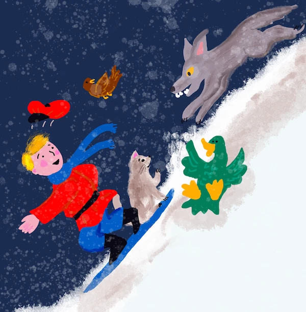

# CartPole Patinaj

Problema pe care am rezolvat-o în lecția anterioară ar putea părea o problemă simplă, nu neapărat aplicabilă în scenarii din viața reală. Acest lucru nu este adevărat, deoarece multe probleme reale împărtășesc acest scenariu - inclusiv jocurile de Șah sau Go. Sunt similare deoarece avem o tablă cu reguli date și un **stare discretă**.

## [Chestionar înainte de lecție](https://ff-quizzes.netlify.app/en/ml/)

## Introducere

În această lecție vom aplica aceleași principii ale Q-Learning la o problemă cu **stare continuă**, adică o stare care este dată de unul sau mai mulți numere reale. Vom aborda următoarea problemă:

> **Problemă**: Dacă Peter vrea să scape de lup, trebuie să se poată mișca mai repede. Vom vedea cum Peter poate învăța să patineze, în special să-și mențină echilibrul, folosind Q-Learning.



> Peter și prietenii săi devin creativi pentru a scăpa de lup! Imagine de [Jen Looper](https://twitter.com/jenlooper)

Vom folosi o versiune simplificată a echilibrului cunoscută drept problema **CartPole**. În lumea cartpole, avem un glisor orizontal care poate să se miște la stânga sau la dreapta, iar scopul este să echilibrăm o tijă verticală pe vârful glisorului.


## Cerințe preliminare

În această lecție vom folosi o bibliotecă numită **OpenAI Gym** pentru a simula diferite **medii**. Poți rula codul acestei lecții local (de ex. din Visual Studio Code), caz în care simularea se va deschide într-o fereastră nouă. Când rulezi codul online, este posibil să trebuiască să faci câteva ajustări în cod, așa cum este descris [aici](https://towardsdatascience.com/rendering-openai-gym-envs-on-binder-and-google-colab-536f99391cc7).

## OpenAI Gym

În lecția anterioară, regulile jocului și starea au fost date de clasa `Board` pe care am definit-o noi înșine. Aici vom folosi un **mediu de simulare** special, care va simula fizica din spatele tijei care se echilibrează. Unul dintre cele mai populare medii de simulare pentru antrenarea algoritmilor de învățare prin întărire se numește [Gym](https://gym.openai.com/), întreținut de [OpenAI](https://openai.com/). Folosind acest gym putem crea diferite **medii**, de la simularea cartpole până la jocuri Atari.

> **Notă**: Poți vedea alte medii disponibile în OpenAI Gym [aici](https://gym.openai.com/envs/#classic_control).

Mai întâi, să instalăm gym și să importăm bibliotecile necesare (bloc de cod 1):

```python
import sys
!{sys.executable} -m pip install gym 

import gym
import matplotlib.pyplot as plt
import numpy as np
import random
```

## Exercițiu - inițializează un mediu cartpole

Pentru a lucra cu o problemă de echilibrare cartpole, trebuie să inițializăm mediul corespunzător. Fiecare mediu este asociat cu:

- **Spațiu de observații** care definește structura informației pe care o primim din mediu. Pentru problema cartpole, primim poziția tijei, viteza și alte valori.

- **Spațiu de acțiune** care definește acțiunile posibile. În cazul nostru spațiul de acțiune este discret și constă în două acțiuni - **stânga** și **dreapta**. (bloc de cod 2)

1. Pentru a inițializa, scrie următorul cod:

    ```python
    env = gym.make("CartPole-v1")
    print(env.action_space)
    print(env.observation_space)
    print(env.action_space.sample())
    ```

Să vedem cum funcționează mediul, să rulăm o simulare scurtă pentru 100 de pași. La fiecare pas, oferim o acțiune care trebuie executată - în această simulare selectăm aleator o acțiune din `action_space`.

1. Rulează codul de mai jos și vezi ce rezultă.

    ✅ Ține minte că este recomandat să rulezi acest cod pe o instalare locală de Python! (bloc de cod 3)

    ```python
    env.reset()
    
    for i in range(100):
       env.render()
       env.step(env.action_space.sample())
    env.close()
    ```

    Ar trebui să vezi ceva asemănător cu această imagine:

    

1. În timpul simulării, trebuie să obținem observații pentru a decide cum să acționăm. De fapt, funcția step returnează observațiile curente, o funcție de recompensă și flag-ul done care indică dacă are sens să continuăm simularea sau nu: (bloc de cod 4)

    ```python
    env.reset()
    
    done = False
    while not done:
       env.render()
       obs, rew, done, info = env.step(env.action_space.sample())
       print(f"{obs} -> {rew}")
    env.close()
    ```

    Vei vedea ceva asemănător în output-ul notebook-ului:

    ```text
    [ 0.03403272 -0.24301182  0.02669811  0.2895829 ] -> 1.0
    [ 0.02917248 -0.04828055  0.03248977  0.00543839] -> 1.0
    [ 0.02820687  0.14636075  0.03259854 -0.27681916] -> 1.0
    [ 0.03113408  0.34100283  0.02706215 -0.55904489] -> 1.0
    [ 0.03795414  0.53573468  0.01588125 -0.84308041] -> 1.0
    ...
    [ 0.17299878  0.15868546 -0.20754175 -0.55975453] -> 1.0
    [ 0.17617249  0.35602306 -0.21873684 -0.90998894] -> 1.0
    ```

    Vectorul de observații returnat la fiecare pas al simulării conține următoarele valori:
    - Poziția căruciorului
    - Viteza căruciorului
    - Unghiul tijei
    - Rata de rotație a tijei

1. Obține valorile minime și maxime ale acestor numere: (bloc de cod 5)

    ```python
    print(env.observation_space.low)
    print(env.observation_space.high)
    ```

    Poți observa și că valoarea recompensei la fiecare pas al simulării este întotdeauna 1. Acest lucru este deoarece scopul nostru este să supraviețuim cât mai mult timp, adică să menținem tija într-o poziție verticală rezonabilă pentru cea mai lungă perioadă de timp.

    ✅ De fapt, simularea CartPole este considerată rezolvată dacă reușim să obținem o recompensă medie de 195 pe 100 de încercări consecutive.

## Discretizarea stării

În Q-Learning, trebuie să construim un Q-Table care definește ce să facem la fiecare stare. Pentru a face acest lucru, starea trebuie să fie **discretă**, mai precis, să conțină un număr finit de valori discrete. Astfel, trebuie cumva să **discretizăm** observațiile noastre, mapându-le într-un set finit de stări.

Există câteva moduri în care putem face asta:

- **Împărțirea în intervale (bins)**. Dacă cunoaștem intervalul unei valori, putem împărți acest interval în mai multe **bins**, și apoi înlocui valoarea cu numărul bin-ului căruia îi aparține. Acest lucru se poate face folosind metoda numpy [`digitize`](https://numpy.org/doc/stable/reference/generated/numpy.digitize.html). În acest caz, vom cunoaște exact dimensiunea stării, deoarece aceasta va depinde de numărul de bins selectate pentru digitalizare.
  
✅ Putem folosi interpolarea liniară pentru a aduce valorile într-un interval finit (de exemplu, de la -20 la 20), iar apoi convertim numerele în întregi prin rotunjire. Acest lucru ne oferă un control mai redus asupra dimensiunii stării, mai ales dacă nu cunoaștem intervalele exacte ale valorilor de intrare. De exemplu, în cazul nostru, 2 din cele 4 valori nu au limite superioare/inferioare, ceea ce poate duce la un număr infinit de stări.

În exemplul nostru, vom merge pe a doua variantă. După cum vei observa mai târziu, în ciuda faptului că limitele superioare/inferioare nu sunt definite, acele valori iau rar valori în afara anumitor intervale finite, astfel aceste stări cu valori extreme vor fi foarte rare.

1. Iată funcția care va lua observația din modelul nostru și va produce un tuplu de 4 valori întregi: (bloc de cod 6)

    ```python
    def discretize(x):
        return tuple((x/np.array([0.25, 0.25, 0.01, 0.1])).astype(np.int))
    ```

1. Să explorăm și o altă metodă de discretizare folosind bins: (bloc de cod 7)

    ```python
    def create_bins(i,num):
        return np.arange(num+1)*(i[1]-i[0])/num+i[0]
    
    print("Sample bins for interval (-5,5) with 10 bins\n",create_bins((-5,5),10))
    
    ints = [(-5,5),(-2,2),(-0.5,0.5),(-2,2)] # intervale de valori pentru fiecare parametru
    nbins = [20,20,10,10] # număr de coșuri pentru fiecare parametru
    bins = [create_bins(ints[i],nbins[i]) for i in range(4)]
    
    def discretize_bins(x):
        return tuple(np.digitize(x[i],bins[i]) for i in range(4))
    ```

1. Să rulăm acum o simulare scurtă și să observăm aceste valori discrete ale mediului. Poți încerca atât `discretize`, cât și `discretize_bins` pentru a vedea dacă există vreo diferență.

    ✅ discretize_bins returnează numărul bin-ului, care este indexat de la 0. Astfel, pentru valori ale variabilei de intrare în jurul valorii 0 returnează numărul din mijlocul intervalului (10). În discretize, nu ne-am preocupat de intervalul valorilor de ieșire, permițându-le să fie negative, astfel valorile stării nu sunt mutate, iar 0 corespunde lui 0. (bloc de cod 8)

    ```python
    env.reset()
    
    done = False
    while not done:
       #env.render()
       obs, rew, done, info = env.step(env.action_space.sample())
       #print(discretize_bins(obs))
       print(discretize(obs))
    env.close()
    ```

    ✅ Deblochează linia care începe cu env.render dacă vrei să vezi cum rulează mediul. Altfel, poți să-l execuți în fundal, ceea ce este mai rapid. Vom folosi această rulare „invizibilă” în timpul procesului nostru de Q-Learning.

## Structura Q-Table

În lecția anterioară, starea era o pereche simplă de numere de la 0 la 8, deci a fost convenabil să reprezentăm Q-Table ca un tensor numpy cu forma 8x8x2. Dacă folosim discretizarea prin bins, dimensiunea vectorului nostru de stare este și ea cunoscută, deci putem folosi aceeași abordare și să reprezentăm starea printr-un array cu forma 20x20x10x10x2 (aici 2 este dimensiunea spațiului de acțiuni, iar primele dimensiuni corespund numărului de bins selectate pentru fiecare parametru din spațiul de observații).

Totuși, uneori dimensiunile exacte ale spațiului de observație nu sunt cunoscute. În cazul funcției `discretize`, poate nu vom fi niciodată siguri că starea rămâne în anumite limite, pentru că unele valori originale nu sunt limitate. Astfel, vom folosi o abordare ușor diferită și vom reprezenta Q-Table ca un dicționar.

1. Folosește perechea *(stare, acțiune)* ca și cheie în dicționar, iar valoarea va corespunde valorii intrării din Q-Table. (bloc de cod 9)

    ```python
    Q = {}
    actions = (0,1)
    
    def qvalues(state):
        return [Q.get((state,a),0) for a in actions]
    ```

    Aici definim și o funcție `qvalues()`, care returnează o listă de valori din Q-Table pentru o stare dată corespunzătoare tuturor acțiunilor posibile. Dacă intrarea nu este prezentă în Q-Table, vom returna 0 ca valoare implicită.

## Să începem Q-Learning

Acum suntem gata să-l învățăm pe Peter să se echilibreze!

1. Mai întâi, să setăm câțiva hiperparametri: (bloc de cod 10)

    ```python
    # hiperparametri
    alpha = 0.3
    gamma = 0.9
    epsilon = 0.90
    ```

    Aici, `alpha` este **rata de învățare** care definește în ce măsură ar trebui să ajustăm valorile curente din Q-Table la fiecare pas. În lecția anterioară am început cu 1, apoi am scăzut `alpha` la valori mai mici pe durata antrenării. În acest exemplu o vom păstra constantă doar pentru simplitate, iar tu poți experimenta cu ajustarea valorilor lui `alpha` mai târziu.

    `gamma` este **factorul de reducere** care arată în ce măsură ar trebui să prioritizăm recompensa viitoare față de cea curentă.

    `epsilon` este **factorul de explorare/exploatare** care determină dacă ar trebui să preferăm explorarea în locul exploatării sau invers. În algoritmul nostru, în `epsilon` procente din cazuri vom selecta acțiunea următoare conform valorilor din Q-Table, iar în restul cazurilor vom executa o acțiune aleatoare. Acest lucru ne va permite să explorăm zone ale spațiului de căutare pe care nu le-am mai văzut înainte.

    ✅ În termeni de echilibrare - alegerea unei acțiuni aleatoare (explorare) ar acționa ca o lovitură aleatoare într-o direcție greșită, iar tija va trebui să învețe cum să-și recupereze echilibrul după aceste „greșeli”.

### Îmbunătățirea algoritmului

Putem face și două îmbunătățiri ale algoritmului din lecția anterioară:

- **Calcularea recompensei cumulative medii**, pe o serie de simulări. Vom afișa progresul la fiecare 5000 de iterații, iar recompensa cumulativă va fi mediată pentru acea perioadă. Dacă obținem mai mult de 195 puncte - putem considera problema rezolvată, cu o calitate chiar mai bună decât cea cerută.
  
- **Calcularea rezultatului mediu cumulat maxim**, `Qmax`, și vom stoca Q-Table corespunzătoare acelui rezultat. Când rulezi antrenamentul vei observa că uneori rezultatul mediu cumulat începe să scadă, iar noi vrem să păstrăm valorile din Q-Table care corespund celui mai bun model observat în timpul antrenării.

1. Colectează toate recompensele cumulative la fiecare simulare în vectorul `rewards` pentru afișări ulterioare. (bloc de cod  11)

    ```python
    def probs(v,eps=1e-4):
        v = v-v.min()+eps
        v = v/v.sum()
        return v
    
    Qmax = 0
    cum_rewards = []
    rewards = []
    for epoch in range(100000):
        obs = env.reset()
        done = False
        cum_reward=0
        # == efectuează simularea ==
        while not done:
            s = discretize(obs)
            if random.random()<epsilon:
                # exploatare - alege acțiunea conform probabilităților din Tabelul Q
                v = probs(np.array(qvalues(s)))
                a = random.choices(actions,weights=v)[0]
            else:
                # explorare - alege acțiunea aleator
                a = np.random.randint(env.action_space.n)
    
            obs, rew, done, info = env.step(a)
            cum_reward+=rew
            ns = discretize(obs)
            Q[(s,a)] = (1 - alpha) * Q.get((s,a),0) + alpha * (rew + gamma * max(qvalues(ns)))
        cum_rewards.append(cum_reward)
        rewards.append(cum_reward)
        # == Tipărește periodic rezultatele și calculează recompensa medie ==
        if epoch%5000==0:
            print(f"{epoch}: {np.average(cum_rewards)}, alpha={alpha}, epsilon={epsilon}")
            if np.average(cum_rewards) > Qmax:
                Qmax = np.average(cum_rewards)
                Qbest = Q
            cum_rewards=[]
    ```

Ce poți observa din aceste rezultate:

- **Aproape de țintă**. Suntem foarte aproape să atingem ținta de a obține o recompensă cumulativă de 195 pe 100+ rulări consecutive ale simulării, sau poate am și reușit! Chiar dacă obținem valori mai mici, nu este clar încă pentru că media este calculată pe 5000 de rulări, iar criteriile formale cer doar 100 rulări.
  
- **Recompensa începe să scadă**. Uneori recompensa începe să scadă, ceea ce înseamnă că putem „distruge” valorile deja învățate din Q-Table cu altele care fac situația mai rea.

Această observație este mai vizibilă dacă afișăm progresul antrenamentului.

## Afișarea progresului antrenamentului

În timpul antrenamentului, am colectat valoarea recompensei cumulative la fiecare iterație în vectorul `rewards`. Iată cum arată când o afișăm în funcție de numărul iterației:

```python
plt.plot(rewards)
```


Din acest grafic nu putem spune mare lucru, pentru că din cauza naturii stochastice a procesului de antrenament lungimea sesiunilor de antrenament variază mult. Pentru a înțelege mai bine acest grafic, putem calcula **media mobilă** peste un număr de experimente, să zicem 100. Acest lucru se poate face convenabil folosind `np.convolve`: (bloc de cod 12)

```python
def running_average(x,window):
    return np.convolve(x,np.ones(window)/window,mode='valid')

plt.plot(running_average(rewards,100))
```


## Varierea hiperparametrilor

Pentru a face învățarea mai stabilă, are sens să ajustăm unii dintre hiperparametri în timpul antrenamentului. În particular:

- **Pentru rata de învățare**, `alpha`, putem începe cu valori apropiate de 1, apoi să scădem treptat această valoare. În timp, vom obține valori probabilistice bune în Q-Table și ar trebui să le ajustăm ușor, fără a suprascrie complet cu valori noi.

- **Creșterea lui epsilon**. Putem dori să creștem lent valoarea lui `epsilon`, pentru a explora mai puțin și exploata mai mult. Probabil are sens să începem cu o valoare redusă de `epsilon` și să o ducem aproape de 1.

> **Sarcina 1**: Joacă-te cu valorile hiperparametrilor și vezi dacă poți obține o recompensă cumulativă mai mare. Reușești să depășești 195?


> **Sarcina 2**: Pentru a rezolva formal problema, trebuie să obțineți o recompensă medie de 195 pe parcursul a 100 de rulări consecutive. Măsurați acest lucru în timpul antrenamentului și asigurați-vă că ați rezolvat formal problema!

## Văzând rezultatul în acțiune

Ar fi interesant să vedem efectiv cum se comportă modelul antrenat. Haideți să rulăm simularea și să urmăm aceeași strategie de selecție a acțiunii ca în timpul antrenamentului, eșantionând conform distribuției de probabilitate din Q-Table: (bloc de cod 13)

```python
obs = env.reset()
done = False
while not done:
   s = discretize(obs)
   env.render()
   v = probs(np.array(qvalues(s)))
   a = random.choices(actions,weights=v)[0]
   obs,_,done,_ = env.step(a)
env.close()
```

Ar trebui să vedeți ceva asemănător:


---

## 🚀Provocare

> **Sarcina 3**: Aici, am folosit copia finală a Q-Table, care s-ar putea să nu fie cea mai bună. Țineți minte că am stocat cea mai performantă Q-Table în variabila `Qbest`! Încercați același exemplu cu cea mai performantă Q-Table copiată peste `Q` și vedeți dacă observați diferența.

> **Sarcina 4**: Aici nu am selectat cea mai bună acțiune la fiecare pas, ci am eșantionat cu distribuția de probabilitate corespunzătoare. Ar avea mai mult sens să selectăm întotdeauna cea mai bună acțiune, cu valoarea cea mai mare din Q-Table? Acest lucru se poate face folosind funcția `np.argmax` pentru a afla numărul acțiunii corespunzătoare celei mai mari valori din Q-Table. Implementați această strategie și vedeți dacă îmbunătățește balansarea.

## [Chestionar post-lectură](https://ff-quizzes.netlify.app/en/ml/)

## Temă
[Antrenează o mașină de munte](assignment.md)

## Concluzie

Acum am învățat cum să antrenăm agenți să obțină rezultate bune doar oferindu-le o funcție de recompensă care definește starea dorită a jocului și oferindu-le oportunitatea de a explora inteligent spațiul de căutare. Am aplicat cu succes algoritmul Q-Learning în cazurile mediilor discrete și continue, dar cu acțiuni discrete.

Este important să studiem și situațiile în care starea acțiunii este și ea continuă și când spațiul de observație este mult mai complex, cum ar fi imaginea din ecranul jocului Atari. În aceste probleme avem adesea nevoie să folosim tehnici de învățare automată mai puternice, cum ar fi rețele neuronale, pentru a obține rezultate bune. Aceste subiecte mai avansate sunt obiectul cursului nostru viitor mai avansat de AI.

---

<!-- CO-OP TRANSLATOR DISCLAIMER START -->
**Declinare a responsabilității**:
Acest document a fost tradus folosind serviciul de traducere AI [Co-op Translator](https://github.com/Azure/co-op-translator). În timp ce ne străduim pentru acuratețe, vă rugăm să rețineți că traducerile automate pot conține erori sau inexactități. Documentul original în limba sa nativă trebuie considerat sursa autorizată. Pentru informații critice, se recomandă traducerea profesională realizată de un om. Nu ne asumăm responsabilitatea pentru eventualele neînțelegeri sau interpretări greșite care decurg din utilizarea acestei traduceri.
<!-- CO-OP TRANSLATOR DISCLAIMER END -->