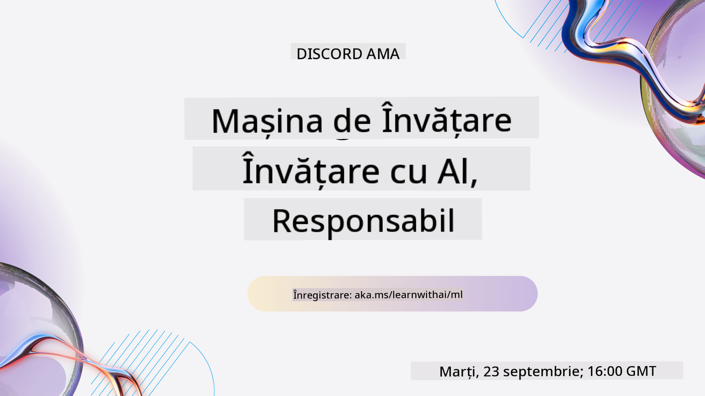
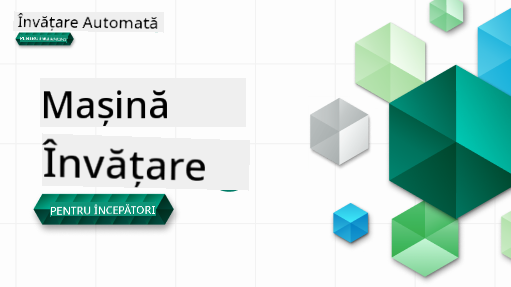

<!--
CO_OP_TRANSLATOR_METADATA:
{
  "original_hash": "1cd24370dee233dd0735e143d87fe385",
  "translation_date": "2025-10-03T12:23:31+00:00",
  "source_file": "README.md",
  "language_code": "ro"
}
-->
  
  
  
  
  

  
  
  

### 🌐 Suport Multi-Limbă  

#### Suportat prin GitHub Action (Automat & Mereu Actualizat)  

[Franceză](../fr/README.md) | [Spaniolă](../es/README.md) | [Germană](../de/README.md) | [Rusă](../ru/README.md) | [Arabă](../ar/README.md) | [Persană (Farsi)](../fa/README.md) | [Urdu](../ur/README.md) | [Chineză (Simplificată)](../zh/README.md) | [Chineză (Tradițională, Macau)](../mo/README.md) | [Chineză (Tradițională, Hong Kong)](../hk/README.md) | [Chineză (Tradițională, Taiwan)](../tw/README.md) | [Japoneză](../ja/README.md) | [Coreeană](../ko/README.md) | [Hindi](../hi/README.md) | [Bengaleză](../bn/README.md) | [Marathi](../mr/README.md) | [Nepaleză](../ne/README.md) | [Punjabi (Gurmukhi)](../pa/README.md) | [Portugheză (Portugalia)](../pt/README.md) | [Portugheză (Brazilia)](../br/README.md) | [Italiană](../it/README.md) | [Poloneză](../pl/README.md) | [Turcă](../tr/README.md) | [Greacă](../el/README.md) | [Thailandeză](../th/README.md) | [Suedeză](../sv/README.md) | [Daneză](../da/README.md) | [Norvegiană](../no/README.md) | [Finlandeză](../fi/README.md) | [Olandeză](../nl/README.md) | [Ebraică](../he/README.md) | [Vietnameză](../vi/README.md) | [Indoneziană](../id/README.md) | [Malayeză](../ms/README.md) | [Tagalog (Filipineză)](../tl/README.md) | [Swahili](../sw/README.md) | [Maghiară](../hu/README.md) | [Cehă](../cs/README.md) | [Slovacă](../sk/README.md) | [Română](./README.md) | [Bulgară](../bg/README.md) | [Sârbă (Chirilică)](../sr/README.md) | [Croată](../hr/README.md) | [Slovenă](../sl/README.md) | [Ucraineană](../uk/README.md) | [Birmaneză (Myanmar)](../my/README.md)  

#### Alăturați-vă Comunității Noastre  

  

Avem o serie de învățare pe Discord despre AI în desfășurare, aflați mai multe și alăturați-vă la [Learn with AI Series](https://aka.ms/learnwithai/discord) între 18 - 30 septembrie, 2025. Veți primi sfaturi și trucuri despre utilizarea GitHub Copilot pentru Știința Datelor.  

  

# Machine Learning pentru Începători - Un Curriculum  

> 🌍 Călătoriți în jurul lumii în timp ce explorăm Machine Learning prin intermediul culturilor mondiale 🌍  

Advocații Cloud de la Microsoft sunt încântați să ofere un curriculum de 12 săptămâni, cu 26 de lecții, despre **Machine Learning**. În acest curriculum, veți învăța despre ceea ce este uneori numit **machine learning clasic**, utilizând în principal biblioteca Scikit-learn și evitând deep learning, care este acoperit în curriculumul nostru [AI pentru Începători](https://aka.ms/ai4beginners). Combinați aceste lecții cu curriculumul nostru ['Data Science pentru Începători'](https://aka.ms/ds4beginners), de asemenea!  

Călătoriți cu noi în jurul lumii în timp ce aplicăm aceste tehnici clasice pe date din multe regiuni ale lumii. Fiecare lecție include chestionare înainte și după lecție, instrucțiuni scrise pentru a finaliza lecția, o soluție, o temă și multe altele. Pedagogia noastră bazată pe proiecte vă permite să învățați în timp ce construiți, o metodă dovedită pentru ca noile abilități să rămână.  

**✍️ Mulțumiri sincere autorilor noștri** Jen Looper, Stephen Howell, Francesca Lazzeri, Tomomi Imura, Cassie Breviu, Dmitry Soshnikov, Chris Noring, Anirban Mukherjee, Ornella Altunyan, Ruth Yakubu și Amy Boyd  

**🎨 Mulțumiri și ilustratorilor noștri** Tomomi Imura, Dasani Madipalli și Jen Looper  

**🙏 Mulțumiri speciale 🙏 autorilor, recenzorilor și contributorilor de conținut Microsoft Student Ambassador**, în special Rishit Dagli, Muhammad Sakib Khan Inan, Rohan Raj, Alexandru Petrescu, Abhishek Jaiswal, Nawrin Tabassum, Ioan Samuila și Snigdha Agarwal  

**🤩 Recunoștință suplimentară pentru Microsoft Student Ambassadors Eric Wanjau, Jasleen Sondhi și Vidushi Gupta pentru lecțiile noastre R!**  

# Începeți  

Urmați acești pași:  
1. **Forkați Repository-ul**: Faceți clic pe butonul "Fork" din colțul din dreapta sus al acestei pagini.  
2. **Clonați Repository-ul**:   `git clone https://github.com/microsoft/ML-For-Beginners.git`  

> [găsiți toate resursele suplimentare pentru acest curs în colecția noastră Microsoft Learn](https://learn.microsoft.com/en-us/collections/qrqzamz1nn2wx3?WT.mc_id=academic-77952-bethanycheum)  

> 🔧 **Aveți nevoie de ajutor?** Consultați [Ghidul nostru de depanare](TROUBLESHOOTING.md) pentru soluții la probleme comune legate de instalare, configurare și rularea lecțiilor.  

**[Studenți](https://aka.ms/student-page)**, pentru a utiliza acest curriculum, forkați întregul repo în propriul cont GitHub și completați exercițiile pe cont propriu sau în grup:  

- Începeți cu un chestionar înainte de lecție.  
- Citiți lecția și completați activitățile, oprindu-vă și reflectând la fiecare verificare a cunoștințelor.  
- Încercați să creați proiectele înțelegând lecțiile, mai degrabă decât rulând codul soluției; totuși, acel cod este disponibil în folderele `/solution` din fiecare lecție orientată pe proiect.  
- Faceți chestionarul de după lecție.  
- Completați provocarea.  
- Completați tema.  
- După finalizarea unui grup de lecții, vizitați [Forum de Discuții](https://github.com/microsoft/ML-For-Beginners/discussions) și "învățați cu voce tare" completând rubricile PAT corespunzătoare. Un 'PAT' este un Instrument de Evaluare a Progresului, o rubrică pe care o completați pentru a vă avansa învățarea. De asemenea, puteți reacționa la alte rubrici PAT pentru a învăța împreună.  

> Pentru studii suplimentare, recomandăm urmarea acestor module și trasee de învățare [Microsoft Learn](https://docs.microsoft.com/en-us/users/jenlooper-2911/collections/k7o7tg1gp306q4?WT.mc_id=academic-77952-leestott).  

**Profesori**, am [inclus câteva sugestii](for-teachers.md) despre cum să utilizați acest curriculum.  

---

## Tutoriale video  

Unele lecții sunt disponibile sub formă de videoclipuri scurte. Le puteți găsi pe toate în lecții, sau pe [playlist-ul ML pentru Începători de pe canalul YouTube Microsoft Developer](https://aka.ms/ml-beginners-videos) făcând clic pe imaginea de mai jos.  

  

---

## Cunoașteți Echipa  

  

**Gif realizat de** [Mohit Jaisal](https://linkedin.com/in/mohitjaisal)  

> 🎥 Faceți clic pe imaginea de mai sus pentru un videoclip despre proiect și persoanele care l-au creat!  

---

## Pedagogie  

Am ales două principii pedagogice în timp ce am construit acest curriculum: asigurarea că este **bazat pe proiecte** și că include **chestionare frecvente**. În plus, acest curriculum are o **temă comună** pentru a-i oferi coeziune.  

Prin asigurarea că conținutul se aliniază cu proiectele, procesul devine mai captivant pentru studenți, iar reținerea conceptelor va fi îmbunătățită. În plus, un chestionar cu miză redusă înainte de o clasă setează intenția studentului de a învăța un subiect, în timp ce un al doilea chestionar după clasă asigură o reținere suplimentară. Acest curriculum a fost conceput să fie flexibil și distractiv și poate fi parcurs în întregime sau parțial. Proiectele încep mici și devin din ce în ce mai complexe până la sfârșitul ciclului de 12 săptămâni. Acest curriculum include, de asemenea, un postscript despre aplicațiile reale ale ML, care poate fi utilizat ca credit suplimentar sau ca bază pentru discuții.  

> Găsiți [Codul nostru de Conduită](CODE_OF_CONDUCT.md), [Contribuții](CONTRIBUTING.md), [Traduceri](TRANSLATIONS.md) și [Ghiduri de Depanare](TROUBLESHOOTING.md). Apreciem feedback-ul constructiv!  

## Fiecare lecție include  

- schiță opțională  
- videoclip suplimentar opțional  
- tutorial video (doar pentru unele lecții)  
- [chestionar de încălzire înainte de lecție](https://ff-quizzes.netlify.app/en/ml/)  
- lecție scrisă  
- pentru lecțiile bazate pe proiecte, ghiduri pas cu pas despre cum să construiți proiectul  
- verificări ale cunoștințelor  
- o provocare  
- lectură suplimentară  
- temă  
- [chestionar de după lecție](https://ff-quizzes.netlify.app/en/ml/)  

> **O notă despre limbaje**: Aceste lecții sunt scrise în principal în Python, dar multe sunt disponibile și în R. Pentru a finaliza o lecție în R, accesați folderul `/solution` și căutați lecțiile R. Acestea includ o extensie .rmd care reprezintă un fișier **R Markdown**, care poate fi definit simplu ca o îmbinare de `fragmente de cod` (din R sau alte limbaje) și un `antet YAML` (care ghidează cum să formateze ieșirile, cum ar fi PDF) într-un `document Markdown`. Astfel, servește ca un cadru exemplar de autor pentru știința datelor, deoarece vă permite să combinați codul, rezultatul acestuia și gândurile dvs. prin scrierea lor în Markdown. Mai mult, documentele R Markdown pot fi transformate în formate de ieșire precum PDF, HTML sau Word.  

> **O notă despre chestionare**: Toate chestionarele sunt conținute în [folderul Quiz App](../../quiz-app), pentru un total de 52 de chestionare, fiecare cu trei întrebări. Acestea sunt legate din lecții, dar aplicația de chestionare poate fi rulată local; urmați instrucțiunile din folderul `quiz-app` pentru a găzdui local sau a implementa pe Azure.  

| Număr Lecție |                             Subiect                              |                   Grupare Lecții                   | Obiective de Învățare                                                                                                             |                                                              Lecție Legată                                                               |                        Autor                        |  
| :-----------: | :------------------------------------------------------------: | :-------------------------------------------------: | ------------------------------------------------------------------------------------------------------------------------------- | :--------------------------------------------------------------------------------------------------------------------------------------: | :--------------------------------------------------: |  
|      01       |                Introducere în machine learning                |      [Introducere](1-Introduction/README.md)       | Învățați conceptele de bază din spatele machine learning                                                                          |                                             [Lecție](1-Introduction/1-intro-to-ML/README.md)                                             |                       Muhammad                       |  
|      02       |                Istoria învățării automate                     |      [Introducere](1-Introduction/README.md)       | Descoperă istoria care stă la baza acestui domeniu                                                                                 |                                            [Lecție](1-Introduction/2-history-of-ML/README.md)                                            |                     Jen și Amy                      |
|      03       |                 Echitate și învățare automată                 |      [Introducere](1-Introduction/README.md)       | Care sunt problemele filosofice importante legate de echitate pe care studenții ar trebui să le ia în considerare când construiesc și aplică modele ML? |                                              [Lecție](1-Introduction/3-fairness/README.md)                                               |                        Tomomi                        |
|      04       |                Tehnici pentru învățarea automată             |      [Introducere](1-Introduction/README.md)       | Ce tehnici folosesc cercetătorii ML pentru a construi modele ML?                                                                   |                                          [Lecție](1-Introduction/4-techniques-of-ML/README.md)                                           |                    Chris și Jen                     |
|      05       |                   Introducere în regresie                    |        [Regresie](2-Regression/README.md)         | Începe să folosești Python și Scikit-learn pentru modele de regresie                                                               |         [Python](2-Regression/1-Tools/README.md) • [R](../../2-Regression/1-Tools/solution/R/lesson_1.html)         |      Jen • Eric Wanjau       |
|      06       |                Prețurile dovlecilor din America de Nord 🎃   |        [Regresie](2-Regression/README.md)         | Vizualizează și curăță datele în pregătirea pentru ML                                                                              |          [Python](2-Regression/2-Data/README.md) • [R](../../2-Regression/2-Data/solution/R/lesson_2.html)          |      Jen • Eric Wanjau       |
|      07       |                Prețurile dovlecilor din America de Nord 🎃   |        [Regresie](2-Regression/README.md)         | Construiește modele de regresie liniară și polinomială                                                                             |        [Python](2-Regression/3-Linear/README.md) • [R](../../2-Regression/3-Linear/solution/R/lesson_3.html)        |      Jen și Dmitry • Eric Wanjau       |
|      08       |                Prețurile dovlecilor din America de Nord 🎃   |        [Regresie](2-Regression/README.md)         | Construiește un model de regresie logistică                                                                                       |     [Python](2-Regression/4-Logistic/README.md) • [R](../../2-Regression/4-Logistic/solution/R/lesson_4.html)      |      Jen • Eric Wanjau       |
|      09       |                          O aplicație web 🔌                  |           [Aplicație web](3-Web-App/README.md)    | Construiește o aplicație web pentru a folosi modelul antrenat                                                                      |                                                 [Python](3-Web-App/1-Web-App/README.md)                                                  |                         Jen                          |
|      10       |                 Introducere în clasificare                   |    [Clasificare](4-Classification/README.md)     | Curăță, pregătește și vizualizează datele; introducere în clasificare                                                              | [Python](4-Classification/1-Introduction/README.md) • [R](../../4-Classification/1-Introduction/solution/R/lesson_10.html)  | Jen și Cassie • Eric Wanjau |
|      11       |             Bucătării delicioase asiatice și indiene 🍜      |    [Clasificare](4-Classification/README.md)     | Introducere în clasificatori                                                                                                      | [Python](4-Classification/2-Classifiers-1/README.md) • [R](../../4-Classification/2-Classifiers-1/solution/R/lesson_11.html) | Jen și Cassie • Eric Wanjau |
|      12       |             Bucătării delicioase asiatice și indiene 🍜      |    [Clasificare](4-Classification/README.md)     | Mai mulți clasificatori                                                                                                           | [Python](4-Classification/3-Classifiers-2/README.md) • [R](../../4-Classification/3-Classifiers-2/solution/R/lesson_12.html) | Jen și Cassie • Eric Wanjau |
|      13       |             Bucătării delicioase asiatice și indiene 🍜      |    [Clasificare](4-Classification/README.md)     | Construiește o aplicație web de recomandări folosind modelul tău                                                                   |                                              [Python](4-Classification/4-Applied/README.md)                                              |                         Jen                          |
|      14       |                   Introducere în clustering                  |        [Clustering](5-Clustering/README.md)         | Curăță, pregătește și vizualizează datele; Introducere în clustering                                                               |         [Python](5-Clustering/1-Visualize/README.md) • [R](../../5-Clustering/1-Visualize/solution/R/lesson_14.html)         |      Jen • Eric Wanjau       |
|      15       |              Explorarea gusturilor muzicale nigeriene 🎧     |        [Clustering](5-Clustering/README.md)         | Explorează metoda clustering K-Means                                                                                              |           [Python](5-Clustering/2-K-Means/README.md) • [R](../../5-Clustering/2-K-Means/solution/R/lesson_15.html)           |      Jen • Eric Wanjau       |
|      16       |        Introducere în procesarea limbajului natural ☕️      |   [Procesarea limbajului natural](6-NLP/README.md) | Învață elementele de bază ale NLP construind un bot simplu                                                                        |                                             [Python](6-NLP/1-Introduction-to-NLP/README.md)                                              |                       Stephen                        |
|      17       |                      Sarcini comune NLP ☕️                  |   [Procesarea limbajului natural](6-NLP/README.md) | Aprofundează cunoștințele despre NLP înțelegând sarcinile comune necesare pentru a lucra cu structuri lingvistice                 |                                                    [Python](6-NLP/2-Tasks/README.md)                                                     |                       Stephen                        |
|      18       |             Traducere și analiză de sentiment ♥️            |   [Procesarea limbajului natural](6-NLP/README.md) | Traducere și analiză de sentiment cu Jane Austen                                                                                  |                                            [Python](6-NLP/3-Translation-Sentiment/README.md)                                             |                       Stephen                        |
|      19       |                  Hoteluri romantice din Europa ♥️           |   [Procesarea limbajului natural](6-NLP/README.md) | Analiză de sentiment cu recenzii de hotel 1                                                                                       |                                               [Python](6-NLP/4-Hotel-Reviews-1/README.md)                                                |                       Stephen                        |
|      20       |                  Hoteluri romantice din Europa ♥️           |   [Procesarea limbajului natural](6-NLP/README.md) | Analiză de sentiment cu recenzii de hotel 2                                                                                       |                                               [Python](6-NLP/5-Hotel-Reviews-2/README.md)                                                |                       Stephen                        |
|      21       |            Introducere în prognoza seriilor temporale       |        [Serii temporale](7-TimeSeries/README.md)   | Introducere în prognoza seriilor temporale                                                                                        |                                             [Python](7-TimeSeries/1-Introduction/README.md)                                              |                      Francesca                       |
|      22       | ⚡️ Utilizarea energiei la nivel mondial ⚡️ - prognoza seriilor temporale cu ARIMA |        [Serii temporale](7-TimeSeries/README.md)   | Prognoza seriilor temporale cu ARIMA                                                                                              |                                                 [Python](7-TimeSeries/2-ARIMA/README.md)                                                 |                      Francesca                       |
|      23       |  ⚡️ Utilizarea energiei la nivel mondial ⚡️ - prognoza seriilor temporale cu SVR  |        [Serii temporale](7-TimeSeries/README.md)   | Prognoza seriilor temporale cu Support Vector Regressor                                                                           |                                                  [Python](7-TimeSeries/3-SVR/README.md)                                                  |                       Anirban                        |
|      24       |             Introducere în învățarea prin întărire          | [Învățarea prin întărire](8-Reinforcement/README.md)| Introducere în învățarea prin întărire cu Q-Learning                                                                              |                                             [Python](8-Reinforcement/1-QLearning/README.md)                                              |                        Dmitry                        |
|      25       |                 Ajută-l pe Peter să evite lupul! 🐺         | [Învățarea prin întărire](8-Reinforcement/README.md)| Învățarea prin întărire Gym                                                                                                       |                                                [Python](8-Reinforcement/2-Gym/README.md)                                                 |                        Dmitry                        |
|  Postscript   |            Scenarii și aplicații ML din lumea reală         |      [ML în lumea reală](9-Real-World/README.md)   | Aplicații interesante și revelatoare ale ML clasic                                                                               |                                             [Lecție](9-Real-World/1-Applications/README.md)                                              |                         Echipa                         |
|  Postscript   |            Debugging-ul modelelor ML folosind tabloul de bord RAI          |      [ML în lumea reală](9-Real-World/README.md)   | Debugging-ul modelelor în învățarea automată folosind componentele tabloului de bord Responsible AI                                                              |                                             [Lecție](9-Real-World/2-Debugging-ML-Models/README.md)                                              |                         Ruth Yakubu                       |

> [găsește toate resursele suplimentare pentru acest curs în colecția noastră Microsoft Learn](https://learn.microsoft.com/en-us/collections/qrqzamz1nn2wx3?WT.mc_id=academic-77952-bethanycheum)

## Acces offline

Poți rula această documentație offline folosind [Docsify](https://docsify.js.org/#/). Clonează acest repo, [instalează Docsify](https://docsify.js.org/#/quickstart) pe mașina ta locală, apoi în folderul rădăcină al acestui repo, tastează `docsify serve`. Website-ul va fi servit pe portul 3000 pe localhost-ul tău: `localhost:3000`.

## PDF-uri

Găsește un PDF al curriculumului cu linkuri [aici](https://microsoft.github.io/ML-For-Beginners/pdf/readme.pdf).

## 🎒 Alte Cursuri 

Echipa noastră produce și alte cursuri! Verifică:

- [Edge AI pentru Începători](https://aka.ms/edgeai-for-beginners)
- [Agenți AI pentru Începători](https://aka.ms/ai-agents-beginners)
- [AI Generativ pentru Începători](https://aka.ms/genai-beginners)
- [AI Generativ pentru Începători .NET](https://github.com/microsoft/Generative-AI-for-beginners-dotnet)
- [AI Generativ cu JavaScript](https://github.com/microsoft/generative-ai-with-javascript)
- [AI Generativ cu Java](https://github.com/microsoft/Generative-AI-for-beginners-java)
- [AI pentru Începători](https://aka.ms/ai-beginners)
- [Știința Datelor pentru Începători](https://aka.ms/datascience-beginners)
- [ML pentru Începători](https://aka.ms/ml-beginners)
- [Securitate Cibernetică pentru Începători](https://github.com/microsoft/Security-101) 
- [Dezvoltare Web pentru Începători](https://aka.ms/webdev-beginners)
- [IoT pentru Începători](https://aka.ms/iot-beginners)
- [Dezvoltare XR pentru Începători](https://github.com/microsoft/xr-development-for-beginners)
- [Stăpânirea GitHub Copilot pentru Programare în Echipe](https://github.com/microsoft/Mastering-GitHub-Copilot-for-Paired-Programming)
- [Stăpânirea GitHub Copilot pentru Dezvoltatori C#/.NET](https://github.com/microsoft/mastering-github-copilot-for-dotnet-csharp-developers)
- [Alege-ți propria aventură Copilot](https://github.com/microsoft/CopilotAdventures)

## Obținerea Ajutorului

Dacă te blochezi sau ai întrebări despre construirea aplicațiilor AI, alătură-te:

Dacă ai feedback despre produs sau întâmpini erori în timpul construirii, vizitează:

---

**Declinare de responsabilitate**:  
Acest document a fost tradus folosind serviciul de traducere AI [Co-op Translator](https://github.com/Azure/co-op-translator). Deși ne străduim să asigurăm acuratețea, vă rugăm să fiți conștienți că traducerile automate pot conține erori sau inexactități. Documentul original în limba sa natală ar trebui considerat sursa autoritară. Pentru informații critice, se recomandă traducerea profesională realizată de un specialist. Nu ne asumăm responsabilitatea pentru eventualele neînțelegeri sau interpretări greșite care pot apărea din utilizarea acestei traduceri.