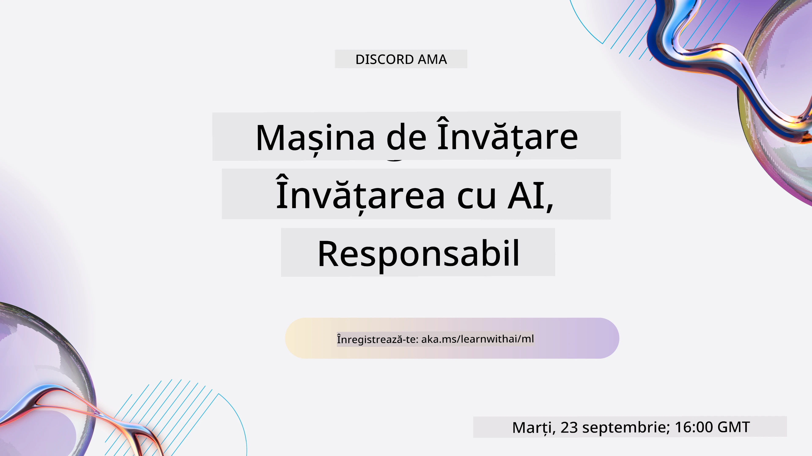
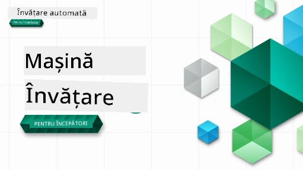

[](https://github.com/microsoft/ML-For-Beginners/blob/master/LICENSE)
[](https://GitHub.com/microsoft/ML-For-Beginners/graphs/contributors/)
[](https://GitHub.com/microsoft/ML-For-Beginners/issues/)
[](https://GitHub.com/microsoft/ML-For-Beginners/pulls/)
[](http://makeapullrequest.com)

[](https://GitHub.com/microsoft/ML-For-Beginners/watchers/)
[](https://GitHub.com/microsoft/ML-For-Beginners/network/)
[](https://GitHub.com/microsoft/ML-For-Beginners/stargazers/)

### 🌐 Suport Multilingv

#### Suportat prin GitHub Action (Automatizat și Întotdeauna Actualizat)

<!-- CO-OP TRANSLATOR LANGUAGES TABLE START -->
[Arabic](../ar/README.md) | [Bengali](../bn/README.md) | [Bulgarian](../bg/README.md) | [Burmese (Myanmar)](../my/README.md) | [Chinese (Simplified)](../zh-CN/README.md) | [Chinese (Traditional, Hong Kong)](../zh-HK/README.md) | [Chinese (Traditional, Macau)](../zh-MO/README.md) | [Chinese (Traditional, Taiwan)](../zh-TW/README.md) | [Croatian](../hr/README.md) | [Czech](../cs/README.md) | [Danish](../da/README.md) | [Dutch](../nl/README.md) | [Estonian](../et/README.md) | [Finnish](../fi/README.md) | [French](../fr/README.md) | [German](../de/README.md) | [Greek](../el/README.md) | [Hebrew](../he/README.md) | [Hindi](../hi/README.md) | [Hungarian](../hu/README.md) | [Indonesian](../id/README.md) | [Italian](../it/README.md) | [Japanese](../ja/README.md) | [Kannada](../kn/README.md) | [Khmer](../km/README.md) | [Korean](../ko/README.md) | [Lithuanian](../lt/README.md) | [Malay](../ms/README.md) | [Malayalam](../ml/README.md) | [Marathi](../mr/README.md) | [Nepali](../ne/README.md) | [Nigerian Pidgin](../pcm/README.md) | [Norwegian](../no/README.md) | [Persian (Farsi)](../fa/README.md) | [Polish](../pl/README.md) | [Portuguese (Brazil)](../pt-BR/README.md) | [Portuguese (Portugal)](../pt-PT/README.md) | [Punjabi (Gurmukhi)](../pa/README.md) | [Romanian](./README.md) | [Russian](../ru/README.md) | [Serbian (Cyrillic)](../sr/README.md) | [Slovak](../sk/README.md) | [Slovenian](../sl/README.md) | [Spanish](../es/README.md) | [Swahili](../sw/README.md) | [Swedish](../sv/README.md) | [Tagalog (Filipino)](../tl/README.md) | [Tamil](../ta/README.md) | [Telugu](../te/README.md) | [Thai](../th/README.md) | [Turkish](../tr/README.md) | [Ukrainian](../uk/README.md) | [Urdu](../ur/README.md) | [Vietnamese](../vi/README.md)

> **Preferi să clonezi local?**
>
> Acest depozit include peste 50 de traduceri de limbi, ceea ce crește semnificativ dimensiunea descărcării. Pentru a clona fără traduceri, folosește checkout-ul sparsat:
>
> **Bash / macOS / Linux:**
> ```bash
> git clone --filter=blob:none --sparse https://github.com/microsoft/ML-For-Beginners.git
> cd ML-For-Beginners
> git sparse-checkout set --no-cone '/*' '!translations' '!translated_images'
> ```
>
> **CMD (Windows):**
> ```cmd
> git clone --filter=blob:none --sparse https://github.com/microsoft/ML-For-Beginners.git
> cd ML-For-Beginners
> git sparse-checkout set --no-cone "/*" "!translations" "!translated_images"
> ```
>
> Aceasta îți oferă tot ce ai nevoie pentru a finaliza cursul cu o descărcare mult mai rapidă.
<!-- CO-OP TRANSLATOR LANGUAGES TABLE END -->

#### Alătură-te Comunității Noastre

[](https://discord.gg/nTYy5BXMWG)

Avem o serie Discord despre învățarea cu AI în desfășurare, află mai multe și alătură-te la [Seria Learn with AI](https://aka.ms/learnwithai/discord) între 18 - 30 septembrie 2025. Vei primi sfaturi și trucuri pentru utilizarea GitHub Copilot pentru Știința Datelor.



# Învățare Automată pentru Începători - Un Curriculum

> 🌍 Călătorește în jurul lumii în timp ce explorăm Învățarea Automată prin intermediul culturilor lumii 🌍

Cloud Advocates la Microsoft sunt încântați să ofere un curriculum de 12 săptămâni, cu 26 de lecții, totul despre **Învățarea Automată**. În acest curriculum, vei învăța despre ceea ce se numește uneori **învățarea automată clasică**, folosind în principal biblioteca Scikit-learn și evitând învățarea profundă, care este acoperită în curriculumul nostru [AI pentru Începători](https://aka.ms/ai4beginners). Combină aceste lecții cu curriculumul nostru ['Știința Datelor pentru Începători'](https://aka.ms/ds4beginners)!

Călătorește cu noi în jurul lumii aplicând aceste tehnici clasice pe date din multe zone ale lumii. Fiecare lecție include teste pre- și post-lectură, instrucțiuni scrise pentru a finaliza lecția, o soluție, un exercițiu și altele. Pedagogia noastră bazată pe proiecte îți permite să înveți în timp ce construiești, o metodă dovedită ca fiind eficientă pentru reținerea noilor competențe.

**✍️ Mulțumiri călduroase autorilor noștri** Jen Looper, Stephen Howell, Francesca Lazzeri, Tomomi Imura, Cassie Breviu, Dmitry Soshnikov, Chris Noring, Anirban Mukherjee, Ornella Altunyan, Ruth Yakubu și Amy Boyd

**🎨 Mulțumiri și ilustratorilor** Tomomi Imura, Dasani Madipalli și Jen Looper

**🙏 Mulțumiri speciale 🙏 autorilor studenți ambasadori Microsoft, recenzorilor și colaboratorilor de conținut**, în special Rishit Dagli, Muhammad Sakib Khan Inan, Rohan Raj, Alexandru Petrescu, Abhishek Jaiswal, Nawrin Tabassum, Ioan Samuila și Snigdha Agarwal

**🤩 Recunoștință suplimentară ambasadorilor studenți Microsoft Eric Wanjau, Jasleen Sondhi și Vidushi Gupta pentru lecțiile noastre în R!**

# Începutul

Urmează acești pași:
1. **Feez-ul Depozitului**: Apasă pe butonul "Fork" din colțul din dreapta sus al acestei pagini.
2. **Clonează Depozitul**:   `git clone https://github.com/microsoft/ML-For-Beginners.git`

> 💡 **Sfat pentru început rapid:** Vrei să începi într-un browser fără să instalezi Python local? Folosește [GitHub Codespaces](https://github.com/features/codespaces) pentru a crea un mediu de dezvoltare în cloud pentru fork-ul tău. Deschide meniul verde **Code**, selectează **Codespaces** și creează un codespace; instalează în interiorul său fiecare dependență necesară lecției, după caz.

> [găsește toate resursele suplimentare pentru acest curs în colecția noastră Microsoft Learn](https://learn.microsoft.com/en-us/collections/qrqzamz1nn2wx3?WT.mc_id=academic-77952-bethanycheum)

> 🔧 **Ai nevoie de ajutor?** Verifică [Ghidul de Depanare](TROUBLESHOOTING.md) pentru soluții la probleme comune cu instalarea, configurarea și rularea lecțiilor.


**[Studenți](https://aka.ms/student-page)**, pentru a folosi acest curriculum, fork-uiți întregul repo în propriul vostru cont GitHub și finalizați exercițiile pe cont propriu sau în grup:

- Începe cu un test pre-lectură.
- Citește lecția și finalizează activitățile, făcând pauze pentru reflecție la fiecare verificare de cunoștințe.
- Încearcă să creezi proiectele înțelegând lecțiile, mai degrabă decât executând codul soluției; totuși, acel cod este disponibil în folderele `/solution` din fiecare lecție orientată pe proiect.
- Fă testul post-lectură.
- Finalizează provocarea.
- Completează temele.
- După finalizarea unui grup de lecții, vizitează [Discussion Board](https://github.com/microsoft/ML-For-Beginners/discussions) și „învață în voce tare” completând rubrică PAT corespunzătoare. Un „PAT” este un Instrument de Evaluare a Progresului, o rubrică pe care o completezi pentru a-ți aprofunda învățarea. Poți, de asemenea, să reacționezi la alte PAT-uri pentru a învăța împreună.

> Pentru studiu suplimentar, recomandăm urmarea acestor module și trasee de învățare [Microsoft Learn](https://docs.microsoft.com/en-us/users/jenlooper-2911/collections/k7o7tg1gp306q4?WT.mc_id=academic-77952-leestott).

**Profesori**, am inclus [unele sugestii](for-teachers.md) despre cum să folosiți acest curriculum.

---

## Parcurgeri video

Unele lecții sunt disponibile ca video scurte. Le puteți găsi integrate în lecții sau pe [playlist-ul ML for Beginners de pe canalul Microsoft Developer YouTube](https://aka.ms/ml-beginners-videos) făcând clic pe imaginea de mai jos.

[](https://aka.ms/ml-beginners-videos)

---

## Cunoaște Echipa

[](https://youtu.be/Tj1XWrDSYJU)

**Gif de** [Mohit Jaisal](https://linkedin.com/in/mohitjaisal)

> 🎥 Dă clic pe imaginea de mai sus pentru un video despre proiect și oamenii care l-au creat!

---

## Pedagogie

Am ales două principii pedagogice în construirea acestui curriculum: asigurarea că este hands-on **bazat pe proiecte** și că include **teste frecvente**. În plus, acest curriculum are o **temă** comună pentru coeziune.

Prin alinierea conținutului cu proiecte, procesul devine mai captivant pentru studenți și reținerea conceptelor va fi augmentată. De asemenea, un test de nivel scăzut înainte de lecție setează intenția studentului de a învăța un subiect, iar un al doilea test după lecție asigură reținerea suplimentară. Acest curriculum a fost conceput să fie flexibil și distractiv și poate fi parcurs integral sau parțial. Proiectele încep mici și devin tot mai complexe până la sfârșitul ciclului de 12 săptămâni. Curriculumul include și un postscript despre aplicații reale ale IA, care poate fi folosit ca punct extra sau ca bază pentru discuții.

> Găsiți [Codul de Conduită](CODE_OF_CONDUCT.md), [Contribuții](CONTRIBUTING.md), [Traduceri](..) și [Depanare](TROUBLESHOOTING.md). Așteptăm cu interes feedback-ul vostru constructiv!

## Fiecare lecție include

- schiță opțională
- video suplimentar opțional
- parcurgere video (doar unele lecții)
- [test de încălzire pre-lectură](https://ff-quizzes.netlify.app/en/ml/)
- lecția scrisă
- pentru lecțiile bazate pe proiect, ghiduri pas cu pas pentru construirea proiectului
- verificări de cunoștințe
- o provocare
- lectură suplimentară
- temă
- [test post-lectură](https://ff-quizzes.netlify.app/en/ml/)

> **O notă despre limbaje**: Aceste lecții sunt scrise în principal în Python, dar multe sunt disponibile și în R. Pentru a finaliza o lecție R, mergi în folderul `/solution` și caută lecțiile R. Acestea au extensia .rmd, care reprezintă un fișier **R Markdown** ce poate fi definit simplu ca o încorporare de `blocuri de cod` (de R sau alte limbaje) și un `header YAML` (care ghidează formatarea output-urilor, cum ar fi PDF) într-un `document Markdown`. Ca atare, servește ca un cadru ideal de creare de conținut pentru știința datelor, permițând să combini codul, rezultatele și gândurile tale, scriindu-le în Markdown. În plus, documentele R Markdown pot fi randate în formate precum PDF, HTML sau Word.

> **O notă despre teste**: Toate testele sunt în [folderul Quiz App](../../quiz-app), 52 teste în total cu câte trei întrebări fiecare. Sunt legate din interiorul lecțiilor, dar aplicația de teste poate fi rulată local; urmează instrucțiunile din folderul `quiz-app` pentru a găzdui local sau a implementa pe Azure.

| Număr Lecție |                             Subiect                               |                   Grupare Lecții                   | Obiective de Învățare                                                                                                          |                                                              Lecție Legată                                                               |                        Autor                         |
| :-----------: | :------------------------------------------------------------: | :-------------------------------------------------: | ------------------------------------------------------------------------------------------------------------------------------- | :--------------------------------------------------------------------------------------------------------------------------------------: | :--------------------------------------------------: |
|      01       |                Introducere în învățarea automată              |      [Introduction](1-Introduction/README.md)       | Învață conceptele de bază din spatele învățării automate                                                                           |                                             [Lesson](1-Introduction/1-intro-to-ML/README.md)                                             |                       Muhammad                       |
|      02       |                Istoria învățării automate                      |      [Introduction](1-Introduction/README.md)       | Învață istoria care stă la baza acestui domeniu                                                                                     |                                            [Lesson](1-Introduction/2-history-of-ML/README.md)                                            |                     Jen și Amy                        |
|      03       |                 Corectitudine și învățarea automată            |      [Introduction](1-Introduction/README.md)       | Care sunt problemele filosofice importante legate de corectitudine pe care studenții ar trebui să le ia în considerare când construiesc și aplică modele ML? |                                              [Lesson](1-Introduction/3-fairness/README.md)                                               |                        Tomomi                        |
|      04       |                Tehnici pentru învățarea automată              |      [Introduction](1-Introduction/README.md)       | Ce tehnici folosesc cercetătorii în ML pentru a construi modele de învățare automată?                                               |                                          [Lesson](1-Introduction/4-techniques-of-ML/README.md)                                           |                    Chris și Jen                      |
|      05       |                   Introducere în regresie                      |        [Regression](2-Regression/README.md)         | Începe cu Python și Scikit-learn pentru modele de regresie                                                                          |         [Python](2-Regression/1-Tools/README.md) • [R](../../2-Regression/1-Tools/solution/R/lesson_1.html)         |      Jen • Eric Wanjau       |
|      06       |                Prețurile dovlecilor din America de Nord 🎃                |        [Regression](2-Regression/README.md)         | Vizualizează și curăță datele pentru pregătire pentru ML                                                                           |          [Python](2-Regression/2-Data/README.md) • [R](../../2-Regression/2-Data/solution/R/lesson_2.html)          |      Jen • Eric Wanjau       |
|      07       |                Prețurile dovlecilor din America de Nord 🎃                |        [Regression](2-Regression/README.md)         | Construiește modele de regresie liniară și polinomială                                                                            |        [Python](2-Regression/3-Linear/README.md) • [R](../../2-Regression/3-Linear/solution/R/lesson_3.html)        |      Jen și Dmitry • Eric Wanjau       |
|      08       |                Prețurile dovlecilor din America de Nord 🎃                |        [Regression](2-Regression/README.md)         | Construiește un model de regresie logistică                                                                                         |     [Python](2-Regression/4-Logistic/README.md) • [R](../../2-Regression/4-Logistic/solution/R/lesson_4.html)      |      Jen • Eric Wanjau       |
|      09       |                          O aplicație web 🔌                          |           [Web App](3-Web-App/README.md)            | Construiește o aplicație web pentru a folosi modelul antrenat                                                                      |                                                 [Python](3-Web-App/1-Web-App/README.md)                                                  |                         Jen                          |
|      10       |                 Introducere în clasificare                     |    [Classification](4-Classification/README.md)     | Curăță, pregătește și vizualizează datele; introducere în clasificare                                                               | [Python](4-Classification/1-Introduction/README.md) • [R](../../4-Classification/1-Introduction/solution/R/lesson_10.html)  | Jen și Cassie • Eric Wanjau |
|      11       |             Bucătării asiatice și indiene delicioase 🍜             |    [Classification](4-Classification/README.md)     | Introducere în clasificatori                                                                                                        | [Python](4-Classification/2-Classifiers-1/README.md) • [R](../../4-Classification/2-Classifiers-1/solution/R/lesson_11.html) | Jen și Cassie • Eric Wanjau |
|      12       |             Bucătării asiatice și indiene delicioase 🍜             |    [Classification](4-Classification/README.md)     | Mai mulți clasificatori                                                                                                            | [Python](4-Classification/3-Classifiers-2/README.md) • [R](../../4-Classification/3-Classifiers-2/solution/R/lesson_12.html) | Jen și Cassie • Eric Wanjau |
|      13       |             Bucătării asiatice și indiene delicioase 🍜             |    [Classification](4-Classification/README.md)     | Construiește o aplicație web recomandantă folosind modelul tău                                                                     |                                              [Python](4-Classification/4-Applied/README.md)                                              |                         Jen                          |
|      14       |                   Introducere în clustering                      |        [Clustering](5-Clustering/README.md)         | Curăță, pregătește și vizualizează datele; Introducere în clustering                                                             |         [Python](5-Clustering/1-Visualize/README.md) • [R](../../5-Clustering/1-Visualize/solution/R/lesson_14.html)         |      Jen • Eric Wanjau       |
|      15       |              Explorarea gusturilor muzicale nigeriene 🎧              |        [Clustering](5-Clustering/README.md)         | Explorează metoda de clustering K-Means                                                                                           |           [Python](5-Clustering/2-K-Means/README.md) • [R](../../5-Clustering/2-K-Means/solution/R/lesson_15.html)           |      Jen • Eric Wanjau       |
|      16       |        Introducere în procesarea limbajului natural ☕️         |   [Natural language processing](6-NLP/README.md)    | Învață elementele de bază despre NLP construind un bot simplu                                                                      |                                             [Python](6-NLP/1-Introduction-to-NLP/README.md)                                              |                       Stephen                        |
|      17       |                      Sarcini comune NLP ☕️                      |   [Natural language processing](6-NLP/README.md)    | Aprofundează-ți cunoștințele despre NLP înțelegând sarcinile comune atunci când lucrezi cu structuri de limbaj                     |                                                    [Python](6-NLP/2-Tasks/README.md)                                                     |                       Stephen                        |
|      18       |             Traducere și analiză a sentimentelor ♥️              |   [Natural language processing](6-NLP/README.md)    | Traducere și analiză a sentimentelor cu Jane Austen                                                                               |                                            [Python](6-NLP/3-Translation-Sentiment/README.md)                                             |                       Stephen                        |
|      19       |                  Hoteluri romantice din Europa ♥️                  |   [Natural language processing](6-NLP/README.md)    | Analiza sentimentelor cu recenzii de hoteluri 1                                                                                   |                                               [Python](6-NLP/4-Hotel-Reviews-1/README.md)                                                |                       Stephen                        |
|      20       |                  Hoteluri romantice din Europa ♥️                  |   [Natural language processing](6-NLP/README.md)    | Analiza sentimentelor cu recenzii de hoteluri 2                                                                                   |                                               [Python](6-NLP/5-Hotel-Reviews-2/README.md)                                                |                       Stephen                        |
|      21       |            Introducere în prognoza seriilor temporale            |        [Time series](7-TimeSeries/README.md)        | Introducere în prognoza seriilor temporale                                                                                        |                                             [Python](7-TimeSeries/1-Introduction/README.md)                                              |                      Francesca                       |
|      22       | ⚡️ Utilizarea energiei la nivel mondial ⚡️ - prognoză cu ARIMA   |        [Time series](7-TimeSeries/README.md)        | Prognoza seriilor temporale cu ARIMA                                                                                              |                                                 [Python](7-TimeSeries/2-ARIMA/README.md)                                                 |                      Francesca                       |
|      23       |  ⚡️ Utilizarea energiei la nivel mondial ⚡️ - prognoză cu SVR   |        [Time series](7-TimeSeries/README.md)        | Prognoza seriilor temporale cu Support Vector Regressor                                                                           |                                                  [Python](7-TimeSeries/3-SVR/README.md)                                                  |                       Anirban                        |
|      24       |             Introducere în învățarea prin întărire               | [Reinforcement learning](8-Reinforcement/README.md) | Introducere în învățarea prin întărire folosind Q-Learning                                                                        |                                             [Python](8-Reinforcement/1-QLearning/README.md)                                              |                        Dmitry                        |
|      25       |                 Ajută-l pe Peter să evite lupul! 🐺              | [Reinforcement learning](8-Reinforcement/README.md) | Învățarea prin întărire în mediul Gym                                                                                             |                                                [Python](8-Reinforcement/2-Gym/README.md)                                                 |                        Dmitry                        |
|  Postscript   |            Scenarii și aplicații reale ML                        |      [ML in the Wild](9-Real-World/README.md)       | Aplicații interesante și revelatoare ale ML clasice în lumea reală                                                                |                                             [Lesson](9-Real-World/1-Applications/README.md)                                              |                         Echipa                        |
|  Postscript   |            Depanare modele ML folosind dashboard-ul RAI          |      [ML in the Wild](9-Real-World/README.md)       | Depanarea modelelor în învățarea automată folosind componentele dashboard-ului Responsible AI                                     |                                             [Lesson](9-Real-World/2-Debugging-ML-Models/README.md)                                              |                     Ruth Yakubu                      |

> [găsește toate resursele suplimentare pentru acest curs în colecția noastră Microsoft Learn](https://learn.microsoft.com/en-us/collections/qrqzamz1nn2wx3?WT.mc_id=academic-77952-bethanycheum)

## Acces offline

Poți rula această documentație offline folosind [Docsify](https://docsify.js.org/#/). Copiază acest repo, [instalează Docsify](https://docsify.js.org/#/quickstart) pe mașina ta locală, apoi în folderul rădăcină al acestui repo, tastează `docsify serve`. Site-ul va fi servit pe portul 3000 pe localhost-ul tău: `localhost:3000`.

## Fișiere PDF

Găsește un pdf al curriculumului cu linkuri [aici](https://microsoft.github.io/ML-For-Beginners/pdf/readme.pdf).


## 🎒 Alte cursuri

Echipa noastră produce și alte cursuri! Verifică:

<!-- CO-OP TRANSLATOR OTHER COURSES START -->
### LangChain
[](https://aka.ms/langchain4j-for-beginners)
[](https://aka.ms/langchainjs-for-beginners?WT.mc_id=m365-94501-dwahlin)
[](https://github.com/microsoft/langchain-for-beginners?WT.mc_id=m365-94501-dwahlin)
---

### Azure / Edge / MCP / Agenți
[](https://github.com/microsoft/AZD-for-beginners?WT.mc_id=academic-105485-koreyst)
[](https://github.com/microsoft/edgeai-for-beginners?WT.mc_id=academic-105485-koreyst)
[](https://github.com/microsoft/mcp-for-beginners?WT.mc_id=academic-105485-koreyst)
[](https://github.com/microsoft/ai-agents-for-beginners?WT.mc_id=academic-105485-koreyst)

---
 
### Seria AI Generativ
[](https://github.com/microsoft/generative-ai-for-beginners?WT.mc_id=academic-105485-koreyst)
[-9333EA?style=for-the-badge&labelColor=E5E7EB&color=9333EA)](https://github.com/microsoft/Generative-AI-for-beginners-dotnet?WT.mc_id=academic-105485-koreyst)
[-C084FC?style=for-the-badge&labelColor=E5E7EB&color=C084FC)](https://github.com/microsoft/generative-ai-for-beginners-java?WT.mc_id=academic-105485-koreyst)
[-E879F9?style=for-the-badge&labelColor=E5E7EB&color=E879F9)](https://github.com/microsoft/generative-ai-with-javascript?WT.mc_id=academic-105485-koreyst)

---
 
### Învățare de bază
[](https://aka.ms/ml-beginners?WT.mc_id=academic-105485-koreyst)
[](https://aka.ms/datascience-beginners?WT.mc_id=academic-105485-koreyst)
[](https://aka.ms/ai-beginners?WT.mc_id=academic-105485-koreyst)
[](https://github.com/microsoft/Security-101?WT.mc_id=academic-96948-sayoung)
[](https://aka.ms/webdev-beginners?WT.mc_id=academic-105485-koreyst)
[](https://aka.ms/iot-beginners?WT.mc_id=academic-105485-koreyst)
[](https://github.com/microsoft/xr-development-for-beginners?WT.mc_id=academic-105485-koreyst)

---
 
### Seria Copilot
[](https://aka.ms/GitHubCopilotAI?WT.mc_id=academic-105485-koreyst)
[](https://github.com/microsoft/mastering-github-copilot-for-dotnet-csharp-developers?WT.mc_id=academic-105485-koreyst)
[](https://github.com/microsoft/CopilotAdventures?WT.mc_id=academic-105485-koreyst)
<!-- CO-OP TRANSLATOR OTHER COURSES END -->

## Obținerea ajutorului

Dacă te blochezi sau ai întrebări în timp ce înveți Învățarea Automată sau construiești aplicații AI, nu-ți face griji — ajutorul este disponibil.

Poți participa la discuții cu alți cursanți și dezvoltatori, poți pune întrebări și îți poți împărtăși ideile cu comunitatea.

- Alătură-te comunității pentru a pune întrebări și a învăța împreună cu alții
- Discută concepte de învățare automată și idei de proiecte
- Primește îndrumări de la dezvoltatori experimentați

O comunitate de sprijin este o modalitate excelentă de a-ți dezvolta abilitățile și de a rezolva problemele mai rapid.

[Microsoft Foundry Discord Community](https://discord.gg/nTYy5BXMWG)

Dacă întâlnești erori, bug-uri sau ai sugestii de îmbunătățiri, poți deschide și un **Issue** în acest depozit pentru a raporta problema.

Pentru feedback despre produs sau pentru a căuta postări existente în comunitate, vizitează Forumul Dezvoltatorilor:

[](https://aka.ms/foundry/forum)

## Sfaturi suplimentare pentru învățare

- Recapitulează caietele de notițe după fiecare lecție pentru o mai bună înțelegere.
- Exersează implementarea algoritmilor pe cont propriu.
- Explorează seturi de date din lumea reală folosind conceptele învățate.

---

<!-- CO-OP TRANSLATOR DISCLAIMER START -->
**Declinare a responsabilității**:
Acest document a fost tradus folosind serviciul de traducere AI [Co-op Translator](https://github.com/Azure/co-op-translator). În timp ce ne străduim pentru acuratețe, vă rugăm să rețineți că traducerile automate pot conține erori sau inexactități. Documentul original în limba sa nativă trebuie considerat sursa autorizată. Pentru informații critice, se recomandă traducerea profesională realizată de un om. Nu ne asumăm responsabilitatea pentru eventualele neînțelegeri sau interpretări greșite care decurg din utilizarea acestei traduceri.
<!-- CO-OP TRANSLATOR DISCLAIMER END -->