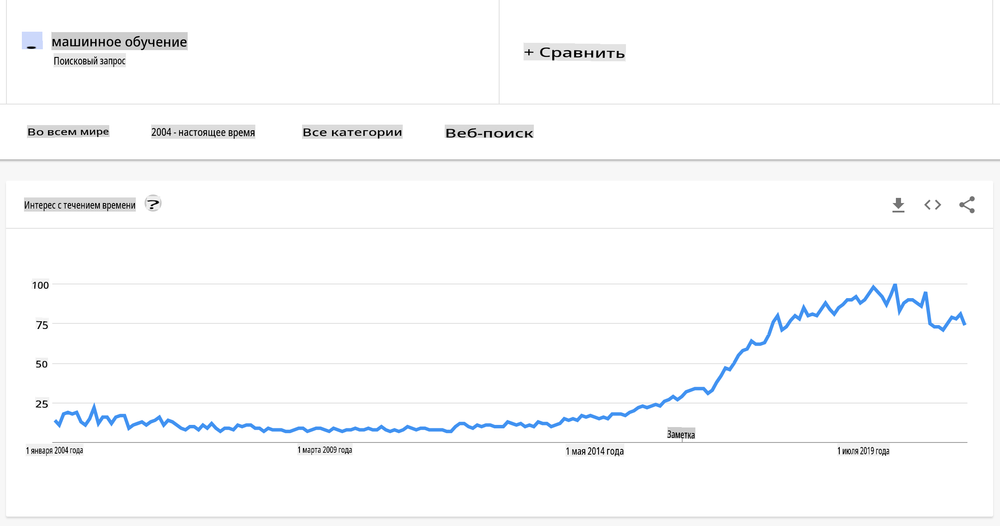
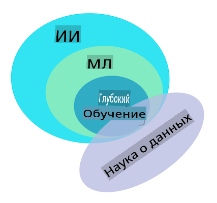

# Введение в машинное обучение

## [Предварительный тест](https://gray-sand-07a10f403.1.azurestaticapps.net/quiz/1/)

---

> 🎥 Нажмите на изображение выше, чтобы посмотреть короткое видео, посвященное этому уроку.

Добро пожаловать на этот курс по классическому машинному обучению для начинающих! Независимо от того, являетесь ли вы новичком в этой теме или опытным практиком машинного обучения, который хочет освежить свои знания, мы рады видеть вас! Мы хотим создать дружелюбную стартовую площадку для вашего изучения машинного обучения и будем рады оценить, ответить на ваши замечания и учесть ваш [отзыв](https://github.com/microsoft/ML-For-Beginners/discussions).

---
## Начало работы с машинным обучением

Перед тем как приступить к этому учебному плану, вам нужно настроить ваш компьютер и подготовить его для запуска блокнотов локально.

- **Настройте свой компьютер с помощью этих видео**. Используйте следующие ссылки, чтобы узнать [как установить Python](https://youtu.be/CXZYvNRIAKM) в вашей системе и [настроить текстовый редактор](https://youtu.be/EU8eayHWoZg) для разработки.
- **Изучите Python**. Также рекомендуется иметь базовые знания о [Python](https://docs.microsoft.com/learn/paths/python-language/?WT.mc_id=academic-77952-leestott), языке программирования, полезном для дата-сайентистов, который мы используем в этом курсе.
- **Изучите Node.js и JavaScript**. Мы также используем JavaScript несколько раз в этом курсе при создании веб-приложений, поэтому вам потребуется установить [node](https://nodejs.org) и [npm](https://www.npmjs.com/), а также иметь [Visual Studio Code](https://code.visualstudio.com/) для разработки на Python и JavaScript.
- **Создайте аккаунт на GitHub**. Поскольку вы нашли нас здесь на [GitHub](https://github.com), у вас, возможно, уже есть аккаунт, но если нет, создайте его, а затем сделайте форк этого учебного плана, чтобы использовать его самостоятельно. (Не стесняйтесь ставить нам звезду тоже 😊)
- **Изучите Scikit-learn**. Ознакомьтесь с [Scikit-learn](https://scikit-learn.org/stable/user_guide.html), набором библиотек машинного обучения, на которые мы ссылаемся в этих уроках.

---
## Что такое машинное обучение?

Термин "машинное обучение" является одним из самых популярных и часто используемых в наше время. Есть большая вероятность, что вы слышали этот термин хотя бы раз, если у вас есть какое-либо знакомство с технологиями, независимо от области вашей работы. Однако механика машинного обучения остается загадкой для большинства людей. Для новичка в машинном обучении эта тема может иногда казаться подавляющей. Поэтому важно понимать, что такое машинное обучение, и изучать его шаг за шагом, через практические примеры.

---
## Кривая ажиотажа

> Google Trends показывает недавнюю "кривую ажиотажа" термина "машинное обучение"

---
## Загадочная вселенная

Мы живем во вселенной, полной увлекательных тайн. Великие ученые, такие как Стивен Хокинг, Альберт Эйнштейн и многие другие, посвятили свои жизни поиску значимой информации, раскрывающей тайны мира вокруг нас. Это человеческая природа учиться: человеческий ребенок учит новые вещи и раскрывает структуру своего мира год за годом, когда он становится взрослым.

---
## Мозг ребенка

Мозг ребенка и его чувства воспринимают факты окружающей среды и постепенно изучают скрытые закономерности жизни, которые помогают ребенку формировать логические правила для определения изученных паттернов. Процесс обучения человеческого мозга делает людей самыми сложными живыми существами в этом мире. Непрерывное обучение, открытие скрытых закономерностей и затем их инновация позволяет нам становиться все лучше и лучше на протяжении всей жизни. Эта способность к обучению и эволюции связана с концепцией, называемой [пластичностью мозга](https://www.simplypsychology.org/brain-plasticity.html). На поверхностном уровне мы можем провести некоторые мотивационные параллели между процессом обучения человеческого мозга и концепциями машинного обучения.

---
## Человеческий мозг

[Человеческий мозг](https://www.livescience.com/29365-human-brain.html) воспринимает вещи из реального мира, обрабатывает полученную информацию, принимает рациональные решения и выполняет определенные действия в зависимости от обстоятельств. Это то, что мы называем интеллектуальным поведением. Когда мы программируем подобие интеллектуального поведения в машину, это называется искусственным интеллектом (ИИ).

---
## Некоторые термины

Хотя термины могут вызывать путаницу, машинное обучение (ML) является важным подмножеством искусственного интеллекта. **ML касается использования специализированных алгоритмов для выявления значимой информации и нахождения скрытых закономерностей в воспринимаемых данных для подтверждения процесса рационального принятия решений**.

---
## ИИ, ML, глубокое обучение

> Диаграмма, показывающая взаимосвязи между ИИ, ML, глубоким обучением и наукой о данных. Инфографика от [Jen Looper](https://twitter.com/jenlooper), вдохновленная [этой графикой](https://softwareengineering.stackexchange.com/questions/366996/distinction-between-ai-ml-neural-networks-deep-learning-and-data-mining)

---
## Концепции для изучения

В этом учебном плане мы будем охватывать только основные концепции машинного обучения, которые должен знать новичок. Мы рассматриваем то, что называем "классическим машинным обучением", в основном используя Scikit-learn, отличную библиотеку, которую многие студенты используют для изучения основ. Чтобы понять более широкие концепции искусственного интеллекта или глубокого обучения, необходимо иметь прочные фундаментальные знания о машинном обучении, и поэтому мы хотели бы предложить это здесь.

---
## В этом курсе вы узнаете:

- основные концепции машинного обучения
- историю ML
- ML и справедливость
- техники регрессии в ML
- техники классификации в ML
- техники кластеризации в ML
- техники обработки естественного языка в ML
- техники прогнозирования временных рядов в ML
- обучение с подкреплением
- реальные приложения для ML

---
## Что мы не будем охватывать

- глубокое обучение
- нейронные сети
- ИИ

Чтобы обеспечить лучший опыт обучения, мы будем избегать сложностей нейронных сетей, "глубокого обучения" - многослойного моделирования с использованием нейронных сетей - и ИИ, которые мы обсудим в другом учебном плане. Мы также предложим будущий учебный план по науке о данных, чтобы сосредоточиться на этом аспекте более широкой области.

---
## Почему стоит изучать машинное обучение?

С точки зрения систем, машинное обучение определяется как создание автоматизированных систем, которые могут выявлять скрытые закономерности из данных, чтобы помочь в принятии интеллектуальных решений.

Эта мотивация свободно вдохновлена тем, как человеческий мозг учится определенным вещам на основе данных, которые он воспринимает из внешнего мира.

✅ Подумайте минуту, почему бизнес хотел бы попробовать использовать стратегии машинного обучения, а не создать жестко закодированный движок на основе правил.

---
## Применения машинного обучения

Применения машинного обучения теперь почти повсюду и так же повсеместны, как данные, которые циркулируют в нашем обществе, генерируемые нашими смартфонами, подключенными устройствами и другими системами. Учитывая огромный потенциал современных алгоритмов машинного обучения, исследователи изучают их способность решать многомерные и многодисциплинарные проблемы реальной жизни с отличными положительными результатами.

---
## Примеры прикладного ML

**Вы можете использовать машинное обучение многими способами**:

- Для прогнозирования вероятности заболевания на основе медицинской истории или отчетов пациента.
- Для использования данных о погоде для прогнозирования погодных явлений.
- Для понимания настроения текста.
- Для обнаружения фейковых новостей, чтобы остановить распространение пропаганды.

Финансовые, экономические, землеведческие, космические, биомедицинские, когнитивные науки и даже гуманитарные дисциплины адаптировали машинное обучение для решения сложных задач обработки данных в своей области.

---
## Заключение

Машинное обучение автоматизирует процесс обнаружения закономерностей, находя значимые инсайты из реальных или сгенерированных данных. Оно доказало свою высокую ценность в бизнесе, здравоохранении и финансовых приложениях, среди прочего.

В ближайшем будущем понимание основ машинного обучения станет необходимым для людей из любой области из-за его широкого применения.

---
# 🚀 Задача

Нарисуйте на бумаге или используя онлайн-приложение, такое как [Excalidraw](https://excalidraw.com/), ваше понимание различий между ИИ, ML, глубоким обучением и наукой о данных. Добавьте несколько идей о проблемах, которые каждая из этих техник хорошо решает.

# [Пост-тест](https://gray-sand-07a10f403.1.azurestaticapps.net/quiz/2/)

---
# Обзор и самостоятельное изучение

Чтобы узнать больше о том, как работать с алгоритмами ML в облаке, следуйте этому [Учебному пути](https://docs.microsoft.com/learn/paths/create-no-code-predictive-models-azure-machine-learning/?WT.mc_id=academic-77952-leestott).

Пройдите [Учебный путь](https://docs.microsoft.com/learn/modules/introduction-to-machine-learning/?WT.mc_id=academic-77952-leestott) о основах ML.

---
# Задание

[Запустите и настройте](assignment.md)

**Отказ от ответственности**:  
Этот документ был переведен с использованием услуг машинного перевода на основе ИИ. Хотя мы стремимся к точности, пожалуйста, имейте в виду, что автоматические переводы могут содержать ошибки или неточности. Оригинальный документ на родном языке следует считать авторитетным источником. Для критически важной информации рекомендуется профессиональный перевод человеком. Мы не несем ответственности за любые недоразумения или неверные толкования, возникающие в результате использования этого перевода.