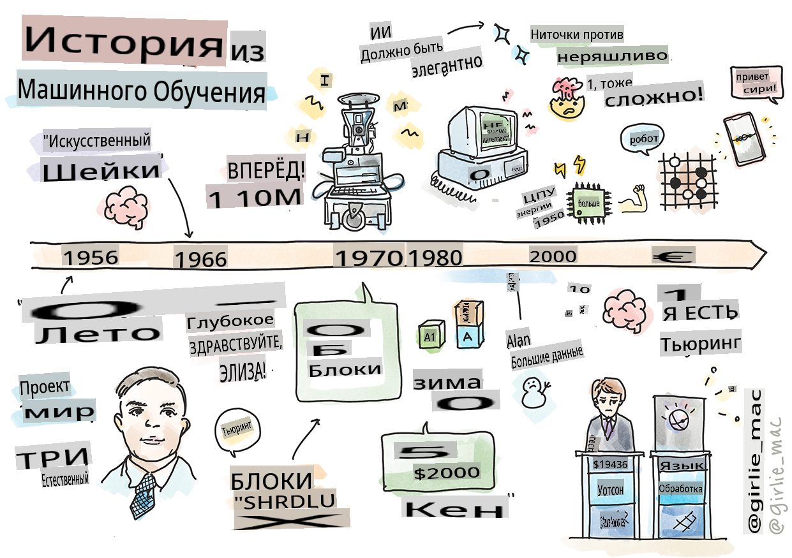
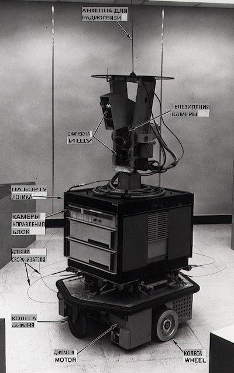
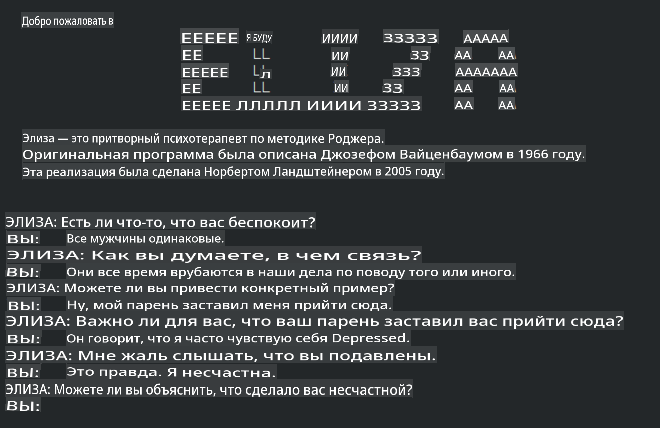

# История машинного обучения

> Скетч от [Томоми Имура](https://www.twitter.com/girlie_mac)

## [Предварительный тест](https://gray-sand-07a10f403.1.azurestaticapps.net/quiz/3/)

---

> 🎥 Нажмите на изображение выше, чтобы посмотреть короткое видео по этому уроку.

В этом уроке мы рассмотрим основные вехи в истории машинного обучения и искусственного интеллекта.

История искусственного интеллекта (ИИ) как области переплетена с историей машинного обучения, так как алгоритмы и вычислительные достижения, лежащие в основе МЛ, способствовали развитию ИИ. Полезно помнить, что, хотя эти области как отдельные направления начали формироваться в 1950-х годах, важные [алгоритмические, статистические, математические, вычислительные и технические открытия](https://wikipedia.org/wiki/Timeline_of_machine_learning) предшествовали и пересекались с этой эпохой. На самом деле, люди размышляли над этими вопросами на протяжении [сотен лет](https://wikipedia.org/wiki/History_of_artificial_intelligence): эта статья обсуждает исторические интеллектуальные основы идеи "мыслящей машины".

---
## Знаковые открытия

- 1763, 1812 [Теорема Байеса](https://wikipedia.org/wiki/Bayes%27_theorem) и её предшественники. Эта теорема и её приложения лежат в основе вывода, описывая вероятность события на основе имеющихся данных.
- 1805 [Теория наименьших квадратов](https://wikipedia.org/wiki/Least_squares) французского математика Адриена-Мари Лежандра. Эта теория, о которой вы узнаете в нашем модуле по регрессии, помогает в подгонке данных.
- 1913 [Цепи Маркова](https://wikipedia.org/wiki/Markov_chain), названные в честь русского математика Андрея Маркова, используются для описания последовательности возможных событий на основе предыдущего состояния.
- 1957 [Перцептрон](https://wikipedia.org/wiki/Perceptron) — это тип линейного классификатора, изобретённого американским психологом Фрэнком Розенблаттом, который лежит в основе достижений в глубоком обучении.

---

- 1967 [Метод ближайшего соседа](https://wikipedia.org/wiki/Nearest_neighbor) — алгоритм, изначально разработанный для прокладки маршрутов. В контексте МЛ он используется для обнаружения шаблонов.
- 1970 [Обратное распространение](https://wikipedia.org/wiki/Backpropagation) используется для обучения [прямых нейронных сетей](https://wikipedia.org/wiki/Feedforward_neural_network).
- 1982 [Рекуррентные нейронные сети](https://wikipedia.org/wiki/Recurrent_neural_network) — это искусственные нейронные сети, происходящие от прямых нейронных сетей, которые создают временные графы.

✅ Проведите небольшое исследование. Какие другие даты выделяются как ключевые в истории МЛ и ИИ?

---
## 1950: Машины, которые думают

Алан Тьюринг, поистине выдающаяся личность, который был признан [общественностью в 2019 году](https://wikipedia.org/wiki/Icons:_The_Greatest_Person_of_the_20th_Century) величайшим учёным 20 века, считается тем, кто заложил основы концепции "машины, способной думать". Он сталкивался с противниками и своей собственной потребностью в эмпирических доказательствах этой концепции, частично создав [Тест Тьюринга](https://www.bbc.com/news/technology-18475646), который вы изучите в наших уроках по НЛП.

---
## 1956: Летний исследовательский проект в Дартмуте

"Летний исследовательский проект в Дартмуте по искусственному интеллекту стал знаковым событием для ИИ как области," и именно здесь был введён термин "искусственный интеллект" ([источник](https://250.dartmouth.edu/highlights/artificial-intelligence-ai-coined-dartmouth)).

> Каждый аспект обучения или любая другая характеристика интеллекта могут в принципе быть настолько точно описаны, что машина может быть создана для их имитации.

---

Ведущий исследователь, профессор математики Джон Макафи, надеялся "продолжить на основе предположения, что каждый аспект обучения или любая другая характеристика интеллекта могут в принципе быть настолько точно описаны, что машина может быть создана для их имитации." Участниками проекта были и другие выдающиеся специалисты в этой области, включая Марвина Минского.

Семинар был признан инициировавшим и способствовавшим нескольким обсуждениям, включая "возникновение символических методов, систем, ориентированных на ограниченные области (ранние экспертные системы), и дедуктивные системы против индуктивных систем." ([источник](https://wikipedia.org/wiki/Dartmouth_workshop)).

---
## 1956 - 1974: "Золотые годы"

С 1950-х до середины 70-х годов оптимизм был высок в надежде, что ИИ сможет решить множество проблем. В 1967 году Марвин Минский уверенно заявил, что "В течение одного поколения ... проблема создания 'искусственного интеллекта' будет в значительной степени решена." (Минский, Марвин (1967), Вычисления: Конечные и бесконечные машины, Энглвуд Клиффс, Нью-Джерси: Прентис-Холл)

Исследования в области обработки естественного языка процветали, поиск был усовершенствован и стал более мощным, а концепция "микромиров" была создана, где простые задачи выполнялись с помощью простых языковых инструкций.

---

Исследования хорошо финансировались государственными учреждениями, были достигнуты успехи в вычислениях и алгоритмах, и были созданы прототипы интеллектуальных машин. Некоторые из этих машин включают:

* [Шейки робот](https://wikipedia.org/wiki/Shakey_the_robot), который мог маневрировать и принимать решения о том, как выполнять задачи "умно".

    
    > Шейки в 1972 году

---

* Элиза, ранний "чат-бот", могла вести беседы с людьми и действовать как примитивный "терапевт". Вы узнаете больше об Элизе на уроках НЛП.

    
    > Версия Элизы, чат-бота

---

* "Мир блоков" был примером микромира, где блоки могли быть сложены и отсортированы, и эксперименты по обучению машин принятию решений могли быть протестированы. Достижения, основанные на библиотеках, таких как [SHRDLU](https://wikipedia.org/wiki/SHRDLU), помогли продвинуть обработку языка вперёд.

    

    > 🎥 Нажмите на изображение выше, чтобы посмотреть видео: Мир блоков с SHRDLU

---
## 1974 - 1980: "Зима ИИ"

К середине 1970-х стало очевидно, что сложность создания "интеллектуальных машин" была недооценена и что её обещание, учитывая доступную вычислительную мощность, было преувеличено. Финансирование иссякло, и доверие к области замедлилось. Некоторые проблемы, повлиявшие на доверие, включали:
---
- **Ограничения**. Вычислительная мощность была слишком ограничена.
- **Комбинаторный взрыв**. Количество параметров, которые нужно было обучить, росло экспоненциально по мере увеличения требований к компьютерам, без параллельной эволюции вычислительной мощности и возможностей.
- **Недостаток данных**. Существовал недостаток данных, который мешал процессу тестирования, разработки и уточнения алгоритмов.
- **Задаём ли мы правильные вопросы?**. Самые вопросы, которые задавались, начали подвергаться сомнению. Исследователи начали получать критику по поводу своих подходов:
  - Тесты Тьюринга стали вызывать сомнения, среди прочих идей, теорией "китайской комнаты", которая утверждала, что "программирование цифрового компьютера может создать иллюзию понимания языка, но не может обеспечить истинное понимание." ([источник](https://plato.stanford.edu/entries/chinese-room/))
  - Этические вопросы о введении искусственных интеллектов, таких как "терапевт" ЭЛИЗА, в общество стали вызывать споры.

---

В то же время начали формироваться различные школы мысли в области ИИ. Была установлена дихотомия между практиками ["неаккуратного" и "аккуратного ИИ"](https://wikipedia.org/wiki/Neats_and_scruffies). _Неаккуратные_ лаборатории настраивали программы часами, пока не достигали желаемых результатов. _Аккуратные_ лаборатории "сосредоточились на логике и формальном решении проблем". ЭЛИЗА и SHRDLU были известными _неаккуратными_ системами. В 1980-х, когда возникла необходимость сделать системы МЛ воспроизводимыми, _аккуратный_ подход постепенно вышел на первый план, поскольку его результаты более объяснимы.

---
## 1980-е Экспертные системы

По мере роста области её польза для бизнеса становилась всё более очевидной, и в 1980-х годах началось повсеместное распространение "экспертных систем". "Экспертные системы были одними из первых действительно успешных форм программного обеспечения искусственного интеллекта (ИИ)." ([источник](https://wikipedia.org/wiki/Expert_system)).

Этот тип системы на самом деле является _гибридным_, состоящим частично из движка правил, определяющего бизнес-требования, и движка вывода, который использует систему правил для вывода новых фактов.

В эту эпоху также увеличилось внимание к нейронным сетям.

---
## 1987 - 1993: "Охлаждение ИИ"

Распространение специализированного аппаратного обеспечения для экспертных систем имело неприятный эффект чрезмерной специализации. Появление персональных компьютеров также конкурировало с этими большими, специализированными, централизованными системами. Демократизация вычислений началась, и она в конечном итоге проложила путь к современному взрыву больших данных.

---
## 1993 - 2011

Эта эпоха ознаменовала новую эру для МЛ и ИИ, способных решать некоторые проблемы, вызванные ранее нехваткой данных и вычислительной мощности. Объём данных начал быстро увеличиваться и становиться более доступным, как к лучшему, так и к худшему, особенно с появлением смартфона около 2007 года. Вычислительная мощность расширялась экспоненциально, и алгоритмы развивались одновременно. Область начала приобретать зрелость, поскольку безудержные дни прошлого начали кристаллизоваться в настоящую дисциплину.

---
## Сегодня

Сегодня машинное обучение и ИИ затрагивают почти все аспекты нашей жизни. Эта эпоха требует внимательного понимания рисков и потенциальных последствий этих алгоритмов для человеческой жизни. Как отметил Брэд Смит из Microsoft, "Информационные технологии поднимают вопросы, которые касаются основополагающих прав человека, таких как право на личную жизнь и свободу слова. Эти вопросы увеличивают ответственность для технологических компаний, создающих эти продукты. На наш взгляд, они также требуют вдумчивого государственного регулирования и разработки норм по приемлемому использованию" ([источник](https://www.technologyreview.com/2019/12/18/102365/the-future-of-ais-impact-on-society/)).

---

Остаётся только догадываться, что ждёт нас в будущем, но важно понимать эти компьютерные системы и программное обеспечение и алгоритмы, которые они используют. Мы надеемся, что этот курс поможет вам лучше понять, чтобы вы могли принять собственное решение.

> 🎥 Нажмите на изображение выше, чтобы посмотреть видео: Ян Лекун обсуждает историю глубокого обучения в этой лекции

---
## 🚀Вызов

Изучите один из этих исторических моментов и узнайте больше о людях, стоящих за ними. Есть увлекательные персонажи, и ни одно научное открытие никогда не создавалось в культурном вакууме. Что вы обнаружите?

## [Послетест](https://gray-sand-07a10f403.1.azurestaticapps.net/quiz/4/)

---
## Обзор и самообучение

Вот предметы для просмотра и прослушивания:

[Этот подкаст, где Эми Бойд обсуждает эволюцию ИИ](http://runasradio.com/Shows/Show/739)

---

## Задание

[Создайте временную шкалу](assignment.md)

**Отказ от ответственности**:  
Этот документ был переведен с использованием машинных AI-сервисов перевода. Хотя мы стремимся к точности, пожалуйста, имейте в виду, что автоматические переводы могут содержать ошибки или неточности. Оригинальный документ на его родном языке следует считать авторитетным источником. Для критически важной информации рекомендуется профессиональный человеческий перевод. Мы не несем ответственности за любые недоразумения или неправильные толкования, возникающие в результате использования этого перевода.