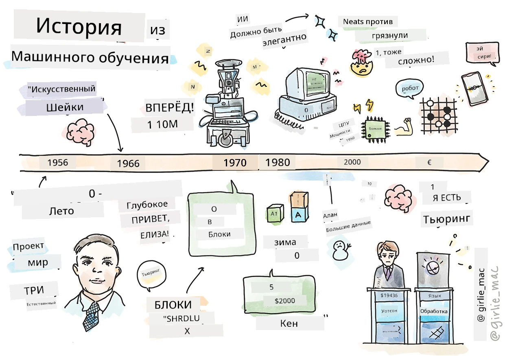
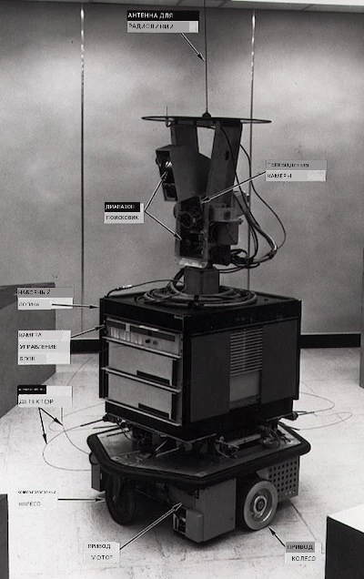
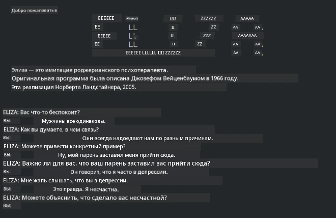

# История машинного обучения

> Скетчноут от [Tomomi Imura](https://www.twitter.com/girlie_mac)

## [Викторина перед лекцией](https://ff-quizzes.netlify.app/en/ml/)

---

> 🎥 Нажмите на изображение выше для короткого видео с разбором этого урока.

В этом уроке мы пройдемся по основным этапам истории машинного обучения и искусственного интеллекта.

История искусственного интеллекта (ИИ) как области тесно переплетена с историей машинного обучения, так как алгоритмы и вычислительные достижения, лежащие в основе МЛ, способствовали развитию ИИ. Полезно помнить, что хотя эти области как отдельные направления исследования начали формироваться в 1950-х годах, важные [алгоритмические, статистические, математические, вычислительные и технические открытия](https://wikipedia.org/wiki/Timeline_of_machine_learning) предшествовали и пересекались с этой эпохой. На самом деле, люди задумывались над этими вопросами [сотни лет](https://wikipedia.org/wiki/History_of_artificial_intelligence): эта статья обсуждает исторические интеллектуальные основы идеи 'мыслящей машины.'

---
## Значимые открытия

- 1763, 1812 [Теорема Байеса](https://wikipedia.org/wiki/Bayes%27_theorem) и ее предшественники. Эта теорема и ее применения лежат в основе вывода, описывая вероятность события на основе предварительных знаний.
- 1805 [Теория наименьших квадратов](https://wikipedia.org/wiki/Least_squares), разработанная французским математиком Адриеном-Мари Лежандром. Эта теория, о которой вы узнаете в разделе регрессии, помогает подгонять данные.
- 1913 [Цепи Маркова](https://wikipedia.org/wiki/Markov_chain), названные в честь российского математика Андрея Маркова, используются для описания последовательности возможных событий на основе предыдущего состояния.
- 1957 [Персептрон](https://wikipedia.org/wiki/Perceptron) — тип линейного классификатора, изобретённый американским психологом Фрэнком Розенблаттом, лежащий в основе достижений глубокого обучения.

---

- 1967 [Ближайший сосед](https://wikipedia.org/wiki/Nearest_neighbor) — алгоритм, изначально разработанный для картографирования маршрутов. В контексте МЛ он используется для обнаружения шаблонов.
- 1970 [Обратное распространение](https://wikipedia.org/wiki/Backpropagation) используется для обучения [прямых нейронных сетей](https://wikipedia.org/wiki/Feedforward_neural_network).
- 1982 [Рекуррентные нейронные сети](https://wikipedia.org/wiki/Recurrent_neural_network) — искусственные нейронные сети, производные от прямых, которые создают временные графы.

✅ Проведите небольшое исследование. Какие еще даты вы считаете ключевыми в истории МЛ и ИИ?

---
## 1950: Машины, которые мыслят

Алан Тьюринг, поистине выдающийся человек, который был признан [общественностью в 2019 году](https://wikipedia.org/wiki/Icons:_The_Greatest_Person_of_the_20th_Century) величайшим ученым XX века, считается одним из основателей концепции 'машины, способной мыслить.' Он боролся с критиками и своей собственной необходимостью эмпирических доказательств этой концепции, в том числе создав [Тест Тьюринга](https://www.bbc.com/news/technology-18475646), который вы изучите в наших уроках по обработке естественного языка.

---
## 1956: Летний исследовательский проект в Дартмуте

"Летний исследовательский проект по искусственному интеллекту в Дартмуте был ключевым событием для искусственного интеллекта как области," и именно там был введен термин 'искусственный интеллект' ([источник](https://250.dartmouth.edu/highlights/artificial-intelligence-ai-coined-dartmouth)).

> Каждый аспект обучения или любой другой признак интеллекта может в принципе быть описан настолько точно, что можно создать машину, которая будет его имитировать.

---

Главным исследователем был профессор математики Джон Маккарти, который надеялся "двигаться исходя из предположения, что каждый аспект обучения или любой другой признак интеллекта может в принципе быть описан настолько точно, что можно создать машину, которая будет его имитировать." Среди участников был еще один светило в этой области — Марвин Мински.

Эта конференция считается инициатором и вдохновителем нескольких обсуждений, включая «возвышение символических методов, систем, ориентированных на ограниченные области (ранние экспертные системы), и дедуктивных систем vs индуктивных» ([источник](https://wikipedia.org/wiki/Dartmouth_workshop)).

---
## 1956 - 1974: "Золотые годы"

С 1950-х и до середины 70-х оптимизм был высоким с надеждой, что ИИ сможет решить множество проблем. В 1967 году Марвин Мински выразил уверенность, что "в течение одного поколения ... проблема создания 'искусственного интеллекта' будет существенно решена." (Мински, Марвин (1967), Computation: Finite and Infinite Machines, Englewood Cliffs, N.J.: Prentice-Hall)

Исследования по обработке естественного языка процветали, поиск совершенствовался и становился мощнее, а также была создана концепция 'микромиров', в рамках которых простые задачи выполнялись с помощью обычных языковых инструкций.

---

Исследования были хорошо финансируемы государственными учреждениями, достигались успехи в вычислениях и алгоритмах, и строились прототипы интеллектуальных машин. Некоторые из этих машин включают:

* [Робот Шейки](https://wikipedia.org/wiki/Shakey_the_robot), который мог маневрировать и принимать решения о том, как выпонять задачи 'интеллигентно'.

    
    > Шейки в 1972 году

---

* Элайза, один из первых 'чатботов', могла общаться с людьми и выступать в роли примитивного 'терапевта'. Вы узнаете больше об Элайзе в уроках по НЛП.

    
    > Версия Элайзы, чатбот

---

* "Мир блоков" был примером микромира, где блоки можно было складывать и сортировать, а эксперименты по обучению машин принимать решения могли проводиться. Достижения на основе библиотек таких как [SHRDLU](https://wikipedia.org/wiki/SHRDLU) способствовали развитию обработки языка.

    

    > 🎥 Нажмите на изображение выше для видео: Мир блоков с SHRDLU

---
## 1974 - 1980: "Зима ИИ"

К середине 1970-х стало очевидно, что сложность создания 'интеллектуальных машин' была недооценена, а его обещания, учитывая доступные вычислительные мощности, были преувеличены. Финансирование иссякло, и доверие к области снизилось. Некоторые проблемы, повлиявшие на уровень доверия, включали:
---
- **Ограничения**. Вычислительные мощности были слишком ограничены.
- **Комбинаторный взрыв**. Количество параметров, требующих обучения, росло экспоненциально с увеличением требований к компьютерам, без параллельного роста вычислительных мощностей и возможностей.
- **Недостаток данных**. Нехватка данных препятствовала процессу тестирования, разработки и совершенствования алгоритмов.
- **Задаем ли мы правильные вопросы?**. Поставленные вопросы сами начали вызывать сомнения. Исследователи стали сталкиваться с критикой своих подходов:
  - Тесты Тьюринга подверглись сомнению с помощью, среди прочего, теории «китайской комнаты», которая утверждала, что "программирование цифрового компьютера может создавать видимость понимания языка, но не может привести к настоящему пониманию." ([источник](https://plato.stanford.edu/entries/chinese-room/))
  - Этические вопросы внедрения искусственных интеллектов, таких как «терапевт» Элайза, в общество были поставлены под сомнение.

---

В то же время начали формироваться разные школы мысли в ИИ. Установилась дихотомия между практиками ["грязного" и "чистого ИИ"](https://wikipedia.org/wiki/Neats_and_scruffies). _Грязные_ лаборатории подгоняли программы часами до нужного результата. _Чистые_ лаборатории "сосредотачивались на логике и формальном решении задач". Элайза и SHRDLU были известными _грязными_ системами. В 80-х, с понижением спроса на воспроизводимость систем МЛ, _чистый_ подход постепенно вышел на первый план, поскольку его результаты легче объяснять.

---
## Экспертные системы 1980-х

По мере роста области становилось яснее ее значение для бизнеса, и в 1980-х распространились 'экспертные системы'. "Экспертные системы были одними из первых по-настоящему успешных форм искусственного интеллекта (ИИ) программного обеспечения." ([источник](https://wikipedia.org/wiki/Expert_system)).

Этот тип системы является на самом деле _гибридным_, состоящим частично из движка правил, определяющего бизнес-требования, и движка вывода, который использовал систему правил для выведения новых фактов.

В этой эпохе также возрастало внимание к нейронным сетям.

---
## 1987 - 1993: "Охлаждение" ИИ

Распространение специализированного аппаратного обеспечения для экспертных систем имело неблагоприятный эффект чрезмерной специализации. Рост персональных компьютеров также конкурировал с этими большими специализированными централизованными системами. Началась демократизация вычислительной техники, что в конечном итоге проложило путь к современному взрыву больших данных.

---
## 1993 - 2011

Эта эпоха ознаменовала новую эру для МЛ и ИИ, когда стало возможным решить некоторые проблемы, вызванные ранее нехваткой данных и вычислительной мощности. Количество данных начало быстро расти и становиться более доступным, как к лучшему, так и к худшему, особенно с появлением смартфонов около 2007 года. Вычислительная мощность росла экспоненциально, а алгоритмы развивались рядом с этим. Область стала приобретать зрелость, когда прежние свободные времена начали превращаться в настоящую дисциплину.

---
## Сейчас

Сегодня машинное обучение и ИИ затрагивают почти все сферы нашей жизни. Эта эпоха требует внимательного понимания рисков и потенциальных эффектов этих алгоритмов на человеческие жизни. Как заявил Брэд Смит из Microsoft, "Информационные технологии поднимают вопросы, которые касаются фундаментальных прав человека, таких как конфиденциальность и свобода выражения. Эти вопросы увеличивают ответственность технологических компаний, создающих эти продукты. По нашему мнению, они также требуют продуманного государственного регулирования и разработки норм по приемлемому использованию" ([источник](https://www.technologyreview.com/2019/12/18/102365/the-future-of-ais-impact-on-society/)).

---

Пока еще не ясно, что принесет будущее, но важно понимать эти компьютерные системы и программное обеспечение и алгоритмы, которые они используют. Мы надеемся, что этот учебный план поможет вам лучше понять эту область, чтобы вы могли принять собственное решение.

> 🎥 Нажмите на изображение выше для видео: Янн Лекун рассказывает об истории глубокого обучения в этой лекции

---
## 🚀Вызов

Изучите один из этих исторических моментов и узнайте больше о людях, стоящих за ними. Там есть увлекательные персонажи, и ни одно научное открытие не создавалось в культурном вакууме. Что вы узнаете?

## [Викторина после лекции](https://ff-quizzes.netlify.app/en/ml/)

---
## Обзор и самостоятельное изучение

Вот несколько материалов для просмотра и прослушивания:

[Этот подкаст, в котором Amy Boyd обсуждает эволюцию ИИ](http://runasradio.com/Shows/Show/739)

---

## Задание

[Создайте временную шкалу](assignment.md)

---

<!-- CO-OP TRANSLATOR DISCLAIMER START -->
**Отказ от ответственности**:
Этот документ был переведен с использованием сервиса машинного перевода [Co-op Translator](https://github.com/Azure/co-op-translator). Несмотря на наши усилия по обеспечению точности, имейте в виду, что автоматический перевод может содержать ошибки или неточности. Оригинальный документ на его исходном языке следует считать авторитетным источником. Для получения критически важной информации рекомендуется обратиться к профессиональному человеческому переводу. Мы не несем ответственности за любые недоразумения или неправильные толкования, возникшие в результате использования этого перевода.
<!-- CO-OP TRANSLATOR DISCLAIMER END -->