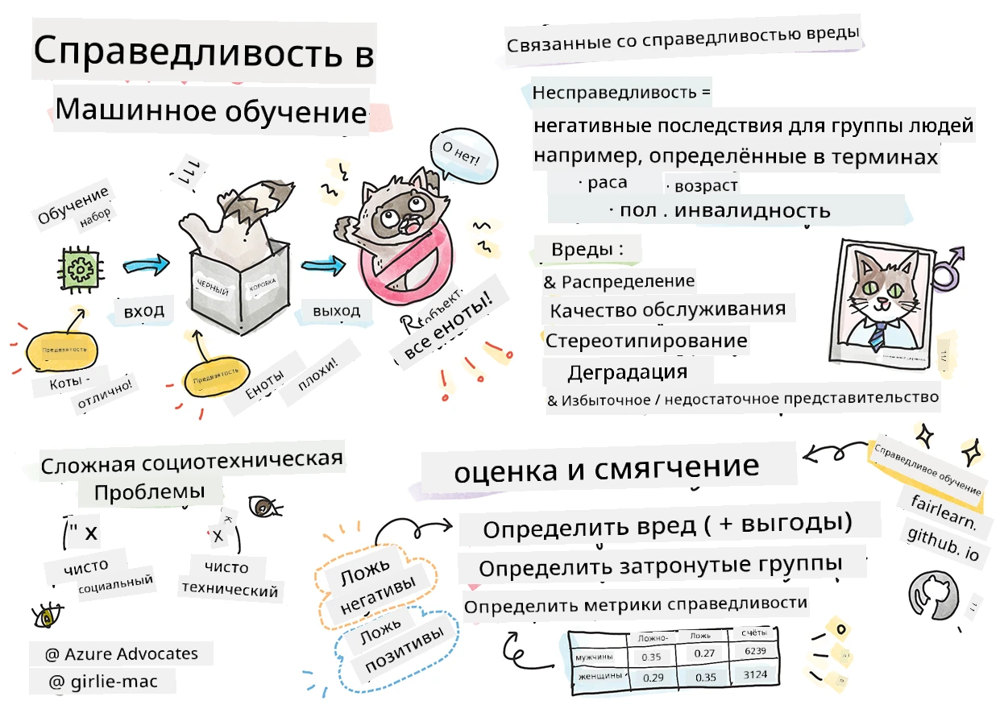

# Создание решений машинного обучения с ответственным ИИ
 

> Скетчнот от [Tomomi Imura](https://www.twitter.com/girlie_mac)

## [Викторина перед лекцией](https://ff-quizzes.netlify.app/en/ml/)
 
## Введение

В этой учебной программе вы начнете изучать, как машинное обучение может и уже влияет на нашу повседневную жизнь. Даже сейчас системы и модели участвуют в ежедневных задачах принятия решений, таких как диагностирование заболеваний, одобрение кредитов или обнаружение мошенничества. Поэтому важно, чтобы эти модели хорошо работали и предоставляли надежные результаты. Как и любое программное обеспечение, системы ИИ могут не оправдать ожиданий или иметь нежелательные последствия. Вот почему важно уметь понимать и объяснять поведение модели ИИ.

Представьте, что может произойти, если данные, которые вы используете для создания этих моделей, не включают определённые демографические группы, такие как раса, пол, политические взгляды, религия, или непропорционально представлены такие группы. Что если вывод модели интерпретируется так, что он благоприятствует какой-то демографической группе? Каковы последствия для приложения? Кроме того, что происходит, если результат модели оказывается негативным и вредным для людей? Кто несет ответственность за поведение системы ИИ? Это некоторые из вопросов, которые мы рассмотрим в этой учебной программе.

В этом уроке вы:

- Повысите осведомленность о важности справедливости в машинном обучении и связанных с ней вредах.
- Ознакомитесь с практикой изучения выбросов и необычных сценариев для обеспечения надежности и безопасности
- Поймете необходимость расширения возможностей всех путём проектирования инклюзивных систем
- Изучите, насколько важно защищать конфиденциальность и безопасность данных и людей
- Увидите важность прозрачного (стеклянного) подхода к объяснению поведения моделей ИИ
- Осознаете, что ответственность необходима для создания доверия к системам ИИ

## Предварительные требования

В качестве предварительного требования, пожалуйста, пройдите учебный путь "Принципы ответственного ИИ" и посмотрите видео ниже на эту тему:

Узнайте больше об ответственном ИИ, следуя этому [Учебному пути](https://docs.microsoft.com/learn/modules/responsible-ai-principles/?WT.mc_id=academic-77952-leestott)

> 🎥 Нажмите на изображение выше, чтобы посмотреть видео: Подход Microsoft к ответственному ИИ

## Справедливость

Системы ИИ должны справедливо относиться ко всем и избегать влияния на похожие группы людей по-разному. Например, когда системы ИИ дают рекомендации по медицинскому лечению, заявкам на кредиты или трудоустройству, они должны делать одинаковые рекомендации для всех с похожими симптомами, финансовыми обстоятельствами или профессиональной квалификацией. Каждый из нас как человек носит в себе унаследованные предубеждения, которые влияют на наши решения и действия. Эти предубеждения могут проявляться в данных, которые мы используем для обучения систем ИИ. Такая манипуляция иногда происходит непреднамеренно. Часто трудно сознательно понять, когда вы вносите предвзятость в данные.

**«Несправедливость»** включает негативные воздействия или «вред» для группы людей, определяемой по расе, полу, возрасту или инвалидности. Основные виды вреда, связанные со справедливостью, можно классифицировать как:

- **Распределение**, если, например, одному полу или этнической группе отдается предпочтение перед другой.
- **Качество обслуживания**. Если вы обучаете данные для одного конкретного сценария, но реальность гораздо сложнее, это приводит к плохому качеству сервиса. Например, диспенсер для мыла, который не распознает людей с темной кожей. [Ссылка](https://gizmodo.com/why-cant-this-soap-dispenser-identify-dark-skin-1797931773)
- **Дениграция**. Несправедливо критиковать и маркировать что-то или кого-то. Например, технология распознавания изображений печально известна тем, что ошибочно маркировала изображения темнокожих людей как горилл.
- **Пере- или недопредставленность**. Идея состоит в том, что определённая группа не представлена в определённой профессии, и любая служба или функция, которая продолжает продвигать это, способствует нанесению вреда.
- **Стереотипизация**. Ассоциация определённой группы с предопределёнными атрибутами. Например, система перевода с английского на турецкий может иметь неточности из-за слов с гендерными стереотипическими ассоциациями.

> перевод на турецкий

> обратно на английский

При проектировании и тестировании систем ИИ необходимо гарантировать справедливость ИИ и отсутствие программирования на предвзятые или дискриминационные решения, совершать которые также запрещено людям. Обеспечение справедливости в ИИ и машинном обучении остаётся сложной социотехнической задачей.

### Надежность и безопасность

Для создания доверия системы ИИ должны быть надежными, безопасными и последовательными в обычных и неожиданных условиях. Важно знать, как системы ИИ будут вести себя в различных ситуациях, особенно когда они выходят за рамки обычного. При создании решений ИИ необходимо уделять значительное внимание тому, как обрабатывать разнообразные ситуации, с которыми могут столкнуться решения ИИ. Например, автопилот должен ставить безопасность людей на первое место. В результате ИИ, управляющий автомобилем, должен учитывать все возможные сценарии, такие как ночь, грозы или метели, дети, выбегающие на дорогу, животные, дорожные работы и т.п. Насколько хорошо система ИИ справляется с широким спектром условий надежно и безопасно, отражает уровень прогнозирования, который учёный по данным или разработчик ИИ учитывали при проектировании или тестировании системы.

> [🎥 Нажмите здесь для видео: ](https://www.microsoft.com/videoplayer/embed/RE4vvIl)

### Инклюзивность

Системы ИИ должны быть разработаны так, чтобы вовлекать и расширять возможности всех. При проектировании и внедрении систем ИИ специалисты по данным и разработчики ИИ выявляют и устраняют потенциальные барьеры в системе, которые могут непреднамеренно исключать людей. Например, в мире насчитывается 1 миллиард человек с инвалидностью. С развитием ИИ они могут легче получать доступ к широкому спектру информации и возможностей в повседневной жизни. Устранение барьеров создает возможности для инноваций и разработки продуктов ИИ с лучшим опытом, которые приносят пользу всем.

> [🎥 Нажмите здесь для видео: инклюзивность в ИИ](https://www.microsoft.com/videoplayer/embed/RE4vl9v)

### Безопасность и конфиденциальность

Системы ИИ должны быть безопасными и уважать конфиденциальность людей. Люди меньше доверяют системам, которые ставят под угрозу их конфиденциальность, информацию или жизни. При обучении моделей машинного обучения мы полагаемся на данные для получения лучших результатов. При этом необходимо учитывать происхождение данных и их целостность. Например, были ли данные предоставлены пользователями или доступны общественно? Далее, при работе с данными важно разрабатывать системы ИИ, которые могут защищать конфиденциальную информацию и противостоять атакам. По мере роста распространения ИИ защита конфиденциальности и обеспечение безопасности важной личной и деловой информации становятся всё более критичными и сложными. Вопросы конфиденциальности и безопасности данных требуют особого внимания в области ИИ, потому что доступ к данным необходим системам ИИ для точных и информированных прогнозов и решений о людях.

> [🎥 Нажмите здесь для видео: безопасность в ИИ](https://www.microsoft.com/videoplayer/embed/RE4voJF)

- Отрасль достигла значительного прогресса в области конфиденциальности и безопасности, во многом благодаря регламентам, таким как GDPR (Общий регламент по защите данных).
- Однако с системами ИИ мы должны признать противоречие между необходимостью большего объема персональных данных для повышения персонализации и эффективности систем — и конфиденциальностью.
- Аналогично появлению подключенных компьютеров с интернетом, мы также наблюдаем резкий рост числа проблем с безопасностью, связанных с ИИ.
- В то же время ИИ используется для улучшения безопасности. Например, большинство современных антивирусных сканеров сегодня работают на основе эвристик ИИ.
- Мы должны обеспечить, чтобы наши процессы Data Science гармонично сочетались с последними практиками конфиденциальности и безопасности.

### Прозрачность
Системы ИИ должны быть понятными. Важной частью прозрачности является объяснение поведения систем ИИ и их компонентов. Повышение понимания систем ИИ требует от заинтересованных сторон понимания того, как и почему они функционируют, чтобы можно было выявлять потенциальные проблемы с производительностью, вопросы безопасности и конфиденциальности, предвзятость, исключающие практики или непредвиденные результаты. Мы также считаем, что те, кто используют системы ИИ, должны быть честными и откровенными о том, когда, почему и как они выбирают их применять, а также о ограничениях используемых систем. Например, если банк использует систему ИИ для поддержки решений по кредитованию потребителей, важно изучить результаты и понять, какие данные влияют на рекомендации системы. Правительства начинают регулировать ИИ в различных отраслях, поэтому специалисты по данным и организации должны объяснять, соответствует ли система ИИ требованиям регулирования, особенно если возникает нежелательный результат.

> [🎥 Нажмите здесь для видео: прозрачность в ИИ](https://www.microsoft.com/videoplayer/embed/RE4voJF)

- Поскольку системы ИИ очень сложны, трудно понять, как они работают, и интерпретировать результаты.
- Это непонимание влияет на то, как эти системы управляются, вводятся в эксплуатацию и документируются.
- И, что важнее, это непонимание влияет на решения, принимаемые на основе результатов, которые генерируют эти системы.

### Ответственность
 
Люди, которые разрабатывают и внедряют системы ИИ, должны нести ответственность за работу своих систем. Необходимость ответственности имеет особое значение для технологий с чувствительным использованием, таких как распознавание лиц. В последнее время усилился спрос на технологии распознавания лиц, особенно со стороны правоохранительных органов, которые видят потенциал этой технологии в таких применениях, как поиск пропавших детей. Однако эти технологии потенциально могут быть использованы правительством для подрыва фундаментальных свобод граждан, например, путем обеспечения постоянного наблюдения за конкретными лицами. Поэтому специалисты по данным и организации должны нести ответственность за влияние их системы ИИ на отдельных людей или общество.

> 🎥 Нажмите на изображение выше для видео: предупреждения о массовом наблюдении через распознавание лиц

В конечном итоге один из главных вопросов для нашего поколения, как первого поколения, которое приносит ИИ в общество, — как обеспечить, чтобы компьютеры оставались ответственными перед людьми, и как гарантировать, чтобы люди, создающие компьютеры, оставались ответственными перед всеми остальными.

## Оценка воздействия

Перед обучением модели машинного обучения важно провести оценку воздействия, чтобы понять цель системы ИИ; предполагаемое применение; где она будет внедряться; и кто будет взаимодействовать с системой. Эти сведения полезны для обзорщиков или тестировщиков системы, чтобы знать, какие факторы учитывать при выявлении потенциальных рисков и ожидаемых последствий.

Следующие области имеют ключевое значение при проведении оценки воздействия:

* **Негативное воздействие на отдельных лиц**. Важно учитывать любые ограничения или требования, неподдерживаемое использование или известные ограничения, препятствующие работе системы, чтобы предотвратить использование системы таким образом, который может причинить вред людям.
* **Требования к данным**. Понимание того, как и где система будет использовать данные, позволяет обзорщикам изучать требования к данным, которые необходимо учитывать (например, регламенты GDPR или HIPAA). Кроме того, следует проверить, являются ли источник и количество данных достаточными для обучения.
* **Обзор воздействия**. Составьте список потенциальных вредов, которые могут возникнуть при использовании системы. В течение жизненного цикла машинного обучения проверяйте, устранены ли выявленные проблемы.
* **Применимые цели** для каждого из шести основных принципов. Оцените, достигнуты ли цели каждого принципа и есть ли пробелы.

## Отладка с ответственным ИИ

Подобно отладке программного приложения, отладка системы ИИ — необходимый процесс выявления и устранения проблем в системе. Существует множество факторов, которые могут привести к тому, что модель не будет работать так, как ожидается, или ответственно. Большинство традиционных метрик производительности модели — это количественные агрегаты производительности модели, которых недостаточно для анализа того, как модель нарушает принципы ответственного ИИ. Более того, модель машинного обучения — это «черный ящик», что затрудняет понимание того, что влияет на её результат или объяснение ошибок. Позже на этом курсе мы научимся использовать панель управления Responsible AI для помощи в отладке систем ИИ. Эта панель предоставляет комплексный инструмент для специалистов по данным и разработчиков ИИ для выполнения:

* **Анализа ошибок**. Для выявления распределения ошибок модели, которые могут повлиять на справедливость или надежность системы.
* **Обзора модели**. Чтобы обнаружить, где существуют различия в производительности модели среди различных групп данных.
* **Анализа данных**. Для понимания распределения данных и выявления потенциальной предвзятости в данных, которая может вызвать проблемы со справедливостью, инклюзивностью и надежностью.
* **Интерпретируемости модели**. Чтобы понять, что влияет или оказывает воздействие на предсказания модели. Это помогает объяснять поведение модели, что важно для прозрачности и ответственности.

## 🚀 Вызов
 
Чтобы предотвратить появление вреда с самого начала, мы должны:

- иметь разнообразные фоновые и перспективные знания среди людей, работающих над системами
- инвестировать в датасеты, отражающие разнообразие нашего общества
- развивать лучшие методы на протяжении всего жизненного цикла машинного обучения для обнаружения и исправления нарушений принципов ответственного ИИ при их возникновении

Подумайте о реальных сценариях, в которых недоверие к модели проявляется в построении и использовании модели. Что еще следует учитывать?

## [Викторина после лекции](https://ff-quizzes.netlify.app/en/ml/)

## Обзор и самостоятельное изучение
 

В этом уроке вы узнали основы понятий справедливости и несправедливости в машинном обучении.  
 
Просмотрите этот семинар, чтобы глубже погрузиться в темы: 

- В стремлении к ответственной ИИ: Применение принципов на практике от Бесмиры Нуши, Мехрнуш Самеки и Амита Шармы

> 🎥 Нажмите на изображение выше для просмотра видео: RAI Toolbox: Фреймворк с открытым исходным кодом для построения ответственной ИИ от Бесмиры Нуши, Мехрнуш Самеки и Амита Шармы

Также прочитайте: 

- Центр ресурсов Microsoft по ответственной ИИ: [Responsible AI Resources – Microsoft AI](https://www.microsoft.com/ai/responsible-ai-resources?activetab=pivot1%3aprimaryr4) 

- Исследовательская группа Microsoft FATE: [FATE: Fairness, Accountability, Transparency, and Ethics in AI - Microsoft Research](https://www.microsoft.com/research/theme/fate/) 

RAI Toolbox: 

- [Репозиторий Responsible AI Toolbox на GitHub](https://github.com/microsoft/responsible-ai-toolbox)

Ознакомьтесь с инструментами Azure Machine Learning для обеспечения справедливости:

- [Azure Machine Learning](https://docs.microsoft.com/azure/machine-learning/concept-fairness-ml?WT.mc_id=academic-77952-leestott) 

## Задание

[Изучите RAI Toolbox](assignment.md)

---

<!-- CO-OP TRANSLATOR DISCLAIMER START -->
**Отказ от ответственности**:
Этот документ был переведен с использованием сервиса машинного перевода [Co-op Translator](https://github.com/Azure/co-op-translator). Несмотря на наши усилия по обеспечению точности, имейте в виду, что автоматический перевод может содержать ошибки или неточности. Оригинальный документ на его исходном языке следует считать авторитетным источником. Для получения критически важной информации рекомендуется обратиться к профессиональному человеческому переводу. Мы не несем ответственности за любые недоразумения или неправильные толкования, возникшие в результате использования этого перевода.
<!-- CO-OP TRANSLATOR DISCLAIMER END -->