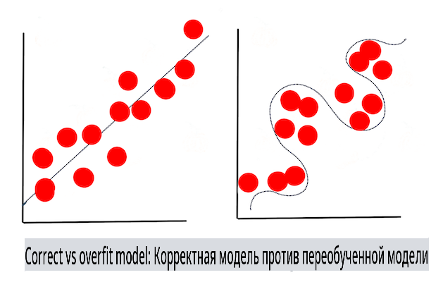

# Техники машинного обучения

Процесс создания, использования и поддержки моделей машинного обучения и данных, которые они используют, значительно отличается от многих других рабочих процессов разработки. В этом уроке мы развеем мифы о процессе и опишем основные техники, которые вам необходимо знать. Вы:

- Поймете процессы, лежащие в основе машинного обучения, на высоком уровне.
- Изучите основные концепции, такие как 'модели', 'предсказания' и 'обучающие данные'.

## [Предварительный тест](https://gray-sand-07a10f403.1.azurestaticapps.net/quiz/7/)

> 🎥 Нажмите на изображение выше, чтобы посмотреть короткое видео по этому уроку.

## Введение

На высоком уровне создание процессов машинного обучения (ML) состоит из нескольких этапов:

1. **Определите вопрос**. Большинство процессов ML начинаются с вопроса, на который нельзя ответить с помощью простой условной программы или основанного на правилах движка. Эти вопросы часто касаются предсказаний на основе собранных данных.
2. **Соберите и подготовьте данные**. Чтобы ответить на ваш вопрос, вам нужны данные. Качество и иногда количество ваших данных определят, насколько хорошо вы сможете ответить на свой первоначальный вопрос. Визуализация данных является важным аспектом этого этапа. Этот этап также включает разделение данных на обучающую и тестовую группы для создания модели.
3. **Выберите метод обучения**. В зависимости от вашего вопроса и природы ваших данных, вам нужно выбрать, как вы хотите обучить модель, чтобы она наилучшим образом отражала ваши данные и делала точные предсказания. Это часть вашего процесса ML, которая требует специфической экспертизы и часто значительного количества экспериментов.
4. **Обучите модель**. Используя ваши обучающие данные, вы будете использовать различные алгоритмы для обучения модели распознавать шаблоны в данных. Модель может использовать внутренние веса, которые можно настроить, чтобы привилегировать определенные части данных по сравнению с другими для создания более качественной модели.
5. **Оцените модель**. Вы используете ранее не виденные данные (ваши тестовые данные) из собранного набора, чтобы увидеть, как модель работает.
6. **Настройка параметров**. В зависимости от производительности вашей модели, вы можете повторить процесс, используя разные параметры или переменные, которые контролируют поведение алгоритмов, используемых для обучения модели.
7. **Предсказание**. Используйте новые входные данные, чтобы протестировать точность вашей модели.

## Какой вопрос задать

Компьютеры особенно хорошо умеют обнаруживать скрытые шаблоны в данных. Эта утилита очень полезна для исследователей, у которых есть вопросы о конкретной области, на которые нельзя легко ответить, создав условно основанный движок правил. Например, при решении актуарной задачи специалист по данным может создать вручную правила о смертности курильщиков по сравнению с некурильщиками.

Однако когда в уравнение вводится множество других переменных, модель ML может оказаться более эффективной для предсказания будущих уровней смертности на основе прошлой истории здоровья. Более оптимистичный пример может заключаться в том, чтобы делать прогнозы погоды на апрель в данном месте на основе данных, которые включают широту, долготу, изменения климата, близость к океану, паттерны струйного течения и многое другое.

✅ Эта [презентация](https://www2.cisl.ucar.edu/sites/default/files/2021-10/0900%20June%2024%20Haupt_0.pdf) о погодных моделях предлагает историческую перспективу использования ML в анализе погоды.

## Предварительные задачи

Перед тем как начать строить вашу модель, вам необходимо выполнить несколько задач. Чтобы протестировать ваш вопрос и сформировать гипотезу на основе предсказаний модели, вам нужно определить и настроить несколько элементов.

### Данные

Чтобы ответить на ваш вопрос с какой-либо степенью уверенности, вам нужно хорошее количество данных правильного типа. На этом этапе вам нужно сделать две вещи:

- **Собрать данные**. Учитывая предыдущий урок о справедливости в анализе данных, собирайте ваши данные с осторожностью. Обратите внимание на источники этих данных, на любые присущие им предвзятости и задокументируйте их происхождение.
- **Подготовить данные**. В процессе подготовки данных есть несколько этапов. Вам может понадобиться собрать данные и нормализовать их, если они поступают из различных источников. Вы можете улучшить качество и количество данных с помощью различных методов, таких как преобразование строк в числа (как мы делаем в [Кластеризации](../../5-Clustering/1-Visualize/README.md)). Вы также можете генерировать новые данные на основе оригинала (как мы делаем в [Классификации](../../4-Classification/1-Introduction/README.md)). Вы можете очистить и отредактировать данные (как мы сделаем перед уроком [Веб-приложение](../../3-Web-App/README.md)). Наконец, вам также может понадобиться рандомизировать и перемешать их, в зависимости от ваших методов обучения.

✅ После сбора и обработки ваших данных, уделите время, чтобы посмотреть, позволит ли их форма решить ваш предполагаемый вопрос. Возможно, что данные не будут хорошо работать в вашей задаче, как мы обнаруживаем в наших уроках по [Кластеризации](../../5-Clustering/1-Visualize/README.md)!

### Признаки и цель

[Признак](https://www.datasciencecentral.com/profiles/blogs/an-introduction-to-variable-and-feature-selection) — это измеримое свойство ваших данных. Во многих наборах данных он выражается в виде заголовка столбца, такого как 'дата', 'размер' или 'цвет'. Ваш признак, обычно представленный как `X` в коде, представляет собой входную переменную, которая будет использоваться для обучения модели.

Цель — это то, что вы пытаетесь предсказать. Цель обычно представлена как `y` в коде и представляет собой ответ на вопрос, который вы пытаетесь задать вашим данным: в декабре, какие **цвет** тыквы будут самыми дешевыми? в Сан-Франциско, в каких районах будет лучшая **цена** на недвижимость? Иногда цель также называется атрибутом метки.

### Выбор вашей переменной признака

🎓 **Выбор признаков и извлечение признаков** Как вы знаете, какую переменную выбрать при построении модели? Вы, вероятно, пройдете процесс выбора признаков или извлечения признаков, чтобы выбрать правильные переменные для самой производительной модели. Однако это не одно и то же: "Извлечение признаков создает новые признаки из функций оригинальных признаков, тогда как выбор признаков возвращает подмножество признаков." ([источник](https://wikipedia.org/wiki/Feature_selection))

### Визуализация ваших данных

Важным аспектом инструментов специалиста по данным является возможность визуализировать данные с помощью нескольких отличных библиотек, таких как Seaborn или MatPlotLib. Визуальное представление ваших данных может позволить вам выявить скрытые корреляции, которые вы можете использовать. Ваши визуализации также могут помочь вам выявить предвзятости или несбалансированные данные (как мы обнаруживаем в [Классификации](../../4-Classification/2-Classifiers-1/README.md)).

### Разделите ваш набор данных

Перед обучением вам нужно разделить ваш набор данных на две или более частей неравного размера, которые все еще хорошо представляют данные.

- **Обучение**. Эта часть набора данных подходит для вашей модели, чтобы обучить ее. Этот набор составляет большинство оригинального набора данных.
- **Тестирование**. Тестовый набор данных — это независимая группа данных, часто собранная из оригинальных данных, которую вы используете для подтверждения производительности построенной модели.
- **Валидация**. Валидационный набор — это меньшая независимая группа примеров, которую вы используете для настройки гиперпараметров модели или ее архитектуры, чтобы улучшить модель. В зависимости от размера ваших данных и вопроса, который вы задаете, вам может не понадобиться создавать этот третий набор (как мы отмечаем в [Прогнозировании временных рядов](../../7-TimeSeries/1-Introduction/README.md)).

## Создание модели

Используя ваши обучающие данные, ваша цель состоит в том, чтобы построить модель или статистическое представление ваших данных, используя различные алгоритмы для **обучения** ее. Обучение модели подвергает ее воздействию данных и позволяет ей делать предположения о воспринимаемых шаблонах, которые она обнаруживает, проверяет и принимает или отвергает.

### Выберите метод обучения

В зависимости от вашего вопроса и природы ваших данных вы выберете метод для ее обучения. Просматривая [документацию Scikit-learn](https://scikit-learn.org/stable/user_guide.html) — которую мы используем в этом курсе — вы можете изучить множество способов обучения модели. В зависимости от вашего опыта вам, возможно, придется попробовать несколько различных методов, чтобы построить лучшую модель. Вы, вероятно, пройдете процесс, в котором специалисты по данным оценивают производительность модели, подавая ей невидимые данные, проверяя точность, предвзятость и другие проблемы, ухудшающие качество, и выбирая наиболее подходящий метод обучения для поставленной задачи.

### Обучите модель

Вооружившись вашими обучающими данными, вы готовы 'подогнать' их, чтобы создать модель. Вы заметите, что во многих библиотеках ML вы найдете код 'model.fit' — в это время вы передаете вашу переменную признака в виде массива значений (обычно 'X') и переменную цели (обычно 'y').

### Оцените модель

После завершения процесса обучения (он может занять много итераций или 'эпох', чтобы обучить большую модель) вы сможете оценить качество модели, используя тестовые данные для оценки ее производительности. Эти данные — это подмножество оригинальных данных, которые модель ранее не анализировала. Вы можете распечатать таблицу метрик о качестве вашей модели.

🎓 **Подгонка модели**

В контексте машинного обучения подгонка модели относится к точности основной функции модели, когда она пытается анализировать данные, с которыми ей не знакомо.

🎓 **Недообучение** и **переобучение** — это распространенные проблемы, которые ухудшают качество модели, так как модель подгоняется либо недостаточно хорошо, либо слишком хорошо. Это приводит к тому, что модель делает предсказания либо слишком близко, либо слишком свободно по отношению к своим обучающим данным. Переобученная модель слишком хорошо предсказывает обучающие данные, потому что она слишком хорошо изучила детали и шум данных. Недообученная модель неточная, так как она не может точно анализировать свои обучающие данные или данные, которые она еще не 'видела'.

> Инфографика от [Jen Looper](https://twitter.com/jenlooper)

## Настройка параметров

После завершения вашего первоначального обучения наблюдайте за качеством модели и подумайте о том, как улучшить ее, изменив ее 'гиперпараметры'. Узнайте больше о процессе [в документации](https://docs.microsoft.com/en-us/azure/machine-learning/how-to-tune-hyperparameters?WT.mc_id=academic-77952-leestott).

## Прогнозирование

Это момент, когда вы можете использовать совершенно новые данные для проверки точности вашей модели. В 'практическом' ML контексте, где вы создаете веб-ресурсы для использования модели в производстве, этот процесс может включать сбор пользовательского ввода (например, нажатие кнопки), чтобы установить переменную и отправить ее модели для вывода или оценки.

В этих уроках вы узнаете, как использовать эти шаги для подготовки, создания, тестирования, оценки и прогнозирования — все жесты специалиста по данным и многое другое, пока вы продвигаетесь в своем пути к становлению 'полностековым' ML инженером.

---

## 🚀Задача

Нарисуйте блок-схему, отражающую шаги практикующего ML. Где вы сейчас видите себя в процессе? Где вы предсказываете, что столкнетесь с трудностями? Что вам кажется легким?

## [Постлекционный тест](https://gray-sand-07a10f403.1.azurestaticapps.net/quiz/8/)

## Обзор и самообучение

Поиск в интернете интервью с учеными данных, которые обсуждают свою повседневную работу. Вот [одно](https://www.youtube.com/watch?v=Z3IjgbbCEfs).

## Задание

[Интервью с ученым данных](assignment.md)

**Отказ от ответственности**:  
Этот документ был переведен с использованием услуг машинного перевода на основе ИИ. Хотя мы стремимся к точности, пожалуйста, имейте в виду, что автоматические переводы могут содержать ошибки или неточности. Оригинальный документ на его родном языке следует считать авторитетным источником. Для критически важной информации рекомендуется профессиональный человеческий перевод. Мы не несем ответственности за любые недоразумения или неправильные интерпретации, возникающие в результате использования этого перевода.