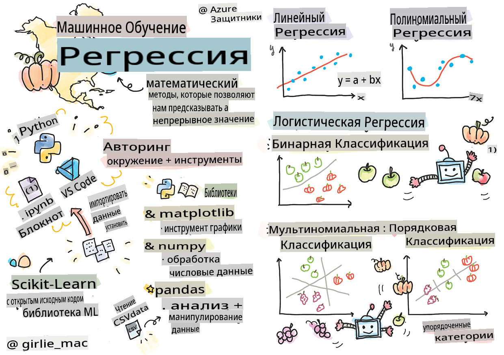
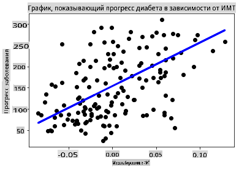

# Начало работы с Python и Scikit-learn для регрессионных моделей



> Скетчнот от [Томоми Имура](https://www.twitter.com/girlie_mac)

## [Тест перед лекцией](https://gray-sand-07a10f403.1.azurestaticapps.net/quiz/9/)

> ### [Этот урок доступен на R!](../../../../2-Regression/1-Tools/solution/R/lesson_1.html)

## Введение

В этих четырех уроках вы узнаете, как строить регрессионные модели. Мы вскоре обсудим, для чего они нужны. Но прежде чем вы начнете, убедитесь, что у вас есть все необходимые инструменты для начала процесса!

В этом уроке вы научитесь:

- Настраивать ваш компьютер для локальных задач машинного обучения.
- Работать с Jupyter-ноутбуками.
- Использовать Scikit-learn, включая установку.
- Исследовать линейную регрессию с практическим заданием.

## Установки и настройки

[](https://youtu.be/-DfeD2k2Kj0 "ML для начинающих - Настройте свои инструменты для создания моделей машинного обучения")

> 🎥 Нажмите на изображение выше, чтобы посмотреть короткое видео о настройке вашего компьютера для машинного обучения.

1. **Установите Python**. Убедитесь, что [Python](https://www.python.org/downloads/) установлен на вашем компьютере. Вы будете использовать Python для многих задач в области науки о данных и машинного обучения. Большинство компьютерных систем уже включают установку Python. Также доступны полезные [пакеты Python Coding Packs](https://code.visualstudio.com/learn/educators/installers?WT.mc_id=academic-77952-leestott) для упрощения настройки для некоторых пользователей.

   Однако некоторые применения Python требуют одной версии программного обеспечения, тогда как другие требуют другой версии. По этой причине полезно работать в [виртуальной среде](https://docs.python.org/3/library/venv.html).

2. **Установите Visual Studio Code**. Убедитесь, что Visual Studio Code установлен на вашем компьютере. Следуйте этим инструкциям, чтобы [установить Visual Studio Code](https://code.visualstudio.com/) для базовой установки. Вы будете использовать Python в Visual Studio Code в этом курсе, поэтому вам может понадобиться освежить свои знания о том, как [настроить Visual Studio Code](https://docs.microsoft.com/learn/modules/python-install-vscode?WT.mc_id=academic-77952-leestott) для разработки на Python.

   > Освойте Python, пройдя через эту коллекцию [модулей обучения](https://docs.microsoft.com/users/jenlooper-2911/collections/mp1pagggd5qrq7?WT.mc_id=academic-77952-leestott)
   >
   > [](https://youtu.be/yyQM70vi7V8 "Настройка Python с Visual Studio Code")
   >
   > 🎥 Нажмите на изображение выше, чтобы посмотреть видео: использование Python в VS Code.

3. **Установите Scikit-learn**, следуя [этим инструкциям](https://scikit-learn.org/stable/install.html). Поскольку вам нужно убедиться, что вы используете Python 3, рекомендуется использовать виртуальную среду. Обратите внимание, что если вы устанавливаете эту библиотеку на Mac с процессором M1, на странице по ссылке выше есть специальные инструкции.

1. **Установите Jupyter Notebook**. Вам нужно [установить пакет Jupyter](https://pypi.org/project/jupyter/).

## Ваша среда для авторинга в ML

Вы будете использовать **ноутбуки** для разработки вашего кода на Python и создания моделей машинного обучения. Этот тип файла является общим инструментом для специалистов в области данных и может быть идентифицирован по своему суффиксу или расширению `.ipynb`.

Ноутбуки представляют собой интерактивную среду, которая позволяет разработчику как писать код, так и добавлять заметки и писать документацию вокруг кода, что очень полезно для экспериментальных или исследовательских проектов.

[](https://youtu.be/7E-jC8FLA2E "ML для начинающих - Настройка Jupyter Notebooks для начала построения регрессионных моделей")

> 🎥 Нажмите на изображение выше, чтобы посмотреть короткое видео, работая над этим упражнением.

### Упражнение - работа с ноутбуком

В этой папке вы найдете файл _notebook.ipynb_.

1. Откройте _notebook.ipynb_ в Visual Studio Code.

   Запустится сервер Jupyter с Python 3+. Вы найдете области ноутбука, которые могут быть `run`, куски кода. Вы можете запустить блок кода, выбрав значок, который выглядит как кнопка воспроизведения.

1. Выберите значок `md` и добавьте немного markdown, а также следующий текст **# Добро пожаловать в ваш ноутбук**.

   Затем добавьте немного кода на Python.

1. Введите **print('hello notebook')** в блоке кода.
1. Выберите стрелку, чтобы запустить код.

   Вы должны увидеть напечатанное сообщение:

    ```output
    hello notebook
    ```


Вы можете вставлять комментарии в свой код, чтобы самодокументировать ноутбук.

✅ Подумайте минуту, насколько отличается рабочая среда веб-разработчика от среды специалиста в области данных.

## Запуск Scikit-learn

Теперь, когда Python настроен в вашей локальной среде, и вы уверенно работаете с Jupyter-ноутбуками, давайте также уверенно разберемся с Scikit-learn (произносится как `sci` as in `science`). Scikit-learn предоставляет [обширный API](https://scikit-learn.org/stable/modules/classes.html#api-ref), который поможет вам выполнять задачи машинного обучения.

Согласно их [веб-сайту](https://scikit-learn.org/stable/getting_started.html), "Scikit-learn - это библиотека машинного обучения с открытым исходным кодом, которая поддерживает как контролируемое, так и неконтролируемое обучение. Она также предоставляет различные инструменты для подгонки моделей, предварительной обработки данных, выбора и оценки моделей, а также многие другие утилиты."

В этом курсе вы будете использовать Scikit-learn и другие инструменты для создания моделей машинного обучения для выполнения того, что мы называем "традиционными задачами машинного обучения". Мы намеренно избегали нейронных сетей и глубокого обучения, так как они лучше освещены в нашей предстоящей программе "Искусственный интеллект для начинающих".

Scikit-learn упрощает процесс построения моделей и их оценки для использования. Он в основном ориентирован на использование числовых данных и содержит несколько готовых наборов данных для использования в качестве обучающих инструментов. Он также включает предварительно созданные модели для студентов, чтобы попробовать. Давайте исследуем процесс загрузки упакованных данных и использования встроенного оценщика для первой модели машинного обучения с Scikit-learn на основе некоторых базовых данных.

## Упражнение - ваш первый ноутбук Scikit-learn

> Этот учебник был вдохновлен [примером линейной регрессии](https://scikit-learn.org/stable/auto_examples/linear_model/plot_ols.html#sphx-glr-auto-examples-linear-model-plot-ols-py) на веб-сайте Scikit-learn.

[](https://youtu.be/2xkXL5EUpS0 "ML для начинающих - Ваш первый проект линейной регрессии на Python")

> 🎥 Нажмите на изображение выше, чтобы посмотреть короткое видео, работая над этим упражнением.

В файле _notebook.ipynb_, связанном с этим уроком, очистите все ячейки, нажав на значок "мусорной корзины".

В этом разделе вы будете работать с небольшим набором данных о диабете, который встроен в Scikit-learn для учебных целей. Представьте, что вы хотите протестировать лечение для диабетиков. Модели машинного обучения могут помочь вам определить, какие пациенты лучше отреагируют на лечение, основываясь на комбинациях переменных. Даже очень базовая регрессионная модель, визуализированная, может показать информацию о переменных, которая поможет вам организовать ваши теоретические клинические испытания.

✅ Существует много типов методов регрессии, и выбор зависит от ответа, который вы ищете. Если вы хотите предсказать вероятный рост человека определенного возраста, вам следует использовать линейную регрессию, так как вы ищете **числовое значение**. Если вас интересует, следует ли считать определенный тип кухни веганским или нет, вы ищете **категориальную принадлежность**, поэтому вам следует использовать логистическую регрессию. Вы узнаете больше о логистической регрессии позже. Подумайте о некоторых вопросах, которые вы можете задать данным, и о том, какой из этих методов будет более подходящим.

Давайте начнем с этой задачи.

### Импорт библиотек

Для этой задачи мы импортируем несколько библиотек:

- **matplotlib**. Это полезный [инструмент для графиков](https://matplotlib.org/), который мы будем использовать для создания линейного графика.
- **numpy**. [numpy](https://numpy.org/doc/stable/user/whatisnumpy.html) - полезная библиотека для работы с числовыми данными в Python.
- **sklearn**. Это библиотека [Scikit-learn](https://scikit-learn.org/stable/user_guide.html).

Импортируйте некоторые библиотеки, чтобы помочь с вашими задачами.

1. Добавьте импорты, введя следующий код:

   ```python
   import matplotlib.pyplot as plt
   import numpy as np
   from sklearn import datasets, linear_model, model_selection
   ```

   Выше вы импортируете `matplotlib`, `numpy` and you are importing `datasets`, `linear_model` and `model_selection` from `sklearn`. `model_selection` is used for splitting data into training and test sets.

### The diabetes dataset

The built-in [diabetes dataset](https://scikit-learn.org/stable/datasets/toy_dataset.html#diabetes-dataset) includes 442 samples of data around diabetes, with 10 feature variables, some of which include:

- age: age in years
- bmi: body mass index
- bp: average blood pressure
- s1 tc: T-Cells (a type of white blood cells)

✅ This dataset includes the concept of 'sex' as a feature variable important to research around diabetes. Many medical datasets include this type of binary classification. Think a bit about how categorizations such as this might exclude certain parts of a population from treatments.

Now, load up the X and y data.

> 🎓 Remember, this is supervised learning, and we need a named 'y' target.

In a new code cell, load the diabetes dataset by calling `load_diabetes()`. The input `return_X_y=True` signals that `X` will be a data matrix, and `y`, который будет целевым значением для регрессии.

1. Добавьте несколько команд print, чтобы показать форму матрицы данных и ее первый элемент:

    ```python
    X, y = datasets.load_diabetes(return_X_y=True)
    print(X.shape)
    print(X[0])
    ```

    Что вы получаете в ответ, это кортеж. Вы присваиваете первые два значения кортежа переменным `X` and `y` соответственно. Узнайте больше [о кортежах](https://wikipedia.org/wiki/Tuple).

    Вы можете видеть, что эти данные содержат 442 элемента, оформленных в массивы по 10 элементов:

    ```text
    (442, 10)
    [ 0.03807591  0.05068012  0.06169621  0.02187235 -0.0442235  -0.03482076
    -0.04340085 -0.00259226  0.01990842 -0.01764613]
    ```

    ✅ Подумайте немного о связи между данными и целевым значением регрессии. Линейная регрессия предсказывает взаимосвязи между признаком X и целевой переменной y. Можете ли вы найти [целевое значение](https://scikit-learn.org/stable/datasets/toy_dataset.html#diabetes-dataset) для набора данных о диабете в документации? Что демонстрирует этот набор данных, учитывая целевое значение?

2. Далее выберите часть этого набора данных для построения графика, выбрав 3-й столбец набора данных. Вы можете сделать это, используя `:` operator to select all rows, and then selecting the 3rd column using the index (2). You can also reshape the data to be a 2D array - as required for plotting - by using `reshape(n_rows, n_columns)`. Если один из параметров равен -1, соответствующее измерение рассчитывается автоматически.

   ```python
   X = X[:, 2]
   X = X.reshape((-1,1))
   ```

   ✅ В любое время выводите данные, чтобы проверить их форму.

3. Теперь, когда у вас есть данные, готовые для построения графика, вы можете проверить, сможет ли машина помочь определить логическое разделение между числами в этом наборе данных. Для этого вам нужно разделить как данные (X), так и целевое значение (y) на тестовые и обучающие наборы. Scikit-learn предлагает простой способ сделать это; вы можете разделить свои тестовые данные в заданной точке.

   ```python
   X_train, X_test, y_train, y_test = model_selection.train_test_split(X, y, test_size=0.33)
   ```

4. Теперь вы готовы обучить свою модель! Загрузите модель линейной регрессии и обучите ее с помощью ваших обучающих наборов X и y, используя `model.fit()`:

    ```python
    model = linear_model.LinearRegression()
    model.fit(X_train, y_train)
    ```

    ✅ `model.fit()` is a function you'll see in many ML libraries such as TensorFlow

5. Then, create a prediction using test data, using the function `predict()`. Это будет использовано для рисования линии между группами данных

    ```python
    y_pred = model.predict(X_test)
    ```

6. Теперь пора показать данные на графике. Matplotlib - очень полезный инструмент для этой задачи. Создайте диаграмму рассеяния всех тестовых данных X и y и используйте предсказание, чтобы нарисовать линию в наиболее подходящем месте, между группировками данных модели.

    ```python
    plt.scatter(X_test, y_test,  color='black')
    plt.plot(X_test, y_pred, color='blue', linewidth=3)
    plt.xlabel('Scaled BMIs')
    plt.ylabel('Disease Progression')
    plt.title('A Graph Plot Showing Diabetes Progression Against BMI')
    plt.show()
    ```

   

   ✅ Подумайте немного о том, что здесь происходит. Прямая линия проходит через множество мелких точек данных, но что именно она делает? Можете ли вы увидеть, как вы должны быть в состоянии использовать эту линию, чтобы предсказать, где новая, невиданная точка данных должна вписаться в отношении к оси y графика? Попробуйте сформулировать практическое использование этой модели.

Поздравляем, вы создали свою первую модель линейной регрессии, создали предсказание с ее помощью и отобразили его на графике!

---
## 🚀Задача

Постройте график другой переменной из этого набора данных. Подсказка: отредактируйте эту строку: `X = X[:,2]`. Учитывая целевое значение этого набора данных, что вы можете узнать о прогрессии диабета как болезни?
## [Тест после лекции](https://gray-sand-07a10f403.1.azurestaticapps.net/quiz/10/)

## Обзор и самообучение

В этом учебнике вы работали с простой линейной регрессией, а не с унивариантной или множественной линейной регрессией. Прочитайте немного о различиях между этими методами или посмотрите [это видео](https://www.coursera.org/lecture/quantifying-relationships-regression-models/linear-vs-nonlinear-categorical-variables-ai2Ef).

Узнайте больше о концепции регрессии и подумайте, какие вопросы можно решить с помощью этой техники. Пройдите этот [учебник](https://docs.microsoft.com/learn/modules/train-evaluate-regression-models?WT.mc_id=academic-77952-leestott), чтобы углубить свои знания.

## Задание

[Другой набор данных](assignment.md)

**Отказ от ответственности**:  
Этот документ был переведен с использованием машинных переводческих сервисов на основе ИИ. Хотя мы стремимся к точности, пожалуйста, имейте в виду, что автоматические переводы могут содержать ошибки или неточности. Оригинальный документ на родном языке следует считать авторитетным источником. Для критически важной информации рекомендуется профессиональный человеческий перевод. Мы не несем ответственности за любые недоразумения или неправильные толкования, возникающие в результате использования этого перевода.