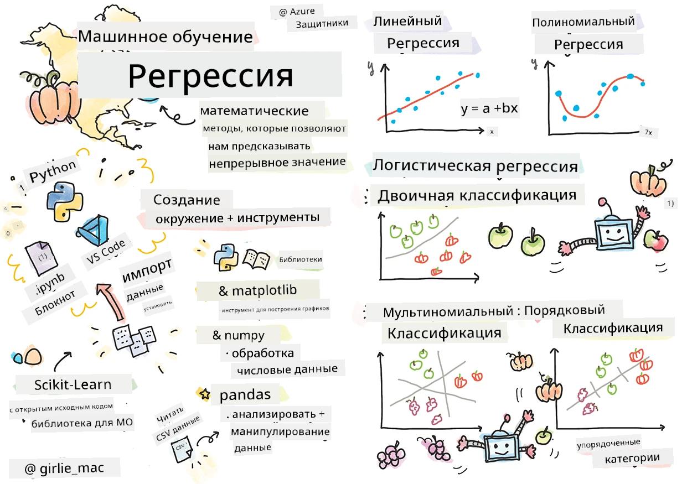
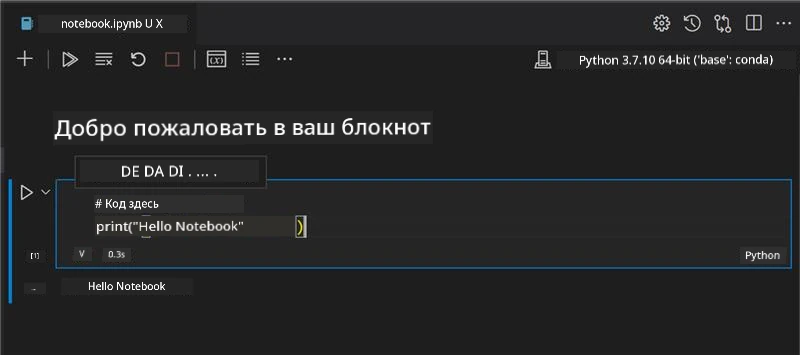
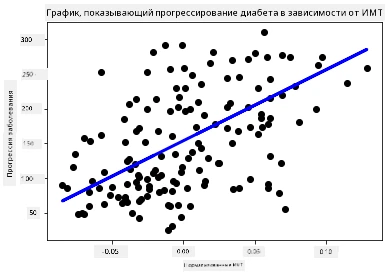

# Начинаем работу с Python и Scikit-learn для регрессионных моделей



> Скетчноут от [Tomomi Imura](https://www.twitter.com/girlie_mac)

## [Викторина перед лекцией](https://ff-quizzes.netlify.app/en/ml/)

> ### [Этот урок доступен на R!](../../../../2-Regression/1-Tools/solution/R/lesson_1.html)

## Введение

В этих четырёх уроках вы узнаете, как строить регрессионные модели. Скоро мы обсудим, для чего они нужны. Но прежде чем что-либо делать, убедитесь, что у вас есть необходимые инструменты для начала работы!

В этом уроке вы научитесь:

- Настраивать компьютер для локальных задач машинного обучения.
- Работать с Jupyter Notebooks.
- Использовать Scikit-learn, включая установку.
- Исследовать линейную регрессию на практике.

## Установки и настройки

[](https://youtu.be/-DfeD2k2Kj0 "ML для начинающих - Настройка инструментов для создания моделей машинного обучения")

> 🎥 Нажмите на изображение выше для короткого видео о настройке компьютера для ML.

1. **Установите Python**. Убедитесь, что [Python](https://www.python.org/downloads/) установлен на вашем компьютере. Вы будете использовать Python для многих задач науки о данных и машинного обучения. В большинстве систем Python уже установлен. Также существуют полезные [пакеты для программирования на Python](https://code.visualstudio.com/learn/educators/installers?WT.mc_id=academic-77952-leestott), облегчающие установку для некоторых пользователей.

   Однако для некоторых задач Python требует одной версии ПО, а для других — другой. Поэтому полезно работать в [виртуальном окружении](https://docs.python.org/3/library/venv.html).

2. **Установите Visual Studio Code**. Убедитесь, что Visual Studio Code установлен на вашем компьютере. Следуйте этим инструкциям, чтобы [установить Visual Studio Code](https://code.visualstudio.com/) для базовой установки. В этом курсе вы будете использовать Python во Visual Studio Code, поэтому возможно стоит ознакомиться с тем, как [настроить Visual Studio Code](https://docs.microsoft.com/learn/modules/python-install-vscode?WT.mc_id=academic-77952-leestott) для разработки на Python.

   > Освойтесь с Python, проработав эту коллекцию [учебных модулей](https://docs.microsoft.com/users/jenlooper-2911/collections/mp1pagggd5qrq7?WT.mc_id=academic-77952-leestott)
   >
   > [](https://youtu.be/yyQM70vi7V8 "Настройка Python с Visual Studio Code")
   >
   > 🎥 Нажмите на изображение выше, чтобы посмотреть видео: использование Python в VS Code.

3. **Установите Scikit-learn**, следуя [этим инструкциям](https://scikit-learn.org/stable/install.html). Поскольку необходимо использовать Python 3, рекомендуется использовать виртуальное окружение. Обратите внимание, если вы устанавливаете библиотеку на M1 Mac, на указанной странице есть специальные инструкции.

1. **Установите Jupyter Notebook**. Вам понадобится [установить пакет Jupyter](https://pypi.org/project/jupyter/).

## Ваша среда разработки ML

Вы будете использовать **notebooks** для разработки вашего Python-кода и создания моделей машинного обучения. Этот тип файлов является распространённым инструментом для специалистов по данным и определяется по расширению `.ipynb`.

Notebooks — это интерактивная среда, которая позволяет разработчику не только писать код, но и добавлять заметки и документацию вокруг кода, что очень полезно для экспериментальных или исследовательских проектов.

[](https://youtu.be/7E-jC8FLA2E "ML для начинающих - Настройка Jupyter Notebooks для начала создания регрессионных моделей")

> 🎥 Нажмите на изображение выше для короткого видео о выполнении этого упражнения.

### Упражнение — работа с notebook

В этой папке вы найдете файл _notebook.ipynb_.

1. Откройте _notebook.ipynb_ в Visual Studio Code.

   Запустится Jupyter сервер с запущенным Python 3+. Вы увидите участки в notebook, которые можно `run` — блоки кода. Чтобы запустить блок кода, выберите иконку, похожую на кнопку «play».

1. Выберите иконку `md` и добавьте немного markdown с текстом **# Добро пожаловать в ваш notebook**.

   Затем добавьте немного кода на Python.

1. Введите **print('hello notebook')** в блоке кода.
1. Выберите стрелку, чтобы запустить код.

   Вы должны увидеть распечатанное сообщение:

    ```output
    hello notebook
    ```



Вы можете чередовать код с комментариями, чтобы самодокументировать notebook.

✅ Подумайте минуту, насколько рабочая среда веб-разработчика отличается от среды специалиста по данным.

## Работа со Scikit-learn

Теперь, когда Python настроен в вашей локальной среде и вы комфортно чувствуете себя с Jupyter Notebooks, давайте привыкнем к Scikit-learn (произносится `сай` как в слове `science`). Scikit-learn предоставляет [обширный API](https://scikit-learn.org/stable/modules/classes.html#api-ref), который поможет вам выполнять задачи ML.

Согласно их [веб-сайту](https://scikit-learn.org/stable/getting_started.html), "Scikit-learn — это библиотека машинного обучения с открытым исходным кодом, поддерживающая контролируемое и неконтролируемое обучение. Она также предоставляет различные инструменты для подгонки моделей, предварительной обработки данных, выбора моделей и оценки, а также множество других утилит."

В этом курсе вы будете использовать Scikit-learn и другие инструменты для создания моделей машинного обучения, выполняющих так называемые «традиционные задачи машинного обучения». Мы сознательно избегали нейронных сетей и глубокого обучения, так как они лучше рассматриваются в нашем предстоящем курсе «ИИ для начинающих».

Scikit-learn упрощает создание моделей и их оценку для использования. Он в первую очередь ориентирован на работу с числовыми данными и содержит несколько готовых датасетов, которые можно использовать в учебных целях. Также включены преднастроенные модели для практики студентов. Давайте исследуем процесс загрузки встроенных данных и использования встроенного оценщика — первой ML-модели с Scikit-learn на простых данных.

## Упражнение — ваш первый notebook с Scikit-learn

> Этот учебник вдохновлён [примером линейной регрессии](https://scikit-learn.org/stable/auto_examples/linear_model/plot_ols.html#sphx-glr-auto-examples-linear-model-plot-ols-py) с сайта Scikit-learn.


[](https://youtu.be/2xkXL5EUpS0 "ML для начинающих - Ваш первый проект линейной регрессии на Python")

> 🎥 Нажмите на изображение выше для короткого видео о выполнении этого упражнения.

В файле _notebook.ipynb_, связанном с этим уроком, очистите все ячейки, нажав на значок «корзина».

В этой части вы будете работать с небольшим датасетом о диабете, встроенным в Scikit-learn для учебных целей. Представьте, что вы хотите протестировать лечение для пациентов с диабетом. Модели машинного обучения могут помочь определить, какие пациенты лучше отреагируют на лечение, основываясь на комбинациях переменных. Даже очень простая регрессионная модель, визуализированная, может показать информацию о переменных, которая поможет организовать теоретические клинические испытания.

✅ Существует много типов регрессионных методов, и выбор зависит от ответа, который вы ищете. Если вы хотите предсказать вероятный рост человека определённого возраста, вы используете линейную регрессию, так как ищете **числовое значение**. Если вы хотите определить, считать ли тип кухни веганской или нет, вы ищете **присвоение категории**, поэтому используете логистическую регрессию. Вы узнаете больше о логистической регрессии позже. Подумайте немного о вопросах, которые можно задать данным, и какой из методов будет более подходящим.

Давайте приступим к этой задаче.

### Импорт библиотек

Для этой задачи мы импортируем некоторые библиотеки:

- **matplotlib**. Это полезный [инструмент для построения графиков](https://matplotlib.org/), мы будем использовать его для создания линейного графика.
- **numpy**. [numpy](https://numpy.org/doc/stable/user/whatisnumpy.html) — это полезная библиотека для работы с числовыми данными в Python.
- **sklearn**. Это библиотека [Scikit-learn](https://scikit-learn.org/stable/user_guide.html).

Импортируйте библиотеки для помощи в ваших задачах.

1. Добавьте импорт, введя следующий код:

   ```python
   import matplotlib.pyplot as plt
   import numpy as np
   from sklearn import datasets, linear_model, model_selection
   ```

   В коде выше вы импортируете `matplotlib`, `numpy` и импортируете `datasets`, `linear_model` и `model_selection` из `sklearn`. `model_selection` используется для разделения данных на обучающий и тестовый наборы.

### Датасет диабета

Встроенный [датасет диабета](https://scikit-learn.org/stable/datasets/toy_dataset.html#diabetes-dataset) содержит 442 образца данных по диабету с 10 признаками, некоторые из которых включают:

- возраст: возраст в годах
- bmi: индекс массы тела
- bp: среднее артериальное давление
- s1 tc: Т-лимфоциты (тип белых кровяных клеток)

✅ Этот датасет включает понятие «пол» как признак, важный для исследований диабета. Многие медицинские датасеты используют такого рода бинарную классификацию. Подумайте немного о том, как такие категоризации могут исключать части населения из лечения.

Теперь загрузите данные X и y.

> 🎓 Помните, что это контролируемое обучение, и нам нужен целевой параметр с именем 'y'.

В новой ячейке кода загрузите датасет диабета, вызвав `load_diabetes()`. Параметр `return_X_y=True` означает, что `X` будет матрицей данных, а `y` — целевой переменной регрессии.

1. Добавьте команды print, чтобы показать форму матрицы данных и первый элемент:

    ```python
    X, y = datasets.load_diabetes(return_X_y=True)
    print(X.shape)
    print(X[0])
    ```

    Что вы получаете в ответ — это кортеж. Вы присваиваете первые два значения кортежа переменным `X` и `y` соответственно. Подробнее о [кортежах](https://wikipedia.org/wiki/Tuple).

    Вы можете увидеть, что данных 442 элемента, которые представляют собой массивы из 10 значений:

    ```text
    (442, 10)
    [ 0.03807591  0.05068012  0.06169621  0.02187235 -0.0442235  -0.03482076
    -0.04340085 -0.00259226  0.01990842 -0.01764613]
    ```

    ✅ Подумайте немного о связи между данными и целевой переменной регрессии. Линейная регрессия предсказывает связи между признаками X и целевой переменной y. Можете ли вы найти [целевую переменную](https://scikit-learn.org/stable/datasets/toy_dataset.html#diabetes-dataset) для датасета диабета в документации? Что демонстрирует этот набор данных с учётом этой цели?

2. Далее выберите часть этого датасета для построения графика, выбрав 3-й столбец. Используйте оператор `:`, чтобы выбрать все строки, а затем 3-й столбец с индексом (2). Можно также преобразовать данные в 2D-массив — как требуется для построения графиков — с помощью `reshape(n_rows, n_columns)`. Если один из параметров равен -1, соответствующее измерение вычисляется автоматически.

   ```python
   X = X[:, 2]
   X = X.reshape((-1,1))
   ```

   ✅ В любой момент выводите данные, чтобы проверить их форму.

3. Теперь, когда данные готовы для отображения, проверьте, может ли машина помочь определить логическое разделение чисел в этом наборе данных. Для этого нужно разделить данные (X) и целевые значения (y) на тестовый и обучающий наборы. В Scikit-learn есть простой способ сделать это: можно разделить данные по заданному индексу.

   ```python
   X_train, X_test, y_train, y_test = model_selection.train_test_split(X, y, test_size=0.33)
   ```

4. Теперь вы готовы обучить вашу модель! Загрузите модель линейной регрессии и обучите её на обучающих данных X и y с помощью `model.fit()`:

    ```python
    model = linear_model.LinearRegression()
    model.fit(X_train, y_train)
    ```

    ✅ `model.fit()` — функция, которую вы встретите во многих библиотеках машинного обучения, таких как TensorFlow

5. Затем создайте предсказание, используя тестовые данные, с помощью функции `predict()`. Это будет использоваться для построения линии между группами данных.

    ```python
    y_pred = model.predict(X_test)
    ```

6. Пришло время показать данные на графике. Matplotlib — очень полезный инструмент для этой задачи. Создайте диаграмму рассеяния всех тестовых данных X и y, и используйте предсказание, чтобы нарисовать линию в наиболее подходящем месте, между группами данных модели.

    ```python
    plt.scatter(X_test, y_test,  color='black')
    plt.plot(X_test, y_pred, color='blue', linewidth=3)
    plt.xlabel('Scaled BMIs')
    plt.ylabel('Disease Progression')
    plt.title('A Graph Plot Showing Diabetes Progression Against BMI')
    plt.show()
    ```

   


   ✅ Подумайте немного о том, что здесь происходит. Прямая линия проходит через множество маленьких точек данных, но что именно она делает? Видите ли вы, как с помощью этой линии можно предсказать, где должна располагаться новая, ранее не виденная точка данных относительно оси y на графике? Попробуйте сформулировать практическое применение этой модели.

Поздравляем, вы построили свою первую модель линейной регрессии, создали на её основе предсказание и отобразили его на графике!

---
## 🚀Вызов

Постройте график другой переменной из этого набора данных. Подсказка: отредактируйте эту строку: `X = X[:,2]`. Учитывая целевую переменную этого набора данных, что вы можете узнать о прогрессировании диабета как заболевания?
## [Тест после лекции](https://ff-quizzes.netlify.app/en/ml/)

## Повторение и самостоятельное изучение

В этом уроке вы работали с простой линейной регрессией, а не с одно- или многомерной линейной регрессией. Прочитайте немного о различиях между этими методами или посмотрите [это видео](https://www.coursera.org/lecture/quantifying-relationships-regression-models/linear-vs-nonlinear-categorical-variables-ai2Ef).

Прочитайте больше о концепции регрессии и подумайте, какие вопросы можно решить с помощью этой техники. Пройдите этот [урок](https://docs.microsoft.com/learn/modules/train-evaluate-regression-models?WT.mc_id=academic-77952-leestott), чтобы углубить свои знания.

## Задание

[Другой набор данных](assignment.md)

---

<!-- CO-OP TRANSLATOR DISCLAIMER START -->
**Отказ от ответственности**:
Этот документ был переведен с использованием сервиса машинного перевода [Co-op Translator](https://github.com/Azure/co-op-translator). Несмотря на наши усилия по обеспечению точности, имейте в виду, что автоматический перевод может содержать ошибки или неточности. Оригинальный документ на его исходном языке следует считать авторитетным источником. Для получения критически важной информации рекомендуется обратиться к профессиональному человеческому переводу. Мы не несем ответственности за любые недоразумения или неправильные толкования, возникшие в результате использования этого перевода.
<!-- CO-OP TRANSLATOR DISCLAIMER END -->