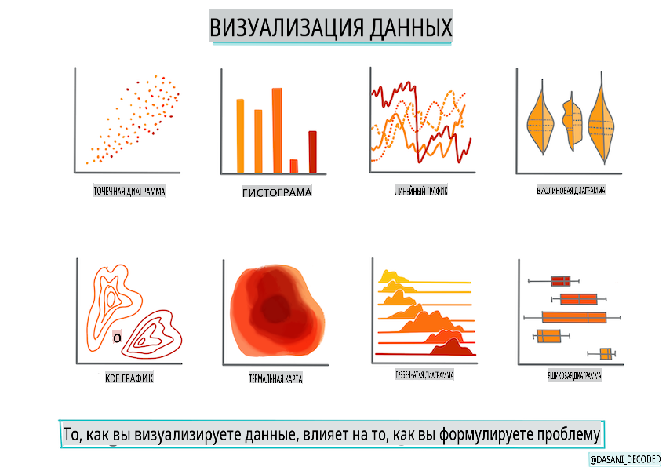
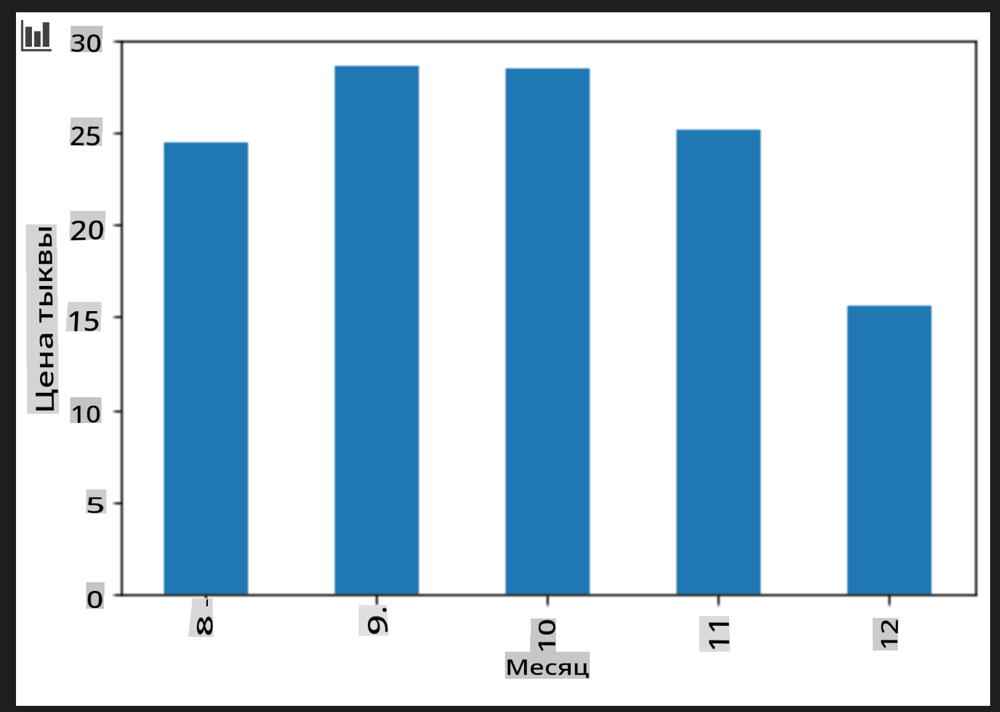

# Построение регрессионной модели с использованием Scikit-learn: подготовка и визуализация данных



Инфографика от [Dasani Madipalli](https://twitter.com/dasani_decoded)

## [Викторина перед лекцией](https://gray-sand-07a10f403.1.azurestaticapps.net/quiz/11/)

> ### [Этот урок доступен на R!](../../../../2-Regression/2-Data/solution/R/lesson_2.html)

## Введение

Теперь, когда у вас есть все необходимые инструменты для начала работы с построением моделей машинного обучения с использованием Scikit-learn, вы готовы начать задавать вопросы своим данным. В процессе работы с данными и применения решений на основе машинного обучения очень важно понимать, как задать правильный вопрос, чтобы правильно раскрыть потенциал вашего набора данных.

В этом уроке вы узнаете:

- Как подготовить ваши данные для построения модели.
- Как использовать Matplotlib для визуализации данных.

## Задавание правильного вопроса вашим данным

Вопрос, на который вам нужно получить ответ, определит, какие алгоритмы машинного обучения вы будете использовать. А качество полученного ответа будет сильно зависеть от природы ваших данных.

Взгляните на [данные](https://github.com/microsoft/ML-For-Beginners/blob/main/2-Regression/data/US-pumpkins.csv), предоставленные для этого урока. Вы можете открыть этот .csv файл в VS Code. Быстрый обзор сразу показывает, что есть пустые ячейки и смешение строковых и числовых данных. Также есть странный столбец под названием 'Package', где данные представляют собой смесь 'sacks', 'bins' и других значений. Данные, на самом деле, немного запутанные.

[](https://youtu.be/5qGjczWTrDQ "ML для начинающих - Как проанализировать и очистить набор данных")

> 🎥 Нажмите на изображение выше, чтобы посмотреть короткое видео о подготовке данных для этого урока.

На самом деле, не так уж часто бывает, что вам предоставляют набор данных, который полностью готов к использованию для создания модели машинного обучения. В этом уроке вы научитесь, как подготовить сырой набор данных с использованием стандартных библиотек Python. Вы также узнаете различные техники визуализации данных.

## Кейс-стадия: 'рынок тыкв'

В этой папке вы найдете .csv файл в корневом `data` каталоге под названием [US-pumpkins.csv](https://github.com/microsoft/ML-For-Beginners/blob/main/2-Regression/data/US-pumpkins.csv), который содержит 1757 строк данных о рынке тыкв, отсортированных по группам по городам. Это сырье, извлеченное из [Стандартных отчетов терминальных рынков специализированных культур](https://www.marketnews.usda.gov/mnp/fv-report-config-step1?type=termPrice), распространяемых Министерством сельского хозяйства США.

### Подготовка данных

Эти данные находятся в общественном достоянии. Их можно загрузить в виде множества отдельных файлов по городам с веб-сайта USDA. Чтобы избежать слишком большого количества отдельных файлов, мы объединили все городские данные в одну таблицу, таким образом, мы уже немного _подготовили_ данные. Далее давайте более внимательно взглянем на данные.

### Данные о тыквах - первые выводы

Что вы замечаете в этих данных? Вы уже видели, что есть смешение строк, чисел, пустых значений и странных данных, которые нужно понять.

Какой вопрос вы можете задать этим данным, используя технику регрессии? Как насчет "Предсказать цену тыквы на продажу в течение определенного месяца". Снова взглянув на данные, вы увидите, что необходимо внести некоторые изменения, чтобы создать необходимую структуру данных для этой задачи.

## Упражнение - проанализировать данные о тыквах

Давайте используем [Pandas](https://pandas.pydata.org/), (это название обозначает `Python Data Analysis`), инструмент, который очень полезен для обработки данных, чтобы проанализировать и подготовить эти данные о тыквах.

### Сначала проверьте на наличие пропущенных дат

Сначала вам нужно предпринять шаги для проверки на наличие пропущенных дат:

1. Преобразуйте даты в формат месяца (это американские даты, поэтому формат - `MM/DD/YYYY`).
2. Извлеките месяц в новый столбец.

Откройте файл _notebook.ipynb_ в Visual Studio Code и импортируйте таблицу в новый DataFrame Pandas.

1. Используйте функцию `head()`, чтобы просмотреть первые пять строк.

    ```python
    import pandas as pd
    pumpkins = pd.read_csv('../data/US-pumpkins.csv')
    pumpkins.head()
    ```

    ✅ Какую функцию вы бы использовали, чтобы просмотреть последние пять строк?

1. Проверьте, есть ли пропущенные данные в текущем DataFrame:

    ```python
    pumpkins.isnull().sum()
    ```

    Пропущенные данные есть, но, возможно, это не будет иметь значения для текущей задачи.

1. Чтобы упростить работу с вашим DataFrame, выберите только те столбцы, которые вам нужны, используя `loc` function which extracts from the original dataframe a group of rows (passed as first parameter) and columns (passed as second parameter). The expression `:` в данном случае означает "все строки".

    ```python
    columns_to_select = ['Package', 'Low Price', 'High Price', 'Date']
    pumpkins = pumpkins.loc[:, columns_to_select]
    ```

### Во-вторых, определите среднюю цену тыквы

Подумайте, как определить среднюю цену тыквы в заданном месяце. Какие столбцы вы бы выбрали для этой задачи? Подсказка: вам понадобятся 3 столбца.

Решение: возьмите среднее значение столбцов `Low Price` and `High Price`, чтобы заполнить новый столбец Price, и преобразуйте столбец Date, чтобы он показывал только месяц. К счастью, согласно проверке выше, нет пропущенных данных по датам или ценам.

1. Чтобы рассчитать среднее значение, добавьте следующий код:

    ```python
    price = (pumpkins['Low Price'] + pumpkins['High Price']) / 2

    month = pd.DatetimeIndex(pumpkins['Date']).month

    ```

   ✅ Не стесняйтесь выводить любые данные, которые хотите проверить, используя `print(month)`.

2. Теперь скопируйте ваши преобразованные данные в новый DataFrame Pandas:

    ```python
    new_pumpkins = pd.DataFrame({'Month': month, 'Package': pumpkins['Package'], 'Low Price': pumpkins['Low Price'],'High Price': pumpkins['High Price'], 'Price': price})
    ```

    Вывод вашего DataFrame покажет вам чистый, аккуратный набор данных, на основе которого вы можете построить свою новую регрессионную модель.

### Но подождите! Здесь что-то странное

Если вы посмотрите на столбец `Package` column, pumpkins are sold in many different configurations. Some are sold in '1 1/9 bushel' measures, and some in '1/2 bushel' measures, some per pumpkin, some per pound, and some in big boxes with varying widths.

> Pumpkins seem very hard to weigh consistently

Digging into the original data, it's interesting that anything with `Unit of Sale` equalling 'EACH' or 'PER BIN' also have the `Package` type per inch, per bin, or 'each'. Pumpkins seem to be very hard to weigh consistently, so let's filter them by selecting only pumpkins with the string 'bushel' in their `Package`.

1. Добавьте фильтр в верхней части файла, под первоначальным импортом .csv:

    ```python
    pumpkins = pumpkins[pumpkins['Package'].str.contains('bushel', case=True, regex=True)]
    ```

    Если вы сейчас выведете данные, вы увидите, что получаете только около 415 строк данных, содержащих тыквы в бушелях.

### Но подождите! Есть еще одно дело

Вы заметили, что количество бушелей варьируется от строки к строке? Вам нужно нормализовать цены, чтобы показать цену за бушель, поэтому сделайте некоторые вычисления, чтобы стандартизировать это.

1. Добавьте эти строки после блока, создающего новый DataFrame new_pumpkins:

    ```python
    new_pumpkins.loc[new_pumpkins['Package'].str.contains('1 1/9'), 'Price'] = price/(1 + 1/9)

    new_pumpkins.loc[new_pumpkins['Package'].str.contains('1/2'), 'Price'] = price/(1/2)
    ```

✅ Согласно [The Spruce Eats](https://www.thespruceeats.com/how-much-is-a-bushel-1389308), вес бушеля зависит от типа продукции, так как это измерение объема. "Бушель помидоров, например, должен весить 56 фунтов... Листья и зелень занимают больше места с меньшим весом, поэтому бушель шпината весит всего 20 фунтов." Все это довольно сложно! Давайте не будем заморачиваться с преобразованием бушелей в фунты, а просто установим цену за бушель. Однако все это изучение бушелей тыкв показывает, насколько важно понимать природу ваших данных!

Теперь вы можете проанализировать цену за единицу на основе их измерения в бушелях. Если вы снова выведете данные, вы увидите, как они стандартизированы.

✅ Вы заметили, что тыквы, продаваемые по полубушелю, очень дорогие? Можете ли вы понять, почему? Подсказка: маленькие тыквы намного дороже больших, вероятно, потому что их гораздо больше на бушель, учитывая неиспользуемое пространство, занимаемое одной большой пустой тыквой.

## Стратегии визуализации

Часть работы дата-сайентиста заключается в демонстрации качества и природы данных, с которыми они работают. Для этого они часто создают интересные визуализации, или графики, диаграммы и схемы, показывающие различные аспекты данных. Таким образом, они могут визуально показать взаимосвязи и пробелы, которые иначе сложно обнаружить.

[](https://youtu.be/SbUkxH6IJo0 "ML для начинающих - Как визуализировать данные с Matplotlib")

> 🎥 Нажмите на изображение выше, чтобы посмотреть короткое видео о визуализации данных для этого урока.

Визуализации также могут помочь определить наиболее подходящую технику машинного обучения для данных. Например, точечный график, который кажется следящим за линией, указывает на то, что данные являются хорошим кандидатом для упражнения по линейной регрессии.

Одна из библиотек визуализации данных, которая хорошо работает в Jupyter notebooks, - это [Matplotlib](https://matplotlib.org/) (которую вы также видели в предыдущем уроке).

> Получите больше опыта в визуализации данных в [этих учебниках](https://docs.microsoft.com/learn/modules/explore-analyze-data-with-python?WT.mc_id=academic-77952-leestott).

## Упражнение - поэкспериментируйте с Matplotlib

Попробуйте создать несколько основных графиков для отображения нового DataFrame, который вы только что создали. Что покажет базовый линейный график?

1. Импортируйте Matplotlib в верхней части файла, под импортом Pandas:

    ```python
    import matplotlib.pyplot as plt
    ```

1. Перезапустите весь блокнот, чтобы обновить.
1. Внизу блокнота добавьте ячейку для построения графика данных в виде бокса:

    ```python
    price = new_pumpkins.Price
    month = new_pumpkins.Month
    plt.scatter(price, month)
    plt.show()
    ```

    

    Полезен ли этот график? Удивляет ли вас что-то в нем?

    Он не особенно полезен, так как просто отображает ваши данные в виде разбросанных точек за определенный месяц.

### Сделайте его полезным

Чтобы графики отображали полезные данные, обычно нужно сгруппировать данные каким-то образом. Давайте попробуем создать график, где по оси y будут месяцы, а данные будут показывать распределение данных.

1. Добавьте ячейку для создания сгруппированной столбчатой диаграммы:

    ```python
    new_pumpkins.groupby(['Month'])['Price'].mean().plot(kind='bar')
    plt.ylabel("Pumpkin Price")
    ```

    

    Это более полезная визуализация данных! Похоже, что самая высокая цена на тыквы приходится на сентябрь и октябрь. Соответствует ли это вашим ожиданиям? Почему или почему нет?

---

## 🚀Задача

Изучите различные типы визуализаций, которые предлагает Matplotlib. Какие из них наиболее подходят для задач регрессии?

## [Викторина после лекции](https://gray-sand-07a10f403.1.azurestaticapps.net/quiz/12/)

## Обзор и самостоятельное изучение

Посмотрите на множество способов визуализации данных. Составьте список различных доступных библиотек и отметьте, какие из них лучше всего подходят для определенных типов задач, например, 2D визуализаций против 3D визуализаций. Что вы обнаружите?

## Задание

[Изучение визуализации](assignment.md)

**Отказ от ответственности**:  
Этот документ был переведен с использованием услуг машинного перевода на основе ИИ. Хотя мы стремимся к точности, пожалуйста, имейте в виду, что автоматические переводы могут содержать ошибки или неточности. Оригинальный документ на его родном языке должен считаться авторитетным источником. Для критически важной информации рекомендуется профессиональный человеческий перевод. Мы не несем ответственности за любые недоразумения или неправильные интерпретации, возникающие в результате использования этого перевода.