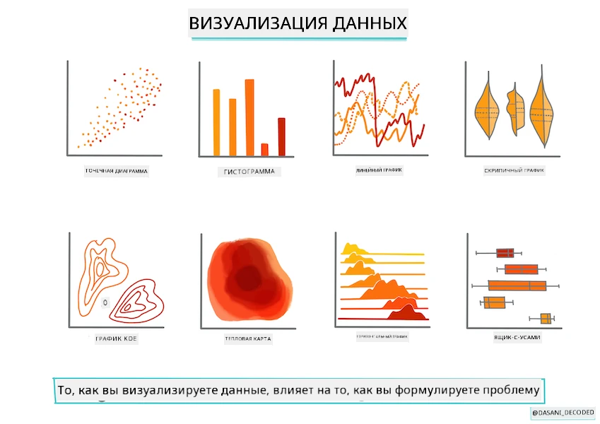
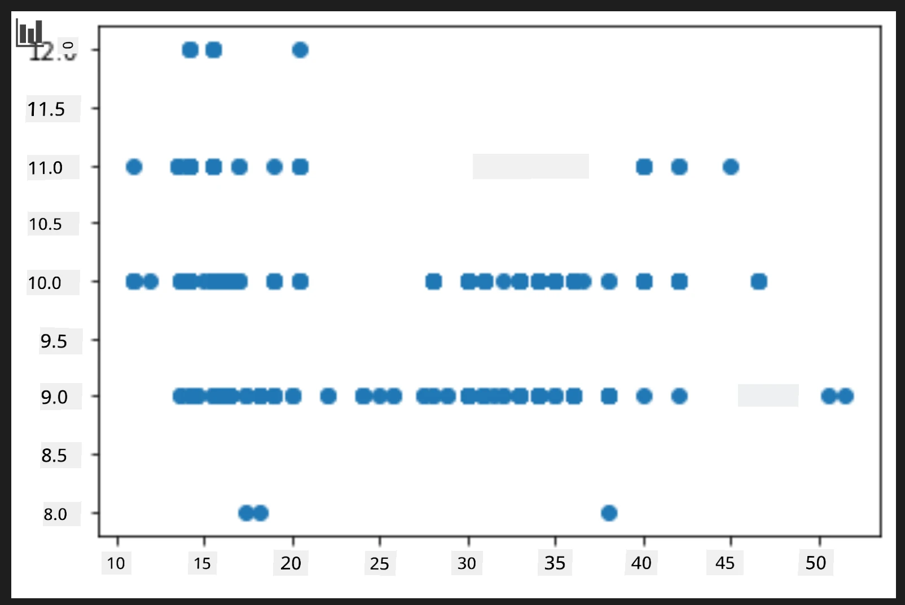
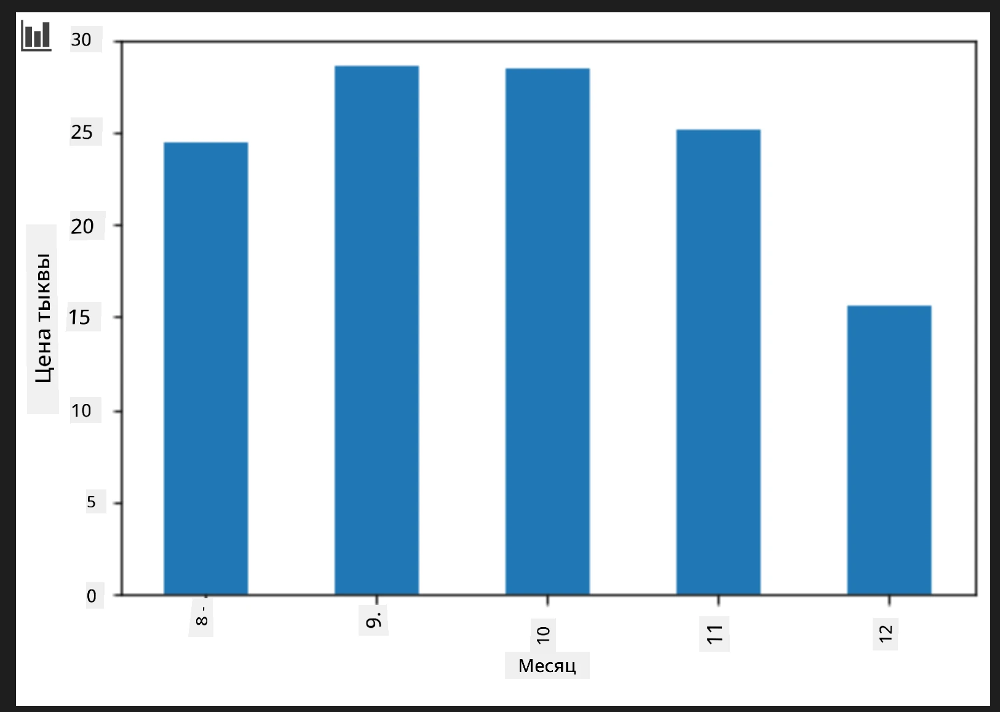
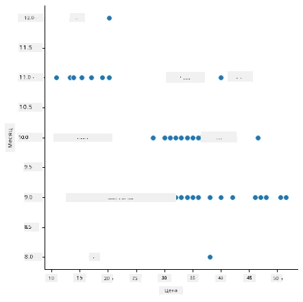
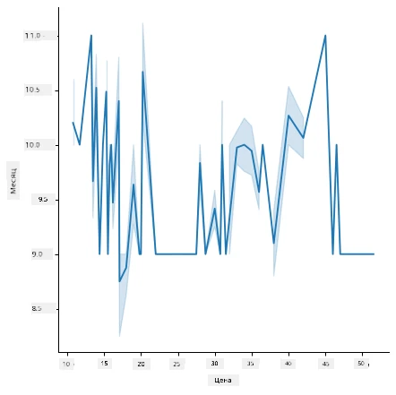
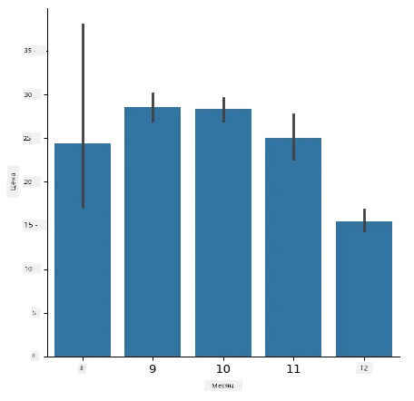
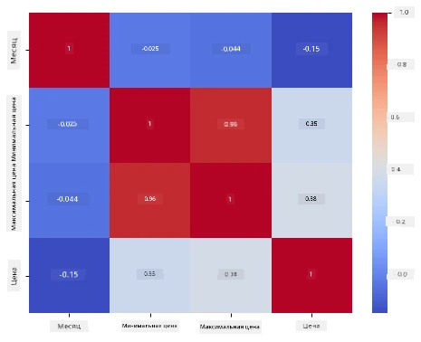

# Построение регрессионной модели с использованием Scikit-learn: подготовка и визуализация данных



Инфографика от [Dasani Madipalli](https://twitter.com/dasani_decoded)

## [Викторина перед лекцией](https://ff-quizzes.netlify.app/en/ml/)

> ### [Этот урок доступен на R!](../../../../2-Regression/2-Data/solution/R/lesson_2.html)

## Введение

Теперь, когда у вас настроены инструменты, необходимые для начала построения моделей машинного обучения с использованием Scikit-learn, вы готовы начать задавать вопросы своим данным. При работе с данными и применении решений на основе машинного обучения очень важно понимать, как правильно формулировать вопрос, чтобы раскрыть потенциал вашего набора данных.

В этом уроке вы узнаете:

- Как подготовить данные для построения модели.
- Как использовать Matplotlib для визуализации данных.
- Как использовать Seaborn для более выразительной визуализации данных.

## Правильный вопрос к вашим данным

Вопрос, на который вы хотите получить ответ, определит, какие типы алгоритмов машинного обучения вы будете использовать. А качество ответа во многом зависит от характера ваших данных.

Посмотрите на [данные](https://github.com/microsoft/ML-For-Beginners/blob/main/2-Regression/data/US-pumpkins.csv), предоставленные для этого урока. Вы можете открыть этот .csv файл в VS Code. Быстрый просмотр сразу показывает, что в данных есть пустые значения и смешение строк и числовых данных. Также есть странный столбец 'Package', где данные смешанные — 'sacks', 'bins' и другие значения. Фактически данные довольно запутаны.

[](https://youtu.be/5qGjczWTrDQ "ML для начинающих - Как анализировать и очищать набор данных")

> 🎥 Нажмите на изображение выше для просмотра короткого видео о подготовке данных для этого урока.

На самом деле, редко когда предоставляют готовый набор данных, полностью пригодный для непосредственного создания модели машинного обучения. В этом уроке вы научитесь готовить необработанный набор данных с помощью стандартных библиотек Python. Также вы узнаете различные техники визуализации данных.

## Кейсовое исследование: «рынок тыкв»

В этой папке вы найдете .csv файл в корневой папке `data`, который называется [US-pumpkins.csv](https://github.com/microsoft/ML-For-Beginners/blob/main/2-Regression/data/US-pumpkins.csv). В нем 1757 строк данных о рынке тыкв, сгруппированных по городам. Это необработанные данные, извлечённые из [Специальных отчетов терминальных рынков сельхозпродукции](https://www.marketnews.usda.gov/mnp/fv-report-config-step1?type=termPrice), распространяемых Министерством сельского хозяйства США.

### Подготовка данных

Эти данные находятся в общественном достоянии. Их можно скачать в множестве отдельных файлов по каждому городу с веб-сайта USDA. Чтобы избежать большого количества отдельных файлов, мы объединили все городские данные в одну таблицу, таким образом мы уже немного _подготовили_ данные. Теперь давайте посмотрим на них внимательнее.

### Данные по тыквам — первые выводы

Что вы заметили в этих данных? Вы уже увидели, что там есть смесь строк, чисел, пустых значений и странных данных, которые нужно понять.

Какой вопрос вы можете задать этим данным, используя метод регрессии? Например: «Предсказать цену тыквы для продажи в заданный месяц». Повторно посмотрев на данные, вам нужно внести некоторые изменения, чтобы создать структуру данных, необходимую для этой задачи.
## Упражнение — анализ данных по тыквам

Давайте используем [Pandas](https://pandas.pydata.org/), (название означает `Python Data Analysis`) — инструмент, очень полезный для обработки данных, чтобы проанализировать и подготовить эти данные по тыквам.

### Сначала проверьте наличие пропущенных дат

Вам сначала нужно сделать шаги для проверки пропущенных дат:

1. Преобразуйте даты в формат месяца (это даты в американском формате `MM/DD/YYYY`).
2. Извлеките месяц в новый столбец.

Откройте файл _notebook.ipynb_ в Visual Studio Code и импортируйте таблицу в новый DataFrame Pandas.

1. Используйте функцию `head()` чтобы просмотреть первые пять строк.

    ```python
    import pandas as pd
    pumpkins = pd.read_csv('../data/US-pumpkins.csv')
    pumpkins.head()
    ```

    ✅ Какую функцию вы бы использовали, чтобы просмотреть последние пять строк?

1. Проверьте, есть ли в текущем DataFrame пропущенные данные:

    ```python
    pumpkins.isnull().sum()
    ```

    В данных есть пропуски, но возможно, они не повлияют на текущую задачу.

1. Чтобы упростить работу с DataFrame, выберите только нужные вам столбцы, используя функцию `loc`, которая извлекает из исходного DataFrame группу строк (переданных первым параметром) и столбцов (вторым параметром). Выражение `:` в случае ниже значит «все строки».

    ```python
    columns_to_select = ['Package', 'Low Price', 'High Price', 'Date']
    pumpkins = pumpkins.loc[:, columns_to_select]
    ```

### Во-вторых, определите среднюю цену тыквы

Подумайте, как рассчитать среднюю цену тыквы в заданный месяц. Какие столбцы вы выберете для этой задачи? Подсказка: вам нужно 3 столбца.

Решение: возьмите среднее значение столбцов `Low Price` и `High Price`, чтобы заполнить новый столбец Price, и конвертируйте столбец Date так, чтобы он показывал только месяц. К счастью, судя по проверке выше, нет пропусков в данных по датам и ценам.

1. Для вычисления среднего добавьте следующий код:

    ```python
    price = (pumpkins['Low Price'] + pumpkins['High Price']) / 2

    month = pd.DatetimeIndex(pumpkins['Date']).month

    ```

   ✅ Можете вывести любые данные на печать для проверки с помощью `print(month)`.

2. Теперь скопируйте преобразованные данные в новый DataFrame Pandas:

    ```python
    new_pumpkins = pd.DataFrame({'Month': month, 'Package': pumpkins['Package'], 'Low Price': pumpkins['Low Price'],'High Price': pumpkins['High Price'], 'Price': price})
    ```

    Вывод вашего DataFrame покажет чистый и аккуратный набор данных, на котором вы сможете строить новую регрессионную модель.

### Но подождите! Там есть что-то странное

Если вы посмотрите на столбец `Package`, тыквы продаются в разных конфигурациях. Некоторые продаются в мерах '1 1/9 бушеля', некоторые — '1/2 бушеля', некоторые — по одной тыкве, некоторые — за фунт, а некоторые — большими коробками разной ширины.

> Похоже, тыквы очень трудно взвесить однородно

При детальном изучении исходных данных, интересно, что все записи с `Unit of Sale`, равным 'EACH' или 'PER BIN', имеют тип `Package` с указанием в дюймах, per bin или 'each'. Тыквы действительно сложно взвесить точно, так что отфильтруем их, выбрав только тыквы с строкой 'bushel' в столбце `Package`.

1. Добавьте фильтр в начале файла, под импортом .csv:

    ```python
    pumpkins = pumpkins[pumpkins['Package'].str.contains('bushel', case=True, regex=True)]
    ```

    Если вывести данные сейчас, вы увидите только около 415 строк с тыквами в мерах бушеля.

### Но подождите! Нужно сделать ещё кое-что

Замечали, что количество бушелей варьируется в каждой строке? Нужно нормализовать цены, чтобы показывать цену за один бушель, поэтому сделайте соответствующие арифметические преобразования для стандартизации.

1. Добавьте эти строки после блока, создающего DataFrame new_pumpkins:

    ```python
    new_pumpkins.loc[new_pumpkins['Package'].str.contains('1 1/9'), 'Price'] = price/(1 + 1/9)

    new_pumpkins.loc[new_pumpkins['Package'].str.contains('1/2'), 'Price'] = price/(1/2)
    ```

✅ Согласно [The Spruce Eats](https://www.thespruceeats.com/how-much-is-a-bushel-1389308), вес бушеля зависит от типа продукта, поскольку это измерение объема. «Бушель помидоров, например, должен весить 56 фунтов... Листья и зелень занимают больше места при меньшем весе, поэтому бушель шпината весит всего 20 фунтов». Всё довольно сложно! Давайте не будем преобразовывать бушель в фунты, а определим цену за бушель. Все эти исследования бушелей тыкв показывают, насколько важно понимать природу ваших данных!

Теперь вы можете анализировать цены за единицу, основываясь на их мере бушеля. Если вы выведете данные ещё раз, увидите, как они стандартизированы.

✅ Заметили, что тыквы, продающиеся по половине бушеля, очень дорогие? Можете понять, почему? Подсказка: маленькие тыквы значительно дороже больших, вероятно потому, что их гораздо больше в одном бушеле, учитывая неиспользуемое пространство, занятое одной большой пустой тыквой для пирога.

## Стратегии визуализации

Часть работы специалиста по данным — демонстрировать качество и характер данных, с которыми он работает. Для этого часто создают интересные визуализации, диаграммы, графики и таблицы, показывая разные аспекты данных. Так они могут визуально показать взаимосвязи и пробелы, которые иначе трудно обнаружить.

[](https://youtu.be/SbUkxH6IJo0 "ML для начинающих - Как визуализировать данные с Matplotlib")

> 🎥 Нажмите на изображение выше для просмотра короткого видео о визуализации данных для этого урока.

Визуализации также помогают определить, какой метод машинного обучения лучше всего подходит для данных. Диаграмма рассеяния, которая кажется идущей по линии, например, указывает, что данные подходят для линейной регрессии.

Одна из библиотек визуализации данных, которая отлично работает в Jupyter ноутбуках — [Matplotlib](https://matplotlib.org/) (которую вы уже видели в предыдущем уроке).

> Получите больше опыта с визуализацией данных в [этих учебниках](https://docs.microsoft.com/learn/modules/explore-analyze-data-with-python?WT.mc_id=academic-77952-leestott).

## Упражнение — экспериментируем с Matplotlib

Попробуйте создать базовые графики для отображения нового DataFrame, который вы создали. Что бы показал простой линейный график?

1. Импортируйте Matplotlib вверху файла, под импортом Pandas:

    ```python
    import matplotlib.pyplot as plt
    ```

1. Перезапустите весь ноутбук для обновления.
1. Внизу ноутбука добавьте ячейку для построения box-графика (ящика с усами):

    ```python
    price = new_pumpkins.Price
    month = new_pumpkins.Month
    plt.scatter(price, month)
    plt.show()
    ```

    

    Это полезный график? Что-то вас удивило?

    На самом деле, он не очень полезен, так как просто показывает разброс ваших данных по месяцам в виде точек.

### Сделайте его полезным

Чтобы графики показывали полезную информацию, обычно данные нужно как-то сгруппировать. Попробуем создать график со столбцами, где ось Y показывает месяцы, а данные демонстрируют распределение.

1. Добавьте ячейку для построения сгруппированной столбчатой диаграммы:

    ```python
    new_pumpkins.groupby(['Month'])['Price'].mean().plot(kind='bar')
    plt.ylabel("Pumpkin Price")
    ```

    

    Это более полезная визуализация! Похоже, что самая высокая цена на тыквы бывает в сентябре и октябре. Совпадает ли это с вашими ожиданиями? Почему да или почему нет?

## Упражнение — экспериментируем с Seaborn

Matplotlib мощная библиотека, но для создания аккуратной диаграммы может потребоваться много кода. [Seaborn](https://seaborn.pydata.org/) — библиотека, построенная _на основе_ Matplotlib, предназначенная для статистической визуализации данных. Она работает напрямую с DataFrame Pandas, применяет привлекательные стили по умолчанию и позволяет создавать информативные графики с гораздо меньшим кодом. Поскольку Seaborn возвращает объекты Matplotlib, вы можете использовать всё, что уже знаете о Matplotlib, для тонкой настройки результатов.

> Если у вас ещё не установлена библиотека Seaborn, установите её с помощью `pip install seaborn`.

1. Импортируйте Seaborn в начале ноутбука, под другими импортами. По традиции импортируется как `sns`:

    ```python
    import seaborn as sns
    ```

### Диаграммы рассеяния для демонстрации взаимосвязей

Важная часть исследования данных перед созданием модели — поиск _взаимосвязей_ между переменными. [Диаграмма рассеяния](https://ru.wikipedia.org/wiki/Диаграмма_рассеяния) — один из лучших инструментов для этого: если точки на ней располагаются вдоль линии, переменные могут коррелировать, что хорошо подходит для построения модели линейной регрессии.

1. Воссоздайте диаграмму рассеяния «цена к месяцу» с помощью функции Seaborn [`relplot()`](https://seaborn.pydata.org/generated/seaborn.relplot.html) (relation plot), которая работает напрямую со столбцами вашего DataFrame:

    ```python
    sns.relplot(x="Price", y="Month", data=new_pumpkins)
    ```

    

    Обратите внимание, как вы передаете _названия столбцов_ и DataFrame, а Seaborn сам заботится о подписях осей.

2. Вы можете переключиться на линейный график, передав параметр `kind="line"`. Seaborn даже рисует затемнённую область, показывающую доверительный интервал вокруг линии:

    ```python
    sns.relplot(x="Price", y="Month", kind="line", data=new_pumpkins)
    ```

    

    Эти данные довольно шумные, поэтому линейный график далеко не самый наглядный выбор — но он показывает, как легко изменить тип диаграммы в Seaborn.

### Столбчатые диаграммы для демонстрации распределений


Ранее вы вручную группировали данные, чтобы создать столбчатую диаграмму с помощью Matplotlib. Seaborn's [`catplot()`](https://seaborn.pydata.org/generated/seaborn.catplot.html) (категориальный график) может выполнять группировку и агрегацию за вас. По умолчанию `kind="bar"` показывает среднее значение каждой категории вместе с черной линией, указывающей доверительный интервал.

1. Создайте столбчатую диаграмму средней цены за месяц:

    ```python
    sns.catplot(x="Month", y="Price", data=new_pumpkins, kind="bar")
    ```

    

    Это подтверждает то, что вы видели с Matplotlib — цены достигают пика примерно в сентябре и октябре — но Seaborn также визуализирует, насколько сильно цена _варьируется_ в каждом месяце.

### Тепловые карты для отображения корреляций

Точечные диаграммы сравнивают по два переменных одновременно. Когда у вас есть несколько числовых столбцов, [тепловая карта](https://en.wikipedia.org/wiki/Heat_map) позволяет просмотреть силу связи между _каждой_ парой столбцов одновременно. Это распространённый способ определить, какие признаки наиболее коррелированы, перед выбором того, что использовать в модели (а такой же тип диаграммы позже используется для отображения матриц ошибок классификации).

1. Постройте корреляционную матрицу с помощью Pandas, затем отобразите её с помощью [`heatmap()`](https://seaborn.pydata.org/generated/seaborn.heatmap.html) из Seaborn. Опция `annot=True` добавляет значения корреляции в каждую ячейку:

    ```python
    correlations = new_pumpkins[['Month', 'Low Price', 'High Price', 'Price']].corr()
    sns.heatmap(correlations, annot=True, cmap="coolwarm")
    ```

    

    Значения, близкие к `1` (или `-1`), означают, что столбцы сильно _линейно_ коррелированы. Обратите внимание, как `Low Price` и `High Price` почти идеально коррелируют. `Month`, с другой стороны, показывает лишь слабую линейную корреляцию с ценой — хотя столбчатая диаграмма выше выявила явный сезонный пик в сентябре и октябре. Это важный урок: коэффициент корреляции измеряет только _прямолинейные_ отношения, поэтому он может не заметить сезонные или иные нелинейные паттерны. ✅ Почему полезно смотреть и на тепловую карту, *и* на такие графики, как столбчатая диаграмма, перед тем как решать, какие столбцы использовать?

### Matplotlib или Seaborn?

Обе библиотеки стоит знать:

- **Matplotlib** даёт тонкий контроль над каждым элементом графика и является основой, на которой строятся почти все другие библиотеки для построения графиков на Python.
- **Seaborn** предлагает функции более высокого уровня и привлекательные настройки по умолчанию для статистических графиков, работает напрямую с датафреймами и часто быстрее подходит для разведочного анализа данных.

Распространённый рабочий процесс — сначала использовать Seaborn для быстрой первичной оценки данных, а затем переходить к Matplotlib, когда требуется детальное кастомное оформление.

---

## 🚀Задача

Исследуйте разные типы визуализаций, которые предлагают Matplotlib и Seaborn. Какие типы наиболее подходят для задач регрессии?

## [Тест после лекции](https://ff-quizzes.netlify.app/en/ml/)

## Обзор и самостоятельное изучение

Ознакомьтесь с множеством способов визуализации данных. Составьте список различных доступных библиотек и отметьте, какие лучше всего подходят для выполнения определённых задач, например, двумерной или трёхмерной визуализации. Что вы обнаружите?

## Домашнее задание

[Изучение визуализации](assignment.md)

---

<!-- CO-OP TRANSLATOR DISCLAIMER START -->
**Отказ от ответственности**:
Этот документ был переведен с использованием сервиса машинного перевода [Co-op Translator](https://github.com/Azure/co-op-translator). Несмотря на наши усилия по обеспечению точности, имейте в виду, что автоматический перевод может содержать ошибки или неточности. Оригинальный документ на его исходном языке следует считать авторитетным источником. Для получения критически важной информации рекомендуется обратиться к профессиональному человеческому переводу. Мы не несем ответственности за любые недоразумения или неправильные толкования, возникшие в результате использования этого перевода.
<!-- CO-OP TRANSLATOR DISCLAIMER END -->