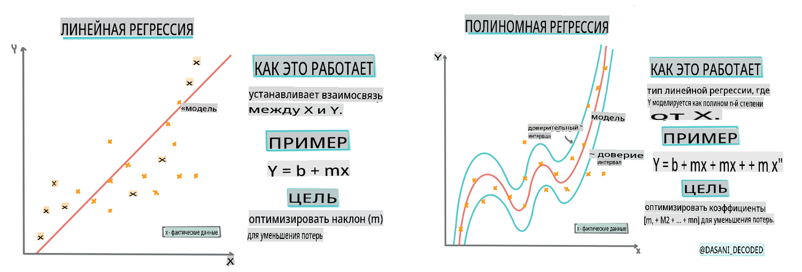
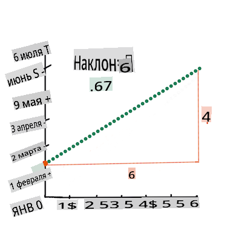
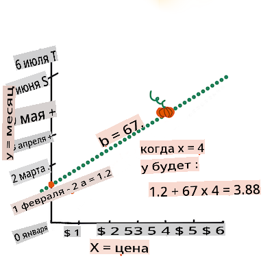

# Построение регрессионной модели с использованием Scikit-learn: регрессия четырьмя способами


> Инфографика от [Dasani Madipalli](https://twitter.com/dasani_decoded)
## [Викторина перед лекцией](https://gray-sand-07a10f403.1.azurestaticapps.net/quiz/13/)

> ### [Этот урок доступен на R!](../../../../2-Regression/3-Linear/solution/R/lesson_3.html)
### Введение 

До сих пор вы изучали, что такое регрессия, на примере данных о ценах на тыквы, которые мы будем использовать на протяжении всего этого урока. Вы также визуализировали данные с помощью Matplotlib.

Теперь вы готовы углубиться в регрессию для машинного обучения. Хотя визуализация позволяет понять данные, истинная сила машинного обучения заключается в _обучении моделей_. Модели обучаются на исторических данных, чтобы автоматически захватывать зависимости в данных, и позволяют предсказывать результаты для новых данных, которые модель не видела ранее.

В этом уроке вы узнаете больше о двух типах регрессии: _базовой линейной регрессии_ и _полиномиальной регрессии_, а также о некоторых математических основах этих техник. Эти модели позволят нам предсказать цены на тыквы в зависимости от различных входных данных.

[](https://youtu.be/CRxFT8oTDMg "Машинное обучение для начинающих - Понимание линейной регрессии")

> 🎥 Нажмите на изображение выше, чтобы посмотреть короткое видео о линейной регрессии.

> На протяжении этого учебного курса мы предполагаем минимальные знания математики и стремимся сделать его доступным для студентов из других областей, поэтому обращайте внимание на заметки, 🧮 выделения, диаграммы и другие инструменты для обучения, которые помогут в понимании.

### Предварительные требования

Вы уже должны быть знакомы со структурой данных о тыквах, которую мы рассматриваем. Вы можете найти ее предварительно загруженной и очищенной в файле _notebook.ipynb_ этого урока. В файле цена на тыквы отображается за бушель в новом датафрейме. Убедитесь, что вы можете запускать эти блокноты в ядрах в Visual Studio Code.

### Подготовка

Напоминаем, что вы загружаете эти данные для того, чтобы задавать вопросы. 

- Когда лучше всего покупать тыквы? 
- Какую цену я могу ожидать за ящик миниатюрных тыкв?
- Должен ли я покупать их в полубушельных корзинах или в коробках по 1 1/9 бушеля?
Давайте продолжим углубляться в эти данные.

На предыдущем уроке вы создали датафрейм Pandas и заполнили его частью оригинального набора данных, стандартизировав цены по бушелю. Однако, делая это, вы смогли собрать только около 400 точек данных и только за осенние месяцы. 

Посмотрите на данные, которые мы предварительно загрузили в сопровождающем блокноте этого урока. Данные загружены, и начальный рассеянный график построен, чтобы показать данные по месяцам. Возможно, мы сможем получить немного больше деталей о природе данных, очистив их более тщательно.

## Линейная регрессионная линия

Как вы узнали на Уроке 1, цель линейной регрессии состоит в том, чтобы построить линию для:

- **Показать взаимосвязи переменных**. Показать взаимосвязь между переменными
- **Сделать прогнозы**. Сделать точные прогнозы о том, где новая точка данных окажется относительно этой линии. 
 
Для **метода наименьших квадратов** типично проводить такую линию. Термин «наименьшие квадраты» означает, что все точки данных, окружающие регрессионную линию, возводятся в квадрат, а затем складываются. В идеале эта конечная сумма должна быть как можно меньше, потому что мы хотим получить низкое количество ошибок, или `least-squares`. 

Мы это делаем, поскольку хотим смоделировать линию, которая имеет наименьшее общее расстояние от всех наших точек данных. Мы также возводим в квадрат термины перед их сложением, так как нас интересует их величина, а не направление.

> **🧮 Покажите мне математику** 
> 
> Эта линия, называемая _линией наилучшего соответствия_, может быть выражена [по уравнению](https://en.wikipedia.org/wiki/Simple_linear_regression): 
> 
> ```
> Y = a + bX
> ```
>
> `X` is the 'explanatory variable'. `Y` is the 'dependent variable'. The slope of the line is `b` and `a` is the y-intercept, which refers to the value of `Y` when `X = 0`. 
>
>
>
> First, calculate the slope `b`. Infographic by [Jen Looper](https://twitter.com/jenlooper)
>
> In other words, and referring to our pumpkin data's original question: "predict the price of a pumpkin per bushel by month", `X` would refer to the price and `Y` would refer to the month of sale. 
>
>
>
> Calculate the value of Y. If you're paying around $4, it must be April! Infographic by [Jen Looper](https://twitter.com/jenlooper)
>
> The math that calculates the line must demonstrate the slope of the line, which is also dependent on the intercept, or where `Y` is situated when `X = 0`.
>
> You can observe the method of calculation for these values on the [Math is Fun](https://www.mathsisfun.com/data/least-squares-regression.html) web site. Also visit [this Least-squares calculator](https://www.mathsisfun.com/data/least-squares-calculator.html) to watch how the numbers' values impact the line.

## Correlation

One more term to understand is the **Correlation Coefficient** between given X and Y variables. Using a scatterplot, you can quickly visualize this coefficient. A plot with datapoints scattered in a neat line have high correlation, but a plot with datapoints scattered everywhere between X and Y have a low correlation.

A good linear regression model will be one that has a high (nearer to 1 than 0) Correlation Coefficient using the Least-Squares Regression method with a line of regression.

✅ Run the notebook accompanying this lesson and look at the Month to Price scatterplot. Does the data associating Month to Price for pumpkin sales seem to have high or low correlation, according to your visual interpretation of the scatterplot? Does that change if you use more fine-grained measure instead of `Month`, eg. *day of the year* (i.e. number of days since the beginning of the year)?

In the code below, we will assume that we have cleaned up the data, and obtained a data frame called `new_pumpkins`, similar to the following:

ID | Month | DayOfYear | Variety | City | Package | Low Price | High Price | Price
---|-------|-----------|---------|------|---------|-----------|------------|-------
70 | 9 | 267 | PIE TYPE | BALTIMORE | 1 1/9 bushel cartons | 15.0 | 15.0 | 13.636364
71 | 9 | 267 | PIE TYPE | BALTIMORE | 1 1/9 bushel cartons | 18.0 | 18.0 | 16.363636
72 | 10 | 274 | PIE TYPE | BALTIMORE | 1 1/9 bushel cartons | 18.0 | 18.0 | 16.363636
73 | 10 | 274 | PIE TYPE | BALTIMORE | 1 1/9 bushel cartons | 17.0 | 17.0 | 15.454545
74 | 10 | 281 | PIE TYPE | BALTIMORE | 1 1/9 bushel cartons | 15.0 | 15.0 | 13.636364

> The code to clean the data is available in [`notebook.ipynb`](../../../../2-Regression/3-Linear/notebook.ipynb). We have performed the same cleaning steps as in the previous lesson, and have calculated `DayOfYear` столбца с использованием следующего выражения: 

```python
day_of_year = pd.to_datetime(pumpkins['Date']).apply(lambda dt: (dt-datetime(dt.year,1,1)).days)
```

Теперь, когда вы понимаете математику, стоящую за линейной регрессией, давайте создадим регрессионную модель, чтобы увидеть, сможем ли мы предсказать, какой пакет тыкв будет иметь лучшие цены. Кто-то, покупающий тыквы для праздничной тыквенной плантации, может захотеть иметь эту информацию, чтобы оптимизировать свои покупки пакетов тыкв для плантации.

## Поиск корреляции

[](https://youtu.be/uoRq-lW2eQo "Машинное обучение для начинающих - Поиск корреляции: Ключ к линейной регрессии")

> 🎥 Нажмите на изображение выше, чтобы посмотреть короткое видео о корреляции.

На предыдущем уроке вы, вероятно, видели, что средняя цена за разные месяцы выглядит так:


Это предполагает, что должна быть какая-то корреляция, и мы можем попробовать обучить модель линейной регрессии, чтобы предсказать взаимосвязь между `Month` and `Price`, or between `DayOfYear` and `Price`. Here is the scatter plot that shows the latter relationship:

 

Let's see if there is a correlation using the `corr` функцией:

```python
print(new_pumpkins['Month'].corr(new_pumpkins['Price']))
print(new_pumpkins['DayOfYear'].corr(new_pumpkins['Price']))
```

Похоже, что корреляция довольно мала, -0.15, с помощью функции `Month` and -0.17 by the `DayOfMonth`, but there could be another important relationship. It looks like there are different clusters of prices corresponding to different pumpkin varieties. To confirm this hypothesis, let's plot each pumpkin category using a different color. By passing an `ax` parameter to the `scatter`, мы можем отобразить все точки на одном графике:

```python
ax=None
colors = ['red','blue','green','yellow']
for i,var in enumerate(new_pumpkins['Variety'].unique()):
    df = new_pumpkins[new_pumpkins['Variety']==var]
    ax = df.plot.scatter('DayOfYear','Price',ax=ax,c=colors[i],label=var)
```

 

Наше исследование предполагает, что сорт имеет большее влияние на общую цену, чем фактическая дата продажи. Мы можем увидеть это на столбчатой диаграмме:

```python
new_pumpkins.groupby('Variety')['Price'].mean().plot(kind='bar')
```

 

Давайте на данный момент сосредоточимся только на одной сортировке тыквы, 'пироговой', и посмотрим, какое влияние дата оказывает на цену:

```python
pie_pumpkins = new_pumpkins[new_pumpkins['Variety']=='PIE TYPE']
pie_pumpkins.plot.scatter('DayOfYear','Price') 
```
 

Если мы теперь рассчитаем корреляцию между `Price` and `DayOfYear` using `corr` function, we will get something like `-0.27` - это означает, что обучение предсказательной модели имеет смысл.

> Прежде чем обучать модель линейной регрессии, важно убедиться, что наши данные чистые. Линейная регрессия плохо работает с отсутствующими значениями, поэтому имеет смысл избавиться от всех пустых ячеек:

```python
pie_pumpkins.dropna(inplace=True)
pie_pumpkins.info()
```

Другой подход состоит в том, чтобы заполнить эти пустые значения средними значениями из соответствующего столбца.

## Простая линейная регрессия

[](https://youtu.be/e4c_UP2fSjg "Машинное обучение для начинающих - Линейная и полиномиальная регрессия с использованием Scikit-learn")

> 🎥 Нажмите на изображение выше, чтобы посмотреть короткое видео о линейной и полиномиальной регрессии.

Для обучения нашей модели линейной регрессии мы будем использовать библиотеку **Scikit-learn**.

```python
from sklearn.linear_model import LinearRegression
from sklearn.metrics import mean_squared_error
from sklearn.model_selection import train_test_split
```

Мы начинаем с разделения входных значений (признаков) и ожидаемого вывода (метки) на отдельные массивы numpy:

```python
X = pie_pumpkins['DayOfYear'].to_numpy().reshape(-1,1)
y = pie_pumpkins['Price']
```

> Обратите внимание, что нам пришлось выполнить `reshape` на входных данных, чтобы пакет линейной регрессии правильно его понял. Линейная регрессия ожидает 2D-массив в качестве входных данных, где каждая строка массива соответствует вектору входных признаков. В нашем случае, поскольку у нас только один вход - нам нужен массив с формой N×1, где N - это размер набора данных.

Затем нам нужно разделить данные на обучающие и тестовые наборы данных, чтобы мы могли проверить нашу модель после обучения:

```python
X_train, X_test, y_train, y_test = train_test_split(X, y, test_size=0.2, random_state=0)
```

Наконец, обучение фактической модели линейной регрессии занимает всего две строки кода. Мы определяем метод `LinearRegression` object, and fit it to our data using the `fit`:

```python
lin_reg = LinearRegression()
lin_reg.fit(X_train,y_train)
```

`LinearRegression` object after `fit`-ting contains all the coefficients of the regression, which can be accessed using `.coef_` property. In our case, there is just one coefficient, which should be around `-0.017`. It means that prices seem to drop a bit with time, but not too much, around 2 cents per day. We can also access the intersection point of the regression with Y-axis using `lin_reg.intercept_` - it will be around `21` в нашем случае, указывая на цену в начале года.

Чтобы увидеть, насколько точна наша модель, мы можем предсказать цены на тестовом наборе данных, а затем измерить, насколько близки наши прогнозы к ожидаемым значениям. Это можно сделать с помощью метрики среднеквадратичной ошибки (MSE), которая является средним всех квадратов разностей между ожидаемым и предсказанным значением.

```python
pred = lin_reg.predict(X_test)

mse = np.sqrt(mean_squared_error(y_test,pred))
print(f'Mean error: {mse:3.3} ({mse/np.mean(pred)*100:3.3}%)')
```

Наша ошибка, похоже, составляет около 2 пунктов, что составляет ~17%. Не очень хорошо. Другим показателем качества модели является **коэффициент детерминации**, который можно получить следующим образом:

```python
score = lin_reg.score(X_train,y_train)
print('Model determination: ', score)
```
Если значение равно 0, это означает, что модель не учитывает входные данные и действует как *худший линейный предсказатель*, который просто является средним значением результата. Значение 1 означает, что мы можем идеально предсказать все ожидаемые выходы. В нашем случае коэффициент составляет около 0.06, что довольно низко.

Мы также можем отобразить тестовые данные вместе с регрессионной линией, чтобы лучше увидеть, как работает регрессия в нашем случае:

```python
plt.scatter(X_test,y_test)
plt.plot(X_test,pred)
```


## Полиномиальная регрессия

Другим типом линейной регрессии является полиномиальная регрессия. Хотя иногда существует линейная зависимость между переменными - чем больше тыква по объему, тем выше цена - иногда эти зависимости нельзя изобразить как плоскость или прямую линию. 

✅ Вот [некоторые дополнительные примеры](https://online.stat.psu.edu/stat501/lesson/9/9.8) данных, которые могут использовать полиномиальную регрессию.

Посмотрите еще раз на взаимосвязь между датой и ценой. Кажется ли вам, что этот график рассеяния обязательно нужно анализировать с помощью прямой линии? Не могут ли цены колебаться? В этом случае вы можете попробовать полиномиальную регрессию.

✅ Полиномы - это математические выражения, которые могут состоять из одной или нескольких переменных и коэффициентов.

Полиномиальная регрессия создает кривую линию, чтобы лучше соответствовать нелинейным данным. В нашем случае, если мы включим переменную `DayOfYear`, возведенную в квадрат, в входные данные, мы должны быть в состоянии подогнать наши данные с помощью параболической кривой, которая будет иметь минимум в определенной точке в течение года.

Scikit-learn включает полезный [pipeline API](https://scikit-learn.org/stable/modules/generated/sklearn.pipeline.make_pipeline.html?highlight=pipeline#sklearn.pipeline.make_pipeline), чтобы объединить различные этапы обработки данных вместе. **Pipeline** - это цепочка **оценщиков**. В нашем случае мы создадим pipeline, который сначала добавит полиномиальные признаки в нашу модель, а затем обучит регрессию:

```python
from sklearn.preprocessing import PolynomialFeatures
from sklearn.pipeline import make_pipeline

pipeline = make_pipeline(PolynomialFeatures(2), LinearRegression())

pipeline.fit(X_train,y_train)
```

Используя `PolynomialFeatures(2)` means that we will include all second-degree polynomials from the input data. In our case it will just mean `DayOfYear`<sup>2</sup>, but given two input variables X and Y, this will add X<sup>2</sup>, XY and Y<sup>2</sup>. We may also use higher degree polynomials if we want.

Pipelines can be used in the same manner as the original `LinearRegression` object, i.e. we can `fit` the pipeline, and then use `predict` to get the prediction results. Here is the graph showing test data, and the approximation curve:


Using Polynomial Regression, we can get slightly lower MSE and higher determination, but not significantly. We need to take into account other features!

> You can see that the minimal pumpkin prices are observed somewhere around Halloween. How can you explain this? 

🎃 Congratulations, you just created a model that can help predict the price of pie pumpkins. You can probably repeat the same procedure for all pumpkin types, but that would be tedious. Let's learn now how to take pumpkin variety into account in our model!

## Categorical Features

In the ideal world, we want to be able to predict prices for different pumpkin varieties using the same model. However, the `Variety` column is somewhat different from columns like `Month`, because it contains non-numeric values. Such columns are called **categorical**.

[](https://youtu.be/DYGliioIAE0 "ML for beginners - Categorical Feature Predictions with Linear Regression")

> 🎥 Click the image above for a short video overview of using categorical features.

Here you can see how average price depends on variety:


To take variety into account, we first need to convert it to numeric form, or **encode** it. There are several way we can do it:

* Simple **numeric encoding** will build a table of different varieties, and then replace the variety name by an index in that table. This is not the best idea for linear regression, because linear regression takes the actual numeric value of the index, and adds it to the result, multiplying by some coefficient. In our case, the relationship between the index number and the price is clearly non-linear, even if we make sure that indices are ordered in some specific way.
* **One-hot encoding** will replace the `Variety` column by 4 different columns, one for each variety. Each column will contain `1` if the corresponding row is of a given variety, and `0`, иначе. Это означает, что в линейной регрессии будет четыре коэффициента, по одному для каждой сорта тыквы, отвечающего за "начальную цену" (или скорее "дополнительную цену") для этого конкретного сорта.

Код ниже показывает, как мы можем закодировать сорт с помощью one-hot:

```python
pd.get_dummies(new_pumpkins['Variety'])
```

 ID | СКАЗКА | МИНИАТЮРА | СМЕСЬ СТАРИННЫХ СОРТОВ | ПИРОГ
----|-----------|-----------|--------------------------|----------
70 | 0 | 0 | 0 | 1
71 | 0 | 0 | 0 | 1
... | ... | ... | ... | ...
1738 | 0 | 1 | 0 | 0
1739 | 0 | 1 | 0 | 0
1740 | 0 | 1 | 0 | 0
1741 | 0 | 1 | 0 | 0
1742 | 0 | 1 | 0 | 0

Чтобы обучить линейную регрессию, используя закодированную сортировку как входные данные, нам просто нужно правильно инициализировать данные `X` and `y`:

```python
X = pd.get_dummies(new_pumpkins['Variety'])
y = new_pumpkins['Price']
```

Остальная часть кода такая же, как и та, которую мы использовали выше для обучения линейной регрессии. Если вы попробуете, вы увидите, что среднеквадратичная ошибка примерно такая же, но мы получаем гораздо более высокий коэффициент детерминации (~77%). Чтобы получить еще более точные прогнозы, мы можем учитывать больше категориальных признаков, а также числовые признаки, такие как `Month` or `DayOfYear`. To get one large array of features, we can use `join`:

```python
X = pd.get_dummies(new_pumpkins['Variety']) \
        .join(new_pumpkins['Month']) \
        .join(pd.get_dummies(new_pumpkins['City'])) \
        .join(pd.get_dummies(new_pumpkins['Package']))
y = new_pumpkins['Price']
```

Здесь мы также учитываем тип `City` and `Package`, что дает нам MSE 2.84 (10%) и детерминацию 0.94!

## Объединение всего воедино

Чтобы создать лучшую модель, мы можем использовать объединенные (one-hot закодированные категориальные + числовые) данные из приведенного выше примера вместе с полиномиальной регрессией. Вот полный код для вашего удобства:

```python
# set up training data
X = pd.get_dummies(new_pumpkins['Variety']) \
        .join(new_pumpkins['Month']) \
        .join(pd.get_dummies(new_pumpkins['City'])) \
        .join(pd.get_dummies(new_pumpkins['Package']))
y = new_pumpkins['Price']

# make train-test split
X_train, X_test, y_train, y_test = train_test_split(X, y, test_size=0.2, random_state=0)

# setup and train the pipeline
pipeline = make_pipeline(PolynomialFeatures(2), LinearRegression())
pipeline.fit(X_train,y_train)

# predict results for test data
pred = pipeline.predict(X_test)

# calculate MSE and determination
mse = np.sqrt(mean_squared_error(y_test,pred))
print(f'Mean error: {mse:3.3} ({mse/np.mean(pred)*100:3.3}%)')

score = pipeline.score(X_train,y_train)
print('Model determination: ', score)
```

Это должно дать нам лучший коэффициент детерминации почти 97%, и MSE=2.23 (~8% ошибка предсказания).

| Модель | MSE | Детерминация |
|-------|-----|---------------|
| `DayOfYear` Linear | 2.77 (17.2%) | 0.07 |
| `DayOfYear` Polynomial | 2.73 (17.0%) | 0.08 |
| `Variety` Линейная | 5.24 (19.7%) | 0.77 |
| Все признаки Линейная | 2.84 (10.5%) | 0.94 |
| Все признаки Полиномиальная | 2.23 (8.25%) | 0.97 |

🏆 Отлично! Вы создали четыре регрессионные модели за один урок и улучшили качество модели до 97%. В последнем разделе о регрессии вы узнаете о логистической регрессии для определения категорий. 

---
## 🚀Задача

Протестируйте несколько различных переменных в этом блокноте, чтобы увидеть, как корреляция соответствует точности модели.

## [Викторина после лекции](https://gray-sand-07a10f403.1.azurestaticapps.net/quiz/14/)

## Обзор и самостоятельное изучение

В этом уроке мы узнали о линейной регрессии. Существуют и другие важные типы регрессии. Ознакомьтесь с техниками пошаговой, гребневой, лассо и эластичной сетки. Хороший курс для изучения, чтобы узнать больше, это [курс Стэнфордского университета по статистическому обучению](https://online.stanford.edu/courses/sohs-ystatslearning-statistical-learning).

## Задание 

[Построить модель](assignment.md)

**Отказ от ответственности**:  
Этот документ был переведен с использованием услуг машинного перевода на основе ИИ. Хотя мы стремимся к точности, пожалуйста, имейте в виду, что автоматические переводы могут содержать ошибки или неточности. Оригинальный документ на родном языке следует считать авторитетным источником. Для критически важной информации рекомендуется профессиональный человеческий перевод. Мы не несем ответственности за любые недоразумения или неправильные интерпретации, возникающие в результате использования этого перевода.