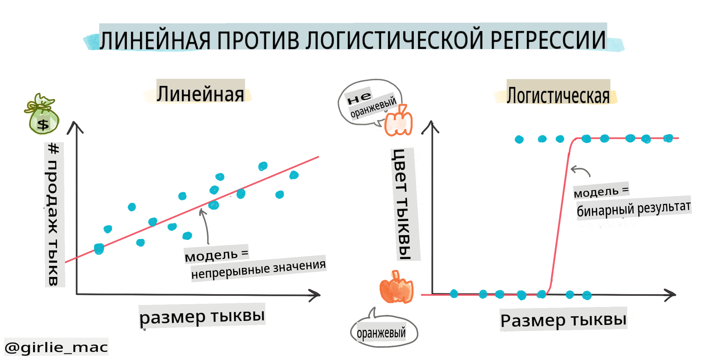
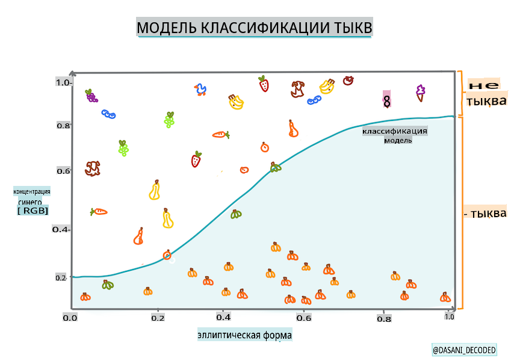
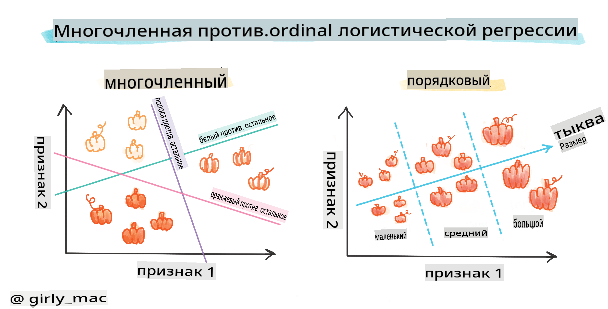
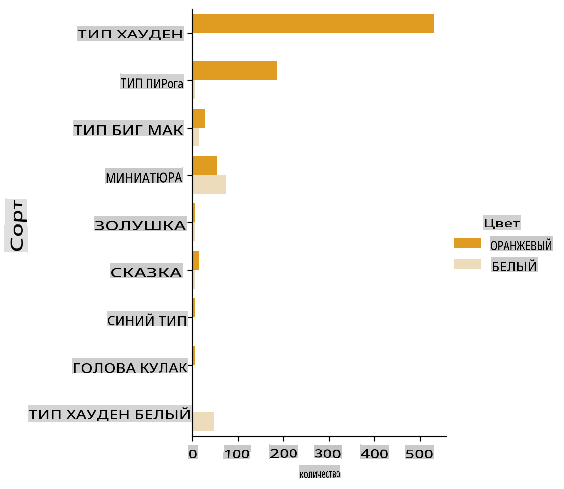
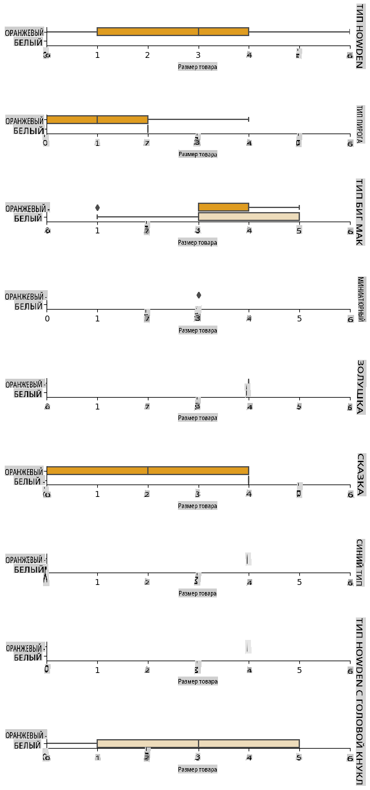
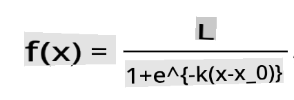

# Логистическая регрессия для предсказания категорий



## [Викторина перед лекцией](https://gray-sand-07a10f403.1.azurestaticapps.net/quiz/15/)

> ### [Этот урок доступен на R!](../../../../2-Regression/4-Logistic/solution/R/lesson_4.html)

## Введение

В этом последнем уроке по регрессии, одной из основных _классических_ методов машинного обучения, мы рассмотрим логистическую регрессию. Вы будете использовать эту технику для обнаружения паттернов, чтобы предсказать бинарные категории. Является ли этот конфетой шоколадом или нет? Является ли это заболевание заразным или нет? Выберет ли этот клиент этот продукт или нет?

В этом уроке вы узнаете:

- Новую библиотеку для визуализации данных
- Техники для логистической регрессии

✅ Углубите свои знания о работе с этим типом регрессии в этом [модуле обучения](https://docs.microsoft.com/learn/modules/train-evaluate-classification-models?WT.mc_id=academic-77952-leestott)

## Предварительные требования

Работая с данными о тыквах, мы уже достаточно с ними знакомы, чтобы понять, что есть одна бинарная категория, с которой мы можем работать: `Color`.

Давайте построим модель логистической регрессии, чтобы предсказать, _какого цвета, скорее всего, будет данная тыква_ (оранжевая 🎃 или белая 👻).

> Почему мы говорим о бинарной классификации в уроке о регрессии? Только для удобства, так как логистическая регрессия на самом деле является [методом классификации](https://scikit-learn.org/stable/modules/linear_model.html#logistic-regression), хотя и основанным на линейных методах. Узнайте о других способах классификации данных в следующей группе уроков.

## Определите вопрос

Для наших целей мы выразим это как бинарное: 'Белая' или 'Не белая'. В нашем наборе данных также есть категория 'полосатая', но случаев с ней мало, поэтому мы не будем ее использовать. Она исчезнет, как только мы удалим нулевые значения из набора данных.

> 🎃 Забавный факт: иногда мы называем белые тыквы 'призрачными' тыквами. Их не очень легко вырезать, поэтому они не так популярны, как оранжевые, но выглядят они круто! Так что мы могли бы также переформулировать наш вопрос как: 'Призрак' или 'Не призрак'. 👻

## О логистической регрессии

Логистическая регрессия отличается от линейной регрессии, о которой вы узнали ранее, несколькими важными способами.

[](https://youtu.be/KpeCT6nEpBY "Машинное обучение для начинающих - Понимание логистической регрессии для классификации машинного обучения")

> 🎥 Нажмите на изображение выше, чтобы посмотреть короткий видеоролик о логистической регрессии.

### Бинарная классификация

Логистическая регрессия не предлагает тех же функций, что и линейная регрессия. Первая предлагает предсказание о бинарной категории ("белая или не белая"), в то время как последняя способна предсказывать непрерывные значения, например, учитывая происхождение тыквы и время сбора урожая, _насколько вырастет ее цена_.


> Инфографика от [Dasani Madipalli](https://twitter.com/dasani_decoded)

### Другие классификации

Существуют и другие типы логистической регрессии, включая многономиальную и порядковую:

- **Многономиальная**, которая включает более одной категории - "Оранжевая, Белая и Полосатая".
- **Порядковая**, которая включает упорядоченные категории, полезные, если мы хотим логически упорядочить наши результаты, как наши тыквы, которые упорядочены по конечному числу размеров (мини, см, мед, лг, хл, ххл).



### Переменные НЕ должны коррелировать

Помните, как линейная регрессия лучше работала с более коррелированными переменными? Логистическая регрессия - это противоположность - переменные не обязательно должны совпадать. Это работает для этих данных, которые имеют довольно слабые корреляции.

### Вам нужно много чистых данных

Логистическая регрессия даст более точные результаты, если вы используете больше данных; наш маленький набор данных не оптимален для этой задачи, так что имейте это в виду.

[](https://youtu.be/B2X4H9vcXTs "Машинное обучение для начинающих - Анализ данных и подготовка для логистической регрессии")

> 🎥 Нажмите на изображение выше, чтобы посмотреть короткий видеоролик о подготовке данных для линейной регрессии.

✅ Подумайте о типах данных, которые хорошо подходят для логистической регрессии.

## Упражнение - очистите данные

Сначала немного очистите данные, удалив нулевые значения и выбрав только некоторые столбцы:

1. Добавьте следующий код:

    ```python
  
    columns_to_select = ['City Name','Package','Variety', 'Origin','Item Size', 'Color']
    pumpkins = full_pumpkins.loc[:, columns_to_select]

    pumpkins.dropna(inplace=True)
    ```

    Вы всегда можете заглянуть в ваш новый датафрейм:

    ```python
    pumpkins.info
    ```

### Визуализация - категориальный график

К этому моменту вы снова загрузили [стартовый блокнот](../../../../2-Regression/4-Logistic/notebook.ipynb) с данными о тыквах и очистили его, чтобы сохранить набор данных, содержащий несколько переменных, включая `Color`. Давайте визуализируем датафрейм в блокноте, используя другую библиотеку: [Seaborn](https://seaborn.pydata.org/index.html), которая построена на Matplotlib, которую мы использовали ранее.

Seaborn предлагает несколько интересных способов визуализировать ваши данные. Например, вы можете сравнить распределения данных для каждой `Variety` и `Color` в категориальном графике.

1. Создайте такой график, используя `catplot` function, using our pumpkin data `pumpkins`, и указав цветовую карту для каждой категории тыквы (оранжевая или белая):

    ```python
    import seaborn as sns
    
    palette = {
    'ORANGE': 'orange',
    'WHITE': 'wheat',
    }

    sns.catplot(
    data=pumpkins, y="Variety", hue="Color", kind="count",
    palette=palette, 
    )
    ```

    

    Наблюдая за данными, вы можете увидеть, как данные о цвете соотносятся с сортом.

    ✅ Учитывая этот категориальный график, какие интересные исследования вы можете представить?

### Предобработка данных: кодирование признаков и меток
Наш набор данных о тыквах содержит строковые значения для всех своих столбцов. Работа с категориальными данными интуитивно понятна для людей, но не для машин. Алгоритмы машинного обучения хорошо работают с числами. Поэтому кодирование - это очень важный шаг на этапе предобработки данных, так как оно позволяет нам преобразовать категориальные данные в числовые, не теряя никакой информации. Хорошее кодирование приводит к созданию хорошей модели.

Для кодирования признаков существует два основных типа кодировщиков:

1. Порядковый кодировщик: он хорошо подходит для порядковых переменных, которые являются категориальными переменными, где их данные следуют логическому порядку, как столбец `Item Size` в нашем наборе данных. Он создает отображение, так что каждая категория представлена числом, которое соответствует порядку категории в столбце.

    ```python
    from sklearn.preprocessing import OrdinalEncoder

    item_size_categories = [['sml', 'med', 'med-lge', 'lge', 'xlge', 'jbo', 'exjbo']]
    ordinal_features = ['Item Size']
    ordinal_encoder = OrdinalEncoder(categories=item_size_categories)
    ```

2. Категориальный кодировщик: он хорошо подходит для номинальных переменных, которые являются категориальными переменными, где их данные не следуют логическому порядку, как все характеристики, отличные от `Item Size` в нашем наборе данных. Это одноразовое кодирование, что означает, что каждая категория представлена бинарным столбцом: закодированная переменная равна 1, если тыква принадлежит этой разновидности, и 0 в противном случае.

    ```python
    from sklearn.preprocessing import OneHotEncoder

    categorical_features = ['City Name', 'Package', 'Variety', 'Origin']
    categorical_encoder = OneHotEncoder(sparse_output=False)
    ```
Затем `ColumnTransformer` используется для объединения нескольких кодировщиков в один шаг и применения их к соответствующим столбцам.

```python
    from sklearn.compose import ColumnTransformer
    
    ct = ColumnTransformer(transformers=[
        ('ord', ordinal_encoder, ordinal_features),
        ('cat', categorical_encoder, categorical_features)
        ])
    
    ct.set_output(transform='pandas')
    encoded_features = ct.fit_transform(pumpkins)
```
С другой стороны, для кодирования метки мы используем класс `LabelEncoder` из scikit-learn, который является утилитным классом для нормализации меток, чтобы они содержали только значения от 0 до n_classes-1 (в данном случае, 0 и 1).

```python
    from sklearn.preprocessing import LabelEncoder

    label_encoder = LabelEncoder()
    encoded_label = label_encoder.fit_transform(pumpkins['Color'])
```
Как только мы закодируем признаки и метку, мы можем объединить их в новый датафрейм `encoded_pumpkins`.

```python
    encoded_pumpkins = encoded_features.assign(Color=encoded_label)
```
✅ Каковы преимущества использования порядкового кодировщика для `Item Size` column?

### Analyse relationships between variables

Now that we have pre-processed our data, we can analyse the relationships between the features and the label to grasp an idea of how well the model will be able to predict the label given the features.
The best way to perform this kind of analysis is plotting the data. We'll be using again the Seaborn `catplot` function, to visualize the relationships between `Item Size`,  `Variety` и `Color` в категориальном графике. Чтобы лучше отобразить данные, мы будем использовать закодированный столбец `Item Size` column and the unencoded `Variety`.

```python
    palette = {
    'ORANGE': 'orange',
    'WHITE': 'wheat',
    }
    pumpkins['Item Size'] = encoded_pumpkins['ord__Item Size']

    g = sns.catplot(
        data=pumpkins,
        x="Item Size", y="Color", row='Variety',
        kind="box", orient="h",
        sharex=False, margin_titles=True,
        height=1.8, aspect=4, palette=palette,
    )
    g.set(xlabel="Item Size", ylabel="").set(xlim=(0,6))
    g.set_titles(row_template="{row_name}")
```


### Используйте график роя

Поскольку Цвет является бинарной категорией (Белый или Не белый), он требует 'специализированного подхода к визуализации'. Есть и другие способы визуализировать взаимосвязь этой категории с другими переменными.

Вы можете визуализировать переменные бок о бок с графиками Seaborn.

1. Попробуйте график 'роя', чтобы показать распределение значений:

    ```python
    palette = {
    0: 'orange',
    1: 'wheat'
    }
    sns.swarmplot(x="Color", y="ord__Item Size", data=encoded_pumpkins, palette=palette)
    ```

    

**Будьте осторожны**: код выше может вызвать предупреждение, поскольку Seaborn не может отобразить такое количество точек данных на графике роя. Возможным решением является уменьшение размера маркера, используя параметр 'size'. Однако имейте в виду, что это влияет на читаемость графика.

> **🧮 Покажите мне математику**
>
> Логистическая регрессия основывается на концепции 'максимального правдоподобия', используя [сигмоидные функции](https://wikipedia.org/wiki/Sigmoid_function). 'Сигмоидная функция' на графике выглядит как 'S'-образная форма. Она принимает значение и отображает его где-то между 0 и 1. Ее кривая также называется 'логистической кривой'. Ее формула выглядит так:
>
> 
>
> где средняя точка сигмоида находится на нулевой отметке x, L - максимальное значение кривой, а k - крутизна кривой. Если результат функции больше 0.5, метка в вопросе будет отнесена к классу '1' бинарного выбора. Если нет, она будет классифицирована как '0'.

## Постройте свою модель

Создание модели для нахождения этих бинарных классификаций удивительно просто в Scikit-learn.

[](https://youtu.be/MmZS2otPrQ8 "Машинное обучение для начинающих - Логистическая регрессия для классификации данных")

> 🎥 Нажмите на изображение выше, чтобы посмотреть короткий видеоролик о создании модели линейной регрессии.

1. Выберите переменные, которые вы хотите использовать в своей модели классификации, и разделите обучающий и тестовый наборы, вызвав `train_test_split()`:

    ```python
    from sklearn.model_selection import train_test_split
    
    X = encoded_pumpkins[encoded_pumpkins.columns.difference(['Color'])]
    y = encoded_pumpkins['Color']

    X_train, X_test, y_train, y_test = train_test_split(X, y, test_size=0.2, random_state=0)
    
    ```

2. Теперь вы можете обучить свою модель, вызвав `fit()` с вашими обучающими данными, и напечатать ее результат:

    ```python
    from sklearn.metrics import f1_score, classification_report 
    from sklearn.linear_model import LogisticRegression

    model = LogisticRegression()
    model.fit(X_train, y_train)
    predictions = model.predict(X_test)

    print(classification_report(y_test, predictions))
    print('Predicted labels: ', predictions)
    print('F1-score: ', f1_score(y_test, predictions))
    ```

    Посмотрите на табло вашей модели. Это неплохо, учитывая, что у вас всего около 1000 строк данных:

    ```output
                       precision    recall  f1-score   support
    
                    0       0.94      0.98      0.96       166
                    1       0.85      0.67      0.75        33
    
        accuracy                                0.92       199
        macro avg           0.89      0.82      0.85       199
        weighted avg        0.92      0.92      0.92       199
    
        Predicted labels:  [0 0 0 0 0 0 0 0 0 0 0 0 0 0 0 0 0 0 0 0 1 0 0 1 0 0 0 0 0 0 0 0 1 0 0 0 0
        0 0 0 0 0 1 0 1 0 0 1 0 0 0 0 0 1 0 1 0 1 0 1 0 0 0 0 0 0 0 0 0 0 0 0 0 0
        1 0 0 0 0 0 0 0 1 0 0 0 0 0 0 0 1 0 0 0 0 0 0 0 0 1 0 1 0 0 0 0 0 0 0 1 0
        0 0 0 0 0 0 0 0 0 0 0 0 0 0 0 0 0 0 0 0 0 1 0 0 0 0 0 0 0 0 1 0 0 0 1 1 0
        0 0 0 0 1 0 0 0 0 0 1 0 0 0 0 0 0 0 0 0 0 0 0 0 0 0 0 0 0 0 0 0 0 0 0 0 1
        0 0 0 1 0 0 0 0 0 0 0 0 1 1]
        F1-score:  0.7457627118644068
    ```

## Лучшее понимание через матрицу путаницы

Хотя вы можете получить отчет о табло [условий](https://scikit-learn.org/stable/modules/generated/sklearn.metrics.classification_report.html?highlight=classification_report#sklearn.metrics.classification_report), распечатав вышеуказанные элементы, вам может быть проще понять вашу модель, используя [матрицу путаницы](https://scikit-learn.org/stable/modules/model_evaluation.html#confusion-matrix), чтобы помочь нам понять, как модель работает.

> 🎓 '[Матрица путаницы](https://wikipedia.org/wiki/Confusion_matrix)' (или 'ошибочная матрица') - это таблица, которая выражает истинные и ложные положительные и отрицательные значения вашей модели, таким образом оценивая точность предсказаний.

1. Чтобы использовать метрики путаницы, вызовите `confusion_matrix()`:

    ```python
    from sklearn.metrics import confusion_matrix
    confusion_matrix(y_test, predictions)
    ```

    Посмотрите на матрицу путаницы вашей модели:

    ```output
    array([[162,   4],
           [ 11,  22]])
    ```

В Scikit-learn строки матриц путаницы (ось 0) - это фактические метки, а столбцы (ось 1) - предсказанные метки.

|       |   0   |   1   |
| :---: | :---: | :---: |
|   0   |  TN   |  FP   |
|   1   |  FN   |  TP   |

Что здесь происходит? Допустим, наша модель должна классифицировать тыквы между двумя бинарными категориями: категория 'белая' и категория 'не белая'.

- Если ваша модель предсказывает тыкву как не белую, и она на самом деле принадлежит категории 'не белая', мы называем это истинно отрицательным значением, которое отображается верхним левым числом.
- Если ваша модель предсказывает тыкву как белую, и она на самом деле принадлежит категории 'не белая', мы называем это ложно отрицательным значением, которое отображается нижним левым числом.
- Если ваша модель предсказывает тыкву как не белую, и она на самом деле принадлежит категории 'белая', мы называем это ложно положительным значением, которое отображается верхним правым числом.
- Если ваша модель предсказывает тыкву как белую, и она на самом деле принадлежит категории 'белая', мы называем это истинно положительным значением, которое отображается нижним правым числом.

Как вы могли догадаться, предпочтительно иметь большее количество истинно положительных и истинно отрицательных значений и меньшее количество ложно положительных и ложно отрицательных значений, что подразумевает, что модель работает лучше.

Как матрица путаницы соотносится с точностью и полнотой? Помните, что отчет о классификации, напечатанный выше, показал точность (0.85) и полноту (0.67).

Точность = tp / (tp + fp) = 22 / (22 + 4) = 0.8461538461538461

Полнота = tp / (tp + fn) = 22 / (22 + 11) = 0.6666666666666666

✅ Вопрос: Как модель справилась, согласно матрице путаницы? Ответ: Неплохо; есть хорошее количество истинно отрицательных значений, но также и несколько ложно отрицательных.

Давайте вернемся к терминам, которые мы видели ранее, с помощью отображения матрицы путаницы TP/TN и FP/FN:

🎓 Точность: TP/(TP + FP) Доля релевантных случаев среди извлеченных случаев (например, какие метки были правильно обозначены)

🎓 Полнота: TP/(TP + FN) Доля релевантных случаев, которые были извлечены, независимо от того, были ли они хорошо обозначены или нет

🎓 f1-оценка: (2 * точность * полнота)/(точность + полнота) Взвешенное среднее значение точности и полноты, где лучше всего 1, а хуже всего 0

🎓 Поддержка: Количество случаев каждой метки, извлеченных

🎓 Точность: (TP + TN)/(TP + TN + FP + FN) Процент меток, предсказанных точно для образца.

🎓 Макро-среднее: Вычисление невзвешенного среднего показателя для каждой метки, не принимая во внимание дисбаланс меток.

🎓 Взвешенное среднее: Вычисление среднего показателя для каждой метки, учитывающее дисбаланс меток, взвешивая их по их поддержке (количеству истинных случаев для каждой метки).

✅ Можете ли вы подумать, какой метрикой следует следить, если вы хотите, чтобы ваша модель уменьшила количество ложно отрицательных значений?

## Визуализируйте ROC-кривую этой модели

[](https://youtu.be/GApO575jTA0 "Машинное обучение для начинающих - Анализ производительности логистической регрессии с помощью ROC-кривых")

> 🎥 Нажмите на изображение выше, чтобы посмотреть короткий видеоролик о ROC-кривых.

Давайте сделаем еще одну визуализацию, чтобы увидеть так называемую 'ROC' крив

**Отказ от ответственности**:  
Этот документ был переведен с использованием услуг машинного перевода на основе ИИ. Хотя мы стремимся к точности, пожалуйста, имейте в виду, что автоматические переводы могут содержать ошибки или неточности. Оригинальный документ на его родном языке следует считать авторитетным источником. Для критически важной информации рекомендуется профессиональный перевод человеком. Мы не несем ответственности за любые недоразумения или неверные толкования, возникающие в результате использования этого перевода.