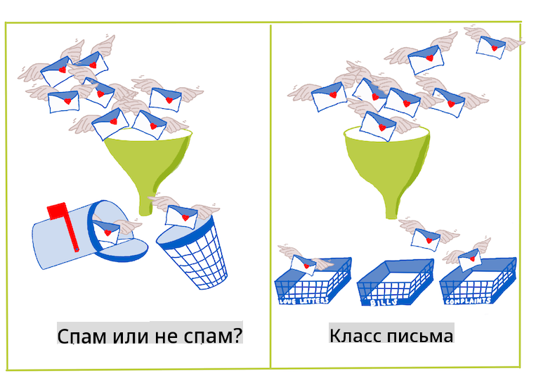
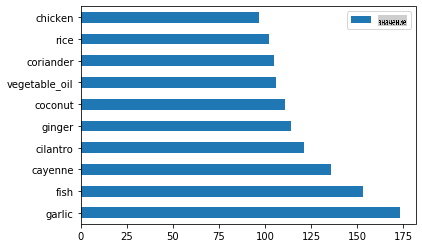
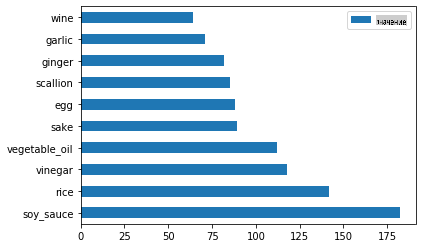
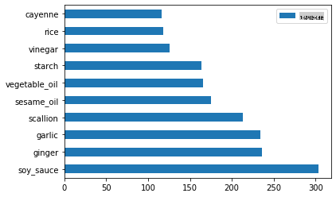
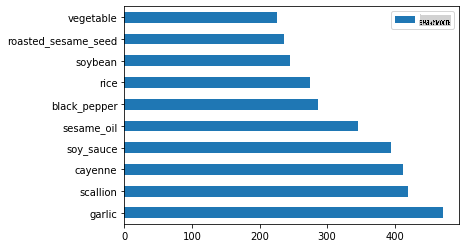

# Введение в классификацию

В этих четырех уроках вы исследуете основное направление классического машинного обучения - _классификацию_. Мы рассмотрим использование различных алгоритмов классификации с набором данных о всех замечательных кухнях Азии и Индии. Надеюсь, вы голодны!


> Празднуйте паназиатские кухни в этих уроках! Изображение от [Jen Looper](https://twitter.com/jenlooper)

Классификация - это форма [обучения с учителем](https://wikipedia.org/wiki/Supervised_learning), которая имеет много общего с регрессионными техниками. Если машинное обучение связано с предсказанием значений или названий вещей с использованием наборов данных, то классификация обычно делится на две группы: _бинарная классификация_ и _многоклассовая классификация_.

[](https://youtu.be/eg8DJYwdMyg "Введение в классификацию")

> 🎥 Нажмите на изображение выше для просмотра видео: Джон Гуттаг из MIT представляет классификацию

Помните:

- **Линейная регрессия** помогла вам предсказать взаимосвязи между переменными и сделать точные прогнозы о том, где новая точка данных будет находиться относительно этой линии. Например, вы могли предсказать, _сколько будет стоить тыква в сентябре по сравнению с декабрем_.
- **Логистическая регрессия** помогла вам открыть "бинарные категории": по этой цене, _является ли эта тыква оранжевой или не оранжевой_?

Классификация использует различные алгоритмы для определения других способов определения метки или класса точки данных. Давайте поработаем с этими данными о кухне, чтобы выяснить, можем ли мы, наблюдая за группой ингредиентов, определить ее кухню происхождения.

## [Предварительный тест](https://gray-sand-07a10f403.1.azurestaticapps.net/quiz/19/)

> ### [Этот урок доступен на R!](../../../../4-Classification/1-Introduction/solution/R/lesson_10.html)

### Введение

Классификация является одной из основных задач исследователя машинного обучения и специалиста по данным. От базовой классификации бинарного значения ("является ли это письмо спамом или нет?") до сложной классификации и сегментации изображений с использованием компьютерного зрения, всегда полезно уметь сортировать данные по классам и задавать им вопросы.

Чтобы выразить процесс более научным языком, ваш метод классификации создает предсказательную модель, которая позволяет вам сопоставить взаимосвязь между входными переменными и выходными переменными.



> Бинарные и многоклассовые задачи для алгоритмов классификации. Инфографика от [Jen Looper](https://twitter.com/jenlooper)

Прежде чем начать процесс очистки наших данных, визуализации и подготовки их для наших задач машинного обучения, давайте немного узнаем о различных способах, которыми машинное обучение может быть использовано для классификации данных.

Производная от [статистики](https://wikipedia.org/wiki/Statistical_classification), классификация с использованием классического машинного обучения использует такие характеристики, как `smoker`, `weight` и `age` для определения _вероятности развития X заболевания_. Как метод обучения с учителем, аналогичный выполненным вами ранее регрессионным упражнениям, ваши данные имеют метки, и алгоритмы машинного обучения используют эти метки для классификации и предсказания классов (или 'характеристик') набора данных и назначения их группе или результату.

✅ Потратьте минутку, чтобы представить набор данных о кухнях. На какие вопросы мог бы ответить многоклассовый модель? На какие вопросы мог бы ответить бинарный модель? Что, если вы хотите определить, вероятно ли, что данная кухня использует пажитник? Что, если вы хотите узнать, сможете ли вы создать типичное индийское блюдо, имея в наличии пакет с полным набором аниса, артишоков, цветной капусты и хрена?

[](https://youtu.be/GuTeDbaNoEU "Сумасшедшие загадочные корзины")

> 🎥 Нажмите на изображение выше для просмотра видео. Основная идея шоу 'Chopped' - это 'загадочная корзина', где повара должны приготовить какое-то блюдо из случайного выбора ингредиентов. Конечно, модель машинного обучения могла бы помочь!

## Привет, 'классификатор'

Вопрос, который мы хотим задать этому набору данных о кухне, на самом деле является **многоклассовым вопросом**, так как у нас есть несколько потенциальных национальных кухонь, с которыми можно работать. Учитывая набор ингредиентов, какой из этих классов подходит для данных?

Scikit-learn предлагает несколько различных алгоритмов для классификации данных, в зависимости от того, какую задачу вы хотите решить. В следующих двух уроках вы узнаете о нескольких из этих алгоритмов.

## Упражнение - очистите и сбалансируйте ваши данные

Первой задачей перед началом этого проекта является очистка и **балансировка** ваших данных для получения лучших результатов. Начните с пустого файла _notebook.ipynb_ в корне этой папки.

Первое, что нужно установить - это [imblearn](https://imbalanced-learn.org/stable/). Это пакет Scikit-learn, который позволит вам лучше сбалансировать данные (вы узнаете больше об этой задаче через минуту).

1. Чтобы установить `imblearn`, выполните `pip install`, вот так:

    ```python
    pip install imblearn
    ```

1. Импортируйте пакеты, которые вам нужны для импорта данных и их визуализации, также импортируйте `SMOTE` из `imblearn`.

    ```python
    import pandas as pd
    import matplotlib.pyplot as plt
    import matplotlib as mpl
    import numpy as np
    from imblearn.over_sampling import SMOTE
    ```

    Теперь вы готовы к следующему этапу - импорту данных.

1. Следующей задачей будет импорт данных:

    ```python
    df  = pd.read_csv('../data/cuisines.csv')
    ```

   Используя `read_csv()` will read the content of the csv file _cusines.csv_ and place it in the variable `df`.

1. Проверьте форму данных:

    ```python
    df.head()
    ```

   Первые пять строк выглядят так:

    ```output
    |     | Unnamed: 0 | cuisine | almond | angelica | anise | anise_seed | apple | apple_brandy | apricot | armagnac | ... | whiskey | white_bread | white_wine | whole_grain_wheat_flour | wine | wood | yam | yeast | yogurt | zucchini |
    | --- | ---------- | ------- | ------ | -------- | ----- | ---------- | ----- | ------------ | ------- | -------- | --- | ------- | ----------- | ---------- | ----------------------- | ---- | ---- | --- | ----- | ------ | -------- |
    | 0   | 65         | indian  | 0      | 0        | 0     | 0          | 0     | 0            | 0       | 0        | ... | 0       | 0           | 0          | 0                       | 0    | 0    | 0   | 0     | 0      | 0        |
    | 1   | 66         | indian  | 1      | 0        | 0     | 0          | 0     | 0            | 0       | 0        | ... | 0       | 0           | 0          | 0                       | 0    | 0    | 0   | 0     | 0      | 0        |
    | 2   | 67         | indian  | 0      | 0        | 0     | 0          | 0     | 0            | 0       | 0        | ... | 0       | 0           | 0          | 0                       | 0    | 0    | 0   | 0     | 0      | 0        |
    | 3   | 68         | indian  | 0      | 0        | 0     | 0          | 0     | 0            | 0       | 0        | ... | 0       | 0           | 0          | 0                       | 0    | 0    | 0   | 0     | 0      | 0        |
    | 4   | 69         | indian  | 0      | 0        | 0     | 0          | 0     | 0            | 0       | 0        | ... | 0       | 0           | 0          | 0                       | 0    | 0    | 0   | 0     | 1      | 0        |
    ```

1. Получите информацию об этих данных, вызвав `info()`:

    ```python
    df.info()
    ```

    Ваш вывод выглядит так:

    ```output
    <class 'pandas.core.frame.DataFrame'>
    RangeIndex: 2448 entries, 0 to 2447
    Columns: 385 entries, Unnamed: 0 to zucchini
    dtypes: int64(384), object(1)
    memory usage: 7.2+ MB
    ```

## Упражнение - изучение кухонь

Теперь работа начинает становиться более интересной. Давайте выясним распределение данных по кухням.

1. Постройте график данных в виде столбиков, вызвав `barh()`:

    ```python
    df.cuisine.value_counts().plot.barh()
    ```

    

    Количество кухонь ограничено, но распределение данных неравномерно. Вы можете это исправить! Прежде чем это сделать, немного исследуйте.

1. Узнайте, сколько данных доступно по каждой кухне, и выведите это на экран:

    ```python
    thai_df = df[(df.cuisine == "thai")]
    japanese_df = df[(df.cuisine == "japanese")]
    chinese_df = df[(df.cuisine == "chinese")]
    indian_df = df[(df.cuisine == "indian")]
    korean_df = df[(df.cuisine == "korean")]
    
    print(f'thai df: {thai_df.shape}')
    print(f'japanese df: {japanese_df.shape}')
    print(f'chinese df: {chinese_df.shape}')
    print(f'indian df: {indian_df.shape}')
    print(f'korean df: {korean_df.shape}')
    ```

    вывод выглядит так:

    ```output
    thai df: (289, 385)
    japanese df: (320, 385)
    chinese df: (442, 385)
    indian df: (598, 385)
    korean df: (799, 385)
    ```

## Изучение ингредиентов

Теперь вы можете углубиться в данные и узнать, какие типичные ингредиенты используются в каждой кухне. Вам следует очистить повторяющиеся данные, которые создают путаницу между кухнями, поэтому давайте разберемся с этой проблемой.

1. Создайте функцию `create_ingredient()` на Python для создания датафрейма ингредиентов. Эта функция начнет с удаления ненужного столбца и отсортирует ингредиенты по их количеству:

    ```python
    def create_ingredient_df(df):
        ingredient_df = df.T.drop(['cuisine','Unnamed: 0']).sum(axis=1).to_frame('value')
        ingredient_df = ingredient_df[(ingredient_df.T != 0).any()]
        ingredient_df = ingredient_df.sort_values(by='value', ascending=False,
        inplace=False)
        return ingredient_df
    ```

   Теперь вы можете использовать эту функцию, чтобы получить представление о десяти самых популярных ингредиентах по кухне.

1. Вызовите `create_ingredient()` and plot it calling `barh()`:

    ```python
    thai_ingredient_df = create_ingredient_df(thai_df)
    thai_ingredient_df.head(10).plot.barh()
    ```

    

1. Сделайте то же самое для японских данных:

    ```python
    japanese_ingredient_df = create_ingredient_df(japanese_df)
    japanese_ingredient_df.head(10).plot.barh()
    ```

    

1. Теперь для китайских ингредиентов:

    ```python
    chinese_ingredient_df = create_ingredient_df(chinese_df)
    chinese_ingredient_df.head(10).plot.barh()
    ```

    

1. Постройте график индийских ингредиентов:

    ```python
    indian_ingredient_df = create_ingredient_df(indian_df)
    indian_ingredient_df.head(10).plot.barh()
    ```

    

1. Наконец, постройте график корейских ингредиентов:

    ```python
    korean_ingredient_df = create_ingredient_df(korean_df)
    korean_ingredient_df.head(10).plot.barh()
    ```

    

1. Теперь удалите самые распространенные ингредиенты, которые создают путаницу между различными кухнями, вызвав `drop()`:

   Все любят рис, чеснок и имбирь!

    ```python
    feature_df= df.drop(['cuisine','Unnamed: 0','rice','garlic','ginger'], axis=1)
    labels_df = df.cuisine #.unique()
    feature_df.head()
    ```

## Балансировка набора данных

Теперь, когда вы очистили данные, используйте [SMOTE](https://imbalanced-learn.org/dev/references/generated/imblearn.over_sampling.SMOTE.html) - "Техника синтетического увеличения выборки для меньшинств" - для их балансировки.

1. Вызовите `fit_resample()`, эта стратегия генерирует новые образцы путем интерполяции.

    ```python
    oversample = SMOTE()
    transformed_feature_df, transformed_label_df = oversample.fit_resample(feature_df, labels_df)
    ```

    Сбалансировав ваши данные, вы получите лучшие результаты при их классификации. Подумайте о бинарной классификации. Если большинство ваших данных принадлежит одному классу, модель машинного обучения будет чаще предсказывать этот класс, просто потому, что для него больше данных. Балансировка данных помогает устранить этот дисбаланс.

1. Теперь вы можете проверить количество меток по ингредиентам:

    ```python
    print(f'new label count: {transformed_label_df.value_counts()}')
    print(f'old label count: {df.cuisine.value_counts()}')
    ```

    Ваш вывод выглядит так:

    ```output
    new label count: korean      799
    chinese     799
    indian      799
    japanese    799
    thai        799
    Name: cuisine, dtype: int64
    old label count: korean      799
    indian      598
    chinese     442
    japanese    320
    thai        289
    Name: cuisine, dtype: int64
    ```

    Данные аккуратные и чистые, сбалансированные и очень вкусные!

1. Последний шаг - сохранить ваши сбалансированные данные, включая метки и характеристики, в новый датафрейм, который можно экспортировать в файл:

    ```python
    transformed_df = pd.concat([transformed_label_df,transformed_feature_df],axis=1, join='outer')
    ```

1. Вы можете еще раз взглянуть на данные, используя `transformed_df.head()` and `transformed_df.info()`. Сохраните копию этих данных для использования в будущих уроках:

    ```python
    transformed_df.head()
    transformed_df.info()
    transformed_df.to_csv("../data/cleaned_cuisines.csv")
    ```

    Этот свежий CSV теперь можно найти в корневой папке данных.

---

## 🚀Задача

Этот курс содержит несколько интересных наборов данных. Просмотрите папки `data` и посмотрите, есть ли среди них наборы данных, которые подойдут для бинарной или многоклассовой классификации? Какие вопросы вы бы задали этому набору данных?

## [Пост-лекционный тест](https://gray-sand-07a10f403.1.azurestaticapps.net/quiz/20/)

## Обзор и самостоятельное изучение

Изучите API SMOTE. Для каких случаев его лучше всего использовать? Какие проблемы он решает?

## Задание 

[Изучите методы классификации](assignment.md)

**Отказ от ответственности**:  
Этот документ был переведен с использованием услуг машинного перевода на основе ИИ. Хотя мы стремимся к точности, имейте в виду, что автоматические переводы могут содержать ошибки или неточности. Оригинальный документ на его родном языке следует считать авторитетным источником. Для критически важной информации рекомендуется профессиональный человеческий перевод. Мы не несем ответственности за любые недоразумения или неправильные интерпретации, возникающие в результате использования этого перевода.