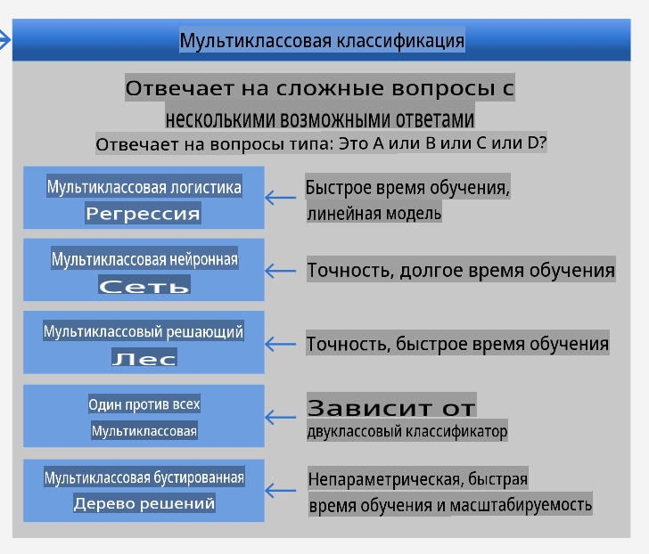
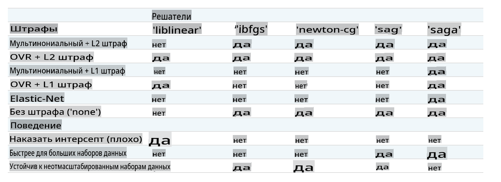

# Классификаторы кухонь 1

На этом уроке вы будете использовать набор данных, который вы сохранили с последнего урока, заполненный сбалансированными, чистыми данными о кухнях.

Вы будете использовать этот набор данных с различными классификаторами, чтобы _предсказать определенную национальную кухню на основе группы ингредиентов_. В процессе вы узнаете больше о том, как алгоритмы могут быть использованы для задач классификации.

## [Викторина перед лекцией](https://gray-sand-07a10f403.1.azurestaticapps.net/quiz/21/)
# Подготовка

Предполагая, что вы завершили [Урок 1](../1-Introduction/README.md), убедитесь, что файл _cleaned_cuisines.csv_ существует в корневом `/data` каталоге для этих четырех уроков.

## Упражнение - предсказать национальную кухню

1. Работая в папке _notebook.ipynb_ этого урока, импортируйте этот файл вместе с библиотекой Pandas:

    ```python
    import pandas as pd
    cuisines_df = pd.read_csv("../data/cleaned_cuisines.csv")
    cuisines_df.head()
    ```

    Данные выглядят так:

|     | Unnamed: 0 | cuisine | almond | angelica | anise | anise_seed | apple | apple_brandy | apricot | armagnac | ... | whiskey | white_bread | white_wine | whole_grain_wheat_flour | wine | wood | yam | yeast | yogurt | zucchini |
| --- | ---------- | ------- | ------ | -------- | ----- | ---------- | ----- | ------------ | ------- | -------- | --- | ------- | ----------- | ---------- | ----------------------- | ---- | ---- | --- | ----- | ------ | -------- |
| 0   | 0          | indian  | 0      | 0        | 0     | 0          | 0     | 0            | 0       | 0        | ... | 0       | 0           | 0          | 0                       | 0    | 0    | 0   | 0     | 0      | 0        |
| 1   | 1          | indian  | 1      | 0        | 0     | 0          | 0     | 0            | 0       | 0        | ... | 0       | 0           | 0          | 0                       | 0    | 0    | 0   | 0     | 0      | 0        |
| 2   | 2          | indian  | 0      | 0        | 0     | 0          | 0     | 0            | 0       | 0        | ... | 0       | 0           | 0          | 0                       | 0    | 0    | 0   | 0     | 0      | 0        |
| 3   | 3          | indian  | 0      | 0        | 0     | 0          | 0     | 0            | 0       | 0        | ... | 0       | 0           | 0          | 0                       | 0    | 0    | 0   | 0     | 0      | 0        |
| 4   | 4          | indian  | 0      | 0        | 0     | 0          | 0     | 0            | 0       | 0        | ... | 0       | 0           | 0          | 0                       | 0    | 0    | 0   | 0     | 1      | 0        |
  

1. Теперь импортируйте несколько дополнительных библиотек:

    ```python
    from sklearn.linear_model import LogisticRegression
    from sklearn.model_selection import train_test_split, cross_val_score
    from sklearn.metrics import accuracy_score,precision_score,confusion_matrix,classification_report, precision_recall_curve
    from sklearn.svm import SVC
    import numpy as np
    ```

1. Разделите координаты X и y на два датафрейма для обучения. `cuisine` может быть датафреймом меток:

    ```python
    cuisines_label_df = cuisines_df['cuisine']
    cuisines_label_df.head()
    ```

    Это будет выглядеть так:

    ```output
    0    indian
    1    indian
    2    indian
    3    indian
    4    indian
    Name: cuisine, dtype: object
    ```

1. Удалите `Unnamed: 0` column and the `cuisine` column, calling `drop()`. Сохраните остальные данные как обучаемые признаки:

    ```python
    cuisines_feature_df = cuisines_df.drop(['Unnamed: 0', 'cuisine'], axis=1)
    cuisines_feature_df.head()
    ```

    Ваши признаки выглядят так:

|      | almond | angelica | anise | anise_seed | apple | apple_brandy | apricot | armagnac | artemisia | artichoke |  ... | whiskey | white_bread | white_wine | whole_grain_wheat_flour | wine | wood |  yam | yeast | yogurt | zucchini |
| ---: | -----: | -------: | ----: | ---------: | ----: | -----------: | ------: | -------: | --------: | --------: | ---: | ------: | ----------: | ---------: | ----------------------: | ---: | ---: | ---: | ----: | -----: | -------: |
|    0 |      0 |        0 |     0 |          0 |     0 |            0 |       0 |        0 |         0 |         0 |  ... |       0 |           0 |          0 |                       0 |    0 |    0 |    0 |     0 |      0 |        0 | 0 |
|    1 |      1 |        0 |     0 |          0 |     0 |            0 |       0 |        0 |         0 |         0 |  ... |       0 |           0 |          0 |                       0 |    0 |    0 |    0 |     0 |      0 |        0 | 0 |
|    2 |      0 |        0 |     0 |          0 |     0 |            0 |       0 |        0 |         0 |         0 |  ... |       0 |           0 |          0 |                       0 |    0 |    0 |    0 |     0 |      0 |        0 | 0 |
|    3 |      0 |        0 |     0 |          0 |     0 |            0 |       0 |        0 |         0 |         0 |  ... |       0 |           0 |          0 |                       0 |    0 |    0 |    0 |     0 |      0 |        0 | 0 |
|    4 |      0 |        0 |     0 |          0 |     0 |            0 |       0 |        0 |         0 |         0 |  ... |       0 |           0 |          0 |                       0 |    0 |    0 |    0 |     0 |      1 |        0 | 0 |

Теперь вы готовы обучить свою модель!

## Выбор классификатора

Теперь, когда ваши данные чисты и готовы к обучению, вам нужно решить, какой алгоритм использовать для этой задачи.

Scikit-learn группирует классификацию в рамках Обучения с учителем, и в этой категории вы найдете множество способов классификации. [Разнообразие](https://scikit-learn.org/stable/supervised_learning.html) может показаться довольно запутанным с первого взгляда. Следующие методы включают в себя классификационные техники:

- Линейные модели
- Метод опорных векторов
- Стохастический градиентный спуск
- Ближайшие соседи
- Гауссовские процессы
- Деревья решений
- Ансамблевые методы (классификатор голосования)
- Алгоритмы для многоклассовой и многовыходной классификации (многоклассовая и многометочная классификация, многоклассовая многовыходная классификация)

> Вы также можете использовать [нейронные сети для классификации данных](https://scikit-learn.org/stable/modules/neural_networks_supervised.html#classification), но это выходит за рамки данного урока.

### Какой классификатор выбрать?

Итак, какой классификатор вам следует выбрать? Часто полезно протестировать несколько и искать хороший результат. Scikit-learn предлагает [сравнение бок о бок](https://scikit-learn.org/stable/auto_examples/classification/plot_classifier_comparison.html) на созданном наборе данных, сравнивая KNeighbors, SVC двумя способами, GaussianProcessClassifier, DecisionTreeClassifier, RandomForestClassifier, MLPClassifier, AdaBoostClassifier, GaussianNB и QuadraticDiscriminantAnalysis, показывая результаты в визуализированном виде:


> Графики, созданные в документации Scikit-learn

> AutoML аккуратно решает эту проблему, проводя эти сравнения в облаке, позволяя вам выбрать лучший алгоритм для ваших данных. Попробуйте это [здесь](https://docs.microsoft.com/learn/modules/automate-model-selection-with-azure-automl/?WT.mc_id=academic-77952-leestott)

### Лучший подход

Однако лучший способ, чем просто угадывать, - это следовать идеям на этом загружаемом [ML Cheat sheet](https://docs.microsoft.com/azure/machine-learning/algorithm-cheat-sheet?WT.mc_id=academic-77952-leestott). Здесь мы обнаруживаем, что для нашей многоклассовой задачи у нас есть несколько вариантов:


> Раздел Чек-листа алгоритмов Microsoft, описывающий варианты многоклассовой классификации

✅ Скачайте этот чек-лист, распечатайте его и повесьте на стену!

### Рассуждения

Давайте посмотрим, сможем ли мы рассуждать о различных подходах, учитывая имеющиеся ограничения:

- **Нейронные сети слишком громоздки**. Учитывая наш чистый, но минимальный набор данных и то, что мы проводим обучение локально через ноутбуки, нейронные сети слишком тяжелы для этой задачи.
- **Нет двухклассового классификатора**. Мы не используем двухклассовый классификатор, поэтому это исключает один-против-всех.
- **Дерево решений или логистическая регрессия могут сработать**. Дерево решений может сработать, или логистическая регрессия для многоклассовых данных.
- **Многоклассовые усиленные деревья решений решают другую задачу**. Многоклассовое усиленное дерево решений наиболее подходит для непараметрических задач, например, задач, предназначенных для построения рейтингов, поэтому это не полезно для нас.

### Использование Scikit-learn 

Мы будем использовать Scikit-learn для анализа наших данных. Однако существует множество способов использовать логистическую регрессию в Scikit-learn. Ознакомьтесь с [параметрами для передачи](https://scikit-learn.org/stable/modules/generated/sklearn.linear_model.LogisticRegression.html?highlight=logistic%20regressio#sklearn.linear_model.LogisticRegression).  

В сущности, есть два важных параметра - `multi_class` and `solver` - that we need to specify, when we ask Scikit-learn to perform a logistic regression. The `multi_class` value applies a certain behavior. The value of the solver is what algorithm to use. Not all solvers can be paired with all `multi_class` values.

According to the docs, in the multiclass case, the training algorithm:

- **Uses the one-vs-rest (OvR) scheme**, if the `multi_class` option is set to `ovr`
- **Uses the cross-entropy loss**, if the `multi_class` option is set to `multinomial`. (Currently the `multinomial` option is supported only by the ‘lbfgs’, ‘sag’, ‘saga’ and ‘newton-cg’ solvers.)"

> 🎓 The 'scheme' here can either be 'ovr' (one-vs-rest) or 'multinomial'. Since logistic regression is really designed to support binary classification, these schemes allow it to better handle multiclass classification tasks. [source](https://machinelearningmastery.com/one-vs-rest-and-one-vs-one-for-multi-class-classification/)

> 🎓 The 'solver' is defined as "the algorithm to use in the optimization problem". [source](https://scikit-learn.org/stable/modules/generated/sklearn.linear_model.LogisticRegression.html?highlight=logistic%20regressio#sklearn.linear_model.LogisticRegression).

Scikit-learn offers this table to explain how solvers handle different challenges presented by different kinds of data structures:



## Exercise - split the data

We can focus on logistic regression for our first training trial since you recently learned about the latter in a previous lesson.
Split your data into training and testing groups by calling `train_test_split()`:

```python
X_train, X_test, y_train, y_test = train_test_split(cuisines_feature_df, cuisines_label_df, test_size=0.3)
```

## Упражнение - применить логистическую регрессию

Поскольку вы используете многоклассовый случай, вам нужно выбрать, какую _схему_ использовать и какой _решатель_ установить. Используйте LogisticRegression с многоклассовой настройкой и решателем **liblinear** для обучения.

1. Создайте логистическую регрессию с multi_class, установленным на `ovr` and the solver set to `liblinear`:

    ```python
    lr = LogisticRegression(multi_class='ovr',solver='liblinear')
    model = lr.fit(X_train, np.ravel(y_train))
    
    accuracy = model.score(X_test, y_test)
    print ("Accuracy is {}".format(accuracy))
    ```

    ✅ Попробуйте другой решатель, такой как `lbfgs`, which is often set as default

    > Note, use Pandas [`ravel`](https://pandas.pydata.org/pandas-docs/stable/reference/api/pandas.Series.ravel.html) функцию, чтобы при необходимости развернуть ваши данные.

    Точность хороша и составляет более **80%**!

1. Вы можете увидеть эту модель в действии, протестировав одну строку данных (#50):

    ```python
    print(f'ingredients: {X_test.iloc[50][X_test.iloc[50]!=0].keys()}')
    print(f'cuisine: {y_test.iloc[50]}')
    ```

    Результат выводится:

   ```output
   ingredients: Index(['cilantro', 'onion', 'pea', 'potato', 'tomato', 'vegetable_oil'], dtype='object')
   cuisine: indian
   ```

   ✅ Попробуйте другой номер строки и проверьте результаты

1. Углубившись, вы можете проверить точность этого предсказания:

    ```python
    test= X_test.iloc[50].values.reshape(-1, 1).T
    proba = model.predict_proba(test)
    classes = model.classes_
    resultdf = pd.DataFrame(data=proba, columns=classes)
    
    topPrediction = resultdf.T.sort_values(by=[0], ascending = [False])
    topPrediction.head()
    ```

    Результат выводится - индийская кухня является его лучшим предположением с хорошей вероятностью:

    |          |        0 |
    | -------: | -------: |
    |   indian | 0.715851 |
    |  chinese | 0.229475 |
    | japanese | 0.029763 |
    |   korean | 0.017277 |
    |     thai | 0.007634 |

    ✅ Можете объяснить, почему модель уверена, что это индийская кухня?

1. Получите больше информации, распечатав отчет о классификации, как вы делали на уроках регрессии:

    ```python
    y_pred = model.predict(X_test)
    print(classification_report(y_test,y_pred))
    ```

    |              | precision | recall | f1-score | support |
    | ------------ | --------- | ------ | -------- | ------- |
    | chinese      | 0.73      | 0.71   | 0.72     | 229     |
    | indian       | 0.91      | 0.93   | 0.92     | 254     |
    | japanese     | 0.70      | 0.75   | 0.72     | 220     |
    | korean       | 0.86      | 0.76   | 0.81     | 242     |
    | thai         | 0.79      | 0.85   | 0.82     | 254     |
    | accuracy     | 0.80      | 1199   |          |         |
    | macro avg    | 0.80      | 0.80   | 0.80     | 1199    |
    | weighted avg | 0.80      | 0.80   | 0.80     | 1199    |

## 🚀Задание

На этом уроке вы использовали свои очищенные данные для создания модели машинного обучения, которая может предсказать национальную кухню на основе серии ингредиентов. Найдите время, чтобы ознакомиться с множеством вариантов, которые Scikit-learn предоставляет для классификации данных. Углубитесь в концепцию 'решателя', чтобы понять, что происходит за кулисами.

## [Викторина после лекции](https://gray-sand-07a10f403.1.azurestaticapps.net/quiz/22/)

## Обзор и самостоятельное изучение

Углубитесь немного больше в математику логистической регрессии в [этом уроке](https://people.eecs.berkeley.edu/~russell/classes/cs194/f11/lectures/CS194%20Fall%202011%20Lecture%2006.pdf)
## Задание 

[Изучите решатели](assignment.md)

**Отказ от ответственности**:  
Этот документ был переведен с использованием услуг машинного перевода на основе ИИ. Хотя мы стремимся к точности, пожалуйста, имейте в виду, что автоматические переводы могут содержать ошибки или неточности. Оригинальный документ на родном языке следует считать авторитетным источником. Для критически важной информации рекомендуется профессиональный человеческий перевод. Мы не несем ответственности за любые недоразумения или неверные толкования, возникающие в результате использования этого перевода.