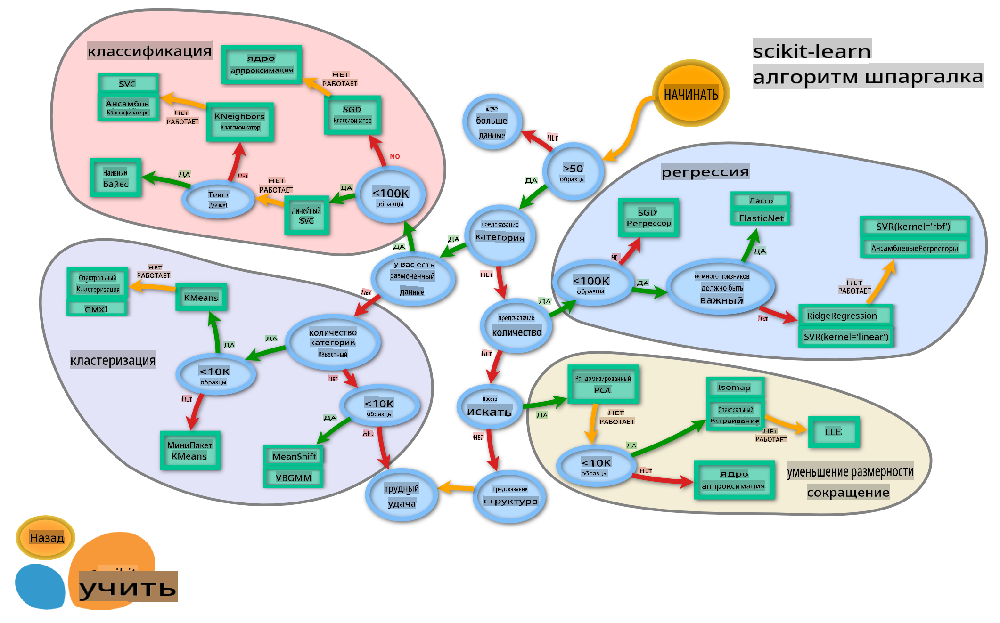

# Классификаторы кухни 2

На этом втором уроке классификации вы изучите больше способов классификации числовых данных. Вы также узнаете о последствиях выбора одного классификатора вместо другого.

## [Предварительный тест](https://gray-sand-07a10f403.1.azurestaticapps.net/quiz/23/)

### Предварительные требования

Мы предполагаем, что вы завершили предыдущие уроки и у вас есть очищенный набор данных в папке `data`, названный _cleaned_cuisines.csv_ в корне этой папки из 4 уроков.

### Подготовка

Мы загрузили ваш файл _notebook.ipynb_ с очищенным набором данных и разделили его на датафреймы X и y, готовые к процессу построения модели.

## Карта классификации

Ранее вы узнали о различных вариантах, которые у вас есть при классификации данных, используя шпаргалку от Microsoft. Scikit-learn предлагает аналогичную, но более детализированную шпаргалку, которая может помочь вам уточнить ваши оценщики (другое название для классификаторов):


> Совет: [посетите эту карту онлайн](https://scikit-learn.org/stable/tutorial/machine_learning_map/) и щелкайте по пути, чтобы прочитать документацию.

### План

Эта карта очень полезна, когда у вас есть четкое представление о ваших данных, так как вы можете «идти» по ее путям к решению:

- У нас >50 образцов
- Мы хотим предсказать категорию
- У нас есть размеченные данные
- У нас менее 100K образцов
- ✨ Мы можем выбрать Линейный SVC
- Если это не сработает, поскольку у нас числовые данные
    - Мы можем попробовать ✨ KNeighbors Classifier 
      - Если это не сработает, попробуйте ✨ SVC и ✨ Ensemble Classifiers

Это очень полезный маршрут для следования.

## Упражнение - разделите данные

Следуя этому пути, мы должны начать с импорта некоторых библиотек для использования.

1. Импортируйте необходимые библиотеки:

    ```python
    from sklearn.neighbors import KNeighborsClassifier
    from sklearn.linear_model import LogisticRegression
    from sklearn.svm import SVC
    from sklearn.ensemble import RandomForestClassifier, AdaBoostClassifier
    from sklearn.model_selection import train_test_split, cross_val_score
    from sklearn.metrics import accuracy_score,precision_score,confusion_matrix,classification_report, precision_recall_curve
    import numpy as np
    ```

2. Разделите свои обучающие и тестовые данные:

    ```python
    X_train, X_test, y_train, y_test = train_test_split(cuisines_feature_df, cuisines_label_df, test_size=0.3)
    ```

## Классификатор линейного SVC

Кластеризация на основе опорных векторов (SVC) является частью семейства методов машинного обучения на основе опорных векторов (узнайте больше об этих методах ниже). В этом методе вы можете выбрать «ядро», чтобы решить, как кластеризовать метки. Параметр «C» относится к «регуляризации», которая регулирует влияние параметров. Ядро может быть одним из [нескольких](https://scikit-learn.org/stable/modules/generated/sklearn.svm.SVC.html#sklearn.svm.SVC); здесь мы устанавливаем его на «линейное», чтобы убедиться, что мы используем линейный SVC. Вероятность по умолчанию равна «ложь»; здесь мы устанавливаем ее на «истина», чтобы собрать оценки вероятности. Мы устанавливаем случайное состояние на «0», чтобы перемешать данные и получить вероятности.

### Упражнение - примените линейный SVC

Начните с создания массива классификаторов. Вы будете постепенно добавлять в этот массив по мере тестирования. 

1. Начните с линейного SVC:

    ```python
    C = 10
    # Create different classifiers.
    classifiers = {
        'Linear SVC': SVC(kernel='linear', C=C, probability=True,random_state=0)
    }
    ```

2. Обучите свою модель, используя линейный SVC, и распечатайте отчет:

    ```python
    n_classifiers = len(classifiers)
    
    for index, (name, classifier) in enumerate(classifiers.items()):
        classifier.fit(X_train, np.ravel(y_train))
    
        y_pred = classifier.predict(X_test)
        accuracy = accuracy_score(y_test, y_pred)
        print("Accuracy (train) for %s: %0.1f%% " % (name, accuracy * 100))
        print(classification_report(y_test,y_pred))
    ```

    Результат довольно хорош:

    ```output
    Accuracy (train) for Linear SVC: 78.6% 
                  precision    recall  f1-score   support
    
         chinese       0.71      0.67      0.69       242
          indian       0.88      0.86      0.87       234
        japanese       0.79      0.74      0.76       254
          korean       0.85      0.81      0.83       242
            thai       0.71      0.86      0.78       227
    
        accuracy                           0.79      1199
       macro avg       0.79      0.79      0.79      1199
    weighted avg       0.79      0.79      0.79      1199
    ```

## Классификатор K-соседей

K-соседи являются частью семейства методов машинного обучения «соседей», которые могут использоваться как для контролируемого, так и для неконтролируемого обучения. В этом методе создается предопределенное количество точек, и данные собираются вокруг этих точек таким образом, чтобы можно было предсказать обобщенные метки для данных.

### Упражнение - примените классификатор K-соседей

Предыдущий классификатор был хорош и хорошо работал с данными, но, возможно, мы можем добиться большей точности. Попробуйте классификатор K-соседей.

1. Добавьте строку в свой массив классификаторов (добавьте запятую после элемента линейного SVC):

    ```python
    'KNN classifier': KNeighborsClassifier(C),
    ```

    Результат немного хуже:

    ```output
    Accuracy (train) for KNN classifier: 73.8% 
                  precision    recall  f1-score   support
    
         chinese       0.64      0.67      0.66       242
          indian       0.86      0.78      0.82       234
        japanese       0.66      0.83      0.74       254
          korean       0.94      0.58      0.72       242
            thai       0.71      0.82      0.76       227
    
        accuracy                           0.74      1199
       macro avg       0.76      0.74      0.74      1199
    weighted avg       0.76      0.74      0.74      1199
    ```

    ✅ Узнайте о [K-соседях](https://scikit-learn.org/stable/modules/neighbors.html#neighbors)

## Классификатор опорных векторов

Классификаторы опорных векторов являются частью семейства [методов опорных векторов](https://wikipedia.org/wiki/Support-vector_machine) машинного обучения, которые используются для задач классификации и регрессии. SVM «отображают обучающие примеры в точки в пространстве», чтобы максимизировать расстояние между двумя категориями. Последующие данные отображаются в это пространство, чтобы можно было предсказать их категорию.

### Упражнение - примените классификатор опорных векторов

Давайте попробуем добиться немного большей точности с помощью классификатора опорных векторов.

1. Добавьте запятую после элемента K-соседей, а затем добавьте эту строку:

    ```python
    'SVC': SVC(),
    ```

    Результат довольно хорош!

    ```output
    Accuracy (train) for SVC: 83.2% 
                  precision    recall  f1-score   support
    
         chinese       0.79      0.74      0.76       242
          indian       0.88      0.90      0.89       234
        japanese       0.87      0.81      0.84       254
          korean       0.91      0.82      0.86       242
            thai       0.74      0.90      0.81       227
    
        accuracy                           0.83      1199
       macro avg       0.84      0.83      0.83      1199
    weighted avg       0.84      0.83      0.83      1199
    ```

    ✅ Узнайте о [опорных векторах](https://scikit-learn.org/stable/modules/svm.html#svm)

## Ансамблевые классификаторы

Давайте следовать пути до самого конца, даже если предыдущий тест был довольно хорош. Попробуем некоторые «ансамблевые классификаторы», в частности Random Forest и AdaBoost:

```python
  'RFST': RandomForestClassifier(n_estimators=100),
  'ADA': AdaBoostClassifier(n_estimators=100)
```

Результат очень хорош, особенно для Random Forest:

```output
Accuracy (train) for RFST: 84.5% 
              precision    recall  f1-score   support

     chinese       0.80      0.77      0.78       242
      indian       0.89      0.92      0.90       234
    japanese       0.86      0.84      0.85       254
      korean       0.88      0.83      0.85       242
        thai       0.80      0.87      0.83       227

    accuracy                           0.84      1199
   macro avg       0.85      0.85      0.84      1199
weighted avg       0.85      0.84      0.84      1199

Accuracy (train) for ADA: 72.4% 
              precision    recall  f1-score   support

     chinese       0.64      0.49      0.56       242
      indian       0.91      0.83      0.87       234
    japanese       0.68      0.69      0.69       254
      korean       0.73      0.79      0.76       242
        thai       0.67      0.83      0.74       227

    accuracy                           0.72      1199
   macro avg       0.73      0.73      0.72      1199
weighted avg       0.73      0.72      0.72      1199
```

✅ Узнайте о [ансамблевых классификаторах](https://scikit-learn.org/stable/modules/ensemble.html)

Этот метод машинного обучения «объединяет прогнозы нескольких базовых оценщиков», чтобы улучшить качество модели. В нашем примере мы использовали случайные деревья и AdaBoost.

- [Случайный лес](https://scikit-learn.org/stable/modules/ensemble.html#forest), метод усреднения, строит «лес» из «деревьев решений», infused with randomness, чтобы избежать переобучения. Параметр n_estimators устанавливается на количество деревьев.

- [AdaBoost](https://scikit-learn.org/stable/modules/generated/sklearn.ensemble.AdaBoostClassifier.html) подгоняет классификатор к набору данных, а затем подгоняет копии этого классификатора к тому же набору данных. Он сосредоточен на весах неправильно классифицированных элементов и корректирует подгонку для следующего классификатора.

---

## 🚀Задача

Каждый из этих методов имеет множество параметров, которые вы можете настраивать. Изучите параметры по умолчанию для каждого из них и подумайте о том, что означает изменение этих параметров для качества модели.

## [Посттест](https://gray-sand-07a10f403.1.azurestaticapps.net/quiz/24/)

## Обзор и самообучение

В этих уроках много специализированной терминологии, поэтому уделите минуту, чтобы ознакомиться с [этим списком](https://docs.microsoft.com/dotnet/machine-learning/resources/glossary?WT.mc_id=academic-77952-leestott) полезных терминов!

## Задание 

[Игра с параметрами](assignment.md)

**Отказ от ответственности**:  
Этот документ был переведен с использованием услуг машинного перевода на основе ИИ. Хотя мы стремимся к точности, пожалуйста, имейте в виду, что автоматические переводы могут содержать ошибки или неточности. Оригинальный документ на его родном языке следует считать авторитетным источником. Для критически важной информации рекомендуется профессиональный перевод, выполненный человеком. Мы не несем ответственности за любые недопонимания или неправильные толкования, возникающие в результате использования этого перевода.