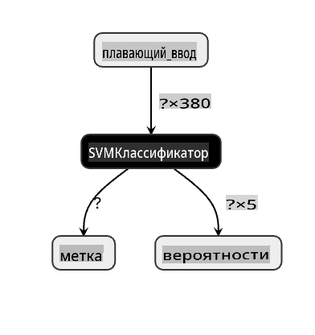
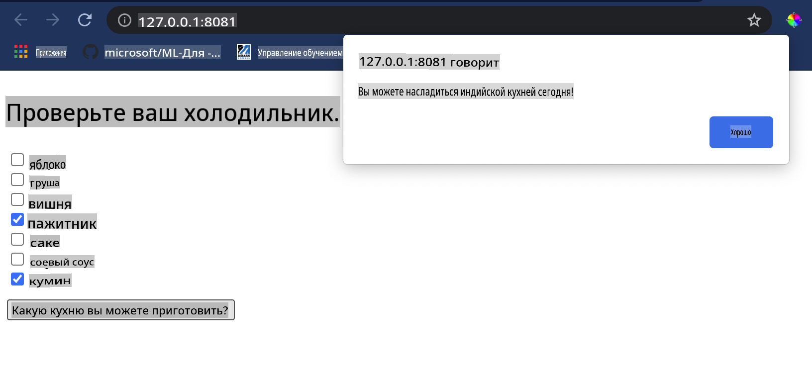

# Создание веб-приложения для рекомендации кухни

В этом уроке вы создадите классификационную модель, используя некоторые из техник, которые вы изучили на предыдущих уроках, и с помощью вкусного набора данных о кухне, используемого на протяжении всей этой серии. Кроме того, вы создадите небольшое веб-приложение для использования сохраненной модели, используя веб-исполнение Onnx.

Одно из самых полезных практических применений машинного обучения — это создание систем рекомендаций, и сегодня вы можете сделать первый шаг в этом направлении!

[](https://youtu.be/17wdM9AHMfg "Прикладное ML")

> 🎥 Нажмите на изображение выше для просмотра видео: Джен Лупер создает веб-приложение, используя классифицированные данные о кухне

## [Тест перед лекцией](https://gray-sand-07a10f403.1.azurestaticapps.net/quiz/25/)

В этом уроке вы узнаете:

- Как построить модель и сохранить ее в формате Onnx
- Как использовать Netron для инспекции модели
- Как использовать вашу модель в веб-приложении для вывода

## Постройте свою модель

Создание прикладных ML-систем является важной частью использования этих технологий для ваших бизнес-систем. Вы можете использовать модели в ваших веб-приложениях (и, таким образом, использовать их в оффлайн-контексте, если это необходимо), используя Onnx.

В [предыдущем уроке](../../3-Web-App/1-Web-App/README.md) вы создали модель регрессии о наблюдениях НЛО, "засолили" ее и использовали в приложении Flask. Хотя эта архитектура очень полезна для понимания, это полностековое Python-приложение, и ваши требования могут включать использование JavaScript-приложения.

В этом уроке вы можете создать базовую систему на основе JavaScript для вывода. Однако сначала вам нужно обучить модель и конвертировать ее для использования с Onnx.

## Упражнение - обучите классификационную модель

Сначала обучите классификационную модель, используя очищенный набор данных о кухнях, который мы использовали.

1. Начните с импорта полезных библиотек:

    ```python
    !pip install skl2onnx
    import pandas as pd 
    ```

    Вам нужен '[skl2onnx](https://onnx.ai/sklearn-onnx/)', чтобы помочь конвертировать вашу модель Scikit-learn в формат Onnx.

1. Затем работайте с вашими данными так же, как вы делали это в предыдущих уроках, прочитав CSV-файл с помощью `read_csv()`:

    ```python
    data = pd.read_csv('../data/cleaned_cuisines.csv')
    data.head()
    ```

1. Удалите первые два ненужных столбца и сохраните оставшиеся данные как 'X':

    ```python
    X = data.iloc[:,2:]
    X.head()
    ```

1. Сохраните метки как 'y':

    ```python
    y = data[['cuisine']]
    y.head()
    
    ```

### Начните рутинное обучение

Мы будем использовать библиотеку 'SVC', которая имеет хорошую точность.

1. Импортируйте соответствующие библиотеки из Scikit-learn:

    ```python
    from sklearn.model_selection import train_test_split
    from sklearn.svm import SVC
    from sklearn.model_selection import cross_val_score
    from sklearn.metrics import accuracy_score,precision_score,confusion_matrix,classification_report
    ```

1. Разделите обучающие и тестовые наборы:

    ```python
    X_train, X_test, y_train, y_test = train_test_split(X,y,test_size=0.3)
    ```

1. Постройте классификационную модель SVC так, как вы делали это в предыдущем уроке:

    ```python
    model = SVC(kernel='linear', C=10, probability=True,random_state=0)
    model.fit(X_train,y_train.values.ravel())
    ```

1. Теперь протестируйте вашу модель, вызвав `predict()`:

    ```python
    y_pred = model.predict(X_test)
    ```

1. Выведите отчет о классификации, чтобы проверить качество модели:

    ```python
    print(classification_report(y_test,y_pred))
    ```

    Как мы видели ранее, точность хороша:

    ```output
                    precision    recall  f1-score   support
    
         chinese       0.72      0.69      0.70       257
          indian       0.91      0.87      0.89       243
        japanese       0.79      0.77      0.78       239
          korean       0.83      0.79      0.81       236
            thai       0.72      0.84      0.78       224
    
        accuracy                           0.79      1199
       macro avg       0.79      0.79      0.79      1199
    weighted avg       0.79      0.79      0.79      1199
    ```

### Конвертируйте вашу модель в Onnx

Убедитесь, что вы выполняете конвертацию с правильным числом тензоров. В этом наборе данных перечислено 380 ингредиентов, поэтому вам нужно указать это число в `FloatTensorType`:

1. Конвертируйте, используя число тензоров 380.

    ```python
    from skl2onnx import convert_sklearn
    from skl2onnx.common.data_types import FloatTensorType
    
    initial_type = [('float_input', FloatTensorType([None, 380]))]
    options = {id(model): {'nocl': True, 'zipmap': False}}
    ```

1. Создайте onx и сохраните как файл **model.onnx**:

    ```python
    onx = convert_sklearn(model, initial_types=initial_type, options=options)
    with open("./model.onnx", "wb") as f:
        f.write(onx.SerializeToString())
    ```

    > Обратите внимание, что вы можете передавать [опции](https://onnx.ai/sklearn-onnx/parameterized.html) в вашем скрипте конвертации. В этом случае мы передали 'nocl' как True и 'zipmap' как False. Поскольку это классификационная модель, у вас есть возможность удалить ZipMap, который создает список словарей (не обязательно). `nocl` refers to class information being included in the model. Reduce your model's size by setting `nocl` to 'True'. 

Running the entire notebook will now build an Onnx model and save it to this folder.

## View your model

Onnx models are not very visible in Visual Studio code, but there's a very good free software that many researchers use to visualize the model to ensure that it is properly built. Download [Netron](https://github.com/lutzroeder/Netron) and  open your model.onnx file. You can see your simple model visualized, with its 380 inputs and classifier listed:



Netron is a helpful tool to view your models.

Now you are ready to use this neat model in a web app. Let's build an app that will come in handy when you look in your refrigerator and try to figure out which combination of your leftover ingredients you can use to cook a given cuisine, as determined by your model.

## Build a recommender web application

You can use your model directly in a web app. This architecture also allows you to run it locally and even offline if needed. Start by creating an `index.html` file in the same folder where you stored your `model.onnx` файл.

1. В этом файле _index.html_ добавьте следующий разметку:

    ```html
    <!DOCTYPE html>
    <html>
        <header>
            <title>Cuisine Matcher</title>
        </header>
        <body>
            ...
        </body>
    </html>
    ```

1. Теперь, работая внутри тегов `body`, добавьте немного разметки, чтобы показать список флажков, отражающих некоторые ингредиенты:

    ```html
    <h1>Check your refrigerator. What can you create?</h1>
            <div id="wrapper">
                <div class="boxCont">
                    <input type="checkbox" value="4" class="checkbox">
                    <label>apple</label>
                </div>
            
                <div class="boxCont">
                    <input type="checkbox" value="247" class="checkbox">
                    <label>pear</label>
                </div>
            
                <div class="boxCont">
                    <input type="checkbox" value="77" class="checkbox">
                    <label>cherry</label>
                </div>
    
                <div class="boxCont">
                    <input type="checkbox" value="126" class="checkbox">
                    <label>fenugreek</label>
                </div>
    
                <div class="boxCont">
                    <input type="checkbox" value="302" class="checkbox">
                    <label>sake</label>
                </div>
    
                <div class="boxCont">
                    <input type="checkbox" value="327" class="checkbox">
                    <label>soy sauce</label>
                </div>
    
                <div class="boxCont">
                    <input type="checkbox" value="112" class="checkbox">
                    <label>cumin</label>
                </div>
            </div>
            <div style="padding-top:10px">
                <button onClick="startInference()">What kind of cuisine can you make?</button>
            </div> 
    ```

    Обратите внимание, что каждому флажку присвоено значение. Это отражает индекс, где ингредиент находится в соответствии с набором данных. Например, яблоко в этом алфавитном списке занимает пятый столбец, поэтому его значение '4', так как мы начинаем считать с 0. Вы можете обратиться к [таблице ингредиентов](../../../../4-Classification/data/ingredient_indexes.csv), чтобы узнать индекс данного ингредиента.

    Продолжая вашу работу в файле index.html, добавьте блок скрипта, где модель вызывается после последнего закрывающего `</div>`.

1. Сначала импортируйте [Onnx Runtime](https://www.onnxruntime.ai/):

    ```html
    <script src="https://cdn.jsdelivr.net/npm/onnxruntime-web@1.9.0/dist/ort.min.js"></script> 
    ```

    > Onnx Runtime используется для запуска ваших моделей Onnx на широком спектре аппаратных платформ, включая оптимизации и API для использования.

1. После того как Runtime установлен, вы можете вызвать его:

    ```html
    <script>
        const ingredients = Array(380).fill(0);
        
        const checks = [...document.querySelectorAll('.checkbox')];
        
        checks.forEach(check => {
            check.addEventListener('change', function() {
                // toggle the state of the ingredient
                // based on the checkbox's value (1 or 0)
                ingredients[check.value] = check.checked ? 1 : 0;
            });
        });

        function testCheckboxes() {
            // validate if at least one checkbox is checked
            return checks.some(check => check.checked);
        }

        async function startInference() {

            let atLeastOneChecked = testCheckboxes()

            if (!atLeastOneChecked) {
                alert('Please select at least one ingredient.');
                return;
            }
            try {
                // create a new session and load the model.
                
                const session = await ort.InferenceSession.create('./model.onnx');

                const input = new ort.Tensor(new Float32Array(ingredients), [1, 380]);
                const feeds = { float_input: input };

                // feed inputs and run
                const results = await session.run(feeds);

                // read from results
                alert('You can enjoy ' + results.label.data[0] + ' cuisine today!')

            } catch (e) {
                console.log(`failed to inference ONNX model`);
                console.error(e);
            }
        }
               
    </script>
    ```

В этом коде происходит несколько вещей:

1. Вы создали массив из 380 возможных значений (1 или 0), которые будут установлены и отправлены в модель для вывода, в зависимости от того, отмечен ли флажок ингредиента.
2. Вы создали массив флажков и способ определить, были ли они отмечены в `init` function that is called when the application starts. When a checkbox is checked, the `ingredients` array is altered to reflect the chosen ingredient.
3. You created a `testCheckboxes` function that checks whether any checkbox was checked.
4. You use `startInference` function when the button is pressed and, if any checkbox is checked, you start inference.
5. The inference routine includes:
   1. Setting up an asynchronous load of the model
   2. Creating a Tensor structure to send to the model
   3. Creating 'feeds' that reflects the `float_input` input that you created when training your model (you can use Netron to verify that name)
   4. Sending these 'feeds' to the model and waiting for a response

## Test your application

Open a terminal session in Visual Studio Code in the folder where your index.html file resides. Ensure that you have [http-server](https://www.npmjs.com/package/http-server) installed globally, and type `http-server` на приглашении. Должен открыться localhost, и вы сможете увидеть ваше веб-приложение. Проверьте, какая кухня рекомендована на основе различных ингредиентов:



Поздравляем, вы создали веб-приложение для 'рекомендаций' с несколькими полями. Потратьте время на доработку этой системы!
## 🚀Задача

Ваше веб-приложение очень минималистично, поэтому продолжайте его развивать, используя ингредиенты и их индексы из данных [ingredient_indexes](../../../../4-Classification/data/ingredient_indexes.csv). Какие сочетания вкусов помогают создать национальное блюдо?

## [Тест после лекции](https://gray-sand-07a10f403.1.azurestaticapps.net/quiz/26/)

## Обзор и самообучение

Хотя этот урок лишь затронул полезность создания системы рекомендаций для ингредиентов пищи, эта область применения ML очень богата примерами. Прочитайте больше о том, как эти системы создаются:

- https://www.sciencedirect.com/topics/computer-science/recommendation-engine
- https://www.technologyreview.com/2014/08/25/171547/the-ultimate-challenge-for-recommendation-engines/
- https://www.technologyreview.com/2015/03/23/168831/everything-is-a-recommendation/

## Задание 

[Создайте новый рекомендатель](assignment.md)

**Отказ от ответственности**:  
Этот документ был переведен с использованием машинных переводческих сервисов на основе ИИ. Хотя мы стремимся к точности, пожалуйста, имейте в виду, что автоматические переводы могут содержать ошибки или неточности. Оригинальный документ на его родном языке следует считать авторитетным источником. Для критически важной информации рекомендуется профессиональный человеческий перевод. Мы не несем ответственности за любые недоразумения или неверные истолкования, возникающие в результате использования этого перевода.