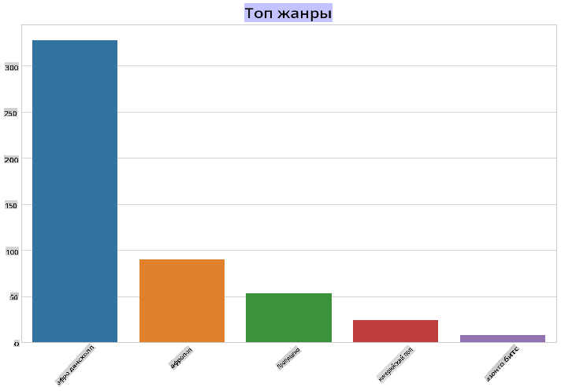
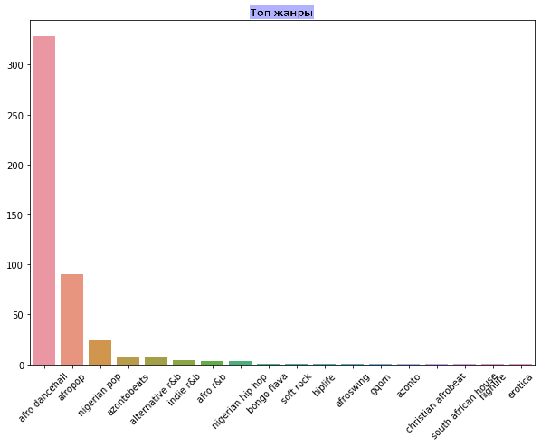
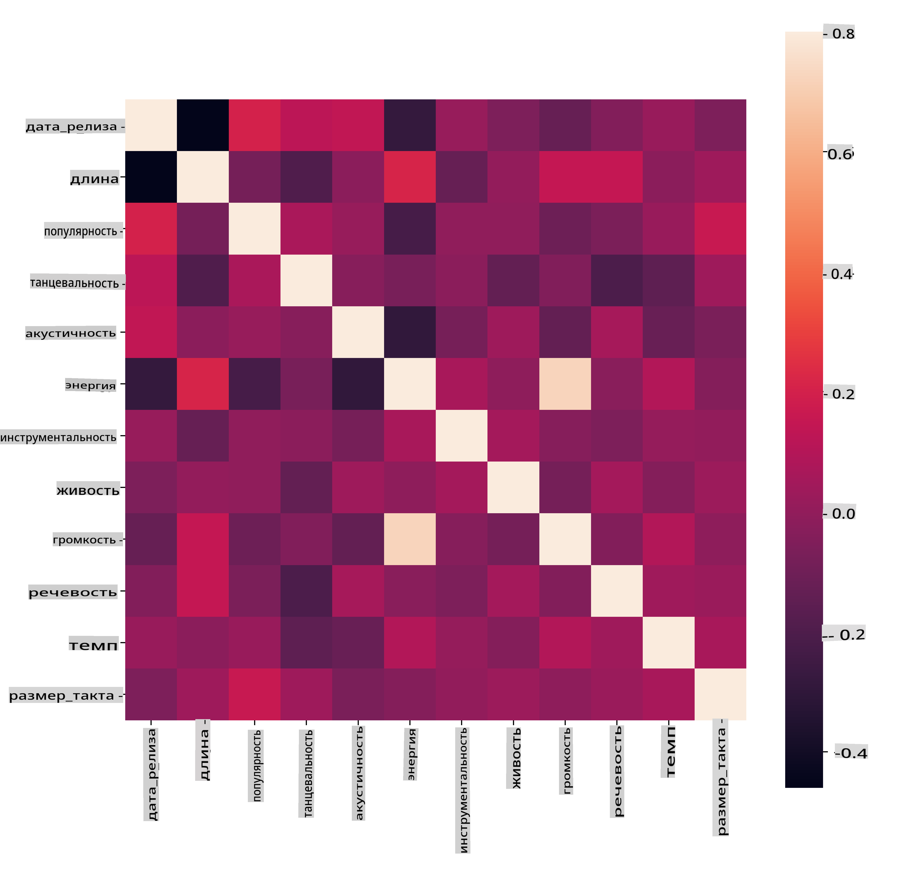
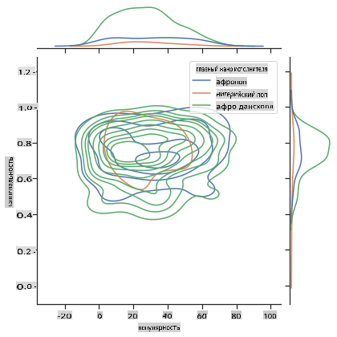
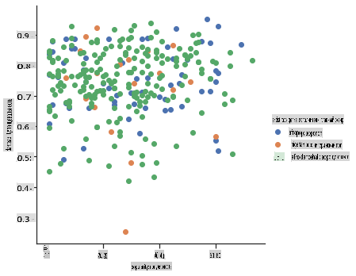

<!--
CO_OP_TRANSLATOR_METADATA:
{
  "original_hash": "0ab69b161efd7a41d325ee28b29415d7",
  "translation_date": "2025-08-29T20:56:34+00:00",
  "source_file": "5-Clustering/1-Visualize/README.md",
  "language_code": "ru"
}
-->
# Введение в кластеризацию

Кластеризация — это вид [обучения без учителя](https://wikipedia.org/wiki/Unsupervised_learning), который предполагает, что набор данных не имеет меток или что его входные данные не связаны с заранее определенными выходными. Она использует различные алгоритмы для анализа немаркированных данных и группировки их на основе выявленных закономерностей.

[](https://youtu.be/ty2advRiWJM "No One Like You by PSquare")

> 🎥 Нажмите на изображение выше, чтобы посмотреть видео. Пока вы изучаете машинное обучение с использованием кластеризации, насладитесь нигерийскими треками в стиле Dance Hall — это высоко оцененная песня 2014 года от PSquare.

## [Тест перед лекцией](https://gray-sand-07a10f403.1.azurestaticapps.net/quiz/27/)

### Введение

[Кластеризация](https://link.springer.com/referenceworkentry/10.1007%2F978-0-387-30164-8_124) очень полезна для исследования данных. Давайте посмотрим, может ли она помочь выявить тенденции и закономерности в том, как нигерийская аудитория потребляет музыку.

✅ Подумайте минуту о применении кластеризации. В реальной жизни кластеризация происходит, когда у вас есть куча белья, и вы сортируете одежду членов вашей семьи 🧦👕👖🩲. В науке о данных кластеризация используется для анализа предпочтений пользователей или определения характеристик любого немаркированного набора данных. Кластеризация, в некотором смысле, помогает навести порядок в хаосе, как в ящике с носками.

[](https://youtu.be/esmzYhuFnds "Introduction to Clustering")

> 🎥 Нажмите на изображение выше, чтобы посмотреть видео: Джон Гуттаг из MIT представляет кластеризацию.

В профессиональной среде кластеризация может использоваться для таких задач, как сегментация рынка, определение возрастных групп, покупающих определенные товары. Другим примером может быть обнаружение аномалий, например, для выявления мошенничества в наборе данных о транзакциях с кредитными картами. Или вы можете использовать кластеризацию для определения опухолей в серии медицинских снимков.

✅ Подумайте минуту о том, как вы могли столкнуться с кластеризацией в реальной жизни, например, в банковской сфере, электронной коммерции или бизнесе.

> 🎓 Интересно, что анализ кластеров возник в области антропологии и психологии в 1930-х годах. Как вы думаете, как он мог использоваться тогда?

Кроме того, кластеризацию можно использовать для группировки результатов поиска — например, по ссылкам на покупки, изображениям или отзывам. Кластеризация полезна, когда у вас есть большой набор данных, который вы хотите уменьшить и на котором хотите провести более детальный анализ. Таким образом, этот метод можно использовать для изучения данных перед построением других моделей.

✅ После того как ваши данные организованы в кластеры, вы присваиваете им идентификатор кластера. Этот метод может быть полезен для сохранения конфиденциальности набора данных: вместо использования более детальных данных вы можете ссылаться на точку данных по ее идентификатору кластера. Можете ли вы придумать другие причины, по которым вы бы использовали идентификатор кластера вместо других элементов кластера для его идентификации?

Углубите свои знания о методах кластеризации в этом [учебном модуле](https://docs.microsoft.com/learn/modules/train-evaluate-cluster-models?WT.mc_id=academic-77952-leestott).

## Начало работы с кластеризацией

[Scikit-learn предлагает широкий выбор](https://scikit-learn.org/stable/modules/clustering.html) методов для выполнения кластеризации. Выбор метода зависит от вашего случая использования. Согласно документации, каждый метод имеет свои преимущества. Вот упрощенная таблица методов, поддерживаемых Scikit-learn, и их подходящих случаев использования:

| Название метода              | Случай использования                                                 |
| :--------------------------- | :------------------------------------------------------------------- |
| K-Means                      | универсальный, индуктивный                                           |
| Affinity propagation         | множество, неравномерные кластеры, индуктивный                      |
| Mean-shift                   | множество, неравномерные кластеры, индуктивный                      |
| Spectral clustering          | немногочисленные, равномерные кластеры, трансдуктивный              |
| Ward hierarchical clustering | множество, ограниченные кластеры, трансдуктивный                    |
| Agglomerative clustering     | множество, ограниченные, неевклидовы расстояния, трансдуктивный     |
| DBSCAN                       | неравномерная геометрия, неравномерные кластеры, трансдуктивный      |
| OPTICS                       | неравномерная геометрия, неравномерные кластеры с переменной плотностью, трансдуктивный |
| Gaussian mixtures            | равномерная геометрия, индуктивный                                  |
| BIRCH                        | большие наборы данных с выбросами, индуктивный                      |

> 🎓 Как мы создаем кластеры, во многом зависит от того, как мы группируем точки данных. Давайте разберем некоторые термины:
>
> 🎓 ['Трансдуктивный' vs. 'индуктивный'](https://wikipedia.org/wiki/Transduction_(machine_learning))
> 
> Трансдуктивный вывод основывается на наблюдаемых обучающих примерах, которые сопоставляются с конкретными тестовыми примерами. Индуктивный вывод основывается на обучающих примерах, которые формируют общие правила, применяемые затем к тестовым примерам.
> 
> Пример: Представьте, что у вас есть набор данных, который частично размечен. Некоторые элементы — это 'пластинки', некоторые — 'CD', а некоторые не имеют меток. Ваша задача — присвоить метки пустым данным. Если вы выберете индуктивный подход, вы обучите модель на 'пластинках' и 'CD' и примените эти метки к немаркированным данным. Этот подход может столкнуться с трудностями при классификации элементов, которые на самом деле являются 'кассетами'. Трансдуктивный подход, напротив, более эффективно работает с неизвестными данными, группируя похожие элементы вместе и затем присваивая метку группе. В этом случае кластеры могут отражать 'круглые музыкальные объекты' и 'квадратные музыкальные объекты'.
> 
> 🎓 ['Неравномерная' vs. 'равномерная' геометрия](https://datascience.stackexchange.com/questions/52260/terminology-flat-geometry-in-the-context-of-clustering)
> 
> Взято из математической терминологии, неравномерная и равномерная геометрия относятся к измерению расстояний между точками с использованием либо 'равномерных' ([евклидовых](https://wikipedia.org/wiki/Euclidean_geometry)), либо 'неевклидовых' методов.
>
>'Равномерная' в данном контексте относится к евклидовой геометрии (части которой изучаются как 'плоская' геометрия), а 'неравномерная' — к неевклидовой геометрии. Как геометрия связана с машинным обучением? Поскольку обе области основаны на математике, должен быть общий способ измерения расстояний между точками в кластерах, и это можно сделать 'равномерным' или 'неравномерным' способом в зависимости от природы данных. [Евклидовы расстояния](https://wikipedia.org/wiki/Euclidean_distance) измеряются как длина отрезка между двумя точками. [Неевклидовы расстояния](https://wikipedia.org/wiki/Non-Euclidean_geometry) измеряются вдоль кривой. Если ваши данные, визуализированные, не лежат на плоскости, вам может понадобиться специализированный алгоритм для их обработки.
>

> Инфографика от [Dasani Madipalli](https://twitter.com/dasani_decoded)
> 
> 🎓 ['Расстояния'](https://web.stanford.edu/class/cs345a/slides/12-clustering.pdf)
> 
> Кластеры определяются их матрицей расстояний, например, расстояниями между точками. Эти расстояния могут измеряться несколькими способами. Евклидовы кластеры определяются средним значением точек и содержат 'центроид' или центральную точку. Расстояния измеряются относительно этого центра. Неевклидовы расстояния относятся к 'кластроидам', точке, ближайшей к другим точкам. Кластроиды, в свою очередь, могут определяться различными способами.
> 
> 🎓 ['Ограниченные'](https://wikipedia.org/wiki/Constrained_clustering)
> 
> [Ограниченная кластеризация](https://web.cs.ucdavis.edu/~davidson/Publications/ICDMTutorial.pdf) вводит элементы 'полу-контролируемого' обучения в этот метод без учителя. Отношения между точками помечаются как 'нельзя связывать' или 'обязательно связывать', чтобы наложить некоторые правила на набор данных.
>
> Пример: Если алгоритм работает с немаркированными или частично маркированными данными, кластеры, которые он создает, могут быть низкого качества. В приведенном выше примере кластеры могут группировать 'круглые музыкальные объекты', 'квадратные музыкальные объекты', 'треугольные объекты' и 'печенье'. Если задать некоторые ограничения или правила ("объект должен быть сделан из пластика", "объект должен уметь воспроизводить музыку"), это поможет алгоритму делать более точные выборы.
> 
> 🎓 'Плотность'
> 
> Данные, которые содержат много шума, считаются 'плотными'. Расстояния между точками в каждом из кластеров могут быть более или менее плотными, или 'заполненными', и такие данные требуют анализа с использованием подходящего метода кластеризации. [Эта статья](https://www.kdnuggets.com/2020/02/understanding-density-based-clustering.html) демонстрирует разницу между использованием алгоритмов K-Means и HDBSCAN для анализа шумного набора данных с неравномерной плотностью кластеров.

## Алгоритмы кластеризации

Существует более 100 алгоритмов кластеризации, и их использование зависит от природы данных. Рассмотрим некоторые из основных:

- **Иерархическая кластеризация**. Если объект классифицируется по его близости к соседнему объекту, а не к более удаленному, кластеры формируются на основе расстояний между их членами. Иерархическая кластеризация в Scikit-learn является агломеративной.

   
   > Инфографика от [Dasani Madipalli](https://twitter.com/dasani_decoded)

- **Кластеризация по центроидам**. Этот популярный алгоритм требует выбора 'k', или количества кластеров, после чего алгоритм определяет центральную точку кластера и группирует данные вокруг нее. [Кластеризация K-средних](https://wikipedia.org/wiki/K-means_clustering) является популярной версией кластеризации по центроидам. Центр определяется ближайшим средним значением, отсюда и название. Квадратное расстояние от кластера минимизируется.

   
   > Инфографика от [Dasani Madipalli](https://twitter.com/dasani_decoded)

- **Кластеризация на основе распределения**. Основанная на статистическом моделировании, кластеризация на основе распределения фокусируется на определении вероятности принадлежности точки данных к кластеру и соответствующем ее назначении. Методы гауссовой смеси относятся к этому типу.

- **Кластеризация на основе плотности**. Точки данных назначаются кластерам на основе их плотности, то есть их группировки друг вокруг друга. Точки данных, удаленные от группы, считаются выбросами или шумом. DBSCAN, Mean-shift и OPTICS относятся к этому типу кластеризации.

- **Кластеризация на основе сетки**. Для многомерных наборов данных создается сетка, и данные распределяются между ячейками сетки, создавая кластеры.

## Упражнение — кластеризуйте свои данные

Кластеризация как метод значительно упрощается при правильной визуализации, поэтому давайте начнем с визуализации наших музыкальных данных. Это упражнение поможет нам решить, какой из методов кластеризации наиболее эффективно использовать для анализа этих данных.

1. Откройте файл [_notebook.ipynb_](https://github.com/microsoft/ML-For-Beginners/blob/main/5-Clustering/1-Visualize/notebook.ipynb) в этой папке.

1. Импортируйте пакет `Seaborn` для качественной визуализации данных.

    ```python
    !pip install seaborn
    ```

1. Загрузите данные о песнях из файла [_nigerian-songs.csv_](https://github.com/microsoft/ML-For-Beginners/blob/main/5-Clustering/data/nigerian-songs.csv). Создайте DataFrame с данными о песнях. Подготовьтесь к исследованию данных, импортировав библиотеки и выведя данные:

    ```python
    import matplotlib.pyplot as plt
    import pandas as pd
    
    df = pd.read_csv("../data/nigerian-songs.csv")
    df.head()
    ```

    Проверьте первые несколько строк данных:

    |     | name                     | album                        | artist              | artist_top_genre | release_date | length | popularity | danceability | acousticness | energy | instrumentalness | liveness | loudness | speechiness | tempo   | time_signature |
    | --- | ------------------------ | ---------------------------- | ------------------- | ---------------- | ------------ | ------ | ---------- | ------------ | ------------ | ------ | ---------------- | -------- | -------- | ----------- | ------- | -------------- |
    | 0   | Sparky                   | Mandy & The Jungle           | Cruel Santino       | alternative r&b  | 2019         | 144000 | 48         | 0.666        | 0.851        | 0.42   | 0.534            | 0.11     | -6.699   | 0.0829      | 133.015 | 5              |
    | 1   | shuga rush               | EVERYTHING YOU HEARD IS TRUE | Odunsi (The Engine) | afropop          | 2020         | 89488  | 30         | 0.71         | 0.0822       | 0.683  | 0.000169         | 0.101    | -5.64    | 0.36        | 129.993 | 3              |
| 2   | LITT!                    | LITT!                        | AYLØ                | indie r&b        | 2018         | 207758 | 40         | 0.836        | 0.272        | 0.564  | 0.000537         | 0.11     | -7.127   | 0.0424      | 130.005 | 4              |
| 3   | Confident / Feeling Cool | Enjoy Your Life              | Lady Donli          | nigerian pop     | 2019         | 175135 | 14         | 0.894        | 0.798        | 0.611  | 0.000187         | 0.0964   | -4.961   | 0.113       | 111.087 | 4              |
| 4   | wanted you               | rare.                        | Odunsi (The Engine) | afropop          | 2018         | 152049 | 25         | 0.702        | 0.116        | 0.833  | 0.91             | 0.348    | -6.044   | 0.0447      | 105.115 | 4              |

1. Получите информацию о датафрейме, вызвав `info()`:

    ```python
    df.info()
    ```

   Вывод будет выглядеть следующим образом:

    ```output
    <class 'pandas.core.frame.DataFrame'>
    RangeIndex: 530 entries, 0 to 529
    Data columns (total 16 columns):
     #   Column            Non-Null Count  Dtype  
    ---  ------            --------------  -----  
     0   name              530 non-null    object 
     1   album             530 non-null    object 
     2   artist            530 non-null    object 
     3   artist_top_genre  530 non-null    object 
     4   release_date      530 non-null    int64  
     5   length            530 non-null    int64  
     6   popularity        530 non-null    int64  
     7   danceability      530 non-null    float64
     8   acousticness      530 non-null    float64
     9   energy            530 non-null    float64
     10  instrumentalness  530 non-null    float64
     11  liveness          530 non-null    float64
     12  loudness          530 non-null    float64
     13  speechiness       530 non-null    float64
     14  tempo             530 non-null    float64
     15  time_signature    530 non-null    int64  
    dtypes: float64(8), int64(4), object(4)
    memory usage: 66.4+ KB
    ```

1. Проверьте наличие пустых значений, вызвав `isnull()` и убедившись, что сумма равна 0:

    ```python
    df.isnull().sum()
    ```

    Все в порядке:

    ```output
    name                0
    album               0
    artist              0
    artist_top_genre    0
    release_date        0
    length              0
    popularity          0
    danceability        0
    acousticness        0
    energy              0
    instrumentalness    0
    liveness            0
    loudness            0
    speechiness         0
    tempo               0
    time_signature      0
    dtype: int64
    ```

1. Описать данные:

    ```python
    df.describe()
    ```

    |       | release_date | length      | popularity | danceability | acousticness | energy   | instrumentalness | liveness | loudness  | speechiness | tempo      | time_signature |
    | ----- | ------------ | ----------- | ---------- | ------------ | ------------ | -------- | ---------------- | -------- | --------- | ----------- | ---------- | -------------- |
    | count | 530          | 530         | 530        | 530          | 530          | 530      | 530              | 530      | 530       | 530         | 530        | 530            |
    | mean  | 2015.390566  | 222298.1698 | 17.507547  | 0.741619     | 0.265412     | 0.760623 | 0.016305         | 0.147308 | -4.953011 | 0.130748    | 116.487864 | 3.986792       |
    | std   | 3.131688     | 39696.82226 | 18.992212  | 0.117522     | 0.208342     | 0.148533 | 0.090321         | 0.123588 | 2.464186  | 0.092939    | 23.518601  | 0.333701       |
    | min   | 1998         | 89488       | 0          | 0.255        | 0.000665     | 0.111    | 0                | 0.0283   | -19.362   | 0.0278      | 61.695     | 3              |
    | 25%   | 2014         | 199305      | 0          | 0.681        | 0.089525     | 0.669    | 0                | 0.07565  | -6.29875  | 0.0591      | 102.96125  | 4              |
    | 50%   | 2016         | 218509      | 13         | 0.761        | 0.2205       | 0.7845   | 0.000004         | 0.1035   | -4.5585   | 0.09795     | 112.7145   | 4              |
    | 75%   | 2017         | 242098.5    | 31         | 0.8295       | 0.403        | 0.87575  | 0.000234         | 0.164    | -3.331    | 0.177       | 125.03925  | 4              |
    | max   | 2020         | 511738      | 73         | 0.966        | 0.954        | 0.995    | 0.91             | 0.811    | 0.582     | 0.514       | 206.007    | 5              |

> 🤔 Если мы работаем с кластеризацией, методом без учителя, который не требует размеченных данных, зачем мы показываем эти данные с метками? На этапе исследования данных они полезны, но для работы алгоритмов кластеризации они не обязательны. Можно просто удалить заголовки столбцов и ссылаться на данные по номеру столбца.

Посмотрите на общие значения данных. Обратите внимание, что популярность может быть равна '0', что показывает песни без рейтинга. Давайте вскоре удалим их.

1. Используйте столбчатую диаграмму, чтобы узнать самые популярные жанры:

    ```python
    import seaborn as sns
    
    top = df['artist_top_genre'].value_counts()
    plt.figure(figsize=(10,7))
    sns.barplot(x=top[:5].index,y=top[:5].values)
    plt.xticks(rotation=45)
    plt.title('Top genres',color = 'blue')
    ```

    

✅ Если хотите увидеть больше топовых значений, измените `[:5]` на большее значение или удалите его, чтобы увидеть все.

Обратите внимание, что если топовый жанр описан как 'Missing', это означает, что Spotify не классифицировал его, поэтому давайте удалим его.

1. Удалите отсутствующие данные, отфильтровав их:

    ```python
    df = df[df['artist_top_genre'] != 'Missing']
    top = df['artist_top_genre'].value_counts()
    plt.figure(figsize=(10,7))
    sns.barplot(x=top.index,y=top.values)
    plt.xticks(rotation=45)
    plt.title('Top genres',color = 'blue')
    ```

    Теперь проверьте жанры снова:

    

1. Три топовых жанра явно доминируют в этом наборе данных. Давайте сосредоточимся на `afro dancehall`, `afropop` и `nigerian pop`, дополнительно отфильтруем набор данных, чтобы удалить все с популярностью 0 (что означает, что они не были классифицированы по популярности в наборе данных и могут считаться шумом для наших целей):

    ```python
    df = df[(df['artist_top_genre'] == 'afro dancehall') | (df['artist_top_genre'] == 'afropop') | (df['artist_top_genre'] == 'nigerian pop')]
    df = df[(df['popularity'] > 0)]
    top = df['artist_top_genre'].value_counts()
    plt.figure(figsize=(10,7))
    sns.barplot(x=top.index,y=top.values)
    plt.xticks(rotation=45)
    plt.title('Top genres',color = 'blue')
    ```

1. Проведите быстрый тест, чтобы увидеть, есть ли сильная корреляция данных:

    ```python
    corrmat = df.corr(numeric_only=True)
    f, ax = plt.subplots(figsize=(12, 9))
    sns.heatmap(corrmat, vmax=.8, square=True)
    ```

    

    Единственная сильная корреляция — между `energy` и `loudness`, что неудивительно, учитывая, что громкая музыка обычно довольно энергична. В остальном корреляции относительно слабые. Будет интересно посмотреть, что алгоритм кластеризации сможет сделать с этими данными.

    > 🎓 Помните, что корреляция не означает причинно-следственную связь! У нас есть доказательства корреляции, но нет доказательств причинности. [Забавный сайт](https://tylervigen.com/spurious-correlations) содержит визуализации, которые подчеркивают эту мысль.

Есть ли в этом наборе данных сходство между популярностью песни и её танцевальностью? FacetGrid показывает концентрические круги, которые совпадают, независимо от жанра. Может быть, вкусы нигерийцев сходятся на определённом уровне танцевальности для этого жанра?

✅ Попробуйте разные точки данных (energy, loudness, speechiness) и больше или другие музыкальные жанры. Что вы можете обнаружить? Посмотрите таблицу `df.describe()`, чтобы увидеть общий разброс точек данных.

### Упражнение - распределение данных

Сильно ли отличаются эти три жанра в восприятии их танцевальности, основываясь на их популярности?

1. Исследуйте распределение данных по популярности и танцевальности для наших трёх топовых жанров вдоль заданных осей x и y.

    ```python
    sns.set_theme(style="ticks")
    
    g = sns.jointplot(
        data=df,
        x="popularity", y="danceability", hue="artist_top_genre",
        kind="kde",
    )
    ```

    Вы можете обнаружить концентрические круги вокруг общей точки сходства, показывающие распределение точек.

    > 🎓 Обратите внимание, что в этом примере используется график KDE (оценка плотности ядра), который представляет данные с помощью непрерывной кривой плотности вероятности. Это позволяет интерпретировать данные при работе с несколькими распределениями.

    В целом, три жанра примерно совпадают по популярности и танцевальности. Определение кластеров в этих слабо связанных данных будет сложной задачей:

    

1. Создайте диаграмму рассеяния:

    ```python
    sns.FacetGrid(df, hue="artist_top_genre", height=5) \
       .map(plt.scatter, "popularity", "danceability") \
       .add_legend()
    ```

    Диаграмма рассеяния по тем же осям показывает похожую картину сходства.

    

В целом, для кластеризации можно использовать диаграммы рассеяния, чтобы показать кластеры данных, поэтому освоение этого типа визуализации очень полезно. В следующем уроке мы возьмём эти отфильтрованные данные и используем кластеризацию методом k-средних, чтобы обнаружить группы в этих данных, которые пересекаются интересным образом.

---

## 🚀Задание

В рамках подготовки к следующему уроку составьте таблицу о различных алгоритмах кластеризации, которые вы можете изучить и использовать в производственной среде. Какие проблемы пытается решить кластеризация?

## [Тест после лекции](https://gray-sand-07a10f403.1.azurestaticapps.net/quiz/28/)

## Обзор и самостоятельное изучение

Перед применением алгоритмов кластеризации, как мы узнали, важно понять природу вашего набора данных. Подробнее об этом можно прочитать [здесь](https://www.kdnuggets.com/2019/10/right-clustering-algorithm.html).

[Эта полезная статья](https://www.freecodecamp.org/news/8-clustering-algorithms-in-machine-learning-that-all-data-scientists-should-know/) объясняет, как различные алгоритмы кластеризации работают с разными формами данных.

## Задание

[Изучите другие визуализации для кластеризации](assignment.md)

---

**Отказ от ответственности**:  
Этот документ был переведен с использованием сервиса автоматического перевода [Co-op Translator](https://github.com/Azure/co-op-translator). Хотя мы стремимся к точности, пожалуйста, имейте в виду, что автоматические переводы могут содержать ошибки или неточности. Оригинальный документ на его исходном языке следует считать авторитетным источником. Для получения критически важной информации рекомендуется профессиональный перевод человеком. Мы не несем ответственности за любые недоразумения или неправильные интерпретации, возникшие в результате использования данного перевода.