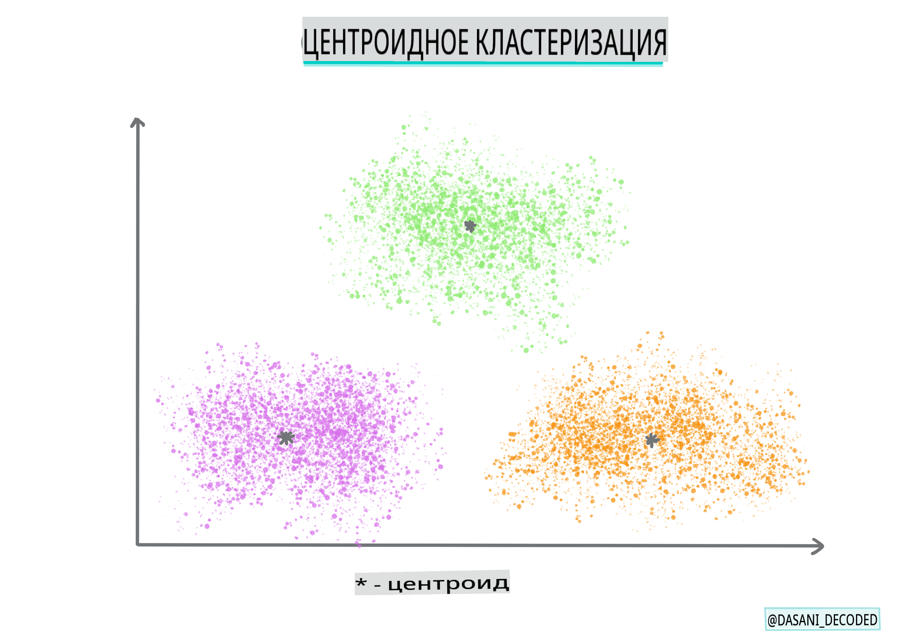

# Введение в кластеризацию

Кластеризация — это тип [неконтролируемого обучения](https://wikipedia.org/wiki/Unsupervised_learning), который предполагает, что набор данных не имеет меток или что его входные данные не соответствуют заранее определенным выходным данным. Она использует различные алгоритмы для сортировки неразмеченных данных и предоставления группировок в соответствии с паттернами, которые она обнаруживает в данных.

[](https://youtu.be/ty2advRiWJM "No One Like You by PSquare")

> 🎥 Нажмите на изображение выше для просмотра видео. Пока вы изучаете машинное обучение с помощью кластеризации, насладитесь некоторыми нигерийскими танцевальными треками — это высоко оцененная песня 2014 года от PSquare.
## [Викторина перед лекцией](https://gray-sand-07a10f403.1.azurestaticapps.net/quiz/27/)
### Введение

[Кластеризация](https://link.springer.com/referenceworkentry/10.1007%2F978-0-387-30164-8_124) очень полезна для исследования данных. Давайте посмотрим, может ли она помочь выявить тенденции и паттерны в том, как нигерийская аудитория потребляет музыку.

✅ Потратьте минуту, чтобы подумать о применении кластеризации. В реальной жизни кластеризация происходит всякий раз, когда у вас есть куча белья, и вам нужно отсортировать одежду членов вашей семьи 🧦👕👖🩲. В науке о данных кластеризация происходит при попытке проанализировать предпочтения пользователя или определить характеристики любого неразмеченного набора данных. Кластеризация, по сути, помогает разобраться в хаосе, как ящик для носок.

[](https://youtu.be/esmzYhuFnds "Введение в кластеризацию")

> 🎥 Нажмите на изображение выше для просмотра видео: Джон Гуттаг из MIT представляет кластеризацию.

В профессиональной среде кластеризация может использоваться для определения таких вещей, как сегментация рынка, определение возрастных групп, которые покупают те или иные товары. Другим примером использования может быть обнаружение аномалий, возможно, для выявления мошенничества по набору данных кредитных карточек. Или вы можете использовать кластеризацию для определения опухолей в партии медицинских сканирований.

✅ Подумайте минуту о том, как вы могли столкнуться с кластеризацией в реальной жизни, в банковской, электронной коммерции или бизнесе.

> 🎓 Интересно, что кластерный анализ возник в областях антропологии и психологии в 1930-х годах. Можете ли вы представить, как он мог быть использован?

Кроме того, вы можете использовать его для группировки результатов поиска — по ссылкам для покупок, изображениям или отзывам, например. Кластеризация полезна, когда у вас есть большой набор данных, который вы хотите сократить и на котором хотите провести более детальный анализ, поэтому эта техника может быть использована для изучения данных перед тем, как будут построены другие модели.

✅ После того как ваши данные организованы в кластеры, вы присваиваете им идентификатор кластера, и эта техника может быть полезна для сохранения конфиденциальности набора данных; вы можете вместо этого ссылаться на точку данных по ее идентификатору кластера, а не по более раскрывающим идентифицируемым данным. Можете ли вы подумать о других причинах, почему вы бы ссылались на идентификатор кластера, а не на другие элементы кластера для его идентификации?

Углубите свои знания о техниках кластеризации в этом [учебном модуле](https://docs.microsoft.com/learn/modules/train-evaluate-cluster-models?WT.mc_id=academic-77952-leestott)
## Начало работы с кластеризацией

[Scikit-learn предлагает широкий выбор](https://scikit-learn.org/stable/modules/clustering.html) методов для выполнения кластеризации. Тип, который вы выберете, будет зависеть от вашего случая использования. Согласно документации, каждый метод имеет различные преимущества. Вот упрощенная таблица методов, поддерживаемых Scikit-learn, и их соответствующих случаев использования:

| Название метода               | Случай использования                                                    |
| :---------------------------- | :--------------------------------------------------------------------- |
| K-Means                       | общего назначения, индуктивный                                       |
| Пропаганда сродства          | много, неравномерные кластеры, индуктивный                         |
| Mean-shift                    | много, неравномерные кластеры, индуктивный                         |
| Спектральная кластеризация   | немного, равномерные кластеры, трансдуктивный                       |
| Иерархическая кластеризация   | много, ограниченные кластеры, трансдуктивный                       |
| Агломеративная кластеризация | много, ограниченные, неевклидовые расстояния, трансдуктивный       |
| DBSCAN                        | неравномерная геометрия, неравномерные кластеры, трансдуктивный    |
| OPTICS                        | неравномерная геометрия, неравномерные кластеры с переменной плотностью, трансдуктивный |
| Гауссовские смеси            | плоская геометрия, индуктивный                                       |
| BIRCH                         | большой набор данных с выбросами, индуктивный                       |

> 🎓 То, как мы создаем кластеры, во многом зависит от того, как мы собираем точки данных в группы. Давайте разберем некоторые термины:
>
> 🎓 ['Трансдуктивный' против 'индуктивного'](https://wikipedia.org/wiki/Transduction_(machine_learning))
> 
> Трансдуктивное вывод — это вывод, основанный на наблюдаемых обучающих случаях, которые соответствуют конкретным тестовым случаям. Индуктивное вывод — это вывод, основанный на обучающих случаях, которые соответствуют общим правилам, которые затем применяются к тестовым случаям.
> 
> Пример: представьте, что у вас есть набор данных, который частично размечен. Некоторые элементы — это 'пластинки', некоторые — 'CD', а некоторые — пустые. Ваша задача — предоставить метки для пустых. Если вы выберете индуктивный подход, вы будете обучать модель, ищущую 'пластинки' и 'CD', и примените эти метки к вашим неразмеченным данным. Этот подход будет иметь проблемы с классификацией вещей, которые на самом деле являются 'кассетами'. Трансдуктивный подход, с другой стороны, более эффективно обрабатывает эти неизвестные данные, так как он работает над группировкой похожих элементов вместе, а затем применяет метку к группе. В этом случае кластеры могут отражать 'круглые музыкальные вещи' и 'квадратные музыкальные вещи'.
> 
> 🎓 ['Не плоская' против 'плоской' геометрии](https://datascience.stackexchange.com/questions/52260/terminology-flat-geometry-in-the-context-of-clustering)
> 
> Происходя из математической терминологии, не плоская и плоская геометрия относится к измерению расстояний между точками с помощью либо 'плоских' ([евклидовых](https://wikipedia.org/wiki/Euclidean_geometry)), либо 'неплоских' (неевклидовых) геометрических методов.
>
> 'Плоская' в этом контексте относится к евклидовой геометрии (части которой преподаются как 'плоскостная' геометрия), а неплоская относится к неевклидовой геометрии. Какое отношение имеет геометрия к машинному обучению? Что ж, как две области, основанные на математике, должно быть общее средство измерения расстояний между точками в кластерах, и это можно сделать 'плоским' или 'неплоским' способом, в зависимости от природы данных. [Евклидовы расстояния](https://wikipedia.org/wiki/Euclidean_distance) измеряются как длина отрезка между двумя точками. [Неевклидовы расстояния](https://wikipedia.org/wiki/Non-Euclidean_geometry) измеряются вдоль кривой. Если ваши данные, визуализированные, кажутся не существующими на плоскости, вам может потребоваться использовать специализированный алгоритм для их обработки.
>

> Инфографика от [Dasani Madipalli](https://twitter.com/dasani_decoded)
> 
> 🎓 ['Расстояния'](https://web.stanford.edu/class/cs345a/slides/12-clustering.pdf)
> 
> Кластеры определяются их матрицей расстояний, т.е. расстояниями между точками. Это расстояние можно измерять несколькими способами. Евклидовы кластеры определяются средним значением значений точек и содержат 'центроид' или центральную точку. Таким образом, расстояния измеряются по отношению к этому центроиду. Неевклидовы расстояния относятся к 'кластроидам', точке, ближайшей к другим точкам. Кластроиды, в свою очередь, могут быть определены различными способами.
> 
> 🎓 ['Ограниченные'](https://wikipedia.org/wiki/Constrained_clustering)
> 
> [Ограниченная кластеризация](https://web.cs.ucdavis.edu/~davidson/Publications/ICDMTutorial.pdf) вводит 'полу-контролируемое' обучение в этот неконтролируемый метод. Связи между точками помечаются как 'не могут быть связаны' или 'должны быть связаны', поэтому на набор данных накладываются некоторые правила.
>
> Пример: если алгоритм запускается на партии неразмеченных или полуразмеченных данных, кластеры, которые он производит, могут быть низкого качества. В приведенном выше примере кластеры могут группировать 'круглые музыкальные вещи', 'квадратные музыкальные вещи' и 'треугольные вещи' и 'печенье'. Если задать некоторые ограничения или правила ("предмет должен быть сделан из пластика", "предмет должен уметь производить музыку"), это может помочь 'ограничить' алгоритм, чтобы он делал лучшие выборы.
> 
> 🎓 'Плотность'
> 
> Данные, которые являются 'шумными', считаются 'плотными'. Расстояния между точками в каждом из кластеров могут оказаться, при проверке, более или менее плотными или 'переполненными', и поэтому эти данные необходимо анализировать с использованием соответствующего метода кластеризации. [Эта статья](https://www.kdnuggets.com/2020/02/understanding-density-based-clustering.html) демонстрирует разницу между использованием алгоритмов K-Means и HDBSCAN для изучения шумного набора данных с неравномерной плотностью кластеров.

## Алгоритмы кластеризации

Существует более 100 алгоритмов кластеризации, и их использование зависит от природы имеющихся данных. Давайте обсудим некоторые из основных:

- **Иерархическая кластеризация**. Если объект классифицируется по близости к близлежащему объекту, а не к более удаленному, кластеры формируются на основе расстояния их членов к другим объектам. Агломеративная кластеризация Scikit-learn является иерархической.

   
   > Инфографика от [Dasani Madipalli](https://twitter.com/dasani_decoded)

- **Кластеризация по центроиду**. Этот популярный алгоритм требует выбора 'k', или количества кластеров, которые нужно сформировать, после чего алгоритм определяет центральную точку кластера и собирает данные вокруг этой точки. [Кластеризация K-средних](https://wikipedia.org/wiki/K-means_clustering) является популярной версией кластеризации по центроиду. Центр определяется ближайшим средним значением, отсюда и название. Квадрат расстояния от кластера минимизируется.

   
   > Инфографика от [Dasani Madipalli](https://twitter.com/dasani_decoded)

- **Кластеризация на основе распределения**. Основанная на статистическом моделировании, кластеризация на основе распределения сосредотачивается на определении вероятности того, что точка данных принадлежит кластеру, и присвоении ее соответственно. Методы гауссовских смесей относятся к этому типу.

- **Кластеризация на основе плотности**. Точки данных присваиваются кластерам на основе их плотности или их группировки друг вокруг друга. Точки данных, находящиеся далеко от группы, считаются выбросами или шумом. DBSCAN, Mean-shift и OPTICS относятся к этому типу кластеризации.

- **Кластеризация на основе сетки**. Для многомерных наборов данных создается сетка, и данные распределяются между ячейками сетки, тем самым создавая кластеры.

## Упражнение - кластеризуйте ваши данные

Кластеризация как техника значительно выигрывает от надлежащей визуализации, поэтому давайте начнем с визуализации наших музыкальных данных. Это упражнение поможет нам решить, какой из методов кластеризации мы должны использовать наиболее эффективно для данного набора данных.

1. Откройте файл [_notebook.ipynb_](https://github.com/microsoft/ML-For-Beginners/blob/main/5-Clustering/1-Visualize/notebook.ipynb) в этой папке.

1. Импортируйте пакет `Seaborn` для хорошей визуализации данных.

    ```python
    !pip install seaborn
    ```

1. Добавьте данные о песнях из [_nigerian-songs.csv_](https://github.com/microsoft/ML-For-Beginners/blob/main/5-Clustering/data/nigerian-songs.csv). Загрузите датафрейм с некоторыми данными о песнях. Подготовьтесь к исследованию этих данных, импортировав библиотеки и выгрузив данные:

    ```python
    import matplotlib.pyplot as plt
    import pandas as pd
    
    df = pd.read_csv("../data/nigerian-songs.csv")
    df.head()
    ```

    Проверьте первые несколько строк данных:

    |     | name                     | album                        | artist              | artist_top_genre | release_date | length | popularity | danceability | acousticness | energy | instrumentalness | liveness | loudness | speechiness | tempo   | time_signature |
    | --- | ------------------------ | ---------------------------- | ------------------- | ---------------- | ------------ | ------ | ---------- | ------------ | ------------ | ------ | ---------------- | -------- | -------- | ----------- | ------- | -------------- |
    | 0   | Sparky                   | Mandy & The Jungle           | Cruel Santino       | alternative r&b  | 2019         | 144000 | 48         | 0.666        | 0.851        | 0.42   | 0.534            | 0.11     | -6.699   | 0.0829      | 133.015 | 5              |
    | 1   | shuga rush               | EVERYTHING YOU HEARD IS TRUE | Odunsi (The Engine) | afropop          | 2020         | 89488  | 30         | 0.71         | 0.0822       | 0.683  | 0.000169         | 0.101    | -5.64    | 0.36        | 129.993 | 3              |
    | 2   | LITT!                    | LITT!                        | AYLØ                | indie r&b        | 2018         | 207758 | 40         | 0.836        | 0.272        | 0.564  | 0.000537         | 0.11     | -7.127   | 0.0424      | 130.005 | 4              |
    | 3   | Confident / Feeling Cool | Enjoy Your Life              | Lady Donli          | nigerian pop     | 2019         | 175135 | 14         | 0.894        | 0.798        | 0.611  | 0.000187         | 0.0964   | -4.961   | 0.113       | 111.087 | 4              |
    | 4   | wanted you               | rare.                        | Odunsi (The Engine) | afropop          | 2018         | 152049 | 25         | 0.702        | 0.116        | 0.833  | 0.91             | 0.348    | -6.044   | 0.0447      | 105.115 | 4              |

1. Получите информацию о датафрейме, вызвав `info()`:

    ```python
    df.info()
    ```

   Вывод должен выглядеть так:

    ```output
    <class 'pandas.core.frame.DataFrame'>
    RangeIndex: 530 entries, 0 to 529
    Data columns (total 16 columns):
     #   Column            Non-Null Count  Dtype  
    ---  ------            --------------  -----  
     0   name              530 non-null    object 
     1   album             530 non-null    object 
     2   artist            530 non-null    object 
     3   artist_top_genre  530 non-null    object 
     4   release_date      530 non-null    int64  
     5   length            530 non-null    int64  
     6   popularity        530 non-null    int64  
     7   danceability      530 non-null    float64
     8   acousticness      530 non-null    float64
     9   energy            530 non-null    float64
     10  instrumentalness  530 non-null    float64
     11  liveness          530 non-null    float64
     12  loudness          530 non-null    float64
     13  speechiness       530 non-null    float64
     14  tempo             530 non-null    float64
     15  time_signature    530 non-null    int64  
    dtypes: float64(8), int64(4), object(4)
    memory usage: 66.4+ KB
    ```

1. Дважды проверьте наличие нулевых значений, вызвав `isnull()` и проверив, что сумма равна 0:

    ```python
    df.isnull().sum()
    ```

    Все выглядит хорошо:

    ```output
    name                0
    album               0
    artist              0
    artist_top_genre    0
    release_date        0
    length              0
    popularity          0
    danceability        0
    acousticness        0
    energy              0
    instrumentalness    0
    liveness            0
    loudness            0
    speechiness         0
    tempo               0
    time_signature      0
    dtype: int64
    ```

1. Опишите данные:

    ```python
    df.describe()
    ```

    |       | release_date | length      | popularity | danceability | acousticness | energy   | instrumentalness | liveness | loudness  | speechiness | tempo      | time_signature |
    | ----- | ------------ | ----------- | ---------- | ------------ | ------------ | -------- | ---------------- | -------- | --------- | ----------- | ---------- | -------------- |
    | count | 530          | 530         | 530        | 530          | 530          | 530      | 530              | 530      | 530       | 530         | 530        | 530            |
    | mean  | 2015.390566  | 
## [Викторина после лекции](https://gray-sand-07a10f403.1.azurestaticapps.net/quiz/28/)

## Обзор и самостоятельное изучение

Прежде чем применять алгоритмы кластеризации, как мы уже узнали, полезно понять природу вашего набора данных. Подробнее об этом можно прочитать [здесь](https://www.kdnuggets.com/2019/10/right-clustering-algorithm.html)

[Эта полезная статья](https://www.freecodecamp.org/news/8-clustering-algorithms-in-machine-learning-that-all-data-scientists-should-know/) знакомит вас с различными способами поведения различных алгоритмов кластеризации в зависимости от форм данных.

## Задание

[Исследуйте другие визуализации для кластеризации](assignment.md)

**Отказ от ответственности**:  
Этот документ был переведен с использованием услуг машинного перевода на основе ИИ. Хотя мы стремимся к точности, имейте в виду, что автоматические переводы могут содержать ошибки или неточности. Оригинальный документ на родном языке следует считать авторитетным источником. Для критически важной информации рекомендуется профессиональный перевод человеком. Мы не несем ответственности за любые недоразумения или неверные толкования, возникающие в результате использования этого перевода.